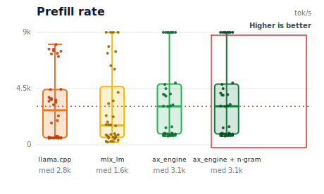
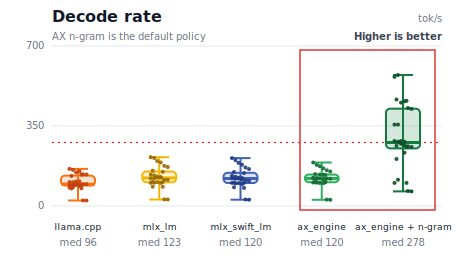
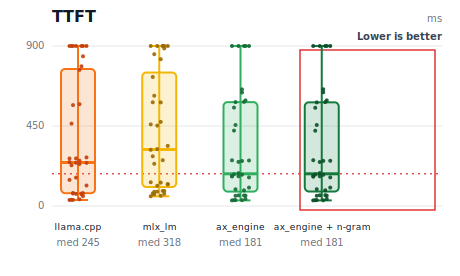

# AX Engine

### Faster Inference: Prefill, Decode, and TTFT

<table>
<tr>
<td align="center"><strong>Prefill rate</strong></td>
<td align="center"><strong>Decode rate</strong></td>
<td align="center"><strong>TTFT</strong></td>
</tr>
<tr>
<td></td>
<td></td>
<td></td>
</tr>
</table>

AX Engine is a Mac-first LLM inference runtime, local server, SDK layer, and
benchmark toolkit for Apple Silicon.

AX Engine runs supported Apple Silicon model families on MLX, and keeps
unsupported or non-MLX models reachable through explicit `mlx-lm` and
`llama.cpp` compatibility routes. Users get one AX server, SDK, and benchmark
surface while model coverage grows.

> Requires **macOS 14 (Sonoma) or later** on **Apple Silicon M2 Max or newer** with **32 GB RAM minimum**.
> Rust 1.85+ for source builds.

### Supported Hardware

AX Engine targets high-memory Apple Silicon Macs running **macOS 14 (Sonoma) or later**.

| Machine | Minimum spec | Suggested spec |
|---|---|---|
| Mac Mini | M4 Pro, 32 GB | M4 Pro, 64 GB |
| MacBook Pro 14″ / 16″ | M2 Pro / M2 Max, 32 GB | M3 Max, 96 GB |
| Mac Studio | M2 Max / M2 Ultra, 32 GB | M4 Max, 96 GB |

M3, M4, M5 chip variants are supported across all three lines. M1 is not supported. M2 base chip (max 24 GB) is below the 32 GB minimum.

## 30-Second Setup

Install the released command-line tools and open the local web manager:

```bash
brew install defai-digital/ax-engine/ax-engine
ax-engine-manager --check
ax-engine-manager
```

Then connect it to a model and server:

```bash
# Download an mlx-community model and generate its manifest in one step
MODEL_DIR="$(python3 scripts/download_model.py mlx-community/Qwen3-4B-4bit --json | python3 -c 'import json,sys; print(json.load(sys.stdin)["dest"])')"

# Start the server
ax-engine-server --mlx --mlx-model-artifacts-dir "$MODEL_DIR" --port 8080

# In another terminal, open the web manager with live server metadata
ax-engine-manager --model-dir "$MODEL_DIR" --server-url http://127.0.0.1:8080
```

The manager opens a localhost page with model type, family, and size dropdowns,
a `[Download]` action, server port controls, and full local endpoint URLs.

Or from Python (after `maturin develop` or `pip install ax-engine`):

```python
from ax_engine import download_model, Session
path = download_model("mlx-community/Qwen3-4B-4bit")
with Session(mlx=True, mlx_model_artifacts_dir=str(path)) as s:
    print(s.generate([1, 2, 3], max_output_tokens=8).output_tokens)
```

`download_model()` downloads weights and auto-runs `ax-engine-bench generate-manifest`.
See [Getting a Model](#getting-a-model) for all paths including raw HF checkpoints,
and see [AX Engine Manager](docs/MANAGER.md) for the full web workflow.

## Why AX Engine

AX Engine gives local inference work a stable runtime contract:

- `ax-engine-server` exposes a local HTTP adapter over the runtime.
- `ax-engine-bench` records workload contracts, route identity, correctness,
  determinism, and performance evidence.
- `ax-engine-sdk`, Python bindings, and the JavaScript client provide
  thin integration surfaces over the same backend-resolution rules.
- Repo-owned MLX execution is optimized for supported Qwen and Gemma families.
- Delegated `mlx_lm.server` and `llama.cpp` routes cover explicit
  compatibility cases without turning delegated results into AX-owned
  throughput claims.

[mlx_lm](https://github.com/ml-explore/mlx-lm) and
[mlx-swift-lm](https://github.com/ml-explore/mlx-swift) remain the canonical
MLX references. AX Engine compares against them, uses them as compatibility
routes when needed, and owns the runtime layer around supported workloads:
request lifecycle, scheduling, KV/cache policy, n-gram acceleration, and
auditable benchmark artifacts.

For supported transformer families on Apple Silicon, the AX-owned runtime layer
can produce higher effective throughput than the reference MLX runtimes on
matching benchmark shapes:

- **N-gram acceleration** reaches up to 3.1x mlx_lm decode
  throughput on high-hit benchmark rows — with no second draft model and no
  model changes
- **Coding-shaped decode is a natural fit when local repetition exists**:
  completion, edit loops, structured diffs, JSON/tool output, imports,
  indentation, and repeated identifiers often contain patterns that n-gram
  acceleration can predict and the target model can verify. Novel, high-entropy,
  or very short coding requests may see little or no gain.
- **AX-owned request lifecycle** provides deterministic, auditable scheduling,
  KV block management, and prefix reuse that upstream Python runtimes do not
  expose as stable contracts
- **workload-contract tooling** (`ax-engine-bench`) validates correctness,
  determinism, route identity, and regression across checked-in manifests, not
  just throughput snapshots

The claim is not that AX has faster MLX tensor kernels. MLX still compiles and
executes the model graph. AX improves the runtime behavior above MLX: how
tokens are speculated, how requests are scheduled, and how KV state is
materialized. That runtime layer is what produces higher effective throughput
on supported workloads.

## v4.8.0 Serving Roadmap

AX Engine v4.8.0 moves more serving-oriented runtime work into the open source
engine and adopts the Apache License, Version 2.0 for that next phase. The
focus is better local serving ability on Apple Silicon while keeping benchmark
claims evidence-backed and route-specific.

The next optimization tracks are:

- **KV cache memory layout**: paged or block-aligned KV storage, better
  per-layer locality, fewer KV copies or transposes, and cache reuse between
  speculative draft and target verification paths.
- **Apple unified memory advantage**: zero-copy weight mapping,
  memory-mapped quantized weights, direct Metal buffer reuse, fewer temporary
  tensor materializations, and persistent request buffers to improve cold
  start, TTFT, and memory pressure.
- **MoE expert locality optimization**: expert-weight cache scheduling, token
  grouping by expert, lower dispatch overhead, likely-expert prefetching,
  router/dispatch fusion, and top-k routing memory-pattern tuning.
- **Speculative decoding software tuning**: adaptive n-gram length, dynamic
  draft windows, acceptance-rate prediction, fallback thresholds,
  prompt-pattern-aware speculation, and better cache sharing between draft and
  verify paths.
- **Kernel fusion and quantization path**: fused RMSNorm/matmul, attention
  projection fusion, fused dequant/matmul, group-wise quantization kernels,
  Apple AMX/Metal mixed paths, and prepacked weight layouts.

## Runtime Paths

| Path | Use it for | Current scope |
|---|---|---|
| Repo-owned MLX runtime | Supported Qwen/Gemma MLX model artifacts and repo-owned performance claims | Local Apple Silicon inference, token-based server/SDK requests, benchmarked direct and n-gram acceleration modes |
| `mlx_lm_delegated` | MLX text models that upstream `mlx-lm` supports before AX has a repo-owned graph | Blocking and SSE text generation through a user-provided `mlx_lm.server`; `/v1/generate`, `/v1/generate/stream`, and OpenAI-compatible completion/chat text endpoints. Streaming is delegated text compatibility evidence, not repo-owned token/KV performance |
| `llama_cpp` | GGUF and non-MLX local inference | Delegated llama.cpp server/CLI compatibility; route-contract evidence, not repo-owned MLX throughput |

The runtime report exposes `selected_backend`, `support_tier`, and
`resolution_policy` so callers and benchmark artifacts can distinguish these
paths.

For the exact OpenAI-shaped endpoint contract, including what is and is not
compatible today, see `docs/API-COMPATIBILITY.md`.

## Design

### Execution Layer

The repo-owned MLX path uses MLX directly for tensor operations via the official
`mlx-c` C API. Matrix multiply, quantized matmul, attention, RMSNorm, and RoPE
go through MLX's Apple-maintained Metal kernels. AX owns the runtime behavior
above that graph.

What AX Engine adds around model execution:

- **N-gram acceleration**: a bigram/trigram table built at runtime predicts
  up to 4 draft tokens per step. The target model verifies them in one forward
  pass over `[last_token, D1, …, D_n]`. An EMA accept-rate gate (α=0.1,
  threshold 0.5) disables acceleration after a bad sequence and re-enables when
  the table recovers. No second draft model required.
- **Scheduler and KV manager**: request lifecycle, batching, memory-blocked
  recovery, and execution planning live in `ax-engine-core` — deterministic,
  async-free, no framework dependencies. See [`docs/SCHEDULER.md`](docs/SCHEDULER.md)
  and [`docs/KV-CACHE.md`](docs/KV-CACHE.md) for design details.
- **Chunked KV cache**: keys and values grow in pre-allocated backing buffers via
  `slice_update`. Draft rollback is O(1) — only the sequence-length
  pointer moves. After each decode step, all KV buffers are evaluated with the
  output token to flatten the lazy-eval graph and prevent O(N²) graph depth.
- **Graph compilation**: `mlx_enable_compile()` is called once at startup so
  Metal shader compilation and dispatch tables are reused across steps with the
  same shape — equivalent to `mx.compile()` in mlx_lm.
- **GatedDelta linear attention**: hybrid architectures (Qwen3.5, Qwen3-Next)
  use a custom SIMD-group Metal kernel for the recurrent GatedDelta state update.
  All other ops in the same models (dense attention, FFN, projections) delegate
  to MLX's hardware-optimized paths.

### Memory Layer

`mlx_set_wired_limit(recommendedMaxWorkingSetSize)` wires model weights into GPU
memory at startup, preventing Metal from paging them between requests. A
dedicated GPU stream avoids cross-stream synchronization on the shared default
stream.

See [`docs/KV-CACHE.md`](docs/KV-CACHE.md) for a detailed description of the
two-layer KV cache architecture, prefix caching coordination, model-specific
cache variants, and memory pressure handling.

## Supported Models

| Family | Model | Architecture notes |
|---|---|---|
| Gemma 4 | gemma-4-e2b-it, gemma-4-e4b-it, gemma-4-26b-a4b-it, gemma-4-31b-it | Dense, per-layer embedding, and MoE variants; MLX affine 4/5/6/8-bit weights, sliding-window + full attention, K=V full-attention layers, logit softcapping |
| Qwen 3.5 | Qwen3.5-9B | Linear attention + MoE FFN, attn_output_gate per-head interleaving |
| Qwen 3.6 / Coder Next | Qwen3.6-35B-A3B 4/5/6/8-bit MLX, Qwen3-Coder-Next-4bit | `qwen3_next` architecture: GatedDelta linear attention (3 of every 4 layers) + full attention with per-head sigmoid gate (every 4th layer) + sparse top-k MoE with shared expert |

All models use MLX safetensors format with the AX `model-manifest.json`
descriptor. Each supported architecture has a hand-written forward pass in
`ax-engine-mlx`. Adding a new architecture means implementing the model graph,
not wiring up a generic loader.

Community-model checks are tracked by evidence level. For example,
`mlx-community/GLM-4.7-Flash-4bit` is now a repo-owned MLX runtime path after
GLM MLA attention, sigmoid router, latent-KV cache support, and AX server
benchmarks landed. Before promoting another architecture, run
`scripts/probe_mlx_model_support.py --model-dir <model-dir>`; a model should
report `repo_owned_runtime_ready` only when its manifest, local reference files,
and runtime path are all present.

## Limitations

- **GatedDelta prefill (Qwen3.5)**: The recurrent state update in GatedDelta
  linear-attention layers serializes over time steps and cannot be parallelized.
  On **Qwen3.5 9B** this puts AX prefill ~9% behind mlx-swift-lm at 512 tokens;
  decode throughput is unaffected. **Qwen3-Next (Coder Next) is not affected** —
  AX prefill exceeds mlx-swift-lm by 2× on that architecture because the sparse
  MoE forward path dominates the runtime, not the GatedDelta layers.
- **Raw HuggingFace weights**: ax-engine loads MLX community (pre-sanitized)
  weights only. For hybrid architectures (Qwen3.5, Qwen3-Next), loading an
  unsanitized checkpoint now raises a hard error — norm weight mean is sampled at
  load time and a clear remediation message is shown. Convert first with
  `mlx_lm.convert`, or download a pre-sanitized model from mlx-community. See
  [Getting a Model](#getting-a-model).
- **N-gram acceleration rows**: effective-throughput measurements, not raw
  model-kernel speedups. The n-gram hit rate is prompt- and output-pattern
  dependent. Coding-shaped workloads with repeated local structure are the
  intended high-value case; random, high-entropy, very short, or deliberately
  diverse outputs may see little benefit, and the runtime backs off toward the
  direct path when the accept rate drops below threshold.
- **TurboQuant KV compression**: experimental and off by default. The
  `turboquant-shadow` and `turboquant-fused-experimental` modes are evidence and
  route-telemetry surfaces, not production support claims. The correctness quality
  gate (K8/V4 fused path, zero fallbacks) now passes for Gemma 4 E2B; the
  remaining blocker is a long-context performance promotion artifact (≥8192-token
  context) required before public docs can drop the experimental label. Run
  `scripts/check_turboquant_promotion_readiness.py` to see the current gate
  status before changing any public support wording.

## Performance ([methodology](docs/PERFORMANCE.md))

<!-- readme-performance-artifacts: reference=benchmarks/results/mlx-inference/2026-05-12-production-build-readme-refresh/; ax-base=benchmarks/results/mlx-inference/2026-05-13-full-fresh/ -->
The README generation-model tables are a provenance-tracked composite. The
`mlx_lm` and `mlx_swift_lm` reference columns come from
`benchmarks/results/mlx-inference/2026-05-12-production-build-readme-refresh/`.
The AX direct and AX n-gram columns use
`benchmarks/results/mlx-inference/2026-05-12-full-fresh-readme-refresh/` as the
base source, with the later AX-only refresh in
`benchmarks/results/mlx-inference/2026-05-13-ax-refresh/` overlaid for the
models present in that directory. All sources use the same prompt contract,
generation=128 shape, 5 repetitions, a 15-second cooldown between trials, and
production-build binaries (LTO thin, `codegen-units=1`, `panic=abort`, stripped
debuginfo). Later fast-path verification artifacts are tracked separately and
are not mixed into these public tables.

Testing condition note: MLX quantization labels omit the shared storage
settings; all rows in these tables use group=64 affine quantized weights unless
the row label explicitly says otherwise.

**Prefill** — Across the current table, AX engine prefill is -14% to +174% vs mlx_lm. The weakest current row is Gemma 4 E4B at 512 tokens, while the strongest current row is Qwen Coder Next at 128 tokens.

**Decode** — Direct decode (n-gram disabled) spans -14% to +26% vs mlx_lm across the current table. With n-gram acceleration (the default), current rows span +11% to +207% vs mlx_lm.

**TTFT** — AX TTFT is lower than mlx_lm on 24/28 rows in the current table. The
4 slower rows are Gemma sliding-window models at 512 prompt tokens, and this
benchmark was captured before a later sliding-window mask fix. That fix removes
redundant O(seq²) mask arrays for in-window prefill, so the next refresh should
improve those rows. `mlx_lm` TTFT is derived from reported prefill throughput;
AX TTFT is measured directly from per-step runner timing.

Additional long-context validation artifacts are checked in separately from the
short/mid-prompt public tables. On 2026-05-07, `mlx-community/Qwen3-4B-4bit`
was run on Apple M5 Max through the P1 prefill-scaling gate and the P2
startup/concurrent-prefill gate:
[P1 prefill scaling](benchmarks/results/mlx-inference/2026-05-07-real-p1/qwen3-4b-4bit-prefill-scaling/prefill-scaling.md),
[P2 startup and concurrency](benchmarks/results/mlx-inference/2026-05-07-real-p2/qwen3-4b-4bit-p2-latency/p2-latency.md).
These artifacts measure direct AX MLX behavior, not n-gram decode acceleration.
The 8k P1 AX/MLX prefill ratio was 0.840x, and the 4-request P2 concurrent
prefill row was classified as serialized. Use them to set expectations for
long-context serving; they do not prove continuous batching.

<!-- llama-cpp-column-disclaimer -->
**`llama.cpp Metal*` column** — Shape-compatible reference produced by Metal-enabled `llama-bench`. `llama-bench` generates its own internal synthetic prompt tokens and does not consume the harness prompt JSON, so these numbers are NOT prompt-hash parity with the other columns. The intent is rough side-by-side context against a well-known third-party Metal runtime, not head-to-head comparison. MLX bit-widths are mapped to the nearest standard GGUF K-quant (4→Q4_K_M, 5→Q5_K_M, 6→Q6_K, 8→Q8_0; UD-MLX → unsloth UD-Q4_K_XL). No percentage delta is shown for this column because the prompt is not shared. Source: `benchmarks/manifests/llama_cpp_metal/inventory.json`, `scripts/bench_llama_cpp_metal_sweep.py`.

### Prefill throughput (tok/s) — percentages vs mlx_lm

| Model | MLX quantization | Prompt tok | llama.cpp Metal* | mlx_lm | mlx_swift_lm | ax engine |
|---|---|---:| ---: |---:|---:|---:|
| Gemma 4 E2B | 4-bit | 128 | 3,532.9 | 2,615.9 | 2,610.1 (-0.2%) | 3,956.6 (+62.0%) |
|        |        | 512 | 7,232.1 | 8,378.7 | 6,768.2 (-19.2%) | 8,581.1 (+10.5%) |
| Gemma 4 E2B | 5-bit | 128 | 3,427.4 | 2,711.9 | 2,429.3 (-10.4%) | 3,890.3 (+52.9%) |
|        |        | 512 | 7,159.5 | 7,742.3 | 7,032.0 (-9.2%) | 8,334.7 (+3.1%) |
| Gemma 4 E2B | 6-bit | 128 | 3,431.5 | 2,306.9 | 2,404.1 (+4.2%) | 3,814.5 (+60.6%) |
|        |        | 512 | 7,061.6 | 7,882.5 | 6,643.1 (-15.7%) | 8,248.4 (+6.5%) |
| Gemma 4 E2B | 8-bit | 128 | 3,698.8 | 2,190.2 | 2,413.8 (+10.2%) | 3,807.9 (+77.6%) |
|        |        | 512 | 7,747.4 | 7,181.8 | 6,039.5 (-15.9%) | 8,294.5 (+14.9%) |
| Gemma 4 E4B | 4-bit | 128 | 2,238.1 | 1,745.0 | 1,954.7 (+12.0%) | 3,005.8 (+71.0%) |
|        |        | 512 | 4,343.5 | 4,568.3 | 4,246.1 (-7.1%) | 4,680.6 (+4.0%) |
| Gemma 4 26B A4B | 4-bit | 128 | 1,937.7 | 735.7 | 1,259.3 (+71.2%) | 1,316.0 (+80.2%) |
|        |        | 512 | 3,387.1 | 2,120.0 | 2,929.9 (+38.2%) | 3,152.7 (+50.8%) |
| Gemma 4 31B | 4-bit | 128 | 511.7 | 366.2 | 644.8 (+76.1%) | 659.0 (+75.9%) |
|        |        | 512 | 651.7 | 638.8 | 811.5 (+27.0%) | 789.1 (+20.7%) |
| Qwen 3.5 9B | 4-bit | 128 | 1,790.5 | 968.2 | 1,795.9 (+85.5%) | 2,302.0 (+139.2%) |
|        |        | 512 | 2,470.2 | 1,787.8 | 2,402.1 (+34.4%) | 3,055.4 (+69.9%) |
| Qwen 3.6 35B A3B | UD-MLX 4-bit | 128 | 1,711.4 | 572.1 | 1,036.5 (+81.2%) | 1,125.1 (+95.7%) |
|        |        | 512 | 3,137.6 | 1,681.3 | 2,584.7 (+53.7%) | 2,859.5 (+68.0%) |
| Qwen 3.6 35B A3B | MLX 5-bit | 128 | 1,563.4 | 499.6 | 913.5 (+82.9%) | 1,093.5 (+119.0%) |
|        |        | 512 | 2,882.8 | 1,568.4 | 2,457.1 (+56.7%) | 2,757.2 (+73.9%) |
| Qwen 3.6 35B A3B | MLX 6-bit | 128 | 1,598.4 | 452.0 | 796.1 (+76.1%) | 1,046.4 (+138.6%) |
|        |        | 512 | 2,988.3 | 1,454.5 | 2,430.2 (+67.1%) | 2,646.7 (+83.8%) |
| Qwen 3.6 35B A3B | MLX 8-bit | 128 | 1,664.2 | 415.6 | 652.8 (+57.1%) | 1,023.6 (+151.8%) |
|        |        | 512 | 3,122.8 | 1,302.3 | 2,387.6 (+83.3%) | 2,602.4 (+100.4%) |
| Qwen Coder Next | 4-bit | 128 | 1,199.7 | 301.7 | 471.1 (+56.1%) | 896.6 (+185.5%) |
|        |        | 512 | 2,000.5 | 921.0 | 1,659.1 (+80.1%) | 1,861.6 (+94.1%) |
| GLM 4.7 Flash | 4-bit | 128 | 1,368.2 | 516.5 | 971.3 (+88.0%) | 936.6 (+93.2%) |
|        |        | 512 | 2,803.0 | 1,637.7 | 2,526.8 (+54.3%) | 2,516.1 (+58.1%) |

### Decode throughput (tok/s) — generation=128 tokens, temp=0

Higher is better. The direct AX column disables n-gram acceleration and serves
as the same-policy baseline. The n-gram column is the default AX decode policy
and is the right column for user-facing throughput expectations. All rows come
from the provenance-tracked sources named above. Qwen Coder Next n-gram is
effective at 512 prompt tokens
(`ngram_acceleration_effective_throughput`, 113.4 tok/s, +23.8% vs mlx_lm); the 128-token
row falls back to direct mode (no drafts produced, `ngram_no_draft_direct_fallback`).
Qwen 3.5 9B n-gram is effective at 128 tokens (177.8 tok/s, +116.1% vs mlx_lm); the
512-token row falls back to direct mode, though effective throughput still exceeds mlx_lm
(100.1 tok/s, +22.4%).

| Model | MLX quantization | Prompt tok | llama.cpp Metal* | mlx_lm | mlx_swift_lm | ax direct baseline | ax default n-gram |
|---|---|---:| ---: |---:|---:|---:|---:|
| Gemma 4 E2B | 4-bit | 128 | 162.3 | 196.6 | 194.6 (-1.0%) | 192.1 (-10.0%) | **593.3 (+177.9%)** |
|        |        | 512 | 157.8 | 189.6 | 189.8 (+0.1%) | 184.9 (-12.0%) | **584.8 (+178.3%)** |
| Gemma 4 E2B | 5-bit | 128 | 147.0 | 186.5 | 174.7 (-6.3%) | 174.5 (-11.4%) | **464.1 (+135.7%)** |
|        |        | 512 | 151.3 | 178.9 | 165.8 (-7.4%) | 168.6 (-11.3%) | **458.4 (+141.1%)** |
| Gemma 4 E2B | 6-bit | 128 | 138.5 | 174.0 | 164.5 (-5.5%) | 156.9 (-10.6%) | **428.5 (+144.3%)** |
|        |        | 512 | 137.6 | 166.5 | 158.5 (-4.8%) | 151.4 (-11.3%) | **423.5 (+148.1%)** |
| Gemma 4 E2B | 8-bit | 128 | 131.4 | 153.8 | 145.4 (-5.5%) | 139.9 (-9.4%) | **464.9 (+201.3%)** |
|        |        | 512 | 137.3 | 149.7 | 141.6 (-5.4%) | 135.9 (-9.3%) | **460.0 (+207.0%)** |
| Gemma 4 E4B | 4-bit | 128 | 104.5 | 136.9 | 131.9 (-3.7%) | 122.9 (-10.6%) | **355.8 (+158.9%)** |
|        |        | 512 | 104.1 | 133.2 | 126.4 (-5.1%) | 119.8 (-10.5%) | **355.9 (+166.0%)** |
| Gemma 4 26B A4B | 4-bit | 128 | 107.2 | 125.8 | 118.9 (-5.4%) | 121.3 (-5.4%) | **274.3 (+114.0%)** |
|        |        | 512 | 107.7 | 123.6 | 115.8 (-6.3%) | 118.2 (-5.3%) | **235.4 (+88.5%)** |
| Gemma 4 31B | 4-bit | 128 | 24.5 | 28.3 | 27.7 (-2.1%) | 27.8 (-4.0%) | **65.5 (+125.8%)** |
|        |        | 512 | 24.1 | 27.7 | 27.3 (-1.6%) | 27.3 (-4.0%) | **64.0 (+125.2%)** |
| Qwen 3.5 9B | 4-bit | 128 | 76.5 | 82.3 | 80.9 (-1.7%) | **103.9 (+22.9%)** | **206.0 (+143.8%)** |
|        |        | 512 | 77.1 | 81.8 | 78.9 (-3.6%) | **103.3 (+23.1%)** | **101.2 (+20.5%)** |
| Qwen 3.6 35B A3B | UD-MLX 4-bit | 128 | 89.7 | 115.3 | 117.4 (+1.8%) | **123.6 (+2.3%)** | **284.8 (+135.7%)** |
|        |        | 512 | 90.9 | 117.8 | 113.6 (-3.5%) | **122.7 (+1.8%)** | **281.8 (+133.7%)** |
| Qwen 3.6 35B A3B | MLX 5-bit | 128 | 98.5 | 121.7 | 116.5 (-4.2%) | **138.3 (+10.0%)** | **284.5 (+126.3%)** |
|        |        | 512 | 86.9 | 121.7 | 116.0 (-4.7%) | **137.6 (+9.4%)** | **280.9 (+123.3%)** |
| Qwen 3.6 35B A3B | MLX 6-bit | 128 | 95.7 | 112.1 | 108.2 (-3.6%) | **120.1 (+4.6%)** | **261.4 (+127.6%)** |
|        |        | 512 | 95.5 | 109.3 | 107.0 (-2.1%) | **119.7 (+4.6%)** | **258.4 (+125.9%)** |
| Qwen 3.6 35B A3B | MLX 8-bit | 128 | 90.3 | 102.9 | 99.2 (-3.5%) | **108.5 (+3.2%)** | **263.6 (+150.9%)** |
|        |        | 512 | 90.1 | 101.5 | 98.4 (-3.0%) | **107.8 (+3.2%)** | **259.5 (+148.6%)** |
| Qwen Coder Next | 4-bit | 128 | 80.1 | 90.2 | 89.1 (-1.2%) | **103.8 (+2.9%)** | **101.6 (+0.8%)** |
|        |        | 512 | 82.3 | 91.6 | 86.6 (-5.4%) | **102.8 (+0.8%)** | **114.4 (+12.2%)** |
| GLM 4.7 Flash | 4-bit | 128 | 92.4 | 101.9 | 96.6 (-5.2%) | 104.1 (-0.5%) | **275.8 (+163.8%)** |
|        |        | 512 | 92.7 | 98.3 | 91.3 (-7.2%) | **103.8 (+3.0%)** | **271.0 (+168.9%)** |

### Time to first token (ms) — generation=128 tokens, temp=0

Lower is better. `mlx_lm` and `mlx_swift_lm` values are derived from reported
prefill throughput (`prompt_tokens / prefill_tok_s × 1000 ms`). AX values are
measured directly from per-step runner timing in the SSE event stream. Source:
the provenance-tracked sources named above. Later fast-path verification
artifacts are tracked separately and are not mixed into this table.

| Model | MLX quantization | Prompt tok | llama.cpp Metal* | mlx_lm | mlx_swift_lm | ax engine |
|---|---|---:| ---: |---:|---:|---:|
| Gemma 4 E2B | 4-bit | 128 | 36.2 | 48.9 | 49.0 (+0.2%) | **32.4 (-38.3%)** |
|        |        | 512 | 70.8 | 61.1 | 75.6 (+23.8%) | **59.7 (-9.5%)** |
| Gemma 4 E2B | 5-bit | 128 | 37.3 | 47.2 | 52.7 (+11.6%) | **32.9 (-34.6%)** |
|        |        | 512 | 71.5 | 66.1 | 72.8 (+10.1%) | **61.4 (-3.0%)** |
| Gemma 4 E2B | 6-bit | 128 | 37.3 | 55.5 | 53.2 (-4.0%) | **33.6 (-37.7%)** |
|        |        | 512 | 72.5 | 65.0 | 77.1 (+18.7%) | **62.1 (-6.1%)** |
| Gemma 4 E2B | 8-bit | 128 | 34.6 | 58.4 | 53.0 (-9.3%) | **33.6 (-43.7%)** |
|        |        | 512 | 66.1 | 71.3 | 84.8 (+18.9%) | **61.7 (-12.9%)** |
| Gemma 4 E4B | 4-bit | 128 | 57.2 | 73.4 | 65.5 (-10.7%) | **42.6 (-41.5%)** |
|        |        | 512 | 117.9 | 112.1 | 120.6 (+7.6%) | **109.4 (-3.8%)** |
| Gemma 4 26B A4B | 4-bit | 128 | 66.1 | 174.0 | 101.6 (-41.6%) | **97.3 (-44.5%)** |
|        |        | 512 | 151.2 | 241.5 | 174.7 (-27.6%) | **162.4 (-33.7%)** |
| Gemma 4 31B | 4-bit | 128 | 250.2 | 349.5 | 198.5 (-43.2%) | **194.2 (-43.1%)** |
|        |        | 512 | 785.6 | 801.5 | 630.9 (-21.3%) | **648.8 (-17.2%)** |
| Qwen 3.5 9B | 4-bit | 128 | 71.5 | 132.2 | 71.3 (-46.1%) | **55.6 (-58.2%)** |
|        |        | 512 | 207.3 | 286.4 | 213.1 (-25.6%) | **167.6 (-41.2%)** |
| Qwen 3.6 35B A3B | UD-MLX 4-bit | 128 | 74.8 | 223.7 | 123.5 (-44.8%) | **113.8 (-48.9%)** |
|        |        | 512 | 163.2 | 304.5 | 198.1 (-35.0%) | **179.1 (-40.5%)** |
| Qwen 3.6 35B A3B | MLX 5-bit | 128 | 81.9 | 256.2 | 140.1 (-45.3%) | **117.1 (-54.3%)** |
|        |        | 512 | 177.6 | 326.5 | 208.4 (-36.2%) | **185.7 (-42.5%)** |
| Qwen 3.6 35B A3B | MLX 6-bit | 128 | 80.1 | 283.2 | 160.8 (-43.2%) | **122.3 (-58.1%)** |
|        |        | 512 | 171.3 | 352.0 | 210.7 (-40.2%) | **193.4 (-45.6%)** |
| Qwen 3.6 35B A3B | MLX 8-bit | 128 | 76.9 | 308.0 | 196.1 (-36.3%) | **125.0 (-60.3%)** |
|        |        | 512 | 164.0 | 393.1 | 214.4 (-45.5%) | **196.7 (-50.1%)** |
| Qwen Coder Next | 4-bit | 128 | 106.7 | 424.2 | 271.7 (-36.0%) | **142.8 (-65.0%)** |
|        |        | 512 | 255.9 | 555.9 | 308.6 (-44.5%) | **275.0 (-48.5%)** |
| GLM 4.7 Flash | 4-bit | 128 | 93.6 | 247.8 | 131.8 (-46.8%) | **136.7 (-48.2%)** |
|        |        | 512 | 182.7 | 312.6 | 202.6 (-35.2%) | **203.5 (-36.7%)** |
### Embedding throughput

ax-engine matches `mlx-lm` on Qwen3-Embedding 4B and 8B and is
within ~10% on 0.6B (small-model Python/PyO3 overhead). Use the
batched API — `embed_batch_array` in Python, `embed_batch_flat`
in Rust, or `{"input": [[ids], ...]}` over HTTP. Single-sentence
loops are 2–3× slower in both backends.

Source: `benchmarks/results/embedding/2026-05-13-readme/`.

#### In-process batched (sustained, hot-loop)

| Model | mlx-lm | ax-engine-py | ax-engine Rust |
|---|---:|---:|---:|
| Qwen3-Embedding 0.6B 8-bit | 9,828 | 8,729 | 8,719 |
| Qwen3-Embedding 4B 4-bit | 2,336 | 2,355 | 2,375 |
| Qwen3-Embedding 8B 4-bit DWQ | 1,449 | 1,448 | 1,422 |

Median tok/s, 5 warmup + 15 timed trials, no cooldown. 10-sentence
corpus with lengths [10,15,13,8,3,8,10,8,10,10], `last` pooling,
l2-normalized.

#### HTTP serving (`/v1/embeddings`)

Three serving contracts on the same 10-sentence corpus:

| Model | Sequential | Concurrent (microbatcher) | Batched POST |
|---|---:|---:|---:|
| Qwen3-Embedding 0.6B 8-bit | 332 | 1,966 | 4,046 |
| Qwen3-Embedding 4B 4-bit | 239 | 1,202 | 1,784 |
| Qwen3-Embedding 8B 4-bit DWQ | 186 | 946 | 1,180 |

- **Batched POST** `{"input": [[ids], ...]}` is the fastest path.
- **Concurrent** single-input POSTs are coalesced server-side by
  `EmbeddingMicroBatcher` (20 ms window in this measurement). Use
  this when the caller can't pre-batch.
- **Sequential** is the worst case — every POST round-trips through
  the GPU on its own.

#### Cold start (session construction)

| Model | Default | `AX_MMAP_WEIGHTS=1` |
|---|---:|---:|
| Qwen3-Embedding 0.6B 8-bit | 161 ms | 213 ms (+32%) |
| Qwen3-Embedding 4B 4-bit | 209 ms | 373 ms (+78%) |
| Qwen3-Embedding 8B 4-bit DWQ | 321 ms | 662 ms (+106%) |

Default loader (`mlx_load_safetensors`) is the recommended choice
on warm OS page cache. `AX_MMAP_WEIGHTS=1` selects a Rust mmap +
`mlx_array_new_data` path that may be faster on true-cold disk
(where the C loader's userspace `read()` pipeline costs more than
mmap-on-demand) but is slower on warm cache because it adds JSON-
header parsing and per-tensor registration overhead on top of the
required copy. See
[`docs/EMBEDDING_COLDSTART.md`](docs/EMBEDDING_COLDSTART.md)
for the true-cold (post-`sudo purge`) measurement procedure and the
default-on criteria.

#### Reproducing

```bash
bash scripts/bench_embedding_readme.sh
```

Detailed methodology: [`docs/EMBEDDINGS.md`](docs/EMBEDDINGS.md).

## Installation

### Homebrew

For tagged macOS arm64 releases, install the command-line tools from
the AutomatosX tap:

```bash
brew install defai-digital/ax-engine/ax-engine
```

This installs:

- `ax-engine-server`: local HTTP adapter over the SDK runtime
- `ax-engine-bench`: workload-contract, readiness, direct-generate, and
  benchmark-support CLI
- `ax-engine-manager`: local web manager for readiness, model downloads, server
  metadata, endpoint URLs, guarded job plans, and redacted support bundles
- the Homebrew `mlx-c` runtime dependency required by the released binaries

Check the installed tools:

```bash
ax-engine-server --help
ax-engine-bench doctor
ax-engine-manager --check
```

Homebrew is the quickest path for the released server and benchmark binaries.
If `ax-engine-bench doctor` fails with `Library not loaded:
/opt/homebrew/opt/mlx-c/lib/libmlxc.dylib`, install or repair the runtime with
`brew install mlx-c` and `brew reinstall defai-digital/ax-engine/ax-engine`.
Use the source build when you need the full Rust workspace, Python extension,
local examples, or changes that have not been tagged yet.

The release archive attached to GitHub is the Homebrew formula payload. It is
not a standalone installer with bundled dynamic libraries. Use Homebrew unless
you are prepared to provide `mlx-c` and its dynamic library path yourself.

### Source

Development builds require Rust and the MLX C runtime on Apple Silicon:

```bash
brew install mlx-c
cargo build --workspace --release
```

Python bindings are built from source:

```bash
maturin develop
python -m unittest discover -s python/tests -v
```

## Quick Start

The fastest local workflow is:

1. install or build the command-line tools;
2. download a supported MLX model and generate its manifest;
3. start the local server;
4. open `ax-engine-manager` to manage downloads, server port controls,
   readiness, endpoint URLs, benchmark artifacts, and support bundles.

For a complete manager walkthrough, see [docs/MANAGER.md](docs/MANAGER.md).

The commands below use source-build paths. If you installed with Homebrew, use
`ax-engine-server`, `ax-engine-bench`, and `ax-engine-manager` directly instead
of `./target/release/...`.

```bash
# Download a model and generate its manifest
MODEL_DIR="$(python3 scripts/download_model.py mlx-community/Qwen3-4B-4bit --json | python3 -c 'import json,sys; print(json.load(sys.stdin)["dest"])')"
# MODEL_DIR uses the Hugging Face Hub snapshot cache by default, e.g.
# ~/.cache/huggingface/hub/models--mlx-community--Qwen3-4B-4bit/snapshots/<hash>

# Check readiness without opening the browser
./target/release/ax-engine-manager --check --model-dir "$MODEL_DIR"

# HTTP inference server (repo-owned MLX runtime)
./target/release/ax-engine-server \
  --mlx \
  --mlx-model-artifacts-dir "$MODEL_DIR" \
  --port 8080

# Local web manager
./target/release/ax-engine-manager \
  --model-dir "$MODEL_DIR" \
  --server-url http://127.0.0.1:8080
```

```python
# Python bindings (after maturin develop)
import ax_engine

path = ax_engine.download_model("mlx-community/Qwen3-4B-4bit")
with ax_engine.Session(mlx=True, mlx_model_artifacts_dir=str(path)) as s:
    result = s.generate([1, 2, 3], max_output_tokens=32)
    print(result.output_tokens)
```

For an unsupported MLX text model that upstream `mlx-lm` can serve, keep AX
Engine as the CLI/server surface and delegate the model execution explicitly:

```bash
mlx_lm.server --model /path/to/local/mlx-model --host 127.0.0.1 --port 8090

./target/release/ax-engine-bench generate \
  --prompt "Hello from mlx-lm" \
  --support-tier mlx_lm_delegated \
  --mlx-lm-server-url http://127.0.0.1:8090
```

`mlx_lm_delegated` is a compatibility route, not an AX-owned MLX throughput
claim. AX forwards text generation to upstream `mlx_lm.server`, preserves
sampling fields such as `temperature`, `top_p`, `top_k`, `repetition_penalty`,
and `seed`, and exposes blocking plus SSE text through the AX API. Streamed
chunks are delegated text deltas; they are not AX-owned token IDs, KV state, or
model-kernel throughput evidence. Tool calls and visual/multimodal inputs are
not compatibility contracts yet.

```bash
# Primary benchmark: AX vs mlx_lm vs mlx-swift-lm
python3 scripts/bench_mlx_inference_stack.py \
  --model-dir /path/to/local/mlx-model \
  --prompt-tokens 128,512 --generation-tokens 128 \
  --ax-compare-policies --repetitions 3 \
  --mlx-swift-lm-command './scripts/mlx-swift-bench/.build/release/mlx-swift-bench \
    --model {model} --prompt-token-ids {prompt_token_ids_path} \
    --generation-tokens {generation_tokens} --trials {trials} \
    --delay {delay} --prefill-step-size {prefill_step_size}' \
  --output benchmarks/results/mlx-inference/2026-05-04/gemma-4-e2b-it-4bit.json

# Secondary workload-contract benchmark
./target/release/ax-engine-bench scenario \
  --manifest benchmarks/manifests/scenario/chat_gemma4_e2b_short.json \
  --output-root benchmarks/results

# Smoke checks
./target/release/ax-engine-manager --check --model-dir "$MODEL_DIR"
bash scripts/check-server-preview.sh
bash scripts/check-python-preview.sh
```

## Getting a Model

ax-engine requires pre-sanitized MLX weights. The recommended source is
[mlx-community](https://huggingface.co/mlx-community) — models there are already
converted and validated. Loading an unsanitized raw HF checkpoint into a hybrid
architecture (Qwen3.5, Qwen3-Next) raises a hard error at load time.

### mlx-community model (recommended)

`download_model()` and `scripts/download_model.py` download weights and auto-generate
the required `model-manifest.json` in one step:

```bash
# Script (works with Homebrew install or source build)
python scripts/download_model.py mlx-community/Qwen3-4B-4bit

# For automation and manager integration, emit a parseable summary
python scripts/download_model.py mlx-community/Qwen3-4B-4bit --json

# Python SDK
from ax_engine import download_model
path = download_model("mlx-community/Qwen3-4B-4bit")
```

By default these helpers use the same Hugging Face Hub snapshot cache as
`mlx_lm` and `huggingface_hub`. If you already have `mlx_lm` installed, its
download also lands in that cache and ax-engine can auto-discover it:

```bash
python -m mlx_lm.generate --model mlx-community/Qwen3-4B-4bit --prompt "x" --max-tokens 1
ax-engine-bench generate-manifest ~/.cache/huggingface/hub/models--mlx-community--Qwen3-4B-4bit/snapshots/<hash>
ax-engine-server --mlx --resolve-model-artifacts hf-cache --preset qwen3_dense --port 8080
```

### Raw HuggingFace checkpoint

Raw checkpoints need sanitization before ax-engine can load them. Use `mlx_lm.convert`:

```bash
pip install mlx-lm
mlx_lm.convert --hf-path <org/model> --mlx-path /path/to/dest -q --q-bits 4
ax-engine-bench generate-manifest /path/to/dest
ax-engine-server --mlx --mlx-model-artifacts-dir /path/to/dest --port 8080
```

### Manifest generation

Both paths above require `model-manifest.json`. The download helpers generate it
automatically. To run it directly:

```bash
ax-engine-bench generate-manifest /path/to/model      # Homebrew or built binary
cargo run -p ax-engine-core --bin generate-manifest -- /path/to/model  # source
```

## SDKs

ax-engine-server exposes OpenAI-compatible HTTP endpoints, and several SDKs
wrap those endpoints or the in-process Rust session directly.

| Language | Package / path | LangChain |
|----------|---------------|-----------|
| **Python** | `python/ax_engine` | `ax_engine.langchain` — `AXEngineChatModel`, `AXEngineLLM` |
| **TypeScript / JS** | `javascript/ax-engine` (`@ax-engine/sdk`) | `@ax-engine/sdk/langchain` — `ChatAXEngine`, `AXEngineLLM` |
| **Go** | `sdk/go/axengine` | Use [langchaingo](https://github.com/tmc/langchaingo) OpenAI provider — see `examples/go/langchain/` |
| **Ruby** | `sdk/ruby` (`ax-engine-sdk`) | `ax_engine/langchain` — `ChatModel`, `LLM` (requires langchain-rb) |
| **Mojo** | `sdk/mojo/ax_engine.mojo` | Via Python — use `ax_engine.langchain` from Mojo's Python interop |

### TypeScript / JavaScript

```bash
npm install @ax-engine/sdk
```

```typescript
import AxEngineClient from "@ax-engine/sdk";

const client = new AxEngineClient({ baseUrl: "http://127.0.0.1:8080" });
const resp = await client.chatCompletion({
  messages: [{ role: "user", content: "Hello!" }],
  max_tokens: 128,
});
console.log(resp.choices[0].message.content);

// Streaming
for await (const event of client.streamChatCompletion({ messages: [...], stream: true })) {
  process.stdout.write(event.data.choices[0]?.delta?.content ?? "");
}
```

LangChain integration (requires `@langchain/core`):

```typescript
import { ChatAXEngine } from "@ax-engine/sdk/langchain";
import { HumanMessage } from "@langchain/core/messages";

const chat = new ChatAXEngine({ maxTokens: 128 });
const response = await chat.invoke([new HumanMessage("Hello!")]);
```

### Go

The Go SDK lives at `sdk/go/axengine` (module `github.com/ax-engine/ax-engine-go`).

```go
client := axengine.NewClient(nil)

resp, err := client.ChatCompletion(ctx, axengine.OpenAiChatCompletionRequest{
    Messages:  []axengine.OpenAiChatMessage{{Role: "user", Content: "Hello!"}},
    MaxTokens: axengine.Ptr(128),
})

// Streaming
ch, errCh := client.StreamChatCompletion(ctx, req)
for chunk := range ch {
    fmt.Print(*chunk.Choices[0].Delta.Content)
}
```

See `examples/go/` for runnable examples. For LangChain, point
[langchaingo](https://github.com/tmc/langchaingo)'s OpenAI provider at
`http://127.0.0.1:8080/v1` — see `examples/go/langchain/` and `docs/GO.md`.

### Ruby

The Ruby SDK lives at `sdk/ruby/` (`ax-engine-sdk` gem). Zero dependencies —
stdlib `net/http` only. Streaming uses a block interface.

```ruby
require "ax_engine"

client = AxEngine::Client.new

# Blocking chat
resp = client.chat_completion(
  messages: [{ role: "user", content: "Hello!" }],
  max_tokens: 128
)
puts resp.dig("choices", 0, "message", "content")

# Streaming
client.stream_chat_completion(
  messages: [{ role: "user", content: "Count from 1 to 5." }],
  max_tokens: 64
) do |event|
  print event.dig("data", "choices", 0, "delta", "content").to_s
end
```

LangChain via [langchain-rb](https://github.com/patterns-ai-core/langchain):

```ruby
require "ax_engine/langchain"

chat = AxEngine::Langchain::ChatModel.new(max_tokens: 256)
puts chat.chat(messages: [{ role: "user", content: "Hello!" }]).chat_completion
```

See `examples/ruby/` and `docs/RUBY.md` for full details.

### Python — LangChain

```python
from ax_engine.langchain import AXEngineChatModel
from langchain_core.messages import HumanMessage

chat = AXEngineChatModel(base_url="http://127.0.0.1:8080", max_tokens=256)
response = chat.invoke([HumanMessage(content="Hello!")])
print(response.content)

# Streaming
for chunk in chat.stream([HumanMessage(content="Count from 1 to 5.")]):
    print(chunk.content, end="", flush=True)
```

Requires `pip install langchain-core`. See `docs/PYTHON.md` for full details.

### Mojo

The Mojo SDK (`sdk/mojo/ax_engine.mojo`) wraps the Python `ax_engine` package
via Mojo's `PythonObject` interop. Requires the Python extension to be built
first (`maturin develop`).

```mojo
from sdk.mojo.ax_engine import Session

var session = Session(
    "qwen3_dense",
    mlx=True,
    mlx_model_artifacts_dir="/path/to/artifacts",
)
var result = session.generate("Hello from Mojo!", max_output_tokens=64)
print(result.output_text)
session.close()
```

## Workspace

```
crates/ax-engine-core    Engine state machine, scheduler, KV manager, sampler
crates/ax-engine-mlx     MLX model graph, n-gram acceleration, KV cache, runner
crates/mlx-sys           bindgen FFI over mlx-c; safe MlxArray RAII wrappers
crates/ax-engine-sdk     Session API, backend resolution (MLX, mlx-lm delegated, or llama.cpp)
crates/ax-engine-server  Axum HTTP/SSE adapter (OpenAI-compatible routes)
crates/ax-engine-bench   Manifest-driven workload-contract CLI
crates/ax-engine-py      PyO3 extension (ABI3, Python 3.10+)
javascript/ax-engine     TypeScript/JS HTTP SDK + LangChain adapter
sdk/go/axengine          Go HTTP SDK
sdk/ruby/                Ruby HTTP SDK (ax-engine-sdk gem)
sdk/mojo/                Mojo SDK (Python-interop)
```

Unsupported MLX text models can use the explicit delegated `mlx_lm_delegated`
route through a user-provided `mlx_lm.server`. Non-MLX inference routes through
the delegated `llama.cpp` contract.

## Development

```bash
cargo build --workspace                                           # build all crates
cargo test --quiet                                                # full Rust test suite
cargo clippy --all-targets --all-features -- -D warnings         # lint (CI gate)
cargo fmt                                                         # format
maturin develop                                                   # rebuild Python extension
python -m unittest discover -s python/tests -v                   # Python tests
```

Coverage is collected by the report-only GitHub Actions workflow in
`.github/workflows/coverage.yml`. It publishes Rust `cargo llvm-cov` and Python
`coverage.py` artifacts without enforcing a percentage threshold yet; add a gate
only after the project has a stable baseline across macOS, MLX, and PyO3 paths.

Public documentation is in `docs/`. Canonical benchmark manifests are in
`benchmarks/manifests/`. Key design documents:
[SDK / API](docs/SDK.md) ·
[Manager](docs/MANAGER.md) ·
[Python](docs/PYTHON.md) ·
[JavaScript / TypeScript](docs/JAVASCRIPT.md) ·
[Go](docs/GO.md) ·
[Ruby](docs/RUBY.md) ·
[Mojo](docs/MOJO.md) ·
[Scheduler](docs/SCHEDULER.md) ·
[KV Cache](docs/KV-CACHE.md) ·
[Benchmarking](docs/BENCH-DESIGN.md) ·
[Serving Benchmarks](docs/SERVING-BENCHMARKS.md)

## Contributing

AX Engine welcomes community input through issue tickets, wishlist requests,
reproducible benchmark results, and documentation feedback. We generally do not
accept unsolicited code PRs, especially for runtime, model, kernel, scheduler,
cache, n-gram, or performance-tuning changes.

Performance tuning is tightly coupled: a local speedup can regress correctness,
TTFT, memory pressure, direct-vs-n-gram behavior, long-context behavior, serving
stability, or another model family. Please open an issue first with the problem,
target workload, and evidence so maintainers can choose the right validation
path. See [CONTRIBUTING.md](CONTRIBUTING.md) for issue, wishlist, and benchmark
result guidelines.

## Community

- Website: [automatosx.com](https://automatosx.com)
- Discord: [Join us](https://discord.com/invite/cTavsMgu)
- Email: enquiry@defai.digital

## License

Apache License, Version 2.0. See [LICENSE](LICENSE) for details.

Copyright (c) 2026 [DEFAI Private Limited](https://defai.digital)
