# AX Engine

AX Engine is a Mac-first LLM inference runtime, local server, SDK layer, and benchmark toolkit for Apple Silicon. It runs direct-support MLX model families natively, and routes other MLX text models or non-MLX models through explicit `mlx-lm` and `llama.cpp` compatibility routes.

## Release Highlights

AX Engine is for developers who want a local OpenAI-compatible model server on Apple Silicon without hiding which runtime path is doing the work.

- OpenAI-compatible local text endpoints for common chat and completion flows, with SDKs for Python, TypeScript/JavaScript, Go, Ruby, and Mojo.
- Repo-owned MLX runtime paths for direct-support Gemma and Qwen families, with delegated routes kept explicit.
- Announcement-ready benchmark claims where evidence is complete: Gemma 4 12B assistant-MTP is 2.83-2.92x faster than same-artifact direct decode, and Qwen3.6 35B-A3B AX MTP is +76.4% faster than MTPLX on the public sidecar-fair matrix.
- Dedicated Qwen3-Coder-Next direct-support path for local coding agents, called out separately from Qwen3.6 because it has no MTP sidecar but carries its own coding-first architecture and benchmark boundary.
- Workload-contract benchmark tooling records route identity, artifacts, prompt suite, sampler, cooldowns, accept rate, and dirty-state provenance.

## Table of Contents

- [Release Highlights](#release-highlights)
- [Quick Start](#quick-start)
- [Installation](#installation)
- [Getting a Model](#getting-a-model)
- [Typical Hardware](#typical-hardware)
- [What AX Engine Does](#what-ax-engine-does)
- [Public Claim Boundaries](#public-claim-boundaries)
- [Supported Models](#supported-models)
- [Performance](#performance)
  - [Gemma 4 12B](#gemma-4-12b)
    - [Gemma 4 12B Multimodal](#gemma-4-12b-multimodal)
  - [Speculative Decoding (MTP)](#speculative-decoding-mtp)
    - [Gemma 4](#gemma-4)
    - [Qwen 3.6](#qwen-36)
  - [Direct Decode · Prefill · TTFT](#direct-decode--prefill--ttft)
    - [Qwen3-Coder-Next](#qwen3-coder-next)
  - [DiffusionGemma](#diffusiongemma)
- [SDKs](#sdks)
- [Server Usage](#server-usage)
- [Workspace](#workspace)
- [Development](#development)
- [Benchmark Reference Projects](#benchmark-reference-projects)
- [Limitations](#limitations)
- [Contributing](#contributing)
- [Community](#community)
- [License](#license)

## Quick Start

**Install** (macOS 26 Tahoe or later, Apple Silicon only — see [Typical Hardware](#typical-hardware)):

```bash
python3 -m pip install --upgrade pip               # pip 23+ is required to find the wheel
python3 -m pip install -U "ax-engine[download]<7"  # keep the quotes — zsh treats [ ] as a glob
```

**Download a small model and start the server:**

```bash
MODEL_DIR="$(ax-engine download mlx-community/Qwen3-4B-4bit --json | python3 -c 'import json,sys; print(json.load(sys.stdin)["dest"])')"
ax-engine serve "$MODEL_DIR" --port 8080
```

**High-memory model shortcuts:**

```bash
# Choose one:
ax-engine serve qwen36-35b --download --port 8080
ax-engine serve gemma4-12b --download --port 8080
```

**Call it from any OpenAI client:**

```python
from openai import OpenAI
client = OpenAI(base_url="http://127.0.0.1:8080/v1", api_key="local")
model = client.models.list().data[0].id

resp = client.chat.completions.create(
    model=model,
    messages=[{"role": "user", "content": "What is AGI?"}],
    max_tokens=128,
)
print(resp.choices[0].message.content)
```

**Or use the Python SDK directly:**

```python
from ax_engine import download_model, Session

path = download_model("mlx-community/Qwen3-4B-4bit")
with Session(mlx=True, mlx_model_artifacts_dir=str(path)) as s:
    print(s.generate([1, 2, 3], max_output_tokens=8).output_tokens)
```

> Quick Start requires **macOS 26 (Tahoe) or later** on **Apple Silicon M2 Max or newer** with **32 GB unified memory or more**. Earlier macOS releases are not supported — there is no wheel or binary for them. Larger models such as Qwen3.6 35B-A3B and Gemma 4 12B need the memory tiers listed in [Typical Hardware](#typical-hardware).

## Installation

### Requirements

The published wheel and Homebrew formula are macOS-arm64-only native builds.
Before installing, confirm your machine matches:

- **macOS 26 (Tahoe) or later.** Earlier macOS versions are not supported — there
  is no wheel or formula for them.
- **Apple Silicon (M2 Max or newer), arm64.** Intel Macs are not supported.
- **Python 3.10 or later** for the pip install.
- **pip 23 or later.** Older pip cannot read the wheel's platform tag and will
  report `No matching distribution found`. Always run the upgrade step first.

```bash
# Check before installing — should print a version >= 26 and "arm64":
python3 -c "import platform; print(platform.mac_ver()[0], platform.machine())"
```

### Python wheel

```bash
python3 -m pip install --upgrade pip
python3 -m pip install -U "ax-engine[download]<7"
ax-engine doctor
```

Keep the quotes around the spec — `zsh` otherwise treats `[download]` as a glob.
The wheel bundles the `ax-engine` orchestration CLI plus the `ax-engine-server`
and `ax-engine-bench` binaries, so all three are on your `PATH` after install.
There is no source distribution and no wheel for other platforms; if pip reports
`No matching distribution found`, see [Troubleshooting](#troubleshooting).

Optional extras:

```bash
python3 -m pip install -U "ax-engine[openai]<7"      # FastAPI OpenAI shim
python3 -m pip install -U "ax-engine[multimodal]<7"  # image/audio helpers
```

### Homebrew

Homebrew is the native binary channel for tagged macOS arm64 releases. The
one-liner auto-taps `defai-digital/homebrew-ax-engine`:

```bash
brew install defai-digital/ax-engine/ax-engine
ax-engine doctor
```

`ax-engine-server` and `ax-engine-bench` are installed alongside the CLI. If
`doctor` fails with `Library not loaded: libmlxc.dylib`, the `mlx-c` dependency
is missing or stale — reinstall it:

```bash
brew install mlx-c && brew reinstall defai-digital/ax-engine/ax-engine
```

### Troubleshooting

- **`No matching distribution found for ax-engine`** — your machine is not macOS 26+
  Apple Silicon, or your pip is too old. Run `python3 -m pip install --upgrade pip`,
  then re-check with the [Requirements](#requirements) command above. There is no
  wheel for Intel, Linux, Windows, or macOS earlier than 26.
- **`zsh: no matches found: ax-engine[download]`** — quote the spec:
  `pip install "ax-engine[download]<7"`.
- **An old version installs** — make sure you used `-U`, then confirm the channel
  is current with `python3 -m pip index versions ax-engine` or
  `brew info defai-digital/ax-engine/ax-engine`.
- **Anything still off** — build from [Source](#source), which works on any
  supported macOS and rebuilds the native binaries locally.

### Source

```bash
brew install mlx mlx-c protobuf
python3 -m venv .venv
source .venv/bin/activate
python -m pip install --upgrade pip maturin
cargo build --release -p ax-engine-server -p ax-engine-bench
maturin develop --release
export PATH="$PWD/target/release:$PATH"
ax-engine doctor
```

## Getting a Model

AX Engine requires pre-sanitized MLX weights. The recommended source is [mlx-community](https://huggingface.co/mlx-community) — models there are already converted and validated.

### mlx-community (recommended)

`ax-engine download`, `download_model()`, and `scripts/download_model.py` download weights and auto-generate the required `model-manifest.json` in one step:

```bash
# List supported download targets
ax-engine download --list

# Download by alias
ax-engine download qwen36-35b --json
ax-engine download qwen36-27b --json
ax-engine download gemma4-e2b --json
ax-engine download gemma4-12b --json
ax-engine download gemma4-31b --json

# Download and serve in one command
ax-engine serve qwen36-35b --download --port 8080

# Raw mlx-community repo IDs are also accepted
ax-engine download mlx-community/Qwen3.6-35B-A3B-4bit --json
ax-engine download mlx-community/Qwen3-Coder-Next-4bit --json
ax-engine download mlx-community/gemma-4-e2b-it-4bit --json

# Optional: copy snapshot to an explicit directory
ax-engine download qwen36-35b --dest /Volumes/Models/qwen36-35b

# Python SDK
from ax_engine import download_model
path = download_model("mlx-community/Qwen3.6-35B-A3B-4bit")
```

Built-in download aliases:

| Alias | Repo |
|---|---|
| `qwen36-35b` | `mlx-community/Qwen3.6-35B-A3B-4bit` |
| `qwen36-27b`, `qwen36-27b-5bit`, `qwen36-27b-6bit`, `qwen36-27b-8bit` | `mlx-community/Qwen3.6-27B-{4,5,6,8}bit` |
| `gemma4-e2b`, `gemma4-e2b-5bit`, `gemma4-e2b-6bit`, `gemma4-e2b-8bit` | `mlx-community/gemma-4-e2b-it-{4,5,6,8}bit` |
| `gemma4-12b`, `gemma4-12b-6bit` | `mlx-community/gemma-4-12B-it-{4,6}bit` |
| `gemma4-26b` | `mlx-community/gemma-4-26b-a4b-it-4bit` |
| `gemma4-31b` | `mlx-community/gemma-4-31b-it-4bit` |

Leave downloads in the Hugging Face Hub cache by default — it's shared with `mlx_lm` and other HF-aware tools, avoiding duplicate copies of large weights. Use `--dest` only when you want an explicit copy outside the shared cache.

If you already have `mlx_lm` installed, its downloads land in the same cache and AX Engine can auto-discover them:

```bash
python -m mlx_lm.generate --model mlx-community/Qwen3-4B-4bit --prompt "x" --max-tokens 1
ax-engine-bench generate-manifest ~/.cache/huggingface/hub/models--mlx-community--Qwen3-4B-4bit/snapshots/<hash>
ax-engine serve ~/.cache/huggingface/hub/models--mlx-community--Qwen3-4B-4bit/snapshots/<hash> --port 8080
```

### Raw HuggingFace checkpoint

Raw checkpoints need sanitization before AX Engine can load them:

```bash
pip install mlx-lm
mlx_lm.convert --hf-path <org/model> --mlx-path /path/to/dest -q --q-bits 4
ax-engine-bench generate-manifest /path/to/dest
ax-engine serve /path/to/dest --port 8080
```

### Manifest generation

Both paths above require `model-manifest.json`. Download helpers generate it automatically. To run it directly:

```bash
ax-engine-bench generate-manifest /path/to/model      # pip, Homebrew, or built binary
cargo run -p ax-engine-core --bin generate-manifest -- /path/to/model  # source
```

## Typical Hardware

For local agent and chatbot workloads, AX Engine is a better fit for a small model portfolio than for one model serving every workflow. See the [FAQ model-stack guidance](docs/FAQ.md#what-model-stack-should-i-run-on-high-memory-apple-silicon) for the full recommendation.

| Hardware | Recommended memory | Best fit |
|---|---:|---|
| Mac mini M4 Pro | 64 GB RAM | Compact always-on local chatbot and agent server |
| MacBook Pro M5 Max | 128 GB RAM | Portable high-throughput chatbot, agent, and coding stack |
| Mac Studio M3 Ultra | 256 GB RAM | Larger local model portfolio, longer contexts, and heavier parallel workloads |

| Role | Recommended model | Setup | App | Why |
|---|---|---|---|---|
| Default chatbot | Gemma 4 26B-A4B / 31B | 4-bit or 6-bit, 16K-32K | [ax-studio](https://github.com/defai-digital/ax-studio) | General assistant path for reasoning, chat, JSON/function calling, and on-device agent workflows |
| General agentic model | Qwen3.6-35B-A3B / Qwen3.6-27B | 35B A3B 4-bit; 27B 4/5/6/8-bit, 16K-32K | AX server / SDK | Strong general agent and coding balance; sparse MoE keeps active compute low |
| Coding specialist | Qwen3-Coder-Next | 6-bit + 16K default; 4-bit/5-bit + 32K when needed | [ax-code](https://github.com/defai-digital/ax-code) | Dedicated local coding-agent path for repo editing, tool use, and long coding sessions |

## What AX Engine Does

AX Engine gives local inference work a stable runtime contract:

- **Repo-owned MLX execution** tracks [direct-support model families](#supported-models) separately from delegated routes — delegated results are not AX-owned throughput claims.
- **Dual-family speculative decoding** supports both Qwen3.6's fused MTP sidecar and Gemma 4's separate assistant-drafter contract in the same repo-owned runtime and benchmark tooling.
- **N-gram acceleration** reaches up to 3.1× mlx_lm decode throughput on high-hit benchmark rows with no second draft model.
- **Long-session prefix reuse** restores physical MLX KV snapshots on validated cache layouts, so long-running chat and agent loops avoid repeatedly pre-filling accumulated context. See [`docs/LONG-CONTEXT.md`](docs/LONG-CONTEXT.md).
- **Workload-contract tooling** (`ax-engine-bench`) validates correctness, determinism, route identity, and regression across checked-in manifests.
- **Delegated routes** (`mlx_lm_delegated`, `llama_cpp`) cover explicit compatibility cases without polluting AX-owned performance claims.

[mlx_lm](https://github.com/ml-explore/mlx-lm) is the canonical MLX reference. AX Engine compares against `mlx_lm.benchmark` and keeps `mlx_lm.server` as the explicit delegated compatibility route when AX does not yet have a repo-owned graph. See the [FAQ](docs/FAQ.md#is-ax-faster-because-it-replaces-mlx-kernels) for the boundary between MLX kernels and AX-owned runtime behavior.

Design details: [Scheduler](docs/SCHEDULER.md) · [KV Cache](docs/KV-CACHE.md) · [Long Context](docs/LONG-CONTEXT.md) · [Benchmark Design](docs/BENCH-DESIGN.md).

### Runtime Paths

| Path | Use it for | Current scope |
|---|---|---|
| Repo-owned MLX runtime | Direct-support MLX model families and repo-owned performance claims backed by benchmark artifacts | Local Apple Silicon inference, token-based server/SDK requests, direct and n-gram acceleration modes |
| `mlx_lm_delegated` | MLX text models that upstream `mlx-lm` supports before AX has a repo-owned graph | Blocking and SSE text generation through a user-provided `mlx_lm.server`; not AX-owned token/KV performance |
| `llama_cpp` | GGUF and non-MLX local inference | Delegated llama.cpp server/CLI compatibility; route-contract evidence, not repo-owned MLX throughput |

The runtime report exposes `selected_backend`, `support_tier`, and `resolution_policy` so callers and benchmark artifacts can distinguish these paths. For the exact OpenAI-shaped endpoint contract see `docs/API-COMPATIBILITY.md`.

## Public Claim Boundaries

AX Engine's public performance claims are scoped to benchmark artifacts that preserve route identity, model artifacts, prompt suite, sampler settings, and repository provenance.

| Area | Public claim | Status |
|---|---|---|
| Gemma 4 12B assistant-MTP | 2.83-2.92x faster than same-artifact AX direct decode on the 12B MTP prompt suites | Announcement-ready |
| Gemma 4 26B/31B assistant-MTP | 98.4%-99.5% accept rate; MTP+n-gram adds +1.0%-1.3% over pure MTP in the current matrix | Scoped; no public direct-speedup claim yet |
| Qwen3.6 35B-A3B MTP | AX MTP is +76.4% vs MTPLX, and AX MTP+n-gram is +77.5% vs MTPLX on the sidecar-fair aggregate | Announcement-ready |
| Qwen3.6 27B MTP | Mixed pure-MTP result; MTP+n-gram recovers to +2.1% vs MTPLX and +3.5% vs pure AX MTP | Opt-in / workload-dependent |
| Qwen3-Coder-Next direct | AX direct decode is +16.3%-18.6% vs `mlx_lm` and +34.4%-37.3% vs shape-compatible llama.cpp Metal (`b9620`, flash-attn) at 128/512/2048 tokens | Scoped; direct-only |
| N-gram acceleration | Up to 3.1x `mlx_lm` decode throughput on high-hit benchmark rows without a second draft model | Workload-dependent |

## Supported Models

Direct support means AX has a repo-owned `ax-engine-mlx` graph for the model family and loads MLX safetensors through the AX manifest path. Other MLX text models can still use the explicit `mlx_lm_delegated` compatibility route.

| Family | Direct model IDs | Current scope | Architecture notes |
|---|---|---|---|
| Gemma 4 | `gemma-4-e2b-it`, `gemma-4-e4b-it`, `gemma-4-12b-it`, `gemma-4-26b-a4b-it`, `gemma-4-31b-it` | Repo-owned MLX runtime; MLX affine 4/5/6/8-bit weights; assistant-MTP benchmark path | Dense unified 12B, per-layer embedding, and MoE variants; sliding-window + full attention, logit softcapping |
| Qwen 3 | `Qwen3-4B-4bit` and manifest-backed dense checkpoints | Repo-owned MLX runtime | SwiGLU dense FFN; per-head QK norm |
| Qwen 3.5 | `Qwen3.5-9B-MLX-4bit` | Repo-owned MLX runtime | Linear attention + MoE FFN; `attn_output_gate` per-head interleaving |
| Qwen 3.6 | `Qwen3.6-35B-A3B` 4-bit, `Qwen3.6-27B` 4/5/6/8-bit | Repo-owned MLX runtime; fused sidecar-MTP benchmark path | `qwen3_next`: GatedDelta linear attention, full attention with per-head sigmoid gate, sparse top-k MoE |
| Qwen3-Coder-Next | `Qwen3-Coder-Next-4bit` | Repo-owned MLX runtime; direct coding-agent path | `qwen3_next` coding-specialist checkpoint; hybrid linear/full attention, sparse top-10-of-512 MoE, shared expert, 8-bit router/shared-expert gates |

> GLM 4.7 Flash (`glm4_moe_lite`) was demoted from direct support to the `mlx_lm_delegated` passby route: native decode only reaches `mlx_lm` parity and the 4-bit export has no MTP head. The `glm4.7-flash-4bit` preset now selects the delegated tier and requires `--mlx-lm-server-url`. See [`docs/SUPPORTED-MODELS.md`](docs/SUPPORTED-MODELS.md).

Adding a new architecture means implementing the model graph in `ax-engine-mlx`, not wiring up a generic loader. Architecture code alone is not a direct-support claim — a model requires a repo-owned graph, manifest, smoke coverage, and benchmark evidence before promotion here. LLaMA, Mistral, Mixtral, DeepSeek, and unlisted Gemma/Qwen variants should use the explicit delegated route.

Before promoting another architecture or checkpoint, run `scripts/probe_mlx_model_support.py --model-dir <model-dir>`; a model should report `repo_owned_runtime_ready` only when its manifest, local reference files, and runtime path are all present.

Full list: [`docs/SUPPORTED-MODELS.md`](docs/SUPPORTED-MODELS.md).

## Performance

Full result tables and interpretation live in [`docs/PERFORMANCE.md`](docs/PERFORMANCE.md). Benchmark methodology, test setup, and reproduction details live in [`docs/BENCHMARKS.md`](docs/BENCHMARKS.md).
### Gemma 4 12B

Gemma 4 12B (`model_type: gemma4_unified`) is a different implementation from the per-layer-embedding E2B/E4B and the MoE 26B/31B. **Upstream `mlx_lm` 0.31.3 cannot load it** — it fails with `ValueError: Model type gemma4_unified not supported`. The external reference here is **llama.cpp Metal** on a shape-compatible GGUF.

> [!NOTE]
> **AX Engine's repo-owned native MLX route supports Gemma 4 12B text plus inline base64 image/audio/video chat.** Delegated compatibility routes remain text-first; `/v1/generate` accepts the processed `multimodal_inputs.gemma4_unified` tensor contract.

**AX beats llama.cpp Metal on this model in both modes.** In **direct** decode, AX runs **65.6-69.3 tok/s** on a bit-comparable 4-bit-FFN artifact vs llama.cpp's **52.5-60.2** depth-matched tok/s, and the margin grows with context (+15% at 128 tokens -> +25% at 2,048). On top of that, **depth-2 assistant-MTP** -- which `mlx_lm` can't run and llama.cpp doesn't have -- holds **99.4-105.0 tok/s** on code-like prompt suites, a same-artifact **2.83-2.92x** speedup over direct decode. The earlier story (llama.cpp ahead by ~34%) was an artifact handicap: the upstream snapshot keeps the FFN at 8-bit and so reads ~1.65x the weight bytes; decode is bandwidth-bound, so matching the quantization closes the gap (see the bandwidth table below).

**Direct decode — AX native MLX vs llama.cpp Metal (mlx_lm N/A):**

<table>
<tr>
<td></td>
<td></td>
<td></td>
</tr>
</table>

| Prompt tokens | AX decode | llama.cpp decode (depth 0) | llama.cpp decode (matched depth) | AX prefill | llama.cpp prefill | AX TTFT (ms) | llama.cpp TTFT (ms) |
|---:|---:|---:|---:|---:|---:|---:|---:|
| 128 | 69.3 | 60.4 | 60.2 | 1,199 | 1,242 | 107 | 103 |
| 512 | 67.9 | 60.2 | 57.9 | 1,888 | 1,757 | 271 | 291 |
| 2048 | 65.6 | 60.4 | 52.5 | 2,069 | 1,690 | 990 | 1,212 |

AX wins decode at every prompt size, and the margin widens with context (+15% / +17% / +25% vs the matched-depth column). The two llama.cpp decode columns matter: plain `llama-bench tg` decodes from an **empty context** (depth 0 -- its best case), while AX decodes *after* the prompt prefill; the **matched-depth** column (`-d {prompt} -n 128`) is the apples-to-apples figure, and llama.cpp slows more with depth (60.2 -> 52.5 at 2,048). AX prefill also leads at 512 and 2,048. The `llama.cpp Metal` columns are a **shape-compatible external GGUF baseline** (ggml-org Q4_K_M); `mlx_lm` is **absent because it cannot load `gemma4_unified`**.

> This table uses the bit-comparable **4-bit-FFN** AX artifact (`scripts/requantize_gemma4_12b_ffn_4bit.py`), ~4.5 bpw vs the Q4_K_M GGUF's ~4.8 bpw. The upstream `mlx-community/gemma-4-12B-it-4bit` snapshot keeps the FFN at **8-bit** (~10.98 GB, ~1.65× the bytes of the re-quantized 4-bit-FFN artifact) and trails llama.cpp at ~46 tok/s — that's a *bytes-read* handicap, not a runtime one; see the memory-bandwidth analysis next.

**Memory bandwidth utilization:**

Decode is memory-bandwidth-bound on Apple Silicon: each token reads the model weights once, so decode tok/s is set by bytes-read and how close the engine gets to the memory ceiling. Measured M5 Max GPU peak read bandwidth ≈ 577 GB/s (MLX reduction over a 6 GB array).


| Engine / quantization | Weights/token | Decode tok/s | Effective BW | % of 577 GB/s peak |
|---|---:|---:|---:|---:|
| AX — 8-bit FFN (upstream 4bit snapshot) | 10.98 GB | 45.0 | 494 GB/s | 86% |
| AX — 4-bit FFN (re-quantized) | 6.74 GB | 68.1 | 459 GB/s | 80% |
| llama.cpp Q4_K_M — decode @ depth 512 | 7.38 GB | 56.6 | 418 GB/s | 72% |
| llama.cpp Q4_K_M — decode @ depth 0 (`tg`) | 7.38 GB | 60.4 | 446 GB/s | 77% |

AX sustains **as much or more memory bandwidth than llama.cpp** (459 vs 418 GB/s at matched depth) — both near the hardware ceiling, so neither is bandwidth-starved and AX is not under-utilizing memory. The direct-decode gap is purely *bytes read*: the upstream snapshot keeps the FFN at 8-bit (~10.98 GB, ~1.5× the Q4_K_M GGUF). Re-quantizing to uniform 4-bit group-64 (~6.74 GB, ~4.5 bpw, bit-comparable to Q4_K_M's ~4.8 bpw) makes AX direct decode **68.1 vs 56.6 tok/s — beating llama.cpp** at a fair, depth-matched comparison, with output verified coherent. Build it with `scripts/requantize_gemma4_12b_ffn_4bit.py`. (8-bit weights saturate bandwidth slightly better — 86% vs 80% of peak — because 4-bit needs more dequant compute per byte; that ~6% headroom lives in MLX's `quantized_matmul` kernel, not AX's runtime.)

**Assistant-MTP speculative decode (depth 2):**

On top of the 4-bit-FFN direct win, the assistant-MTP path (depth-2 draft, default first-token confidence gate `0.90`, deep-token gate `0.999`, GPU-exact confidence) runs on the assistant bundle and adds a second speculative lever `mlx_lm` and llama.cpp don't have. Pure assistant-MTP is the default; MTP+n-gram stacking remains available as an opt-in because it is workload-dependent and did not beat pure MTP on every suite.

No runnable peer benchmark currently covers **Gemma 4 12B assistant-MTP** in this matrix: `mlx_lm` cannot load `gemma4_unified`, llama.cpp does not expose a Gemma assistant-MTP path, and the available MTP peer tools target different sidecar contracts. To keep the 12B MTP chart reviewable, the yellow row uses AX direct decode from the same MTP harness prompts, artifact, and sampler as a reference baseline. This has a real limitation: it is **not** a peer-engine MTP comparison, and it does not measure another implementation's speculative overhead. It only answers the narrower question that matters for keeping the feature: how much AX assistant-MTP and AX MTP+n-gram improve over AX direct decode under matched 12B conditions. The random-token direct/llama.cpp comparison remains in the separate chart above.

<table>
<tr>
<td>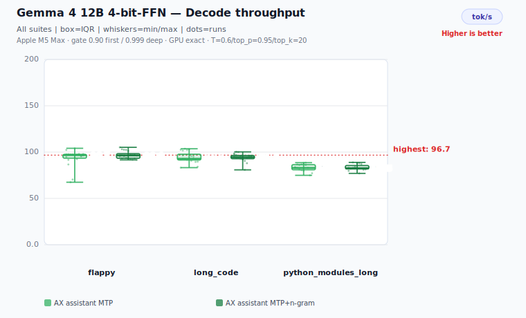</td>
<td>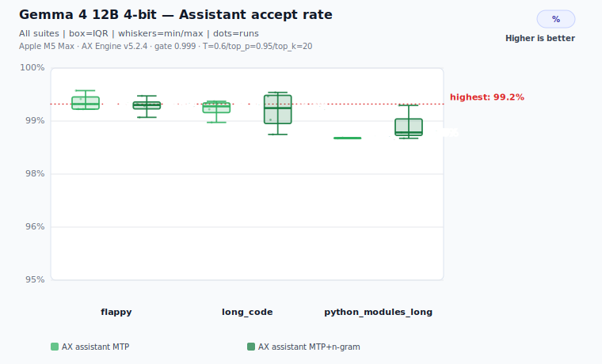</td>
</tr>
<tr>
<td>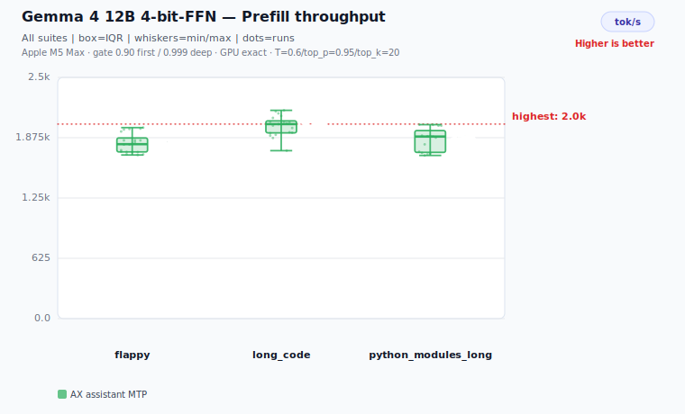</td>
<td>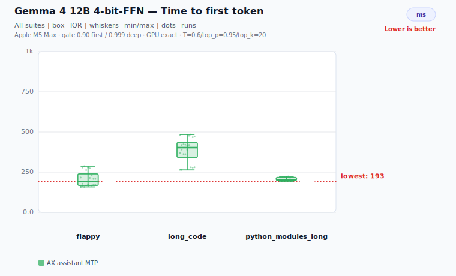</td>
</tr>
</table>

| Suite | Depth | AX direct tok/s | AX MTP tok/s | AX MTP accept | AX MTP+ngram tok/s | AX MTP+ngram accept | n-gram accept | n-gram hits |
|---|---:|---:|---:|---:|---:|---:|---:|---:|
| flappy | 2 | 36.1 | 102.3 | 95.5% | 104.0 | 95.6% | 79.2% | 51 |
| long_code | 2 | 35.0 | 99.4 | 95.2% | 101.0 | 94.5% | 71.7% | 39 |
| python_modules_long | 2 | 35.9 | 105.0 | 93.5% | 103.5 | 93.3% | 81.4% | 73 |

**Prefill and TTFT — same run:**

| Suite | AX MTP prefill | AX MTP+ngram prefill | AX MTP ttft ms | AX MTP+ngram ttft ms |
|---|---:|---:|---:|---:|
| flappy | 1,975 | 1,965 | 186 | 185 |
| long_code | 2,076 | 2,076 | 383 | 383 |
| python_modules_long | 1,910 | 1,897 | 189 | 189 |

Direct rows: 4-bit-FFN artifact, greedy-equivalent sampler, 128 generated tokens, 5 repetitions, 15 s cooldown, random-token prompts (mlx_lm.benchmark contract); llama.cpp decode shown at depth 0 (`tg`) and at matched context depth (`-d {prompt}`). MTP rows: same 4-bit-FFN assistant-MTP artifact, depth-2 draft, temperature=0.6, top_p=0.95, top_k=20; 512 generated tokens, 3 repetitions, 5 s / 2 s cooldowns. Apple M5 Max · AX Engine v6.1.1 · llama.cpp b9430 (Metal) · mlx_lm 0.31.3 (no `gemma4_unified` support).

Full artifacts: [`2026-06-09-gemma-4-12b-it-4bit-direct`](benchmarks/results/mlx-inference/2026-06-09-gemma-4-12b-it-4bit-direct/gemma-4-12b-it-4bit.json) (direct; llama.cpp GGUF provenance in [`llama_cpp_gguf_provenance.json`](benchmarks/results/mlx-inference/2026-06-09-gemma-4-12b-it-4bit-direct/llama_cpp_gguf_provenance.json)) · [`2026-06-09-gemma4-12b-ffn4-mtp-phase4-focused`](benchmarks/results/gemma4-assistant-mtp/2026-06-09-gemma4-12b-ffn4-mtp-phase4-focused/summary.json) (assistant-MTP).

#### Gemma 4 12B Multimodal

Gemma 4 12B multimodal timing is reported separately from the text benchmark above because media inputs expand into validated Gemma4 unified soft-token spans before the MLX graph runs. The publication-grade timing artifact covers all **17 AX Engine image/audio/video cases** through both the native `/v1/generate/stream` prefill path and the OpenAI-compatible `/v1/chat/completions` path. The llama.cpp Metal peer rows are cold OpenAI chat endpoint rows for the supported image/audio cases, with prompt cache, slot prompt reuse, and context checkpoints disabled and raw llama.cpp timing/cache metadata recorded.

<table>
<tr>
<td>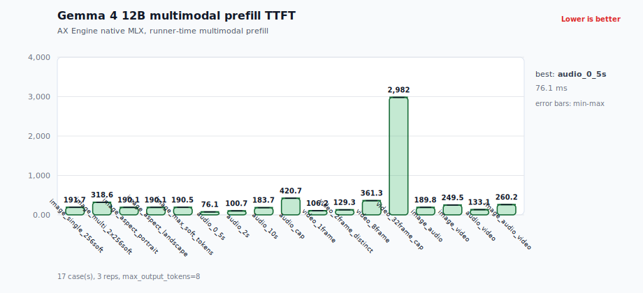</td>
<td>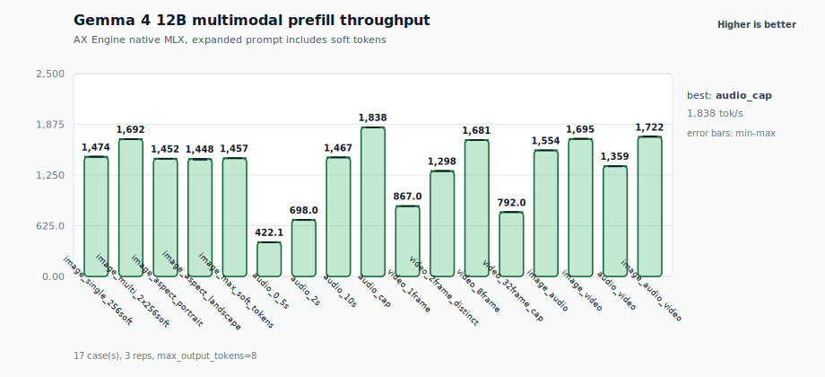</td>
<td>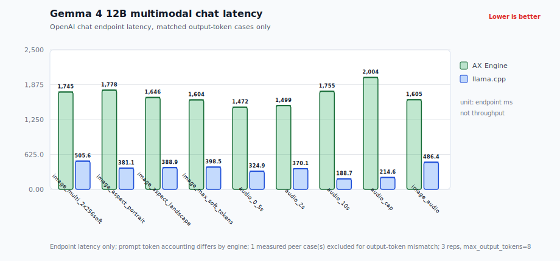</td>
</tr>
</table>

| Coverage | AX cases measured | Expanded input | Median runner prefill TTFT | Median prefill | Median AX chat E2E | llama.cpp peer endpoint |
|---|---:|---:|---:|---:|---:|---|
| Image | 5 | 275-535 tokens | 189.4-316.2 ms | 1,447.8-1,692.1 tok/s | 1,440.8-1,704.8 ms | 5 measured, 401.6-518.7 ms cold chat endpoint |
| Audio | 4 | 32-771 tokens | 75.8-419.4 ms | 422.1-1,838.4 tok/s | 1,466.5-1,819.2 ms | 3 measured, 338.0-464.5 ms cold chat endpoint; 1 skipped: llama.cpp audio cap unstable |
| Video | 4 | 92-2,355 tokens | 106.1-2,973.5 ms | 792.0-1,681.0 tok/s | 1,500.2-4,441.7 ms | 4 skipped: llama.cpp video path unsupported |
| Combined | 4 | 181-442 tokens | 133.2-256.7 ms | 1,359.1-1,721.6 tok/s | 1,532.4-1,771.6 ms | 1 measured, 507.9 ms cold chat endpoint; 3 skipped: video unsupported |

Rows use `/v1/generate/stream` with processed `multimodal_inputs.gemma4_unified` for runner-time prefill and `/v1/chat/completions` with inline media for client-wall E2E latency. This run used `max_output_tokens=8`, 1 warmup, 3 measured repetitions, `--max-batch-tokens 4096`, a release server binary, 128 GB unified memory, and a clean tracked worktree at `67ce2675a469cf5eecba687f348c649e663011b8`.

The llama.cpp peer rows use reference llama.cpp `19bba67c1` with Metal, `gemma-4-12B-it-Q4_K_M.gguf`, and `mmproj-gemma-4-12B-it-Q8_0.gguf`. They are OpenAI chat endpoint-latency rows for supported image/audio inputs, not native prefill rows and not a throughput comparison. The fair-peer launch contract is `--cache-ram 0 --no-cache-idle-slots --slot-prompt-similarity 0 --ctx-checkpoints 0` plus `--llama-cache-policy prompt_cache_disabled`; the artifact records raw llama.cpp `timings`, `prompt_tokens_details.cached_tokens`, server prompt token counts, and cache counts. Published peer rows require zero reported cached prompt tokens and server prompt-eval token counts at least as large as the cold request's reported prompt tokens. Video-containing peer rows are explicit skips because the local llama.cpp Gemma 4 path does not expose a like-for-like video contract, and `audio_cap` is skipped because this llama.cpp Gemma 4 audio path fails the warmup-plus-three-repetition contract on the largest audio fixture. The peer chart excludes one measured image case whose AX and llama.cpp output token counts differ, so chart bars compare matched-output rows only. For this Gemma 4 llama.cpp build, most peer text appears in `reasoning_content` rather than `message.content`, so the benchmark validates positive `response_chars`.

Full artifact: [`2026-06-09-gemma4-12b-multimodal-cold-peer-matrix`](benchmarks/results/gemma4-multimodal/2026-06-09-gemma4-12b-multimodal-cold-peer-matrix.json). Render charts with:

```bash
python3 scripts/render_gemma4_multimodal_charts.py \
  --artifact benchmarks/results/gemma4-multimodal/2026-06-09-gemma4-12b-multimodal-cold-peer-matrix.json \
  --assets-dir docs/assets
```

To reproduce the supported-case image/audio/video timing matrix from a Gemma 4 12B AX Engine server, use the matrix runner and validate the resulting artifact before publishing charts:

```bash
python3 scripts/bench_gemma4_multimodal.py \
  --url http://127.0.0.1:18080 \
  --model gemma-4-12B-it \
  --model-dir /path/to/gemma-4-12B-it-4bit \
  --cases all \
  --layers native_runtime_prefill,openai_chat_e2e \
  --warmup 1 \
  --repetitions 3 \
  --cooldown 1 \
  --max-output-tokens 8 \
  --server-command "target/release/ax-engine-server --model-id gemma-4-12B-it --mlx --mlx-model-artifacts-dir /path/to/gemma-4-12B-it-4bit --max-batch-tokens 4096 --port 18080" \
  --llama-url http://127.0.0.1:<peer-port> \
  --llama-binary /path/to/llama-server \
  --llama-gguf <path-to-gemma-4-12B-it-Q4_K_M.gguf> \
  --llama-mmproj <path-to-mmproj-gemma-4-12B-it-Q8_0.gguf> \
  --llama-cache-policy prompt_cache_disabled \
  --output benchmarks/results/gemma4-multimodal/gemma4-12b-multimodal-cold-peer-matrix.json

python3 scripts/check_gemma4_multimodal_benchmark_artifact.py \
  benchmarks/results/gemma4-multimodal/gemma4-12b-multimodal-cold-peer-matrix.json \
  --min-repetitions 3 \
  --require-modalities image,audio,video \
  --require-build-provenance \
  --readme-ready
```

For a fair llama.cpp peer rerun, launch `llama-server` with prompt cache, slot prompt reuse, and context checkpoints disabled for the peer server, for example `--cache-ram 0 --no-cache-idle-slots --slot-prompt-similarity 0 --ctx-checkpoints 0`, then validate with `--readme-ready`. Peer rows with unknown cache policy, reported cached prompt tokens, or server prompt-eval token counts that are too low for a cold prompt are rejected by the artifact checker. Without a matching Gemma 4 12B GGUF and multimodal projector, peer rows are explicit skips. Video rows remain explicit skips until the peer server exposes a like-for-like video path for Gemma 4 12B.

<details>
<summary>Prepare Gemma 4 12B assistant-MTP artifacts</summary>

Gemma 4 12B MLX target and assistant repos are already converted to MLX safetensors — they do not go through `ax-engine convert-mtplx` or `scripts/prepare_mtp_sidecar.py`. Download the target and matching assistant, then package them with the Gemma-specific helper:

```bash
hf download mlx-community/gemma-4-12B-it-4bit
hf download mlx-community/gemma-4-12B-it-assistant-4bit
python3 scripts/prepare_gemma4_assistant_mtp.py \
  --target mlx-community/gemma-4-12B-it-4bit \
  --assistant mlx-community/gemma-4-12B-it-assistant-4bit

hf download mlx-community/gemma-4-12B-it-6bit
hf download mlx-community/gemma-4-12B-it-assistant-6bit
python3 scripts/prepare_gemma4_assistant_mtp.py \
  --target mlx-community/gemma-4-12B-it-6bit \
  --assistant mlx-community/gemma-4-12B-it-assistant-6bit
```

The default outputs are quant-specific synthetic HF cache snapshots: `models--ax-local--gemma-4-12b-it-4bit-assistant-mtp/snapshots/v1/` and `models--ax-local--gemma-4-12b-it-6bit-assistant-mtp/snapshots/v1/`. Each package contains the target files, an `assistant/` subtree, and `ax_gemma4_assistant_mtp.json`. Generate or validate the AX manifest before serving:

```bash
ax-engine-bench generate-manifest \
  ~/.cache/huggingface/hub/models--ax-local--gemma-4-12b-it-4bit-assistant-mtp/snapshots/v1 \
  --validate
ax-engine-bench generate-manifest \
  ~/.cache/huggingface/hub/models--ax-local--gemma-4-12b-it-6bit-assistant-mtp/snapshots/v1 \
  --validate
```
</details>


### Speculative Decoding (MTP)

AX Engine's key Mac advantage is **dual-family speculative decoding** — it supports both Gemma 4's separate assistant-drafter contract and Qwen3.6's fused sidecar contract in one repo-owned runtime and benchmark surface. A single benchmark surface records route identity, sampler, prompt suite, cooldown, accept behavior, and artifact provenance so the two MTP families are comparable without pretending they use the same architecture.

#### Gemma 4

Unlike Qwen's fused `mtp.*` sidecar, Gemma 4's multi-token prediction uses a small **assistant drafter** that shares the target's tokenizer and embedding table, drafts tokens from the target's last-layer hidden state, and attends to the target's own KV cache. Draft depth is configurable: 26B/31B benchmarks use depth 1 (one draft token per step); 12B uses depth 2 (two draft tokens per step, with the second conditioned on the first). AX runs it assistant-MTP-only (`mtp`, default) and with n-gram stacked on top (`mtp-ngram`, opt-in).

A **draft confidence gate** (`AX_MLX_GEMMA4_ASSISTANT_MTP_DRAFT_MIN_CONFIDENCE`, default `0.90` for the first draft token; deep draft default `0.999`) only proposes a draft when the drafter's top-token probability clears the threshold, keeping accept high while remaining correctness-preserving. Lower the gate toward `0` for more speculation on predictable content; raise it for flatter sampled chat.

> **The gate is a speed knob, not a quality knob -- lowering it does not corrupt output (e.g. code).** Every drafted token is verified by the target model before it is emitted (rejection sampling when draft log-probs exist, greedy argmax-match otherwise), so a mismatched draft is discarded and replaced by the target's own token. Relaxing the gate only lets the drafter propose *more* speculative tokens; it lowers the accept rate and shifts throughput, but the emitted sequence is still the verified target sequence. Output-altering approximations are separate, explicit opt-ins such as top-k target softmax, never the confidence gate.

**Choosing the gate by workload.** Because the output is verified either way, the gate is a throughput dial, not a safety one — pick it by how *predictable* your content is, and (only for temperature-sampled chat) how much reply diversity you want. Lower gate = more speculation = lower accept rate but more multi-token runs. Starting points:

| Workload | Suggested gate | Expected accept¹ | Why |
|---|---|---|---|
| **Coding** | `~0.90` (aggressive) | high (~93–96% on 12B code suites) | Sharply peaked output makes the first draft token useful even with a looser gate. Deterministic, so no diversity cost -- tune purely for speed. |
| **Agentic** (tools / JSON / reasoning) | `~0.90–0.95` | high (~93–96% expected on code-like templates) | Templated and low-temperature like code; output is verified, so no correctness risk. Keep n-gram stacking opt-in unless the workload is measured. |
| **Chatbot** | `~0.99–0.999` if sampling for variety; lower at low temperature | drops on flat text | Natural language is flatter, so accept falls faster; at temperature > 0 a low gate makes replies follow the greedy token and feel less varied. Here a high gate protects *diversity*, not correctness. |

> ¹ Only the code-like benchmark suites below (`flappy`, `long_code`, `python_modules_long`) are measured for 12B at the Phase 4 default -- they sit at 93.3-95.6% assistant accept and still deliver 2.83-2.92x same-artifact speedup over direct decode. The agentic and chatbot figures are expected ranges, and the suggested gates are starting points, not universal optima. The `assistant_mtp_gate*` ablation profiles lock the exact per-workload sweet spot.

**One flag instead of the env vars.** Rather than hand-set the gate knobs, the server accepts `--speculation-profile {auto,coding,agentic,chatbot}` (short `-s`, alias `--spec`; or env `AX_MLX_SPECULATION_PROFILE`), which bundles the MTP and n-gram configuration into one posture. `auto` (default) is temperature-driven: it keeps the shipped gate at low/zero temperature and raises it for higher-temperature sampled chat to protect reply diversity. `coding`/`agentic` keep the shipped gate defaults — the 12B ablation found lowering the Gemma gate does not add code throughput, so the default already is the throughput setting — while `chatbot` raises the gate and prefers the n-gram utility gate. Any explicit per-knob env var (e.g. `AX_MLX_GEMMA4_ASSISTANT_MTP_DRAFT_MIN_CONFIDENCE`) still overrides the profile. The resolved posture is recorded in route metadata as `ax_mlx_speculation_profile`.

No peer engine (MTPLX, Rapid-MLX, lightning-mlx) exposes a runnable Gemma 4 assistant-MTP path, so this benchmark has no peer comparison rows.

**Gemma 4 speculative decoding holds draft accept ≥98% on every cell below** (98.4–99.5% across 26B / 31B × {MTP, MTP+n-gram} × {flappy, long_code, python_modules_long}).

The 26B/31B public run below is the promotion-grade assistant-MTP matrix only; unpublished retry fragments and failed direct-baseline attempts are excluded from this artifact set. Without a complete same-artifact direct row for these two models, the public verdict is scoped to MTP+n-gram versus pure assistant-MTP. In that scope n-gram is **keep-opt-in**: +1.3% median decode for 26B and +1.0% for 31B, with no suite regressing more than 0.1%.


<table>
<tr>
<td align="center"><strong>Gemma 4 26B A4B 4-bit</strong></td>
<td align="center"><strong>Gemma 4 31B 4-bit</strong></td>
</tr>
<tr>
<td></td>
<td></td>
</tr>
<tr>
<td></td>
<td></td>
</tr>
<tr>
<td></td>
<td></td>
</tr>
<tr>
<td></td>
<td></td>
</tr>
</table>

| Model | Suite | Depth | AX MTP tok/s | AX MTP accept | AX MTP+ngram tok/s | AX MTP+ngram accept |
|---|---|---:|---:|---:|---:|---:|
| Gemma 4 26B A4B 4-bit | flappy | 1 | 126.1 | 99.3% | 129.1 | 99.5% |
| Gemma 4 26B A4B 4-bit | long_code | 1 | 125.5 | 99.1% | 127.1 | 99.1% |
| Gemma 4 26B A4B 4-bit | python_modules_long | 1 | 124.0 | 98.5% | 124.1 | 98.6% |
| Gemma 4 31B 4-bit | flappy | 1 | 37.9 | 99.3% | 38.2 | 99.2% |
| Gemma 4 31B 4-bit | long_code | 1 | 37.8 | 99.2% | 38.9 | 99.1% |
| Gemma 4 31B 4-bit | python_modules_long | 1 | 37.4 | 98.4% | 37.3 | 98.6% |

**Prefill and TTFT — same run:**

| Model | Suite | AX MTP prefill | AX MTP+ngram prefill | AX MTP ttft ms | AX MTP+ngram ttft ms |
|---|---|---:|---:|---:|---:|
| Gemma 4 26B A4B 4-bit | flappy | 2,711 | 2,739 | 130 | 129 |
| Gemma 4 26B A4B 4-bit | long_code | 3,991 | 3,977 | 203 | 205 |
| Gemma 4 26B A4B 4-bit | python_modules_long | 2,909 | 2,912 | 131 | 131 |
| Gemma 4 31B 4-bit | flappy | 747 | 751 | 475 | 486 |
| Gemma 4 31B 4-bit | long_code | 769 | 798 | 1,035 | 995 |
| Gemma 4 31B 4-bit | python_modules_long | 739 | 728 | 477 | 481 |

The gated assistant already captures the speculation, so stacking n-gram on top adds little — the two modes track closely. Sampler: temperature=0.6, top_p=0.95, top_k=20; 1,000 generated tokens, 5 repetitions, 10 s / 5 s cooldowns. Apple M5 Max · AX Engine v5.3.3.

Full artifacts: [`2026-06-09-gemma4-26b-31b-optimized-scenario`](benchmarks/results/gemma4-assistant-mtp/2026-06-09-gemma4-26b-31b-optimized-scenario/summary.json).

<details>
<summary>Reproduce this benchmark</summary>

```bash
python3 scripts/bench_gemma4_assistant_mtp.py \
  --models 26b-a4b-4bit,31b-4bit \
  --modes mtp,mtp-ngram \
  --suites flappy,long_code,python_modules_long \
  --max-tokens 1000 --repetitions 5
python3 scripts/render_gemma4_assistant_mtp_charts.py \
  --results-dir benchmarks/results/gemma4-assistant-mtp/<run-dir>
```

Artifacts land under `benchmarks/results/gemma4-assistant-mtp/`; SVGs render into `docs/assets/`. Tune the accept/throughput trade-off with `AX_MLX_GEMMA4_ASSISTANT_MTP_DRAFT_MIN_CONFIDENCE` (default `0.90`; `0` disables the first-position gate) and `AX_MLX_GEMMA4_ASSISTANT_MTP_DEEP_DRAFT_MIN_CONFIDENCE` (default `0.999`). MTP+n-gram stacking is opt-in: use `--mlx-mtp-enable-ngram-stacking` through the server/SDK path, or set `AX_MLX_MTP_DISABLE_NGRAM_STACKING=0` for low-level benchmark runs.
</details>

#### Qwen 3.6

Three-engine MTP comparison (MTPLX 0.3.7, AX Engine MTP, AX Engine MTP+n-gram) using standard `Qwen/Qwen3.6-*` sidecars plus matching `mlx-community/*-4bit` MLX bases. No `Youssofal/*MTPLX*` bundles are used. All three engines run on the same prompt suites, token caps, sampler, warmup, repetition count, and cooldown.

AX MTP runs the default draft confidence gate (`AX_MLX_MTP_DRAFT_MIN_CONFIDENCE`). The accept columns below use the accept-maximizing `0.98` setting, which holds pure-MTP accept ≥99% on every row except the hardest `python_modules_long` suite (27B 97.6%, 35B-A3B 99.3%). The shipped default is `0.90`, which trades ~1–2 points of accept for +5–13% decode throughput (see `docs/MTP-DRAFT-GATE-THROUGHPUT.md`). Set the variable to `0.98` to restore the accept-maximizing behavior, or `0` to disable.

The aggregate improvement view below uses sample medians across all three suites. The 35B-A3B sidecar is the clear public win: AX MTP is **+76.4%** vs MTPLX and AX MTP+n-gram is **+77.5%** vs MTPLX. The 27B row is mixed rather than a default win: pure AX MTP is **-1.4%** vs MTPLX, while AX MTP+n-gram recovers to **+2.1%** vs MTPLX and **+3.5%** vs pure AX MTP, so stacking remains opt-in.

The latency view follows the same boundary. On **Qwen3.6 35B-A3B**, AX wins every listed MTPLX prefill and TTFT row because the sidecar path stays inside the repo-owned MLX runner and records the target-model prefill separately from speculative verification. On **Qwen3.6 27B**, prefill and TTFT are intentionally called mixed: AX is close, but the 27B sidecar does not show a clean latency win on every suite. Treat the 35B-A3B rows as the public MTP latency advantage and the 27B rows as workload-dependent.

<p>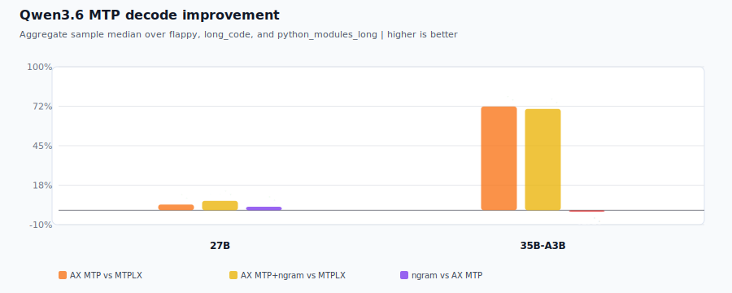</p>

<table>
<tr>
<td align="center"><strong>Qwen3.6 27B 4-bit</strong></td>
<td align="center"><strong>Qwen3.6 35B-A3B 4-bit</strong></td>
</tr>
<tr>
<td></td>
<td></td>
</tr>
<tr>
<td></td>
<td></td>
</tr>
<tr>
<td></td>
<td></td>
</tr>
<tr>
<td></td>
<td></td>
</tr>
</table>

| Model | Suite | Depth | MTPLX tok/s | MTPLX accept | AX tok/s | AX accept | AX+ngram tok/s | AX+ngram accept |
|---|---|---:|---:|---:|---:|---:|---:|---:|
| Qwen3.6 27B 4-bit | flappy | 3 | 56.1 | 100.0% (96.0–100.0) | 60.6 | 99.9% (98.3–100.0) | 57.4 | 99.1% (96.5–99.5) |
| Qwen3.6 27B 4-bit | long_code | 3 | 57.9 | 99.7% (98.4–100.0) | 54.9 | 99.9% (99.2–100.0) | 59.3 | 99.1% (98.4–99.7) |
| Qwen3.6 27B 4-bit | python_modules_long | 3 | 52.7 | 87.6% (81.2–95.0) | 47.8 | 97.6% (96.7–99.8) | 50.2 | 97.2% (95.3–98.6) |
| Qwen3.6 35B-A3B 4-bit | flappy | 1 | 104.3 | 49.5% (42.3–60.6) | 180.6 | 100.0% (99.1–100.0) | 182.3 | 99.6% (97.9–99.7) |
| Qwen3.6 35B-A3B 4-bit | long_code | 1 | 105.6 | 51.4% (43.1–66.7) | 179.1 | 100.0% (99.8–100.0) | 224.2 | 99.8% (99.0–100.0) |
| Qwen3.6 35B-A3B 4-bit | python_modules_long | 1 | 98.2 | 42.6% (37.0–46.1) | 182.4 | 99.3% (98.0–99.7) | 169.4 | 97.6% (96.2–98.4) |

Accept cells show median with `(min–max)` range across the suite's cases × 5 reps, so the run-to-run spread on the borderline `python_modules_long` suite is visible rather than hidden behind a single point.

**Prefill throughput (tok/s) — same run:**

MTPLX prefill is derived from `prompt_tokens / prompt_eval_time_s` (runner-level). AX prefill is measured at runner level. Both are pure GPU compute measurements.

| Model | Suite | Depth | MTPLX tok/s | AX MTP tok/s | AX MTP+ngram tok/s |
|---|---|---:|---:|---:|---:|
| Qwen3.6 27B 4-bit | flappy | 3 | 657 | 681 | 639 |
| Qwen3.6 27B 4-bit | long_code | 3 | 793 | 769 | 765 |
| Qwen3.6 27B 4-bit | python_modules_long | 3 | 680 | 692 | 671 |
| Qwen3.6 35B-A3B 4-bit | flappy | 1 | 1,520 | 1,831 | 1,836 |
| Qwen3.6 35B-A3B 4-bit | long_code | 1 | 2,431 | 2,735 | 2,707 |
| Qwen3.6 35B-A3B 4-bit | python_modules_long | 1 | 1,654 | 1,966 | 1,967 |

**Time to first token (ms) — same run:**

MTPLX TTFT is derived from `prompt_eval_time_s`. AX TTFT is a runner-time measurement. Both are pure prefill measurements.

| Model | Suite | Depth | MTPLX ms | AX MTP ms | AX MTP+ngram ms |
|---|---|---:|---:|---:|---:|
| Qwen3.6 27B 4-bit | flappy | 3 | 489 | 477 | 504 |
| Qwen3.6 27B 4-bit | long_code | 3 | 905 | 934 | 938 |
| Qwen3.6 27B 4-bit | python_modules_long | 3 | 509 | 505 | 505 |
| Qwen3.6 35B-A3B 4-bit | flappy | 1 | 213 | 176 | 176 |
| Qwen3.6 35B-A3B 4-bit | long_code | 1 | 295 | 262 | 265 |
| Qwen3.6 35B-A3B 4-bit | python_modules_long | 1 | 206 | 172 | 177 |

Sampler: temperature=0.6, top_p=0.95, top_k=20; 1,000 gen tokens, 5 repetitions, 30 s cooldown, 10 s inter-case cooldown. MTPLX 0.3.7 · AX Engine v6.0.0.

Full artifacts: [`2026-06-07-qwen36-fair`](benchmarks/results/mtp-fair/2026-06-07-qwen36-fair/summary.json) (full same-day run; MTPLX and AX MTP+n-gram rows at their defaults, AX pure-MTP rows at the accept-maximizing `0.98` gate).

<details>
<summary>Reproduce this benchmark</summary>

```bash
ax-engine convert-mtplx mlx-community/Qwen3.6-27B-4bit \
  --mtp-source Qwen/Qwen3.6-27B \
  --fair-base-only
ax-engine convert-mtplx mlx-community/Qwen3.6-35B-A3B-4bit \
  --mtp-source Qwen/Qwen3.6-35B-A3B \
  --fair-base-only
python3 scripts/bench_qwen36_mtp_fair.py \
  --engines mtplx ax \
  --modes mtp mtp-ngram \
  --models 27b-4bit 35b-a3b-4bit \
  --suites flappy long_code python_modules_long \
  --max-tokens 1000 \
  --repetitions 5 \
  --cooldown 30
```

`convert-mtplx` wraps the generic sidecar packager, applies model-specific defaults when optional knobs are omitted (Qwen3.6 27B depth 3; 35B-A3B depth 1), and validates `ax_mtp_sidecar_manifest.json` before reporting success. The generated `summary.md`, `summary.json`, and `decode-tok-s.svg` live under `benchmarks/results/mtp-fair/`. Full methodology and caveats in [`docs/PERFORMANCE.md#mtp-mode`](docs/PERFORMANCE.md#mtp-mode).
</details>

### Direct Decode · Prefill · TTFT

#### Qwen3-Coder-Next

Qwen3-Coder-Next is the coding-specialist `qwen3_next` checkpoint, so it is reported separately from Qwen 3.6. It uses the same repo-owned AX MLX graph family, but its benchmark boundary is different: it does **not** ship MTP heads or a Qwen3.6 sidecar, so the public README path is direct decode only.

The direct comparison below uses grouped bar charts at 128/512/2048 prompt tokens. Each engine's version is printed on the charts: AX native MLX (`6.4.0`) and `mlx_lm` (`0.31.3`) use the MLX artifact and prompt-hash parity; llama.cpp Metal (`b9620`, ggml `0.15.1`, flash-attn on) is a shape-compatible external GGUF reference run on one consistent build across all three prompt sizes. AX direct decode is +18.6% / +16.3% / +18.1% versus `mlx_lm`, and +36.5% / +37.3% / +34.4% versus llama.cpp.

<table>
<tr>
<td>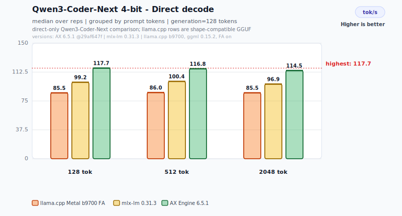</td>
<td>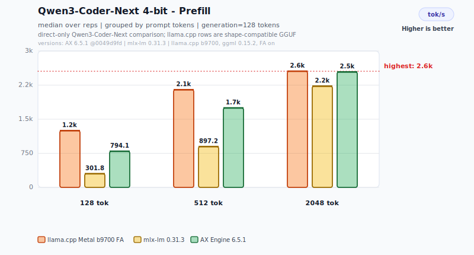</td>
<td>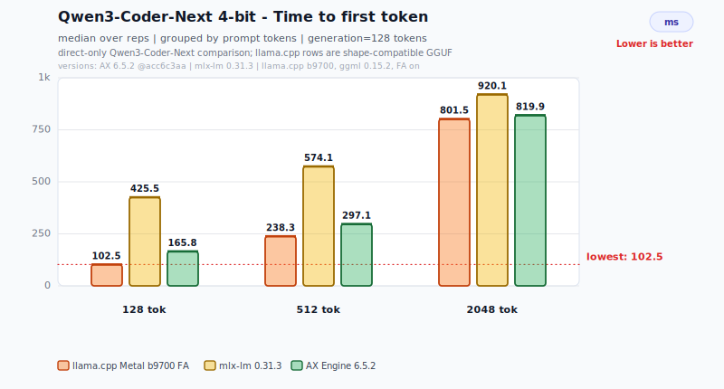</td>
</tr>
</table>

| Prompt tokens | llama.cpp decode | mlx_lm decode | AX direct decode | AX vs mlx_lm | AX vs llama.cpp |
|---:|---:|---:|---:|---:|---:|
| 128 | 86.2 | 99.2 | 117.7 | +18.6% | +36.5% |
| 512 | 85.1 | 100.4 | 116.8 | +16.3% | +37.3% |
| 2048 | 85.2 | 96.9 | 114.5 | +18.1% | +34.4% |

**Prefill and TTFT peers — same run:**

| Prompt tokens | llama.cpp prefill | mlx_lm prefill | AX direct prefill | llama.cpp TTFT | mlx_lm TTFT | AX direct TTFT |
|---:|---:|---:|---:|---:|---:|---:|
| 128 | 1,253.9 | 301.8 | 796.7 | 102 ms | 426 ms | 161 ms |
| 512 | 2,150.4 | 897.2 | 1,753.9 | 238 ms | 574 ms | 292 ms |
| 2048 | 2,554.7 | 2,226.9 | 2,542.1 | 802 ms | 920 ms | 806 ms |

> llama.cpp leads prefill/TTFT at every prompt size (flash-attn GGUF prompt ingestion). v6.4.0's MoE decode optimization traded a little prefill/TTFT (−1% to −3% vs v6.3.4), so AX no longer edges llama at 2048 — the two now converge there (AX 2,542 vs llama 2,555 tok/s prefill; 806 vs 802 ms TTFT, within ~1%). The AX decode advantage holds and is strongest at every size.

> **What drives the decode gap (it is not bandwidth saturation).** This is a runtime shootout at each engine's standard 4-bit, not a controlled kernel test. Qwen3-Coder-Next is MoE, so each decode token reads only the dense backbone plus the 10-of-512 active experts — and at that footprint **none of the three engines is bandwidth-bound** (all sit at 34–42% of the 577 GB/s M5 Max peak; see the bandwidth table below). The gap splits cleanly: **AX beats llama.cpp on bytes-read** — Q4_K_M reads **~1.44× the bytes/token** (2.83 vs 1.96 GB) because its dense backbone (linear-attention/SSM, embeddings, output head) stays at higher precision; llama.cpp actually sustains the *most* bandwidth (~42%) yet is slowest. **AX beats mlx_lm on kernel efficiency** — identical 1.96 GB/token MLX weights, but AX extracts ~40% of peak vs mlx-lm's ~34% (the MoE gather-GEMV win). The parity-controlled claim is **AX vs mlx_lm** (identical weights, prompt-hash parity): +16.3%–18.6%; llama-bench consumes its own internal tokens (no prompt-hash parity), so the llama.cpp column is a shape-compatible external reference only.

**Memory bandwidth utilization:**

Decode speed follows one identity: **tok/s = effective bandwidth ÷ bytes read per token**. The chart below plots decode throughput (y) against weight bytes read per token (x), with the measured M5 Max peak (≈577 GB/s, MLX reduction probe) drawn as the ceiling curve `tok/s = 577 / bytes`. It reads in one view: AX and mlx-lm share the same x (identical MLX 4-bit weights), so the vertical gap between them is **pure kernel efficiency** (+19%, AX's MoE gather-GEMV); llama.cpp is pushed right because **Q4_K_M reads 1.44× the bytes/token**, which is why it decodes slowest even though it sustains the most raw bandwidth; and every point sits far below the ceiling, so **decode is gather/dispatch-bound, not bandwidth-bound** — the room up to the curve is headroom.


| Engine / quantization | Dense backbone | Active experts | Weights/token | Decode tok/s | Effective BW | % of 577 GB/s peak (used) |
|---|---:|---:|---:|---:|---:|---:|
| AX — MLX 4-bit | 1.21 GB (25%) | 0.76 GB (15%) | 1.96 GB | 117.7 | 231 GB/s | 40% |
| mlx-lm — MLX 4-bit | 1.21 GB (21%) | 0.76 GB (13%) | 1.96 GB | 99.2 | 195 GB/s | 34% |
| llama.cpp — Q4_K_M | 1.91 GB (28%) | 0.91 GB (14%) | 2.83 GB | 86.2 | 244 GB/s | 42% |

> Per-segment percentages are that read's share of the 577 GB/s peak (dense + experts = used); the remainder is idle headroom. The dense backbone (read in full every token) is where Q4_K_M's higher precision shows up — 1.91 GB vs MLX's 1.21 GB.

AX and mlx-lm read the **same** 1.96 GB of active weights per token (identical MLX 4-bit artifact); AX is faster because it extracts more of the available bandwidth — a runtime/kernel win, not a quant difference. llama.cpp reads **1.44× more** (2.83 GB) because Q4_K_M keeps the dense backbone — Qwen3-Next's linear-attention/SSM weights, token embeddings, and output head — at higher precision; that bytes-read overhead, not bandwidth starvation, is why its decode trails. Active-byte figures: MLX from the harness `bandwidth_accounting` (`moe_active_estimate`), llama.cpp computed from the GGUF tensor table (`dense + routed × 10/512`, the same formula). Rows are prompt=128; decode tok/s is essentially depth-independent for this model.

The same chart also shows the remaining AX headroom. If AX kept the 1.96 GB/token footprint and merely matched llama.cpp's 42% effective-bandwidth row, decode would land around 124 tok/s (+8%); on **dense** models on this same M5 Max hardware AX reaches **78–86% of peak**, so the ~40-point gap here is specific to batch-1 MoE decode, where each token gathers only 10-of-512 experts and fixed routing, gather setup, dispatch, dequant, and expert weighted-sum overhead dominate costs that do not scale with bytes read (the bus idles while dispatch runs). The next lever is therefore **kernel/dispatch engineering** — fewer and larger fused MoE operations such as batched expert dispatch and deeper gather+GEMV+weighted-sum fusion — **not** pushing quantization lower (AX already reads the fewest bytes of the three; going lower would cost model quality). This is an upper bound, not a commitment: single-token MoE decode is latency-bound at its core.

Artifacts: AX direct rows are the v6.4.0 (`29af647f`) rerun [`2026-06-14-qwen3-coder-next-29af647f-ax-direct/qwen3-coder-next-4bit-ax-direct.json`](benchmarks/results/mlx-inference/2026-06-14-qwen3-coder-next-29af647f-ax-direct/qwen3-coder-next-4bit-ax-direct.json); `mlx_lm` reference rows are [`qwen3-coder-next-4bit-p128-p2048-step4096.json`](benchmarks/results/mlx-inference/2026-06-13-qwen3-coder-next-prefill-probe/qwen3-coder-next-4bit-p128-p2048-step4096.json) and [`qwen3-coder-next-4bit-p512-step4096.json`](benchmarks/results/mlx-inference/2026-06-13-qwen3-coder-next-prefill-probe/qwen3-coder-next-4bit-p512-step4096.json); llama.cpp is [`2026-06-13-qwen3-coder-next-9620-fa/qwen3-coder-next-4bit.json`](benchmarks/results/llama-cpp-metal/2026-06-13-qwen3-coder-next-9620-fa/qwen3-coder-next-4bit.json) (`b9620` / ggml `0.15.1` / flash-attn, one build across 128/512/2048).

Render charts with:

```bash
python3 scripts/render_qwen_coder_next_charts.py \
  --artifact benchmarks/results/mlx-inference/2026-06-14-qwen3-coder-next-29af647f-ax-direct/qwen3-coder-next-4bit-ax-direct.json \
  --artifact benchmarks/results/mlx-inference/2026-06-13-qwen3-coder-next-prefill-probe/qwen3-coder-next-4bit-p128-p2048-step4096.json \
  --artifact benchmarks/results/mlx-inference/2026-06-13-qwen3-coder-next-prefill-probe/qwen3-coder-next-4bit-p512-step4096.json \
  --llama-artifact benchmarks/results/llama-cpp-metal/2026-06-13-qwen3-coder-next-9620-fa/qwen3-coder-next-4bit.json \
  --assets-dir docs/assets

# Memory-bandwidth utilization chart (static data; see script header for provenance)
python3 scripts/render_qwen_coder_next_bandwidth_chart.py --assets-dir docs/assets
```

<!-- readme-performance-artifacts: reference=benchmarks/results/mlx-inference/2026-05-26-direct-mode-clean-refresh/; ax-overlay=benchmarks/results/mlx-inference/2026-06-04-ax-direct-ngram-readme-rerun/ -->

The family tables below compare **direct (non-speculative) decode** across llama.cpp Metal, mlx_lm, and ax engine, covering Gemma 4 and Qwen 3.6 at 128/512/2048 prompt tokens. `ax direct baseline` disables n-gram acceleration, MTP, and assistant drafting to measure the repo-owned direct decode path. Bench prompts are `mlx_lm.benchmark` seed-0 random tokens, which keeps prompt-hash parity across MLX rows.

The prefill and TTFT advantage is the practical direct-mode story. AX is ahead of `mlx_lm` in every listed prefill and TTFT cell below, while decode gains are smaller and model-dependent. That means the repo-owned MLX route is especially valuable for interactive requests where prompt ingestion dominates perceived latency: AX keeps prompt prefill, first-token timing, model-specific graph paths, and route metadata in one measured runtime path. These are cold-prefix rows, not prompt-cache, continuous-batching, or speculative-decoding claims.

<table>
<tr>
<td></td>
<td align="center"><strong>Gemma 4</strong></td>
<td align="center"><strong>Qwen 3.6</strong></td>
</tr>
<tr>
<td align="center"><strong>Decode rate</strong></td>
<td></td>
<td></td>
</tr>
<tr>
<td align="center"><strong>Prefill rate</strong></td>
<td></td>
<td></td>
</tr>
<tr>
<td align="center"><strong>TTFT</strong></td>
<td></td>
<td></td>
</tr>
</table>

> **`llama.cpp Metal*` column** — Shape-compatible reference produced by Metal-enabled `llama-bench`. `llama-bench` generates its own internal synthetic prompt tokens and does not consume the harness prompt JSON, so these numbers are **not** prompt-hash parity with the other columns. No percentage delta is shown. MLX bit-widths are mapped to the nearest standard GGUF K-quant (4→Q4_K_M, 5→Q5_K_M, 6→Q6_K, 8→Q8_0). Source: `benchmarks/manifests/llama_cpp_metal/inventory.json`, `scripts/bench_llama_cpp_metal_sweep.py`.

<details>
<summary>Benchmark provenance and methodology</summary>

The `mlx_lm` reference rows for the 12 Gemma 4 and Qwen 3.6 rows shown below come from `benchmarks/results/mlx-inference/2026-05-26-direct-mode-clean-refresh/`. The AX direct-mode cells come from the full 12-model AX-only rerun in `benchmarks/results/mlx-inference/2026-06-04-ax-direct-ngram-readme-rerun/` (v5.1.8, `5402992b`). Qwen3-Coder-Next is intentionally handled as the opening direct-mode subsection because it has a direct-only benchmark boundary; its MLX/AX and llama.cpp Metal rows now cover 128/512/2048 prompt tokens. The `llama.cpp Metal*` column is injected from `benchmarks/manifests/llama_cpp_metal/inventory.json` and the `2026-05-18-llama-cpp-metal-gemma-e2b-4bit-depth-fa/` Gemma 4 E2B 4-bit recheck.

Setup: generation=128, 5 measured repetitions, 15-second cooldown, AX prefix cache disabled for cold prefill and TTFT measurement, production-build binaries, matching prompt SHA checks. Long-greedy AX prefill rows are runner-time measurements of the cache-state prefix plus final prompt-token boundary — not full-logits prompt scoring throughput. Percentages are versus `mlx_lm`.

The 2K `llama.cpp Metal*` prefill rows are long-context, GGUF-runtime-reference rows. The Gemma 4 E2B 4-bit row was produced with llama.cpp b9110 and rechecked on b9200 with Metal offload, `-b/-ub 2048`, and flash attention enabled. The b9200 recheck improved 2K prefill only slightly — this is our benchmark boundary, not an upstream llama.cpp official bug statement.
</details>

#### Prefill throughput (tok/s) — percentages vs mlx_lm

| Model | MLX quantization | Prompt tok | llama.cpp Metal* | mlx_lm | ax engine |
|---|---|---:| ---: |---:|---:|
| Gemma 4 E2B | 4-bit | 128 | 3,481.7 | 2,338.1 | **6,044.9 (+158.5%)** |
|         |         | 512 | 6,846.0 | 7,870.0 | **17,238.5 (+119.0%)** |
|         |         | 2048 | 7,643.1 | 18,014.7 | **24,778.3 (+37.5%)** |
| Gemma 4 E2B | 5-bit | 128 | 3,398.4 | 2,238.5 | **6,019.3 (+168.9%)** |
|         |         | 512 | 6,860.3 | 7,469.9 | **16,846.5 (+125.5%)** |
|         |         | 2048 | 7,288.1 | 16,664.1 | **24,188.3 (+45.2%)** |
| Gemma 4 E2B | 6-bit | 128 | 3,539.7 | 1,823.5 | **5,700.8 (+212.6%)** |
|         |         | 512 | 7,274.0 | 6,046.6 | **16,336.4 (+170.2%)** |
|         |         | 2048 | 7,623.2 | 15,332.1 | **23,502.4 (+53.3%)** |
| Gemma 4 E2B | 8-bit | 128 | 3,694.3 | 1,605.0 | **5,452.1 (+239.7%)** |
|         |         | 512 | 7,481.0 | 6,332.9 | **15,679.5 (+147.6%)** |
|         |         | 2048 | 7,990.4 | 15,536.8 | **23,392.6 (+50.6%)** |
| Gemma 4 E4B | 4-bit | 128 | 2,194.0 | 1,513.2 | **3,409.6 (+125.3%)** |
|         |         | 512 | 4,454.2 | 4,195.5 | **7,000.6 (+66.9%)** |
|         |         | 2048 | 4,426.6 | 7,325.4 | **8,863.4 (+21.0%)** |
| Gemma 4 26B A4B | 4-bit | 128 | 1,911.4 | 496.4 | **1,339.1 (+169.7%)** |
|         |         | 512 | 3,484.5 | 1,621.0 | **3,055.2 (+88.5%)** |
|         |         | 2048 | 3,604.8 | 3,300.1 | **4,668.6 (+41.5%)** |
| Gemma 4 31B | 4-bit | 128 | 522.6 | 283.1 | **513.3 (+81.3%)** |
|         |         | 512 | 665.3 | 619.9 | **742.5 (+19.8%)** |
|         |         | 2048 | 560.3 | 733.9 | **782.7 (+6.6%)** |
| Qwen 3.6 27B | 4-bit | 128 | 539.6 | 378.8 | **583.6 (+54.1%)** |
|  |  | 512 | 759.7 | 705.7 | **827.1 (+17.2%)** |
|  |  | 2048 | 664.3 | 895.2 | **923.7 (+3.2%)** |
| Qwen 3.6 27B | 5-bit | 128 | 520.8 | 278.8 | **536.6 (+92.4%)** |
|  |  | 512 | 733.4 | 599.5 | **784.4 (+30.9%)** |
|  |  | 2048 | 667.0 | 827.5 | **883.3 (+6.7%)** |
| Qwen 3.6 27B | 6-bit | 128 | 537.7 | 270.5 | **509.7 (+88.4%)** |
|  |  | 512 | 756.1 | 577.6 | **762.6 (+32.0%)** |
|  |  | 2048 | 689.3 | 798.2 | **869.6 (+8.9%)** |
| Qwen 3.6 27B | 8-bit | 128 | 559.4 | 219.3 | **453.2 (+106.6%)** |
|  |  | 512 | 798.2 | 520.2 | **731.9 (+40.7%)** |
|  |  | 2048 | 741.9 | 787.4 | **868.1 (+10.2%)** |
| Qwen 3.6 35B A3B | 4-bit | 128 | 1,706.9 | 539.4 | **1,115.0 (+106.7%)** |
|  |  | 512 | 3,146.6 | 1,599.5 | **2,618.6 (+63.7%)** |
|  |  | 2048 | 3,542.3 | 3,513.1 | **3,700.6 (+5.3%)** |

#### Decode throughput (tok/s) — generation=128 tokens, temp=0

| Model | MLX quantization | Prompt tok | llama.cpp Metal* | mlx_lm | ax direct baseline |
|---|---|---:| ---: |---:|---:|
| Gemma 4 E2B | 4-bit | 128 | 174.6 | 214.0 | **235.8 (+10.2%)** |
|  |  | 512 | 165.2 | 210.3 | **226.6 (+7.8%)** |
|  |  | 2048 | 171.9 | 200.9 | **216.8 (+7.9%)** |
| Gemma 4 E2B | 5-bit | 128 | 154.8 | 195.2 | **210.6 (+7.9%)** |
|  |  | 512 | 154.3 | 182.0 | **203.3 (+11.7%)** |
|  |  | 2048 | 154.3 | 181.9 | **194.8 (+7.1%)** |
| Gemma 4 E2B | 6-bit | 128 | 152.1 | 172.2 | **186.7 (+8.4%)** |
|  |  | 512 | 152.0 | 166.3 | **180.9 (+8.8%)** |
|  |  | 2048 | 152.2 | 162.5 | **174.5 (+7.4%)** |
| Gemma 4 E2B | 8-bit | 128 | 136.1 | 153.0 | **163.3 (+6.7%)** |
|  |  | 512 | 138.3 | 148.8 | **158.7 (+6.7%)** |
|  |  | 2048 | 138.7 | 144.2 | **153.9 (+6.7%)** |
| Gemma 4 E4B | 4-bit | 128 | 110.7 | 137.1 | **144.4 (+5.3%)** |
|  |  | 512 | 110.8 | 133.6 | **141.4 (+5.8%)** |
|  |  | 2048 | 110.7 | 130.6 | **138.3 (+6.0%)** |
| Gemma 4 26B A4B | 4-bit | 128 | 112.6 | 127.9 | **135.3 (+5.7%)** |
|  |  | 512 | 112.9 | 125.0 | **132.0 (+5.6%)** |
|  |  | 2048 | 112.9 | 119.3 | **127.4 (+6.8%)** |
| Gemma 4 31B | 4-bit | 128 | 25.0 | 28.9 | **29.3 (+1.6%)** |
|  |  | 512 | 25.5 | 28.3 | **28.7 (+1.5%)** |
|  |  | 2048 | 25.3 | 27.0 | **27.5 (+1.8%)** |
| Qwen 3.6 27B | 4-bit | 128 | 26.0 | 34.0 | **35.0 (+3.1%)** |
|  |  | 512 | 26.0 | 33.9 | **34.2 (+0.9%)** |
|  |  | 2048 | 18.8 | 33.4 | **33.8 (+1.2%)** |
| Qwen 3.6 27B | 5-bit | 128 | 23.5 | 21.6 | **28.9 (+33.9%)** |
|  |  | 512 | 23.3 | 28.1 | **28.8 (+2.5%)** |
|  |  | 2048 | 17.8 | 27.8 | **28.6 (+2.8%)** |
| Qwen 3.6 27B | 6-bit | 128 | 21.3 | 24.0 | **25.7 (+6.9%)** |
|  |  | 512 | 21.3 | 24.8 | **25.6 (+3.4%)** |
|  |  | 2048 | 15.4 | 24.6 | **25.4 (+3.2%)** |
| Qwen 3.6 27B | 8-bit | 128 | 18.3 | 18.7 | **19.3 (+3.5%)** |
|  |  | 512 | 18.2 | 18.6 | **19.2 (+3.4%)** |
|  |  | 2048 | 12.7 | 18.4 | **19.1 (+3.9%)** |
| Qwen 3.6 35B A3B | 4-bit | 128 | 108.1 | 140.1 | **155.2 (+10.8%)** |
|  |  | 512 | 108.2 | 136.5 | **152.8 (+12.0%)** |
|  |  | 2048 | 105.7 | 134.5 | **151.8 (+12.9%)** |
> Qwen 3.6 27B 4-bit at prompt=2,048 originally produced zero decode tokens because 4-bit quantization noise pushed an EOS token to argmax at decode step 0 on the `mlx_lm.benchmark` random-token contract. The benchmark harness now sends `sampling.ignore_eos=true` for AX throughput runs, matching how `mlx_lm.benchmark` measures fixed `gen=N` throughput. Production requests default to `ignore_eos=false`. Source: `benchmarks/results/mlx-inference/2026-05-20-qwen27-4to5-direct-ngram-directcpp-r2/qwen3_6-27b-4bit.json`.

#### Time to first token (ms) — generation=128 tokens, temp=0

**Lower is better.** `mlx_lm` values are derived from reported prefill throughput. AX values are measured directly from per-step runner timing in the SSE event stream.

| Model | MLX quantization | Prompt tok | llama.cpp Metal* | mlx_lm | ax engine |
|---|---|---:| ---: |---:|---:|
| Gemma 4 E2B | 4-bit | 128 | 36.8 | 54.7 | **21.2 (-61.3%)** |
|         |         | 512 | 74.8 | 65.1 | **29.7 (-54.3%)** |
|         |         | 2048 | 268.0 | 113.7 | **82.7 (-27.3%)** |
| Gemma 4 E2B | 5-bit | 128 | 37.7 | 57.2 | **21.3 (-62.8%)** |
|         |         | 512 | 74.6 | 68.5 | **30.4 (-55.7%)** |
|         |         | 2048 | 281.0 | 122.9 | **84.7 (-31.1%)** |
| Gemma 4 E2B | 6-bit | 128 | 36.2 | 70.2 | **22.5 (-68.0%)** |
|         |         | 512 | 70.4 | 84.7 | **31.3 (-63.0%)** |
|         |         | 2048 | 268.7 | 133.6 | **87.1 (-34.8%)** |
| Gemma 4 E2B | 8-bit | 128 | 34.6 | 79.7 | **23.5 (-70.6%)** |
|         |         | 512 | 68.4 | 80.8 | **32.7 (-59.6%)** |
|         |         | 2048 | 256.3 | 131.8 | **87.5 (-33.6%)** |
| Gemma 4 E4B | 4-bit | 128 | 58.3 | 84.6 | **37.5 (-55.6%)** |
|         |         | 512 | 114.9 | 122.0 | **73.1 (-40.1%)** |
|         |         | 2048 | 462.7 | 279.6 | **231.1 (-17.4%)** |
| Gemma 4 26B A4B | 4-bit | 128 | 67.0 | 257.8 | **95.6 (-62.9%)** |
|         |         | 512 | 146.9 | 315.8 | **167.6 (-46.9%)** |
|         |         | 2048 | 568.1 | 620.6 | **438.7 (-29.3%)** |
| Gemma 4 31B | 4-bit | 128 | 244.9 | 452.2 | **249.4 (-44.8%)** |
|         |         | 512 | 769.5 | 826.0 | **689.5 (-16.5%)** |
|         |         | 2048 | 3,655.2 | 2,790.6 | **2,616.7 (-6.2%)** |
| Qwen 3.6 27B | 4-bit | 128 | 237.2 | 337.9 | **219.3 (-35.1%)** |
|  |  | 512 | 673.9 | 725.6 | **619.0 (-14.7%)** |
|  |  | 2048 | 3,083.1 | 2,287.7 | **2,217.1 (-3.1%)** |
| Qwen 3.6 27B | 5-bit | 128 | 245.8 | 459.0 | **238.5 (-48.0%)** |
|  |  | 512 | 698.1 | 854.1 | **652.7 (-23.6%)** |
|  |  | 2048 | 3,070.5 | 2,474.9 | **2,318.7 (-6.3%)** |
| Qwen 3.6 27B | 6-bit | 128 | 238.1 | 473.2 | **251.1 (-46.9%)** |
|  |  | 512 | 677.2 | 886.5 | **671.4 (-24.3%)** |
|  |  | 2048 | 2,971.2 | 2,565.6 | **2,355.0 (-8.2%)** |
| Qwen 3.6 27B | 8-bit | 128 | 228.8 | 583.6 | **282.5 (-51.6%)** |
|  |  | 512 | 641.5 | 984.2 | **699.6 (-28.9%)** |
|  |  | 2048 | 2,760.6 | 2,601.1 | **2,359.3 (-9.3%)** |
| Qwen 3.6 35B A3B | 4-bit | 128 | 75.0 | 237.3 | **114.8 (-51.6%)** |
|  |  | 512 | 162.7 | 320.1 | **195.5 (-38.9%)** |
|  |  | 2048 | 578.2 | 583.0 | **553.4 (-5.1%)** |
Embedding benchmarks are kept out of this README summary; see [`docs/EMBEDDINGS.md`](docs/EMBEDDINGS.md).

### DiffusionGemma

DiffusionGemma uses **block-autoregressive discrete diffusion** on the Gemma4 26B backbone: instead of generating one token at a time, it generates a fixed-size canvas of 256 tokens per block via iterative bidirectional denoising, then commits them through a standard causal encoder pass. This replaces the standard autoregressive decode step with a fundamentally different generation paradigm.

> [!NOTE]
> No public DiffusionGemma checkpoint exists yet. The figures below are **microbench projections** measured on realistic Gemma4 26B dimensions (canvas=256, vocab=262,144, hidden=3,584, 46 layers, 8 denoise steps). End-to-end rates will be reported when weights become available.

**Decode acceleration model — no MTP:**

DiffusionGemma is its own form of parallel generation that replaces both autoregressive decoding and speculative decoding (MTP/n-gram). The two approaches are architecturally incompatible:

| | MTP (speculative decoding) | DiffusionGemma (block diffusion) |
|---|---|---|
| Generation | Draft-then-verify, one token at a time | 256-token blocks via bidirectional denoising |
| Forward pass | Causal only | Bidirectional (denoise) + causal (commit) |
| Needs draft model / assistant head | Yes | No |
| AX Engine decode path | `ngram_acceleration` / `mtp_head_only` | `diffusion` (early return, mutually exclusive) |

In the runner's `decode_one`, the diffusion path returns before the MTP/n-gram code is reached. The `DiffusionConfig` has no MTP-related fields — it carries canvas size, denoise steps, entropy thresholds, and temperature schedule only.

**Supported features:**

- Block-autoregressive discrete diffusion decode (canvas=256, up to 8 denoise steps)
- Entropy-bound position acceptance with argmax-based rejection
- Self-conditioning via GPU matmul (prob × cached embedding table)
- Linear temperature schedule (configurable start/end)
- Convergence detection (stable argmax + mean entropy threshold)
- Standard causal prefill (same Gemma4 encoder, up to 15,743 tok/s projected)
- Causal commit pass (writes KV cache for subsequent blocks)
- 6 SSE telemetry counters (`ax_mlx_diffusion_*`)
- `diffusion` decode-route classification in benchmark harness

**Not applicable:**

- MTP / assistant-head speculative decoding (architecturally incompatible)
- N-gram acceleration (diffusion replaces the autoregressive decode loop)
- Direct pipeline double-buffering (not autoregressive)

**Denoise-step optimization story:**

The dominant cost per denoise step is the self-conditioning embedding: a probability-weighted sum over the full 262K×3,584 embedding table (~3.5 GB). The initial CPU implementation took **14.4 seconds per step** — three orders of magnitude slower than everything else. Replacing the CPU triple loop with a single GPU matmul (`prob [256×262K] × embed [262K×3,584]`) reduced it to **8.7 ms**, a **1,650× speedup**. Combined with a cached embedding table (avoids re-dequantizing 3.5 GB per step) and argmax-based rejection (preserves convergence progress instead of re-randomizing), the decode rate jumped from **2.2 to 831.5 tok/s**.

| Component | Before (CPU) | After (GPU matmul) | Speedup |
|---|---:|---:|---:|
| Self-conditioning (per step) | 14,426 ms | 8.7 ms | 1,650× |
| Decode rate (8 steps/block) | 2.2 tok/s | 831.5 tok/s | 372× |

**Projected prefill rate** (QKV matmul proxy, 46 layers):

DiffusionGemma uses the same Gemma4 causal encoder for prefill. Projected throughput scales with chunk size, reaching **15,743 tok/s** at chunk=2,048.

| Chunk size | Projected prefill (tok/s) |
|---:|---:|
| 256 | 9,662 |
| 512 | 12,764 |
| 1,024 | 14,009 |
| 2,048 | 15,743 |

**Projected decode rate** (full block cycle, 8 denoise steps, canvas=256):

Per denoise step: bidirectional forward (~26 ms, 46 layers) + self-conditioning matmul (~9 ms) + sampling/mask (~50 μs). Per block: ~308 ms for 256 tokens.

| Metric | Value |
|---|---:|
| Decode rate (projected) | 831.5 tok/s |
| Per-step overhead | 35 ms |
| Per-block wall time | ~308 ms |
| Tokens per block | 256 |

**Telemetry:** 6 SSE-emitted counters (`ax_mlx_diffusion_blocks`, `diffusion_denoise_steps`, `diffusion_converged_blocks`, `diffusion_denoise_wall_us`, `diffusion_commit_wall_us`, `diffusion_block_wall_us`) plus `diffusion` decode-route classification in `bench_mlx_inference_stack.py`.

Run the microbench:

```bash
cargo run -p ax-engine-microbench --release --bin diffusion-microbench
```

## SDKs

ax-engine-server exposes OpenAI-compatible HTTP endpoints, and several SDKs wrap those endpoints or the in-process Rust session directly.

| Language | Package / path | LangChain |
|----------|---------------|-----------|
| **Python** | `python/ax_engine` | `ax_engine.langchain` — `AXEngineChatModel`, `AXEngineLLM` |
| **TypeScript / JS** | `javascript/ax-engine` (`@ax-engine/sdk`) | `@ax-engine/sdk/langchain` — `ChatAXEngine`, `AXEngineLLM` |
| **Go** | `sdk/go/axengine` | Use [langchaingo](https://github.com/tmc/langchaingo) OpenAI provider — see `examples/go/langchain/` |
| **Ruby** | `sdk/ruby` (`ax-engine-sdk`) | `ax_engine/langchain` — `ChatModel`, `LLM` (requires langchain-rb) |
| **Mojo** | `sdk/mojo/ax_engine.mojo` | Via Python — use `ax_engine.langchain` from Mojo's Python interop |

### TypeScript / JavaScript

```bash
npm install @ax-engine/sdk
```

```typescript
import AxEngineClient from "@ax-engine/sdk";

const client = new AxEngineClient({ baseUrl: "http://127.0.0.1:8080" });
const resp = await client.chatCompletion({
  messages: [{ role: "user", content: "Hello!" }],
  max_tokens: 128,
});
console.log(resp.choices[0].message.content);

// Streaming
for await (const event of client.streamChatCompletion({ messages: [...], stream: true })) {
  process.stdout.write(event.data.choices[0]?.delta?.content ?? "");
}
```

LangChain integration (requires `@langchain/core`):

```typescript
import { ChatAXEngine } from "@ax-engine/sdk/langchain";
import { HumanMessage } from "@langchain/core/messages";

const chat = new ChatAXEngine({ maxTokens: 128 });
const response = await chat.invoke([new HumanMessage("Hello!")]);
```

### Go

The Go SDK lives at `sdk/go/axengine` (module `github.com/ax-engine/ax-engine-go`).

```go
client := axengine.NewClient(nil)

resp, err := client.ChatCompletion(ctx, axengine.OpenAiChatCompletionRequest{
    Messages:  []axengine.OpenAiChatMessage{{Role: "user", Content: "Hello!"}},
    MaxTokens: axengine.Ptr(128),
})

// Streaming
ch, errCh := client.StreamChatCompletion(ctx, req)
for chunk := range ch {
    fmt.Print(*chunk.Choices[0].Delta.Content)
}
```

See `examples/go/` for runnable examples. For LangChain, point [langchaingo](https://github.com/tmc/langchaingo)'s OpenAI provider at `http://127.0.0.1:8080/v1` — see `examples/go/langchain/` and `docs/GO.md`.

### Ruby

The Ruby SDK lives at `sdk/ruby/` (`ax-engine-sdk` gem). Zero dependencies — stdlib `net/http` only. Streaming uses a block interface.

```ruby
require "ax_engine"

client = AxEngine::Client.new

# Blocking chat
resp = client.chat_completion(
  messages: [{ role: "user", content: "Hello!" }],
  max_tokens: 128
)
puts resp.dig("choices", 0, "message", "content")

# Streaming
client.stream_chat_completion(
  messages: [{ role: "user", content: "Count from 1 to 5." }],
  max_tokens: 64
) do |event|
  print event.dig("data", "choices", 0, "delta", "content").to_s
end
```

LangChain via [langchain-rb](https://github.com/patterns-ai-core/langchain):

```ruby
require "ax_engine/langchain"

chat = AxEngine::Langchain::ChatModel.new(max_tokens: 256)
puts chat.chat(messages: [{ role: "user", content: "Hello!" }]).chat_completion
```

See `examples/ruby/` and `docs/RUBY.md` for full details.

### Python — LangChain

```python
from ax_engine.langchain import AXEngineChatModel
from langchain_core.messages import HumanMessage

chat = AXEngineChatModel(base_url="http://127.0.0.1:8080", max_tokens=256)
response = chat.invoke([HumanMessage(content="Hello!")])
print(response.content)

# Streaming
for chunk in chat.stream([HumanMessage(content="Count from 1 to 5.")]):
    print(chunk.content, end="", flush=True)
```

Requires `pip install langchain-core`. See `docs/PYTHON.md` for full details.

### Mojo

The Mojo SDK (`sdk/mojo/ax_engine.mojo`) wraps the Python `ax_engine` package via Mojo's `PythonObject` interop. Requires the Python extension to be built first (`maturin develop`).

```mojo
from sdk.mojo.ax_engine import Session

var session = Session(
    "qwen3_dense",
    mlx=True,
    mlx_model_artifacts_dir="/path/to/artifacts",
)
var result = session.generate("Hello from Mojo!", max_output_tokens=64)
print(result.output_text)
session.close()
```

## Server Usage

The installed PyPI workflow uses `ax-engine serve` for the common local-serving path. `ax-engine-server` remains available as the backward-compatible low-level entrypoint when you need explicit runtime flags.

```bash
# Download a model and generate its manifest
MODEL_DIR="$(ax-engine download qwen36-35b --json | python3 -c 'import json,sys; print(json.load(sys.stdin)["dest"])')"

# Recommended: resolve and launch ax-engine-server
ax-engine serve "$MODEL_DIR" --port 8080

# Backward-compatible low-level path
./target/release/ax-engine-server \
  --mlx \
  --mlx-model-artifacts-dir "$MODEL_DIR" \
  --port 8080

# Inspect the running server
curl http://127.0.0.1:8080/v1/runtime

# Smoke generation request
curl http://127.0.0.1:8080/v1/generate \
  -H 'content-type: application/json' \
  -d '{
    "model": "qwen3_dense",
    "input_tokens": [1, 2, 3, 4],
    "max_output_tokens": 4,
    "sampling": { "temperature": 0.0, "top_p": 1.0, "top_k": 0, "seed": 1234 }
  }'
```

**Python bindings (after `maturin develop`):**

```python
import ax_engine

path = ax_engine.download_model("mlx-community/Qwen3-4B-4bit")
with ax_engine.Session(mlx=True, mlx_model_artifacts_dir=str(path)) as s:
    result = s.generate([1, 2, 3], max_output_tokens=32)
    print(result.output_tokens)
```

**Delegated route** (for unsupported MLX text models that `mlx-lm` can serve):

```bash
mlx_lm.server --model /path/to/local/mlx-model --host 127.0.0.1 --port 8090

./target/release/ax-engine-bench generate \
  --prompt "Hello from mlx-lm" \
  --support-tier mlx_lm_delegated \
  --mlx-lm-server-url http://127.0.0.1:8090
```

`mlx_lm_delegated` is a compatibility route, not an AX-owned MLX throughput claim. AX forwards text generation to upstream `mlx_lm.server` and preserves `temperature`, `top_p`, `top_k`, `repetition_penalty`, and `seed`. Streamed chunks are delegated text deltas — not AX-owned token IDs, KV state, or model-kernel throughput evidence.

**Check readiness and run benchmarks:**

```bash
# Readiness check
./target/release/ax-engine-bench doctor --mlx-model-artifacts-dir "$MODEL_DIR"
bash scripts/check-server-preview.sh
bash scripts/check-python-preview.sh

# Primary benchmark: AX vs mlx_lm
python3 scripts/bench_mlx_inference_stack.py \
  --model-dir /path/to/local/mlx-model \
  --prompt-tokens 128,512,2048 --generation-tokens 128 \
  --ax-compare-policies --repetitions 5 \
  --output benchmarks/results/mlx-inference/$(date +%F)/gemma-4-e2b-it-4bit.json

# Secondary workload-contract benchmark
./target/release/ax-engine-bench scenario \
  --manifest benchmarks/manifests/scenario/chat_gemma4_e2b_short.json \
  --output-root benchmarks/results
```

## Workspace

```
crates/ax-engine-core    Engine state machine, scheduler, KV manager, sampler
crates/ax-engine-mlx     MLX model graph, n-gram acceleration, KV cache, runner
crates/mlx-sys           bindgen FFI over mlx-c; safe MlxArray RAII wrappers
crates/ax-engine-sdk     Session API, backend resolution (MLX, mlx-lm delegated, or llama.cpp)
crates/ax-engine-server  Axum HTTP/SSE adapter (OpenAI-compatible routes)
crates/ax-engine-bench   Manifest-driven workload-contract CLI
crates/ax-engine-py      PyO3 extension (ABI3, Python 3.10+)
javascript/ax-engine     TypeScript/JS HTTP SDK + LangChain adapter
sdk/go/axengine          Go HTTP SDK
sdk/ruby/                Ruby HTTP SDK (ax-engine-sdk gem)
sdk/mojo/                Mojo SDK (Python-interop)
```

## Development

```bash
cargo build --workspace                                           # build all crates
cargo test --quiet                                                # full Rust test suite
cargo clippy --all-targets --all-features -- -D warnings         # lint (CI gate)
cargo fmt                                                         # format
maturin develop                                                   # rebuild Python extension
python -m unittest discover -s python/tests -v                   # Python tests
bash scripts/check-mlx-telemetry.sh                              # Gemma/AX MLX telemetry gate
```

For Gemma/AX MLX telemetry and decode-profile changes, prefer the targeted `scripts/check-mlx-telemetry.sh` gate. Use `scripts/check-mlx-telemetry.sh --full-workspace` when the change touches shared Rust contracts; that protected path compiles the workspace with `cargo test --workspace --no-run --jobs 1` before running crate-by-crate tests.

Coverage is collected by the report-only GitHub Actions workflow in `.github/workflows/coverage.yml`. It publishes Rust `cargo llvm-cov` and Python `coverage.py` artifacts without enforcing a percentage threshold yet.

Public documentation is in `docs/`. Canonical benchmark manifests are in `benchmarks/manifests/`. Key design docs:
[SDK / API](docs/SDK.md) ·
[Python](docs/PYTHON.md) ·
[JavaScript / TypeScript](docs/JAVASCRIPT.md) ·
[Go](docs/GO.md) ·
[Ruby](docs/RUBY.md) ·
[Mojo](docs/MOJO.md) ·
[Scheduler](docs/SCHEDULER.md) ·
[KV Cache](docs/KV-CACHE.md) ·
[Benchmarking](docs/BENCH-DESIGN.md) ·
[Serving Benchmarks](docs/SERVING-BENCHMARKS.md)

## Benchmark Reference Projects

AX Engine's benchmark design and compatibility checks are informed by local reference checkouts of related open-source projects. A row is published only when it fits the benchmark contract for the specific workload: comparable model artifacts, prompt and sampling policy, prefill/decode/TTFT definitions, repeatability, host/runtime metadata, and provenance.

| Project | Repository |
|---|---|
| ds4 | [antirez/ds4](https://github.com/antirez/ds4) |
| lightning-mlx | [samuelfaj/lightning-mlx](https://github.com/samuelfaj/lightning-mlx) |
| llama.cpp | [ggml-org/llama.cpp](https://github.com/ggml-org/llama.cpp) |
| mistral.rs | [EricLBuehler/mistral.rs](https://github.com/EricLBuehler/mistral.rs) |
| MLX | [ml-explore/mlx](https://github.com/ml-explore/mlx) |
| mlx-c | [ml-explore/mlx-c](https://github.com/ml-explore/mlx-c) |
| mlx-engine | [lmstudio-ai/mlx-engine](https://github.com/lmstudio-ai/mlx-engine) |
| mlx-lm | [ml-explore/mlx-lm](https://github.com/ml-explore/mlx-lm) |
| mlx-turboquant | [rachittshah/mlx-turboquant](https://github.com/rachittshah/mlx-turboquant) |
| MTPLX | [youssofal/MTPLX](https://github.com/youssofal/MTPLX) |
| Rapid-MLX | [raullenchai/Rapid-MLX](https://github.com/raullenchai/Rapid-MLX) |
| turboquant-mlx | [arozanov/turboquant-mlx](https://github.com/arozanov/turboquant-mlx) |
| vLLM | [vllm-project/vllm](https://github.com/vllm-project/vllm) |

Some reference projects are experimental, version-unstable, focused on a different serving route, or not shaped for the same Apple MLX/Metal measurement strategy, so those results remain implementation guidance or diagnostic evidence rather than public comparison rows.

## Limitations

- **Qwen3.5 long-prompt prefill**: Qwen3.5 prefill can trail upstream MLX references on longer prompts; decode and Qwen3-Next are not affected in the same way.
- **Raw HuggingFace weights**: use pre-sanitized MLX community weights or convert first with `mlx_lm.convert`.
- **N-gram acceleration rows**: effective-throughput measurements, not raw model-kernel speedups.
- **TurboQuant KV compression**: experimental and off by default.

See the [FAQ limitations entry](docs/FAQ.md#what-are-the-current-limitations) for details.

## Contributing

AX Engine welcomes community input through issue tickets, wishlist requests, reproducible benchmark results, and documentation feedback. We generally do not accept unsolicited code PRs, especially for runtime, model, kernel, scheduler, cache, n-gram, or performance-tuning changes.

Performance tuning is tightly coupled: a local speedup can regress correctness, TTFT, memory pressure, direct-vs-n-gram behavior, long-context behavior, serving stability, or another model family. Please open an issue first with the problem, target workload, and evidence so maintainers can choose the right validation path. See [CONTRIBUTING.md](CONTRIBUTING.md) for issue, wishlist, and benchmark result guidelines.

## Community

- Website: [automatosx.com](https://automatosx.com)
- Discord: [Join us](https://discord.gg/aDhhburqJg)
- Email: enquiry@defai.digital

## License

Apache License, Version 2.0. See [LICENSE](LICENSE) for details.

Copyright (c) 2026 [DEFAI Private Limited](https://defai.digital)
