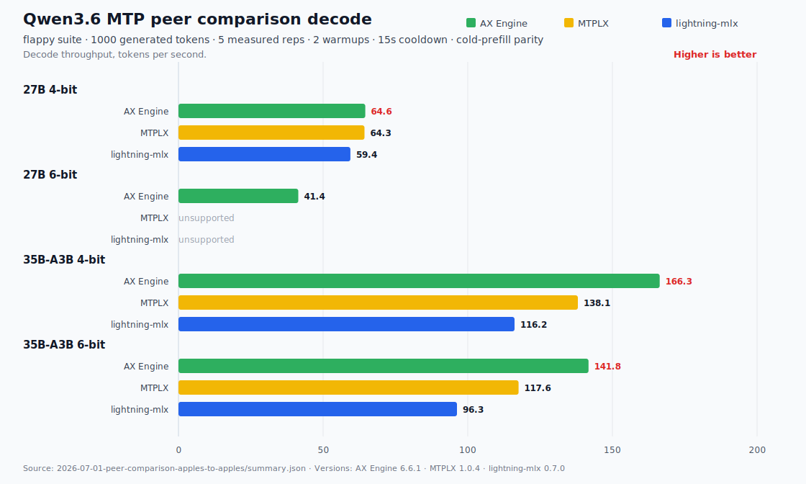
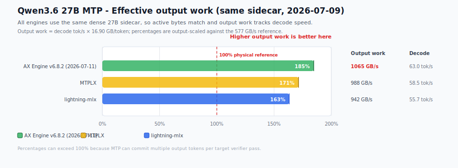
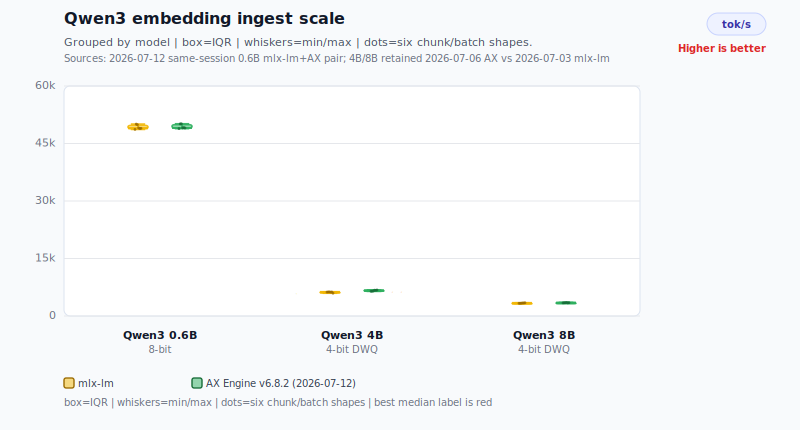
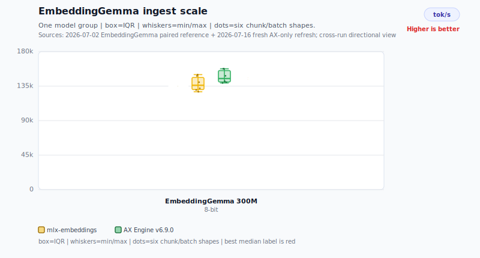

# AX Engine

AX Engine is a Mac-first LLM inference runtime for Apple Silicon developers who
want local models to be fast, inspectable, and easy to serve. It is not just a
wrapper around `mlx_lm`: for direct-support Gemma, Qwen, and GLM families,
AX Engine owns the MLX graph path, KV/runtime behavior, server route, model
packaging, and benchmark contract.

## Why AX Engine

AX Engine is built to win the full interactive local-model path, not just report
one isolated kernel number. In the current public direct-mode high-water
matrix, AX Engine leads `mlx_lm` on prefill, runner-time TTFT, and direct decode
for every listed model row with an `mlx_lm` reference, at 128, 512, and 2,048
prompt tokens. Peer rows and model-specific boundaries are kept visible.

- **First-class MTP:** one-command MTP package preparation through
  `ax-engine download-mtp`, including the Gemma 4 12B 4-bit quick-start target
  plus recommended 6-bit MTP benchmarking and 4-bit comparison lanes.
- **Simple local serving:** install the wheel, download or prepare a model, then
  run the printed `ax-engine serve ...` command for OpenAI-compatible local
  endpoints.
- **Repo-owned direct runtime:** direct-support Gemma, Qwen, and GLM paths run
  in AX Engine's MLX runtime by default; delegated `mlx-lm` and `llama.cpp`
  adapters are explicit compatibility paths, not AX inference modes.
- **Serious benchmarking:** public results are tied to checked-in artifacts that
  record route identity, model snapshot, prompt suite, sampler, cooldowns,
  repetitions, MTP accept rate, prefill, decode, TTFT, and dirty-state
  provenance.
- **Agent-oriented support:** Qwen3-Coder-Next is called out separately from the
  Qwen3.6 family because it carries a coding-first architecture and validation
  path.

## Table of Contents

- [Why AX Engine](#why-ax-engine)
- [Quick Start](#quick-start)
- [Installation](#installation)
- [Getting a Model](#getting-a-model)
- [Typical Hardware](#typical-hardware)
- [What AX Engine Does](#what-ax-engine-does)
- [Performance](#performance)
  - [Session Mode: MTP Generation](#session-mode-mtp-generation)
    - [Supported MTP packages](#supported-mtp-packages)
    - [Download and serve an MTP package](#download-and-serve-an-mtp-package)
    - [AX Engine 6-bit MTP package acceleration (2026-07-09)](#ax-engine-6-bit-mtp-package-acceleration-2026-07-09)
    - [Qwen3.6 MTP peer decode comparison (2026-07-09)](#qwen36-mtp-peer-decode-comparison-2026-07-09)
    - [Gemma 4 assistant-MTP (depth-2)](#gemma-4-assistant-mtp-depth-2)
  - [Session Mode: Direct Generation](#session-mode-direct-generation)
    - [Gemma 4 12B](#gemma-4-12b)
    - [DiffusionGemma](#diffusiongemma)
    - [Gemma 4 and Qwen 3.6](#gemma-4-and-qwen-36)
  - [Session Mode: Embeddings](#session-mode-embeddings)
    - [Qwen3-Embedding ingest scale](#qwen3-embedding-ingest-scale)
    - [EmbeddingGemma ingest scale](#embeddinggemma-ingest-scale)
- [SDKs](#sdks)
- [Server Usage](#server-usage)
- [Documentation](#documentation)
- [Workspace](#workspace)
- [Development](#development)
- [Benchmark Reference Projects](#benchmark-reference-projects)
- [Limitations](#limitations)
- [Contributing](#contributing)
- [Community](#community)
- [Acknowledgments](#acknowledgments)
- [License](#license)

## Quick Start

**Requires macOS 26 (Tahoe) or later on Apple Silicon M2 Max or newer.**
Earlier macOS releases are not supported — there is no wheel or binary for them.
The Gemma 4 12B MTP path is intended for high-memory machines; use the memory
tiers listed in [Typical Hardware](#typical-hardware).

**Install with pip** (see [Typical Hardware](#typical-hardware) for machine sizing):

Upgrade pip first so pip 23+ can find the macOS wheel, and keep the package
spec quoted for zsh. The wheel bundles AX and MLX runtime assets, so Xcode is
not required for the normal runtime path. This is the primary deployment path
for end users.

```bash
python3 -m pip install --upgrade pip
python3 -m pip install -U "ax-engine[download]>=6.8.2,<7"
ax-engine doctor
```

**Download a Gemma 4 12B MTP package:**

```bash
ax-engine download-mtp gemma-4-12b-4bit
# Then run the printed "ax-engine serve ..." command.
```

**Send one request from another terminal:**

```bash
curl http://127.0.0.1:8080/v1/chat/completions \
  -H 'content-type: application/json' \
  -d '{"model":"gemma-4-12b-it","messages":[{"role":"user","content":"Say hello in one sentence."}],"max_tokens":64}'
```

For model choices, SDK examples, optional Homebrew installs, and source builds, see the
[Getting Started guide](docs/GETTING-STARTED.md) and [SDK docs](docs/sdk/README.md).

## Installation

For platform requirements, troubleshooting, optional extras, secondary
Homebrew installs, source builds, and release-channel diagnostics, see the
[Getting Started installation guide](docs/GETTING-STARTED.md#installation).
The Python wheel is the primary install path. Homebrew remains available for
macOS users who want package-manager-owned CLI binaries, and source builds are
for development or unreleased changes. Apple's Metal compiler tools are
installed outside pip and are only required for source builds, development
diagnostics, or rebuilding AX Metal kernels.

## Getting a Model

AX Engine loads pre-sanitized MLX safetensors plus an AX
`model-manifest.json`. Use `ax-engine tui` for an interactive picker,
`ax-engine download --list` for direct-decode aliases, `ax-engine serve <alias>
--download` for one-command serving, and `ax-engine download-mtp <target>` for
supported MTP packages.
Detailed aliases, MTP targets, raw checkpoint conversion, cache behavior, and
manifest commands live in
[Supported Models](docs/SUPPORTED-MODELS.md#getting-model-artifacts) and the
[CLI reference](docs/CLI.md#ax-engine).

```bash
# Browse models, queue downloads, choose destinations, and launch serving.
ax-engine tui

# Serve a direct model in one command.
ax-engine serve qwen36-35b --download --port 8080

# Or inspect and download direct-model artifacts separately.
ax-engine download --list
ax-engine download qwen36-35b --json

# Prepare a Gemma 4 12B MTP package.
ax-engine download-mtp gemma-4-12b-4bit
```

`ax-engine tui` lists downloadable model families, groups precision variants,
offers Direct-vs-MTP choices, and sends long downloads to a background queue so
you can keep browsing other models. The destination picker defaults to the
shared Hugging Face Hub cache and can also select a parent directory from a
terminal directory tree; direct downloads use `--dest`, and MTP packages use
`--output`. The Downloads tab shows live bytes/s and logs, and a ready item can
be served directly from the TUI. Scripts and CI keep the non-interactive
`download` behavior and JSON output.

Common acquisition paths:

| Model/package | Command | Runtime path |
| --- | --- | --- |
| Direct MLX models | `ax-engine download <alias-or-mlx-community-repo>` | Repo-owned MLX graph |
| Gemma 4 12B quick-start MTP | `ax-engine download-mtp gemma-4-12b-4bit` | Gemma assistant-MTP |
| Qwen3.6 27B / 35B-A3B MTP | `ax-engine download-mtp qwen3.6-27b-6bit` or `qwen3.6-35b-a3b` | Qwen fused MTP sidecar |
| Gemma 4 12B / 26B / 31B 6-bit MTP | `ax-engine download-mtp gemma-4-12b`, `gemma-4-26b`, or `gemma-4-31b` | Gemma assistant-MTP |
| GLM-4.7 Flash MTP | `ax-engine download-mtp glm-4.7-flash` | GLM built-in MTP sidecar |
| Raw Hugging Face checkpoints | Convert with `mlx_lm.convert`, then run `ax-engine-bench generate-manifest` | Direct only after sanitization |

Direct-support model families:

| Family | Direct model IDs | Notes |
| --- | --- | --- |
| Gemma 4 | `gemma-4-e2b-it`, `gemma-4-e4b-it`, `gemma-4-12b-it`, `gemma-4-26b-a4b-it`, `gemma-4-31b-it` | MLX affine 4/5/6-bit weights; assistant-MTP paths |
| Qwen 3 | `Qwen3-4B-4bit` and manifest-backed dense checkpoints | Dense SwiGLU graph |
| Qwen 3.5 | `Qwen3.5-9B-MLX-4bit` | GatedDeltaNet linear attention |
| Qwen 3.6 | `Qwen3.6-35B-A3B` 4/6-bit, `Qwen3.6-27B` 4/5/6-bit | `qwen3_next`; fused sidecar-MTP paths |
| Qwen3-Coder-Next | `Qwen3-Coder-Next-4bit` | Direct coding-agent path |
| GLM 4.7 Flash | `glm4_moe_lite` / `glm4.7-flash-4bit` | Flash MLA + MoE graph |

Direct support means AX owns the `ax-engine-mlx` graph and loads MLX safetensors
through the AX manifest path. Unsupported families fail closed by default.
`mlx_lm_delegated` and `llama_cpp` remain explicit compatibility adapters for
migration and validation, not default deployment paths.

## Typical Hardware

AX Engine targets high-memory Apple Silicon Macs running macOS 26 (Tahoe) or
later. Start at 32 GB unified memory for small models; use 64 GB, 128 GB, or
larger machines when running the recommended local chatbot, agent, and coding
model stack.

Full sizing tables and model-stack recommendations live in the
[hardware FAQ](docs/FAQ.md#what-hardware-does-ax-engine-support) and
[model-stack FAQ](docs/FAQ.md#what-model-stack-should-i-run-on-high-memory-apple-silicon).

## What AX Engine Does

AX Engine is a local inference runtime for high-memory Apple Silicon Macs. It
keeps model acquisition, serving, acceleration, and benchmark evidence behind
one explicit runtime contract:

- **Serve local models through stable APIs.** The server exposes OpenAI-shaped
  chat/completions, native generate routes, Ollama-compatible chat, SDK
  sessions, and route metadata.
- **Run supported MLX models in a repo-owned runtime.** Direct-support families
  use AX-owned model graphs, tokenizer/KV handling, scheduling, and runtime
  telemetry.
- **Prepare acceleration-ready packages.** `download-mtp` packages Qwen fused
  sidecars, Gemma assistant drafters, and GLM built-in MTP sidecars; n-gram
  acceleration remains a separate direct-runtime policy.
- **Keep long sessions efficient.** Prefix reuse restores validated physical
  MLX KV snapshots so chat and agent loops avoid repeatedly pre-filling the
  same context.
- **Benchmark the contract, not just kernels.** `ax-engine-bench` preserves
  route identity, sampler settings, prompt shape, correctness checks, and
  artifact provenance for public claims.

[mlx_lm](https://github.com/ml-explore/mlx-lm) is the canonical MLX reference.
AX Engine compares against `mlx_lm.benchmark` and treats `mlx_lm.server` only as
an explicit compatibility adapter when a caller opts into delegation. See the
[FAQ](docs/FAQ.md#is-ax-faster-because-it-replaces-mlx-kernels) for the
boundary between MLX kernels and AX-owned runtime behavior, and the
[model support policy](docs/MODEL-SUPPORT-POLICY.md) for promotion and EOL
rules.

Design details: [Architecture](docs/ARCHITECTURE.md) ·
[Scheduler](docs/SCHEDULER.md) · [KV Cache](docs/KV-CACHE.md) ·
[Long Context](docs/LONG-CONTEXT.md) · [Benchmark Design](docs/BENCH-DESIGN.md).

### Runtime Paths

| Path | Use it for | What AX owns |
| --- | --- | --- |
| Repo-owned MLX runtime | Direct-support model families and AX-owned performance claims | Model graph, token/KV runtime, scheduling, acceleration policy, server/SDK route behavior |
| `mlx_lm_delegated` | Explicit migration or compatibility checks for MLX text models before direct support | AX route compatibility over a user-provided `mlx_lm.server`; not AX token/KV throughput |
| `llama_cpp` | Explicit GGUF/non-MLX compatibility checks or external reference rows | AX route compatibility over llama.cpp server/CLI behavior; not AX MLX throughput |

Runtime reports expose `selected_backend`, `support_tier`, and
`resolution_policy` so callers and benchmark artifacts can distinguish direct
execution from delegated compatibility. For endpoint details, see
[`docs/API-COMPATIBILITY.md`](docs/API-COMPATIBILITY.md).

## Performance

Full result tables and interpretation live in
[`docs/PERFORMANCE.md`](docs/PERFORMANCE.md). Public claim boundaries live in
[`docs/performance/README.md`](docs/performance/README.md). Benchmark
methodology, test setup, and reproduction details live in
[`docs/BENCHMARKS.md`](docs/BENCHMARKS.md).

**Benchmarking session baseline (8-Jul-2026):** AX Engine benchmark rows use
AX Engine `v6.8.2`. Direct-mode peer benchmarking is limited to the existing
local `llama.cpp` and `mlx-lm` versions: `llama.cpp` `b9910` / `ggml` `0.15.3`
for GGUF Metal reference rows and `mlx-lm` `0.31.3` for MLX reference rows.
MTP peer benchmarking uses the current local MTPLX release, `MTPLX 2.0.1`.

Performance results are grouped by **Session mode**. Read each mode as a
separate benchmark session with its own route, workload shape, and headline
metric; do not compare rows across modes unless the text explicitly says they
share a same-artifact denominator.

| Session mode | What it measures | Headline metric | Keep separate from |
| --- | --- | --- | --- |
| MTP generation | Speculative generation with a draft/MTP package plus target verification | MTP decode tok/s, speedup over same-package direct, accept rate | Direct-mode peer rows and embedding ingest rows |
| Direct generation | Non-speculative autoregressive generation through AX, mlx-lm, or llama.cpp routes | Decode tok/s, prefill tok/s, TTFT | MTP speedup rows; diffusion rows call out their own non-AR metric |
| Embeddings | Encoder-style embedding throughput and ingest scale | Chunks/s, tokens/s, latency at batch/chunk settings | Text generation decode/prefill/TTFT |

### Session Mode: MTP Generation

AX Engine supports three MTP packaging contracts in the repo-owned runtime: Qwen
fused sidecars, Gemma assistant drafters, and GLM built-in MTP sidecars. The
cross-engine peer comparison is Qwen-only — Qwen3.6 27B and Qwen3.6 35B-A3B,
each at 4-bit and 6-bit, MTP-only rows — because MTPLX and lightning-mlx ship
comparable Qwen MTP packages but no comparable Gemma or GLM one. Gemma 4
assistant-MTP is published separately below as an AX-only depth result, since no
peer engine ships the same package. Same-package direct baselines may be kept as
AX diagnostics, but they are not headline MTP matrix rows.

#### Supported MTP packages

Use `ax-engine download-mtp <target>` for the packages below. These targets are
the supported repo-owned MTP preparation paths; direct-model aliases are listed
separately in [Getting a Model](#getting-a-model).

| Target | Base model | MTP package |
| --- | --- | --- |
| `gemma-4-12b-4bit` | `mlx-community/gemma-4-12B-it-4bit` | Quick-start Gemma assistant-MTP package with `mlx-community/gemma-4-12B-it-assistant-4bit` |
| `qwen3.6-27b-6bit` | `mlx-community/Qwen3.6-27B-6bit` | Qwen fused sidecar from `Qwen/Qwen3.6-27B` |
| `qwen3.6-35b-a3b` | `mlx-community/Qwen3.6-35B-A3B-6bit` | Qwen fused sidecar from `Qwen/Qwen3.6-35B-A3B` |
| `gemma-4-12b` | `mlx-community/gemma-4-12B-it-6bit` | Gemma assistant-MTP package with `mlx-community/gemma-4-12B-it-assistant-6bit` |
| `gemma-4-26b` | `mlx-community/gemma-4-26b-a4b-it-6bit` | Gemma assistant-MTP package with `google/gemma-4-26b-a4b-it-assistant` |
| `gemma-4-31b` | `mlx-community/gemma-4-31b-it-6bit` | Gemma assistant-MTP package with `google/gemma-4-31b-it-assistant` |
| `glm-4.7-flash` | `mlx-community/GLM-4.7-Flash-6bit` | GLM built-in MTP layer extracted from `zai-org/GLM-4.7-Flash` |

The practical AX Engine benchmark lane is the 6-bit `download-mtp` set. The
`gemma-4-12b-4bit` target is kept as the Quick Start path, and Qwen 4-bit
packages are comparison artifacts for peer MTP engines rather than normal
`download-mtp` targets.

#### Download and serve an MTP package

Install with the download extra, prepare a target, then run the serve command
printed by the CLI:

```bash
python3 -m pip install -U "ax-engine[download]>=6.8.2,<7"

ax-engine download-mtp gemma-4-12b-4bit
# or: ax-engine download-mtp qwen3.6-27b-6bit
# or: ax-engine download-mtp glm-4.7-flash

# The command prints the prepared package path and a matching:
# ax-engine serve <prepared-mtp-package> --port 8080
```

By default, packages are written as synthetic Hugging Face cache snapshots under
the active HF cache root. Use `--output <dir>` when you need an explicit
destination, `--force` to rebuild an existing package, and `--json` for scripts.
See [Supported Models](docs/SUPPORTED-MODELS.md#mtp-downloads) and the
[CLI reference](docs/CLI.md#ax-engine) for aliases and advanced options.

#### Benchmark scope

| Target | Preparation / source | Benchmark mode |
| --- | --- | --- |
| `qwen3.6-27b-4bit` | prepared Qwen fused sidecar | Qwen fused sidecar MTP |
| `qwen3.6-27b-6bit` | `ax-engine download-mtp qwen3.6-27b-6bit` | Qwen fused sidecar MTP |
| `qwen3.6-35b-a3b-4bit` | prepared Qwen fused sidecar | Qwen fused sidecar MTP |
| `qwen3.6-35b-a3b` | `ax-engine download-mtp qwen3.6-35b-a3b` | Qwen fused sidecar MTP |
| `gemma-4-12b` | `ax-engine download-mtp gemma-4-12b` | Gemma assistant-MTP |
| `gemma-4-26b` | `ax-engine download-mtp gemma-4-26b` | Gemma assistant-MTP |
| `gemma-4-31b` | `ax-engine download-mtp gemma-4-31b` | Gemma assistant-MTP |
| `glm-4.7-flash` | `ax-engine download-mtp glm-4.7-flash` | GLM built-in MTP |

Rules for current MTP benchmark artifacts:

- Use MTP mode for all promoted rows.
- Report decode tok/s, prefill tok/s, TTFT ms, and MTP accept rate.
- Keep unsupported MTPLX, lightning-mlx, Rapid-MLX, or oMLX lanes visible in
  the plan with their support reason.
- Do not run or promote `mtp-ngram` rows.
- Keep the Qwen3.6 peer matrix free of Qwen3-Coder-Next, 5-bit, 8-bit, FFN-only,
  GGUF, and GLM variants; Gemma 4 assistant-MTP is published as a separate
  AX-only subsection, not mixed into the cross-engine matrix.
- Direct rows are same-artifact denominators for `AX MTP / AX direct` decode
  acceleration, not a cross-model speed leaderboard.
- Keep promoted peer rows on strict AX MTP verification
  (`AX_MLX_MTP_OPTIMISTIC=0`). Optimistic verify is useful for AX-only
  throughput experiments, but it is not a clean peer-comparison default.

The benchmark prompt suites remain `flappy`, `long_code`, and
`python_modules_long`, with sampled decode (`temperature=0.6`, `top_p=0.95`,
`top_k=20`), `1000` generated tokens, `5` measured repetitions, and recorded
cooldown. Current matrix artifacts live under
`benchmarks/results/mtp-qwen36-matrix/`. Every artifact records the exact model
snapshot or peer model id, MTP package provenance where applicable, route
identity, accept rate, prefill throughput, decode throughput, TTFT, sampler,
prompt suite, repetitions, and cooldown.

Plan without running inference:

```bash
python3 scripts/bench_qwen36_mtp_matrix.py
```

Run supported lanes:

```bash
python3 scripts/bench_qwen36_mtp_matrix.py --execute
```

For production-like AX Engine guidance, use the 6-bit lane. The 4-bit lane is
published to make comparison with other MTP engines easier because many peer
benchmarks use 4-bit models. Historical MTP+n-gram artifacts remain useful for
debugging regressions, but they are not current README/PERFORMANCE MTP evidence.

#### AX Engine 6-bit MTP package acceleration (2026-07-09)

This refresh is an AX Engine-only benchmark of the practical 6-bit
`download-mtp` lane. "AX Engine-only" describes the measurement scope, not an
MTP support boundary: AX Engine also documents the Gemma 4 12B 4-bit quick-start
target and Qwen 4-bit peer-comparison lanes above. The table shows how much MTP
accelerates each repo-owned 6-bit package against the same package with MTP
disabled; it is not a cross-engine leaderboard and should not be mixed with the
Qwen peer comparison below. The 2026-07-09 refresh uses the `flappy`,
`long_code`, and `python_modules_long` suites (`py_modules` in the table),
sampled decode
(`temperature=0.6`, `top_p=0.95`, `top_k=20`), 1000 generated tokens, 5
measured repetitions, 1 warmup, and 15 s cooldown. The run uses the local
MLX 0.32.0 / mlx-lm 0.31.3 stack and the repo-owned AX MTP routes for Qwen
fused sidecars, Gemma assistant drafters, and GLM built-in MTP. `AX MTP runner
TTFT` is server runner time for the prefill/first-token boundary; it is not
end-to-end client-wall latency.


| Target | Suite | AX direct decode | AX MTP decode | AX speedup | AX MTP prefill | AX MTP runner TTFT | AX accept |
| --- | --- | ---: | ---: | ---: | ---: | ---: | ---: |
| `qwen3.6-27b-6bit` | `flappy` | 22.8 tok/s | 65.7 tok/s | 2.89x | 242.2 tok/s | 1330 ms | 100.0% |
| `qwen3.6-27b-6bit` | `long_code` | 22.8 tok/s | 65.3 tok/s | 2.86x | 252.7 tok/s | 2839 ms | 100.0% |
| `qwen3.6-27b-6bit` | `py_modules` | 22.9 tok/s | 65.6 tok/s | 2.87x | 250.7 tok/s | 1396 ms | 100.0% |
| `qwen3.6-35b-a3b` | `flappy` | 96.6 tok/s | 148.0 tok/s | 1.53x | 1,294.4 tok/s | 249 ms | 100.0% |
| `qwen3.6-35b-a3b` | `long_code` | 99.8 tok/s | 147.3 tok/s | 1.48x | 1,648.8 tok/s | 435 ms | 100.0% |
| `qwen3.6-35b-a3b` | `py_modules` | 99.5 tok/s | 150.1 tok/s | 1.51x | 1,399.5 tok/s | 248 ms | 100.0% |
| `gemma-4-12b` | `flappy` | 38.8 tok/s | 95.4 tok/s | 2.46x | 560.9 tok/s | 614 ms | 100.0% |
| `gemma-4-12b` | `long_code` | 38.1 tok/s | 94.6 tok/s | 2.48x | 571.5 tok/s | 1413 ms | 100.0% |
| `gemma-4-12b` | `py_modules` | 38.7 tok/s | 74.9 tok/s | 1.94x | 568.6 tok/s | 665 ms | 99.0% |
| `gemma-4-26b` | `flappy` | 89.3 tok/s | 148.2 tok/s | 1.66x | 1,376.5 tok/s | 253 ms | 100.0% |
| `gemma-4-26b` | `long_code` | 89.2 tok/s | 144.5 tok/s | 1.62x | 1,605.7 tok/s | 507 ms | 100.0% |
| `gemma-4-26b` | `py_modules` | 90.6 tok/s | 135.7 tok/s | 1.50x | 1,430.3 tok/s | 264 ms | 99.0% |
| `gemma-4-31b` | `flappy` | 17.7 tok/s | 45.6 tok/s | 2.57x | 211.6 tok/s | 1625 ms | 99.9% |
| `gemma-4-31b` | `long_code` | 17.7 tok/s | 44.1 tok/s | 2.48x | 212.3 tok/s | 3802 ms | 100.0% |
| `gemma-4-31b` | `py_modules` | 18.1 tok/s | 39.6 tok/s | 2.18x | 214.1 tok/s | 1766 ms | 98.7% |
| `glm-4.7-flash` | `flappy` | 74.8 tok/s | 122.9 tok/s | 1.64x | 1,063.1 tok/s | 260 ms | 98.1% |
| `glm-4.7-flash` | `long_code` | 74.5 tok/s | 100.9 tok/s | 1.35x | 1,268.6 tok/s | 538 ms | 98.6% |
| `glm-4.7-flash` | `py_modules` | 76.4 tok/s | 91.2 tok/s | 1.19x | 1,134.4 tok/s | 300 ms | 94.3% |

All rows are pure MTP verification rows with zero n-gram accepted/proposed/
submitted/hit-step telemetry. Publication summary:
[`benchmarks/results/speculative/mtp-6bit/2026-07-09-mlx032-ax-mtp-refresh/summary.json`](benchmarks/results/speculative/mtp-6bit/2026-07-09-mlx032-ax-mtp-refresh/summary.json).

#### Qwen3.6 MTP peer decode comparison (2026-07-09)

README keeps only the decode-throughput view for the Qwen3.6 MTP peer
comparison because decode is the closest comparable metric across AX Engine,
MTPLX, and lightning-mlx. The full benchmark page explains why prefill, TTFT,
accept rate, seed policy, model-artifact identity, and output-degeneracy checks
need separate interpretation:
[`docs/mtp/qwen36-peer-comparison.md`](docs/mtp/qwen36-peer-comparison.md).

This is a stitched peer comparison, not one interleaved physical-session
benchmark. AX Engine rows were refreshed on the current code; MTPLX rows were
refreshed with MTPLX 2.0.1; lightning-mlx rows are retained from the prior
peer artifacts and called out as retained rows in the stitched chart source.
The 27B 4-bit rows load the same
`ax-local/Qwen3.6-27B-MTP` sidecar across AX Engine, MTPLX, and lightning-mlx;
the 35B-A3B peer rows remain production-configuration rows with the peer
engines' Youssofal MTPLX-optimized packages. The AX 27B 4-bit row uses strict
MTP verification and passes the output-degeneracy gate; older optimistic
artifacts remain useful only as audit/debug evidence.



| Target | AX Engine decode | MTPLX decode | lightning-mlx decode | Readout |
| --- | ---: | ---: | ---: | --- |
| Qwen3.6 27B 4-bit | 63.0 tok/s | 58.5 tok/s | 55.7 tok/s | Same AX sidecar across all three engines; AX leads this row |
| Qwen3.6 27B 6-bit | 41.8 tok/s | - | - | No official comparable peer 27B 6-bit MTP artifact |
| Qwen3.6 35B-A3B 4-bit | 172.4 tok/s | 137.9 tok/s | 116.2 tok/s | AX leads this production-config row |
| Qwen3.6 35B-A3B 6-bit | 141.2 tok/s | 119.0 tok/s | 96.3 tok/s | AX leads this production-config row |

**27B effective output work (same sidecar):** On the identical 27B dense
sidecar, active bytes match across engines, so output work tracks the decode
ranking and is safe to show as the bar metric. The active-byte value is the
same for every row, so the chart omits that column.



Read output-work percentages above 100% as MTP output leverage, not impossible
memory bandwidth. For the 27B 4-bit rows, each target verifier pass reads about
16.9 GB of weights, but a successful MTP pass can commit several accepted draft
tokens. AX, for example, runs about 16.5 verifier passes/s and emits about
3.8 output tokens/pass, so the physical target-cycle estimate is about
279 GB/s while the output-scaled diagnostic is about 1065 GB/s. The latter is
useful for explaining committed-token work per second, but it is not a claim
that the GPU exceeded the 577 GB/s physical-memory reference.

35B-A3B is intentionally not charted as an output-work diagnostic because the
peer rows are production-configuration MoE package rows with different
active-byte estimates. AX leads that row on the fair speed metric, decode
tok/s; active bytes and output work are retained in the detailed table only as
audit context.

Full results, charts, artifact links, and fairness limitations:
[`docs/mtp/qwen36-peer-comparison.md`](docs/mtp/qwen36-peer-comparison.md).
Stitched chart source:
[`benchmarks/results/mtp-qwen36-matrix/2026-07-09-peer-comparison-apples-to-apples-refresh/summary.json`](benchmarks/results/mtp-qwen36-matrix/2026-07-09-peer-comparison-apples-to-apples-refresh/summary.json).
Decode and output-work diagnostic source:
[`benchmarks/results/mtp-qwen36-matrix/2026-07-09-peer-comparison-apples-to-apples-refresh/bandwidth_diagnostic.json`](benchmarks/results/mtp-qwen36-matrix/2026-07-09-peer-comparison-apples-to-apples-refresh/bandwidth_diagnostic.json).
For the older AX-only Qwen3.6 table across `flappy`, `long_code`, and
`python_modules_long`, see
[`docs/mtp/qwen36-matrix-refresh.md`](docs/mtp/qwen36-matrix-refresh.md). That
table is useful for prompt-suite regression review, but it is not a separate
README headline result.

Rapid-MLX is intentionally not promoted in this table: it starts with the
shared Qwen3.6 artifacts but skips MTP installation for this generation flow, so
including it would measure non-MTP decode. oMLX remains unmeasured because this
repo does not yet have an oMLX Qwen3.6 MTP prompt-suite adapter.

#### Gemma 4 assistant-MTP (depth-2)

Gemma 4 speculates with an **assistant-drafter** package, not a Qwen-style fused
sidecar, so no peer engine ships the same Gemma MTP package — MTPLX and
lightning-mlx have no comparable Gemma assistant-MTP route. The result below is
therefore an AX-only comparison (same-artifact direct decode versus depth-2
assistant drafting), not a cross-engine leaderboard. The
assistant is stateless per decode step — it re-reads the target's frozen KV
cache each forward — so depth-2 drafting needs no cache surgery and stays
correctness-preserving: a gate miss simply verifies fewer speculative positions,
never a changed committed token.

Retained 12B benchmark (M5 Max, clean `6ff19f66` release build,
`temperature=0.6`, `top_p=0.95`, `top_k=20`, chat-templated `flappy` /
`long_code` / `python_modules_long` (`py_modules` in the table), n-gram
stacking off, depth-2 assistant drafting). This dedicated 12B chart is kept as
a historical depth-2 assistant-MTP view; the newer six-model 6-bit MTP refresh
above is the current README headline source for Gemma 4 12B:

<p>
<strong>Gemma 4 12B assistant-MTP decode</strong><br>

</p>

| Suite | Assistant accept | AX direct decode | AX MTP decode | Speedup | AX MTP prefill | AX MTP TTFT |
| --- | ---: | ---: | ---: | ---: | ---: | ---: |
| `flappy` | 98.4% | 58.9 tok/s | 97.9 tok/s | 1.66x | 1,860.5 tok/s | 194 ms |
| `long_code` | 99.1% | 58.1 tok/s | 96.3 tok/s | 1.66x | 2,023.3 tok/s | 394 ms |
| `py_modules` | 97.0% | 58.9 tok/s | 90.0 tok/s | 1.53x | 1,817.7 tok/s | 201 ms |

All three 12B suites hold assistant accept **>=97%** and depth-2 MTP is faster
than same-artifact direct decode by **1.53-1.66x**. The aggregate comparison in
the artifact reports **+63.6%** decode versus direct, with the worst suite still
up **+52.8%**. Depth-2 is the shipped default; set
`AX_MLX_GEMMA4_ASSISTANT_MTP_MAX_DEPTH=1` to restore single-token drafting.
Method and per-suite artifacts:
[`docs/mtp/gemma4-assistant-multi-depth.md`](docs/mtp/gemma4-assistant-multi-depth.md);
current 12B result artifacts under
[`benchmarks/results/gemma4-assistant-mtp/2026-07-08-gemma4-12b-ax-only-direct-mtp-current-code-refresh/`](benchmarks/results/gemma4-assistant-mtp/2026-07-08-gemma4-12b-ax-only-direct-mtp-current-code-refresh/).

### Session Mode: Direct Generation

Direct generation disables speculative drafting and measures the base
autoregressive route. The charts in this section use decode tok/s, prefill
tok/s, and TTFT; these are not MTP accept-rate or speedup measurements.

#### Gemma 4 12B

Gemma 4 12B (`model_type: gemma4_unified`) is reported separately from the per-layer-embedding
E2B/E4B and MoE 26B/31B checkpoints because it has a distinct graph, multimodal tensor contract,
and benchmark boundary. **Upstream `mlx_lm` 0.31.3 cannot load it**
(`ValueError: Model type gemma4_unified not supported`), so the direct peer here is
**llama.cpp Metal** on a shape-compatible GGUF.

> [!NOTE]
> **AX Engine's repo-owned native MLX route supports Gemma 4 12B text plus inline base64
> image/audio/video chat.** Delegated compatibility routes remain text-first;
> `/v1/generate` accepts the processed `multimodal_inputs.gemma4_unified` tensor contract.

**At a glance:**

- **Direct decode:** AX native MLX reaches **65.2-69.2 tok/s** on the bit-comparable
  4-bit-FFN artifact versus llama.cpp Metal's **56.9-58.7 tok/s** depth-matched range.
- **Context depth:** AX's direct margin is **+21% / +15% / +14%** versus llama.cpp matched-depth decode at 128 / 512 / 2,048 prompt tokens.
- **Assistant-MTP:** On 12B real prompt suites, depth-2 assistant-MTP reaches
  **88.4-94.5 tok/s**, a **1.56-1.68x** speedup over same-artifact direct decode.
- **Why the earlier result flipped:** the upstream MLX snapshot keeps FFN weights at
  8-bit, so it reads about **1.65x** the bytes of the re-quantized 4-bit-FFN artifact.
  Decode is bandwidth-bound; matching quantization closes the gap.

**Direct decode peer comparison:**

AX direct rows use the 4-bit-FFN MLX artifact and random-token prompts. `mlx_lm` is absent
because it has no `gemma4_unified` graph. The llama.cpp rows are shape-compatible external
GGUF references, not prompt-hash-parity MLX rows.

<p>
<strong>Decode rate</strong><br>

</p>

<p>
<strong>Prefill rate</strong><br>

</p>

<p>
<strong>TTFT</strong><br>

</p>

| Prompt tokens | AX decode | llama.cpp decode (depth 0) | llama.cpp decode (matched depth) | AX prefill | llama.cpp prefill | AX TTFT (ms) | llama.cpp TTFT (ms) |
| ---: | ---: | ---: | ---: | ---: | ---: | ---: | ---: |
| 128 | 69.2 | 57.1 | 56.9 | 1,184 | 1,245 | 108 | 103 |
| 512 | 67.5 | 57.3 | 58.7 | 1,867 | 1,740 | 274 | 294 |
| 2048 | 65.2 | 56.0 | 57.5 | 2,049 | 1,544 | 999 | 1,327 |

Read the two llama.cpp decode columns carefully:

- `depth 0` is plain `llama-bench tg`, decoding from an empty context and representing llama.cpp's best case.
- `matched depth` uses `-d {prompt} -n 128`, so decode happens after the same prompt depth AX has already prefetched.
- AX wins the matched-depth comparison at every prompt size, and prefill also leads at 512 and 2,048 tokens.

The table uses the bit-comparable **4-bit-FFN** AX artifact
(`scripts/requantize_gemma4_12b_ffn_4bit.py`), about 4.5 bpw versus the Q4_K_M GGUF's
about 4.8 bpw. The upstream `mlx-community/gemma-4-12B-it-4bit` snapshot keeps the FFN at
**8-bit** (~10.98 GB) and trails llama.cpp at about 46 tok/s. That is a bytes-read handicap,
not an AX runtime result.

**Memory bandwidth diagnostic:**

This chart is a diagnostic for the Gemma 4 12B quantization story, not a
recommendation to use an 8-bit tier. The "upstream artifact" row is included
only because the public `mlx-community/gemma-4-12B-it-4bit` snapshot keeps FFN
tensors at 8-bit; it explains the older slower AX result. Decode is
memory-bandwidth-bound on Apple Silicon: each token reads the model weights
once, so decode tok/s is set by bytes-read and how close the engine gets to the
memory ceiling. Measured M5 Max GPU peak read bandwidth ≈ 577 GB/s (MLX
reduction over a 6 GB array).


| Engine / quantization | Weights/token | Decode tok/s | Effective BW | % of 577 GB/s peak |
| --- | ---: | ---: | ---: | ---: |
| AX upstream artifact — 8-bit FFN diagnostic | 10.98 GB | 45.4 | 498 GB/s | 86% |
| AX re-quantized artifact — 4-bit FFN | 6.74 GB | 67.5 | 455 GB/s | 79% |
| llama.cpp Q4_K_M — decode @ depth 512 | 7.38 GB | 58.7 | 433 GB/s | 75% |
| llama.cpp Q4_K_M — decode @ depth 0 (`tg`) | 7.38 GB | 57.1 | 421 GB/s | 73% |

The bandwidth view is the key explanation: AX is not under-utilizing memory. The re-quantized
AX row sustains **455 GB/s**, in the same band as llama.cpp's **433 GB/s** at matched depth.
The remaining direct-decode difference is bytes read per token: uniform 4-bit group-64 reduces
AX to **6.74 GB/token**, while Q4_K_M reads **7.38 GB/token**. The upstream artifact
has higher bus utilization (86%) but worse speed because its FFN tensors read far more data.

**Methodology and artifacts:**

Direct rows use the 4-bit-FFN artifact, greedy-equivalent sampler, 128 generated tokens,
5 repetitions, 15 s cooldown, and random-token prompts following the `mlx_lm.benchmark`
contract. llama.cpp decode is shown both at depth 0 (`tg`) and at matched context depth
(`-d {prompt}`). Host/runtime for this retained Gemma 4 12B llama.cpp reference:
Apple M5 Max · llama.cpp b9820 / ggml 0.15.3 (Metal, flash-attn) · `mlx_lm`
0.31.3 has no `gemma4_unified` support. The current direct-mode high-water
matrix uses the later b9910 llama.cpp sweep described in the provenance block
below. MTP methodology and artifacts live with
[Session Mode: MTP Generation](#session-mode-mtp-generation).

The llama.cpp peer columns are measured on llama.cpp b9820 / ggml 0.15.3; full per-prompt
llama.cpp data is in the verification artifact
[`gemma-4-12b-it-4bit-b9820-verify.json`](benchmarks/results/inference/llama-cpp-metal/2026-06-27-llama-only-rerun/gemma-4-12b-it-4bit-b9820-verify.json).
The AX rows come from the current direct-only AX artifact below. The llama.cpp rows are retained
from the earlier peer rerun, so these columns are a shape-compatible cross-run comparison, not a
single-session A/B.

Full artifacts:
[`2026-07-04-gemma4-12b-ax-direct-mtp-refresh`](benchmarks/results/inference/mlx-inference/2026-07-04-gemma4-12b-ax-direct-mtp-refresh/gemma-4-12b-it-4bit-direct.json)
(AX direct rerun; chart artifact with retained llama.cpp reference rows in
[`gemma-4-12b-it-4bit-with-llama-reference.json`](benchmarks/results/inference/mlx-inference/2026-07-04-gemma4-12b-ax-direct-mtp-refresh/gemma-4-12b-it-4bit-with-llama-reference.json);
llama.cpp GGUF provenance in
[`llama_cpp_gguf_provenance.json`](benchmarks/results/inference/mlx-inference/2026-06-26-gemma4-12b-4bit-ax-direct-only/llama_cpp_gguf_provenance.json)).
The upstream 8-bit-FFN bandwidth row is backed by
[`2026-06-26-gemma4-12b-upstream-8bit-ffn-ax-direct-only`](benchmarks/results/inference/mlx-inference/2026-06-26-gemma4-12b-upstream-8bit-ffn-ax-direct-only/gemma-4-12b-it-4bit.json).

Gemma 4 12B multimodal benchmark details now live in
[Benchmarks](docs/BENCHMARKS.md#gemma-4-12b-multimodal-benchmark).

Gemma assistant-MTP package layout and cache-location details live in
[Supported Models](docs/SUPPORTED-MODELS.md#mtp-downloads).

#### DiffusionGemma

DiffusionGemma (`mlx-community/diffusiongemma-26B-A4B-it-4bit`, `model_type:
diffusion_gemma`) is an **experimental** repo-owned MLX path. It is a
26B-A4B MoE Gemma 4 checkpoint that generates by **block diffusion** rather than
autoregressive next-token decoding: each visible output comes from a 256-token
canvas that is denoised bidirectionally and then committed with a causal pass.

> [!WARNING]
> DiffusionGemma is **not recommended for production use**. It is published as
> an architecture preview and benchmarking curiosity. The autoregressive paths
> above (Gemma 4, Qwen 3.6, GLM 4.7) are the supported production routes.

> [!IMPORTANT]
> These are **not** the same metric as the autoregressive rows above. For a
> next-token decoder, `decode tok/s` is the steady token-by-token loop and
> `TTFT` is prefill plus one token. DiffusionGemma has neither, so the columns
> below report **first-block decode** (`256 / block wall time`) and **time to
> first committed block** (prefill wall plus the first denoise-and-commit
> block). Do not read them as directly comparable to the Gemma 4 12B or
> Gemma 4 / Qwen 3.6 AR throughput.

The rows are **AX Engine only**. No peer engine loads this architecture in a
released build: `mlx_lm` 0.31.3 rejects `Model type diffusion_gemma not
supported`, and stable `llama.cpp` Metal fails with `unknown model
architecture: 'diffusion-gemma'`. An unmerged llama.cpp draft PR adds the
architecture, but a draft branch is not a stable baseline, so no peer row is
published here.

<p>
<strong>First-block decode rate</strong><br>

</p>

<p>
<strong>Prefill rate</strong><br>

</p>

<p>
<strong>Time to first block</strong><br>

</p>

| Prompt tokens | AX first-block decode | AX prefill | AX time to first block | Denoise steps | Committed block |
| ---: | ---: | ---: | ---: | ---: | ---: |
| 128 | 158.9 tok/s | 1,151.0 tok/s | 1,723 ms | 12 | 256 tokens |
| 512 | 109.6 tok/s | 2,794.0 tok/s | 2,520 ms | 17 | 256 tokens |
| 2048 | 163.5 tok/s | 3,922.3 tok/s | 2,089 ms | 11 | 256 tokens |

The 2026-07-08 refresh is faster than the prior 2026-07-05 README artifact on
all published DiffusionGemma metrics: first-block decode improved by
**+7.5% / +5.1% / +16.7%** at 128 / 512 / 2048 prompt tokens, time to first
block dropped by **7.0% / 4.8% / 11.4%**, and prefill rose by
**+8.1% / +5.4% / +1.2%**. The main decode win comes from stopping earlier
under the 7.5% adaptive update-rate threshold, reducing denoise work by
1 / 1 / 2 steps.

First-block decode does not scale cleanly with prompt length because the
denoiser is **convergence-gated**: it iterates until the 256-token canvas
stabilises (11-17 steps here on realistic in-distribution prompts), so
throughput tracks how many denoise passes convergence needs, not prompt size.
Random-token prompts never converge, hit the step cap, and measure the failure
mode instead — these rows use prefixes of a coherent technical document
tokenized with the model's own tokenizer.

A block-granularity weight-traffic estimate puts this path at roughly
**21% of the M5 Max ~614 GB/s theoretical bandwidth**, i.e. it is **not**
memory-bandwidth-saturated: the diffusion denoise step is a parallel
whole-canvas matmul, so it is dispatch-, occupancy-, and kernel-mix-bound rather
than weight-streaming-bound. Method, convergence signals, optimization toggles,
and the bandwidth diagnostic live in
[`docs/DIFFUSIONGEMMA.md`](docs/DIFFUSIONGEMMA.md); full artifact:
[`2026-07-08-acceptance-075-first-block/summary.json`](benchmarks/results/inference/diffusion-gemma-direct/2026-07-08-acceptance-075-first-block/summary.json)
(release build, 1 warmup + 5 measured repetitions, 15 s cooldown, medians).

<!-- readme-performance-artifacts: reference=benchmarks/results/inference/mlx-inference/2026-05-26-direct-mode-clean-refresh/; reference=benchmarks/results/inference/mlx-inference/2026-06-26-qwen36-direct-refresh/; reference=benchmarks/results/inference/mlx-inference/2026-06-26-gemma4-6bit-mlx-lm-only/; ax-base=benchmarks/results/inference/mlx-inference/2026-06-27-ax-direct-only/; ax-overlay=benchmarks/results/inference/mlx-inference/2026-07-01-ax-direct-4bit-refresh-clean-r2/; reference=benchmarks/results/inference/mlx-inference/2026-07-02-gemma4-6bit-direct-refresh/; ax-overlay=benchmarks/results/inference/mlx-inference/2026-07-02-gemma4-6bit-direct-refresh/; ax-overlay=benchmarks/results/inference/mlx-inference/2026-07-05-gemma4-e2b-e4b-6bit-ax-refresh-r2/; ax-overlay=benchmarks/results/inference/mlx-inference/2026-07-07-ax-direct-only-record-refresh-qwen-publishable/; ax-overlay=benchmarks/results/inference/mlx-inference/2026-07-07-gemma4-26b-4bit-ax-direct-refresh-gen128/ -->

#### Gemma 4 and Qwen 3.6

The family comparison below is a **high-water composite** for direct
(non-speculative) decode across llama.cpp Metal, mlx_lm, and ax engine, covering
Gemma 4 and Qwen 3.6 at 128/512/2048 prompt tokens. It combines the best
validated cells from the artifact sources listed in the provenance block below;
it is not a single same-session rerun of every row. `ax direct baseline`
disables n-gram acceleration, MTP, and assistant drafting to measure the
repo-owned direct decode path. Bench prompts are `mlx_lm.benchmark` seed-0
random tokens, which keeps prompt-hash parity across MLX rows.

The prefill and runner-time TTFT advantage is the practical direct-mode story.
The refreshed Gemma 4 and Qwen 3.6 4-bit high-water rows come from
`benchmarks/results/inference/mlx-inference/2026-07-01-ax-direct-4bit-refresh-clean-r2/`;
the 2026-07-07 Qwen 3.6 overlay in
`benchmarks/results/inference/mlx-inference/2026-07-07-ax-direct-only-record-refresh-qwen-publishable/`
updates the published 6-bit cells where it raises the existing high-water mark
and records clean build commit `f73f1ac2`. The 2026-07-07 Gemma 4 26B A4B
4-bit AX-only overlay in
`benchmarks/results/inference/mlx-inference/2026-07-07-gemma4-26b-4bit-ax-direct-refresh-gen128/`
updates only decode cells that raise the existing high-water mark; its prefill
and TTFT medians are retained as artifact evidence but are not published over
faster earlier cells. AX leads `mlx_lm` on prefill, runner-time TTFT, and decode
for every published Qwen 3.6 direct cell and every refreshed Gemma 4 4-bit row.
The Gemma 4 26B A4B and 31B 6-bit rows were re-measured on 2026-07-02 as
same-session paired `mlx_lm` + AX runs
(`benchmarks/results/inference/mlx-inference/2026-07-02-gemma4-6bit-direct-refresh/`,
clean build `4c0a8358`); AX now leads those rows on prefill, runner-time TTFT,
and decode as well — the earlier 6-bit decode deficit was a stale measurement
from the older `01976818` build, predating the decode-path improvements the
4-bit refresh already captured. That means the repo-owned MLX route is
especially valuable for interactive requests where prompt ingestion dominates
perceived latency: AX keeps prompt prefill, first-token timing, model-specific
graph paths, and route metadata in one measured runtime path. These are
cold-prefix rows, not prompt-cache, continuous-batching, or speculative-decoding
claims.

<p>
<strong>Gemma 4 decode rate</strong><br>

</p>

<p>
<strong>Qwen 3.6 decode rate</strong><br>

</p>

<p>
<strong>Gemma 4 prefill rate</strong><br>

</p>

<p>
<strong>Qwen 3.6 prefill rate</strong><br>

</p>

<p>
<strong>Gemma 4 TTFT</strong><br>

</p>

<p>
<strong>Qwen 3.6 TTFT</strong><br>

</p>

> **`llama.cpp Metal*` column** — Shape-compatible reference produced by Metal-enabled `llama-bench`. `llama-bench` generates its own internal synthetic prompt tokens and does not consume the harness prompt JSON, so these numbers are **not** prompt-hash parity with the other columns. No percentage delta is shown. MLX bit-widths are mapped to the nearest Unsloth GGUF quant (4→Q4_K_M, 6→Q6_K), with explicit UD-* Unsloth Dynamic rows only when no standard root-level K-quant is published. Source: `benchmarks/manifests/llama_cpp_metal/inventory.json`, `scripts/bench_llama_cpp_metal_sweep.py`.

<details>
<summary>Benchmark provenance and methodology</summary>

The `mlx_lm` reference rows for the Gemma 4 rows shown below come from `benchmarks/results/inference/mlx-inference/2026-05-26-direct-mode-clean-refresh/`. The refreshed Gemma 4 4-bit AX direct-mode cells come from `benchmarks/results/inference/mlx-inference/2026-07-01-ax-direct-4bit-refresh-clean-r2/`, which reran AX Engine only for Gemma 4 E2B/E4B/26B/31B at 128/512/2048 prompt tokens with 5 repetitions, 1 warmup, and a 15 s cooldown. Those artifacts record benchmark build commit `d4c59ffc` and `git_tracked_dirty: false`. The Gemma 4 26B A4B 4-bit decode cells are raised by the AX-only 2026-07-07 refresh in `benchmarks/results/inference/mlx-inference/2026-07-07-gemma4-26b-4bit-ax-direct-refresh-gen128/`, a clean `ax-engine-server` build at commit `194a235a` with 2 warmups, 5 measured repetitions, generation=128, and a 15 s cooldown; README high-water merging only publishes the decode medians from that overlay because its prefill and TTFT medians do not beat the earlier 2026-07-01 record. The Gemma 4 26B A4B and 31B 6-bit rows (both the `mlx_lm` and AX cells) come from the same-session paired rerun in `benchmarks/results/inference/mlx-inference/2026-07-02-gemma4-6bit-direct-refresh/`, which ran `mlx_lm.benchmark` and AX Engine back-to-back per model on a clean build at commit `4c0a8358` with the same 5-repetition, 1-warmup, 15 s-cooldown contract; the earlier `mlx_lm`-only 6-bit spot rows in `benchmarks/results/inference/mlx-inference/2026-06-26-gemma4-6bit-mlx-lm-only/` are retained as historical reference. The Gemma 4 E2B/E4B 6-bit AX cells come from the ax-engine-only rerun in `benchmarks/results/inference/mlx-inference/2026-07-05-gemma4-e2b-e4b-6bit-ax-refresh-r2/`, a clean `ax-engine-server` build at commit `6f2e6cd7` with the same 5-repetition, 1-warmup, 15 s-cooldown contract; these rows are AX-only because `mlx-lm` 0.31.3 cannot strict-load either E-series 6-bit checkpoint (see the shared-KV note below), so the E2B 6-bit `mlx_lm` reference cells are retained from the 2026-05-26 refresh. The Qwen 3.6 `mlx_lm` reference rows come from `benchmarks/results/inference/mlx-inference/2026-06-26-qwen36-direct-refresh/`; the published Qwen 3.6 AX cells combine earlier high-water overlays with the AX-only 2026-07-07 refresh in `benchmarks/results/inference/mlx-inference/2026-07-07-ax-direct-only-record-refresh-qwen-publishable/`, a clean `ax-engine-server` build at commit `f73f1ac2` with 2 warmups, 5 measured repetitions, and a 15 s cooldown. The 2026-07-07 Qwen overlay contains condition-checked 4/6-bit rerun rows, but README high-water merging only publishes cells that match or improve the prior record; lower rerun cells keep the earlier faster artifact. The overlay replaces the original 35B-A3B 6-bit continuation row because its recorded load average exceeded the README publication limit. Current install docs and package metadata track v6.8.2; each benchmark artifact's `build.commit` records the exact measured build SHA. The `llama.cpp Metal*` column is injected from `benchmarks/manifests/llama_cpp_metal/inventory.json` and the full llama.cpp-only rerun in `benchmarks/results/inference/llama-cpp-metal/2026-07-08-llama-cpp-only-rerun/`, which reran all 12 Gemma 4 + Qwen 3.6 rows (llama.cpp b9910, Metal, flash-attn, `-b/-ub` matched to prompt length, decode measured at matched context depth).

Gemma 4 E4B 6-bit keeps the `mlx_lm` cells blank because `mlx_lm.benchmark` cannot load `mlx-community/gemma-4-e4b-it-6bit` with `mlx-lm` 0.31.3. The checkpoint config declares 42 language layers and `num_kv_shared_layers=18`, so the upstream Gemma4 text model builds K/V projections only for layers 0..23 and treats layers 24..41 as shared-KV layers. The MLX snapshot still contains 126 per-layer K/V tensors for layers 24..41 (`k_norm`, `k_proj`, and `v_proj` quantized weights), causing strict weight loading to fail with `Received 126 parameters not in model`. Source: `benchmarks/results/inference/mlx-inference/2026-06-26-gemma4-6bit-mlx-lm-only/summary.md`. The same strict-load failure now applies to `mlx-community/gemma-4-e2b-it-6bit` on `mlx-lm` 0.31.3 (140 extra tensors for shared-KV layers 15..34), which is why the 2026-07-05 E-series 6-bit refresh is AX-only and the E2B `mlx_lm` cells remain the retained 2026-05-26 measurements.

Setup: generation=128, 5 measured repetitions, 15-second cooldown, AX prefix
cache disabled for cold prefill and TTFT measurement, production-build binaries,
matching prompt SHA checks. AX prefill and TTFT cells are runner-time
measurements for the model work boundary, not end-to-end client-wall latency.
Long-greedy AX prefill rows are runner-time measurements of the cache-state
prefix plus final prompt-token boundary — not full-logits prompt scoring
throughput. Percentages are versus `mlx_lm`.

The 2K `llama.cpp Metal*` prefill rows are long-context, GGUF-runtime-reference rows, produced with llama.cpp b9910 (Metal offload, `-b/-ub` matched to prompt length up to 2048, flash attention enabled). This is our benchmark boundary, not an upstream llama.cpp official bug statement.
</details>

Qwen 3.6 direct-mode verdict: AX is faster against `mlx_lm` in every refreshed 27B and 35B-A3B 4/6-bit cell. The 35B-A3B margins are large throughout; the dense 27B margins are widest at 128/512 prompt tokens and narrow to roughly +2-6% at 2,048 prompt tokens.

#### Prefill throughput (tok/s) — percentages vs mlx_lm

| Model | MLX quantization | Prompt tok | llama.cpp Metal* | mlx_lm | ax engine |
| --- | --- | ---: | ---: | ---: | ---: |
| Gemma 4 E2B | 4-bit | 128 | 3,729.7 | 2,338.1 | **6,123.5 (+161.9%)** |
|  |  | 512 | 7,095.0 | 7,870.0 | **17,314.3 (+120.0%)** |
|  |  | 2048 | 7,136.7 | 18,014.7 | **24,664.6 (+36.9%)** |
| Gemma 4 E2B | 6-bit | 128 | 3,612.1 | 1,823.5 | **5,397.9 (+196.0%)** |
|  |  | 512 | 7,071.5 | 6,046.6 | **16,037.6 (+165.2%)** |
|  |  | 2048 | 7,247.1 | 15,332.1 | **22,157.8 (+44.5%)** |
| Gemma 4 E4B | 4-bit | 128 | 2,285.2 | 1,513.2 | **3,458.8 (+128.6%)** |
|  |  | 512 | 4,173.1 | 4,195.5 | **6,312.3 (+50.5%)** |
|  |  | 2048 | 4,197.6 | 7,325.4 | **8,848.8 (+20.8%)** |
| Gemma 4 E4B | 6-bit | 128 | 2,287.0 | — | **2,953.2** |
|  |  | 512 | 4,241.3 | — | **6,060.4** |
|  |  | 2048 | 4,209.0 | — | **7,913.3** |
| Gemma 4 26B A4B | 4-bit | 128 | 1,888.8 | 496.4 | **1,354.5 (+172.8%)** |
|  |  | 512 | 3,439.4 | 1,621.0 | **3,053.7 (+88.4%)** |
|  |  | 2048 | 3,524.3 | 3,300.1 | **4,675.5 (+41.7%)** |
| Gemma 4 26B A4B | 6-bit | 128 | 1,688.1 | 574.6 | **1,164.3 (+102.6%)** |
|  |  | 512 | 3,123.4 | 1,729.8 | **2,790.3 (+61.3%)** |
|  |  | 2048 | 3,347.8 | 3,411.2 | **4,329.7 (+26.9%)** |
| Gemma 4 31B | 4-bit | 128 | 531.0 | 283.1 | **513.0 (+81.2%)** |
|  |  | 512 | 667.4 | 619.9 | **741.5 (+19.6%)** |
|  |  | 2048 | 579.6 | 733.9 | **780.2 (+6.3%)** |
| Gemma 4 31B | 6-bit | 128 | 501.4 | 280.1 | **430.7 (+53.8%)** |
|  |  | 512 | 657.8 | 541.7 | **663.4 (+22.5%)** |
|  |  | 2048 | 568.6 | 677.4 | **718.8 (+6.1%)** |
| Qwen 3.6 27B | 4-bit | 128 | 546.1 | 424.7 | **582.3 (+37.1%)** |
|  |  | 512 | 763.6 | 739.0 | **845.2 (+14.4%)** |
|  |  | 2048 | 673.4 | 914.9 | **935.4 (+2.2%)** |
| Qwen 3.6 27B | 6-bit | 128 | 533.4 | 348.0 | **496.5 (+42.7%)** |
|  |  | 512 | 750.4 | 655.1 | **761.5 (+16.2%)** |
|  |  | 2048 | 649.9 | 832.1 | **849.7 (+2.1%)** |
| Qwen 3.6 35B A3B | 4-bit | 128 | 1,730.5 | 562.4 | **1,116.4 (+98.5%)** |
|  |  | 512 | 3,127.3 | 1,613.6 | **2,587.9 (+60.4%)** |
|  |  | 2048 | 3,508.9 | 3,455.1 | **3,747.3 (+8.5%)** |
| Qwen 3.6 35B A3B | 6-bit | 128 | 1,602.8 | 431.6 | **876.4 (+103.0%)** |
|  |  | 512 | 2,921.1 | 1,394.4 | **2,396.8 (+71.9%)** |
|  |  | 2048 | 3,348.1 | 2,494.3 | **3,487.3 (+39.8%)** |

#### Decode throughput (tok/s) — generation=128 tokens, temp=0

| Model | MLX quantization | Prompt tok | llama.cpp Metal* | mlx_lm | ax direct baseline |
| --- | --- | ---: | ---: | ---: | ---: |
| Gemma 4 E2B | 4-bit | 128 | 161.0 | 214.0 | **234.8 (+9.7%)** |
|  |  | 512 | 161.5 | 210.3 | **227.4 (+8.2%)** |
|  |  | 2048 | 156.2 | 200.9 | **217.6 (+8.3%)** |
| Gemma 4 E2B | 6-bit | 128 | 142.7 | 172.2 | **179.6 (+4.3%)** |
|  |  | 512 | 141.2 | 166.3 | **179.2 (+7.8%)** |
|  |  | 2048 | 137.3 | 162.5 | **168.4 (+3.6%)** |
| Gemma 4 E4B | 4-bit | 128 | 104.5 | 137.1 | **144.5 (+5.4%)** |
|  |  | 512 | 103.4 | 133.6 | **141.5 (+5.9%)** |
|  |  | 2048 | 101.6 | 130.6 | **138.5 (+6.1%)** |
| Gemma 4 E4B | 6-bit | 128 | 87.8 | — | **107.2** |
|  |  | 512 | 87.2 | — | **105.4** |
|  |  | 2048 | 85.4 | — | **104.0** |
| Gemma 4 26B A4B | 4-bit | 128 | 94.3 | 127.9 | **135.5 (+5.9%)** |
|  |  | 512 | 93.2 | 125.0 | **132.3 (+5.8%)** |
|  |  | 2048 | 89.2 | 119.3 | **127.7 (+7.1%)** |
| Gemma 4 26B A4B | 6-bit | 128 | 88.6 | 104.4 | **109.7 (+5.0%)** |
|  |  | 512 | 88.0 | 101.2 | **107.4 (+6.2%)** |
|  |  | 2048 | 86.0 | 96.8 | **103.9 (+7.4%)** |
| Gemma 4 31B | 4-bit | 128 | 25.9 | 28.9 | **29.2 (+1.2%)** |
|  |  | 512 | 26.1 | 28.3 | **28.7 (+1.4%)** |
|  |  | 2048 | 24.8 | 27.0 | **27.5 (+1.6%)** |
| Gemma 4 31B | 6-bit | 128 | 19.8 | 19.5 | **20.2 (+3.6%)** |
|  |  | 512 | 19.6 | 19.1 | **19.8 (+3.8%)** |
|  |  | 2048 | 19.1 | 18.5 | **19.1 (+3.4%)** |
| Qwen 3.6 27B | 4-bit | 128 | 27.6 | 33.2 | **35.0 (+5.2%)** |
|  |  | 512 | 27.6 | 33.1 | **34.9 (+5.6%)** |
|  |  | 2048 | 27.0 | 32.6 | **34.5 (+5.8%)** |
| Qwen 3.6 27B | 6-bit | 128 | 21.8 | 24.3 | **25.1 (+3.2%)** |
|  |  | 512 | 21.7 | 24.3 | **25.4 (+4.6%)** |
|  |  | 2048 | 21.5 | 24.1 | **24.9 (+3.4%)** |
| Qwen 3.6 35B A3B | 4-bit | 128 | 91.5 | 129.7 | **156.4 (+20.6%)** |
|  |  | 512 | 91.4 | 128.3 | **155.4 (+21.2%)** |
|  |  | 2048 | 89.8 | 125.2 | **153.1 (+22.3%)** |
| Qwen 3.6 35B A3B | 6-bit | 128 | 89.6 | 111.3 | **126.8 (+13.9%)** |
|  |  | 512 | 89.0 | 110.4 | **125.4 (+13.6%)** |
|  |  | 2048 | 88.2 | 105.8 | **123.9 (+17.1%)** |

> Qwen 3.6 27B 4-bit at prompt=2,048 originally produced zero decode tokens because 4-bit quantization noise pushed an EOS token to argmax at decode step 0 on the `mlx_lm.benchmark` random-token contract. The benchmark harness now sends `sampling.ignore_eos=true` for AX throughput runs, matching how `mlx_lm.benchmark` measures fixed `gen=N` throughput. Production requests default to `ignore_eos=false`. Source: `benchmarks/results/inference/mlx-inference/2026-05-20-qwen27-4to5-direct-ngram-directcpp-r2/qwen3_6-27b-4bit.json`.

#### Time to first token (ms) — generation=128 tokens, temp=0

**Lower is better.** `mlx_lm` values are derived from reported prefill throughput. AX values are measured directly from per-step runner timing in the SSE event stream.

| Model | MLX quantization | Prompt tok | llama.cpp Metal* | mlx_lm | ax engine |
| --- | --- | ---: | ---: | ---: | ---: |
| Gemma 4 E2B | 4-bit | 128 | 34.3 | 54.7 | **20.9 (-61.8%)** |
|  |  | 512 | 72.2 | 65.1 | **29.6 (-54.5%)** |
|  |  | 2048 | 287.0 | 113.7 | **83.0 (-27.0%)** |
| Gemma 4 E2B | 6-bit | 128 | 35.4 | 70.2 | **23.7 (-66.2%)** |
|  |  | 512 | 72.4 | 84.7 | **31.9 (-62.3%)** |
|  |  | 2048 | 282.6 | 133.6 | **92.4 (-30.8%)** |
| Gemma 4 E4B | 4-bit | 128 | 56.0 | 84.6 | **37.0 (-56.3%)** |
|  |  | 512 | 122.7 | 122.0 | **81.1 (-33.5%)** |
|  |  | 2048 | 487.9 | 279.6 | **231.4 (-17.2%)** |
| Gemma 4 E4B | 6-bit | 128 | 56.0 | — | **43.3** |
|  |  | 512 | 120.7 | — | **84.5** |
|  |  | 2048 | 486.6 | — | **258.8** |
| Gemma 4 26B A4B | 4-bit | 128 | 67.8 | 257.8 | **94.5 (-63.3%)** |
|  |  | 512 | 148.9 | 315.8 | **167.7 (-46.9%)** |
|  |  | 2048 | 581.1 | 620.6 | **438.0 (-29.4%)** |
| Gemma 4 26B A4B | 6-bit | 128 | 75.8 | 222.8 | **109.9 (-50.6%)** |
|  |  | 512 | 163.9 | 296.0 | **183.5 (-38.0%)** |
|  |  | 2048 | 611.7 | 600.4 | **473.0 (-21.2%)** |
| Gemma 4 31B | 4-bit | 128 | 241.1 | 452.2 | **249.5 (-44.8%)** |
|  |  | 512 | 767.1 | 826.0 | **690.5 (-16.4%)** |
|  |  | 2048 | 3,533.3 | 2,790.6 | **2,625.0 (-5.9%)** |
| Gemma 4 31B | 6-bit | 128 | 255.3 | 457.0 | **297.2 (-35.0%)** |
|  |  | 512 | 778.4 | 945.1 | **771.7 (-18.3%)** |
|  |  | 2048 | 3,601.9 | 3,023.2 | **2,849.2 (-5.8%)** |
| Qwen 3.6 27B | 4-bit | 128 | 234.4 | 301.4 | **219.8 (-27.1%)** |
|  |  | 512 | 670.5 | 692.8 | **605.8 (-12.6%)** |
|  |  | 2048 | 3,041.2 | 2,238.6 | **2,189.5 (-2.2%)** |
| Qwen 3.6 27B | 6-bit | 128 | 240.0 | 367.8 | **257.8 (-29.9%)** |
|  |  | 512 | 682.3 | 781.6 | **672.4 (-14.0%)** |
|  |  | 2048 | 3,151.3 | 2,461.1 | **2,410.2 (-2.1%)** |
| Qwen 3.6 35B A3B | 4-bit | 128 | 74.0 | 227.6 | **114.7 (-49.6%)** |
|  |  | 512 | 163.7 | 317.3 | **197.8 (-37.6%)** |
|  |  | 2048 | 583.7 | 592.7 | **546.5 (-7.8%)** |
| Qwen 3.6 35B A3B | 6-bit | 128 | 79.9 | 296.6 | **146.1 (-50.7%)** |
|  |  | 512 | 175.3 | 367.2 | **213.6 (-41.8%)** |
|  |  | 2048 | 611.7 | 821.1 | **587.3 (-28.5%)** |

### Session Mode: Embeddings

Embedding sessions use a separate pooling route from text generation. Public
README rows focus on sustained ingest workloads, where callers embed many chunks
and the fixed per-call cost can be amortized. Treat these rows as embedding
throughput and latency evidence, not as direct or MTP decode evidence.
Single-batch, cooled short-query comparisons are useful diagnostics for
query-serving latency, but they are not published here as headline throughput
because tok/s can overstate or obscure per-call latency behavior. The current
Qwen short-query diagnostic still shows an AX native-graph latency gap versus
`mlx-lm`; treat that as a performance investigation target rather than a
sustained-ingest claim.

#### Qwen3-Embedding ingest scale

**The latest Qwen3-Embedding sustained-ingest refresh is AX-only:** the
2026-07-06 run below measures current AX Engine medians across the same 18
chunk/batch shapes without rerunning `mlx-lm` in the same session.

For larger RAG ingest jobs, use the sustained scale harness instead of
extrapolating from one isolated batch. The scale harness keeps the same
contiguous CPU `float32 [B,H]` output layout but embeds a fixed corpus of 512
chunks per trial, divided into batches. The 2026-07-06 AX-only refresh uses 2
warmups, 5 measured trials, and a 15-second cooldown. Each measured pass is a
multi-batch ingest run. p95 batch latency is shown because larger batches
increase per-flush latency even when throughput (tok/s) is steady.

The previous same-session `mlx-lm` comparison remains available in
`benchmarks/results/embedding/embedding-scale/2026-07-03-qwen-paired-refresh/2026-07-02-215823/`
for parity analysis, but the table below is intentionally AX-only.
Compared with the retained 2026-07-03 Qwen AX high-water mark, this refresh is
faster on all 18 matching chunk/batch shapes, with gains from +0.5% to +14.1%.

The chart uses the retained same-session `mlx-lm` rows (yellow) plus the
current AX-only refresh (green); each box summarizes the six chunk/batch shapes
per model.



| Model | Workload | Batch | Batches/trial | AX tok/s | AX chunks/s | AX p95 batch ms |
| --- | --- | ---: | ---: | ---: | ---: | ---: |
| Qwen3-Embedding 0.6B 8-bit | 512 x 256-token chunks | 8 | 64 | 48,940.1 | 191.2 | 40.7 |
|  |  | 32 | 16 | 50,773.2 | 198.3 | 174.1 |
|  |  | 64 | 8 | 50,715.4 | 198.1 | 357.6 |
|  | 512 x 512-token chunks | 8 | 64 | 49,367.6 | 96.4 | 83.7 |
|  |  | 32 | 16 | 49,602.3 | 96.9 | 348.8 |
|  |  | 64 | 8 | 49,742.4 | 97.2 | 689.8 |
| Qwen3-Embedding 4B 4-bit DWQ | 512 x 256-token chunks | 8 | 64 | 6,776.1 | 26.5 | 314.6 |
|  |  | 32 | 16 | 6,721.9 | 26.3 | 1,274.8 |
|  |  | 64 | 8 | 6,710.9 | 26.2 | 2,551.1 |
|  | 512 x 512-token chunks | 8 | 64 | 6,529.4 | 12.8 | 646.3 |
|  |  | 32 | 16 | 6,432.4 | 12.6 | 2,690.4 |
|  |  | 64 | 8 | 6,480.7 | 12.7 | 5,229.3 |
| Qwen3-Embedding 8B 4-bit DWQ | 512 x 256-token chunks | 8 | 64 | 3,458.5 | 13.5 | 611.5 |
|  |  | 32 | 16 | 3,518.7 | 13.7 | 2,403.4 |
|  |  | 64 | 8 | 3,408.2 | 13.3 | 4,961.4 |
|  | 512 x 512-token chunks | 8 | 64 | 3,462.3 | 6.8 | 1,239.3 |
|  |  | 32 | 16 | 3,423.8 | 6.7 | 4,957.2 |
|  |  | 64 | 8 | 3,437.2 | 6.7 | 9,843.0 |

#### EmbeddingGemma ingest scale

**AX leads the retained `mlx-embeddings` reference by 1.3-8.6% on every
EmbeddingGemma shape below** — but note this is a fresh AX-only refresh compared
against retained reference medians, not a same-session paired run like the Qwen
rows above, so read it as a directional lead rather than a locked delta.

EmbeddingGemma uses `mlx-embeddings` as the sustained reference because its
full sentence-transformers route includes mean pooling, the Dense projection
head, and L2 normalization. The chart uses one `EmbeddingGemma 300M` group and
nests `mlx-embeddings` (yellow) plus AX Engine (green) inside it; each engine
box summarizes the six chunk/batch shapes listed below.



| Model | Workload | Batch | Batches/trial | `mlx-embeddings` tok/s | AX tok/s | AX vs | AX chunks/s | AX p95 batch ms |
| --- | --- | ---: | ---: | ---: | ---: | ---: | ---: | ---: |
| EmbeddingGemma 300M 8-bit | 512 x 256-token chunks | 8 | 64 | 129,909.0 | 136,101.8 | +4.8% | 531.6 | 15.0 |
|  |  | 32 | 16 | 148,284.8 | 154,307.2 | +4.1% | 602.8 | 60.1 |
|  |  | 64 | 8 | 149,976.1 | 152,897.7 | +1.9% | 597.3 | 126.1 |
|  | 512 x 512-token chunks | 8 | 64 | 127,604.8 | 138,617.4 | +8.6% | 270.7 | 29.5 |
|  |  | 32 | 16 | 140,105.8 | 141,992.7 | +1.3% | 277.3 | 123.3 |
|  |  | 64 | 8 | 132,121.8 | 135,667.0 | +2.7% | 265.0 | 263.1 |

Sources:
Qwen sustained-scale rows come from the AX-only artifact
`benchmarks/results/embedding/embedding-scale/2026-07-06-qwen-causal-final-attn-target-refresh/2026-07-06-230340/`.
EmbeddingGemma sustained-scale reference rows come from
`benchmarks/results/embedding/embedding-scale/2026-07-02-embeddinggemma-paired-cooldown15-refresh/2026-07-02-175206/`
and fresh AX rows from
`benchmarks/results/embedding/embedding-scale/2026-07-07-embeddinggemma-ax-only-refresh/2026-07-07-005538/`.
Qwen rows are current AX-only medians. EmbeddingGemma still compares a fresh AX
refresh against the retained reference medians. All scale runs use Hugging Face
snapshot paths, median tok/s, batch sizes 8/32/64, 512 chunks per trial,
l2-normalized output, 2 warmups, 5 measured trials, and a 15-second cooldown
between measured passes. Qwen uses AX last-token pooling; EmbeddingGemma uses AX
mean pooling + Dense head. Single-batch cooled artifacts remain under
`benchmarks/results/embedding/embedding-fair/` for latency diagnostics, but they are
intentionally not published here as headline throughput. API semantics, pooling
modes, micro-batching behavior, and cooldown profiles are documented in
[`docs/EMBEDDINGS.md`](docs/EMBEDDINGS.md).

Reproduce the sustained Qwen AX rows with:

```bash
python scripts/bench_embedding_ingest_scale.py \
  --model qwen3-embedding-0.6b-8bit=/path/to/Qwen3-Embedding-0.6B-8bit/snapshots/<sha> \
  --model qwen3-embedding-4b-4bit-dwq=/path/to/Qwen3-Embedding-4B-4bit-DWQ/snapshots/<sha> \
  --model qwen3-embedding-8b-4bit-dwq=/path/to/Qwen3-Embedding-8B-4bit-DWQ/snapshots/<sha> \
  --batch-sizes 32,64,8 --chunk-tokens 512,256 \
  --total-chunks 512 --warmup 2 --trials 5 --cooldown 15 \
  --ax-only
```

Reproduce the sustained EmbeddingGemma AX rows with:

```bash
python scripts/bench_embedding_ingest_scale.py \
  --model embeddinggemma-300m-8bit=/path/to/embeddinggemma-300m-8bit/snapshots/<sha> \
  --reference mlx_embeddings --pooling mean \
  --batch-sizes 8,32,64 --chunk-tokens 256,512 \
  --total-chunks 512 --warmup 2 --trials 5 --cooldown 15 \
  --ax-only
```

## SDKs

AX Engine SDK docs are organized under [`docs/sdk/`](docs/sdk/README.md).
Most SDKs target the OpenAI-compatible HTTP server; Python can also use the
in-process session API.

| SDK | Docs | Package / path |
| --- | --- | --- |
| **Rust** | [docs/sdk/rust.md](docs/sdk/rust.md) | `crates/ax-engine-sdk` |
| **Python** | [docs/sdk/python.md](docs/sdk/python.md) | `python/ax_engine` |
| **JavaScript / TypeScript** | [docs/sdk/javascript.md](docs/sdk/javascript.md) | `sdk/javascript` / `@ax-engine/sdk` |
| **Go** | [docs/sdk/go.md](docs/sdk/go.md) | `sdk/go/axengine` |
| **Ruby** | [docs/sdk/ruby.md](docs/sdk/ruby.md) | `sdk/ruby` / `ax-engine-sdk` |
| **Mojo** | [docs/sdk/mojo.md](docs/sdk/mojo.md) | `sdk/mojo/ax_engine.mojo` |

## Server Usage

Use `ax-engine serve` for normal local serving. It accepts a downloaded model
directory, a supported alias with `--download`, or the MTP package directory
printed by `ax-engine download-mtp`.

Start a direct-support model from an alias:

```bash
ax-engine serve qwen36-35b --download --port 8080
```

Or serve a prepared local package:

```bash
ax-engine serve "$MODEL_DIR" --port 8080
```

Inspect the runtime route before testing clients:

```bash
curl http://127.0.0.1:8080/v1/runtime
```

Send an OpenAI-compatible chat request:

```bash
curl http://127.0.0.1:8080/v1/chat/completions \
  -H 'content-type: application/json' \
  -d '{"model":"qwen3_dense","messages":[{"role":"user","content":"Say hello from AX."}],"max_tokens":64}'
```

For local-only development, HTTP authentication is disabled by default. To
require a bearer token on API routes, start with `--api-key` or set
`AX_ENGINE_API_KEY`; health probes remain unauthenticated. See
[`docs/SERVER.md`](docs/SERVER.md#authentication) for the full auth contract.

Use the low-level `ax-engine-server` entrypoint when you need explicit runtime
flags:

```bash
ax-engine-server \
  --mlx \
  --mlx-model-artifacts-dir "$MODEL_DIR" \
  --port 8080
```

Detailed endpoint examples, streaming, embeddings, Ollama-shaped adapters,
delegated `mlx_lm` routes, and server preview checks live in
[`docs/SERVER.md`](docs/SERVER.md) and
[`docs/GETTING-STARTED.md`](docs/GETTING-STARTED.md#first-commands).
Benchmark commands live with the performance docs instead of this usage
section.

## Documentation

Start with the task-based docs hub at [`docs/README.md`](docs/README.md).

| Need | Read |
| --- | --- |
| Install and run the first request | [Getting Started](docs/GETTING-STARTED.md) |
| Choose or download a model | [Supported Models](docs/SUPPORTED-MODELS.md) |
| Prepare MTP packages or compare 4-bit and 6-bit MTP rows | [MTP Docs](docs/mtp/README.md) |
| Interpret public performance numbers | [Performance Docs Map](docs/performance/README.md) |
| Reproduce or review benchmarks | [Benchmarks](docs/BENCHMARKS.md) |
| Integrate through HTTP or SDKs | [Server](docs/SERVER.md), [SDK Docs](docs/sdk/README.md) |
| Understand runtime internals | [Architecture](docs/ARCHITECTURE.md) |

## Workspace

```text
crates/ax-engine-core    Engine state machine, scheduler, KV manager, sampler
crates/ax-engine-mlx     MLX model graph, n-gram acceleration, KV cache, runner
crates/mlx-sys           bindgen FFI over ax_shim.h to MLX C++; safe MlxArray RAII wrappers
crates/ax-engine-sdk     Session API, backend resolution (MLX, mlx-lm delegated, or llama.cpp)
crates/ax-engine-server  Axum HTTP/SSE adapter (OpenAI-compatible routes)
crates/ax-engine-bench   Manifest-driven workload-contract CLI
crates/ax-engine-py      PyO3 extension (ABI3, Python 3.10+)
sdk/javascript           TypeScript/JS HTTP SDK + LangChain adapter
sdk/go/axengine          Go HTTP SDK
sdk/ruby/                Ruby HTTP SDK (ax-engine-sdk gem)
sdk/mojo/                Mojo SDK (Python-interop)
```

## Development

Common development gates:

```bash
cargo build --workspace
cargo test --quiet
cargo clippy --all-targets --all-features -- -D warnings
cargo fmt
maturin develop
python -m unittest discover -s python/tests -v
bash scripts/check-mlx-telemetry.sh
```

For Gemma/AX MLX telemetry and decode-profile changes, prefer the targeted `scripts/check-mlx-telemetry.sh` gate. Use `scripts/check-mlx-telemetry.sh --full-workspace` when the change touches shared Rust contracts; that protected path compiles the workspace with `cargo test --workspace --no-run --jobs 1` before running crate-by-crate tests.

CI keeps real-model smoke optional for ordinary pull requests when MLX model artifacts are not mounted, but `main`, `release/*`, manual runs with an explicit artifact path, and repositories with `AX_REQUIRE_MODEL_SMOKE=1` fail closed if `AX_ENGINE_MLX_MODEL_ARTIFACTS_DIR` is missing. The aggregate CI gate also fails closed when any required job fails, is cancelled, or is skipped.

Coverage is collected by the report-only GitHub Actions workflow in `.github/workflows/coverage.yml`. It publishes Rust `cargo llvm-cov` and Python `coverage.py` artifacts without enforcing a percentage threshold yet.

Public documentation starts at [docs/README.md](docs/README.md). Canonical
benchmark manifests are in `benchmarks/manifests/`.

## Benchmark Reference Projects

AX Engine's benchmark design and compatibility checks are informed by local reference checkouts of related open-source projects. A row is published only when it fits the benchmark contract for the specific workload: comparable model artifacts, prompt and sampling policy, prefill/decode/TTFT definitions, repeatability, host/runtime metadata, and provenance.

| Project | Repository |
| --- | --- |
| ds4 | [antirez/ds4](https://github.com/antirez/ds4) |
| lightning-mlx | [samuelfaj/lightning-mlx](https://github.com/samuelfaj/lightning-mlx) |
| llama.cpp | [ggml-org/llama.cpp](https://github.com/ggml-org/llama.cpp) |
| mistral.rs | [EricLBuehler/mistral.rs](https://github.com/EricLBuehler/mistral.rs) |
| MLX | [ml-explore/mlx](https://github.com/ml-explore/mlx) |
| mlx-engine | [lmstudio-ai/mlx-engine](https://github.com/lmstudio-ai/mlx-engine) |
| mlx-lm | [ml-explore/mlx-lm](https://github.com/ml-explore/mlx-lm) |
| mlx-turboquant | [rachittshah/mlx-turboquant](https://github.com/rachittshah/mlx-turboquant) |
| MTPLX | [youssofal/MTPLX](https://github.com/youssofal/MTPLX) |
| oMLX | [jundot/omlx](https://github.com/jundot/omlx) |
| Rapid-MLX | [raullenchai/Rapid-MLX](https://github.com/raullenchai/Rapid-MLX) |
| turboquant-mlx | [arozanov/turboquant-mlx](https://github.com/arozanov/turboquant-mlx) |
| vLLM | [vllm-project/vllm](https://github.com/vllm-project/vllm) |

The oMLX checkout is tracked for its Apple Silicon server, continuous batching,
tiered KV-cache behavior, OpenAI/Anthropic-compatible API surface, and admin
benchmark flow. Its one-click benchmark reports PP/TG throughput and partial
prefix-cache-hit behavior under a different harness, so it remains reference
evidence until it is adapted to AX Engine's prompt-suite and provenance
contract.

Some reference projects are experimental, version-unstable, focused on a different serving route, or not shaped for the same Apple MLX/Metal measurement strategy, so those results remain implementation guidance or diagnostic evidence rather than public comparison rows.

## Limitations

- **Qwen3.5 long-prompt prefill**: Qwen3.5 prefill can trail upstream MLX references on longer prompts; decode and Qwen3-Next are not affected in the same way.
- **Raw HuggingFace weights**: use pre-sanitized MLX community weights or convert first with `mlx_lm.convert`.
- **N-gram acceleration rows**: effective-throughput measurements, not raw model-kernel speedups.
- **TurboQuant KV compression**: experimental and off by default.

See the [FAQ limitations entry](docs/FAQ.md#what-are-the-current-limitations) for details.

## Contributing

AX Engine welcomes community input through issue tickets, wishlist requests, reproducible benchmark results, and documentation feedback. We generally do not accept unsolicited code PRs, especially for runtime, model, kernel, scheduler, cache, n-gram, or performance-tuning changes.

Performance tuning is tightly coupled: a local speedup can regress correctness, TTFT, memory pressure, direct-vs-n-gram behavior, long-context behavior, serving stability, or another model family. Please open an issue first with the problem, target workload, and evidence so maintainers can choose the right validation path. See [CONTRIBUTING.md](CONTRIBUTING.md) for issue, wishlist, and benchmark result guidelines.

## Community

- Website: [automatosx.com](https://automatosx.com)
- Discord: [Join us](https://discord.gg/aDhhburqJg)
- Email: [enquiry@defai.digital](mailto:enquiry@defai.digital)

## Acknowledgments

Special thanks to **[Samuel Faj](https://www.samuelfaj.com/en/)** — author of
[lightning-mlx](https://github.com/samuelfaj/lightning-mlx) — for his generous
support during AX Engine's MTP peer-comparison work. If you build LLM tooling on
Apple Silicon, we warmly recommend checking out his project,
**[Remote Code](https://www.remotecode.io/)**.

## License

Apache License, Version 2.0. See [LICENSE](LICENSE) for details.

Copyright (c) 2026 [DEFAI Private Limited](https://defai.digital)
