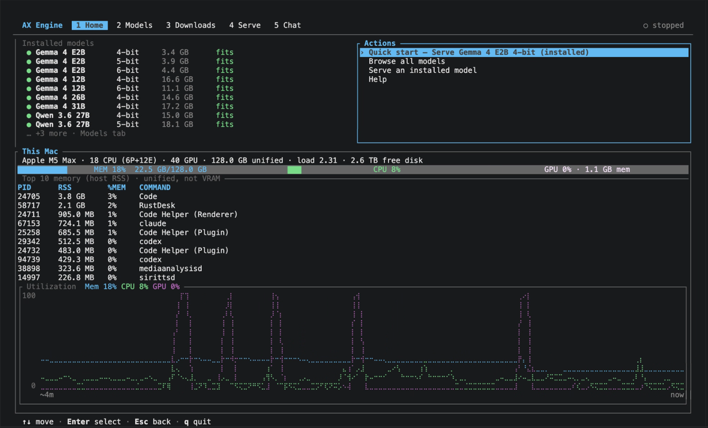

# AX Engine

AX Engine is a Mac-first LLM inference runtime for Apple Silicon. Install with
Homebrew, download a model, and serve OpenAI-compatible endpoints locally —
with a repo-owned MLX path for Gemma, Qwen, and GLM, first-class MTP, and
peer-backed benchmarks against `mlx-lm`, llama.cpp, MTPLX, and lightning-mlx.

Browse all serve-ready snapshots in the
[AutomatosX model collection on Hugging Face](https://huggingface.co/AutomatosX/models).

**Requires macOS 26 (Tahoe)+ on Apple Silicon (M2 Max or newer, 32 GB+ unified
memory).**

## Why AX Engine

- **Faster speculative decode** — AutomatosX chat snapshots bundle their MTP
  sidecar or assistant weights, so one standard download is serve-ready; AX
  shows measured speedups vs same-package direct and peer decode wins vs MTPLX
  and lightning-mlx on Qwen3.6
- **Strong direct decode on Apple Silicon** — Gemma and Qwen paths compete with
  `mlx-lm` and llama.cpp Metal on published decode charts
- **You own the stack you serve** — AX runs the MLX graph, KV/runtime, and
  OpenAI-compatible server for Gemma / Qwen / GLM; `mlx-lm` and `llama.cpp` stay
  optional compatibility adapters
- **Multi-model serving** — keep a scoped set of Qwen 3.5/3.6, Qwen3-Coder-Next,
  Gemma 4, and embedding models resident (`load_mode=add`), route with request
  `model` — including chat + embeddings from one process — with optional idle
  eviction and memory preflight; see
  [Server: Multi-model](docs/SERVER.md#multi-model-serving)
- **Claims you can audit** — public rows ship with checked-in artifacts (route,
  model snapshot, sampler, accept rate, provenance)

## Quick Start

### Homebrew (primary)

```bash
brew tap defai-digital/ax-engine
brew trust --formula \
  defai-digital/ax-engine/ax-engine \
  defai-digital/ax-engine/mlx \
  defai-digital/ax-engine/mlx-c
brew install defai-digital/ax-engine/ax-engine
ax-engine doctor
```

Homebrew is the primary install path for the CLI, server, and bench tools.
First install builds this tap's `mlx` / `mlx-c` from source (can take a while)
and needs full Xcode, not just Command Line Tools. On Xcode 26+, also install
Apple's Metal Toolchain component:

```bash
sudo xcode-select -s /Applications/Xcode.app/Contents/Developer
sudo xcodebuild -runFirstLaunch
xcodebuild -downloadComponent metalToolchain
```

If you already have Homebrew's `mlx` / `mlx-c` from `homebrew/core`, remove
them before installing AX Engine:

```bash
brew uninstall mlx-c mlx
```

### Python SDK (pip)

Use the wheel for Python applications that `import ax_engine`, optional Python
integrations, or systems where Homebrew is unavailable. Install it in a virtual
environment:

```bash
python3 -m venv .venv
source .venv/bin/activate
python3 -m pip install --upgrade pip
python3 -m pip install --upgrade "ax-engine[download]>=6.11.0,<7"
ax-engine doctor
```

The wheel also exposes `ax-engine` and `ax-engine-server` and bundles the bench
binary used by diagnostics. If both Homebrew and pip are installed, an active
virtual environment normally wins on `PATH`; use `which -a ax-engine` to see
every copy and prefer one installation channel in each shell. See
[Getting Started](docs/GETTING-STARTED.md) for the full channel comparison and
troubleshooting.

### Run AX Engine

**Option A — interactive TUI** (pick a model, download, serve, chat):

```bash
ax-engine tui
```

<p align="center">
  
</p>

**Option B — download and serve an MTP-ready snapshot**, then request from
another terminal:

```bash
ax-engine serve ax-gemma4-12b --download --port 31418

curl http://127.0.0.1:31418/v1/chat/completions \
  -H 'content-type: application/json' \
  -d '{"model":"gemma-4-12b-it","messages":[{"role":"user","content":"Say hello in one sentence."}],"max_tokens":64}'
```

**Option C — coding model** (download + serve):

```bash
ax-engine serve ax-qwen3-coder-next --download --port 31418
```

Python wheel, source builds, and troubleshooting:
[Getting Started](docs/GETTING-STARTED.md).

## Models

The managed download catalog is the complete public
[AutomatosX model collection](https://huggingface.co/AutomatosX/models?sort=alphabetical).
The TUI and `ax-engine download --list` expose these reviewed snapshots only.
Qwen 3.5, Qwen 3.6, and Gemma 4 are supported across every variant currently
published there: plain 4-bit/6-bit, QAT, and OptiQ where available.

Repositories ending in `-MTP` or `-Assistant-MTP` already contain the prepared
sidecar or assistant artifacts and `model-manifest.json`. Download them with
the standard flow; do **not** run `download-mtp` afterward.

| Family | Role | Supported AutomatosX snapshots |
| --- | --- | --- |
| Qwen 3.5 9B | Chat / agent | [`AX-Qwen3.5-9B-MLX-4bit-MTP`](https://huggingface.co/AutomatosX/AX-Qwen3.5-9B-MLX-4bit-MTP)<br>[`AX-Qwen3.5-9B-MLX-6bit-MTP`](https://huggingface.co/AutomatosX/AX-Qwen3.5-9B-MLX-6bit-MTP)<br>[`AX-Qwen3.5-9B-MLX-OptiQ-4bit-MTP`](https://huggingface.co/AutomatosX/AX-Qwen3.5-9B-MLX-OptiQ-4bit-MTP) |
| Qwen 3.6 27B | Chat / agent | [`AX-Qwen3.6-27B-MLX-4bit-MTP`](https://huggingface.co/AutomatosX/AX-Qwen3.6-27B-MLX-4bit-MTP)<br>[`AX-Qwen3.6-27B-MLX-6bit-MTP`](https://huggingface.co/AutomatosX/AX-Qwen3.6-27B-MLX-6bit-MTP)<br>[`AX-Qwen3.6-27B-MLX-OptiQ-4bit-MTP`](https://huggingface.co/AutomatosX/AX-Qwen3.6-27B-MLX-OptiQ-4bit-MTP) |
| Qwen 3.6 35B-A3B | Chat / agent | [`AX-Qwen3.6-35B-A3B-MLX-4bit-MTP`](https://huggingface.co/AutomatosX/AX-Qwen3.6-35B-A3B-MLX-4bit-MTP)<br>[`AX-Qwen3.6-35B-A3B-MLX-6bit-MTP`](https://huggingface.co/AutomatosX/AX-Qwen3.6-35B-A3B-MLX-6bit-MTP)<br>[`AX-Qwen3.6-35B-A3B-MLX-OptiQ-4bit-MTP`](https://huggingface.co/AutomatosX/AX-Qwen3.6-35B-A3B-MLX-OptiQ-4bit-MTP) |
| Gemma 4 12B | Chat / multimodal | [`AX-Gemma-4-12B-IT-MLX-6bit-Assistant-MTP`](https://huggingface.co/AutomatosX/AX-Gemma-4-12B-IT-MLX-6bit-Assistant-MTP)<br>[`AX-Gemma-4-12B-IT-MLX-QAT-4bit-Assistant-MTP`](https://huggingface.co/AutomatosX/AX-Gemma-4-12B-IT-MLX-QAT-4bit-Assistant-MTP)<br>[`AX-Gemma-4-12B-IT-MLX-QAT-OptiQ-4bit-Assistant-MTP`](https://huggingface.co/AutomatosX/AX-Gemma-4-12B-IT-MLX-QAT-OptiQ-4bit-Assistant-MTP) |
| Gemma 4 26B-A4B | Chat / multimodal | [`AX-Gemma-4-26B-A4B-IT-MLX-6bit-Assistant-MTP`](https://huggingface.co/AutomatosX/AX-Gemma-4-26B-A4B-IT-MLX-6bit-Assistant-MTP)<br>[`AX-Gemma-4-26B-A4B-IT-MLX-OptiQ-4bit-Assistant-MTP`](https://huggingface.co/AutomatosX/AX-Gemma-4-26B-A4B-IT-MLX-OptiQ-4bit-Assistant-MTP)<br>[`AX-Gemma-4-26B-A4B-IT-MLX-QAT-4bit-Assistant-MTP`](https://huggingface.co/AutomatosX/AX-Gemma-4-26B-A4B-IT-MLX-QAT-4bit-Assistant-MTP) |
| Gemma 4 31B | Chat / multimodal | [`AX-Gemma-4-31B-IT-MLX-6bit-Assistant-MTP`](https://huggingface.co/AutomatosX/AX-Gemma-4-31B-IT-MLX-6bit-Assistant-MTP)<br>[`AX-Gemma-4-31B-IT-MLX-OptiQ-4bit-Assistant-MTP`](https://huggingface.co/AutomatosX/AX-Gemma-4-31B-IT-MLX-OptiQ-4bit-Assistant-MTP)<br>[`AX-Gemma-4-31B-IT-MLX-QAT-4bit-Assistant-MTP`](https://huggingface.co/AutomatosX/AX-Gemma-4-31B-IT-MLX-QAT-4bit-Assistant-MTP) |
| Qwen3-Coder-Next | Coding agent | [`AX-Qwen3-Coder-Next-MLX-4bit`](https://huggingface.co/AutomatosX/AX-Qwen3-Coder-Next-MLX-4bit)<br>[`AX-Qwen3-Coder-Next-MLX-6bit`](https://huggingface.co/AutomatosX/AX-Qwen3-Coder-Next-MLX-6bit) |
| DiffusionGemma 26B-A4B | Diffusion language model | [`AX-DiffusionGemma-26B-A4B-IT-MLX-4bit`](https://huggingface.co/AutomatosX/AX-DiffusionGemma-26B-A4B-IT-MLX-4bit) |
| EmbeddingGemma 300M | Embeddings | [`AX-EmbeddingGemma-300M-MLX-8bit`](https://huggingface.co/AutomatosX/AX-EmbeddingGemma-300M-MLX-8bit) |
| Qwen3-Embedding 0.6B | Embeddings | [`AX-Qwen3-Embedding-0.6B-MLX-8bit`](https://huggingface.co/AutomatosX/AX-Qwen3-Embedding-0.6B-MLX-8bit) |
| Qwen3-Embedding 4B / 8B | Embeddings | [`AX-Qwen3-Embedding-4B-MLX-4bit-DWQ`](https://huggingface.co/AutomatosX/AX-Qwen3-Embedding-4B-MLX-4bit-DWQ)<br>[`AX-Qwen3-Embedding-8B-MLX-4bit-DWQ`](https://huggingface.co/AutomatosX/AX-Qwen3-Embedding-8B-MLX-4bit-DWQ) |

The default Hugging Face cache layout is
`models--AutomatosX--<repository>/snapshots/<revision>`. Use the shorter
`ax-*` aliases shown by `ax-engine download --list`; for example:

```bash
ax-engine download ax-qwen3.6-27b
ax-engine serve ax-qwen3.6-27b --download --port 31418
```

Aliases, hardware sizing, and legacy MTP packaging targets:
[Supported Models](docs/SUPPORTED-MODELS.md) ·
[Hardware FAQ](docs/FAQ.md#what-hardware-does-ax-engine-support) ·
[CLI](docs/CLI.md).

### Multi-model serving

One process can keep several **allowlisted** models loaded and route each
request by `model` (OpenAI, gRPC, Ollama, Anthropic). Add mode is limited to
Qwen 3.5 9B, Qwen 3.6 27B/35B, Qwen3-Coder-Next, Gemma 4 12B/26B/31B, and the
EmbeddingGemma 300M / Qwen3-Embedding 0.6B–8B embedding models (chat +
embeddings from one process); AutomatosX `AX-` package names resolve to the
same targets. Each model owns its own session and scheduler while a process
arbiter fair-rotates Metal turns (no fused cross-model batch).

```bash
# After a first model is already serving on :31418
curl -s http://127.0.0.1:31418/v1/model/load -H 'content-type: application/json' -d '{
  "model_id": "gemma-4-12b-it",
  "model_path": "/path/to/gemma-4-12b-artifacts",
  "load_mode": "add",
  "make_default": false
}'

curl -s http://127.0.0.1:31418/v1/chat/completions -H 'content-type: application/json' -d '{
  "model": "gemma-4-12b-it",
  "messages": [{"role": "user", "content": "Hi"}],
  "max_tokens": 32
}'
```

Full contract (load/unload, memory preflight, idle eviction, metrics labels):
[Server: Multi-model serving](docs/SERVER.md#multi-model-serving) ·
[Supported Models](docs/SUPPORTED-MODELS.md#multi-model-serving).

## Performance

Why people try AX Engine: **faster local decode** against engines they already
know. Results are **session-separated** — do not mix MTP rows with direct rows,
or either with embeddings.

| Session | Peers | Headline metric |
| --- | --- | --- |
| **MTP generation** | AX Engine · [MTPLX](https://github.com/youssofal/MTPLX) · [lightning-mlx](https://github.com/samuelfaj/lightning-mlx) | MTP decode tok/s |
| **Direct generation** | AX Engine · [mlx-lm](https://github.com/ml-explore/mlx-lm) · [llama.cpp](https://github.com/ggml-org/llama.cpp) Metal | Decode / prefill / TTFT |
| Embeddings | AX · mlx-lm / mlx-embeddings | Ingest tok/s — Qwen3 chart below; see [full results](docs/PERFORMANCE-RESULTS.md#session-mode-embeddings) |

**Host:** Apple M5 Max · 128 GB · macOS 26.x · AX Engine **v6.9.0** ·
`mlx-lm` **0.31.3** · `llama.cpp` **b9910** / ggml **0.15.3** · MTPLX **2.0.1**.

Methodology and artifacts:
[Performance Results](docs/PERFORMANCE-RESULTS.md) ·
[Benchmarks](docs/BENCHMARKS.md) ·
[Claim boundaries](docs/performance/README.md).

> [!IMPORTANT]
> Prefill/TTFT peer rows require the **same resolved `libmlx`** on both sides.
> Some Homebrew or low-deployment-target MLX builds omit M5 GEMM paths and look
> ~3–4× slower. Details:
> [Performance Results](docs/PERFORMANCE-RESULTS.md).

### MTP: AX Engine vs MTPLX vs lightning-mlx

Qwen3.6 peer decode (closest fair metric across engines). 27B 4-bit uses the
**same** AX sidecar on all three; 35B-A3B rows are production-configuration
packages. Stitched peer session — not one interleaved physical run.
Fairness notes: [Qwen3.6 MTP peer comparison](docs/mtp/qwen36-peer-comparison.md).


| Target | AX Engine | MTPLX | lightning-mlx | Readout |
| --- | ---: | ---: | ---: | --- |
| Qwen3.6 27B 4-bit | **63.0** tok/s | 58.5 tok/s | 55.7 tok/s | Same sidecar; AX leads |
| Qwen3.6 27B 6-bit | 41.8 tok/s | — | — | No official peer 27B 6-bit MTP artifact |
| Qwen3.6 35B-A3B 4-bit | **172.4** tok/s | 137.9 tok/s | 116.2 tok/s | AX leads production-config row |
| Qwen3.6 35B-A3B 6-bit | **141.2** tok/s | 119.0 tok/s | 96.3 tok/s | AX leads production-config row |

**Same-package AX acceleration** (exact sampled MTP — not a peer leaderboard):
all 15 target/suite rows speed up decode by **1.40×–2.69×** over AX direct on
the same 6-bit package, with 100% MTP step coverage.


### Direct: AX Engine vs mlx-lm vs llama.cpp

Non-speculative generation. Charts: **v6.9.0 AX-only snapshot** overlaid with
**retained** historical `mlx-lm` and `llama.cpp` Metal rows (cross-run
distribution view, not a same-session peer matrix). Exact AX numbers:
[Performance Results: Direct](docs/PERFORMANCE-RESULTS.md#session-mode-direct-generation).

**Gemma 4** — decode / prefill / TTFT:


**Qwen 3.6** — decode / prefill / TTFT:


### Embeddings: Qwen3-Embedding ingest scale

Fresh AX-only Qwen3-Embedding 0.6B / 4B / 8B results (2026-07-17 current-main
refresh) are overlaid with retained 2026-07-12 `mlx-lm` medians. This is a
cross-run directional view, not a paired engine-to-engine delta. The uniform
ingest corpus does not isolate the default-on mixed-length batching path. Full
rows and methodology: [Performance Results: Embeddings](docs/PERFORMANCE-RESULTS.md#session-mode-embeddings).


### Embeddings: EmbeddingGemma ingest scale

Fresh AX-only EmbeddingGemma 300M results (2026-07-17 current-main refresh)
are overlaid with retained 2026-07-02 `mlx-embeddings` medians. This is a
cross-run directional view, not a paired engine-to-engine delta. Full rows and
methodology: [Performance Results: Embeddings](docs/PERFORMANCE-RESULTS.md#session-mode-embeddings).


**How to read these charts**

- **Decode** (tok/s, higher is better) is the main interactive metric.
- **Prefill** and **TTFT** are cold-prompt cost; the historical composite is
  mixed — AX does **not** claim a matrix-wide prefill/TTFT lead on current HEAD.
- `llama.cpp` rows are shape-compatible GGUF Metal references, not prompt-hash
  parity with the MLX artifacts.
- Gemma 4 12B is a separate case study (`gemma4_unified`; `mlx-lm` cannot load
  it): [Performance Results](docs/PERFORMANCE-RESULTS.md#gemma-4-12b-retained-v682-case-study).

Tables, embeddings, DiffusionGemma, and archives:
**[Performance Results](docs/PERFORMANCE-RESULTS.md)** ·
[Interpretation](docs/PERFORMANCE.md).

## SDKs

Most clients use the OpenAI-compatible HTTP server. Python also has an
in-process session API.

| SDK | Docs |
| --- | --- |
| Rust | [docs/sdk/rust.md](docs/sdk/rust.md) |
| Python | [docs/sdk/python.md](docs/sdk/python.md) |
| JavaScript / TypeScript | [docs/sdk/javascript.md](docs/sdk/javascript.md) |
| Go | [docs/sdk/go.md](docs/sdk/go.md) |
| Ruby | [docs/sdk/ruby.md](docs/sdk/ruby.md) |
| Swift | [docs/sdk/swift.md](docs/sdk/swift.md) |
| Mojo *(experimental)* | [docs/sdk/mojo.md](docs/sdk/mojo.md) |

## Server

`ax-engine serve` is the normal entrypoint (see Quick Start). Inspect the route:

```bash
curl http://127.0.0.1:31418/v1/runtime
```

Auth, streaming, embeddings, Ollama-shaped routes, and delegated backends:
[Server](docs/SERVER.md) · [API Compatibility](docs/API-COMPATIBILITY.md).

## Documentation

| Need | Read |
| --- | --- |
| Docs hub | [docs/README.md](docs/README.md) |
| Install and first request | [Getting Started](docs/GETTING-STARTED.md) |
| Models and MTP packages | [Supported Models](docs/SUPPORTED-MODELS.md) · [MTP Docs](docs/mtp/README.md) |
| Hardware / FAQ | [FAQ](docs/FAQ.md) |
| Full performance tables | [Performance Results](docs/PERFORMANCE-RESULTS.md) |
| Reproduce benchmarks | [Benchmarks](docs/BENCHMARKS.md) |
| Server / API / SDKs | [Server](docs/SERVER.md) · [API](docs/API-COMPATIBILITY.md) · [SDKs](docs/sdk/README.md) |
| Architecture | [Architecture](docs/ARCHITECTURE.md) |

## Development

```bash
cargo build --workspace
cargo test --quiet
cargo clippy --all-targets --all-features -- -D warnings
cargo fmt --check
maturin develop
python -m unittest discover -s python/tests -v
```

Crate layout and conventions: [AGENTS.md](AGENTS.md) ·
[Architecture](docs/ARCHITECTURE.md).

## Limitations

- Qwen3.5 long-prompt prefill can trail upstream MLX references on longer prompts
- Use pre-sanitized MLX community weights (or convert with `mlx_lm.convert` first)
- N-gram acceleration is workload-dependent, not a raw kernel speedup

Details: [FAQ limitations](docs/FAQ.md#what-are-the-current-limitations).

## Contributing

Issues, wishlist items, reproducible benchmarks, and docs feedback are welcome.
Unsolicited code PRs for runtime, kernel, scheduler, or performance paths are
generally not accepted — open an issue first. See [CONTRIBUTING.md](CONTRIBUTING.md).

## Community

- Website: [automatosx.com](https://automatosx.com)
- Discord: [Join us](https://discord.gg/MECsKdA6zF)
- Email: [enquiry@defai.digital](mailto:enquiry@defai.digital)

## Acknowledgments

Thanks to **[Samuel Faj](https://www.samuelfaj.com/en/)**
([lightning-mlx](https://github.com/samuelfaj/lightning-mlx)) for support during
MTP peer-comparison work. Also see **[Remote Code](https://www.remotecode.io/)**.

## License

Apache License, Version 2.0. See [LICENSE](LICENSE).

Copyright (c) 2026 [DEFAI Private Limited](https://defai.digital)
