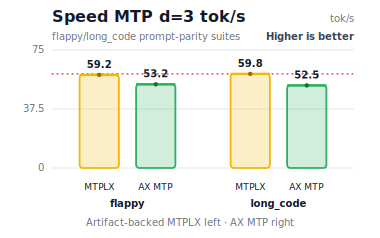
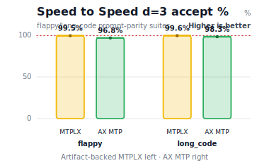
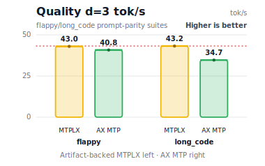
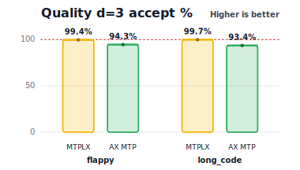

# AX Engine

### MTPLX vs AX-Engine

Flappy-suite MTP benchmark charts. Each chart groups d=2 and d=3; within each
depth group MTPLX is on the left and AX Engine MTP is on the right.

<table>
<tr>
<td align="center"><strong>Speed tok/s</strong></td>
<td align="center"><strong>Speed accept rate</strong></td>
</tr>
<tr>
<td></td>
<td></td>
</tr>
<tr>
<td align="center"><strong>Quality tok/s</strong></td>
<td align="center"><strong>Quality accept rate</strong></td>
</tr>
<tr>
<td></td>
<td></td>
</tr>
</table>

### llama.cpp metal vs mlx-lm vs AX-Engine

<table>
<tr>
<td align="center"><strong>Family</strong></td>
<td align="center"><strong>Prefill rate</strong></td>
<td align="center"><strong>Decode rate</strong></td>
<td align="center"><strong>TTFT</strong></td>
</tr>
<tr>
<td align="center"><strong>Gemma 4</strong></td>
<td></td>
<td></td>
<td></td>
</tr>
<tr>
<td align="center"><strong>Qwen 3.6</strong></td>
<td></td>
<td></td>
<td></td>
</tr>
</table>

AX Engine is a Mac-first LLM inference runtime, local server, SDK layer, and
benchmark toolkit for Apple Silicon.

AX Engine runs direct-support MLX model families on Apple Silicon, and keeps
other MLX text models or non-MLX models reachable through explicit `mlx-lm` and
`llama.cpp` compatibility routes. Users get one AX server, SDK, and benchmark
surface while repo-owned model coverage grows.

> Requires **macOS 14 (Sonoma) or later** on **Apple Silicon M2 Max or newer** with **32 GB RAM minimum**.
> Rust 1.85+ for source builds.

## 30-Second Setup

Install the released command-line tools and verify the runtime:

```bash
brew install defai-digital/ax-engine/ax-engine
ax-engine-bench doctor
```

Then download a model and start `ax-engine-server` from the CLI:

```bash
# Download an mlx-community model and generate its manifest in one step
MODEL_DIR="$(python3 scripts/download_model.py mlx-community/Qwen3-4B-4bit --json | python3 -c 'import json,sys; print(json.load(sys.stdin)["dest"])')"

# Start the local HTTP server. Keep this process running.
ax-engine-server \
  --mlx \
  --mlx-model-artifacts-dir "$MODEL_DIR" \
  --port 8080

# In another terminal, inspect the running server.
curl http://127.0.0.1:8080/v1/runtime
```

Or from Python (after `maturin develop` or `pip install ax-engine`):

```python
from ax_engine import download_model, Session
path = download_model("mlx-community/Qwen3-4B-4bit")
with Session(mlx=True, mlx_model_artifacts_dir=str(path)) as s:
    print(s.generate([1, 2, 3], max_output_tokens=8).output_tokens)
```

`download_model()` downloads weights and auto-runs `ax-engine-bench generate-manifest`.
See [Getting a Model](#getting-a-model) for all paths including raw HF checkpoints.

## Typical Hardware Stack ([hardware FAQ](docs/FAQ.md#what-hardware-does-ax-engine-support))

For local agent and chatbot workloads, AX Engine is a better fit for a small
model portfolio than for one model serving every workflow. See the
[FAQ model-stack guidance](docs/FAQ.md#what-model-stack-should-i-run-on-high-memory-apple-silicon)
for the full recommendation.

| Hardware | Recommended memory | Best fit |
|---|---:|---|
| Mac mini M4 Pro | 64 GB RAM | Compact always-on local chatbot and agent server |
| MacBook Pro M5 Max | 128 GB RAM | Portable high-throughput chatbot, agent, and coding stack |
| Mac Studio M3 Ultra | 256 GB RAM | Larger local model portfolio, longer contexts, and heavier parallel workloads |

| Role | Recommended model | Setup | App | Why |
|---|---|---|---|---|
| Default chatbot | Gemma 4 26B-A4B / 31B | 4-bit or 6-bit, 16K-32K | [ax-studio](https://github.com/defai-digital/ax-studio) | General assistant path for reasoning, chat, JSON/function calling, and on-device agent workflows |
| General agentic model | Qwen3.6-35B-A3B / Qwen3.6-27B | 35B A3B 4-bit; 27B 4/5/6/8-bit, 16K-32K | AX server / SDK | Strong general agent and coding balance; sparse MoE keeps active compute low |
| Coding specialist | Qwen3-Coder-Next | 6-bit + 16K default; 4-bit/5-bit + 32K when needed | [ax-code](https://github.com/defai-digital/ax-code) | Dedicated local coding-agent path for repo editing, tool use, and long coding sessions |

## Why AX Engine ([FAQ](docs/FAQ.md#is-ax-faster-because-it-replaces-mlx-kernels))

AX Engine gives local inference work a stable runtime contract:

- `ax-engine-server` exposes a local HTTP adapter over the runtime.
- `ax-engine-bench` records workload contracts, route identity, correctness,
  determinism, and performance evidence.
- `ax-engine-sdk`, Python bindings, and the JavaScript client provide
  thin integration surfaces over the same backend-resolution rules.
- Repo-owned MLX execution is tracked in
  [Direct Support Models](#direct-support-models-support-llm-models); delegated
  routes stay separate from AX-owned throughput claims.
- Delegated `mlx_lm.server` and `llama.cpp` routes cover explicit
  compatibility cases without turning delegated results into AX-owned
  throughput claims.

[mlx_lm](https://github.com/ml-explore/mlx-lm) is the canonical MLX reference.
AX Engine compares against `mlx_lm.benchmark` and keeps `mlx_lm.server` as the
explicit delegated compatibility route when AX does not yet have a repo-owned
graph.

For measured direct-support transformer families on Apple Silicon, the AX-owned
runtime layer can produce higher effective throughput than the reference MLX
runtimes on matching benchmark shapes:

- **N-gram acceleration** reaches up to 3.1x mlx_lm decode
  throughput on high-hit benchmark rows with no second draft model
- **Coding-shaped decode is a natural fit when local repetition exists**,
  including completion, edit loops, structured diffs, JSON/tool output, imports,
  indentation, and repeated identifiers
- **AX-owned request lifecycle** provides deterministic, auditable scheduling,
  KV block management, and prefix reuse that upstream Python runtimes do not
  expose as stable contracts
- **Long-session prefix reuse** restores physical MLX KV snapshots on validated
  cache layouts, so long-running chat and agent loops can avoid repeatedly
  pre-filling the same accumulated context. See
  [`docs/LONG-CONTEXT.md`](docs/LONG-CONTEXT.md) for the evidence boundary.
- **workload-contract tooling** (`ax-engine-bench`) validates correctness,
  determinism, route identity, and regression across checked-in manifests, not
  just throughput snapshots

See the [FAQ](docs/FAQ.md#is-ax-faster-because-it-replaces-mlx-kernels) for
the boundary between MLX kernels and AX-owned runtime behavior.

## Runtime Paths

| Path | Use it for | Current scope |
|---|---|---|
| Repo-owned MLX runtime | Direct-support MLX model families and repo-owned performance claims when backed by benchmark artifacts | Local Apple Silicon inference, token-based server/SDK requests, benchmarked direct and n-gram acceleration modes |
| `mlx_lm_delegated` | MLX text models that upstream `mlx-lm` supports before AX has a repo-owned graph | Blocking and SSE text generation through a user-provided `mlx_lm.server`; `/v1/generate`, `/v1/generate/stream`, and OpenAI-compatible completion/chat text endpoints. Streaming is delegated text compatibility evidence, not repo-owned token/KV performance |
| `llama_cpp` | GGUF and non-MLX local inference | Delegated llama.cpp server/CLI compatibility; route-contract evidence, not repo-owned MLX throughput |

The runtime report exposes `selected_backend`, `support_tier`, and
`resolution_policy` so callers and benchmark artifacts can distinguish these
paths.

For the exact OpenAI-shaped endpoint contract, including what is and is not
compatible today, see `docs/API-COMPATIBILITY.md`.

## Design

The repo-owned MLX path uses MLX directly for tensor operations through the
official `mlx-c` C API. MLX owns the Apple-maintained Metal kernels; AX owns the
runtime behavior above the graph: request lifecycle, scheduling, KV/cache
policy, n-gram acceleration, manifests, and benchmark evidence.

Design details live in the focused docs:
[Scheduler](docs/SCHEDULER.md) ·
[KV Cache](docs/KV-CACHE.md) ·
[Long Context](docs/LONG-CONTEXT.md) ·
[Benchmark Design](docs/BENCH-DESIGN.md) ·
[FAQ](docs/FAQ.md#is-ax-faster-because-it-replaces-mlx-kernels).

## Direct Support Models ([support LLM models](docs/SUPPORTED-MODELS.md))

Direct support means AX has a repo-owned `ax-engine-mlx` graph for the model
family and loads MLX safetensors through the AX manifest path. Other MLX text
models can still use the explicit `mlx_lm_delegated` compatibility route, but
delegated rows are not AX-owned throughput claims.

| Family | Direct model IDs | Current scope | Architecture notes |
|---|---|---|---|
| Gemma 4 | `gemma-4-e2b-it`, `gemma-4-e4b-it`, `gemma-4-26b-a4b-it`, `gemma-4-31b-it` | Repo-owned MLX runtime; MLX affine 4/5/6/8-bit weights where available | Dense, per-layer embedding, and MoE variants; sliding-window + full attention, K=V full-attention layers, logit softcapping |
| Gemma 3 | `gemma-3-1b-it` through `gemma-3-27b-it` | Repo-owned MLX runtime | GeGLU dense FFN; per-head QK norm; sliding-window local + global attention interleaving; embedding scale |
| Qwen 3.5 | `Qwen3.5-9B` | Repo-owned MLX runtime | Linear attention + MoE FFN; `attn_output_gate` per-head interleaving |
| Qwen 3.6 / Coder Next | `Qwen3.6-35B-A3B` 4-bit MLX, `Qwen3.6-27B` 4/5/6/8-bit MLX, `Qwen3-Coder-Next-4bit` | Repo-owned MLX runtime | `qwen3_next`: GatedDelta linear attention, full attention with per-head sigmoid gate, sparse top-k MoE with shared expert |
| Qwen 3 | `Qwen3-0.6B` through `Qwen3-32B` | Repo-owned MLX runtime | SwiGLU dense FFN; per-head QK norm; optional MoE variants |
| GLM 4.7 Flash | `mlx-community/GLM-4.7-Flash-4bit` | Repo-owned MLX runtime after community-model promotion | MLA attention, sigmoid router, latent-KV cache support |
| LLaMA 3 / 3.1 / 3.2 / 3.3 | `Llama-3.1-8B-Instruct` and related | Repo-owned MLX runtime | SwiGLU dense FFN; LLaMA-3 RoPE scaling |
| LLaMA 4 | `Llama-4-Scout`, `Llama-4-Maverick` | Repo-owned MLX runtime | iRoPE; interleaved MoE with frequency-based dispatch; attention temperature scaling |
| Mistral 3 / Ministral | `Mistral-Small-3.1`, `Ministral-3B`, `Ministral-8B` | Repo-owned MLX runtime | SwiGLU dense FFN; sliding-window attention on all layers |
| Mixtral | `Mixtral-8x7B-Instruct`, `Mixtral-8x22B-Instruct` | Repo-owned MLX runtime | SWA + sparse top-2 MoE; `block_sparse_moe` weights |
| DeepSeek V3 / V3.2 | `DeepSeek-V3`, `DeepSeek-V3-0324` | Repo-owned MLX runtime | MLA attention; sigmoid MoE routing with optional correction bias; shared experts |

Direct-support models use MLX safetensors format with the AX
`model-manifest.json` descriptor. Each supported architecture has a hand-written
forward pass in `ax-engine-mlx`. Adding a new architecture means implementing
the model graph, not wiring up a generic loader.

Community-model checks are tracked by evidence level. Before promoting another
architecture, run
`scripts/probe_mlx_model_support.py --model-dir <model-dir>`; a model should
report `repo_owned_runtime_ready` only when its manifest, local reference files,
and runtime path are all present.

## Performance ([full performance docs](docs/PERFORMANCE.md))

<!-- readme-performance-artifacts: reference=benchmarks/results/mlx-inference/2026-05-26-direct-mode-acceptance/; ax-base=benchmarks/results/mlx-inference/2026-05-25-ax-only-direct-mode-refresh/; ax-overlay=benchmarks/results/mlx-inference/2026-05-26-direct-mode-acceptance/; reference@p128=benchmarks/results/mlx-inference/2026-05-26-qwen27-8bit-p128-clean-recheck/; ax-overlay@p128=benchmarks/results/mlx-inference/2026-05-26-qwen27-8bit-p128-clean-recheck/; ax-decode-overlay@p128=benchmarks/results/mlx-inference/2026-05-26-qwen27-8bit-p128-ngram-no-draft-clean-recheck/; ax-overlay@p2048=benchmarks/results/mlx-inference/2026-05-26-qwen35-p2048-ngram-clean-recheck/ -->
The README keeps the common Gemma 4 and Qwen 3.6 generation benchmark rows
visible. Full result tables and interpretation live in
[`docs/PERFORMANCE.md`](docs/PERFORMANCE.md); benchmark methodology, test setup,
and reproduction details live in [`docs/BENCHMARKS.md`](docs/BENCHMARKS.md).

These rows are a provenance-tracked composite. The current `mlx_lm` reference
rows and refreshed AX direct-mode rows for the 12 Gemma 4 and Qwen 3.6 rows
shown below come from
`benchmarks/results/mlx-inference/2026-05-26-direct-mode-acceptance/`, with a
clean current-commit Qwen 3.6 27B 8-bit prompt=128 recheck overlaid from
`benchmarks/results/mlx-inference/2026-05-26-qwen27-8bit-p128-clean-recheck/`
and a Qwen 3.6 27B 8-bit prompt=128 n-gram no-draft recheck overlaid from
`benchmarks/results/mlx-inference/2026-05-26-qwen27-8bit-p128-ngram-no-draft-clean-recheck/`
and a Qwen 3.6 35B A3B 4-bit prompt=2048 n-gram recheck overlaid from
`benchmarks/results/mlx-inference/2026-05-26-qwen35-p2048-ngram-clean-recheck/`.
The default AX n-gram column remains sourced from
`benchmarks/results/mlx-inference/2026-05-25-ax-only-direct-mode-refresh/`
where no newer n-gram measurement exists for the same prompt and generation
shape.
The `llama.cpp Metal*` column is also injected from
`benchmarks/manifests/llama_cpp_metal/inventory.json` and the
`benchmarks/results/mlx-inference/2026-05-18-llama-cpp-metal-gemma-e2b-4bit-depth-fa/`
Gemma 4 E2B 4-bit recheck. Refreshed AX rows use generation=128, 3
repetitions, a 20-second cooldown between trials, AX prefix cache disabled for
cold prefill and TTFT measurement, and production-build binaries. MLX and AX
rows also use matching prompt SHA checks. Long-greedy AX prefill rows are
runner-time measurements of the cache-state prefix plus final prompt-token
boundary; they are not full-logits prompt scoring throughput.
Percentages are versus `mlx_lm`. The `llama.cpp Metal*` column is a
shape-compatible external reference; it does not share prompt-token hashes with
the MLX rows.

### MTP speculative decoding

AX Engine supports native MTP decoding for the Youssofal Qwen3.6 27B MTPLX
Speed and Quality bundles. The current focused smoke benchmark uses the
high-repetition `flappy` coding suite on Apple M5 Max 128 GB with
temperature=0.6, top_p=0.95, top_k=20, and 1000 generated tokens. These are
sampled decode rows, not greedy-exact baselines.

| Model bundle | Suite | Depth | AX MTP | AX accept | MTPLX 0.3.7 | MTPLX accept |
|---|---|---:|---:|---:|---:|---:|
| Qwen3.6 27B MTPLX Speed | flappy | 2 | **47.7 tok/s** | 92.2% | 47.6 tok/s | 77.3% |
| Qwen3.6 27B MTPLX Quality | flappy | 2 | **29.1 tok/s** | 89.9% | 31.5 tok/s | 80.8% |
| Qwen3.6 27B MTPLX Speed | flappy | 3 | **39.0 tok/s** | 83.1% | 46.3 tok/s | 69.4% |
| Qwen3.6 27B MTPLX Quality | flappy | 3 | **28.0 tok/s** | 84.0% | 34.3 tok/s | 79.9% |

Full MTP methodology, caveats, artifact links, and reproduction commands live in
[`docs/PERFORMANCE.md#mtp-mode`](docs/PERFORMANCE.md#mtp-mode). The benchmark
result directory format and MTPLX reference JSON contract are documented in
[`benchmarks/results/mtp-compare/README.md`](benchmarks/results/mtp-compare/README.md).

<!-- llama-cpp-column-disclaimer -->
**`llama.cpp Metal*` column** — Shape-compatible reference produced by Metal-enabled `llama-bench`. `llama-bench` generates its own internal synthetic prompt tokens and does not consume the harness prompt JSON, so these numbers are NOT prompt-hash parity with the other columns. The intent is rough side-by-side context against a well-known third-party Metal runtime, not head-to-head comparison. MLX bit-widths are mapped to the nearest standard bartowski GGUF K-quant (4→Q4_K_M, 5→Q5_K_M, 6→Q6_K, 8→Q8_0). No percentage delta is shown for this column because the prompt is not shared. Source: `benchmarks/manifests/llama_cpp_metal/inventory.json`, `scripts/bench_llama_cpp_metal_sweep.py`.

Note: The 2K `llama.cpp Metal*` prefill rows are long-context,
GGUF-runtime-reference rows, not MLX parity claims. Across this dataset, the 2K
`llama.cpp Metal*` prefill column commonly trails the MLX/AX rows, with the
largest gap on Gemma 4 E2B. The Gemma 4 E2B 4-bit row was produced with
`llama.cpp` b9110 (`ef22b3e4a`) and rechecked on b9200 (`3e12fbdea`) with Metal
offload, `-b/-ub 2048`, and flash attention enabled. The b9200 recheck improved
2K prefill only slightly, and no missing benchmark flag was found. This is our
benchmark boundary, not an upstream `llama.cpp` official bug statement.

### Prefill throughput (tok/s) — percentages vs mlx_lm

| Model | MLX quantization | Prompt tok | llama.cpp Metal* | mlx_lm | ax engine |
|---|---|---:| ---: |---:|---:|
| Gemma 4 E2B | 4-bit | 128 | 3,481.7 | 2,338.1 | **3,658.1 (+56.5%)** |
|         |         | 512 | 6,846.0 | 7,870.0 | **9,297.6 (+18.1%)** |
|         |         | 2048 | 7,643.1 | 18,014.7 | **24,318.7 (+35.0%)** |
| Gemma 4 E2B | 5-bit | 128 | 3,398.4 | 2,238.5 | **3,649.9 (+63.1%)** |
|         |         | 512 | 6,860.3 | 7,469.9 | **9,022.3 (+20.8%)** |
|         |         | 2048 | 7,288.1 | 16,664.1 | **23,867.0 (+43.2%)** |
| Gemma 4 E2B | 6-bit | 128 | 3,539.7 | 1,823.5 | **3,606.0 (+97.8%)** |
|         |         | 512 | 7,274.0 | 6,046.6 | **9,011.1 (+49.0%)** |
|         |         | 2048 | 7,623.2 | 15,332.1 | **23,286.0 (+51.9%)** |
| Gemma 4 E2B | 8-bit | 128 | 3,694.3 | 1,605.0 | **3,565.0 (+122.1%)** |
|         |         | 512 | 7,481.0 | 6,332.9 | **8,850.3 (+39.8%)** |
|         |         | 2048 | 7,990.4 | 15,536.8 | **23,529.4 (+51.4%)** |
| Gemma 4 E4B | 4-bit | 128 | 2,194.0 | 1,513.2 | **2,894.9 (+91.3%)** |
|         |         | 512 | 4,454.2 | 4,195.5 | **5,070.0 (+20.8%)** |
|         |         | 2048 | 4,426.6 | 7,325.4 | **8,744.0 (+19.4%)** |
| Gemma 4 26B A4B | 4-bit | 128 | 1,911.4 | 708.0 | **1,516.5 (+114.2%)** |
|         |         | 512 | 3,484.5 | 2,069.3 | **3,159.0 (+52.7%)** |
|         |         | 2048 | 3,604.8 | 3,871.4 | **4,613.2 (+19.2%)** |
| Gemma 4 31B | 4-bit | 128 | 522.6 | 370.0 | **610.8 (+65.1%)** |
|         |         | 512 | 665.3 | 640.4 | **791.3 (+23.6%)** |
|         |         | 2048 | 560.3 | 735.4 | **764.6 (+4.0%)** |
| Qwen 3.6 27B | 4-bit | 128 | 539.6 | 440.9 | **690.4 (+56.6%)** |
|  |  | 512 | 759.7 | 759.3 | **894.5 (+17.8%)** |
|  |  | 2048 | 664.3 | 919.6 | **927.6 (+0.9%)** |
| Qwen 3.6 27B | 5-bit | 128 | 520.8 | 390.2 | **644.0 (+65.0%)** |
|  |  | 512 | 733.4 | 688.5 | **841.4 (+22.2%)** |
|  |  | 2048 | 667.0 | 857.1 | **868.7 (+1.4%)** |
| Qwen 3.6 27B | 6-bit | 128 | 537.7 | 366.1 | **609.7 (+66.5%)** |
|  |  | 512 | 756.1 | 669.7 | **823.7 (+23.0%)** |
|  |  | 2048 | 689.3 | 839.9 | **857.0 (+2.0%)** |
| Qwen 3.6 27B | 8-bit | 128 | 559.4 | 302.2 | **564.3 (+86.7%)** |
|  |  | 512 | 798.2 | 610.4 | **811.5 (+32.9%)** |
|  |  | 2048 | 741.9 | 821.7 | **851.4 (+3.6%)** |
| Qwen 3.6 35B A3B | 4-bit | 128 | 1,706.9 | 614.6 | **1,223.7 (+99.1%)** |
|  |  | 512 | 3,146.6 | 1,755.0 | **3,032.9 (+72.8%)** |
|  |  | 2048 | 3,542.3 | 3,681.9 | **3,816.5 (+3.7%)** |

### Decode throughput (tok/s) — generation=128 tokens, temp=0

Higher is better. `ax direct baseline` disables n-gram acceleration.
`ax default n-gram` is the default AX decode policy and reports observed
effective throughput, not raw model-kernel speed.

The bench prompts are `mlx_lm.benchmark` seed-0 random tokens, which is
the only way to keep prompt-hash parity across all four columns. The
n-gram column is sensitive to workload shape — published benchmarks
(Saxena 2024, vLLM, SpecDecode-Bench 2025, EfficientEdit 2025) all
report n-gram speculative decoding is an input-output overlap
technique: code editing / refactoring / summarization see large
speedups; fresh code generation and open-ended chat see modest
speedups or none.
[`docs/NGRAM-ACCELERATION.md`](docs/NGRAM-ACCELERATION.md) covers how
the drafter works, when each workload regime is expected to accelerate,
the
[when-it-helps section](docs/NGRAM-ACCELERATION.md#when-n-gram-acceleration-helps)
with literature citations and our own random-vs-real measurements,
and the
[synthetic repeated-output loop](docs/NGRAM-ACCELERATION.md#synthetic-repeated-output-loops)
caveat for random-token rows whose throughput may be measured on a
collapsed output loop.

| Model | MLX quantization | Prompt tok | llama.cpp Metal* | mlx_lm | ax direct baseline | ax default n-gram |
|---|---|---:| ---: |---:|---:|---:|
| Gemma 4 E2B | 4-bit | 128 | 174.6 | 214.0 | **232.9 (+8.8%)** | **539.3 (+152.1%)** |
|  |  | 512 | 165.2 | 210.3 | **223.2 (+6.2%)** | **526.2 (+150.3%)** |
|  |  | 2048 | 171.9 | 200.9 | **213.6 (+6.3%)** | **495.6 (+146.7%)** |
| Gemma 4 E2B | 5-bit | 128 | 154.8 | 195.2 | **207.4 (+6.3%)** | **427.5 (+119.1%)** |
|  |  | 512 | 154.3 | 182.0 | **199.6 (+9.7%)** | **421.2 (+131.4%)** |
|  |  | 2048 | 154.3 | 181.9 | **192.4 (+5.8%)** | **399.5 (+119.6%)** |
| Gemma 4 E2B | 6-bit | 128 | 152.1 | 172.2 | **183.8 (+6.8%)** | **391.7 (+127.5%)** |
|  |  | 512 | 152.0 | 166.3 | **178.1 (+7.1%)** | **386.4 (+132.3%)** |
|  |  | 2048 | 152.2 | 162.5 | **171.9 (+5.8%)** | **363.3 (+123.6%)** |
| Gemma 4 E2B | 8-bit | 128 | 136.1 | 153.0 | **160.8 (+5.1%)** | **412.3 (+169.4%)** |
|  |  | 512 | 138.3 | 148.8 | **156.4 (+5.1%)** | **403.8 (+171.4%)** |
|  |  | 2048 | 138.7 | 144.2 | **151.7 (+5.2%)** | **378.8 (+162.7%)** |
| Gemma 4 E4B | 4-bit | 128 | 110.7 | 137.1 | **141.0 (+2.9%)** | **323.1 (+135.7%)** |
|  |  | 512 | 110.8 | 133.6 | **138.1 (+3.4%)** | **317.4 (+137.7%)** |
|  |  | 2048 | 110.7 | 130.6 | **135.7 (+3.9%)** | **301.7 (+131.1%)** |
| Gemma 4 26B A4B | 4-bit | 128 | 112.6 | 125.4 | **133.5 (+6.5%)** | **231.7 (+81.1%)** |
|  |  | 512 | 112.9 | 123.1 | **130.2 (+5.8%)** | **225.6 (+80.4%)** |
|  |  | 2048 | 112.9 | 117.8 | **125.8 (+6.8%)** | **193.9 (+62.5%)** |
| Gemma 4 31B | 4-bit | 128 | 25.0 | 28.5 | **28.6 (+0.5%)** | **47.3 (+63.8%)** |
|  |  | 512 | 25.5 | 27.6 | **28.2 (+1.9%)** | **49.3 (+74.3%)** |
|  |  | 2048 | 25.3 | 26.4 | **27.0 (+2.2%)** | **42.0 (+55.4%)** |
| Qwen 3.6 27B | 4-bit | 128 | 26.0 | 33.2 | **33.3 (+0.2%)** | 31.4 (-7.7%) |
|  |  | 512 | 26.0 | 33.1 | **33.2 (+0.1%)** | 31.4 (-7.4%) |
|  |  | 2048 | 18.8 | 32.8 | **32.8 (+0.1%)** | 31.0 (-7.4%) |
| Qwen 3.6 27B | 5-bit | 128 | 23.5 | 27.6 | **27.7 (+0.1%)** | 20.5 (-5.2%) |
|  |  | 512 | 23.3 | 27.4 | **27.5 (+0.4%)** | 23.1 (-18.0%) |
|  |  | 2048 | 17.8 | 27.3 | **27.3 (+0.3%)** | 21.9 (-21.2%) |
| Qwen 3.6 27B | 6-bit | 128 | 21.3 | 24.4 | **24.5 (+0.6%)** | **24.5 (+2.2%)** |
|  |  | 512 | 21.3 | 24.3 | **24.5 (+0.7%)** | 24.5 (-1.2%) |
|  |  | 2048 | 15.4 | 24.1 | **24.4 (+1.1%)** | 24.3 (-1.2%) |
| Qwen 3.6 27B | 8-bit | 128 | 18.3 | 18.2 | **18.2 (+0.3%)** | 17.9 (-1.6%) |
|  |  | 512 | 18.2 | 18.1 | **18.1 (+0.3%)** | 18.3 (-1.8%) |
|  |  | 2048 | 12.7 | 17.8 | **18.0 (+1.0%)** | 18.2 (-1.3%) |
| Qwen 3.6 35B A3B | 4-bit | 128 | 108.1 | 134.6 | **159.0 (+18.1%)** | **159.0 (+13.5%)** |
|  |  | 512 | 108.2 | 131.9 | **156.8 (+18.8%)** | **157.4 (+15.3%)** |
|  |  | 2048 | 105.7 | 131.7 | **154.9 (+17.6%)** | **233.4 (+77.3%)** |

Qwen 3.6 27B 4-bit at prompt=2048 originally produced zero decode tokens
because 4-bit quantization noise pushed an EOS token to argmax at decode
step 0 on the `mlx_lm.benchmark` random-token contract. The benchmark harness
now sends request-scoped `sampling.ignore_eos=true` for AX throughput runs,
matching how `mlx_lm.benchmark` measures fixed `gen=N` throughput regardless
of stop-token argmax. Production requests default to `ignore_eos=false` and
still honor EOS at step 0 on this specific synthetic prompt. Source:
`benchmarks/results/mlx-inference/2026-05-20-qwen27-4to5-direct-ngram-directcpp-r2/qwen3_6-27b-4bit.json`.

Qwen 3.6 27B 4-bit at prompt=2048 still shows a low n-gram decode row on this
random-token contract. The artifact records the linear-attention direct C++
input path as all-hit with no fallback/profile-blocked counters, so the dip is
preserved as a workload/result characteristic rather than hidden.

### Time to first token (ms) — generation=128 tokens, temp=0

Lower is better. `mlx_lm` values are derived from reported prefill throughput.
AX values are measured directly from per-step runner timing in the SSE event
stream. New AX benchmark artifacts also record `client_wall_ttft_ms` separately
so server/client timing does not get mixed with runner-time throughput.

| Model | MLX quantization | Prompt tok | llama.cpp Metal* | mlx_lm | ax engine |
|---|---|---:| ---: |---:|---:|
| Gemma 4 E2B | 4-bit | 128 | 36.8 | 54.7 | **35.0 (-36.1%)** |
|         |         | 512 | 74.8 | 65.1 | **55.1 (-15.4%)** |
|         |         | 2048 | 268.0 | 113.7 | **84.2 (-25.9%)** |
| Gemma 4 E2B | 5-bit | 128 | 37.7 | 57.2 | **35.1 (-38.7%)** |
|         |         | 512 | 74.6 | 68.5 | **56.7 (-17.2%)** |
|         |         | 2048 | 281.0 | 122.9 | **85.8 (-30.2%)** |
| Gemma 4 E2B | 6-bit | 128 | 36.2 | 70.2 | **35.5 (-49.4%)** |
|         |         | 512 | 70.4 | 84.7 | **56.8 (-32.9%)** |
|         |         | 2048 | 268.7 | 133.6 | **88.0 (-34.2%)** |
| Gemma 4 E2B | 8-bit | 128 | 34.6 | 79.7 | **35.9 (-55.0%)** |
|         |         | 512 | 68.4 | 80.8 | **57.9 (-28.4%)** |
|         |         | 2048 | 256.3 | 131.8 | **87.0 (-34.0%)** |
| Gemma 4 E4B | 4-bit | 128 | 58.3 | 84.6 | **44.2 (-47.7%)** |
|         |         | 512 | 114.9 | 122.0 | **101.0 (-17.2%)** |
|         |         | 2048 | 462.7 | 279.6 | **234.2 (-16.2%)** |
| Gemma 4 26B A4B | 4-bit | 128 | 67.0 | 180.8 | **84.4 (-53.3%)** |
|         |         | 512 | 146.9 | 247.4 | **162.1 (-34.5%)** |
|         |         | 2048 | 568.1 | 529.0 | **443.9 (-16.1%)** |
| Gemma 4 31B | 4-bit | 128 | 244.9 | 345.9 | **209.6 (-39.4%)** |
|         |         | 512 | 769.5 | 799.5 | **647.0 (-19.1%)** |
|         |         | 2048 | 3,655.2 | 2,784.9 | **2,678.6 (-3.8%)** |
| Qwen 3.6 27B | 4-bit | 128 | 237.2 | 290.3 | **185.4 (-36.1%)** |
|  |  | 512 | 673.9 | 674.3 | **572.4 (-15.1%)** |
|  |  | 2048 | 3,083.1 | 2,227.1 | **2,207.8 (-0.9%)** |
| Qwen 3.6 27B | 5-bit | 128 | 245.8 | 328.1 | **198.8 (-39.4%)** |
|  |  | 512 | 698.1 | 743.6 | **608.5 (-18.2%)** |
|  |  | 2048 | 3,070.5 | 2,389.4 | **2,357.5 (-1.3%)** |
| Qwen 3.6 27B | 6-bit | 128 | 238.1 | 349.6 | **209.9 (-40.0%)** |
|  |  | 512 | 677.2 | 764.5 | **621.6 (-18.7%)** |
|  |  | 2048 | 2,971.2 | 2,438.4 | **2,389.6 (-2.0%)** |
| Qwen 3.6 27B | 8-bit | 128 | 228.8 | 423.5 | **226.8 (-46.4%)** |
|  |  | 512 | 641.5 | 838.8 | **630.9 (-24.8%)** |
|  |  | 2048 | 2,760.6 | 2,492.4 | **2,405.5 (-3.5%)** |
| Qwen 3.6 35B A3B | 4-bit | 128 | 75.0 | 208.3 | **104.6 (-49.8%)** |
|  |  | 512 | 162.7 | 291.7 | **168.8 (-42.1%)** |
|  |  | 2048 | 578.2 | 556.2 | **536.6 (-3.5%)** |

Embedding benchmarks are kept out of this README summary; see
[`docs/EMBEDDINGS.md`](docs/EMBEDDINGS.md) for embedding throughput, serving,
and cold-start measurements.

## Installation

### Homebrew

For tagged macOS arm64 releases, install the command-line tools from
the AutomatosX tap:

```bash
brew install defai-digital/ax-engine/ax-engine
```

This installs:

- `ax-engine-server`: local HTTP adapter over the SDK runtime
- `ax-engine-bench`: workload-contract, readiness, direct-generate, and
  benchmark-support CLI
- the Homebrew `mlx-c` runtime dependency required by the released binaries

Check the installed tools:

```bash
ax-engine-server --help
ax-engine-bench doctor
```

Homebrew is the quickest path for the released server and benchmark binaries.
If `ax-engine-bench doctor` fails with `Library not loaded:
/opt/homebrew/opt/mlx-c/lib/libmlxc.dylib`, install or repair the runtime with
`brew install mlx-c` and `brew reinstall defai-digital/ax-engine/ax-engine`.
Use the source build when you need the full Rust workspace, Python extension,
local examples, or changes that have not been tagged yet.

The release archive attached to GitHub is the Homebrew formula payload. It is
not a standalone installer with bundled dynamic libraries. Use Homebrew unless
you are prepared to provide `mlx-c` and its dynamic library path yourself.

### Source

Development builds require Rust and the MLX C runtime on Apple Silicon:

```bash
brew install mlx-c
cargo build --workspace --release
```

Python bindings are built from source:

```bash
maturin develop
python -m unittest discover -s python/tests -v
```

## Quick Start

The fastest local workflow is:

1. install or build the command-line tools;
2. download a supported MLX model and generate its manifest;
3. check model readiness;
4. start the local server and call its HTTP endpoints.

The commands below use source-build paths. If you installed with Homebrew, use
`ax-engine-server` and `ax-engine-bench` directly instead of
`./target/release/...`.

### Start `ax-engine-server` from the CLI

```bash
# Download a model and generate its manifest
MODEL_DIR="$(python3 scripts/download_model.py mlx-community/Qwen3-4B-4bit --json | python3 -c 'import json,sys; print(json.load(sys.stdin)["dest"])')"
# MODEL_DIR uses the Hugging Face Hub snapshot cache by default, e.g.
# ~/.cache/huggingface/hub/models--mlx-community--Qwen3-4B-4bit/snapshots/<hash>

# Check readiness
./target/release/ax-engine-bench doctor --mlx-model-artifacts-dir "$MODEL_DIR"

# HTTP inference server (repo-owned MLX runtime)
./target/release/ax-engine-server \
  --mlx \
  --mlx-model-artifacts-dir "$MODEL_DIR" \
  --port 8080

# In another terminal, inspect the running server
curl http://127.0.0.1:8080/v1/runtime

# Optional smoke generation request
curl http://127.0.0.1:8080/v1/generate \
  -H 'content-type: application/json' \
  -d '{
    "model": "qwen3_dense",
    "input_tokens": [1, 2, 3, 4],
    "max_output_tokens": 4,
    "sampling": {
      "temperature": 0.0,
      "top_p": 1.0,
      "top_k": 0,
      "seed": 1234
    }
  }'
```

```python
# Python bindings (after maturin develop)
import ax_engine

path = ax_engine.download_model("mlx-community/Qwen3-4B-4bit")
with ax_engine.Session(mlx=True, mlx_model_artifacts_dir=str(path)) as s:
    result = s.generate([1, 2, 3], max_output_tokens=32)
    print(result.output_tokens)
```

For an unsupported MLX text model that upstream `mlx-lm` can serve, keep AX
Engine as the CLI/server surface and delegate the model execution explicitly:

```bash
mlx_lm.server --model /path/to/local/mlx-model --host 127.0.0.1 --port 8090

./target/release/ax-engine-bench generate \
  --prompt "Hello from mlx-lm" \
  --support-tier mlx_lm_delegated \
  --mlx-lm-server-url http://127.0.0.1:8090
```

`mlx_lm_delegated` is a compatibility route, not an AX-owned MLX throughput
claim. AX forwards text generation to upstream `mlx_lm.server`, preserves
sampling fields such as `temperature`, `top_p`, `top_k`, `repetition_penalty`,
and `seed`, and exposes blocking plus SSE text through the AX API. Streamed
chunks are delegated text deltas; they are not AX-owned token IDs, KV state, or
model-kernel throughput evidence. Tool calls and visual/multimodal inputs are
not compatibility contracts yet.

```bash
# Primary benchmark: AX vs mlx_lm
python3 scripts/bench_mlx_inference_stack.py \
  --model-dir /path/to/local/mlx-model \
  --prompt-tokens 128,512,2048 --generation-tokens 128 \
  --ax-compare-policies --repetitions 5 \
  --output benchmarks/results/mlx-inference/$(date +%F)/gemma-4-e2b-it-4bit.json

# Secondary workload-contract benchmark
./target/release/ax-engine-bench scenario \
  --manifest benchmarks/manifests/scenario/chat_gemma4_e2b_short.json \
  --output-root benchmarks/results

# Smoke checks
./target/release/ax-engine-bench doctor --mlx-model-artifacts-dir "$MODEL_DIR"
bash scripts/check-server-preview.sh
bash scripts/check-python-preview.sh
```

## Getting a Model

ax-engine requires pre-sanitized MLX weights. The recommended source is
[mlx-community](https://huggingface.co/mlx-community) — models there are already
converted and validated. Loading an unsanitized raw HF checkpoint into a hybrid
architecture (Qwen3.5, Qwen3-Next) raises a hard error at load time.

### mlx-community model (recommended)

`download_model()` and `scripts/download_model.py` download weights and auto-generate
the required `model-manifest.json` in one step:

```bash
# Script (works with Homebrew install or source build)
python scripts/download_model.py mlx-community/Qwen3-4B-4bit

# For automation, emit a parseable summary
python scripts/download_model.py mlx-community/Qwen3-4B-4bit --json

# Python SDK
from ax_engine import download_model
path = download_model("mlx-community/Qwen3-4B-4bit")
```

By default these helpers use the same Hugging Face Hub snapshot cache as
`mlx_lm` and `huggingface_hub`. If you already have `mlx_lm` installed, its
download also lands in that cache and ax-engine can auto-discover it:

```bash
python -m mlx_lm.generate --model mlx-community/Qwen3-4B-4bit --prompt "x" --max-tokens 1
ax-engine-bench generate-manifest ~/.cache/huggingface/hub/models--mlx-community--Qwen3-4B-4bit/snapshots/<hash>
ax-engine-server --mlx --resolve-model-artifacts hf-cache --preset qwen3_dense --port 8080
```

### Raw HuggingFace checkpoint

Raw checkpoints need sanitization before ax-engine can load them. Use `mlx_lm.convert`:

```bash
pip install mlx-lm
mlx_lm.convert --hf-path <org/model> --mlx-path /path/to/dest -q --q-bits 4
ax-engine-bench generate-manifest /path/to/dest
ax-engine-server --mlx --mlx-model-artifacts-dir /path/to/dest --port 8080
```

### Manifest generation

Both paths above require `model-manifest.json`. The download helpers generate it
automatically. To run it directly:

```bash
ax-engine-bench generate-manifest /path/to/model      # Homebrew or built binary
cargo run -p ax-engine-core --bin generate-manifest -- /path/to/model  # source
```

## SDKs

ax-engine-server exposes OpenAI-compatible HTTP endpoints, and several SDKs
wrap those endpoints or the in-process Rust session directly.

| Language | Package / path | LangChain |
|----------|---------------|-----------|
| **Python** | `python/ax_engine` | `ax_engine.langchain` — `AXEngineChatModel`, `AXEngineLLM` |
| **TypeScript / JS** | `javascript/ax-engine` (`@ax-engine/sdk`) | `@ax-engine/sdk/langchain` — `ChatAXEngine`, `AXEngineLLM` |
| **Go** | `sdk/go/axengine` | Use [langchaingo](https://github.com/tmc/langchaingo) OpenAI provider — see `examples/go/langchain/` |
| **Ruby** | `sdk/ruby` (`ax-engine-sdk`) | `ax_engine/langchain` — `ChatModel`, `LLM` (requires langchain-rb) |
| **Mojo** | `sdk/mojo/ax_engine.mojo` | Via Python — use `ax_engine.langchain` from Mojo's Python interop |

### TypeScript / JavaScript

```bash
npm install @ax-engine/sdk
```

```typescript
import AxEngineClient from "@ax-engine/sdk";

const client = new AxEngineClient({ baseUrl: "http://127.0.0.1:8080" });
const resp = await client.chatCompletion({
  messages: [{ role: "user", content: "Hello!" }],
  max_tokens: 128,
});
console.log(resp.choices[0].message.content);

// Streaming
for await (const event of client.streamChatCompletion({ messages: [...], stream: true })) {
  process.stdout.write(event.data.choices[0]?.delta?.content ?? "");
}
```

LangChain integration (requires `@langchain/core`):

```typescript
import { ChatAXEngine } from "@ax-engine/sdk/langchain";
import { HumanMessage } from "@langchain/core/messages";

const chat = new ChatAXEngine({ maxTokens: 128 });
const response = await chat.invoke([new HumanMessage("Hello!")]);
```

### Go

The Go SDK lives at `sdk/go/axengine` (module `github.com/ax-engine/ax-engine-go`).

```go
client := axengine.NewClient(nil)

resp, err := client.ChatCompletion(ctx, axengine.OpenAiChatCompletionRequest{
    Messages:  []axengine.OpenAiChatMessage{{Role: "user", Content: "Hello!"}},
    MaxTokens: axengine.Ptr(128),
})

// Streaming
ch, errCh := client.StreamChatCompletion(ctx, req)
for chunk := range ch {
    fmt.Print(*chunk.Choices[0].Delta.Content)
}
```

See `examples/go/` for runnable examples. For LangChain, point
[langchaingo](https://github.com/tmc/langchaingo)'s OpenAI provider at
`http://127.0.0.1:8080/v1` — see `examples/go/langchain/` and `docs/GO.md`.

### Ruby

The Ruby SDK lives at `sdk/ruby/` (`ax-engine-sdk` gem). Zero dependencies —
stdlib `net/http` only. Streaming uses a block interface.

```ruby
require "ax_engine"

client = AxEngine::Client.new

# Blocking chat
resp = client.chat_completion(
  messages: [{ role: "user", content: "Hello!" }],
  max_tokens: 128
)
puts resp.dig("choices", 0, "message", "content")

# Streaming
client.stream_chat_completion(
  messages: [{ role: "user", content: "Count from 1 to 5." }],
  max_tokens: 64
) do |event|
  print event.dig("data", "choices", 0, "delta", "content").to_s
end
```

LangChain via [langchain-rb](https://github.com/patterns-ai-core/langchain):

```ruby
require "ax_engine/langchain"

chat = AxEngine::Langchain::ChatModel.new(max_tokens: 256)
puts chat.chat(messages: [{ role: "user", content: "Hello!" }]).chat_completion
```

See `examples/ruby/` and `docs/RUBY.md` for full details.

### Python — LangChain

```python
from ax_engine.langchain import AXEngineChatModel
from langchain_core.messages import HumanMessage

chat = AXEngineChatModel(base_url="http://127.0.0.1:8080", max_tokens=256)
response = chat.invoke([HumanMessage(content="Hello!")])
print(response.content)

# Streaming
for chunk in chat.stream([HumanMessage(content="Count from 1 to 5.")]):
    print(chunk.content, end="", flush=True)
```

Requires `pip install langchain-core`. See `docs/PYTHON.md` for full details.

### Mojo

The Mojo SDK (`sdk/mojo/ax_engine.mojo`) wraps the Python `ax_engine` package
via Mojo's `PythonObject` interop. Requires the Python extension to be built
first (`maturin develop`).

```mojo
from sdk.mojo.ax_engine import Session

var session = Session(
    "qwen3_dense",
    mlx=True,
    mlx_model_artifacts_dir="/path/to/artifacts",
)
var result = session.generate("Hello from Mojo!", max_output_tokens=64)
print(result.output_text)
session.close()
```

## Workspace

```
crates/ax-engine-core    Engine state machine, scheduler, KV manager, sampler
crates/ax-engine-mlx     MLX model graph, n-gram acceleration, KV cache, runner
crates/mlx-sys           bindgen FFI over mlx-c; safe MlxArray RAII wrappers
crates/ax-engine-sdk     Session API, backend resolution (MLX, mlx-lm delegated, or llama.cpp)
crates/ax-engine-server  Axum HTTP/SSE adapter (OpenAI-compatible routes)
crates/ax-engine-bench   Manifest-driven workload-contract CLI
crates/ax-engine-py      PyO3 extension (ABI3, Python 3.10+)
javascript/ax-engine     TypeScript/JS HTTP SDK + LangChain adapter
sdk/go/axengine          Go HTTP SDK
sdk/ruby/                Ruby HTTP SDK (ax-engine-sdk gem)
sdk/mojo/                Mojo SDK (Python-interop)
```

Unsupported MLX text models can use the explicit delegated `mlx_lm_delegated`
route through a user-provided `mlx_lm.server`. Non-MLX inference routes through
the delegated `llama.cpp` contract.

## Development

```bash
cargo build --workspace                                           # build all crates
cargo test --quiet                                                # full Rust test suite
cargo clippy --all-targets --all-features -- -D warnings         # lint (CI gate)
cargo fmt                                                         # format
maturin develop                                                   # rebuild Python extension
python -m unittest discover -s python/tests -v                   # Python tests
bash scripts/check-mlx-telemetry.sh                              # Gemma/AX MLX telemetry gate
```

For Gemma/AX MLX telemetry and decode-profile changes, prefer the targeted
`scripts/check-mlx-telemetry.sh` gate. Use
`scripts/check-mlx-telemetry.sh --full-workspace` when the change touches shared
Rust contracts; that protected path compiles the workspace with
`cargo test --workspace --no-run --jobs 1` before running crate-by-crate tests.

Coverage is collected by the report-only GitHub Actions workflow in
`.github/workflows/coverage.yml`. It publishes Rust `cargo llvm-cov` and Python
`coverage.py` artifacts without enforcing a percentage threshold yet; add a gate
only after the project has a stable baseline across macOS, MLX, and PyO3 paths.

Public documentation is in `docs/`. Canonical benchmark manifests are in
`benchmarks/manifests/`. Key design documents:
[SDK / API](docs/SDK.md) ·
[Python](docs/PYTHON.md) ·
[JavaScript / TypeScript](docs/JAVASCRIPT.md) ·
[Go](docs/GO.md) ·
[Ruby](docs/RUBY.md) ·
[Mojo](docs/MOJO.md) ·
[Scheduler](docs/SCHEDULER.md) ·
[KV Cache](docs/KV-CACHE.md) ·
[Benchmarking](docs/BENCH-DESIGN.md) ·
[Serving Benchmarks](docs/SERVING-BENCHMARKS.md)

## Limitations

- **GatedDelta prefill (Qwen3.5)**: Qwen3.5 prefill can trail upstream MLX
  references on longer prompts; decode and Qwen3-Next are not affected in the
  same way.
- **Raw HuggingFace weights**: use pre-sanitized MLX community weights or
  convert first with `mlx_lm.convert`.
- **N-gram acceleration rows**: effective-throughput measurements, not raw
  model-kernel speedups.
- **TurboQuant KV compression**: experimental and off by default.

See the [FAQ limitations entry](docs/FAQ.md#what-are-the-current-limitations)
for details.

## Contributing

AX Engine welcomes community input through issue tickets, wishlist requests,
reproducible benchmark results, and documentation feedback. We generally do not
accept unsolicited code PRs, especially for runtime, model, kernel, scheduler,
cache, n-gram, or performance-tuning changes.

Performance tuning is tightly coupled: a local speedup can regress correctness,
TTFT, memory pressure, direct-vs-n-gram behavior, long-context behavior, serving
stability, or another model family. Please open an issue first with the problem,
target workload, and evidence so maintainers can choose the right validation
path. See [CONTRIBUTING.md](CONTRIBUTING.md) for issue, wishlist, and benchmark
result guidelines.

## Community

- Website: [automatosx.com](https://automatosx.com)
- Discord: [Join us](https://discord.com/invite/cTavsMgu)
- Email: enquiry@defai.digital

## License

Apache License, Version 2.0. See [LICENSE](LICENSE) for details.

Copyright (c) 2026 [DEFAI Private Limited](https://defai.digital)
