# AX Engine

AX Engine is a Mac-first LLM inference runtime for Apple Silicon developers who
want local models to be fast, inspectable, and easy to serve. It is not just a
wrapper around `mlx_lm`: for direct-support Gemma, Qwen, GLM, and
DiffusionGemma families, AX Engine owns the MLX graph path, KV/runtime behavior,
server route, model packaging, and benchmark contract.

## Why AX Engine

AX Engine is built to win the full interactive local-model path, not just report
one isolated kernel number. In the current public direct-mode matrix, AX Engine
is ahead of `mlx_lm` in every listed prefill and TTFT row; direct decode is
tracked separately, with peer rows and model-specific boundaries kept visible.

- **First-class MTP:** one-command MTP package preparation through
  `ax-engine download-mtp`, including the Gemma 4 12B 4-bit quick-start target
  plus recommended 6-bit MTP benchmarking and 4-bit comparison lanes.
- **Simple local serving:** install the wheel, download or prepare a model, then
  run the printed `ax-engine serve ...` command for OpenAI-compatible local
  endpoints.
- **Repo-owned direct runtime:** direct-support Gemma, Qwen, GLM, and
  DiffusionGemma paths run in AX Engine's MLX runtime; delegated `mlx-lm` and
  `llama.cpp` routes stay explicit instead of hidden behind one label.
- **Serious benchmarking:** public results are tied to checked-in artifacts that
  record route identity, model snapshot, prompt suite, sampler, cooldowns,
  repetitions, MTP accept rate, prefill, decode, TTFT, and dirty-state
  provenance.
- **Agent-oriented support:** Qwen3-Coder-Next is called out separately from the
  Qwen3.6 family because it carries a coding-first architecture and validation
  path.

## Table of Contents

- [Why AX Engine](#why-ax-engine)
- [Quick Start](#quick-start)
- [Installation](#installation)
- [Getting a Model](#getting-a-model)
- [Typical Hardware](#typical-hardware)
- [What AX Engine Does](#what-ax-engine-does)
- [Performance](#performance)
  - [Speculative Decoding (MTP)](#speculative-decoding-mtp)
    - [4-bit MTP comparison lane (2026-06-23)](#4-bit-mtp-comparison-lane-2026-06-23)
    - [6-bit MTP acceleration refresh (2026-06-23)](#6-bit-mtp-acceleration-refresh-2026-06-23)
  - [Direct Decode · Prefill · TTFT](#direct-decode--prefill--ttft)
    - [Gemma 4 12B](#gemma-4-12b)
    - [DiffusionGemma](#diffusiongemma)
    - [Gemma 4 and Qwen 3.6](#gemma-4-and-qwen-36)
    - [Embedding throughput (tok/s)](#embedding-throughput-toks)
- [SDKs](#sdks)
- [Server Usage](#server-usage)
- [Documentation](#documentation)
- [Workspace](#workspace)
- [Development](#development)
- [Benchmark Reference Projects](#benchmark-reference-projects)
- [Limitations](#limitations)
- [Contributing](#contributing)
- [Community](#community)
- [License](#license)

## Quick Start

**Install** (macOS 26 Tahoe or later, Apple Silicon only — see [Typical Hardware](#typical-hardware)):

Upgrade pip first so pip 23+ can find the macOS wheel, and keep the package
spec quoted for zsh.

```bash
python3 -m pip install --upgrade pip
python3 -m pip install -U "ax-engine[download]<7"
```

**Download a Gemma 4 12B MTP package:**

```bash
ax-engine download-mtp gemma-4-12b-4bit
# Then run the printed "ax-engine serve ..." command.
```

**Send one request from another terminal:**

```bash
curl http://127.0.0.1:8080/v1/chat/completions \
  -H 'content-type: application/json' \
  -d '{"model":"gemma-4-12b-it","messages":[{"role":"user","content":"Say hello in one sentence."}],"max_tokens":64}'
```

For model choices, SDK examples, Homebrew, and source builds, see the
[Getting Started guide](docs/GETTING-STARTED.md) and [SDK docs](docs/sdk/README.md).

> Quick Start requires **macOS 26 (Tahoe) or later** on **Apple Silicon M2 Max or newer**.
> The Gemma 4 12B MTP path is intended for high-memory machines; use the memory tiers
> listed in [Typical Hardware](#typical-hardware). Earlier macOS releases are not supported —
> there is no wheel or binary for them.

## Installation

For platform requirements, troubleshooting, optional extras, Homebrew, source
builds, and release-channel diagnostics, see the
[Getting Started installation guide](docs/GETTING-STARTED.md#installation).

## Getting a Model

AX Engine loads pre-sanitized MLX safetensors plus an AX
`model-manifest.json`. Use `ax-engine tui` for an interactive picker,
`ax-engine download --list` for direct-decode aliases, `ax-engine serve <alias>
--download` for one-command serving, and `ax-engine download-mtp <target>` for
supported MTP packages.
Detailed aliases, MTP targets, raw checkpoint conversion, cache behavior, and
manifest commands live in
[Supported Models](docs/SUPPORTED-MODELS.md#getting-model-artifacts) and the
[CLI reference](docs/CLI.md#ax-engine).

```bash
# Browse models, queue downloads, choose destinations, and launch serving.
ax-engine tui

# Serve a direct model in one command.
ax-engine serve qwen36-35b --download --port 8080

# Or inspect and download direct-model artifacts separately.
ax-engine download --list
ax-engine download qwen36-35b --json

# Prepare a Gemma 4 12B MTP package.
ax-engine download-mtp gemma-4-12b-4bit
```

`ax-engine tui` lists downloadable model families, groups precision variants,
offers Direct-vs-MTP choices, and sends long downloads to a background queue so
you can keep browsing other models. The destination picker defaults to the
shared Hugging Face Hub cache and can also select a parent directory from a
terminal directory tree; direct downloads use `--dest`, and MTP packages use
`--output`. The Downloads tab shows live bytes/s and logs, and a ready item can
be served directly from the TUI. Scripts and CI keep the non-interactive
`download` behavior and JSON output.

Common acquisition paths:

| Model/package | Command | Runtime path |
| --- | --- | --- |
| Direct MLX models | `ax-engine download <alias-or-mlx-community-repo>` | Repo-owned MLX graph |
| Gemma 4 12B quick-start MTP | `ax-engine download-mtp gemma-4-12b-4bit` | Gemma assistant-MTP |
| Qwen3.6 27B / 35B-A3B MTP | `ax-engine download-mtp qwen3.6-27b-6bit` or `qwen3.6-35b-a3b` | Qwen fused MTP sidecar |
| Gemma 4 12B / 26B / 31B 6-bit MTP | `ax-engine download-mtp gemma-4-12b`, `gemma-4-26b`, or `gemma-4-31b` | Gemma assistant-MTP |
| GLM-4.7 Flash MTP | `ax-engine download-mtp glm-4.7-flash` | GLM built-in MTP sidecar |
| Raw Hugging Face checkpoints | Convert with `mlx_lm.convert`, then run `ax-engine-bench generate-manifest` | Direct only after sanitization |

Direct-support model families:

| Family | Direct model IDs | Notes |
| --- | --- | --- |
| Gemma 4 | `gemma-4-e2b-it`, `gemma-4-e4b-it`, `gemma-4-12b-it`, `gemma-4-26b-a4b-it`, `gemma-4-31b-it` | MLX affine 4/5/6-bit weights; assistant-MTP paths |
| Qwen 3 | `Qwen3-4B-4bit` and manifest-backed dense checkpoints | Dense SwiGLU graph |
| Qwen 3.5 | `Qwen3.5-9B-MLX-4bit` | GatedDeltaNet linear attention |
| Qwen 3.6 | `Qwen3.6-35B-A3B` 4/6-bit, `Qwen3.6-27B` 4/5/6-bit | `qwen3_next`; fused sidecar-MTP paths |
| Qwen3-Coder-Next | `Qwen3-Coder-Next-4bit` | Direct coding-agent path |
| GLM 4.7 Flash | `glm4_moe_lite` / `glm4.7-flash-4bit` | Flash MLA + MoE graph |

Direct support means AX owns the `ax-engine-mlx` graph and loads MLX safetensors
through the AX manifest path. Other MLX text models can use
`mlx_lm_delegated`; GGUF and non-MLX local inference can use `llama_cpp`.

## Typical Hardware

AX Engine targets high-memory Apple Silicon Macs running macOS 26 (Tahoe) or
later. Start at 32 GB unified memory for small models; use 64 GB, 128 GB, or
larger machines when running the recommended local chatbot, agent, and coding
model stack.

Full sizing tables and model-stack recommendations live in the
[hardware FAQ](docs/FAQ.md#what-hardware-does-ax-engine-support) and
[model-stack FAQ](docs/FAQ.md#what-model-stack-should-i-run-on-high-memory-apple-silicon).

## What AX Engine Does

AX Engine is a local inference runtime for high-memory Apple Silicon Macs. It
keeps model acquisition, serving, acceleration, and benchmark evidence behind
one explicit runtime contract:

- **Serve local models through stable APIs.** The server exposes OpenAI-shaped
  chat/completions, native generate routes, Ollama-compatible chat, SDK
  sessions, and route metadata.
- **Run supported MLX models in a repo-owned runtime.** Direct-support families
  use AX-owned model graphs, tokenizer/KV handling, scheduling, and runtime
  telemetry.
- **Prepare acceleration-ready packages.** `download-mtp` packages Qwen fused
  sidecars, Gemma assistant drafters, and GLM built-in MTP sidecars; n-gram
  acceleration remains a separate direct-runtime policy.
- **Keep long sessions efficient.** Prefix reuse restores validated physical
  MLX KV snapshots so chat and agent loops avoid repeatedly pre-filling the
  same context.
- **Benchmark the contract, not just kernels.** `ax-engine-bench` preserves
  route identity, sampler settings, prompt shape, correctness checks, and
  artifact provenance for public claims.

[mlx_lm](https://github.com/ml-explore/mlx-lm) is the canonical MLX reference.
AX Engine compares against `mlx_lm.benchmark` and uses `mlx_lm.server` only as
an explicit delegated compatibility route when AX does not yet own the model
graph. See the [FAQ](docs/FAQ.md#is-ax-faster-because-it-replaces-mlx-kernels)
for the boundary between MLX kernels and AX-owned runtime behavior.

Design details: [Architecture](docs/ARCHITECTURE.md) ·
[Scheduler](docs/SCHEDULER.md) · [KV Cache](docs/KV-CACHE.md) ·
[Long Context](docs/LONG-CONTEXT.md) · [Benchmark Design](docs/BENCH-DESIGN.md).

### Runtime Paths

| Path | Use it for | What AX owns |
| --- | --- | --- |
| Repo-owned MLX runtime | Direct-support model families and AX-owned performance claims | Model graph, token/KV runtime, scheduling, acceleration policy, server/SDK route behavior |
| `mlx_lm_delegated` | MLX text models supported upstream before AX has a graph | AX route compatibility over a user-provided `mlx_lm.server`; not AX token/KV throughput |
| `llama_cpp` | GGUF and non-MLX local inference | AX route compatibility over llama.cpp server/CLI behavior; not AX MLX throughput |

Runtime reports expose `selected_backend`, `support_tier`, and
`resolution_policy` so callers and benchmark artifacts can distinguish direct
execution from delegated compatibility. For endpoint details, see
[`docs/API-COMPATIBILITY.md`](docs/API-COMPATIBILITY.md).

## Performance

Full result tables and interpretation live in
[`docs/PERFORMANCE.md`](docs/PERFORMANCE.md). Public claim boundaries live in
[`docs/performance/README.md`](docs/performance/README.md). Benchmark
methodology, test setup, and reproduction details live in
[`docs/BENCHMARKS.md`](docs/BENCHMARKS.md).

### Speculative Decoding (MTP)

AX Engine supports three MTP packaging contracts in the repo-owned runtime: Qwen
fused sidecars, Gemma assistant drafters, and GLM built-in MTP sidecars. The
current benchmark design has two clearly labeled lanes: the recommended 6-bit
`download-mtp` matrix for practical AX Engine usage, and 4-bit comparison rows
for alignment with peer MTP-engine results. Same-package direct baselines are
used only to report AX MTP acceleration.

| Target | Preparation command | Benchmark mode |
| --- | --- | --- |
| `qwen3.6-27b-6bit` | `ax-engine download-mtp qwen3.6-27b-6bit` | Qwen fused sidecar MTP |
| `qwen3.6-35b-a3b` | `ax-engine download-mtp qwen3.6-35b-a3b` | Qwen fused sidecar MTP |
| `gemma-4-12b` | `ax-engine download-mtp gemma-4-12b` | Gemma assistant-MTP |
| `gemma-4-26b` | `ax-engine download-mtp gemma-4-26b` | Gemma assistant-MTP |
| `gemma-4-31b` | `ax-engine download-mtp gemma-4-31b` | Gemma assistant-MTP |
| `glm-4.7-flash` | `ax-engine download-mtp glm-4.7-flash` | GLM built-in MTP sidecar |

Rules for current MTP benchmark artifacts:

- Use 6-bit `download-mtp` model packages for the recommended practical AX
  Engine lane.
- Use 4-bit MTP rows only as a clearly labeled comparison lane for alignment
  with other MTP-engine benchmark results.
- Use the prepared path returned by `ax-engine download-mtp`.
- Report `mtp` rows plus same-package direct baselines for AX acceleration.
  Do not run or promote `mtp-ngram` rows.
- Do not include Qwen3-Coder-Next, 5-bit, 8-bit, FFN-only, or GGUF variants in
  the recommended 6-bit MTP matrix.
- Direct rows are same-artifact denominators for `AX MTP / AX direct` decode
  acceleration, not a cross-model speed leaderboard.

The benchmark prompt suites remain `flappy`, `long_code`, and
`python_modules_long`, with sampled decode (`temperature=0.6`, `top_p=0.95`,
`top_k=20`), `1000` generated tokens, `5` measured repetitions, and recorded
cooldown. Recommended 6-bit artifacts should live under
`benchmarks/results/mtp-6bit/`; 4-bit comparison artifacts must stay clearly
labeled as comparison results. Every artifact records the exact model snapshot,
MTP package provenance, route identity, accept rate, prefill throughput, decode
throughput, TTFT, sampler, prompt suite, repetitions, and cooldown.

For production-like AX Engine guidance, use the 6-bit lane. The 4-bit lane is
published to make comparison with other MTP engines easier because many peer
benchmarks use 4-bit models. Historical MTP+n-gram artifacts remain useful for
debugging regressions, but they are not current README/PERFORMANCE MTP evidence.

#### 4-bit MTP comparison lane (2026-06-23)

The 4-bit lane is not the recommended AX Engine deployment setting. It is kept
in the MTP section because peer engines commonly publish 4-bit MTP results, so
these rows make comparison easier. Use the 6-bit `download-mtp` packages in the
next section for practical AX Engine usage.

Qwen3.6 rows compare against MTPLX on the same 4-bit base family, prompt suites,
sampler, 1,000 generated tokens, 5 measured repetitions, and cooldown contract:

| Model | Suite | Depth | AX MTP decode | MTPLX decode | AX / MTPLX | AX MTP prefill | AX MTP TTFT | AX accept |
| --- | --- | ---: | ---: | ---: | ---: | ---: | ---: | ---: |
| Qwen3.6 27B 4-bit | `flappy` | 3 | 61.9 tok/s | 57.8 tok/s | 1.07x | 672.9 tok/s | 478 ms | 99.7% |
| Qwen3.6 27B 4-bit | `long_code` | 3 | 57.1 tok/s | 55.7 tok/s | 1.02x | 780.9 tok/s | 919 ms | 99.6% |
| Qwen3.6 27B 4-bit | `python_modules_long` | 3 | 48.6 tok/s | 50.5 tok/s | 0.96x | 681.2 tok/s | 514 ms | 97.8% |
| Qwen3.6 35B-A3B 4-bit | `flappy` | 1 | 156.8 tok/s | 98.4 tok/s | 1.59x | 1,766.7 tok/s | 183 ms | 100.0% |
| Qwen3.6 35B-A3B 4-bit | `long_code` | 1 | 154.9 tok/s | 91.4 tok/s | 1.70x | 2,679.3 tok/s | 268 ms | 99.9% |
| Qwen3.6 35B-A3B 4-bit | `python_modules_long` | 1 | 157.6 tok/s | 90.3 tok/s | 1.75x | 1,968.1 tok/s | 178 ms | 97.9% |

Gemma rows are AX assistant-MTP comparison artifacts. No runnable peer benchmark
covers the same Gemma assistant-MTP contract: `mlx_lm` cannot load
`gemma4_unified`, llama.cpp does not expose a Gemma assistant-MTP path, and
available MTP peer tools target different sidecar contracts.

| Model | Suite | Depth | AX MTP decode | AX MTP prefill | AX MTP TTFT | AX accept | Peer MTP |
| --- | --- | ---: | ---: | ---: | ---: | ---: | --- |
| Gemma 4 12B 4-bit-FFN | `flappy` | 2 | 96.8 tok/s | 1,928.3 tok/s | 187 ms | 98.8% | N/A |
| Gemma 4 12B 4-bit-FFN | `long_code` | 2 | 92.3 tok/s | 2,040.5 tok/s | 390 ms | 99.4% | N/A |
| Gemma 4 12B 4-bit-FFN | `python_modules_long` | 2 | 82.9 tok/s | 1,830.5 tok/s | 195 ms | 97.9% | N/A |
| Gemma 4 26B A4B 4-bit | `flappy` | 1 | 128.8 tok/s | 2,690.0 tok/s | 131 ms | 99.4% | N/A |
| Gemma 4 26B A4B 4-bit | `long_code` | 1 | 136.7 tok/s | 4,026.1 tok/s | 202 ms | 99.2% | N/A |
| Gemma 4 26B A4B 4-bit | `python_modules_long` | 1 | 130.1 tok/s | 2,923.0 tok/s | 130 ms | 98.8% | N/A |
| Gemma 4 31B 4-bit | `flappy` | 1 | 39.4 tok/s | 723.5 tok/s | 487 ms | 99.4% | N/A |
| Gemma 4 31B 4-bit | `long_code` | 1 | 40.0 tok/s | 806.8 tok/s | 987 ms | 99.4% | N/A |
| Gemma 4 31B 4-bit | `python_modules_long` | 1 | 37.4 tok/s | 741.4 tok/s | 472 ms | 97.5% | N/A |

Artifacts:
[`Qwen3.6 4-bit fair summary`](benchmarks/results/mtp-fair/2026-06-23-qwen36-4bit-mtp-rerun/summary.md),
[`Qwen3.6 prefill/TTFT report`](benchmarks/results/mtp-fair/2026-06-23-qwen36-4bit-mtp-rerun/prefill-ttft-report.json),
and
[`Gemma 4 assistant-MTP summary`](benchmarks/results/gemma4-assistant-mtp/2026-06-20-gemma4-assistant-mtp-ax-mtp-only/summary.md).

#### 6-bit MTP acceleration refresh (2026-06-23)

This refresh covers all six 6-bit `download-mtp` targets across the three real
prompt suites. The chart compares each model and prompt suite with **MTP off**
(`AX direct`) and **MTP on** (`AX MTP`) side by side, using decode median tok/s
from the same prepared package. The speedup labels are `AX MTP decode median /
AX direct decode median`; they are same-package acceleration ratios, not a
cross-model speed leaderboard. For Gemma 4 12B's shape-compatible direct peer
comparison, see [Gemma 4 12B](#gemma-4-12b).

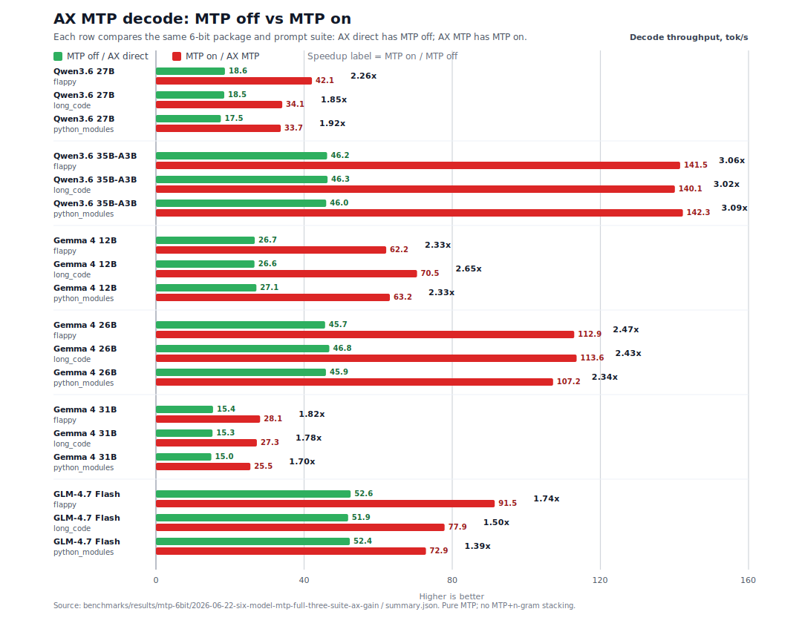

| Target | Suite | AX direct decode | AX MTP decode | AX speedup | AX MTP prefill | AX MTP TTFT | AX accept | MTPLX | lightning-mlx |
| --- | --- | ---: | ---: | ---: | ---: | ---: | ---: | --- | --- |
| `qwen3.6-27b-6bit` | `flappy` | 18.6 tok/s | 42.1 tok/s | 2.26x | 632.7 tok/s | 508 ms | 99.5% | N/A | N/A |
| `qwen3.6-27b-6bit` | `long_code` | 18.5 tok/s | 34.1 tok/s | 1.85x | 693.7 tok/s | 1031 ms | 97.7% | N/A | N/A |
| `qwen3.6-27b-6bit` | `python_modules_long` | 17.5 tok/s | 33.7 tok/s | 1.92x | 614.6 tok/s | 566 ms | 96.7% | N/A | N/A |
| `qwen3.6-35b-a3b` | `flappy` | 46.2 tok/s | 141.5 tok/s | 3.06x | 1561.8 tok/s | 212 ms | 99.8% | N/A | N/A |
| `qwen3.6-35b-a3b` | `long_code` | 46.3 tok/s | 140.1 tok/s | 3.02x | 2381.1 tok/s | 301 ms | 98.5% | N/A | N/A |
| `qwen3.6-35b-a3b` | `python_modules_long` | 46.0 tok/s | 142.3 tok/s | 3.09x | 1690.4 tok/s | 205 ms | 98.9% | N/A | N/A |
| `gemma-4-12b` | `flappy` | 26.7 tok/s | 62.2 tok/s | 2.33x | 1701.7 tok/s | 214 ms | 99.3% | N/A | N/A |
| `gemma-4-12b` | `long_code` | 26.6 tok/s | 70.5 tok/s | 2.65x | 1951.6 tok/s | 409 ms | 99.1% | N/A | N/A |
| `gemma-4-12b` | `python_modules_long` | 27.1 tok/s | 63.2 tok/s | 2.33x | 1753.3 tok/s | 205 ms | 98.0% | N/A | N/A |
| `gemma-4-26b` | `flappy` | 45.7 tok/s | 112.9 tok/s | 2.47x | 2395.0 tok/s | 148 ms | 99.8% | N/A | N/A |
| `gemma-4-26b` | `long_code` | 46.8 tok/s | 113.6 tok/s | 2.43x | 3754.7 tok/s | 219 ms | 99.3% | N/A | N/A |
| `gemma-4-26b` | `python_modules_long` | 45.9 tok/s | 107.2 tok/s | 2.34x | 2597.7 tok/s | 147 ms | 98.9% | N/A | N/A |
| `gemma-4-31b` | `flappy` | 15.4 tok/s | 28.1 tok/s | 1.82x | 701.9 tok/s | 516 ms | 99.6% | N/A | N/A |
| `gemma-4-31b` | `long_code` | 15.3 tok/s | 27.3 tok/s | 1.78x | 747.8 tok/s | 1067 ms | 99.5% | N/A | N/A |
| `gemma-4-31b` | `python_modules_long` | 15.0 tok/s | 25.5 tok/s | 1.70x | 678.5 tok/s | 512 ms | 98.9% | N/A | N/A |
| `glm-4.7-flash` | `flappy` | 52.6 tok/s | 91.5 tok/s | 1.74x | 1694.5 tok/s | 163 ms | 98.2% | N/A | N/A |
| `glm-4.7-flash` | `long_code` | 51.9 tok/s | 77.9 tok/s | 1.50x | 2727.6 tok/s | 250 ms | 98.2% | N/A | N/A |
| `glm-4.7-flash` | `python_modules_long` | 52.4 tok/s | 72.9 tok/s | 1.39x | 1948.2 tok/s | 174 ms | 97.7% | N/A | N/A |

Methodology: `1000` generated tokens, `5` measured repetitions per prompt case
after the AX warmup pass, 30 s cooldown, 10 s inter-case cooldown, sampled
decode (`temperature=0.6`, `top_p=0.95`, `top_k=20`), pure MTP, and no
MTP+n-gram stacking. Peer rows are `N/A` when the peer runner cannot run the
same prepared 6-bit `download-mtp` package under a comparable prompt-suite
contract. MTPLX 0.3.7 rejects the Qwen dense runtime contract and has no Gemma
assistant-MTP or GLM built-in sidecar runner. Lightning-MLX remains
diagnostic-only under current policy after the silent-thinking pathology and
does not provide a comparable promoted row for these prepared packages.

Pure-MTP verification: all listed AX MTP artifacts record zero n-gram accepted,
proposed, submitted, and hit-step telemetry. Summary artifacts:
[`summary.md`](benchmarks/results/mtp-6bit/2026-06-22-six-model-mtp-full-three-suite-ax-gain/summary.md)
and
[`summary.json`](benchmarks/results/mtp-6bit/2026-06-22-six-model-mtp-full-three-suite-ax-gain/summary.json).
Detailed MTP notes, including the GLM-4.7 Flash smoke validation session, live in
[`docs/mtp/`](docs/mtp/).

### Direct Decode · Prefill · TTFT

#### Gemma 4 12B

Gemma 4 12B (`model_type: gemma4_unified`) is reported separately from the per-layer-embedding
E2B/E4B and MoE 26B/31B checkpoints because it has a distinct graph, multimodal tensor contract,
and benchmark boundary. **Upstream `mlx_lm` 0.31.3 cannot load it**
(`ValueError: Model type gemma4_unified not supported`), so the direct peer here is
**llama.cpp Metal** on a shape-compatible GGUF.

> [!NOTE]
> **AX Engine's repo-owned native MLX route supports Gemma 4 12B text plus inline base64
> image/audio/video chat.** Delegated compatibility routes remain text-first;
> `/v1/generate` accepts the processed `multimodal_inputs.gemma4_unified` tensor contract.

**At a glance:**

- **Direct decode:** AX native MLX reaches **65.3-69.1 tok/s** on the bit-comparable
  4-bit-FFN artifact versus llama.cpp Metal's **56.9-59.2 tok/s** depth-matched range.
- **Context depth:** AX's direct margin is **+17% / +15% / +15%** versus llama.cpp matched-depth decode at 128 / 512 / 2,048 prompt tokens.
- **Assistant-MTP:** current `gemma-4-12b` MTP benchmarking lives in the
  [6-bit MTP acceleration refresh](#6-bit-mtp-acceleration-refresh-2026-06-23),
  where the 6-bit `download-mtp` package reaches **62.2-70.5 tok/s** and
  **2.33-2.65x** same-package speedup over MTP-off decode.
- **Why the earlier result flipped:** the upstream MLX snapshot keeps FFN weights at
  8-bit, so it reads about **1.65x** the bytes of the re-quantized 4-bit-FFN artifact.
  Decode is bandwidth-bound; matching quantization closes the gap.

**Direct decode peer comparison:**

AX direct rows use the 4-bit-FFN MLX artifact and random-token prompts. `mlx_lm` is absent
because it has no `gemma4_unified` graph. The llama.cpp rows are shape-compatible external
GGUF references, not prompt-hash-parity MLX rows.

<table>
<tr>
<td>
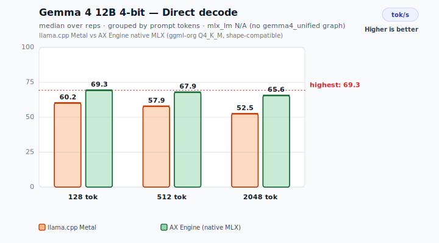
</td>
<td>
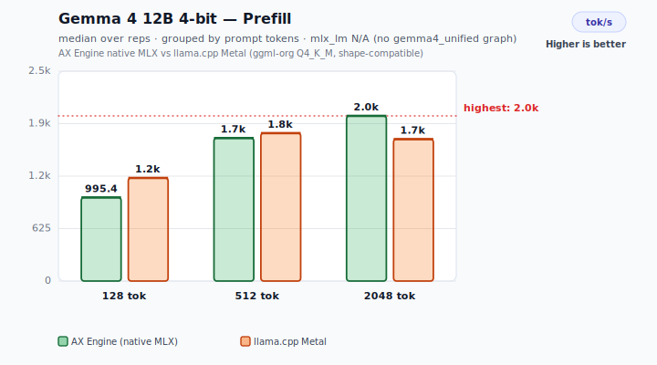
</td>
<td>
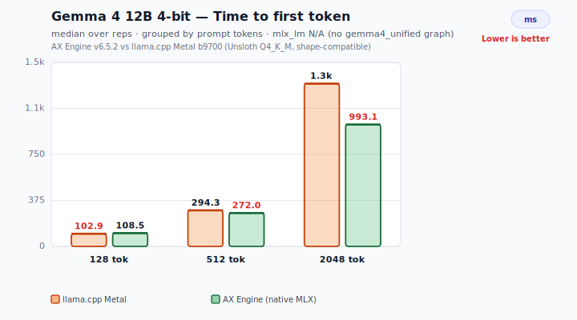
</td>
</tr>
</table>

| Prompt tokens | AX decode | llama.cpp decode (depth 0) | llama.cpp decode (matched depth) | AX prefill | llama.cpp prefill | AX TTFT (ms) | llama.cpp TTFT (ms) |
| ---: | ---: | ---: | ---: | ---: | ---: | ---: | ---: |
| 128 | 69.1 | 59.8 | 59.2 | 1,180 | 1,252 | 108 | 102 |
| 512 | 67.5 | 59.6 | 58.9 | 1,883 | 1,745 | 272 | 293 |
| 2048 | 65.3 | 59.7 | 56.9 | 2,062 | 1,690 | 993 | 1,212 |

Read the two llama.cpp decode columns carefully:

- `depth 0` is plain `llama-bench tg`, decoding from an empty context and representing llama.cpp's best case.
- `matched depth` uses `-d {prompt} -n 128`, so decode happens after the same prompt depth AX has already prefetched.
- AX wins the matched-depth comparison at every prompt size, and prefill also leads at 512 and 2,048 tokens.

The table uses the bit-comparable **4-bit-FFN** AX artifact
(`scripts/requantize_gemma4_12b_ffn_4bit.py`), about 4.5 bpw versus the Q4_K_M GGUF's
about 4.8 bpw. The upstream `mlx-community/gemma-4-12B-it-4bit` snapshot keeps the FFN at
**8-bit** (~10.98 GB) and trails llama.cpp at about 46 tok/s. That is a bytes-read handicap,
not an AX runtime result.

**Memory bandwidth diagnostic:**

This chart is a diagnostic for the Gemma 4 12B quantization story, not a
recommendation to use an 8-bit tier. The "upstream artifact" row is included
only because the public `mlx-community/gemma-4-12B-it-4bit` snapshot keeps FFN
tensors at 8-bit; it explains the older slower AX result. Decode is
memory-bandwidth-bound on Apple Silicon: each token reads the model weights
once, so decode tok/s is set by bytes-read and how close the engine gets to the
memory ceiling. Measured M5 Max GPU peak read bandwidth ≈ 577 GB/s (MLX
reduction over a 6 GB array).

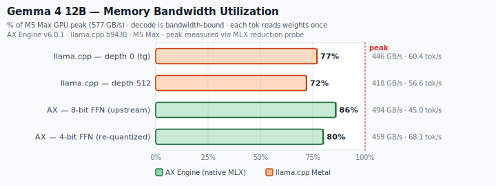

| Engine / quantization | Weights/token | Decode tok/s | Effective BW | % of 577 GB/s peak |
| --- | ---: | ---: | ---: | ---: |
| AX upstream artifact — 8-bit FFN diagnostic | 10.98 GB | 45.4 | 498 GB/s | 86% |
| AX re-quantized artifact — 4-bit FFN | 6.74 GB | 67.3 | 454 GB/s | 79% |
| llama.cpp Q4_K_M — decode @ depth 512 | 7.38 GB | 58.9 | 435 GB/s | 75% |
| llama.cpp Q4_K_M — decode @ depth 0 (`tg`) | 7.38 GB | 59.8 | 441 GB/s | 76% |

The bandwidth view is the key explanation: AX is not under-utilizing memory. The re-quantized
AX row sustains **454 GB/s**, in the same band as llama.cpp's **435 GB/s** at matched depth.
The remaining direct-decode difference is bytes read per token: uniform 4-bit group-64 reduces
AX to **6.74 GB/token**, while Q4_K_M reads **7.38 GB/token**. The upstream artifact
has higher bus utilization (86%) but worse speed because its FFN tensors read far more data.

**Methodology and artifacts:**

Direct rows use the 4-bit-FFN artifact, greedy-equivalent sampler, 128 generated tokens,
5 repetitions, 15 s cooldown, and random-token prompts following the `mlx_lm.benchmark`
contract. llama.cpp decode is shown both at depth 0 (`tg`) and at matched context depth
(`-d {prompt}`). Host/runtime for the latest direct llama.cpp peer rerun: Apple M5 Max ·
llama.cpp b9700 / ggml 0.15.2 (Metal, flash-attn) · `mlx_lm` 0.31.3 has no `gemma4_unified`
support. MTP methodology and artifacts live with
[Speculative Decoding (MTP)](#speculative-decoding-mtp).

Full artifacts:
[`2026-06-26-gemma4-12b-4bit-ax-direct-only`](benchmarks/results/mlx-inference/2026-06-26-gemma4-12b-4bit-ax-direct-only/gemma-4-12b-it-4bit.json)
(AX direct rerun; chart artifact with retained llama.cpp reference rows in
[`gemma-4-12b-it-4bit-with-llama-reference.json`][ref-json];
llama.cpp GGUF provenance in
[`llama_cpp_gguf_provenance.json`](benchmarks/results/mlx-inference/2026-06-26-gemma4-12b-4bit-ax-direct-only/llama_cpp_gguf_provenance.json)).
The upstream 8-bit-FFN bandwidth row is backed by
[`2026-06-26-gemma4-12b-upstream-8bit-ffn-ax-direct-only`](benchmarks/results/mlx-inference/2026-06-26-gemma4-12b-upstream-8bit-ffn-ax-direct-only/gemma-4-12b-it-4bit.json).

Gemma 4 12B multimodal benchmark details now live in
[Benchmarks](docs/BENCHMARKS.md#gemma-4-12b-multimodal-benchmark).

Gemma assistant-MTP package layout and cache-location details live in
[Supported Models](docs/SUPPORTED-MODELS.md#mtp-downloads).

#### DiffusionGemma

DiffusionGemma is a block-diffusion Gemma4 26B checkpoint, not an ordinary autoregressive
decoder. AX runs it with a native MLX graph, but the measurement boundary is different from
the direct-decode families below: the first visible output comes from a **committed 256-token
diffusion block**, not from a single next-token step.

Because of that generation shape, the rows below intentionally do **not** use the
plain `decode tok/s` or `TTFT` labels used for autoregressive models. In Qwen,
Gemma 4 text, and other next-token decoders, `TTFT` means prompt prefill plus the
first single-token decode step, and `decode tok/s` means the steady
token-by-token autoregressive loop. DiffusionGemma instead runs a bidirectional
denoise pass over a 256-token canvas, then performs a causal commit for that
block. The comparable boundary inside this runtime is therefore **time to first
block** and **first-block decode**. Treating these as ordinary TTFT/decode rows
would make the result look directly comparable to autoregressive throughput even
though the work per visible output boundary is different.

The charts keep the same 128 / 512 / 2,048 prompt-token layout as the autoregressive sections
for readability, but the values are AX first-block telemetry. Peer bars are intentionally
omitted rather than shown as zero: current llama.cpp Metal cannot load the GGUF
(`unknown model architecture: 'diffusion-gemma'`), and `mlx_lm` 0.31.3 cannot load the
MLX snapshot (`Model type diffusion_gemma not supported.`).

<table>
<tr>
<td>
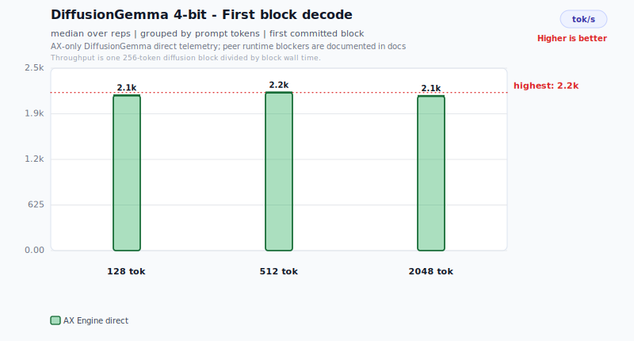
</td>
<td>
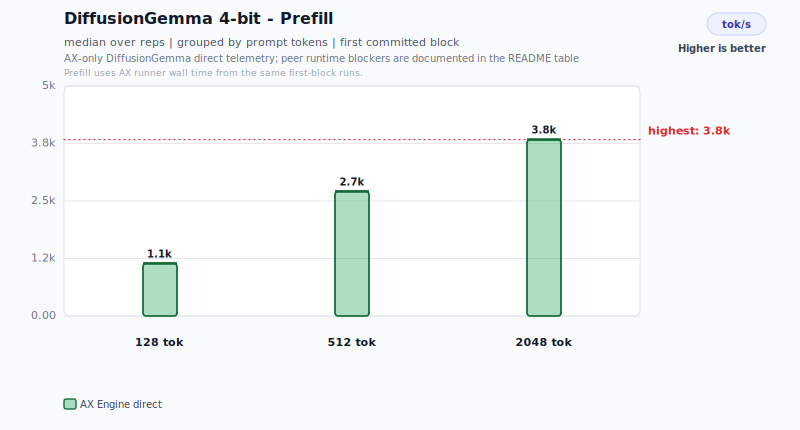
</td>
<td>
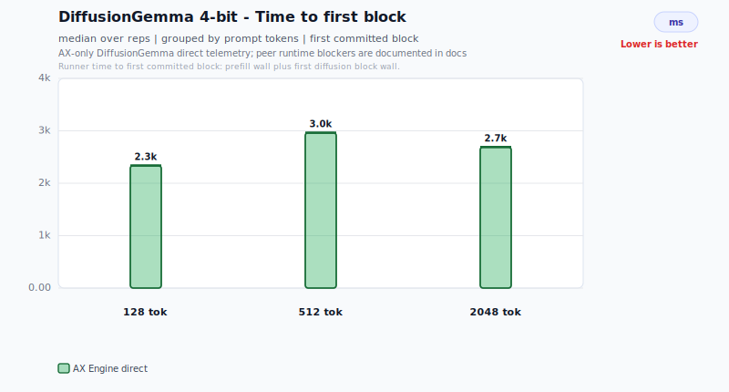
</td>
</tr>
</table>

| Prompt tokens | AX first-block decode | Denoise steps | Committed block |
| ---: | ---: | ---: | ---: |
| 128 | 30.7 tok/s | 48 | 256 tokens |
| 512 | 58.9 tok/s | 25 | 256 tokens |
| 2048 | 32.1 tok/s | 48 | 256 tokens |

**Prefill and first-block latency:**

| Prompt tokens | AX direct prefill | AX time to first block | llama.cpp Metal 9650 | `mlx_lm` 0.31.3 |
| ---: | ---: | ---: | --- | --- |
| 128 | 1,351.8 tok/s | 8,428 ms | load blocked | load blocked |
| 512 | 3,002.1 tok/s | 4,518 ms | load blocked | load blocked |
| 2048 | 4,031.4 tok/s | 8,475 ms | load blocked | load blocked |

`time to first block` is prefill wall time plus the first 256-token denoise-and-commit
block. `first-block decode` is computed as `256 / ax_mlx_diffusion_block_wall_us`.
Use these rows to track AX's DiffusionGemma path; do not compare them directly with
ordinary autoregressive TTFT or fixed-token decode throughput.

| Runtime path | Model artifact | Benchmark status |
| --- | --- | --- |
| AX direct MLX | `mlx-community/diffusiongemma-26B-A4B-it-4bit` | Measured: 1 warmup + 5 measured repetitions, 15 s cooldown, medians reported |
| llama.cpp Metal 9650 | 4-bit GGUF | Blocked at load: `unknown model architecture: 'diffusion-gemma'` |
| `mlx_lm` 0.31.3 | 4-bit MLX snapshot | Blocked at load: `Model type diffusion_gemma not supported.` |

**Memory bandwidth share:**

The bandwidth chart is an implementation-efficiency view, not a peer comparison. It estimates
first-block traffic at block granularity from the measured denoise-step count plus one causal
commit over the 16.54 GB MLX safetensors artifact. This rerun used **48 / 25 / 48** denoise
steps at 128 / 512 / 2,048 prompt tokens, so the estimated traffic is much larger than a
one-step early-exit block. The chart shows estimated bandwidth used versus the M5 Max
theoretical ceiling; the table keeps the effective GB/s values.

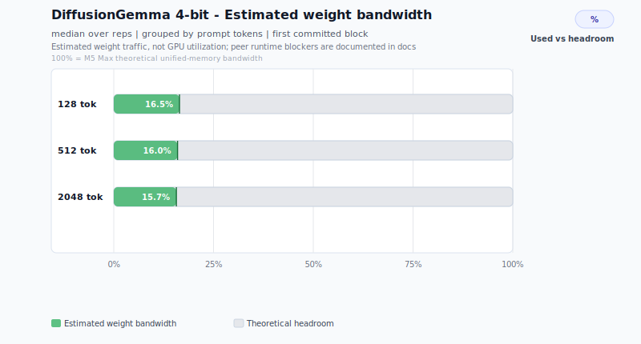

| Prompt tokens | Estimated effective bandwidth | % of 614.4 GB/s M5 Max theoretical bandwidth |
| ---: | ---: | ---: |
| 128 | 97.3 GB/s | 15.8% |
| 512 | 98.9 GB/s | 16.1% |
| 2,048 | 101.8 GB/s | 16.6% |

At these prompt lengths, the first-block path uses roughly 16% of theoretical M5 Max bandwidth. The current bottleneck is therefore not raw memory bandwidth alone; the next optimization target is denoise graph reuse, dispatch overhead, and convergence behavior under stricter quality gates.

**Denoise loop optimization — GPU-native sampling:**

`crates/ax-engine-mlx/src/diffusion.rs` keeps denoise state, entropy-bound acceptance, and self-conditioning on the GPU. Convergence checks materialize only scalar counters and run every `convergence_check_interval` steps (default 4), reducing per-block GPU/CPU syncs from 48 to about 12. The CPU no longer round-trips 256 token positions on every denoise step; sampling and acceptance stay in lazy MLX graph nodes that can fuse with the forward evaluation.

**Adaptive convergence detection:**

The denoise loop can stop early when any configured convergence signal fires:

1. **Strict stability:** argmax is unchanged for `convergence_steps` consecutive checks and mean entropy is below `entropy_threshold` (default 0.005).

2. **Low update rate:** the accepted-position update rate drops below `acceptance_rate_threshold` (default 1%), so another denoise pass is unlikely to change the block materially.

3. **Entropy plateau:** mean entropy stops decreasing materially after the early denoise phase, indicating diminishing returns from additional passes.

The benchmark rows above report the measured adaptive-convergence run as recorded in the artifact. This rerun did **not** converge after one denoise step: it used 48 / 25 / 48 denoise steps at 128 / 512 / 2,048 prompt tokens. Time to first block therefore tracks the full measured denoise work for the 128- and 2,048-token rows and a mid-run early exit for the 512-token row.

**Denoise performance optimizations (enabled by default):**

The following optimizations are enabled by default for DiffusionGemma to maximize memory bandwidth utilization and reduce per-step overhead. Each can be individually disabled via opt-out environment variables.

| Optimization | What it does | Opt-out |
| --- | --- | --- |
| KV concat buffer | Pre-allocates per-layer KV concatenation buffers on the first denoise step and updates only the canvas slice on subsequent steps via `slice_update`, avoiding re-copying the cached prompt prefix. Also caches the bidirectional attention mask per layer. | `AX_DIFFUSION_NO_KV_CONCAT_BUFFER=1` |
| Embedding cache | Caches per-layer embedding inputs across denoise steps when token IDs are unchanged, using a GPU-side sum fingerprint to detect changes. | `AX_DIFFUSION_NO_EMBEDDING_CACHE=1` |
| Compiled forward | Compiles the bidirectional denoise forward pass into an `MlxClosure` per block (when self-conditioning is off), collapsing ~250 per-step MLX C-API calls into one dispatched graph. | `AX_DIFFUSION_NO_COMPILED_FORWARD=1` |
| Commit skip on converge | Skips the causal commit forward pass (~40 ms) when the denoise loop converges with near-perfect acceptance (≥ 99%). | `AX_DIFFUSION_NO_SKIP_COMMIT=1` |

**Experimental opt-in optimizations:**

| Environment variable | What it does | Status |
| --- | --- | --- |
| `AX_DIFFUSION_FULL_PIPELINE=1` | Compiles the entire denoise step (forward + softmax + entropy + argmax + sampling + acceptance) into a single `MlxClosure`. Supersedes the forward-only compiled closure when both are set. | Experimental / benchmarking |

Example usage for a single benchmark run with all optimizations:

```bash
python3 scripts/bench_diffusion_gemma_direct.py --bench-bin target/release/ax-engine-bench
```

These flags are read once per process. The default-on optimizations have been validated for token equivalence against the imperative path.

Artifacts: AX direct rows are [`2026-06-20-direct-first-block-rerun/summary.json`](benchmarks/results/diffusion-gemma-direct/2026-06-20-direct-first-block-rerun/summary.json), with the human summary in [`summary.md`](benchmarks/results/diffusion-gemma-direct/2026-06-20-direct-first-block-rerun/summary.md). Peer runtime blockers are recorded as load failures, so there are no llama.cpp or `mlx_lm` result artifacts for this model family.

Render charts with:

```bash
python3 scripts/bench_diffusion_gemma_direct.py --skip-benchmark
```

**Decode acceleration model — no MTP:**

DiffusionGemma's acceleration model is the diffusion block itself. It does not stack with MTP or n-gram acceleration because those techniques assume an autoregressive next-token loop:

| | MTP (speculative decoding) | DiffusionGemma (block diffusion) |
| --- | --- | --- |
| Generation | Draft-then-verify, one token at a time | 256-token blocks via bidirectional denoising |
| Forward pass | Causal only | Bidirectional (denoise) + causal (commit) |
| Needs draft model / assistant head | Yes | No |
| AX Engine decode path | `ngram_acceleration` / `mtp_head_only` | `diffusion` (early return, mutually exclusive) |

In the runner's `decode_one`, the diffusion path returns before the MTP/n-gram branches are reached. `DiffusionConfig` carries canvas size, denoise steps, entropy thresholds, convergence settings, and temperature schedule only; it has no MTP fields.

**Supported features:**

- Block-autoregressive discrete diffusion decode (canvas=256, up to 48 denoise steps)
- Entropy-bound position acceptance with argmax-based rejection
- Self-conditioning via GPU matmul (prob × cached embedding table)
- Linear temperature schedule (configurable start/end)
- Adaptive convergence detection (stable argmax, mean entropy, low update rate, and entropy plateau)
- Standard causal prefill (same Gemma4 encoder, 4,073.3 tok/s median at the 2,048-token row)
- Causal commit pass (writes KV cache for subsequent blocks)
- SSE telemetry counters for diffusion block timing, denoise steps, convergence signals, and near-miss entropy/update-rate diagnostics (`ax_mlx_diffusion_*`)
- `diffusion` decode-route classification in benchmark harness

**Not applicable:**

- MTP / assistant-head speculative decoding (architecturally incompatible)
- N-gram acceleration (diffusion replaces the autoregressive decode loop)
- Direct pipeline double-buffering (not autoregressive)

**Benchmark contract:**

The published rows use first-block telemetry instead of the standard fixed-token autoregressive benchmark contract. `max_output_tokens=1` is enough to force prefill plus one diffusion block, and the block counters still report the full 256-token denoise/commit cycle even though the caller receives only the first emitted token.

Telemetry: SSE-emitted `ax_mlx_diffusion_*` counters cover block count, denoise steps, convergence count, per-criterion convergence signals, near-miss entropy/update-rate diagnostics, denoise wall time, commit wall time, and block wall time, plus `diffusion` decode-route classification in `bench_mlx_inference_stack.py`.

Run the full direct benchmark and regenerate the charts:

```bash
cargo build -p ax-engine-bench --bin ax-engine-bench
python3 scripts/bench_diffusion_gemma_direct.py
```

<!-- readme-performance-artifacts: reference=benchmarks/results/mlx-inference/2026-05-26-direct-mode-clean-refresh/; reference=benchmarks/results/mlx-inference/2026-06-26-qwen36-direct-refresh/; reference=benchmarks/results/mlx-inference/2026-06-26-gemma4-6bit-mlx-lm-only/; ax-base=benchmarks/results/mlx-inference/2026-06-22-ax-direct-readme-direct-only/; ax-overlay=benchmarks/results/mlx-inference/2026-06-26-qwen36-direct-refresh/; ax-overlay=benchmarks/results/mlx-inference/2026-06-26-gemma4-6bit-ax-direct-only/ -->

#### Gemma 4 and Qwen 3.6

The family tables below compare **direct (non-speculative) decode** across llama.cpp Metal, mlx_lm, and ax engine, covering Gemma 4 and Qwen 3.6 at 128/512/2048 prompt tokens. `ax direct baseline` disables n-gram acceleration, MTP, and assistant drafting to measure the repo-owned direct decode path. Bench prompts are `mlx_lm.benchmark` seed-0 random tokens, which keeps prompt-hash parity across MLX rows.

The prefill and TTFT advantage is the practical direct-mode story. AX is ahead of `mlx_lm` in every listed prefill and TTFT cell below, while decode gains are smaller and model-dependent. That means the repo-owned MLX route is especially valuable for interactive requests where prompt ingestion dominates perceived latency: AX keeps prompt prefill, first-token timing, model-specific graph paths, and route metadata in one measured runtime path. These are cold-prefix rows, not prompt-cache, continuous-batching, or speculative-decoding claims.

<table>
<tr>
<td></td>
<td align="center"><strong>Gemma 4</strong></td>
<td align="center"><strong>Qwen 3.6</strong></td>
</tr>
<tr>
<td align="center"><strong>Decode rate</strong></td>
<td>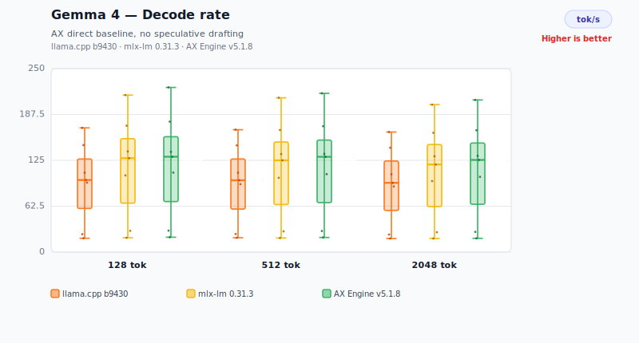</td>
<td>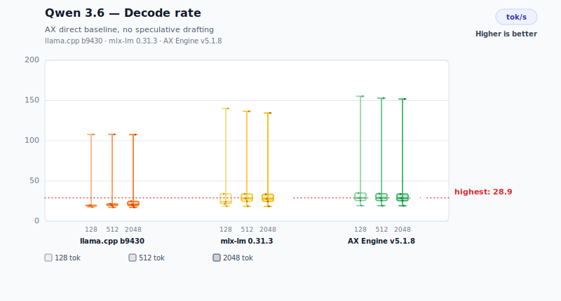</td>
</tr>
<tr>
<td align="center"><strong>Prefill rate</strong></td>
<td>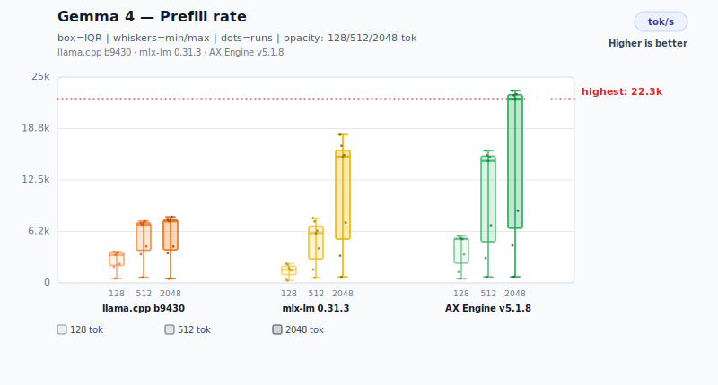</td>
<td>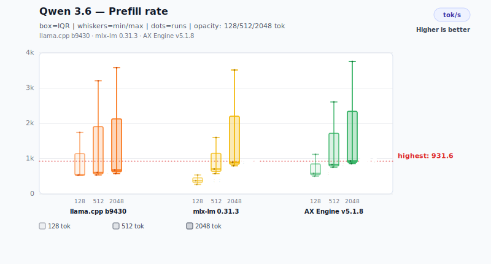</td>
</tr>
<tr>
<td align="center"><strong>TTFT</strong></td>
<td>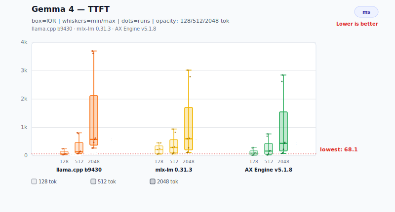</td>
<td>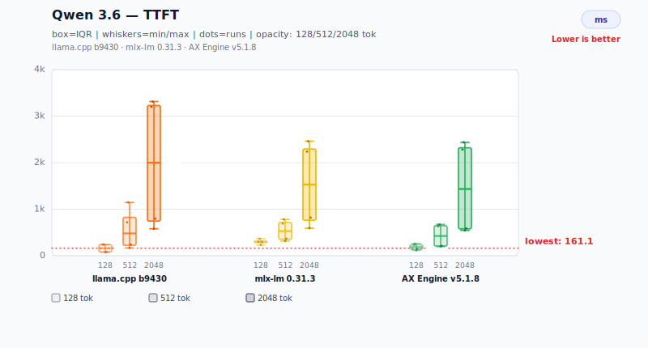</td>
</tr>
</table>

> **`llama.cpp Metal*` column** — Shape-compatible reference produced by Metal-enabled `llama-bench`. `llama-bench` generates its own internal synthetic prompt tokens and does not consume the harness prompt JSON, so these numbers are **not** prompt-hash parity with the other columns. No percentage delta is shown. MLX bit-widths are mapped to the nearest Unsloth GGUF quant (4→Q4_K_M, 6→Q6_K), with explicit UD-* Unsloth Dynamic rows only when no standard root-level K-quant is published. Source: `benchmarks/manifests/llama_cpp_metal/inventory.json`, `scripts/bench_llama_cpp_metal_sweep.py`.

<details>
<summary>Benchmark provenance and methodology</summary>

The `mlx_lm` reference rows for the Gemma 4 rows shown below come from `benchmarks/results/mlx-inference/2026-05-26-direct-mode-clean-refresh/`. The Gemma 4 26B A4B and 31B 6-bit `mlx_lm` spot rows come from `benchmarks/results/mlx-inference/2026-06-26-gemma4-6bit-mlx-lm-only/`. The Gemma 4 AX direct-mode cells come from the direct-only AX rerun in `benchmarks/results/mlx-inference/2026-06-22-ax-direct-readme-direct-only/` (v6.5.2), with the Gemma 4 E4B, 26B A4B, and 31B 6-bit rows sourced from `benchmarks/results/mlx-inference/2026-06-26-gemma4-6bit-ax-direct-only/`. The Qwen 3.6 `mlx_lm` and AX direct-mode cells come from `benchmarks/results/mlx-inference/2026-06-26-qwen36-direct-refresh/`. The `llama.cpp Metal*` column is injected from `benchmarks/manifests/llama_cpp_metal/inventory.json`, `benchmarks/results/llama-cpp-metal/2026-05-18-llama-cpp-only-fa/`, the Qwen 3.6 35B-A3B 6-bit rerun in `benchmarks/results/llama-cpp-metal/2026-06-26-qwen36-35b-6bit/`, and the Gemma 4 6-bit llama.cpp-only rerun in `benchmarks/results/llama-cpp-metal/2026-06-26-gemma4-6bit-llama/`.

Gemma 4 E4B 6-bit keeps the `mlx_lm` cells blank because `mlx_lm.benchmark` cannot load `mlx-community/gemma-4-e4b-it-6bit` with `mlx-lm` 0.31.3. The checkpoint config declares 42 language layers and `num_kv_shared_layers=18`, so the upstream Gemma4 text model builds K/V projections only for layers 0..23 and treats layers 24..41 as shared-KV layers. The MLX snapshot still contains 126 per-layer K/V tensors for layers 24..41 (`k_norm`, `k_proj`, and `v_proj` quantized weights), causing strict weight loading to fail with `Received 126 parameters not in model`. Source: `benchmarks/results/mlx-inference/2026-06-26-gemma4-6bit-mlx-lm-only/summary.md`.

Setup: generation=128, 5 measured repetitions, 15-second cooldown, AX prefix cache disabled for cold prefill and TTFT measurement, production-build binaries, matching prompt SHA checks. Long-greedy AX prefill rows are runner-time measurements of the cache-state prefix plus final prompt-token boundary — not full-logits prompt scoring throughput. Percentages are versus `mlx_lm`.

The 2K `llama.cpp Metal*` prefill rows are long-context, GGUF-runtime-reference rows. The Gemma 4 E2B 4-bit row was produced with llama.cpp b9110 and rechecked on b9200 with Metal offload, `-b/-ub 2048`, and flash attention enabled. The b9200 recheck improved 2K prefill only slightly — this is our benchmark boundary, not an upstream llama.cpp official bug statement.
</details>

Qwen 3.6 direct-mode verdict: AX is faster overall against `mlx_lm` across the refreshed 27B and 35B-A3B 4/6-bit rows. The 35B-A3B rows are faster in every listed prefill, decode, and TTFT cell; the dense 27B rows are faster at 128/512 prompt tokens and roughly flat to slightly slower at 2,048 prompt tokens.

#### Prefill throughput (tok/s) — percentages vs mlx_lm

| Model | MLX quantization | Prompt tok | llama.cpp Metal* | mlx_lm | ax engine |
| --- | --- | ---: | ---: | ---: | ---: |
| Gemma 4 E2B | 4-bit | 128 | 3,795.5 | 2,338.1 | **6,047.1 (+158.6%)** |
|  |  | 512 | 7,271.0 | 7,870.0 | **16,880.4 (+114.5%)** |
|  |  | 2048 | 7,653.3 | 18,014.7 | **25,168.4 (+39.7%)** |
| Gemma 4 E2B | 6-bit | 128 | 3,690.8 | 1,823.5 | **5,595.1 (+206.8%)** |
|  |  | 512 | 7,318.4 | 6,046.6 | **15,912.0 (+163.2%)** |
|  |  | 2048 | 7,659.5 | 15,332.1 | **22,676.9 (+47.9%)** |
| Gemma 4 E4B | 4-bit | 128 | 2,319.0 | 1,513.2 | **3,444.8 (+127.7%)** |
|  |  | 512 | 4,439.2 | 4,195.5 | **7,027.8 (+67.5%)** |
|  |  | 2048 | 4,421.0 | 7,325.4 | **8,800.8 (+20.1%)** |
| Gemma 4 E4B | 6-bit | 128 | 2,240.7 | — | **3,010.1** |
|  |  | 512 | 4,168.7 | — | **6,388.3** |
|  |  | 2048 | 4,347.6 | — | **8,202.4** |
| Gemma 4 26B A4B | 4-bit | 128 | 1,947.0 | 496.4 | **1,345.5 (+171.0%)** |
|  |  | 512 | 3,484.9 | 1,621.0 | **3,047.3 (+88.0%)** |
|  |  | 2048 | 3,607.8 | 3,300.1 | **4,642.8 (+40.7%)** |
| Gemma 4 26B A4B | 6-bit | 128 | 1,630.5 | 414.0 | **1,162.8 (+180.9%)** |
|  |  | 512 | 3,021.8 | 1,285.0 | **2,788.7 (+117.0%)** |
|  |  | 2048 | 3,274.1 | 3,312.9 | **4,357.3 (+31.5%)** |
| Gemma 4 31B | 4-bit | 128 | 527.3 | 283.1 | **513.2 (+81.3%)** |
|  |  | 512 | 668.7 | 619.9 | **738.6 (+19.2%)** |
|  |  | 2048 | 525.4 | 733.9 | **774.5 (+5.5%)** |
| Gemma 4 31B | 6-bit | 128 | 496.8 | 259.6 | **427.7 (+64.7%)** |
|  |  | 512 | 494.4 | 548.6 | **652.1 (+18.9%)** |
|  |  | 2048 | 426.2 | 675.0 | **706.5 (+4.7%)** |
| Qwen 3.6 27B | 4-bit | 128 | 527.8 | 424.7 | **572.3 (+34.8%)** |
|  |  | 512 | 538.0 | 739.0 | **804.4 (+8.9%)** |
|  |  | 2048 | 679.9 | 914.9 | 910.2 (-0.5%) |
| Qwen 3.6 27B | 6-bit | 128 | 542.4 | 348.0 | **492.5 (+41.5%)** |
|  |  | 512 | 607.9 | 655.1 | **735.3 (+12.3%)** |
|  |  | 2048 | 576.6 | 832.1 | 825.5 (-0.8%) |
| Qwen 3.6 35B A3B | 4-bit | 128 | 1,744.6 | 562.4 | **1,097.6 (+95.2%)** |
|  |  | 512 | 3,208.3 | 1,613.6 | **2,530.1 (+56.8%)** |
|  |  | 2048 | 3,576.6 | 3,455.1 | **3,639.5 (+5.3%)** |
| Qwen 3.6 35B A3B | 6-bit | 128 | 1,556.7 | 431.6 | **858.6 (+98.9%)** |
|  |  | 512 | 2,838.6 | 1,394.4 | **2,372.5 (+70.1%)** |
|  |  | 2048 | 3,273.5 | 2,494.3 | **3,394.2 (+36.1%)** |

#### Decode throughput (tok/s) — generation=128 tokens, temp=0

| Model | MLX quantization | Prompt tok | llama.cpp Metal* | mlx_lm | ax direct baseline |
| --- | --- | ---: | ---: | ---: | ---: |
| Gemma 4 E2B | 4-bit | 128 | 170.1 | 214.0 | **236.0 (+10.3%)** |
|  |  | 512 | 171.5 | 210.3 | **226.7 (+7.8%)** |
|  |  | 2048 | 171.8 | 200.9 | **216.7 (+7.9%)** |
| Gemma 4 E2B | 6-bit | 128 | 154.0 | 172.2 | **186.0 (+8.0%)** |
|  |  | 512 | 153.0 | 166.3 | **180.2 (+8.4%)** |
|  |  | 2048 | 154.2 | 162.5 | **173.9 (+7.0%)** |
| Gemma 4 E4B | 4-bit | 128 | 110.5 | 137.1 | **143.4 (+4.6%)** |
|  |  | 512 | 110.3 | 133.6 | **140.4 (+5.1%)** |
|  |  | 2048 | 110.7 | 130.6 | **137.6 (+5.4%)** |
| Gemma 4 E4B | 6-bit | 128 | 80.8 | — | **108.9** |
|  |  | 512 | 82.2 | — | **107.8** |
|  |  | 2048 | 79.0 | — | **107.4** |
| Gemma 4 26B A4B | 4-bit | 128 | 112.8 | 127.9 | **134.9 (+5.5%)** |
|  |  | 512 | 112.6 | 125.0 | **131.7 (+5.3%)** |
|  |  | 2048 | 112.5 | 119.3 | **127.2 (+6.6%)** |
| Gemma 4 26B A4B | 6-bit | 128 | 80.6 | 103.7 | **111.0 (+7.1%)** |
|  |  | 512 | 79.1 | 101.1 | **107.6 (+6.4%)** |
|  |  | 2048 | 79.1 | 97.9 | **104.0 (+6.2%)** |
| Gemma 4 31B | 4-bit | 128 | 25.5 | 28.9 | **29.1 (+0.7%)** |
|  |  | 512 | 24.6 | 28.3 | **28.5 (+0.7%)** |
|  |  | 2048 | 24.0 | 27.0 | **27.3 (+1.0%)** |
| Gemma 4 31B | 6-bit | 128 | 16.2 | 19.6 | **20.0 (+2.2%)** |
|  |  | 512 | 17.8 | 19.3 | **19.7 (+1.9%)** |
|  |  | 2048 | 16.4 | 18.6 | **18.8 (+1.1%)** |
| Qwen 3.6 27B | 4-bit | 128 | 19.4 | 33.2 | **34.1 (+2.6%)** |
|  |  | 512 | 21.6 | 33.1 | 32.3 (-2.4%) |
|  |  | 2048 | 24.7 | 32.6 | 32.5 (-0.5%) |
| Qwen 3.6 27B | 6-bit | 128 | 19.4 | 24.3 | **24.9 (+2.5%)** |
|  |  | 512 | 19.4 | 24.3 | 23.9 (-1.5%) |
|  |  | 2048 | 19.4 | 24.1 | 23.9 (-0.9%) |
| Qwen 3.6 35B A3B | 4-bit | 128 | 107.8 | 129.7 | **149.0 (+14.9%)** |
|  |  | 512 | 107.8 | 128.3 | **138.6 (+8.0%)** |
|  |  | 2048 | 107.5 | 125.2 | **141.2 (+12.8%)** |
| Qwen 3.6 35B A3B | 6-bit | 128 | 81.9 | 111.3 | **119.6 (+7.4%)** |
|  |  | 512 | 79.9 | 110.4 | **122.9 (+11.3%)** |
|  |  | 2048 | 82.2 | 105.8 | **121.7 (+15.0%)** |
> Qwen 3.6 27B 4-bit at prompt=2,048 originally produced zero decode tokens because 4-bit quantization noise pushed an EOS token to argmax at decode step 0 on the `mlx_lm.benchmark` random-token contract. The benchmark harness now sends `sampling.ignore_eos=true` for AX throughput runs, matching how `mlx_lm.benchmark` measures fixed `gen=N` throughput. Production requests default to `ignore_eos=false`. Source: `benchmarks/results/mlx-inference/2026-05-20-qwen27-4to5-direct-ngram-directcpp-r2/qwen3_6-27b-4bit.json`.

#### Time to first token (ms) — generation=128 tokens, temp=0

**Lower is better.** `mlx_lm` values are derived from reported prefill throughput. AX values are measured directly from per-step runner timing in the SSE event stream.

| Model | MLX quantization | Prompt tok | llama.cpp Metal* | mlx_lm | ax engine |
| --- | --- | ---: | ---: | ---: | ---: |
| Gemma 4 E2B | 4-bit | 128 | 33.7 | 54.7 | **21.2 (-61.3%)** |
|         |         | 512 | 70.4 | 65.1 | **30.3 (-53.4%)** |
|         |         | 2048 | 267.6 | 113.7 | **81.4 (-28.4%)** |
| Gemma 4 E2B | 6-bit | 128 | 34.7 | 70.2 | **22.9 (-67.4%)** |
|         |         | 512 | 70.0 | 84.7 | **32.2 (-62.0%)** |
|         |         | 2048 | 267.4 | 133.6 | **90.3 (-32.4%)** |
| Gemma 4 E4B | 4-bit | 128 | 55.2 | 84.6 | **37.2 (-56.1%)** |
|         |         | 512 | 115.3 | 122.0 | **72.9 (-40.3%)** |
|         |         | 2048 | 463.2 | 279.6 | **232.7 (-16.8%)** |
| Gemma 4 E4B | 6-bit | 128 | 57.1 | — | **42.5** |
|         |         | 512 | 122.8 | — | **80.1** |
|         |         | 2048 | 471.1 | — | **249.7** |
| Gemma 4 26B A4B | 4-bit | 128 | 65.7 | 257.8 | **95.1 (-63.1%)** |
|         |         | 512 | 146.9 | 315.8 | **168.0 (-46.8%)** |
|         |         | 2048 | 567.7 | 620.6 | **441.1 (-28.9%)** |
| Gemma 4 26B A4B | 6-bit | 128 | 78.5 | 309.2 | **110.1 (-64.4%)** |
|         |         | 512 | 169.4 | 398.4 | **183.6 (-53.9%)** |
|         |         | 2048 | 625.5 | 618.2 | **470.0 (-24.0%)** |
| Gemma 4 31B | 4-bit | 128 | 242.7 | 452.2 | **249.4 (-44.8%)** |
|         |         | 512 | 765.6 | 826.0 | **693.2 (-16.1%)** |
|         |         | 2048 | 3,898.3 | 2,790.6 | **2,644.3 (-5.2%)** |
| Gemma 4 31B | 6-bit | 128 | 257.7 | 493.1 | **299.3 (-39.3%)** |
|         |         | 512 | 1,035.7 | 933.3 | **785.2 (-15.9%)** |
|         |         | 2048 | 4,804.7 | 3,033.9 | **2,898.7 (-4.5%)** |
| Qwen 3.6 27B | 4-bit | 128 | 242.5 | 301.4 | **223.7 (-25.8%)** |
|  |  | 512 | 951.7 | 692.8 | **636.5 (-8.1%)** |
|  |  | 2048 | 3,012.3 | 2,238.6 | 2,249.9 (+0.5%) |
| Qwen 3.6 27B | 6-bit | 128 | 236.0 | 367.8 | **259.9 (-29.3%)** |
|  |  | 512 | 842.2 | 781.6 | **696.3 (-10.9%)** |
|  |  | 2048 | 3,551.7 | 2,461.1 | 2,481.0 (+0.8%) |
| Qwen 3.6 35B A3B | 4-bit | 128 | 73.4 | 227.6 | **116.6 (-48.8%)** |
|  |  | 512 | 159.6 | 317.3 | **202.4 (-36.2%)** |
|  |  | 2048 | 572.6 | 592.7 | **562.7 (-5.1%)** |
| Qwen 3.6 35B A3B | 6-bit | 128 | 82.2 | 296.6 | **149.1 (-49.7%)** |
|  |  | 512 | 180.4 | 367.2 | **215.8 (-41.2%)** |
|  |  | 2048 | 625.6 | 821.1 | **603.4 (-26.5%)** |

#### Embedding throughput (tok/s)

Embedding models use a separate pooling route from text generation. The batched
numbers are the relevant path for ingestion and worker pools; loop rows show the
cost of issuing one sentence at a time.

| Model | Workload | mlx-lm | ax-engine-py | AX vs mlx-lm |
| --- | --- | ---: | ---: | ---: |
| Qwen3-Embedding 0.6B 8-bit | single sentence | 1,478 | 1,386 | -6.2% |
|  | 10-sentence batch | 2,805 | 2,620 | -6.6% |
| Qwen3-Embedding 4B 4-bit | single sentence | 477 | 537 | +12.6% |
|  | 10-sentence batch | 1,434 | 1,484 | +3.5% |
| Qwen3-Embedding 8B 4-bit DWQ | single sentence | 319 | 303 | -5.0% |
|  | 10-sentence batch | 872 | 868 | -0.5% |

Source: `benchmarks/results/embedding/2026-05-12-full-fresh-readme-refresh/`.
API semantics, pooling modes, micro-batching behavior, and cooldown profiles are
documented in [`docs/EMBEDDINGS.md`](docs/EMBEDDINGS.md).

## SDKs

AX Engine SDK docs are organized under [`docs/sdk/`](docs/sdk/README.md).
Most SDKs target the OpenAI-compatible HTTP server; Python can also use the
in-process session API.

| SDK | Docs | Package / path |
| --- | --- | --- |
| **Rust** | [docs/sdk/rust.md](docs/sdk/rust.md) | `crates/ax-engine-sdk` |
| **Python** | [docs/sdk/python.md](docs/sdk/python.md) | `python/ax_engine` |
| **JavaScript / TypeScript** | [docs/sdk/javascript.md](docs/sdk/javascript.md) | `javascript/ax-engine` / `@ax-engine/sdk` |
| **Go** | [docs/sdk/go.md](docs/sdk/go.md) | `sdk/go/axengine` |
| **Ruby** | [docs/sdk/ruby.md](docs/sdk/ruby.md) | `sdk/ruby` / `ax-engine-sdk` |
| **Mojo** | [docs/sdk/mojo.md](docs/sdk/mojo.md) | `sdk/mojo/ax_engine.mojo` |

## Server Usage

Use `ax-engine serve` for normal local serving. It accepts a downloaded model
directory, a supported alias with `--download`, or the MTP package directory
printed by `ax-engine download-mtp`.

Start a direct-support model from an alias:

```bash
ax-engine serve qwen36-35b --download --port 8080
```

Or serve a prepared local package:

```bash
ax-engine serve "$MODEL_DIR" --port 8080
```

Inspect the runtime route before testing clients:

```bash
curl http://127.0.0.1:8080/v1/runtime
```

Send an OpenAI-compatible chat request:

```bash
curl http://127.0.0.1:8080/v1/chat/completions \
  -H 'content-type: application/json' \
  -d '{"model":"qwen3_dense","messages":[{"role":"user","content":"Say hello from AX."}],"max_tokens":64}'
```

For local-only development, HTTP authentication is disabled by default. To
require a bearer token on API routes, start with `--api-key` or set
`AX_ENGINE_API_KEY`; health probes remain unauthenticated. See
[`docs/SERVER.md`](docs/SERVER.md#authentication) for the full auth contract.

Use the low-level `ax-engine-server` entrypoint when you need explicit runtime
flags:

```bash
ax-engine-server \
  --mlx \
  --mlx-model-artifacts-dir "$MODEL_DIR" \
  --port 8080
```

Detailed endpoint examples, streaming, embeddings, Ollama-shaped adapters,
delegated `mlx_lm` routes, and server preview checks live in
[`docs/SERVER.md`](docs/SERVER.md) and
[`docs/GETTING-STARTED.md`](docs/GETTING-STARTED.md#first-commands).
Benchmark commands live with the performance docs instead of this usage
section.

## Documentation

Start with the task-based docs hub at [`docs/README.md`](docs/README.md).

| Need | Read |
| --- | --- |
| Install and run the first request | [Getting Started](docs/GETTING-STARTED.md) |
| Choose or download a model | [Supported Models](docs/SUPPORTED-MODELS.md) |
| Prepare MTP packages or compare 4-bit and 6-bit MTP rows | [MTP Docs](docs/mtp/README.md) |
| Interpret public performance numbers | [Performance Docs Map](docs/performance/README.md) |
| Reproduce or review benchmarks | [Benchmarks](docs/BENCHMARKS.md) |
| Integrate through HTTP or SDKs | [Server](docs/SERVER.md), [SDK Docs](docs/sdk/README.md) |
| Understand runtime internals | [Architecture](docs/ARCHITECTURE.md) |

## Workspace

```text
crates/ax-engine-core    Engine state machine, scheduler, KV manager, sampler
crates/ax-engine-mlx     MLX model graph, n-gram acceleration, KV cache, runner
crates/mlx-sys           bindgen FFI over ax_shim.h to MLX C++; safe MlxArray RAII wrappers
crates/ax-engine-sdk     Session API, backend resolution (MLX, mlx-lm delegated, or llama.cpp)
crates/ax-engine-server  Axum HTTP/SSE adapter (OpenAI-compatible routes)
crates/ax-engine-bench   Manifest-driven workload-contract CLI
crates/ax-engine-py      PyO3 extension (ABI3, Python 3.10+)
javascript/ax-engine     TypeScript/JS HTTP SDK + LangChain adapter
sdk/go/axengine          Go HTTP SDK
sdk/ruby/                Ruby HTTP SDK (ax-engine-sdk gem)
sdk/mojo/                Mojo SDK (Python-interop)
```

## Development

Common development gates:

```bash
cargo build --workspace
cargo test --quiet
cargo clippy --all-targets --all-features -- -D warnings
cargo fmt
maturin develop
python -m unittest discover -s python/tests -v
bash scripts/check-mlx-telemetry.sh
```

For Gemma/AX MLX telemetry and decode-profile changes, prefer the targeted `scripts/check-mlx-telemetry.sh` gate. Use `scripts/check-mlx-telemetry.sh --full-workspace` when the change touches shared Rust contracts; that protected path compiles the workspace with `cargo test --workspace --no-run --jobs 1` before running crate-by-crate tests.

Coverage is collected by the report-only GitHub Actions workflow in `.github/workflows/coverage.yml`. It publishes Rust `cargo llvm-cov` and Python `coverage.py` artifacts without enforcing a percentage threshold yet.

Public documentation starts at [docs/README.md](docs/README.md). Canonical
benchmark manifests are in `benchmarks/manifests/`.

## Benchmark Reference Projects

AX Engine's benchmark design and compatibility checks are informed by local reference checkouts of related open-source projects. A row is published only when it fits the benchmark contract for the specific workload: comparable model artifacts, prompt and sampling policy, prefill/decode/TTFT definitions, repeatability, host/runtime metadata, and provenance.

| Project | Repository |
| --- | --- |
| ds4 | [antirez/ds4](https://github.com/antirez/ds4) |
| lightning-mlx | [samuelfaj/lightning-mlx](https://github.com/samuelfaj/lightning-mlx) |
| llama.cpp | [ggml-org/llama.cpp](https://github.com/ggml-org/llama.cpp) |
| mistral.rs | [EricLBuehler/mistral.rs](https://github.com/EricLBuehler/mistral.rs) |
| MLX | [ml-explore/mlx](https://github.com/ml-explore/mlx) |
| mlx-engine | [lmstudio-ai/mlx-engine](https://github.com/lmstudio-ai/mlx-engine) |
| mlx-lm | [ml-explore/mlx-lm](https://github.com/ml-explore/mlx-lm) |
| mlx-turboquant | [rachittshah/mlx-turboquant](https://github.com/rachittshah/mlx-turboquant) |
| MTPLX | [youssofal/MTPLX](https://github.com/youssofal/MTPLX) |
| Rapid-MLX | [raullenchai/Rapid-MLX](https://github.com/raullenchai/Rapid-MLX) |
| turboquant-mlx | [arozanov/turboquant-mlx](https://github.com/arozanov/turboquant-mlx) |
| vLLM | [vllm-project/vllm](https://github.com/vllm-project/vllm) |

Some reference projects are experimental, version-unstable, focused on a different serving route, or not shaped for the same Apple MLX/Metal measurement strategy, so those results remain implementation guidance or diagnostic evidence rather than public comparison rows.

## Limitations

- **Qwen3.5 long-prompt prefill**: Qwen3.5 prefill can trail upstream MLX references on longer prompts; decode and Qwen3-Next are not affected in the same way.
- **Raw HuggingFace weights**: use pre-sanitized MLX community weights or convert first with `mlx_lm.convert`.
- **N-gram acceleration rows**: effective-throughput measurements, not raw model-kernel speedups.
- **TurboQuant KV compression**: experimental and off by default.

See the [FAQ limitations entry](docs/FAQ.md#what-are-the-current-limitations) for details.

## Contributing

AX Engine welcomes community input through issue tickets, wishlist requests, reproducible benchmark results, and documentation feedback. We generally do not accept unsolicited code PRs, especially for runtime, model, kernel, scheduler, cache, n-gram, or performance-tuning changes.

Performance tuning is tightly coupled: a local speedup can regress correctness, TTFT, memory pressure, direct-vs-n-gram behavior, long-context behavior, serving stability, or another model family. Please open an issue first with the problem, target workload, and evidence so maintainers can choose the right validation path. See [CONTRIBUTING.md](CONTRIBUTING.md) for issue, wishlist, and benchmark result guidelines.

## Community

- Website: [automatosx.com](https://automatosx.com)
- Discord: [Join us](https://discord.gg/aDhhburqJg)
- Email: enquiry@defai.digital

[ref-json]: benchmarks/results/mlx-inference/2026-06-26-gemma4-12b-4bit-ax-direct-only/gemma-4-12b-it-4bit-with-llama-reference.json

## License

Apache License, Version 2.0. See [LICENSE](LICENSE) for details.

Copyright (c) 2026 [DEFAI Private Limited](https://defai.digital)
