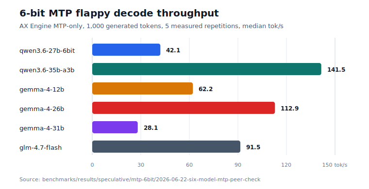

# AX Engine

AX Engine is a Mac-first LLM inference runtime, local server, SDK layer, and benchmark toolkit for Apple Silicon. It runs direct-support MLX model families natively, and routes other MLX text models or non-MLX models through explicit `mlx-lm` and `llama.cpp` compatibility routes.

## Release Highlights

AX Engine is for developers who want a local OpenAI-compatible model server on Apple Silicon without hiding which runtime path is doing the work.

- OpenAI-compatible local text endpoints for common chat and completion flows, with SDKs for Python, TypeScript/JavaScript, Go, Ruby, and Mojo.
- Repo-owned MLX runtime paths for direct-support Gemma and Qwen families, with delegated routes kept explicit.
- MTP benchmarking is scoped to the six 6-bit `download-mtp` targets: Qwen3.6 27B, Qwen3.6 35B-A3B, Gemma 4 12B, Gemma 4 26B, Gemma 4 31B, and GLM 4.7 Flash. MTP+n-gram is no longer part of the MTP benchmark design.
- Dedicated Qwen3-Coder-Next direct-support path for local coding agents, called out separately from Qwen3.6 because it carries its own coding-first architecture.
- Workload-contract benchmark tooling records route identity, artifacts, prompt suite, sampler, cooldowns, accept rate, and dirty-state provenance.

## Table of Contents

- [Release Highlights](#release-highlights)
- [Quick Start](#quick-start)
- [Installation](#installation)
- [Getting a Model](#getting-a-model)
- [Typical Hardware](#typical-hardware)
- [What AX Engine Does](#what-ax-engine-does)
- [Public Claim Boundaries](#public-claim-boundaries)
- [Supported Models](#supported-models)
- [Performance](#performance)
  - [Gemma 4 12B](#gemma-4-12b)
    - [Gemma 4 12B Multimodal](#gemma-4-12b-multimodal)
  - [Speculative Decoding (MTP)](#speculative-decoding-mtp)
    - [GLM-4.7](#glm-47-flash-mtp-validation-session)
  - [Direct Decode · Prefill · TTFT](#direct-decode--prefill--ttft)
    - [DiffusionGemma](#diffusiongemma)
    - [Gemma 4 and Qwen 3.6](#gemma-4-and-qwen-36)
- [SDKs](#sdks)
- [Server Usage](#server-usage)
- [Workspace](#workspace)
- [Development](#development)
- [Benchmark Reference Projects](#benchmark-reference-projects)
- [Limitations](#limitations)
- [Contributing](#contributing)
- [Community](#community)
- [License](#license)

## Quick Start

**Install** (macOS 26 Tahoe or later, Apple Silicon only — see [Typical Hardware](#typical-hardware)):

```bash
python3 -m pip install --upgrade pip               # pip 23+ is required to find the wheel
python3 -m pip install -U "ax-engine[download]<7"  # keep the quotes — zsh treats [ ] as a glob
```

**Download a small model and start the server:**

```bash
MODEL_DIR="$(ax-engine download mlx-community/Qwen3-4B-4bit --json | python3 -c 'import json,sys; print(json.load(sys.stdin)["dest"])')"
ax-engine serve "$MODEL_DIR" --port 8080
```

**High-memory model shortcuts:**

```bash
# Choose one:
ax-engine serve qwen36-35b --download --port 8080
ax-engine serve gemma4-12b --download --port 8080
```

**Call it from any OpenAI client:**

```python
from openai import OpenAI
client = OpenAI(base_url="http://127.0.0.1:8080/v1", api_key="local")
model = client.models.list().data[0].id

resp = client.chat.completions.create(
    model=model,
    messages=[{"role": "user", "content": "What is AGI?"}],
    max_tokens=128,
)
print(resp.choices[0].message.content)
```

**Or use the Python SDK directly:**

```python
from ax_engine import download_model, Session

path = download_model("mlx-community/Qwen3-4B-4bit")
with Session(mlx=True, mlx_model_artifacts_dir=str(path)) as s:
    print(s.generate([1, 2, 3], max_output_tokens=8).output_tokens)
```

> Quick Start requires **macOS 26 (Tahoe) or later** on **Apple Silicon M2 Max or newer** with **32 GB unified memory or more**. Earlier macOS releases are not supported — there is no wheel or binary for them. Larger models such as Qwen3.6 35B-A3B and Gemma 4 12B need the memory tiers listed in [Typical Hardware](#typical-hardware).

## Installation

### Requirements

The published wheel and Homebrew formula are macOS-arm64-only native builds.
Before installing, confirm your machine matches:

- **macOS 26 (Tahoe) or later.** Earlier macOS versions are not supported — there
  is no wheel or formula for them.
- **Apple Silicon (M2 Max or newer), arm64.** Intel Macs are not supported.
- **Python 3.10 or later** for the pip install.
- **pip 23 or later.** Older pip cannot read the wheel's platform tag and will
  report `No matching distribution found`. Always run the upgrade step first.

```bash
# Check before installing — should print a version >= 26 and "arm64":
python3 -c "import platform; print(platform.mac_ver()[0], platform.machine())"
```

### Python wheel

```bash
python3 -m pip install --upgrade pip
python3 -m pip install -U "ax-engine[download]<7"
ax-engine doctor
```

Keep the quotes around the spec — `zsh` otherwise treats `[download]` as a glob.
The wheel bundles the `ax-engine` orchestration CLI plus the `ax-engine-server`
and `ax-engine-bench` binaries, so all three are on your `PATH` after install.
There is no source distribution and no wheel for other platforms; if pip reports
`No matching distribution found`, see [Troubleshooting](#troubleshooting).

Optional extras:

```bash
python3 -m pip install -U "ax-engine[openai]<7"      # FastAPI OpenAI shim
python3 -m pip install -U "ax-engine[multimodal]<7"  # image/audio helpers
```

### Homebrew

Homebrew is the native binary channel for tagged macOS arm64 releases. The
one-liner auto-taps `defai-digital/homebrew-ax-engine`:

```bash
brew install defai-digital/ax-engine/ax-engine
ax-engine doctor
```

`ax-engine-server` and `ax-engine-bench` are installed alongside the CLI. If
`doctor` fails with `Library not loaded: libmlxc.dylib`, the `mlx-c` dependency
is missing or stale — reinstall it:

```bash
brew install mlx-c && brew reinstall defai-digital/ax-engine/ax-engine
```

### Troubleshooting

- **`No matching distribution found for ax-engine`** — your machine is not macOS 26+
  Apple Silicon, or your pip is too old. Run `python3 -m pip install --upgrade pip`,
  then re-check with the [Requirements](#requirements) command above. There is no
  wheel for Intel, Linux, Windows, or macOS earlier than 26.
- **`zsh: no matches found: ax-engine[download]`** — quote the spec:
  `pip install "ax-engine[download]<7"`.
- **An old version installs** — make sure you used `-U`, then confirm the channel
  is current with `python3 -m pip index versions ax-engine` or
  `brew info defai-digital/ax-engine/ax-engine`.
- **Anything still off** — build from [Source](#source), which works on any
  supported macOS and rebuilds the native binaries locally.

### Source

```bash
brew install mlx mlx-c protobuf
python3 -m venv .venv
source .venv/bin/activate
python -m pip install --upgrade pip maturin
cargo build --release -p ax-engine-server -p ax-engine-bench
maturin develop --release
export PATH="$PWD/target/release:$PATH"
ax-engine doctor
```

## Getting a Model

AX Engine requires pre-sanitized MLX weights. The recommended source is [mlx-community](https://huggingface.co/mlx-community) — models there are already converted and validated.

### mlx-community (recommended)

`ax-engine download`, `download_model()`, and `scripts/download_model.py` download weights and auto-generate the required `model-manifest.json` in one step:

```bash
# List supported download targets
ax-engine download --list

# Download by alias
ax-engine download qwen3.5-9b --json
ax-engine download qwen36-35b --json
ax-engine download qwen36-27b --json
ax-engine download gemma4-e2b --json
ax-engine download gemma4-12b --json
ax-engine download gemma4-31b --json

# Download and serve in one command
ax-engine serve qwen36-35b --download --port 8080

# Raw mlx-community repo IDs are also accepted
ax-engine download mlx-community/Qwen3.6-35B-A3B-4bit --json
ax-engine download mlx-community/Qwen3-Coder-Next-6bit --json
ax-engine download mlx-community/gemma-4-e2b-it-4bit --json

# Optional: copy snapshot to an explicit directory
ax-engine download qwen36-35b --dest /Volumes/Models/qwen36-35b

# Python SDK
from ax_engine import download_model
path = download_model("mlx-community/Qwen3.6-35B-A3B-4bit")
```

Built-in download aliases:

| Alias | Repo |
|---|---|
| `qwen36-35b` | `mlx-community/Qwen3.6-35B-A3B-4bit` |
| `qwen36-27b`, `qwen36-27b-6bit` | `mlx-community/Qwen3.6-27B-{4,6}bit` |
| `gemma4-e2b`, `gemma4-e2b-6bit` | `mlx-community/gemma-4-e2b-it-{4,6}bit` |
| `gemma4-12b`, `gemma4-12b-6bit` | `mlx-community/gemma-4-12B-it-{4,6}bit` |
| `gemma4-26b` | `mlx-community/gemma-4-26b-a4b-it-4bit` |
| `gemma4-31b` | `mlx-community/gemma-4-31b-it-4bit` |

Leave downloads in the Hugging Face Hub cache by default — it's shared with `mlx_lm` and other HF-aware tools, avoiding duplicate copies of large weights. Use `--dest` only when you want an explicit copy outside the shared cache.

### 6-bit MTP downloads

`ax-engine download-mtp` is the one-command path for the local-agent 6-bit targets. It downloads the base model and prepares AX MTP artifacts when the model family has a repo-owned MTP packaging path:

```bash
ax-engine download-mtp qwen3.6-27b-6bit
ax-engine download-mtp qwen3.6-35b-a3b
ax-engine download-mtp gemma-4-12b
ax-engine download-mtp gemma-4-26b
ax-engine download-mtp gemma-4-31b
ax-engine download-mtp glm-4.7-flash
```

| Target | 6-bit base | Result |
|---|---|---|
| `qwen3.6-27b-6bit` | `mlx-community/Qwen3.6-27B-6bit` | Qwen fused MTP sidecar from `Qwen/Qwen3.6-27B` |
| `qwen3.6-35b-a3b` | `mlx-community/Qwen3.6-35B-A3B-6bit` | Qwen fused MTP sidecar from `Qwen/Qwen3.6-35B-A3B` |
| `gemma-4-12b` | `mlx-community/gemma-4-12B-it-6bit` | Gemma assistant-MTP package with `mlx-community/gemma-4-12B-it-assistant-6bit` |
| `gemma-4-26b` | `mlx-community/gemma-4-26b-a4b-it-6bit` | Gemma assistant-MTP package with `google/gemma-4-26b-a4b-it-assistant` |
| `gemma-4-31b` | `mlx-community/gemma-4-31b-it-6bit` | Gemma assistant-MTP package with `google/gemma-4-31b-it-assistant` |
| `glm-4.7-flash` | `mlx-community/GLM-4.7-Flash-6bit` | GLM built-in MTP layer extracted from `zai-org/GLM-4.7-Flash` into `glm_mtp.safetensors` |

For Qwen3.6, `download-mtp` wraps the standard download plus `convert-mtplx` provenance flow. For Gemma 4, it downloads the target and assistant and runs the Gemma assistant-MTP packager. For GLM-4.7-Flash, it uses the GLM built-in MTP tensors from the upstream `zai-org/GLM-4.7-Flash` checkpoint because the MLX 6-bit package does not expose the MTP layer tensors directly. Qwen3-Coder-Next remains a direct-decode target; it is not a `download-mtp` target because its MLX base artifact does not ship its own MTP head.

If you already have `mlx_lm` installed, its downloads land in the same cache and AX Engine can auto-discover them:

```bash
python -m mlx_lm.generate --model mlx-community/Qwen3-4B-4bit --prompt "x" --max-tokens 1
ax-engine-bench generate-manifest ~/.cache/huggingface/hub/models--mlx-community--Qwen3-4B-4bit/snapshots/<hash>
ax-engine serve ~/.cache/huggingface/hub/models--mlx-community--Qwen3-4B-4bit/snapshots/<hash> --port 8080
```

### Raw HuggingFace checkpoint

Raw checkpoints need sanitization before AX Engine can load them:

```bash
pip install mlx-lm
mlx_lm.convert --hf-path <org/model> --mlx-path /path/to/dest -q --q-bits 4
ax-engine-bench generate-manifest /path/to/dest
ax-engine serve /path/to/dest --port 8080
```

### Manifest generation

Both paths above require `model-manifest.json`. Download helpers generate it automatically. To run it directly:

```bash
ax-engine-bench generate-manifest /path/to/model      # pip, Homebrew, or built binary
cargo run -p ax-engine-core --bin generate-manifest -- /path/to/model  # source
```

## Typical Hardware

For local agent and chatbot workloads, AX Engine is a better fit for a small model portfolio than for one model serving every workflow. See the [FAQ model-stack guidance](docs/FAQ.md#what-model-stack-should-i-run-on-high-memory-apple-silicon) for the full recommendation.

| Hardware | Recommended memory | Best fit |
|---|---:|---|
| Mac mini M4 Pro | 64 GB RAM | Compact always-on local chatbot and agent server |
| MacBook Pro M5 Max | 128 GB RAM | Portable high-throughput chatbot, agent, and coding stack |
| Mac Studio M3 Ultra | 256 GB RAM | Larger local model portfolio, longer contexts, and heavier parallel workloads |

| Role | Recommended model | Setup | App | Why |
|---|---|---|---|---|
| Default chatbot | Gemma 4 26B-A4B / 31B | 4-bit or 6-bit, 16K-32K | [ax-studio](https://github.com/defai-digital/ax-studio) | General assistant path for reasoning, chat, JSON/function calling, and on-device agent workflows |
| General agentic model | Qwen3.6-35B-A3B / Qwen3.6-27B | 35B A3B 4-bit; 27B 4/6-bit, 16K-32K | AX server / SDK | Strong general agent and coding balance; sparse MoE keeps active compute low |
| Coding specialist | Qwen3-Coder-Next | 6-bit + 16K default; 4-bit + 32K when needed | [ax-code](https://github.com/defai-digital/ax-code) | Dedicated local coding-agent path for repo editing, tool use, and long coding sessions |

## What AX Engine Does

AX Engine gives local inference work a stable runtime contract:

- **Repo-owned MLX execution** tracks [direct-support model families](#supported-models) separately from delegated routes — delegated results are not AX-owned throughput claims.
- **Speculative decoding packages** support Qwen fused MTP sidecars, Gemma 4 assistant drafters, and GLM built-in MTP sidecars in the same repo-owned runtime and benchmark tooling.
- **N-gram acceleration** reaches up to 3.1× mlx_lm decode throughput on high-hit benchmark rows with no second draft model.
- **Long-session prefix reuse** restores physical MLX KV snapshots on validated cache layouts, so long-running chat and agent loops avoid repeatedly pre-filling accumulated context. See [`docs/LONG-CONTEXT.md`](docs/LONG-CONTEXT.md).
- **Workload-contract tooling** (`ax-engine-bench`) validates correctness, determinism, route identity, and regression across checked-in manifests.
- **Delegated routes** (`mlx_lm_delegated`, `llama_cpp`) cover explicit compatibility cases without polluting AX-owned performance claims.

[mlx_lm](https://github.com/ml-explore/mlx-lm) is the canonical MLX reference. AX Engine compares against `mlx_lm.benchmark` and keeps `mlx_lm.server` as the explicit delegated compatibility route when AX does not yet have a repo-owned graph. See the [FAQ](docs/FAQ.md#is-ax-faster-because-it-replaces-mlx-kernels) for the boundary between MLX kernels and AX-owned runtime behavior.

Design details: [Scheduler](docs/SCHEDULER.md) · [KV Cache](docs/KV-CACHE.md) · [Long Context](docs/LONG-CONTEXT.md) · [Benchmark Design](docs/BENCH-DESIGN.md).

### Runtime Paths

| Path | Use it for | Current scope |
|---|---|---|
| Repo-owned MLX runtime | Direct-support MLX model families and repo-owned performance claims backed by benchmark artifacts | Local Apple Silicon inference, token-based server/SDK requests, direct and n-gram acceleration modes |
| `mlx_lm_delegated` | MLX text models that upstream `mlx-lm` supports before AX has a repo-owned graph | Blocking and SSE text generation through a user-provided `mlx_lm.server`; not AX-owned token/KV performance |
| `llama_cpp` | GGUF and non-MLX local inference | Delegated llama.cpp server/CLI compatibility; route-contract evidence, not repo-owned MLX throughput |

The runtime report exposes `selected_backend`, `support_tier`, and `resolution_policy` so callers and benchmark artifacts can distinguish these paths. For the exact OpenAI-shaped endpoint contract see `docs/API-COMPATIBILITY.md`.

## Public Claim Boundaries

AX Engine's public performance claims are scoped to benchmark artifacts that preserve route identity, model artifacts, prompt suite, sampler settings, and repository provenance.

| Area | Public claim | Status |
|---|---|---|
| 6-bit MTP matrix | Current benchmark design covers only `qwen3.6-27b-6bit`, `qwen3.6-35b-a3b`, `gemma-4-12b`, `gemma-4-26b`, `gemma-4-31b`, and `glm-4.7-flash` prepared by `ax-engine download-mtp` | Current design |
| MTP+n-gram | Removed from the MTP benchmark matrix; historical rows are diagnostic only and should not be promoted as current MTP evidence | Out of scope |
| N-gram acceleration | Up to 3.1x `mlx_lm` decode throughput on high-hit benchmark rows without a second draft model | Workload-dependent |

## Supported Models

Direct support means AX has a repo-owned `ax-engine-mlx` graph for the model family and loads MLX safetensors through the AX manifest path. Other MLX text models can still use the explicit `mlx_lm_delegated` compatibility route.

| Family | Direct model IDs | Current scope | Architecture notes |
|---|---|---|---|
| Gemma 4 | `gemma-4-e2b-it`, `gemma-4-e4b-it`, `gemma-4-12b-it`, `gemma-4-26b-a4b-it`, `gemma-4-31b-it` | Repo-owned MLX runtime; MLX affine 4/5/6-bit weights; assistant-MTP benchmark path | Dense unified 12B, per-layer embedding, and MoE variants; sliding-window + full attention, logit softcapping |
| Qwen 3 | `Qwen3-4B-4bit` and manifest-backed dense checkpoints | Repo-owned MLX runtime | SwiGLU dense FFN; per-head QK norm |
| Qwen 3.5 | `Qwen3.5-9B-MLX-4bit` | Repo-owned MLX runtime | GatedDeltaNet linear attention + dense SwiGLU FFN; `attn_output_gate` per-head interleaving |
| Qwen 3.6 | `Qwen3.6-35B-A3B` 4-bit, `Qwen3.6-27B` 4/5/6-bit | Repo-owned MLX runtime; fused sidecar-MTP benchmark path | `qwen3_next`: GatedDelta linear attention, full attention with per-head sigmoid gate, sparse top-k MoE |
| Qwen3-Coder-Next | `Qwen3-Coder-Next-4bit` | Repo-owned MLX runtime; direct coding-agent path | `qwen3_next` coding-specialist checkpoint; hybrid linear/full attention, sparse top-10-of-512 MoE, shared expert, 8-bit router/shared-expert gates |
| GLM 4.7 Flash | `glm4_moe_lite` / `glm4.7-flash-4bit` | Repo-owned MLX runtime; MLX affine 4-bit weights | Flash MLA attention, sigmoid-routed MoE with dense+MoE layer split, shared expert; post-attention RMS norm |

Adding a new architecture means implementing the model graph in `ax-engine-mlx`, not wiring up a generic loader. Architecture code alone is not a direct-support claim — a model requires a repo-owned graph, manifest, smoke coverage, and benchmark evidence before promotion here. LLaMA, Mistral, Mixtral, DeepSeek, and unlisted Gemma/Qwen variants should use the explicit delegated route.

Before promoting another architecture or checkpoint, run `scripts/probe_mlx_model_support.py --model-dir <model-dir>`; a model should report `repo_owned_runtime_ready` only when its manifest, local reference files, and runtime path are all present.

Full list: [`docs/SUPPORTED-MODELS.md`](docs/SUPPORTED-MODELS.md).

## Performance

Full result tables and interpretation live in [`docs/PERFORMANCE.md`](docs/PERFORMANCE.md). Benchmark methodology, test setup, and reproduction details live in [`docs/BENCHMARKS.md`](docs/BENCHMARKS.md).
### Gemma 4 12B

Gemma 4 12B (`model_type: gemma4_unified`) is reported separately from the per-layer-embedding E2B/E4B and MoE 26B/31B checkpoints because it has a distinct graph, multimodal tensor contract, and benchmark boundary. **Upstream `mlx_lm` 0.31.3 cannot load it** (`ValueError: Model type gemma4_unified not supported`), so the direct peer here is **llama.cpp Metal** on a shape-compatible GGUF.

> [!NOTE]
> **AX Engine's repo-owned native MLX route supports Gemma 4 12B text plus inline base64 image/audio/video chat.** Delegated compatibility routes remain text-first; `/v1/generate` accepts the processed `multimodal_inputs.gemma4_unified` tensor contract.

**At a glance:**

- **Direct decode:** AX native MLX reaches **61.7-66.0 tok/s** on the bit-comparable 4-bit-FFN artifact versus llama.cpp Metal's **56.9-59.2 tok/s** depth-matched range.
- **Context depth:** AX's direct margin is **+11% / +11% / +8%** versus llama.cpp matched-depth decode at 128 / 512 / 2,048 prompt tokens.
- **Assistant-MTP:** depth-2 assistant-MTP reaches **82.9-96.8 tok/s** on code-like prompt suites, a **2.34-2.73x** same-artifact speedup over AX direct decode.
- **Why the earlier result flipped:** the upstream MLX snapshot keeps FFN weights at 8-bit, so it reads about **1.65x** the bytes of the re-quantized 4-bit-FFN artifact. Decode is bandwidth-bound; matching quantization closes the gap.

**Direct Decode**

AX direct rows use the 4-bit-FFN MLX artifact and random-token prompts. `mlx_lm` is absent because it has no `gemma4_unified` graph. The llama.cpp rows are shape-compatible external GGUF references, not prompt-hash-parity MLX rows.

<table>
<tr>
<td></td>
<td></td>
<td></td>
</tr>
</table>

| Prompt tokens | AX decode | llama.cpp decode (depth 0) | llama.cpp decode (matched depth) | AX prefill | llama.cpp prefill | AX TTFT (ms) | llama.cpp TTFT (ms) |
|---:|---:|---:|---:|---:|---:|---:|---:|
| 128 | 66.0 | 59.8 | 59.2 | 1,171 | 1,252 | 109 | 102 |
| 512 | 65.6 | 59.6 | 58.9 | 1,839 | 1,745 | 278 | 293 |
| 2048 | 61.7 | 59.7 | 56.9 | 2,004 | 1,690 | 1,022 | 1,212 |

Read the two llama.cpp decode columns carefully:

- `depth 0` is plain `llama-bench tg`, decoding from an empty context and representing llama.cpp's best case.
- `matched depth` uses `-d {prompt} -n 128`, so decode happens after the same prompt depth AX has already prefetched.
- AX wins the matched-depth comparison at every prompt size, and prefill also leads at 512 and 2,048 tokens.

The table uses the bit-comparable **4-bit-FFN** AX artifact (`scripts/requantize_gemma4_12b_ffn_4bit.py`), about 4.5 bpw versus the Q4_K_M GGUF's about 4.8 bpw. The upstream `mlx-community/gemma-4-12B-it-4bit` snapshot keeps the FFN at **8-bit** (~10.98 GB) and trails llama.cpp at about 46 tok/s. That is a bytes-read handicap, not an AX runtime result.

**Memory bandwidth share:**

Decode is memory-bandwidth-bound on Apple Silicon: each token reads the model weights once, so decode tok/s is set by bytes-read and how close the engine gets to the memory ceiling. Measured M5 Max GPU peak read bandwidth ≈ 577 GB/s (MLX reduction over a 6 GB array).


| Engine / quantization | Weights/token | Decode tok/s | Effective BW | % of 577 GB/s peak |
|---|---:|---:|---:|---:|
| AX — 8-bit FFN (upstream 4bit snapshot) | 10.98 GB | 45.0 | 494 GB/s | 86% |
| AX — 4-bit FFN (re-quantized) | 6.74 GB | 64.4 | 434 GB/s | 75% |
| llama.cpp Q4_K_M — decode @ depth 512 | 7.38 GB | 58.9 | 435 GB/s | 75% |
| llama.cpp Q4_K_M — decode @ depth 0 (`tg`) | 7.38 GB | 59.8 | 441 GB/s | 76% |

The bandwidth view is the key explanation: AX is not under-utilizing memory. The re-quantized AX row sustains **434 GB/s**, in the same band as llama.cpp's **435 GB/s** at matched depth. The remaining direct-decode difference is bytes read per token: uniform 4-bit group-64 reduces AX to **6.74 GB/token**, while Q4_K_M reads **7.38 GB/token**. The 8-bit-FFN upstream snapshot has higher bus utilization (86%) but worse speed because it reads far more data.

**Assistant-MTP speculative decode (depth 2):**

The assistant-MTP path runs on the assistant bundle and adds a second
speculative lever that neither `mlx_lm` nor llama.cpp has for this model. The
historical 4-bit rows below are retained as background only; the current MTP
benchmark design uses the 6-bit `download-mtp` package and does not run
MTP+n-gram.

| Suite | Depth | AX direct tok/s | AX MTP tok/s | AX MTP accept |
|---|---:|---:|---:|---:|
| flappy | 2 | 35.5 | 96.8 | 98.7% |
| long_code | 2 | 35.8 | 92.3 | 99.1% |
| python_modules_long | 2 | 35.4 | 82.9 | 97.5% |

No runnable peer benchmark covers **Gemma 4 12B assistant-MTP** in this matrix: `mlx_lm` cannot load `gemma4_unified`, llama.cpp does not expose a Gemma assistant-MTP path, and available MTP peer tools target different sidecar contracts. The AX direct column is retained as a same-prompt baseline from the MTP harness prompts, artifact, and sampler. It is a same-artifact AX improvement view, not a peer-engine MTP comparison.

**MTP prefill and TTFT — same run:**

| Suite | AX MTP prefill | AX MTP ttft ms |
|---|---:|---:|
| flappy | 1,928 | 187 |
| long_code | 2,040 | 390 |
| python_modules_long | 1,831 | 195 |

**Methodology and artifacts:**

Direct rows use the 4-bit-FFN artifact, greedy-equivalent sampler, 128 generated tokens, 5 repetitions, 15 s cooldown, and random-token prompts following the `mlx_lm.benchmark` contract. llama.cpp decode is shown both at depth 0 (`tg`) and at matched context depth (`-d {prompt}`). MTP rows use the same 4-bit-FFN assistant-MTP artifact, depth-2 draft, temperature=0.6, top_p=0.95, top_k=20, 1,000 generated tokens, 5 repetitions, 30 s cooldown, and 10 s inter-case cooldown. Host/runtime for the latest direct llama.cpp peer rerun: Apple M5 Max · llama.cpp b9700 / ggml 0.15.2 (Metal, flash-attn) · `mlx_lm` 0.31.3 has no `gemma4_unified` support.

Full artifacts: [`2026-06-20-gemma-4-12b-it-4bit-direct`](benchmarks/results/mlx-inference/2026-06-20-gemma-4-12b-it-4bit-direct/gemma-4-12b-it-4bit.json) (AX direct rerun; chart artifact with retained llama.cpp reference rows in [`gemma-4-12b-it-4bit-with-llama-reference.json`](benchmarks/results/mlx-inference/2026-06-20-gemma-4-12b-it-4bit-direct/gemma-4-12b-it-4bit-with-llama-reference.json); llama.cpp GGUF provenance in [`llama_cpp_gguf_provenance.json`](benchmarks/results/mlx-inference/2026-06-09-gemma-4-12b-it-4bit-direct/llama_cpp_gguf_provenance.json)) · [`2026-06-20-gemma4-assistant-mtp-ax-mtp-only`](benchmarks/results/gemma4-assistant-mtp/2026-06-20-gemma4-assistant-mtp-ax-mtp-only/summary.json) (AX-only assistant-MTP refresh).

#### Gemma 4 12B Multimodal

Gemma 4 12B multimodal timing is reported separately from the text benchmark above because media inputs expand into validated Gemma4 unified soft-token spans before the MLX graph runs. The publication-grade timing artifact covers all **17 AX Engine image/audio/video cases** through both the native `/v1/generate/stream` prefill path and the OpenAI-compatible `/v1/chat/completions` path. The llama.cpp Metal peer rows are cold OpenAI chat endpoint rows for the supported image/audio cases, with prompt cache, slot prompt reuse, and context checkpoints disabled and raw llama.cpp timing/cache metadata recorded.

<table>
<tr>
<td></td>
<td></td>
<td></td>
</tr>
</table>

| Coverage | AX cases measured | Expanded input | Median runner prefill TTFT | Median prefill | Median AX chat E2E | llama.cpp peer endpoint |
|---|---:|---:|---:|---:|---:|---|
| Image | 5 | 275-535 tokens | 189.4-316.2 ms | 1,447.8-1,692.1 tok/s | 1,440.8-1,704.8 ms | 5 measured, 401.6-518.7 ms cold chat endpoint |
| Audio | 4 | 32-771 tokens | 75.8-419.4 ms | 422.1-1,838.4 tok/s | 1,466.5-1,819.2 ms | 3 measured, 338.0-464.5 ms cold chat endpoint; 1 skipped: llama.cpp audio cap unstable |
| Video | 4 | 92-2,355 tokens | 106.1-2,973.5 ms | 792.0-1,681.0 tok/s | 1,500.2-4,441.7 ms | 4 skipped: llama.cpp video path unsupported |
| Combined | 4 | 181-442 tokens | 133.2-256.7 ms | 1,359.1-1,721.6 tok/s | 1,532.4-1,771.6 ms | 1 measured, 507.9 ms cold chat endpoint; 3 skipped: video unsupported |

Rows use `/v1/generate/stream` with processed `multimodal_inputs.gemma4_unified` for runner-time prefill and `/v1/chat/completions` with inline media for client-wall E2E latency. This run used `max_output_tokens=8`, 1 warmup, 3 measured repetitions, `--max-batch-tokens 4096`, a release server binary, 128 GB unified memory, and a clean tracked worktree at `67ce2675a469cf5eecba687f348c649e663011b8`.

The llama.cpp peer rows use reference llama.cpp `19bba67c1` with Metal, `gemma-4-12B-it-Q4_K_M.gguf`, and `mmproj-gemma-4-12B-it-Q8_0.gguf`. They are OpenAI chat endpoint-latency rows for supported image/audio inputs, not native prefill rows and not a throughput comparison. The fair-peer launch contract is `--cache-ram 0 --no-cache-idle-slots --slot-prompt-similarity 0 --ctx-checkpoints 0` plus `--llama-cache-policy prompt_cache_disabled`; the artifact records raw llama.cpp `timings`, `prompt_tokens_details.cached_tokens`, server prompt token counts, and cache counts. Published peer rows require zero reported cached prompt tokens and server prompt-eval token counts at least as large as the cold request's reported prompt tokens. Video-containing peer rows are explicit skips because the local llama.cpp Gemma 4 path does not expose a like-for-like video contract, and `audio_cap` is skipped because this llama.cpp Gemma 4 audio path fails the warmup-plus-three-repetition contract on the largest audio fixture. The peer chart excludes one measured image case whose AX and llama.cpp output token counts differ, so chart bars compare matched-output rows only. For this Gemma 4 llama.cpp build, most peer text appears in `reasoning_content` rather than `message.content`, so the benchmark validates positive `response_chars`.

Full artifact: [`2026-06-09-gemma4-12b-multimodal-cold-peer-matrix`](benchmarks/results/gemma4-multimodal/2026-06-09-gemma4-12b-multimodal-cold-peer-matrix.json). Render charts with:

```bash
python3 scripts/render_gemma4_multimodal_charts.py \
  --artifact benchmarks/results/gemma4-multimodal/2026-06-09-gemma4-12b-multimodal-cold-peer-matrix.json \
  --assets-dir docs/assets
```

To reproduce the supported-case image/audio/video timing matrix from a Gemma 4 12B AX Engine server, use the matrix runner and validate the resulting artifact before publishing charts:

```bash
python3 scripts/bench_gemma4_multimodal.py \
  --url http://127.0.0.1:18080 \
  --model gemma-4-12B-it \
  --model-dir /path/to/gemma-4-12B-it-4bit \
  --cases all \
  --layers native_runtime_prefill,openai_chat_e2e \
  --warmup 1 \
  --repetitions 3 \
  --cooldown 1 \
  --max-output-tokens 8 \
  --server-command "target/release/ax-engine-server --model-id gemma-4-12B-it --mlx --mlx-model-artifacts-dir /path/to/gemma-4-12B-it-4bit --max-batch-tokens 4096 --port 18080" \
  --llama-url http://127.0.0.1:<peer-port> \
  --llama-binary /path/to/llama-server \
  --llama-gguf <path-to-gemma-4-12B-it-Q4_K_M.gguf> \
  --llama-mmproj <path-to-mmproj-gemma-4-12B-it-Q8_0.gguf> \
  --llama-cache-policy prompt_cache_disabled \
  --output benchmarks/results/gemma4-multimodal/gemma4-12b-multimodal-cold-peer-matrix.json

python3 scripts/check_gemma4_multimodal_benchmark_artifact.py \
  benchmarks/results/gemma4-multimodal/gemma4-12b-multimodal-cold-peer-matrix.json \
  --min-repetitions 3 \
  --require-modalities image,audio,video \
  --require-build-provenance \
  --readme-ready
```

For a fair llama.cpp peer rerun, launch `llama-server` with prompt cache, slot prompt reuse, and context checkpoints disabled for the peer server, for example `--cache-ram 0 --no-cache-idle-slots --slot-prompt-similarity 0 --ctx-checkpoints 0`, then validate with `--readme-ready`. Peer rows with unknown cache policy, reported cached prompt tokens, or server prompt-eval token counts that are too low for a cold prompt are rejected by the artifact checker. Without a matching Gemma 4 12B GGUF and multimodal projector, peer rows are explicit skips. Video rows remain explicit skips until the peer server exposes a like-for-like video path for Gemma 4 12B.

<details>
<summary>Prepare Gemma 4 12B assistant-MTP artifacts</summary>

Gemma 4 12B MLX target and assistant repos are already converted to MLX safetensors — they do not go through `ax-engine convert-mtplx` or `scripts/prepare_mtp_sidecar.py`. Download the target and matching assistant, then package them with the Gemma-specific helper:

```bash
hf download mlx-community/gemma-4-12B-it-4bit
hf download mlx-community/gemma-4-12B-it-assistant-4bit
python3 scripts/prepare_gemma4_assistant_mtp.py \
  --target mlx-community/gemma-4-12B-it-4bit \
  --assistant mlx-community/gemma-4-12B-it-assistant-4bit

hf download mlx-community/gemma-4-12B-it-6bit
hf download mlx-community/gemma-4-12B-it-assistant-6bit
python3 scripts/prepare_gemma4_assistant_mtp.py \
  --target mlx-community/gemma-4-12B-it-6bit \
  --assistant mlx-community/gemma-4-12B-it-assistant-6bit
```

The default outputs are quant-specific synthetic HF cache snapshots: `models--ax-local--gemma-4-12b-it-4bit-assistant-mtp/snapshots/v1/` and `models--ax-local--gemma-4-12b-it-6bit-assistant-mtp/snapshots/v1/`. Each package contains the target files, an `assistant/` subtree, and `ax_gemma4_assistant_mtp.json`. Generate or validate the AX manifest before serving:

```bash
ax-engine-bench generate-manifest \
  ~/.cache/huggingface/hub/models--ax-local--gemma-4-12b-it-4bit-assistant-mtp/snapshots/v1 \
  --validate
ax-engine-bench generate-manifest \
  ~/.cache/huggingface/hub/models--ax-local--gemma-4-12b-it-6bit-assistant-mtp/snapshots/v1 \
  --validate
```
</details>


### Speculative Decoding (MTP)

AX Engine supports three MTP packaging contracts in the repo-owned runtime: Qwen
fused sidecars, Gemma assistant drafters, and GLM built-in MTP sidecars. The
current benchmark design is intentionally narrower than the historical MTP
artifact set: benchmark only the six 6-bit `download-mtp` targets, and
benchmark them in MTP mode only.

| Target | Preparation command | Benchmark mode |
|---|---|---|
| `qwen3.6-27b-6bit` | `ax-engine download-mtp qwen3.6-27b-6bit` | Qwen fused sidecar MTP |
| `qwen3.6-35b-a3b` | `ax-engine download-mtp qwen3.6-35b-a3b` | Qwen fused sidecar MTP |
| `gemma-4-12b` | `ax-engine download-mtp gemma-4-12b` | Gemma assistant-MTP |
| `gemma-4-26b` | `ax-engine download-mtp gemma-4-26b` | Gemma assistant-MTP |
| `gemma-4-31b` | `ax-engine download-mtp gemma-4-31b` | Gemma assistant-MTP |
| `glm-4.7-flash` | `ax-engine download-mtp glm-4.7-flash` | GLM built-in MTP sidecar |

Rules for current MTP benchmark artifacts:

- Use 6-bit model packages only.
- Use the prepared path returned by `ax-engine download-mtp`.
- Run and report `mtp` only. Do not run or promote `mtp-ngram` rows.
- Do not include Qwen3-Coder-Next, 4-bit, 5-bit, 8-bit, FFN-only, or GGUF
  variants in the MTP matrix.
- Direct rows may be kept as local same-artifact diagnostics, but they are not
  headline MTP rows.

The benchmark prompt suites remain `flappy`, `long_code`, and
`python_modules_long`, with sampled decode (`temperature=0.6`, `top_p=0.95`,
`top_k=20`), `1000` generated tokens, `5` measured repetitions, and recorded
cooldown. Artifacts should live under `benchmarks/results/mtp-6bit/` and record
the exact model snapshot, MTP package provenance, route identity, accept rate,
prefill throughput, decode throughput, TTFT, sampler, prompt suite, repetitions,
and cooldown.

Historical 4-bit Qwen3.6/MTPLX and Gemma MTP+n-gram artifacts remain useful for
debugging regressions, but they are no longer the README/PERFORMANCE benchmark
design and should not be promoted as current MTP evidence.

#### 6-bit flappy MTP refresh (2026-06-22)

This refresh covers the `flappy` prompt suite only. It is an interim current-MTP
table for the six 6-bit `download-mtp` targets, not the full three-suite
publication matrix.



| Target | AX MTP mode | Depth | AX decode median | AX prefill median | AX TTFT median | AX accept | MTPLX | lightning-mlx | Artifact |
|---|---|---:|---:|---:|---:|---:|---|---|---|
| `qwen3.6-27b-6bit` | Qwen fused sidecar | 3 | 42.1 tok/s | 632.7 tok/s | 508 ms | 99.5% | N/A | N/A | [`JSON`](benchmarks/results/mtp-6bit/2026-06-22-six-model-mtp-peer-check/qwen3.6-27b-6bit/flappy/ax_engine.json) |
| `qwen3.6-35b-a3b` | Qwen fused sidecar | 1 | 141.5 tok/s | 1,561.8 tok/s | 212 ms | 99.8% | N/A | N/A | [`JSON`](benchmarks/results/mtp-6bit/2026-06-22-six-model-mtp-peer-check/qwen3.6-35b-a3b/flappy/ax_engine.json) |
| `gemma-4-12b` | Gemma assistant-MTP | 2 | 62.2 tok/s | 1,701.7 tok/s | 214 ms | 99.3% | N/A | N/A | [`JSON`](benchmarks/results/mtp-6bit/2026-06-22-six-model-mtp-peer-check/gemma-4-12b/flappy/ax_engine.json) |
| `gemma-4-26b` | Gemma assistant-MTP | 1 | 112.9 tok/s | 2,395.0 tok/s | 148 ms | 99.8% | N/A | N/A | [`JSON`](benchmarks/results/mtp-6bit/2026-06-22-six-model-mtp-peer-check/gemma-4-26b/flappy/ax_engine.json) |
| `gemma-4-31b` | Gemma assistant-MTP | 1 | 28.1 tok/s | 701.9 tok/s | 516 ms | 99.6% | N/A | N/A | [`JSON`](benchmarks/results/mtp-6bit/2026-06-22-six-model-mtp-peer-check/gemma-4-31b/flappy/ax_engine.json) |
| `glm-4.7-flash` | GLM built-in sidecar | 1 | 91.5 tok/s | 1,694.5 tok/s | 163 ms | 98.2% | N/A | N/A | [`JSON`](benchmarks/results/mtp-6bit/2026-06-22-six-model-mtp-peer-check/glm-4.7-flash/flappy/ax_engine.json) |

Peer rows are `N/A` when the peer runner does not support the prepared package
or is outside the promoted matrix. MTPLX 0.3.7 rejects the 6-bit
`qwen-dense` runtime contract and has no Gemma assistant-MTP or GLM built-in
sidecar runner for these packages. Lightning-MLX rows are kept diagnostic-only
by the current benchmark policy and are not promoted here.

Pure-MTP verification: all listed AX artifacts record zero n-gram accepted,
submitted, or proposed tokens. Summary artifact:
[`summary.md`](benchmarks/results/mtp-6bit/2026-06-22-six-model-mtp-peer-check/summary.md).

#### GLM-4.7 Flash MTP validation session

GLM-4.7 Flash uses the built-in MTP tensors from `zai-org/GLM-4.7-Flash`.
`ax-engine download-mtp glm-4.7-flash` downloads the 6-bit MLX base
(`mlx-community/GLM-4.7-Flash-6bit`), extracts the built-in MTP layer into
`glm_mtp.safetensors`, and writes a self-contained AX package.

The first local validation session used the prepared package returned by
`download-mtp` and the `flappy` real-prompt suite. This is a smoke session, not
the promoted 5-repetition MTP matrix row: it used 32 generated tokens, 1 measured
repetition, no cooldown, sampled decode (`temperature=0.6`, `top_p=0.95`,
`top_k=20`), MTP depth 1, and no MTP+n-gram stacking. The direct baseline uses
the same package and prompt suite with MTP disabled.

| Mode | Route | Decode median | Prefill median | TTFT median | MTP evidence |
|---|---|---:|---:|---:|---|
| Direct baseline | `direct_single_decode_baseline` | 58.7 tok/s | 1,670 tok/s | 166 ms | no drafts |
| GLM built-in MTP | `mtp_head_only_verify_loop` | 90.3 tok/s | 1,690 tok/s | 163 ms | 54 drafted, 46 accepted, 85.2% accept |

In this smoke session, GLM built-in MTP was **1.54x** faster than direct decode
on median decode throughput. Treat this as path validation and a same-artifact
diagnostic comparison until the full 6-bit MTP matrix is rerun with 1,000
generated tokens, 5 measured repetitions, and recorded cooldown.

Artifacts: [`flappy-after-activation-fix.json`](benchmarks/results/mtp-6bit/2026-06-22-glm47-flash-mtp-smoke/flappy-after-activation-fix.json)
(MTP) and [`flappy-direct-baseline.json`](benchmarks/results/mtp-6bit/2026-06-22-glm47-flash-mtp-smoke/flappy-direct-baseline.json)
(direct baseline).

### Direct Decode · Prefill · TTFT

#### DiffusionGemma

DiffusionGemma is a block-diffusion Gemma4 26B checkpoint, not an ordinary autoregressive decoder. AX runs it with a native MLX graph, but the measurement boundary is different from the direct-decode families below: the first visible output comes from a **committed 256-token diffusion block**, not from a single next-token step.

Because of that generation shape, the rows below intentionally do **not** use the
plain `decode tok/s` or `TTFT` labels used for autoregressive models. In Qwen,
Gemma 4 text, and other next-token decoders, `TTFT` means prompt prefill plus the
first single-token decode step, and `decode tok/s` means the steady
token-by-token autoregressive loop. DiffusionGemma instead runs a bidirectional
denoise pass over a 256-token canvas, then performs a causal commit for that
block. The comparable boundary inside this runtime is therefore **time to first
block** and **first-block decode**. Treating these as ordinary TTFT/decode rows
would make the result look directly comparable to autoregressive throughput even
though the work per visible output boundary is different.

The charts keep the same 128 / 512 / 2,048 prompt-token layout as the autoregressive sections for readability, but the values are AX first-block telemetry. Peer bars are intentionally omitted rather than shown as zero: current llama.cpp Metal cannot load the GGUF (`unknown model architecture: 'diffusion-gemma'`), and `mlx_lm` 0.31.3 cannot load the MLX snapshot (`Model type diffusion_gemma not supported.`).

<table>
<tr>
<td></td>
<td></td>
<td></td>
</tr>
</table>

| Prompt tokens | AX first-block decode | Denoise steps | Committed block |
|---:|---:|---:|---:|
| 128 | 30.7 tok/s | 48 | 256 tokens |
| 512 | 58.9 tok/s | 25 | 256 tokens |
| 2048 | 32.1 tok/s | 48 | 256 tokens |

**Prefill and first-block latency:**

| Prompt tokens | AX direct prefill | AX time to first block | llama.cpp Metal 9650 | `mlx_lm` 0.31.3 |
|---:|---:|---:|---|---|
| 128 | 1,351.8 tok/s | 8,428 ms | load blocked | load blocked |
| 512 | 3,002.1 tok/s | 4,518 ms | load blocked | load blocked |
| 2048 | 4,031.4 tok/s | 8,475 ms | load blocked | load blocked |

`time to first block` is prefill wall time plus the first 256-token denoise-and-commit block. `first-block decode` is computed as `256 / ax_mlx_diffusion_block_wall_us`. Use these rows to track AX's DiffusionGemma path; do not compare them directly with ordinary autoregressive TTFT or fixed-token decode throughput.

| Runtime path | Model artifact | Benchmark status |
|---|---|---|
| AX direct MLX | `mlx-community/diffusiongemma-26B-A4B-it-4bit` | Measured: 1 warmup + 5 measured repetitions, 15 s cooldown, medians reported |
| llama.cpp Metal 9650 | 4-bit GGUF | Blocked at load: `unknown model architecture: 'diffusion-gemma'` |
| `mlx_lm` 0.31.3 | 4-bit MLX snapshot | Blocked at load: `Model type diffusion_gemma not supported.` |

**Memory bandwidth share:**

The bandwidth chart is an implementation-efficiency view, not a peer comparison. It estimates first-block traffic at block granularity from the measured denoise-step count plus one causal commit over the 16.54 GB MLX safetensors artifact. This rerun used **48 / 25 / 48** denoise steps at 128 / 512 / 2,048 prompt tokens, so the estimated traffic is much larger than a one-step early-exit block. The chart shows estimated bandwidth used versus the M5 Max theoretical ceiling; the table keeps the effective GB/s values.


| Prompt tokens | Estimated effective bandwidth | % of 614.4 GB/s M5 Max theoretical bandwidth |
|---:|---:|---:|
| 128 | 97.3 GB/s | 15.8% |
| 512 | 98.9 GB/s | 16.1% |
| 2,048 | 101.8 GB/s | 16.6% |

At these prompt lengths, the first-block path uses roughly 16% of theoretical M5 Max bandwidth. The current bottleneck is therefore not raw memory bandwidth alone; the next optimization target is denoise graph reuse, dispatch overhead, and convergence behavior under stricter quality gates.

**Denoise loop optimization — GPU-native sampling:**

`crates/ax-engine-mlx/src/diffusion.rs` keeps denoise state, entropy-bound acceptance, and self-conditioning on the GPU. Convergence checks materialize only scalar counters and run every `convergence_check_interval` steps (default 4), reducing per-block GPU/CPU syncs from 48 to about 12. The CPU no longer round-trips 256 token positions on every denoise step; sampling and acceptance stay in lazy MLX graph nodes that can fuse with the forward evaluation.

**Adaptive convergence detection:**

The denoise loop can stop early when any configured convergence signal fires:

1. **Strict stability:** argmax is unchanged for `convergence_steps` consecutive checks and mean entropy is below `entropy_threshold` (default 0.005).

2. **Low update rate:** the accepted-position update rate drops below `acceptance_rate_threshold` (default 1%), so another denoise pass is unlikely to change the block materially.

3. **Entropy plateau:** mean entropy stops decreasing materially after the early denoise phase, indicating diminishing returns from additional passes.

The benchmark rows above report the measured adaptive-convergence run as recorded in the artifact. This rerun did **not** converge after one denoise step: it used 48 / 25 / 48 denoise steps at 128 / 512 / 2,048 prompt tokens. Time to first block therefore tracks the full measured denoise work for the 128- and 2,048-token rows and a mid-run early exit for the 512-token row.

**Denoise performance optimizations (enabled by default):**

The following optimizations are enabled by default for DiffusionGemma to maximize memory bandwidth utilization and reduce per-step overhead. Each can be individually disabled via opt-out environment variables.

| Optimization | What it does | Opt-out |
|---|---|---|
| KV concat buffer | Pre-allocates per-layer KV concatenation buffers on the first denoise step and updates only the canvas slice on subsequent steps via `slice_update`, avoiding re-copying the cached prompt prefix. Also caches the bidirectional attention mask per layer. | `AX_DIFFUSION_NO_KV_CONCAT_BUFFER=1` |
| Embedding cache | Caches per-layer embedding inputs across denoise steps when token IDs are unchanged, using a GPU-side sum fingerprint to detect changes. | `AX_DIFFUSION_NO_EMBEDDING_CACHE=1` |
| Compiled forward | Compiles the bidirectional denoise forward pass into an `MlxClosure` per block (when self-conditioning is off), collapsing ~250 per-step MLX C-API calls into one dispatched graph. | `AX_DIFFUSION_NO_COMPILED_FORWARD=1` |
| Commit skip on converge | Skips the causal commit forward pass (~40 ms) when the denoise loop converges with near-perfect acceptance (≥ 99%). | `AX_DIFFUSION_NO_SKIP_COMMIT=1` |

**Experimental opt-in optimizations:**

| Environment variable | What it does | Status |
|---|---|---|
| `AX_DIFFUSION_FULL_PIPELINE=1` | Compiles the entire denoise step (forward + softmax + entropy + argmax + sampling + acceptance) into a single `MlxClosure`. Supersedes the forward-only compiled closure when both are set. | Experimental / benchmarking |

Example usage for a single benchmark run with all optimizations:

```bash
python3 scripts/bench_diffusion_gemma_direct.py --bench-bin target/release/ax-engine-bench
```

These flags are read once per process. The default-on optimizations have been validated for token equivalence against the imperative path.

Artifacts: AX direct rows are [`2026-06-20-direct-first-block-rerun/summary.json`](benchmarks/results/diffusion-gemma-direct/2026-06-20-direct-first-block-rerun/summary.json), with the human summary in [`summary.md`](benchmarks/results/diffusion-gemma-direct/2026-06-20-direct-first-block-rerun/summary.md). Peer runtime blockers are recorded as load failures, so there are no llama.cpp or `mlx_lm` result artifacts for this model family.

Render charts with:

```bash
python3 scripts/bench_diffusion_gemma_direct.py --skip-benchmark
```

**Decode acceleration model — no MTP:**

DiffusionGemma's acceleration model is the diffusion block itself. It does not stack with MTP or n-gram acceleration because those techniques assume an autoregressive next-token loop:

| | MTP (speculative decoding) | DiffusionGemma (block diffusion) |
|---|---|---|
| Generation | Draft-then-verify, one token at a time | 256-token blocks via bidirectional denoising |
| Forward pass | Causal only | Bidirectional (denoise) + causal (commit) |
| Needs draft model / assistant head | Yes | No |
| AX Engine decode path | `ngram_acceleration` / `mtp_head_only` | `diffusion` (early return, mutually exclusive) |

In the runner's `decode_one`, the diffusion path returns before the MTP/n-gram branches are reached. `DiffusionConfig` carries canvas size, denoise steps, entropy thresholds, convergence settings, and temperature schedule only; it has no MTP fields.

**Supported features:**

- Block-autoregressive discrete diffusion decode (canvas=256, up to 48 denoise steps)
- Entropy-bound position acceptance with argmax-based rejection
- Self-conditioning via GPU matmul (prob × cached embedding table)
- Linear temperature schedule (configurable start/end)
- Adaptive convergence detection (stable argmax, mean entropy, low update rate, and entropy plateau)
- Standard causal prefill (same Gemma4 encoder, 4,073.3 tok/s median at the 2,048-token row)
- Causal commit pass (writes KV cache for subsequent blocks)
- SSE telemetry counters for diffusion block timing, denoise steps, convergence signals, and near-miss entropy/update-rate diagnostics (`ax_mlx_diffusion_*`)
- `diffusion` decode-route classification in benchmark harness

**Not applicable:**

- MTP / assistant-head speculative decoding (architecturally incompatible)
- N-gram acceleration (diffusion replaces the autoregressive decode loop)
- Direct pipeline double-buffering (not autoregressive)

**Benchmark contract:**

The published rows use first-block telemetry instead of the standard fixed-token autoregressive benchmark contract. `max_output_tokens=1` is enough to force prefill plus one diffusion block, and the block counters still report the full 256-token denoise/commit cycle even though the caller receives only the first emitted token.

Telemetry: SSE-emitted `ax_mlx_diffusion_*` counters cover block count, denoise steps, convergence count, per-criterion convergence signals, near-miss entropy/update-rate diagnostics, denoise wall time, commit wall time, and block wall time, plus `diffusion` decode-route classification in `bench_mlx_inference_stack.py`.

Run the full direct benchmark and regenerate the charts:

```bash
cargo build -p ax-engine-bench --bin ax-engine-bench
python3 scripts/bench_diffusion_gemma_direct.py
```

<!-- readme-performance-artifacts: reference=benchmarks/results/mlx-inference/2026-05-26-direct-mode-clean-refresh/; ax-overlay=benchmarks/results/mlx-inference/2026-06-22-ax-direct-readme-direct-only/ -->

#### Gemma 4 and Qwen 3.6

The family tables below compare **direct (non-speculative) decode** across llama.cpp Metal, mlx_lm, and ax engine, covering Gemma 4 and Qwen 3.6 at 128/512/2048 prompt tokens. `ax direct baseline` disables n-gram acceleration, MTP, and assistant drafting to measure the repo-owned direct decode path. Bench prompts are `mlx_lm.benchmark` seed-0 random tokens, which keeps prompt-hash parity across MLX rows.

The prefill and TTFT advantage is the practical direct-mode story. AX is ahead of `mlx_lm` in every listed prefill and TTFT cell below, while decode gains are smaller and model-dependent. That means the repo-owned MLX route is especially valuable for interactive requests where prompt ingestion dominates perceived latency: AX keeps prompt prefill, first-token timing, model-specific graph paths, and route metadata in one measured runtime path. These are cold-prefix rows, not prompt-cache, continuous-batching, or speculative-decoding claims.

<table>
<tr>
<td></td>
<td align="center"><strong>Gemma 4</strong></td>
<td align="center"><strong>Qwen 3.6</strong></td>
</tr>
<tr>
<td align="center"><strong>Decode rate</strong></td>
<td></td>
<td></td>
</tr>
<tr>
<td align="center"><strong>Prefill rate</strong></td>
<td></td>
<td></td>
</tr>
<tr>
<td align="center"><strong>TTFT</strong></td>
<td></td>
<td></td>
</tr>
</table>

> **`llama.cpp Metal*` column** — Shape-compatible reference produced by Metal-enabled `llama-bench`. `llama-bench` generates its own internal synthetic prompt tokens and does not consume the harness prompt JSON, so these numbers are **not** prompt-hash parity with the other columns. No percentage delta is shown. MLX bit-widths are mapped to the nearest Unsloth GGUF quant (4→Q4_K_M, 6→Q6_K), with explicit UD-* Unsloth Dynamic rows only when no standard root-level K-quant is published. Source: `benchmarks/manifests/llama_cpp_metal/inventory.json`, `scripts/bench_llama_cpp_metal_sweep.py`.

<details>
<summary>Benchmark provenance and methodology</summary>

The `mlx_lm` reference rows for the Gemma 4 and Qwen 3.6 rows shown below come from `benchmarks/results/mlx-inference/2026-05-26-direct-mode-clean-refresh/`. The AX direct-mode cells come from the direct-only AX rerun in `benchmarks/results/mlx-inference/2026-06-22-ax-direct-readme-direct-only/` (v6.5.2). The `llama.cpp Metal*` column is injected from `benchmarks/manifests/llama_cpp_metal/inventory.json` and the `2026-05-18-llama-cpp-metal-gemma-e2b-4bit-depth-fa/` Gemma 4 E2B 4-bit recheck.

Setup: generation=128, 5 measured repetitions, 15-second cooldown, AX prefix cache disabled for cold prefill and TTFT measurement, production-build binaries, matching prompt SHA checks. Long-greedy AX prefill rows are runner-time measurements of the cache-state prefix plus final prompt-token boundary — not full-logits prompt scoring throughput. Percentages are versus `mlx_lm`.

The 2K `llama.cpp Metal*` prefill rows are long-context, GGUF-runtime-reference rows. The Gemma 4 E2B 4-bit row was produced with llama.cpp b9110 and rechecked on b9200 with Metal offload, `-b/-ub 2048`, and flash attention enabled. The b9200 recheck improved 2K prefill only slightly — this is our benchmark boundary, not an upstream llama.cpp official bug statement.
</details>

#### Prefill throughput (tok/s) — percentages vs mlx_lm

| Model | MLX quantization | Prompt tok | llama.cpp Metal* | mlx_lm | ax engine |
|---|---|---:| ---: |---:|---:|
| Gemma 4 E2B | 4-bit | 128 | 3,481.7 | 2,338.1 | **6,047.1 (+158.6%)** |
|         |         | 512 | 6,846.0 | 7,870.0 | **16,880.4 (+114.5%)** |
|         |         | 2048 | 7,643.1 | 18,014.7 | **25,168.4 (+39.7%)** |
| Gemma 4 E2B | 6-bit | 128 | 3,539.7 | 1,823.5 | **5,595.1 (+206.8%)** |
|         |         | 512 | 7,274.0 | 6,046.6 | **15,912.0 (+163.2%)** |
|         |         | 2048 | 7,623.2 | 15,332.1 | **22,676.9 (+47.9%)** |
| Gemma 4 E4B | 4-bit | 128 | 2,194.0 | 1,513.2 | **3,444.8 (+127.7%)** |
|         |         | 512 | 4,454.2 | 4,195.5 | **7,027.8 (+67.5%)** |
|         |         | 2048 | 4,426.6 | 7,325.4 | **8,800.8 (+20.1%)** |
| Gemma 4 26B A4B | 4-bit | 128 | 1,911.4 | 496.4 | **1,345.5 (+171.0%)** |
|         |         | 512 | 3,484.5 | 1,621.0 | **3,047.3 (+88.0%)** |
|         |         | 2048 | 3,604.8 | 3,300.1 | **4,642.8 (+40.7%)** |
| Gemma 4 31B | 4-bit | 128 | 522.6 | 283.1 | **513.2 (+81.3%)** |
|         |         | 512 | 665.3 | 619.9 | **738.6 (+19.2%)** |
|         |         | 2048 | 560.3 | 733.9 | **774.5 (+5.5%)** |
| Qwen 3.6 27B | 4-bit | 128 | 539.6 | 378.8 | **580.3 (+53.2%)** |
|  |  | 512 | 759.7 | 705.7 | **833.0 (+18.0%)** |
|  |  | 2048 | 664.3 | 895.2 | **931.6 (+4.1%)** |
| Qwen 3.6 27B | 6-bit | 128 | 537.7 | 270.5 | **506.5 (+87.3%)** |
|  |  | 512 | 756.1 | 577.6 | **756.9 (+31.0%)** |
|  |  | 2048 | 689.3 | 798.2 | **862.9 (+8.1%)** |
| Qwen 3.6 35B A3B | 4-bit | 128 | 1,706.9 | 539.4 | **1,123.0 (+108.2%)** |
|  |  | 512 | 3,146.6 | 1,599.5 | **2,606.6 (+63.0%)** |
|  |  | 2048 | 3,542.3 | 3,513.1 | **3,754.7 (+6.9%)** |

#### Decode throughput (tok/s) — generation=128 tokens, temp=0

| Model | MLX quantization | Prompt tok | llama.cpp Metal* | mlx_lm | ax direct baseline |
|---|---|---:| ---: |---:|---:|
| Gemma 4 E2B | 4-bit | 128 | 174.6 | 214.0 | **236.0 (+10.3%)** |
|  |  | 512 | 165.2 | 210.3 | **226.7 (+7.8%)** |
|  |  | 2048 | 171.9 | 200.9 | **216.7 (+7.9%)** |
| Gemma 4 E2B | 6-bit | 128 | 152.1 | 172.2 | **186.0 (+8.0%)** |
|  |  | 512 | 152.0 | 166.3 | **180.2 (+8.4%)** |
|  |  | 2048 | 152.2 | 162.5 | **173.9 (+7.0%)** |
| Gemma 4 E4B | 4-bit | 128 | 110.7 | 137.1 | **143.4 (+4.6%)** |
|  |  | 512 | 110.8 | 133.6 | **140.4 (+5.1%)** |
|  |  | 2048 | 110.7 | 130.6 | **137.6 (+5.4%)** |
| Gemma 4 26B A4B | 4-bit | 128 | 112.6 | 127.9 | **134.9 (+5.5%)** |
|  |  | 512 | 112.9 | 125.0 | **131.7 (+5.3%)** |
|  |  | 2048 | 112.9 | 119.3 | **127.2 (+6.6%)** |
| Gemma 4 31B | 4-bit | 128 | 25.0 | 28.9 | **29.1 (+0.7%)** |
|  |  | 512 | 25.5 | 28.3 | **28.5 (+0.7%)** |
|  |  | 2048 | 25.3 | 27.0 | **27.3 (+1.0%)** |
| Qwen 3.6 27B | 4-bit | 128 | 26.0 | 34.0 | **34.4 (+1.2%)** |
|  |  | 512 | 26.0 | 33.9 | **34.5 (+1.8%)** |
|  |  | 2048 | 18.8 | 33.4 | **34.2 (+2.2%)** |
| Qwen 3.6 27B | 6-bit | 128 | 21.3 | 24.0 | **25.4 (+6.0%)** |
|  |  | 512 | 21.3 | 24.8 | **25.4 (+2.4%)** |
|  |  | 2048 | 15.4 | 24.6 | **25.2 (+2.3%)** |
| Qwen 3.6 35B A3B | 4-bit | 128 | 108.1 | 140.1 | **153.2 (+9.4%)** |
|  |  | 512 | 108.2 | 136.5 | **152.7 (+11.9%)** |
|  |  | 2048 | 105.7 | 134.5 | **150.8 (+12.2%)** |
> Qwen 3.6 27B 4-bit at prompt=2,048 originally produced zero decode tokens because 4-bit quantization noise pushed an EOS token to argmax at decode step 0 on the `mlx_lm.benchmark` random-token contract. The benchmark harness now sends `sampling.ignore_eos=true` for AX throughput runs, matching how `mlx_lm.benchmark` measures fixed `gen=N` throughput. Production requests default to `ignore_eos=false`. Source: `benchmarks/results/mlx-inference/2026-05-20-qwen27-4to5-direct-ngram-directcpp-r2/qwen3_6-27b-4bit.json`.

#### Time to first token (ms) — generation=128 tokens, temp=0

**Lower is better.** `mlx_lm` values are derived from reported prefill throughput. AX values are measured directly from per-step runner timing in the SSE event stream.

| Model | MLX quantization | Prompt tok | llama.cpp Metal* | mlx_lm | ax engine |
|---|---|---:| ---: |---:|---:|
| Gemma 4 E2B | 4-bit | 128 | 36.8 | 54.7 | **21.2 (-61.3%)** |
|         |         | 512 | 74.8 | 65.1 | **30.3 (-53.4%)** |
|         |         | 2048 | 268.0 | 113.7 | **81.4 (-28.4%)** |
| Gemma 4 E2B | 6-bit | 128 | 36.2 | 70.2 | **22.9 (-67.4%)** |
|         |         | 512 | 70.4 | 84.7 | **32.2 (-62.0%)** |
|         |         | 2048 | 268.7 | 133.6 | **90.3 (-32.4%)** |
| Gemma 4 E4B | 4-bit | 128 | 58.3 | 84.6 | **37.2 (-56.1%)** |
|         |         | 512 | 114.9 | 122.0 | **72.9 (-40.3%)** |
|         |         | 2048 | 462.7 | 279.6 | **232.7 (-16.8%)** |
| Gemma 4 26B A4B | 4-bit | 128 | 67.0 | 257.8 | **95.1 (-63.1%)** |
|         |         | 512 | 146.9 | 315.8 | **168.0 (-46.8%)** |
|         |         | 2048 | 568.1 | 620.6 | **441.1 (-28.9%)** |
| Gemma 4 31B | 4-bit | 128 | 244.9 | 452.2 | **249.4 (-44.8%)** |
|         |         | 512 | 769.5 | 826.0 | **693.2 (-16.1%)** |
|         |         | 2048 | 3,655.2 | 2,790.6 | **2,644.3 (-5.2%)** |
| Qwen 3.6 27B | 4-bit | 128 | 237.2 | 337.9 | **220.6 (-34.7%)** |
|  |  | 512 | 673.9 | 725.6 | **614.6 (-15.3%)** |
|  |  | 2048 | 3,083.1 | 2,287.7 | **2,198.3 (-3.9%)** |
| Qwen 3.6 27B | 6-bit | 128 | 238.1 | 473.2 | **252.7 (-46.6%)** |
|  |  | 512 | 677.2 | 886.5 | **676.5 (-23.7%)** |
|  |  | 2048 | 2,971.2 | 2,565.6 | **2,373.5 (-7.5%)** |
| Qwen 3.6 35B A3B | 4-bit | 128 | 75.0 | 237.3 | **114.0 (-52.0%)** |
|  |  | 512 | 162.7 | 320.1 | **196.4 (-38.6%)** |
|  |  | 2048 | 578.2 | 583.0 | **545.4 (-6.4%)** |
Embedding benchmarks are kept out of this README summary; see [`docs/EMBEDDINGS.md`](docs/EMBEDDINGS.md).

## SDKs

ax-engine-server exposes OpenAI-compatible HTTP endpoints, and several SDKs wrap those endpoints or the in-process Rust session directly.

| Language | Package / path | LangChain |
|----------|---------------|-----------|
| **Python** | `python/ax_engine` | `ax_engine.langchain` — `AXEngineChatModel`, `AXEngineLLM` |
| **TypeScript / JS** | `javascript/ax-engine` (`@ax-engine/sdk`) | `@ax-engine/sdk/langchain` — `ChatAXEngine`, `AXEngineLLM` |
| **Go** | `sdk/go/axengine` | Use [langchaingo](https://github.com/tmc/langchaingo) OpenAI provider — see `examples/go/langchain/` |
| **Ruby** | `sdk/ruby` (`ax-engine-sdk`) | `ax_engine/langchain` — `ChatModel`, `LLM` (requires langchain-rb) |
| **Mojo** | `sdk/mojo/ax_engine.mojo` | Via Python — use `ax_engine.langchain` from Mojo's Python interop |

### TypeScript / JavaScript

```bash
npm install @ax-engine/sdk
```

```typescript
import AxEngineClient from "@ax-engine/sdk";

const client = new AxEngineClient({ baseUrl: "http://127.0.0.1:8080" });
const resp = await client.chatCompletion({
  messages: [{ role: "user", content: "Hello!" }],
  max_tokens: 128,
});
console.log(resp.choices[0].message.content);

// Streaming
for await (const event of client.streamChatCompletion({ messages: [...], stream: true })) {
  process.stdout.write(event.data.choices[0]?.delta?.content ?? "");
}
```

LangChain integration (requires `@langchain/core`):

```typescript
import { ChatAXEngine } from "@ax-engine/sdk/langchain";
import { HumanMessage } from "@langchain/core/messages";

const chat = new ChatAXEngine({ maxTokens: 128 });
const response = await chat.invoke([new HumanMessage("Hello!")]);
```

### Go

The Go SDK lives at `sdk/go/axengine` (module `github.com/ax-engine/ax-engine-go`).

```go
client := axengine.NewClient(nil)

resp, err := client.ChatCompletion(ctx, axengine.OpenAiChatCompletionRequest{
    Messages:  []axengine.OpenAiChatMessage{{Role: "user", Content: "Hello!"}},
    MaxTokens: axengine.Ptr(128),
})

// Streaming
ch, errCh := client.StreamChatCompletion(ctx, req)
for chunk := range ch {
    fmt.Print(*chunk.Choices[0].Delta.Content)
}
```

See `examples/go/` for runnable examples. For LangChain, point [langchaingo](https://github.com/tmc/langchaingo)'s OpenAI provider at `http://127.0.0.1:8080/v1` — see `examples/go/langchain/` and `docs/GO.md`.

### Ruby

The Ruby SDK lives at `sdk/ruby/` (`ax-engine-sdk` gem). Zero dependencies — stdlib `net/http` only. Streaming uses a block interface.

```ruby
require "ax_engine"

client = AxEngine::Client.new

# Blocking chat
resp = client.chat_completion(
  messages: [{ role: "user", content: "Hello!" }],
  max_tokens: 128
)
puts resp.dig("choices", 0, "message", "content")

# Streaming
client.stream_chat_completion(
  messages: [{ role: "user", content: "Count from 1 to 5." }],
  max_tokens: 64
) do |event|
  print event.dig("data", "choices", 0, "delta", "content").to_s
end
```

LangChain via [langchain-rb](https://github.com/patterns-ai-core/langchain):

```ruby
require "ax_engine/langchain"

chat = AxEngine::Langchain::ChatModel.new(max_tokens: 256)
puts chat.chat(messages: [{ role: "user", content: "Hello!" }]).chat_completion
```

See `examples/ruby/` and `docs/RUBY.md` for full details.

### Python — LangChain

```python
from ax_engine.langchain import AXEngineChatModel
from langchain_core.messages import HumanMessage

chat = AXEngineChatModel(base_url="http://127.0.0.1:8080", max_tokens=256)
response = chat.invoke([HumanMessage(content="Hello!")])
print(response.content)

# Streaming
for chunk in chat.stream([HumanMessage(content="Count from 1 to 5.")]):
    print(chunk.content, end="", flush=True)
```

Requires `pip install langchain-core`. See `docs/PYTHON.md` for full details.

### Mojo

The Mojo SDK (`sdk/mojo/ax_engine.mojo`) wraps the Python `ax_engine` package via Mojo's `PythonObject` interop. Requires the Python extension to be built first (`maturin develop`).

```mojo
from sdk.mojo.ax_engine import Session

var session = Session(
    "qwen3_dense",
    mlx=True,
    mlx_model_artifacts_dir="/path/to/artifacts",
)
var result = session.generate("Hello from Mojo!", max_output_tokens=64)
print(result.output_text)
session.close()
```

## Server Usage

The installed PyPI workflow uses `ax-engine serve` for the common local-serving path. `ax-engine-server` remains available as the backward-compatible low-level entrypoint when you need explicit runtime flags.

```bash
# Download a model and generate its manifest
MODEL_DIR="$(ax-engine download qwen36-35b --json | python3 -c 'import json,sys; print(json.load(sys.stdin)["dest"])')"

# Recommended: resolve and launch ax-engine-server
ax-engine serve "$MODEL_DIR" --port 8080

# Backward-compatible low-level path
./target/release/ax-engine-server \
  --mlx \
  --mlx-model-artifacts-dir "$MODEL_DIR" \
  --port 8080

# Inspect the running server
curl http://127.0.0.1:8080/v1/runtime

# Smoke generation request
curl http://127.0.0.1:8080/v1/generate \
  -H 'content-type: application/json' \
  -d '{
    "model": "qwen3_dense",
    "input_tokens": [1, 2, 3, 4],
    "max_output_tokens": 4,
    "sampling": { "temperature": 0.0, "top_p": 1.0, "top_k": 0, "seed": 1234 }
  }'
```

**Python bindings (after `maturin develop`):**

```python
import ax_engine

path = ax_engine.download_model("mlx-community/Qwen3-4B-4bit")
with ax_engine.Session(mlx=True, mlx_model_artifacts_dir=str(path)) as s:
    result = s.generate([1, 2, 3], max_output_tokens=32)
    print(result.output_tokens)
```

**Delegated route** (for unsupported MLX text models that `mlx-lm` can serve):

```bash
mlx_lm.server --model /path/to/local/mlx-model --host 127.0.0.1 --port 8090

./target/release/ax-engine-bench generate \
  --prompt "Hello from mlx-lm" \
  --support-tier mlx_lm_delegated \
  --mlx-lm-server-url http://127.0.0.1:8090
```

`mlx_lm_delegated` is a compatibility route, not an AX-owned MLX throughput claim. AX forwards text generation to upstream `mlx_lm.server` and preserves `temperature`, `top_p`, `top_k`, `repetition_penalty`, and `seed`. Streamed chunks are delegated text deltas — not AX-owned token IDs, KV state, or model-kernel throughput evidence.

**Check readiness and run benchmarks:**

```bash
# Readiness check
./target/release/ax-engine-bench doctor --mlx-model-artifacts-dir "$MODEL_DIR"
bash scripts/check-server-preview.sh
bash scripts/check-python-preview.sh

# Primary benchmark: AX vs mlx_lm
python3 scripts/bench_mlx_inference_stack.py \
  --model-dir /path/to/local/mlx-model \
  --prompt-tokens 128,512,2048 --generation-tokens 128 \
  --ax-compare-policies --repetitions 5 \
  --output benchmarks/results/mlx-inference/$(date +%F)/gemma-4-e2b-it-4bit.json

# Secondary workload-contract benchmark
./target/release/ax-engine-bench scenario \
  --manifest benchmarks/manifests/scenario/chat_gemma4_e2b_short.json \
  --output-root benchmarks/results
```

## Workspace

```
crates/ax-engine-core    Engine state machine, scheduler, KV manager, sampler
crates/ax-engine-mlx     MLX model graph, n-gram acceleration, KV cache, runner
crates/mlx-sys           bindgen FFI over mlx-c; safe MlxArray RAII wrappers
crates/ax-engine-sdk     Session API, backend resolution (MLX, mlx-lm delegated, or llama.cpp)
crates/ax-engine-server  Axum HTTP/SSE adapter (OpenAI-compatible routes)
crates/ax-engine-bench   Manifest-driven workload-contract CLI
crates/ax-engine-py      PyO3 extension (ABI3, Python 3.10+)
javascript/ax-engine     TypeScript/JS HTTP SDK + LangChain adapter
sdk/go/axengine          Go HTTP SDK
sdk/ruby/                Ruby HTTP SDK (ax-engine-sdk gem)
sdk/mojo/                Mojo SDK (Python-interop)
```

## Development

```bash
cargo build --workspace                                           # build all crates
cargo test --quiet                                                # full Rust test suite
cargo clippy --all-targets --all-features -- -D warnings         # lint (CI gate)
cargo fmt                                                         # format
maturin develop                                                   # rebuild Python extension
python -m unittest discover -s python/tests -v                   # Python tests
bash scripts/check-mlx-telemetry.sh                              # Gemma/AX MLX telemetry gate
```

For Gemma/AX MLX telemetry and decode-profile changes, prefer the targeted `scripts/check-mlx-telemetry.sh` gate. Use `scripts/check-mlx-telemetry.sh --full-workspace` when the change touches shared Rust contracts; that protected path compiles the workspace with `cargo test --workspace --no-run --jobs 1` before running crate-by-crate tests.

Coverage is collected by the report-only GitHub Actions workflow in `.github/workflows/coverage.yml`. It publishes Rust `cargo llvm-cov` and Python `coverage.py` artifacts without enforcing a percentage threshold yet.

Public documentation is in `docs/`. Canonical benchmark manifests are in `benchmarks/manifests/`. Key design docs:
[SDK / API](docs/SDK.md) ·
[Python](docs/PYTHON.md) ·
[JavaScript / TypeScript](docs/JAVASCRIPT.md) ·
[Go](docs/GO.md) ·
[Ruby](docs/RUBY.md) ·
[Mojo](docs/MOJO.md) ·
[Scheduler](docs/SCHEDULER.md) ·
[KV Cache](docs/KV-CACHE.md) ·
[Benchmarking](docs/BENCH-DESIGN.md) ·
[Serving Benchmarks](docs/SERVING-BENCHMARKS.md)

## Benchmark Reference Projects

AX Engine's benchmark design and compatibility checks are informed by local reference checkouts of related open-source projects. A row is published only when it fits the benchmark contract for the specific workload: comparable model artifacts, prompt and sampling policy, prefill/decode/TTFT definitions, repeatability, host/runtime metadata, and provenance.

| Project | Repository |
|---|---|
| ds4 | [antirez/ds4](https://github.com/antirez/ds4) |
| lightning-mlx | [samuelfaj/lightning-mlx](https://github.com/samuelfaj/lightning-mlx) |
| llama.cpp | [ggml-org/llama.cpp](https://github.com/ggml-org/llama.cpp) |
| mistral.rs | [EricLBuehler/mistral.rs](https://github.com/EricLBuehler/mistral.rs) |
| MLX | [ml-explore/mlx](https://github.com/ml-explore/mlx) |
| mlx-c | [ml-explore/mlx-c](https://github.com/ml-explore/mlx-c) |
| mlx-engine | [lmstudio-ai/mlx-engine](https://github.com/lmstudio-ai/mlx-engine) |
| mlx-lm | [ml-explore/mlx-lm](https://github.com/ml-explore/mlx-lm) |
| mlx-turboquant | [rachittshah/mlx-turboquant](https://github.com/rachittshah/mlx-turboquant) |
| MTPLX | [youssofal/MTPLX](https://github.com/youssofal/MTPLX) |
| Rapid-MLX | [raullenchai/Rapid-MLX](https://github.com/raullenchai/Rapid-MLX) |
| turboquant-mlx | [arozanov/turboquant-mlx](https://github.com/arozanov/turboquant-mlx) |
| vLLM | [vllm-project/vllm](https://github.com/vllm-project/vllm) |

Some reference projects are experimental, version-unstable, focused on a different serving route, or not shaped for the same Apple MLX/Metal measurement strategy, so those results remain implementation guidance or diagnostic evidence rather than public comparison rows.

## Limitations

- **Qwen3.5 long-prompt prefill**: Qwen3.5 prefill can trail upstream MLX references on longer prompts; decode and Qwen3-Next are not affected in the same way.
- **Raw HuggingFace weights**: use pre-sanitized MLX community weights or convert first with `mlx_lm.convert`.
- **N-gram acceleration rows**: effective-throughput measurements, not raw model-kernel speedups.
- **TurboQuant KV compression**: experimental and off by default.

See the [FAQ limitations entry](docs/FAQ.md#what-are-the-current-limitations) for details.

## Contributing

AX Engine welcomes community input through issue tickets, wishlist requests, reproducible benchmark results, and documentation feedback. We generally do not accept unsolicited code PRs, especially for runtime, model, kernel, scheduler, cache, n-gram, or performance-tuning changes.

Performance tuning is tightly coupled: a local speedup can regress correctness, TTFT, memory pressure, direct-vs-n-gram behavior, long-context behavior, serving stability, or another model family. Please open an issue first with the problem, target workload, and evidence so maintainers can choose the right validation path. See [CONTRIBUTING.md](CONTRIBUTING.md) for issue, wishlist, and benchmark result guidelines.

## Community

- Website: [automatosx.com](https://automatosx.com)
- Discord: [Join us](https://discord.gg/aDhhburqJg)
- Email: enquiry@defai.digital

## License

Apache License, Version 2.0. See [LICENSE](LICENSE) for details.

Copyright (c) 2026 [DEFAI Private Limited](https://defai.digital)
