# AX Engine

AX Engine is a Mac-first LLM inference runtime, local server, SDK layer, and
benchmark toolkit for Apple Silicon.

AX Engine runs direct-support MLX model families on Apple Silicon, and keeps
other MLX text models or non-MLX models reachable through explicit `mlx-lm` and
`llama.cpp` compatibility routes. Users get one AX server, SDK, and benchmark
surface while repo-owned model coverage grows.

### Qwen3.6 Fair MTP

Three-engine MTP comparison (MTPLX 0.3.7, AX Engine MTP, AX Engine MTP+n-gram) using
standard `Qwen/Qwen3.6-*` sidecars plus matching `mlx-community/*-4bit` MLX
bases. No `Youssofal/*MTPLX*` bundles are used. Latest local rerun: native
depth, sampled decode, max tokens `1000`, five measured repetitions, one
warmup repetition.

<table>
<tr>
<td align="center"><strong>Qwen3.6 27B 4-bit</strong></td>
<td align="center"><strong>Qwen3.6 35B-A3B 4-bit</strong></td>
</tr>
<tr>
<td>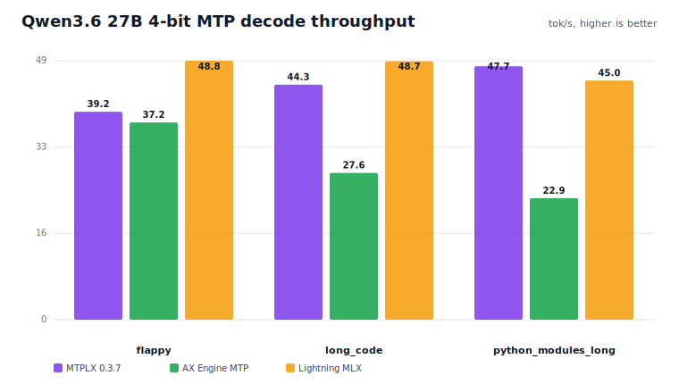</td>
<td>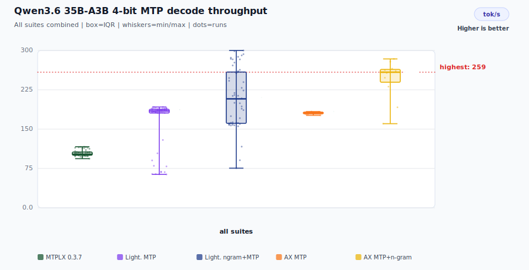</td>
</tr>
<tr>
<td>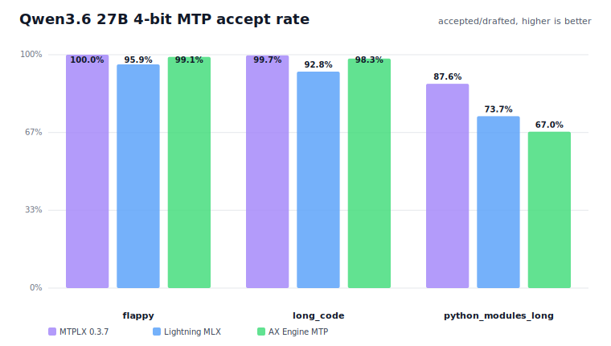</td>
<td>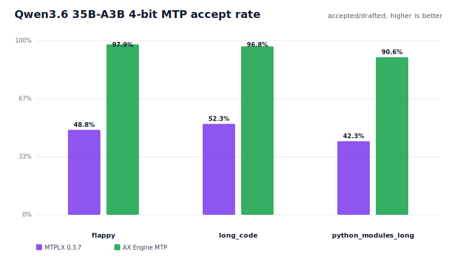</td>
</tr>
<tr>
<td>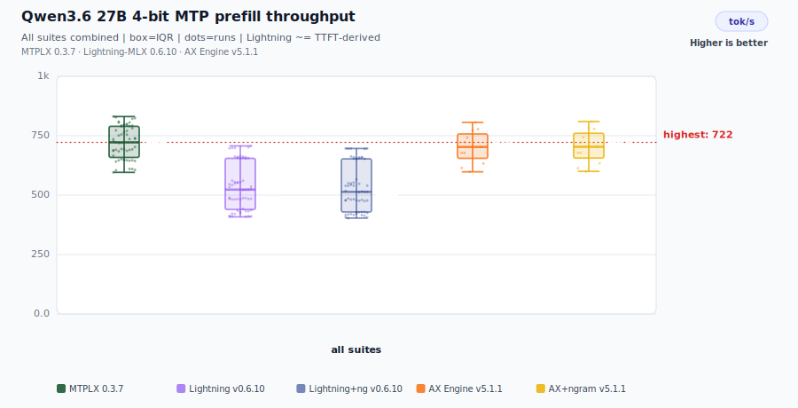</td>
<td>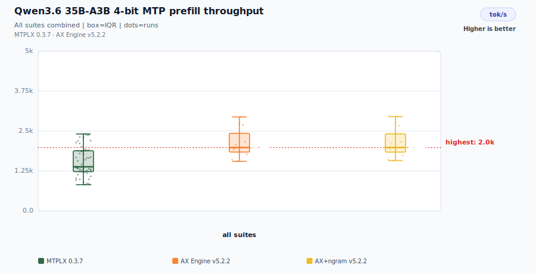</td>
</tr>
<tr>
<td>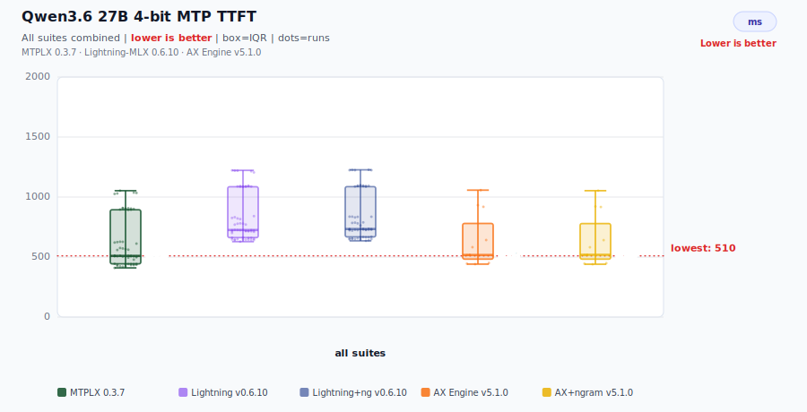</td>
<td>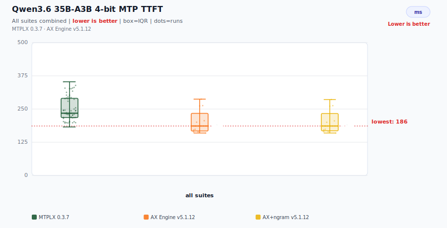</td>
</tr>
</table>

| Model | Suite | Depth | MTPLX tok/s | MTPLX accept | AX tok/s | AX accept | AX+ngram tok/s | AX+ngram accept |
|---|---|---:|---:|---:|---:|---:|---:|---:|
| Qwen3.6 27B 4-bit | flappy | 3 | 59.6 | 100.0% | 61.4 | 99.9% | 61.7 | 99.4% |
| Qwen3.6 27B 4-bit | long_code | 3 | 59.3 | 99.7% | 55.9 | 99.9% | 53.4 | 99.4% |
| Qwen3.6 27B 4-bit | python_modules_long | 3 | 54.4 | 87.6% | 47.5 | 99.3% | 47.1 | 98.9% |
| Qwen3.6 35B-A3B 4-bit | flappy | 1 | 105.3 | 48.5% | 181.0 | 100.0% | 182.1 | 99.2% |
| Qwen3.6 35B-A3B 4-bit | long_code | 1 | 106.0 | 51.7% | 178.9 | 100.0% | 185.3 | 98.3% |
| Qwen3.6 35B-A3B 4-bit | python_modules_long | 1 | 102.1 | 43.4% | 183.2 | 99.6% | 183.2 | 98.7% |

AX MTP uses pure MTP (n-gram stacking disabled); AX MTP+n-gram stacks n-gram speculative drafting on top of MTP. AX MTP runs the default
draft confidence gate (`AX_MLX_MTP_DRAFT_MIN_CONFIDENCE`) that only proposes draft tokens the MTP head is confident in. The accept
columns below are the accept-maximizing `0.98` setting, which holds pure-MTP accept ≥99% on every row; the shipped default is `0.90`,
which trades ~1–2 points of accept on the hardest row for +5–13% decode throughput (see `docs/MTP-DRAFT-GATE-THROUGHPUT.md`). Set the
variable to `0.98` to restore the accept-maximizing behavior, or `0` to disable. The gate is scoped to pure MTP, so the
n-gram-stacked column pools lower-confidence n-gram drafts and sits slightly below it. Sampler: temperature=0.6,
top_p=0.95, top_k=20. 1000 gen tokens, 5 repetitions, 30 s cooldown, 10 s inter-case cooldown.
MTPLX 0.3.7 · AX Engine v5.3.0.

#### Prefill throughput (tok/s) — same run

MTPLX prefill is derived from `prompt_tokens / prompt_eval_time_s` (runner-level).
AX prefill is measured at runner level. Both are pure GPU compute measurements.

| Model | Suite | Depth | MTPLX tok/s | AX MTP tok/s | AX MTP+ngram tok/s |
|---|---|---:|---:|---:|---:|
| Qwen3.6 27B 4-bit | flappy | 3 | 683 | 686 | 686 |
| Qwen3.6 27B 4-bit | long_code | 3 | 798 | 791 | 766 |
| Qwen3.6 27B 4-bit | python_modules_long | 3 | 691 | 695 | 694 |
| Qwen3.6 35B-A3B 4-bit | flappy | 1 | 1,545 | 1,821 | 1,839 |
| Qwen3.6 35B-A3B 4-bit | long_code | 1 | 2,287 | 2,730 | 2,725 |
| Qwen3.6 35B-A3B 4-bit | python_modules_long | 1 | 1,431 | 2,013 | 2,009 |

#### Time to first token (ms) — same run

MTPLX TTFT is derived from `prompt_eval_time_s` (runner-level). AX TTFT is a runner-time measurement. Both are pure prefill measurements.

| Model | Suite | Depth | MTPLX ms | AX MTP ms | AX MTP+ngram ms |
|---|---|---:|---:|---:|---:|
| Qwen3.6 27B 4-bit | flappy | 3 | 471 | 469 | 469 |
| Qwen3.6 27B 4-bit | long_code | 3 | 900 | 907 | 938 |
| Qwen3.6 27B 4-bit | python_modules_long | 3 | 503 | 504 | 504 |
| Qwen3.6 35B-A3B 4-bit | flappy | 1 | 208 | 177 | 175 |
| Qwen3.6 35B-A3B 4-bit | long_code | 1 | 314 | 263 | 263 |
| Qwen3.6 35B-A3B 4-bit | python_modules_long | 1 | 229 | 172 | 172 |

Full artifacts: [`2026-06-05-ax-mtp-gate-fresh`](benchmarks/results/mtp-fair/2026-06-05-ax-mtp-gate-fresh/summary.json) (fresh AX MTP + n-gram run with the default draft confidence gate, 2026-06-05; MTPLX rows reused from the 2026-06-04 same-day sidecar run).

### Gemma 4 Assistant MTP

**Gemma 4 speculative decoding holds draft accept ≥98% on every cell below**
(98.4–99.4% across 26B / 31B × {MTP, MTP+n-gram} × {flappy, long_code,
python_modules_long}).

Unlike Qwen's fused `mtp.*` sidecar, Gemma 4's multi-token prediction is a small,
separate **assistant drafter** that shares the target's tokenizer and embedding
table, drafts one token per step from the target's last-layer hidden state, and
attends to the target's own KV cache. AX runs it assistant-MTP-only (`mtp`) and
with n-gram stacked on top (`mtp-ngram`) at native depth 1.

A **draft confidence gate** (`AX_MLX_GEMMA4_ASSISTANT_MTP_DRAFT_MIN_CONFIDENCE`,
default `0.999`) keeps accept high: each step drafts the assistant's top token but
proposes it only when the drafter's probability in that token clears the
threshold, so only high-confidence tokens are verified (default greedy
argmax-match acceptance, like the Qwen MTP head). Suppressing a low-confidence
draft is correctness-preserving — it changes only whether a step speculates, never
the committed token — so the gate trades speculation depth for accept rate. The
hardest suite, `python_modules_long`, sets the default; lower the gate toward `0`
for more speculation on less predictable content.

<table>
<tr>
<td align="center"><strong>Gemma 4 26B A4B 4-bit</strong></td>
<td align="center"><strong>Gemma 4 31B 4-bit</strong></td>
</tr>
<tr>
<td>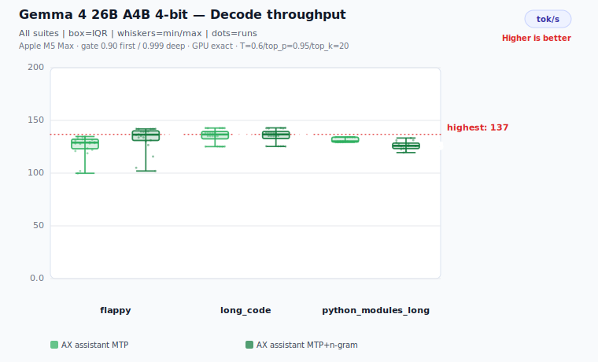</td>
<td>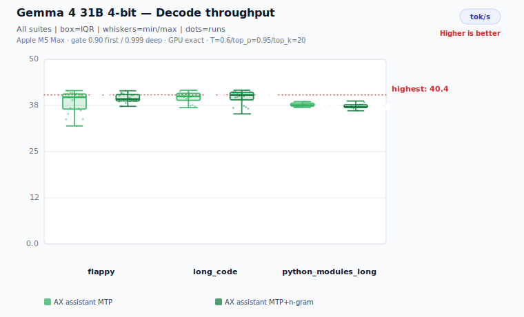</td>
</tr>
<tr>
<td>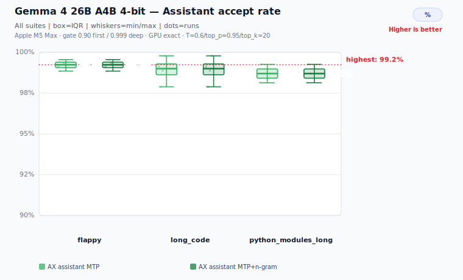</td>
<td>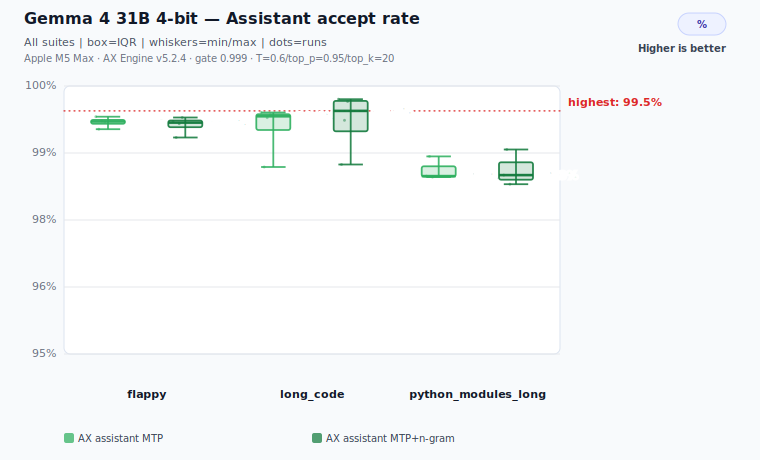</td>
</tr>
<tr>
<td>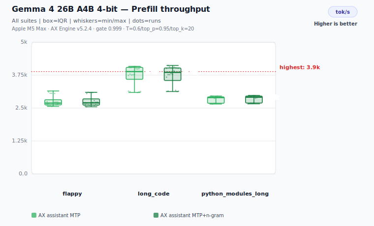</td>
<td>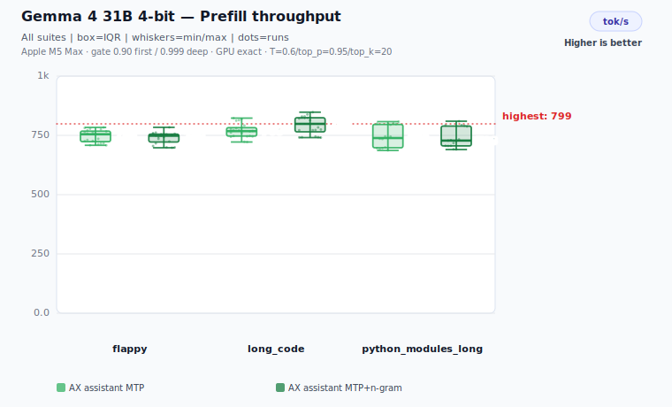</td>
</tr>
<tr>
<td>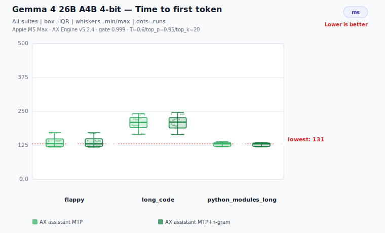</td>
<td>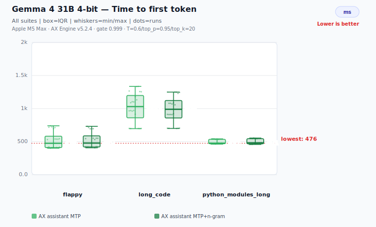</td>
</tr>
</table>

| Model | Suite | Depth | AX MTP tok/s | AX MTP accept | AX MTP+ngram tok/s | AX MTP+ngram accept |
|---|---|---:|---:|---:|---:|---:|
| Gemma 4 26B A4B 4-bit | flappy | 1 | 123.3 | 99.3% | 122.9 | 99.4% |
| Gemma 4 26B A4B 4-bit | long_code | 1 | 119.3 | 99.1% | 117.6 | 99.1% |
| Gemma 4 26B A4B 4-bit | python_modules_long | 1 | 120.0 | 98.5% | 120.5 | 98.7% |
| Gemma 4 31B 4-bit | flappy | 1 | 37.3 | 99.3% | 37.0 | 99.3% |
| Gemma 4 31B 4-bit | long_code | 1 | 35.9 | 99.2% | 35.2 | 99.4% |
| Gemma 4 31B 4-bit | python_modules_long | 1 | 35.9 | 98.4% | 35.8 | 98.4% |

#### Prefill throughput (tok/s) and time to first token (ms) — same run

| Model | Suite | AX MTP prefill | AX MTP+ngram prefill | AX MTP ttft ms | AX MTP+ngram ttft ms |
|---|---|---:|---:|---:|---:|
| Gemma 4 26B A4B 4-bit | flappy | 2,693 | 2,672 | 131 | 132 |
| Gemma 4 26B A4B 4-bit | long_code | 3,905 | 3,893 | 210 | 210 |
| Gemma 4 26B A4B 4-bit | python_modules_long | 2,917 | 2,916 | 131 | 131 |
| Gemma 4 31B 4-bit | flappy | 734 | 734 | 490 | 490 |
| Gemma 4 31B 4-bit | long_code | 782 | 783 | 1,019 | 1,017 |
| Gemma 4 31B 4-bit | python_modules_long | 742 | 744 | 473 | 472 |

Assistant accept is the share of proposed drafts the target accepts. The
`mtp-ngram` column stacks n-gram drafting on top of the assistant but contributes
little here — the gated assistant already captures the speculation, so the two
modes track closely. Sampler temperature=0.6, top_p=0.95, top_k=20; 1000 generated
tokens, 5 repetitions, 10 s / 5 s cooldowns. Apple M5 Max · AX Engine v5.3.0.

Full artifacts: [`2026-06-06-gemma4-26b-31b-assistant-mtp`](benchmarks/results/gemma4-assistant-mtp/2026-06-06-gemma4-26b-31b-assistant-mtp/summary.json).

### llama.cpp metal vs mlx-lm vs AX-Engine

<table>
<tr>
<td></td>
<td align="center"><strong>Gemma 4</strong></td>
<td align="center"><strong>Qwen 3.6</strong></td>
</tr>
<tr>
<td align="center"><strong>Prefill rate</strong></td>
<td></td>
<td></td>
</tr>
<tr>
<td align="center"><strong>Decode rate</strong></td>
<td></td>
<td></td>
</tr>
<tr>
<td align="center"><strong>TTFT</strong></td>
<td></td>
<td></td>
</tr>
</table>

## Quick Install

**Python (recommended):**

```bash
pip install ax-engine
```

`pip install ax-engine` includes the `ax-engine-server` binary. After install,
`ax-engine-server` is available on your `PATH`.

**Homebrew** (for `ax-engine-bench` and an alternative `ax-engine-server` install):

```bash
brew tap defai-digital/ax-engine
brew install ax-engine
```

> Requires **macOS 14 (Sonoma) or later** on **Apple Silicon M2 Max or newer** with **32 GB RAM minimum**.

## 30-Second Setup

Download a model and run it from Python:

```python
from ax_engine import download_model, Session

path = download_model("mlx-community/Qwen3-4B-4bit")
with Session(mlx=True, mlx_model_artifacts_dir=str(path)) as s:
    print(s.generate([1, 2, 3], max_output_tokens=8).output_tokens)
```

Or start the OpenAI-compatible server:

```bash
# Download a model
MODEL_DIR="$(python3 scripts/download_model.py mlx-community/Qwen3-4B-4bit --json | python3 -c 'import json,sys; print(json.load(sys.stdin)["dest"])')"

# Start the server (ax-engine-server is on PATH after pip install ax-engine)
ax-engine-server \
  --mlx \
  --mlx-model-artifacts-dir "$MODEL_DIR" \
  --port 8080
```

Then call it from any OpenAI client:

```python
from openai import OpenAI
client = OpenAI(base_url="http://127.0.0.1:8080/v1", api_key="local")
resp = client.chat.completions.create(
    model="my-model",
    messages=[{"role": "user", "content": "What is AGI?"}],
    max_tokens=128,
)
print(resp.choices[0].message.content)
```

`download_model()` downloads weights and auto-runs `ax-engine-bench generate-manifest`.
See [Getting a Model](#getting-a-model) for all paths including raw HF checkpoints.

## Typical Hardware Stack ([hardware FAQ](docs/FAQ.md#what-hardware-does-ax-engine-support))

For local agent and chatbot workloads, AX Engine is a better fit for a small
model portfolio than for one model serving every workflow. See the
[FAQ model-stack guidance](docs/FAQ.md#what-model-stack-should-i-run-on-high-memory-apple-silicon)
for the full recommendation.

| Hardware | Recommended memory | Best fit |
|---|---:|---|
| Mac mini M4 Pro | 64 GB RAM | Compact always-on local chatbot and agent server |
| MacBook Pro M5 Max | 128 GB RAM | Portable high-throughput chatbot, agent, and coding stack |
| Mac Studio M3 Ultra | 256 GB RAM | Larger local model portfolio, longer contexts, and heavier parallel workloads |

| Role | Recommended model | Setup | App | Why |
|---|---|---|---|---|
| Default chatbot | Gemma 4 26B-A4B / 31B | 4-bit or 6-bit, 16K-32K | [ax-studio](https://github.com/defai-digital/ax-studio) | General assistant path for reasoning, chat, JSON/function calling, and on-device agent workflows |
| General agentic model | Qwen3.6-35B-A3B / Qwen3.6-27B | 35B A3B 4-bit; 27B 4/5/6/8-bit, 16K-32K | AX server / SDK | Strong general agent and coding balance; sparse MoE keeps active compute low |
| Coding specialist | Qwen3-Coder-Next | 6-bit + 16K default; 4-bit/5-bit + 32K when needed | [ax-code](https://github.com/defai-digital/ax-code) | Dedicated local coding-agent path for repo editing, tool use, and long coding sessions |

## Why AX Engine ([FAQ](docs/FAQ.md#is-ax-faster-because-it-replaces-mlx-kernels))

AX Engine gives local inference work a stable runtime contract:

- `ax-engine-server` exposes a local HTTP adapter over the runtime.
- `ax-engine-bench` records workload contracts, route identity, correctness,
  determinism, and performance evidence.
- `ax-engine-sdk`, Python bindings, and the JavaScript client provide
  thin integration surfaces over the same backend-resolution rules.
- Repo-owned MLX execution is tracked in
  [Direct Support Models](#direct-support-models-support-llm-models); delegated
  routes stay separate from AX-owned throughput claims.
- Delegated `mlx_lm.server` and `llama.cpp` routes cover explicit
  compatibility cases without turning delegated results into AX-owned
  throughput claims.

[mlx_lm](https://github.com/ml-explore/mlx-lm) is the canonical MLX reference.
AX Engine compares against `mlx_lm.benchmark` and keeps `mlx_lm.server` as the
explicit delegated compatibility route when AX does not yet have a repo-owned
graph.

For measured direct-support transformer families on Apple Silicon, the AX-owned
runtime layer can produce higher effective throughput than the reference MLX
runtimes on matching benchmark shapes:

- **N-gram acceleration** reaches up to 3.1x mlx_lm decode
  throughput on high-hit benchmark rows with no second draft model. It is a
  workload-sensitive path; Qwen 3.6 27B random-token rows below currently fall
  back near direct decode because the prompt/output stream does not provide a
  useful n-gram draft source.
- **Coding-shaped decode is a natural fit when local repetition exists**,
  including completion, edit loops, structured diffs, JSON/tool output, imports,
  indentation, and repeated identifiers
- **AX-owned request lifecycle** provides deterministic, auditable scheduling,
  KV block management, and prefix reuse that upstream Python runtimes do not
  expose as stable contracts
- **Long-session prefix reuse** restores physical MLX KV snapshots on validated
  cache layouts, so long-running chat and agent loops can avoid repeatedly
  pre-filling the same accumulated context. See
  [`docs/LONG-CONTEXT.md`](docs/LONG-CONTEXT.md) for the evidence boundary.
- **workload-contract tooling** (`ax-engine-bench`) validates correctness,
  determinism, route identity, and regression across checked-in manifests, not
  just throughput snapshots

See the [FAQ](docs/FAQ.md#is-ax-faster-because-it-replaces-mlx-kernels) for
the boundary between MLX kernels and AX-owned runtime behavior.

## Runtime Paths

| Path | Use it for | Current scope |
|---|---|---|
| Repo-owned MLX runtime | Direct-support MLX model families and repo-owned performance claims when backed by benchmark artifacts | Local Apple Silicon inference, token-based server/SDK requests, benchmarked direct and n-gram acceleration modes |
| `mlx_lm_delegated` | MLX text models that upstream `mlx-lm` supports before AX has a repo-owned graph | Blocking and SSE text generation through a user-provided `mlx_lm.server`; `/v1/generate`, `/v1/generate/stream`, and OpenAI-compatible completion/chat text endpoints. Streaming is delegated text compatibility evidence, not repo-owned token/KV performance |
| `llama_cpp` | GGUF and non-MLX local inference | Delegated llama.cpp server/CLI compatibility; route-contract evidence, not repo-owned MLX throughput |

The runtime report exposes `selected_backend`, `support_tier`, and
`resolution_policy` so callers and benchmark artifacts can distinguish these
paths.

For the exact OpenAI-shaped endpoint contract, including what is and is not
compatible today, see `docs/API-COMPATIBILITY.md`.

## Design

The repo-owned MLX path uses MLX directly for tensor operations through the
official `mlx-c` C API. MLX owns the Apple-maintained Metal kernels; AX owns the
runtime behavior above the graph: request lifecycle, scheduling, KV/cache
policy, n-gram acceleration, manifests, and benchmark evidence.

Design details live in the focused docs:
[Scheduler](docs/SCHEDULER.md) ·
[KV Cache](docs/KV-CACHE.md) ·
[Long Context](docs/LONG-CONTEXT.md) ·
[Benchmark Design](docs/BENCH-DESIGN.md) ·
[FAQ](docs/FAQ.md#is-ax-faster-because-it-replaces-mlx-kernels).

## Direct Support Models ([support LLM models](docs/SUPPORTED-MODELS.md))

Direct support means AX has a repo-owned `ax-engine-mlx` graph for the model
family and loads MLX safetensors through the AX manifest path. Other MLX text
models can still use the explicit `mlx_lm_delegated` compatibility route, but
delegated rows are not AX-owned throughput claims.

| Family | Direct model IDs | Current scope | Architecture notes |
|---|---|---|---|
| Gemma 4 | `gemma-4-e2b-it`, `gemma-4-e4b-it`, `gemma-4-26b-a4b-it`, `gemma-4-31b-it` | Repo-owned MLX runtime; MLX affine 4/5/6/8-bit weights where available | Dense, per-layer embedding, and MoE variants; sliding-window + full attention, K=V full-attention layers, logit softcapping |
| Qwen 3 | `Qwen3-4B-4bit` and manifest-backed Qwen 3 dense checkpoints | Repo-owned MLX runtime | SwiGLU dense FFN; per-head QK norm; optional MoE variants require manifest evidence |
| Qwen 3.5 | `Qwen3.5-9B-MLX-4bit` | Repo-owned MLX runtime | Linear attention + MoE FFN; `attn_output_gate` per-head interleaving |
| Qwen 3.6 / Coder Next | `Qwen3.6-35B-A3B` 4-bit MLX, `Qwen3.6-27B` 4/5/6/8-bit MLX, `Qwen3-Coder-Next-4bit` | Repo-owned MLX runtime | `qwen3_next`: GatedDelta linear attention, full attention with per-head sigmoid gate, sparse top-k MoE with shared expert |

> GLM 4.7 Flash (`glm4_moe_lite`) was demoted from direct support to the
> `mlx_lm_delegated` passby route: native decode only reaches `mlx_lm` parity and
> the 4-bit export has no MTP head for AX speculation to exploit. The
> `glm4.7-flash-4bit` preset now selects the delegated tier and requires
> `--mlx-lm-server-url`. See [`docs/SUPPORTED-MODELS.md`](docs/SUPPORTED-MODELS.md).

Direct-support models use MLX safetensors format with the AX
`model-manifest.json` descriptor. Each supported architecture has a hand-written
forward pass in `ax-engine-mlx`. Adding a new architecture means implementing
the model graph, not wiring up a generic loader.

Architecture code, tensor-role metadata, or comments are not public direct
support claims by themselves. LLaMA, Mistral, Mixtral, DeepSeek, and unlisted
Gemma/Qwen variants should use the explicit delegated route when upstream
`mlx-lm` or `llama.cpp` can serve them, or fail closed until a repo-owned graph,
manifest, smoke coverage, and benchmark evidence are promoted here.

Community-model checks are tracked by evidence level. Before promoting another
architecture or checkpoint, run
`scripts/probe_mlx_model_support.py --model-dir <model-dir>`; a model should
report `repo_owned_runtime_ready` only when its manifest, local reference files,
and runtime path are all present.

## Performance ([full performance docs](docs/PERFORMANCE.md))

<!-- readme-performance-artifacts: reference=benchmarks/results/mlx-inference/2026-05-26-direct-mode-clean-refresh/; ax-overlay=benchmarks/results/mlx-inference/2026-06-04-ax-direct-ngram-readme-rerun/ -->
The README keeps the common Gemma 4 and Qwen 3.6 generation benchmark rows
visible. Full result tables and interpretation live in
[`docs/PERFORMANCE.md`](docs/PERFORMANCE.md); benchmark methodology, test setup,
and reproduction details live in [`docs/BENCHMARKS.md`](docs/BENCHMARKS.md).

These rows are a provenance-tracked composite. The current `mlx_lm` reference
rows for the 12 Gemma 4 and Qwen 3.6 rows shown below come from
`benchmarks/results/mlx-inference/2026-05-26-direct-mode-clean-refresh/`. The
AX direct-mode and default n-gram cells come from the full 12-model AX-only
rerun in
`benchmarks/results/mlx-inference/2026-06-04-ax-direct-ngram-readme-rerun/`,
which reused those `mlx_lm` reference rows and was produced with v5.1.8
(`5402992b`).
The `llama.cpp Metal*` column is also injected from
`benchmarks/manifests/llama_cpp_metal/inventory.json` and the
`benchmarks/results/mlx-inference/2026-05-18-llama-cpp-metal-gemma-e2b-4bit-depth-fa/`
Gemma 4 E2B 4-bit recheck. The latest refreshed AX overlay uses
generation=128, 5 measured repetitions, a 15-second cooldown between trials, AX
prefix cache disabled for cold prefill and TTFT measurement, and
production-build binaries. MLX and AX rows also use matching prompt SHA checks.
Long-greedy AX prefill rows are runner-time measurements of the cache-state
prefix plus final prompt-token boundary; they are not full-logits prompt scoring
throughput.
Percentages are versus `mlx_lm`. The `llama.cpp Metal*` column is a
shape-compatible external reference; it does not share prompt-token hashes with
the MLX rows.

### MTP speculative decoding

AX Engine's fair Qwen3.6 MTP benchmark uses local, provenance-recorded sidecars
from standard `Qwen/Qwen3.6-*` MTP shards plus the matching
`mlx-community/*-4bit` MLX base, excluding `Youssofal/*MTPLX*` bundles.
All three engines (MTPLX, AX MTP, AX MTP+n-gram) run on the same prompt
suites, token caps, sampler, warmup, repetition count, and cooldown.

Use the three-engine harness to reproduce the comparison:

```bash
python3 scripts/prepare_qwen36_mtp_sidecar.py --model 27b
python3 scripts/prepare_qwen36_mtp_sidecar.py --model 35b
python3 scripts/bench_qwen36_mtp_fair.py \
  --engines mtplx ax \
  --modes mtp mtp-ngram \
  --models 27b-4bit 35b-a3b-4bit \
  --suites flappy long_code python_modules_long \
  --max-tokens 1000 \
  --repetitions 5 \
  --cooldown 30
```

The generated `summary.md`, `summary.json`, and `decode-tok-s.svg` live under
`benchmarks/results/mtp-fair/`. Full methodology and caveats live in
[`docs/PERFORMANCE.md#mtp-mode`](docs/PERFORMANCE.md#mtp-mode).

Gemma 4 uses an assistant **drafter** instead of a fused sidecar and has no MTPLX
reference, so it has its own harness. With the target and `*-assistant` checkpoints
in the HF cache, the benchmark prepares the pair automatically, then renders the
box-and-whisker charts:

```bash
python3 scripts/bench_gemma4_assistant_mtp.py \
  --models 26b-a4b-4bit,31b-4bit \
  --modes mtp,mtp-ngram \
  --suites flappy,long_code,python_modules_long \
  --max-tokens 1000 --repetitions 5
python3 scripts/render_gemma4_assistant_mtp_charts.py \
  --results-dir benchmarks/results/gemma4-assistant-mtp/<run-dir>
```

Artifacts land under `benchmarks/results/gemma4-assistant-mtp/`; the SVGs render
into `docs/assets/`. Tune the accept/throughput trade-off with
`AX_MLX_GEMMA4_ASSISTANT_MTP_DRAFT_MIN_CONFIDENCE` (default `0.999`; `0` disables
the gate).

<!-- llama-cpp-column-disclaimer -->
**`llama.cpp Metal*` column** — Shape-compatible reference produced by Metal-enabled `llama-bench`. `llama-bench` generates its own internal synthetic prompt tokens and does not consume the harness prompt JSON, so these numbers are NOT prompt-hash parity with the other columns. The intent is rough side-by-side context against a well-known third-party Metal runtime, not head-to-head comparison. MLX bit-widths are mapped to the nearest standard bartowski GGUF K-quant (4→Q4_K_M, 5→Q5_K_M, 6→Q6_K, 8→Q8_0). No percentage delta is shown for this column because the prompt is not shared. Source: `benchmarks/manifests/llama_cpp_metal/inventory.json`, `scripts/bench_llama_cpp_metal_sweep.py`.

Note: The 2K `llama.cpp Metal*` prefill rows are long-context,
GGUF-runtime-reference rows, not MLX parity claims. Across this dataset, the 2K
`llama.cpp Metal*` prefill column commonly trails the MLX/AX rows, with the
largest gap on Gemma 4 E2B. The Gemma 4 E2B 4-bit row was produced with
`llama.cpp` b9110 (`ef22b3e4a`) and rechecked on b9200 (`3e12fbdea`) with Metal
offload, `-b/-ub 2048`, and flash attention enabled. The b9200 recheck improved
2K prefill only slightly, and no missing benchmark flag was found. This is our
benchmark boundary, not an upstream `llama.cpp` official bug statement.

### Prefill throughput (tok/s) — percentages vs mlx_lm

| Model | MLX quantization | Prompt tok | llama.cpp Metal* | mlx_lm | ax engine |
|---|---|---:| ---: |---:|---:|
| Gemma 4 E2B | 4-bit | 128 | 3,481.7 | 2,338.1 | **6,044.9 (+158.5%)** |
|         |         | 512 | 6,846.0 | 7,870.0 | **17,238.5 (+119.0%)** |
|         |         | 2048 | 7,643.1 | 18,014.7 | **24,778.3 (+37.5%)** |
| Gemma 4 E2B | 5-bit | 128 | 3,398.4 | 2,238.5 | **6,019.3 (+168.9%)** |
|         |         | 512 | 6,860.3 | 7,469.9 | **16,846.5 (+125.5%)** |
|         |         | 2048 | 7,288.1 | 16,664.1 | **24,188.3 (+45.2%)** |
| Gemma 4 E2B | 6-bit | 128 | 3,539.7 | 1,823.5 | **5,700.8 (+212.6%)** |
|         |         | 512 | 7,274.0 | 6,046.6 | **16,336.4 (+170.2%)** |
|         |         | 2048 | 7,623.2 | 15,332.1 | **23,502.4 (+53.3%)** |
| Gemma 4 E2B | 8-bit | 128 | 3,694.3 | 1,605.0 | **5,452.1 (+239.7%)** |
|         |         | 512 | 7,481.0 | 6,332.9 | **15,679.5 (+147.6%)** |
|         |         | 2048 | 7,990.4 | 15,536.8 | **23,392.6 (+50.6%)** |
| Gemma 4 E4B | 4-bit | 128 | 2,194.0 | 1,513.2 | **3,409.6 (+125.3%)** |
|         |         | 512 | 4,454.2 | 4,195.5 | **7,000.6 (+66.9%)** |
|         |         | 2048 | 4,426.6 | 7,325.4 | **8,863.4 (+21.0%)** |
| Gemma 4 26B A4B | 4-bit | 128 | 1,911.4 | 496.4 | **1,339.1 (+169.7%)** |
|         |         | 512 | 3,484.5 | 1,621.0 | **3,055.2 (+88.5%)** |
|         |         | 2048 | 3,604.8 | 3,300.1 | **4,668.6 (+41.5%)** |
| Gemma 4 31B | 4-bit | 128 | 522.6 | 283.1 | **513.3 (+81.3%)** |
|         |         | 512 | 665.3 | 619.9 | **742.5 (+19.8%)** |
|         |         | 2048 | 560.3 | 733.9 | **782.7 (+6.6%)** |
| Qwen 3.6 27B | 4-bit | 128 | 539.6 | 378.8 | **583.6 (+54.1%)** |
|  |  | 512 | 759.7 | 705.7 | **827.1 (+17.2%)** |
|  |  | 2048 | 664.3 | 895.2 | **923.7 (+3.2%)** |
| Qwen 3.6 27B | 5-bit | 128 | 520.8 | 278.8 | **536.6 (+92.4%)** |
|  |  | 512 | 733.4 | 599.5 | **784.4 (+30.9%)** |
|  |  | 2048 | 667.0 | 827.5 | **883.3 (+6.7%)** |
| Qwen 3.6 27B | 6-bit | 128 | 537.7 | 270.5 | **509.7 (+88.4%)** |
|  |  | 512 | 756.1 | 577.6 | **762.6 (+32.0%)** |
|  |  | 2048 | 689.3 | 798.2 | **869.6 (+8.9%)** |
| Qwen 3.6 27B | 8-bit | 128 | 559.4 | 219.3 | **453.2 (+106.6%)** |
|  |  | 512 | 798.2 | 520.2 | **731.9 (+40.7%)** |
|  |  | 2048 | 741.9 | 787.4 | **868.1 (+10.2%)** |
| Qwen 3.6 35B A3B | 4-bit | 128 | 1,706.9 | 539.4 | **1,115.0 (+106.7%)** |
|  |  | 512 | 3,146.6 | 1,599.5 | **2,618.6 (+63.7%)** |
|  |  | 2048 | 3,542.3 | 3,513.1 | **3,700.6 (+5.3%)** |

### Decode throughput (tok/s) — generation=128 tokens, temp=0

Higher is better. `ax direct baseline` disables n-gram acceleration.
`ax default n-gram` is the default AX decode policy and reports observed
effective throughput, not raw model-kernel speed.

The bench prompts are `mlx_lm.benchmark` seed-0 random tokens, which is
the only way to keep prompt-hash parity across all four columns. The
n-gram column is sensitive to workload shape — published benchmarks
(Saxena 2024, vLLM, SpecDecode-Bench 2025, EfficientEdit 2025) all
report n-gram speculative decoding is an input-output overlap
technique: code editing / refactoring / summarization see large
speedups; fresh code generation and open-ended chat see modest
speedups or none.
[`docs/NGRAM-ACCELERATION.md`](docs/NGRAM-ACCELERATION.md) covers how
the drafter works, when each workload regime is expected to accelerate,
the
[when-it-helps section](docs/NGRAM-ACCELERATION.md#when-n-gram-acceleration-helps)
with literature citations and our own random-vs-real measurements,
and the
[synthetic repeated-output loop](docs/NGRAM-ACCELERATION.md#synthetic-repeated-output-loops)
caveat for random-token rows whose throughput may be measured on a
collapsed output loop.

The Qwen 3.6 27B rows are intentionally left in the table as a negative
random-token result: AX's default policy falls back near direct decode when no
accepted n-gram draft is available. They are not presented as n-gram speedup
claims.

| Model | MLX quantization | Prompt tok | llama.cpp Metal* | mlx_lm | ax direct baseline | ax default n-gram |
|---|---|---:| ---: |---:|---:|---:|
| Gemma 4 E2B | 4-bit | 128 | 174.6 | 214.0 | **235.8 (+10.2%)** | **568.9 (+165.9%)** |
|  |  | 512 | 165.2 | 210.3 | **226.6 (+7.8%)** | **525.4 (+149.9%)** |
|  |  | 2048 | 171.9 | 200.9 | **216.8 (+7.9%)** | **486.8 (+142.3%)** |
| Gemma 4 E2B | 5-bit | 128 | 154.8 | 195.2 | **210.6 (+7.9%)** | **445.4 (+128.2%)** |
|  |  | 512 | 154.3 | 182.0 | **203.3 (+11.7%)** | **409.1 (+124.7%)** |
|  |  | 2048 | 154.3 | 181.9 | **194.8 (+7.1%)** | **408.5 (+124.6%)** |
| Gemma 4 E2B | 6-bit | 128 | 152.1 | 172.2 | **186.7 (+8.4%)** | **411.2 (+138.9%)** |
|  |  | 512 | 152.0 | 166.3 | **180.9 (+8.8%)** | **362.5 (+117.9%)** |
|  |  | 2048 | 152.2 | 162.5 | **174.5 (+7.4%)** | **369.3 (+127.3%)** |
| Gemma 4 E2B | 8-bit | 128 | 136.1 | 153.0 | **163.3 (+6.7%)** | **431.4 (+181.9%)** |
|  |  | 512 | 138.3 | 148.8 | **158.7 (+6.7%)** | **405.3 (+172.4%)** |
|  |  | 2048 | 138.7 | 144.2 | **153.9 (+6.7%)** | **399.6 (+177.1%)** |
| Gemma 4 E4B | 4-bit | 128 | 110.7 | 137.1 | **144.4 (+5.3%)** | **145.4 (+6.1%)** |
|  |  | 512 | 110.8 | 133.6 | **141.4 (+5.8%)** | **323.3 (+142.0%)** |
|  |  | 2048 | 110.7 | 130.6 | **138.3 (+6.0%)** | **317.9 (+143.5%)** |
| Gemma 4 26B A4B | 4-bit | 128 | 112.6 | 127.9 | **135.3 (+5.7%)** | **241.4 (+88.7%)** |
|  |  | 512 | 112.9 | 125.0 | **132.0 (+5.6%)** | **184.0 (+47.1%)** |
|  |  | 2048 | 112.9 | 119.3 | **127.4 (+6.8%)** | **235.2 (+97.1%)** |
| Gemma 4 31B | 4-bit | 128 | 25.0 | 28.9 | **29.3 (+1.6%)** | **61.6 (+113.4%)** |
|  |  | 512 | 25.5 | 28.3 | **28.7 (+1.5%)** | **60.3 (+112.9%)** |
|  |  | 2048 | 25.3 | 27.0 | **27.5 (+1.8%)** | **55.6 (+105.6%)** |
| Qwen 3.6 27B | 4-bit | 128 | 26.0 | 34.0 | **35.0 (+3.1%)** | **35.1 (+3.4%)** |
|  |  | 512 | 26.0 | 33.9 | **34.2 (+0.9%)** | **35.0 (+3.2%)** |
|  |  | 2048 | 18.8 | 33.4 | **33.8 (+1.2%)** | **34.5 (+3.3%)** |
| Qwen 3.6 27B | 5-bit | 128 | 23.5 | 21.6 | **28.9 (+33.9%)** | **29.0 (+34.1%)** |
|  |  | 512 | 23.3 | 28.1 | **28.8 (+2.5%)** | **28.9 (+2.7%)** |
|  |  | 2048 | 17.8 | 27.8 | **28.6 (+2.8%)** | **28.7 (+3.1%)** |
| Qwen 3.6 27B | 6-bit | 128 | 21.3 | 24.0 | **25.7 (+6.9%)** | **25.7 (+7.0%)** |
|  |  | 512 | 21.3 | 24.8 | **25.6 (+3.4%)** | **25.6 (+3.5%)** |
|  |  | 2048 | 15.4 | 24.6 | **25.4 (+3.2%)** | **25.4 (+3.3%)** |
| Qwen 3.6 27B | 8-bit | 128 | 18.3 | 18.7 | **19.3 (+3.5%)** | **19.4 (+3.7%)** |
|  |  | 512 | 18.2 | 18.6 | **19.2 (+3.4%)** | **19.3 (+3.6%)** |
|  |  | 2048 | 12.7 | 18.4 | **19.1 (+3.9%)** | **19.1 (+3.9%)** |
| Qwen 3.6 35B A3B | 4-bit | 128 | 108.1 | 140.1 | **155.2 (+10.8%)** | **156.0 (+11.3%)** |
|  |  | 512 | 108.2 | 136.5 | **152.8 (+12.0%)** | **154.1 (+12.9%)** |
|  |  | 2048 | 105.7 | 134.5 | **151.8 (+12.9%)** | **151.3 (+12.5%)** |

Qwen 3.6 27B 4-bit at prompt=2048 originally produced zero decode tokens
because 4-bit quantization noise pushed an EOS token to argmax at decode
step 0 on the `mlx_lm.benchmark` random-token contract. The benchmark harness
now sends request-scoped `sampling.ignore_eos=true` for AX throughput runs,
matching how `mlx_lm.benchmark` measures fixed `gen=N` throughput regardless
of stop-token argmax. Production requests default to `ignore_eos=false` and
still honor EOS at step 0 on this specific synthetic prompt. Source:
`benchmarks/results/mlx-inference/2026-05-20-qwen27-4to5-direct-ngram-directcpp-r2/qwen3_6-27b-4bit.json`.

Qwen 3.6 27B 4-bit at prompt=2048 still shows a low n-gram decode row on this
random-token contract. The artifact records the linear-attention direct C++
input path as all-hit with no fallback/profile-blocked counters, so the dip is
preserved as a workload/result characteristic rather than hidden.

### Time to first token (ms) — generation=128 tokens, temp=0

**Lower is better.** `mlx_lm` values are derived from reported prefill throughput.
AX values are measured directly from per-step runner timing in the SSE event
stream. New AX benchmark artifacts also record `client_wall_ttft_ms` separately
so server/client timing does not get mixed with runner-time throughput.

| Model | MLX quantization | Prompt tok | llama.cpp Metal* | mlx_lm | ax engine |
|---|---|---:| ---: |---:|---:|
| Gemma 4 E2B | 4-bit | 128 | 36.8 | 54.7 | **21.2 (-61.3%)** |
|         |         | 512 | 74.8 | 65.1 | **29.7 (-54.3%)** |
|         |         | 2048 | 268.0 | 113.7 | **82.7 (-27.3%)** |
| Gemma 4 E2B | 5-bit | 128 | 37.7 | 57.2 | **21.3 (-62.8%)** |
|         |         | 512 | 74.6 | 68.5 | **30.4 (-55.7%)** |
|         |         | 2048 | 281.0 | 122.9 | **84.7 (-31.1%)** |
| Gemma 4 E2B | 6-bit | 128 | 36.2 | 70.2 | **22.5 (-68.0%)** |
|         |         | 512 | 70.4 | 84.7 | **31.3 (-63.0%)** |
|         |         | 2048 | 268.7 | 133.6 | **87.1 (-34.8%)** |
| Gemma 4 E2B | 8-bit | 128 | 34.6 | 79.7 | **23.5 (-70.6%)** |
|         |         | 512 | 68.4 | 80.8 | **32.7 (-59.6%)** |
|         |         | 2048 | 256.3 | 131.8 | **87.5 (-33.6%)** |
| Gemma 4 E4B | 4-bit | 128 | 58.3 | 84.6 | **37.5 (-55.6%)** |
|         |         | 512 | 114.9 | 122.0 | **73.1 (-40.1%)** |
|         |         | 2048 | 462.7 | 279.6 | **231.1 (-17.4%)** |
| Gemma 4 26B A4B | 4-bit | 128 | 67.0 | 257.8 | **95.6 (-62.9%)** |
|         |         | 512 | 146.9 | 315.8 | **167.6 (-46.9%)** |
|         |         | 2048 | 568.1 | 620.6 | **438.7 (-29.3%)** |
| Gemma 4 31B | 4-bit | 128 | 244.9 | 452.2 | **249.4 (-44.8%)** |
|         |         | 512 | 769.5 | 826.0 | **689.5 (-16.5%)** |
|         |         | 2048 | 3,655.2 | 2,790.6 | **2,616.7 (-6.2%)** |
| Qwen 3.6 27B | 4-bit | 128 | 237.2 | 337.9 | **219.3 (-35.1%)** |
|  |  | 512 | 673.9 | 725.6 | **619.0 (-14.7%)** |
|  |  | 2048 | 3,083.1 | 2,287.7 | **2,217.1 (-3.1%)** |
| Qwen 3.6 27B | 5-bit | 128 | 245.8 | 459.0 | **238.5 (-48.0%)** |
|  |  | 512 | 698.1 | 854.1 | **652.7 (-23.6%)** |
|  |  | 2048 | 3,070.5 | 2,474.9 | **2,318.7 (-6.3%)** |
| Qwen 3.6 27B | 6-bit | 128 | 238.1 | 473.2 | **251.1 (-46.9%)** |
|  |  | 512 | 677.2 | 886.5 | **671.4 (-24.3%)** |
|  |  | 2048 | 2,971.2 | 2,565.6 | **2,355.0 (-8.2%)** |
| Qwen 3.6 27B | 8-bit | 128 | 228.8 | 583.6 | **282.5 (-51.6%)** |
|  |  | 512 | 641.5 | 984.2 | **699.6 (-28.9%)** |
|  |  | 2048 | 2,760.6 | 2,601.1 | **2,359.3 (-9.3%)** |
| Qwen 3.6 35B A3B | 4-bit | 128 | 75.0 | 237.3 | **114.8 (-51.6%)** |
|  |  | 512 | 162.7 | 320.1 | **195.5 (-38.9%)** |
|  |  | 2048 | 578.2 | 583.0 | **553.4 (-5.1%)** |

Embedding benchmarks are kept out of this README summary; see
[`docs/EMBEDDINGS.md`](docs/EMBEDDINGS.md) for embedding throughput, serving,
and cold-start measurements.

## Installation

### Python

```bash
pip install ax-engine
```

Requires macOS 14+, Apple Silicon (M2 Max or newer), Python 3.10+.

The pip wheel includes the `ax-engine-server` binary. After install it is on
your `PATH`:

```bash
ax-engine-server --mlx --mlx-model-artifacts-dir "$MODEL_DIR" --port 8080
```

Optional extras:

```bash
pip install "ax-engine[download]" # mlx-lm for model download helpers
```

### Homebrew (CLI tools)

For `ax-engine-bench` (workload-contract CLI), or as an alternative way to
install `ax-engine-server`:

```bash
brew tap defai-digital/ax-engine
brew install ax-engine
ax-engine-bench doctor
```

If `doctor` fails with `Library not loaded: libmlxc.dylib`, run:
`brew install mlx-c && brew reinstall ax-engine`.

### Source

```bash
brew install mlx-c
cargo build --workspace --release
maturin develop  # Python bindings
```

## Quick Start

The fastest local workflow is:

1. install or build the command-line tools;
2. download a supported MLX model and generate its manifest;
3. check model readiness;
4. start the local server and call its HTTP endpoints.

The commands below use source-build paths. If you installed via pip or Homebrew,
use `ax-engine-server` and `ax-engine-bench` directly instead of
`./target/release/...`.

### Start `ax-engine-server` from the CLI

```bash
# Download a model and generate its manifest
MODEL_DIR="$(python3 scripts/download_model.py mlx-community/Qwen3-4B-4bit --json | python3 -c 'import json,sys; print(json.load(sys.stdin)["dest"])')"
# MODEL_DIR uses the Hugging Face Hub snapshot cache by default, e.g.
# ~/.cache/huggingface/hub/models--mlx-community--Qwen3-4B-4bit/snapshots/<hash>

# Check readiness
./target/release/ax-engine-bench doctor --mlx-model-artifacts-dir "$MODEL_DIR"

# HTTP inference server (repo-owned MLX runtime)
./target/release/ax-engine-server \
  --mlx \
  --mlx-model-artifacts-dir "$MODEL_DIR" \
  --port 8080

# In another terminal, inspect the running server
curl http://127.0.0.1:8080/v1/runtime

# Optional smoke generation request
curl http://127.0.0.1:8080/v1/generate \
  -H 'content-type: application/json' \
  -d '{
    "model": "qwen3_dense",
    "input_tokens": [1, 2, 3, 4],
    "max_output_tokens": 4,
    "sampling": {
      "temperature": 0.0,
      "top_p": 1.0,
      "top_k": 0,
      "seed": 1234
    }
  }'
```

```python
# Python bindings (after maturin develop)
import ax_engine

path = ax_engine.download_model("mlx-community/Qwen3-4B-4bit")
with ax_engine.Session(mlx=True, mlx_model_artifacts_dir=str(path)) as s:
    result = s.generate([1, 2, 3], max_output_tokens=32)
    print(result.output_tokens)
```

For an unsupported MLX text model that upstream `mlx-lm` can serve, keep AX
Engine as the CLI/server surface and delegate the model execution explicitly:

```bash
mlx_lm.server --model /path/to/local/mlx-model --host 127.0.0.1 --port 8090

./target/release/ax-engine-bench generate \
  --prompt "Hello from mlx-lm" \
  --support-tier mlx_lm_delegated \
  --mlx-lm-server-url http://127.0.0.1:8090
```

`mlx_lm_delegated` is a compatibility route, not an AX-owned MLX throughput
claim. AX forwards text generation to upstream `mlx_lm.server`, preserves
sampling fields such as `temperature`, `top_p`, `top_k`, `repetition_penalty`,
and `seed`, and exposes blocking plus SSE text through the AX API. Streamed
chunks are delegated text deltas; they are not AX-owned token IDs, KV state, or
model-kernel throughput evidence. Tool calls and visual/multimodal inputs are
not compatibility contracts yet.

```bash
# Primary benchmark: AX vs mlx_lm
python3 scripts/bench_mlx_inference_stack.py \
  --model-dir /path/to/local/mlx-model \
  --prompt-tokens 128,512,2048 --generation-tokens 128 \
  --ax-compare-policies --repetitions 5 \
  --output benchmarks/results/mlx-inference/$(date +%F)/gemma-4-e2b-it-4bit.json

# Secondary workload-contract benchmark
./target/release/ax-engine-bench scenario \
  --manifest benchmarks/manifests/scenario/chat_gemma4_e2b_short.json \
  --output-root benchmarks/results

# Smoke checks
./target/release/ax-engine-bench doctor --mlx-model-artifacts-dir "$MODEL_DIR"
bash scripts/check-server-preview.sh
bash scripts/check-python-preview.sh
```

## Getting a Model

ax-engine requires pre-sanitized MLX weights. The recommended source is
[mlx-community](https://huggingface.co/mlx-community) — models there are already
converted and validated. Loading an unsanitized raw HF checkpoint into a hybrid
architecture (Qwen3.5, Qwen3-Next) raises a hard error at load time.

### mlx-community model (recommended)

`download_model()` and `scripts/download_model.py` download weights and auto-generate
the required `model-manifest.json` in one step:

```bash
# Script (works with pip, Homebrew, or source build)
python scripts/download_model.py mlx-community/Qwen3-4B-4bit

# For automation, emit a parseable summary
python scripts/download_model.py mlx-community/Qwen3-4B-4bit --json

# Python SDK
from ax_engine import download_model
path = download_model("mlx-community/Qwen3-4B-4bit")
```

By default these helpers use the same Hugging Face Hub snapshot cache as
`mlx_lm` and `huggingface_hub`. If you already have `mlx_lm` installed, its
download also lands in that cache and ax-engine can auto-discover it:

```bash
python -m mlx_lm.generate --model mlx-community/Qwen3-4B-4bit --prompt "x" --max-tokens 1
ax-engine-bench generate-manifest ~/.cache/huggingface/hub/models--mlx-community--Qwen3-4B-4bit/snapshots/<hash>
ax-engine-server --mlx --resolve-model-artifacts hf-cache --preset qwen3_dense --port 8080
```

### Raw HuggingFace checkpoint

Raw checkpoints need sanitization before ax-engine can load them. Use `mlx_lm.convert`:

```bash
pip install mlx-lm
mlx_lm.convert --hf-path <org/model> --mlx-path /path/to/dest -q --q-bits 4
ax-engine-bench generate-manifest /path/to/dest
ax-engine-server --mlx --mlx-model-artifacts-dir /path/to/dest --port 8080
```

### Manifest generation

Both paths above require `model-manifest.json`. The download helpers generate it
automatically. To run it directly:

```bash
ax-engine-bench generate-manifest /path/to/model      # pip, Homebrew, or built binary
cargo run -p ax-engine-core --bin generate-manifest -- /path/to/model  # source
```

## SDKs

ax-engine-server exposes OpenAI-compatible HTTP endpoints, and several SDKs
wrap those endpoints or the in-process Rust session directly.

| Language | Package / path | LangChain |
|----------|---------------|-----------|
| **Python** | `python/ax_engine` | `ax_engine.langchain` — `AXEngineChatModel`, `AXEngineLLM` |
| **TypeScript / JS** | `javascript/ax-engine` (`@ax-engine/sdk`) | `@ax-engine/sdk/langchain` — `ChatAXEngine`, `AXEngineLLM` |
| **Go** | `sdk/go/axengine` | Use [langchaingo](https://github.com/tmc/langchaingo) OpenAI provider — see `examples/go/langchain/` |
| **Ruby** | `sdk/ruby` (`ax-engine-sdk`) | `ax_engine/langchain` — `ChatModel`, `LLM` (requires langchain-rb) |
| **Mojo** | `sdk/mojo/ax_engine.mojo` | Via Python — use `ax_engine.langchain` from Mojo's Python interop |

### TypeScript / JavaScript

```bash
npm install @ax-engine/sdk
```

```typescript
import AxEngineClient from "@ax-engine/sdk";

const client = new AxEngineClient({ baseUrl: "http://127.0.0.1:8080" });
const resp = await client.chatCompletion({
  messages: [{ role: "user", content: "Hello!" }],
  max_tokens: 128,
});
console.log(resp.choices[0].message.content);

// Streaming
for await (const event of client.streamChatCompletion({ messages: [...], stream: true })) {
  process.stdout.write(event.data.choices[0]?.delta?.content ?? "");
}
```

LangChain integration (requires `@langchain/core`):

```typescript
import { ChatAXEngine } from "@ax-engine/sdk/langchain";
import { HumanMessage } from "@langchain/core/messages";

const chat = new ChatAXEngine({ maxTokens: 128 });
const response = await chat.invoke([new HumanMessage("Hello!")]);
```

### Go

The Go SDK lives at `sdk/go/axengine` (module `github.com/ax-engine/ax-engine-go`).

```go
client := axengine.NewClient(nil)

resp, err := client.ChatCompletion(ctx, axengine.OpenAiChatCompletionRequest{
    Messages:  []axengine.OpenAiChatMessage{{Role: "user", Content: "Hello!"}},
    MaxTokens: axengine.Ptr(128),
})

// Streaming
ch, errCh := client.StreamChatCompletion(ctx, req)
for chunk := range ch {
    fmt.Print(*chunk.Choices[0].Delta.Content)
}
```

See `examples/go/` for runnable examples. For LangChain, point
[langchaingo](https://github.com/tmc/langchaingo)'s OpenAI provider at
`http://127.0.0.1:8080/v1` — see `examples/go/langchain/` and `docs/GO.md`.

### Ruby

The Ruby SDK lives at `sdk/ruby/` (`ax-engine-sdk` gem). Zero dependencies —
stdlib `net/http` only. Streaming uses a block interface.

```ruby
require "ax_engine"

client = AxEngine::Client.new

# Blocking chat
resp = client.chat_completion(
  messages: [{ role: "user", content: "Hello!" }],
  max_tokens: 128
)
puts resp.dig("choices", 0, "message", "content")

# Streaming
client.stream_chat_completion(
  messages: [{ role: "user", content: "Count from 1 to 5." }],
  max_tokens: 64
) do |event|
  print event.dig("data", "choices", 0, "delta", "content").to_s
end
```

LangChain via [langchain-rb](https://github.com/patterns-ai-core/langchain):

```ruby
require "ax_engine/langchain"

chat = AxEngine::Langchain::ChatModel.new(max_tokens: 256)
puts chat.chat(messages: [{ role: "user", content: "Hello!" }]).chat_completion
```

See `examples/ruby/` and `docs/RUBY.md` for full details.

### Python — LangChain

```python
from ax_engine.langchain import AXEngineChatModel
from langchain_core.messages import HumanMessage

chat = AXEngineChatModel(base_url="http://127.0.0.1:8080", max_tokens=256)
response = chat.invoke([HumanMessage(content="Hello!")])
print(response.content)

# Streaming
for chunk in chat.stream([HumanMessage(content="Count from 1 to 5.")]):
    print(chunk.content, end="", flush=True)
```

Requires `pip install langchain-core`. See `docs/PYTHON.md` for full details.

### Mojo

The Mojo SDK (`sdk/mojo/ax_engine.mojo`) wraps the Python `ax_engine` package
via Mojo's `PythonObject` interop. Requires the Python extension to be built
first (`maturin develop`).

```mojo
from sdk.mojo.ax_engine import Session

var session = Session(
    "qwen3_dense",
    mlx=True,
    mlx_model_artifacts_dir="/path/to/artifacts",
)
var result = session.generate("Hello from Mojo!", max_output_tokens=64)
print(result.output_text)
session.close()
```

## Workspace

```
crates/ax-engine-core    Engine state machine, scheduler, KV manager, sampler
crates/ax-engine-mlx     MLX model graph, n-gram acceleration, KV cache, runner
crates/mlx-sys           bindgen FFI over mlx-c; safe MlxArray RAII wrappers
crates/ax-engine-sdk     Session API, backend resolution (MLX, mlx-lm delegated, or llama.cpp)
crates/ax-engine-server  Axum HTTP/SSE adapter (OpenAI-compatible routes)
crates/ax-engine-bench   Manifest-driven workload-contract CLI
crates/ax-engine-py      PyO3 extension (ABI3, Python 3.10+)
javascript/ax-engine     TypeScript/JS HTTP SDK + LangChain adapter
sdk/go/axengine          Go HTTP SDK
sdk/ruby/                Ruby HTTP SDK (ax-engine-sdk gem)
sdk/mojo/                Mojo SDK (Python-interop)
```

Unsupported MLX text models can use the explicit delegated `mlx_lm_delegated`
route through a user-provided `mlx_lm.server`. Non-MLX inference routes through
the delegated `llama.cpp` contract.

## Development

```bash
cargo build --workspace                                           # build all crates
cargo test --quiet                                                # full Rust test suite
cargo clippy --all-targets --all-features -- -D warnings         # lint (CI gate)
cargo fmt                                                         # format
maturin develop                                                   # rebuild Python extension
python -m unittest discover -s python/tests -v                   # Python tests
bash scripts/check-mlx-telemetry.sh                              # Gemma/AX MLX telemetry gate
```

For Gemma/AX MLX telemetry and decode-profile changes, prefer the targeted
`scripts/check-mlx-telemetry.sh` gate. Use
`scripts/check-mlx-telemetry.sh --full-workspace` when the change touches shared
Rust contracts; that protected path compiles the workspace with
`cargo test --workspace --no-run --jobs 1` before running crate-by-crate tests.

Coverage is collected by the report-only GitHub Actions workflow in
`.github/workflows/coverage.yml`. It publishes Rust `cargo llvm-cov` and Python
`coverage.py` artifacts without enforcing a percentage threshold yet; add a gate
only after the project has a stable baseline across macOS, MLX, and PyO3 paths.

Public documentation is in `docs/`. Canonical benchmark manifests are in
`benchmarks/manifests/`. Key design documents:
[SDK / API](docs/SDK.md) ·
[Python](docs/PYTHON.md) ·
[JavaScript / TypeScript](docs/JAVASCRIPT.md) ·
[Go](docs/GO.md) ·
[Ruby](docs/RUBY.md) ·
[Mojo](docs/MOJO.md) ·
[Scheduler](docs/SCHEDULER.md) ·
[KV Cache](docs/KV-CACHE.md) ·
[Benchmarking](docs/BENCH-DESIGN.md) ·
[Serving Benchmarks](docs/SERVING-BENCHMARKS.md)

## Limitations

- **Qwen3.5 long-prompt prefill**: Qwen3.5 prefill can trail upstream MLX
  references on longer prompts; decode and Qwen3-Next are not affected in the
  same way.
- **Raw HuggingFace weights**: use pre-sanitized MLX community weights or
  convert first with `mlx_lm.convert`.
- **N-gram acceleration rows**: effective-throughput measurements, not raw
  model-kernel speedups.
- **TurboQuant KV compression**: experimental and off by default.

See the [FAQ limitations entry](docs/FAQ.md#what-are-the-current-limitations)
for details.

## Contributing

AX Engine welcomes community input through issue tickets, wishlist requests,
reproducible benchmark results, and documentation feedback. We generally do not
accept unsolicited code PRs, especially for runtime, model, kernel, scheduler,
cache, n-gram, or performance-tuning changes.

Performance tuning is tightly coupled: a local speedup can regress correctness,
TTFT, memory pressure, direct-vs-n-gram behavior, long-context behavior, serving
stability, or another model family. Please open an issue first with the problem,
target workload, and evidence so maintainers can choose the right validation
path. See [CONTRIBUTING.md](CONTRIBUTING.md) for issue, wishlist, and benchmark
result guidelines.

## Community

- Website: [automatosx.com](https://automatosx.com)
- Discord: [Join us](https://discord.com/invite/cTavsMgu)
- Email: enquiry@defai.digital

## License

Apache License, Version 2.0. See [LICENSE](LICENSE) for details.

Copyright (c) 2026 [DEFAI Private Limited](https://defai.digital)
