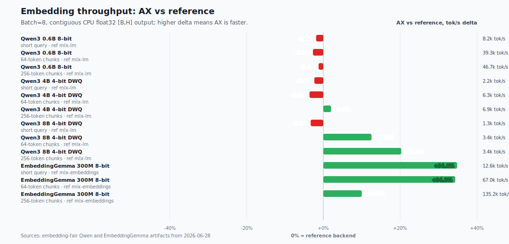

# AX Engine

AX Engine is a Mac-first LLM inference runtime for Apple Silicon developers who
want local models to be fast, inspectable, and easy to serve. It is not just a
wrapper around `mlx_lm`: for direct-support Gemma, Qwen, and GLM families,
AX Engine owns the MLX graph path, KV/runtime behavior, server route, model
packaging, and benchmark contract.

## Why AX Engine

AX Engine is built to win the full interactive local-model path, not just report
one isolated kernel number. In the current public direct-mode matrix, AX Engine
leads `mlx_lm` on prefill and TTFT at 128 and 512 prompt tokens for every listed
model — and at 2,048 tokens for most, settling within ~2% of parity at the
largest context. Direct decode is tracked separately and is mixed by model, with
peer rows and model-specific boundaries kept visible.

- **First-class MTP:** one-command MTP package preparation through
  `ax-engine download-mtp`, including the Gemma 4 12B 4-bit quick-start target
  plus recommended 6-bit MTP benchmarking and 4-bit comparison lanes.
- **Simple local serving:** install the wheel, download or prepare a model, then
  run the printed `ax-engine serve ...` command for OpenAI-compatible local
  endpoints.
- **Repo-owned direct runtime:** direct-support Gemma, Qwen, and GLM paths run
  in AX Engine's MLX runtime; delegated `mlx-lm`, delegated `llama.cpp`, and
  experimental model paths stay explicit instead of hidden behind one label.
- **Serious benchmarking:** public results are tied to checked-in artifacts that
  record route identity, model snapshot, prompt suite, sampler, cooldowns,
  repetitions, MTP accept rate, prefill, decode, TTFT, and dirty-state
  provenance.
- **Agent-oriented support:** Qwen3-Coder-Next is called out separately from the
  Qwen3.6 family because it carries a coding-first architecture and validation
  path.

## Table of Contents

- [Why AX Engine](#why-ax-engine)
- [Quick Start](#quick-start)
- [Installation](#installation)
- [Getting a Model](#getting-a-model)
- [Typical Hardware](#typical-hardware)
- [What AX Engine Does](#what-ax-engine-does)
- [Performance](#performance)
  - [Speculative Decoding (MTP)](#speculative-decoding-mtp)
    - [Supported MTP packages](#supported-mtp-packages)
    - [Download and serve an MTP package](#download-and-serve-an-mtp-package)
    - [AX-only supported 6-bit MTP acceleration (2026-07-01)](#ax-only-supported-6-bit-mtp-acceleration-2026-07-01)
    - [Qwen3.6 MTP peer decode comparison (2026-07-01)](#qwen36-mtp-peer-decode-comparison-2026-07-01)
    - [Qwen3.6 MTP matrix refresh (2026-06-29)](#qwen36-mtp-matrix-refresh-2026-06-29)
    - [Gemma 4 assistant-MTP (depth-2)](#gemma-4-assistant-mtp-depth-2)
  - [Direct Mode (Decode · Prefill · TTFT)](#direct-mode-decode--prefill--ttft)
    - [Gemma 4 12B](#gemma-4-12b)
    - [Gemma 4 and Qwen 3.6](#gemma-4-and-qwen-36)
  - [Embedding Models](#embedding-models)
    - [Fair embedding throughput (tok/s)](#fair-embedding-throughput-toks)
    - [Large-corpus ingest scale](#large-corpus-ingest-scale)
- [SDKs](#sdks)
- [Server Usage](#server-usage)
- [Documentation](#documentation)
- [Workspace](#workspace)
- [Development](#development)
- [Benchmark Reference Projects](#benchmark-reference-projects)
- [Limitations](#limitations)
- [Contributing](#contributing)
- [Community](#community)
- [Acknowledgments](#acknowledgments)
- [License](#license)

## Quick Start

**Install** (macOS 26 Tahoe or later, Apple Silicon only — see [Typical Hardware](#typical-hardware)):

Upgrade pip first so pip 23+ can find the macOS wheel, and keep the package
spec quoted for zsh.

```bash
python3 -m pip install --upgrade pip
python3 -m pip install -U "ax-engine[download]>=6.6.1,<7"
```

**Download a Gemma 4 12B MTP package:**

```bash
ax-engine download-mtp gemma-4-12b-4bit
# Then run the printed "ax-engine serve ..." command.
```

**Send one request from another terminal:**

```bash
curl http://127.0.0.1:8080/v1/chat/completions \
  -H 'content-type: application/json' \
  -d '{"model":"gemma-4-12b-it","messages":[{"role":"user","content":"Say hello in one sentence."}],"max_tokens":64}'
```

For model choices, SDK examples, Homebrew, and source builds, see the
[Getting Started guide](docs/GETTING-STARTED.md) and [SDK docs](docs/sdk/README.md).

> Quick Start requires **macOS 26 (Tahoe) or later** on **Apple Silicon M2 Max or newer**.
> The Gemma 4 12B MTP path is intended for high-memory machines; use the memory tiers
> listed in [Typical Hardware](#typical-hardware). Earlier macOS releases are not supported —
> there is no wheel or binary for them.

## Installation

For platform requirements, troubleshooting, optional extras, Homebrew, source
builds, and release-channel diagnostics, see the
[Getting Started installation guide](docs/GETTING-STARTED.md#installation).

## Getting a Model

AX Engine loads pre-sanitized MLX safetensors plus an AX
`model-manifest.json`. Use `ax-engine tui` for an interactive picker,
`ax-engine download --list` for direct-decode aliases, `ax-engine serve <alias>
--download` for one-command serving, and `ax-engine download-mtp <target>` for
supported MTP packages.
Detailed aliases, MTP targets, raw checkpoint conversion, cache behavior, and
manifest commands live in
[Supported Models](docs/SUPPORTED-MODELS.md#getting-model-artifacts) and the
[CLI reference](docs/CLI.md#ax-engine).

```bash
# Browse models, queue downloads, choose destinations, and launch serving.
ax-engine tui

# Serve a direct model in one command.
ax-engine serve qwen36-35b --download --port 8080

# Or inspect and download direct-model artifacts separately.
ax-engine download --list
ax-engine download qwen36-35b --json

# Prepare a Gemma 4 12B MTP package.
ax-engine download-mtp gemma-4-12b-4bit
```

`ax-engine tui` lists downloadable model families, groups precision variants,
offers Direct-vs-MTP choices, and sends long downloads to a background queue so
you can keep browsing other models. The destination picker defaults to the
shared Hugging Face Hub cache and can also select a parent directory from a
terminal directory tree; direct downloads use `--dest`, and MTP packages use
`--output`. The Downloads tab shows live bytes/s and logs, and a ready item can
be served directly from the TUI. Scripts and CI keep the non-interactive
`download` behavior and JSON output.

Common acquisition paths:

| Model/package | Command | Runtime path |
| --- | --- | --- |
| Direct MLX models | `ax-engine download <alias-or-mlx-community-repo>` | Repo-owned MLX graph |
| Gemma 4 12B quick-start MTP | `ax-engine download-mtp gemma-4-12b-4bit` | Gemma assistant-MTP |
| Qwen3.6 27B / 35B-A3B MTP | `ax-engine download-mtp qwen3.6-27b-6bit` or `qwen3.6-35b-a3b` | Qwen fused MTP sidecar |
| Gemma 4 12B / 26B / 31B 6-bit MTP | `ax-engine download-mtp gemma-4-12b`, `gemma-4-26b`, or `gemma-4-31b` | Gemma assistant-MTP |
| GLM-4.7 Flash MTP | `ax-engine download-mtp glm-4.7-flash` | GLM built-in MTP sidecar |
| Raw Hugging Face checkpoints | Convert with `mlx_lm.convert`, then run `ax-engine-bench generate-manifest` | Direct only after sanitization |

Direct-support model families:

| Family | Direct model IDs | Notes |
| --- | --- | --- |
| Gemma 4 | `gemma-4-e2b-it`, `gemma-4-e4b-it`, `gemma-4-12b-it`, `gemma-4-26b-a4b-it`, `gemma-4-31b-it` | MLX affine 4/5/6-bit weights; assistant-MTP paths |
| Qwen 3 | `Qwen3-4B-4bit` and manifest-backed dense checkpoints | Dense SwiGLU graph |
| Qwen 3.5 | `Qwen3.5-9B-MLX-4bit` | GatedDeltaNet linear attention |
| Qwen 3.6 | `Qwen3.6-35B-A3B` 4/6-bit, `Qwen3.6-27B` 4/5/6-bit | `qwen3_next`; fused sidecar-MTP paths |
| Qwen3-Coder-Next | `Qwen3-Coder-Next-4bit` | Direct coding-agent path |
| GLM 4.7 Flash | `glm4_moe_lite` / `glm4.7-flash-4bit` | Flash MLA + MoE graph |

Direct support means AX owns the `ax-engine-mlx` graph and loads MLX safetensors
through the AX manifest path. Other MLX text models can use
`mlx_lm_delegated`; GGUF and non-MLX local inference can use `llama_cpp`.

## Typical Hardware

AX Engine targets high-memory Apple Silicon Macs running macOS 26 (Tahoe) or
later. Start at 32 GB unified memory for small models; use 64 GB, 128 GB, or
larger machines when running the recommended local chatbot, agent, and coding
model stack.

Full sizing tables and model-stack recommendations live in the
[hardware FAQ](docs/FAQ.md#what-hardware-does-ax-engine-support) and
[model-stack FAQ](docs/FAQ.md#what-model-stack-should-i-run-on-high-memory-apple-silicon).

## What AX Engine Does

AX Engine is a local inference runtime for high-memory Apple Silicon Macs. It
keeps model acquisition, serving, acceleration, and benchmark evidence behind
one explicit runtime contract:

- **Serve local models through stable APIs.** The server exposes OpenAI-shaped
  chat/completions, native generate routes, Ollama-compatible chat, SDK
  sessions, and route metadata.
- **Run supported MLX models in a repo-owned runtime.** Direct-support families
  use AX-owned model graphs, tokenizer/KV handling, scheduling, and runtime
  telemetry.
- **Prepare acceleration-ready packages.** `download-mtp` packages Qwen fused
  sidecars, Gemma assistant drafters, and GLM built-in MTP sidecars; n-gram
  acceleration remains a separate direct-runtime policy.
- **Keep long sessions efficient.** Prefix reuse restores validated physical
  MLX KV snapshots so chat and agent loops avoid repeatedly pre-filling the
  same context.
- **Benchmark the contract, not just kernels.** `ax-engine-bench` preserves
  route identity, sampler settings, prompt shape, correctness checks, and
  artifact provenance for public claims.

[mlx_lm](https://github.com/ml-explore/mlx-lm) is the canonical MLX reference.
AX Engine compares against `mlx_lm.benchmark` and uses `mlx_lm.server` only as
an explicit delegated compatibility route when AX does not yet own the model
graph. See the [FAQ](docs/FAQ.md#is-ax-faster-because-it-replaces-mlx-kernels)
for the boundary between MLX kernels and AX-owned runtime behavior.

Design details: [Architecture](docs/ARCHITECTURE.md) ·
[Scheduler](docs/SCHEDULER.md) · [KV Cache](docs/KV-CACHE.md) ·
[Long Context](docs/LONG-CONTEXT.md) · [Benchmark Design](docs/BENCH-DESIGN.md).

### Runtime Paths

| Path | Use it for | What AX owns |
| --- | --- | --- |
| Repo-owned MLX runtime | Direct-support model families and AX-owned performance claims | Model graph, token/KV runtime, scheduling, acceleration policy, server/SDK route behavior |
| `mlx_lm_delegated` | MLX text models supported upstream before AX has a graph | AX route compatibility over a user-provided `mlx_lm.server`; not AX token/KV throughput |
| `llama_cpp` | GGUF and non-MLX local inference | AX route compatibility over llama.cpp server/CLI behavior; not AX MLX throughput |

Runtime reports expose `selected_backend`, `support_tier`, and
`resolution_policy` so callers and benchmark artifacts can distinguish direct
execution from delegated compatibility. For endpoint details, see
[`docs/API-COMPATIBILITY.md`](docs/API-COMPATIBILITY.md).

## Performance

Full result tables and interpretation live in
[`docs/PERFORMANCE.md`](docs/PERFORMANCE.md). Public claim boundaries live in
[`docs/performance/README.md`](docs/performance/README.md). Benchmark
methodology, test setup, and reproduction details live in
[`docs/BENCHMARKS.md`](docs/BENCHMARKS.md).

Results are grouped by Session mode: speculative decoding (MTP), direct decode,
and embeddings.

### Speculative Decoding (MTP)

AX Engine supports three MTP packaging contracts in the repo-owned runtime: Qwen
fused sidecars, Gemma assistant drafters, and GLM built-in MTP sidecars. The
cross-engine peer comparison is Qwen-only — Qwen3.6 27B and Qwen3.6 35B-A3B,
each at 4-bit and 6-bit, MTP-only rows — because MTPLX and lightning-mlx ship
comparable Qwen MTP packages but no comparable Gemma or GLM one. Gemma 4
assistant-MTP is published separately below as an AX-only depth result, since no
peer engine ships the same package. Same-package direct baselines may be kept as
AX diagnostics, but they are not headline MTP matrix rows.

#### Supported MTP packages

Use `ax-engine download-mtp <target>` for the packages below. These targets are
the supported repo-owned MTP preparation paths; direct-model aliases are listed
separately in [Getting a Model](#getting-a-model).

| Target | Base model | MTP package |
| --- | --- | --- |
| `gemma-4-12b-4bit` | `mlx-community/gemma-4-12B-it-4bit` | Quick-start Gemma assistant-MTP package with `mlx-community/gemma-4-12B-it-assistant-4bit` |
| `qwen3.6-27b-6bit` | `mlx-community/Qwen3.6-27B-6bit` | Qwen fused sidecar from `Qwen/Qwen3.6-27B` |
| `qwen3.6-35b-a3b` | `mlx-community/Qwen3.6-35B-A3B-6bit` | Qwen fused sidecar from `Qwen/Qwen3.6-35B-A3B` |
| `gemma-4-12b` | `mlx-community/gemma-4-12B-it-6bit` | Gemma assistant-MTP package with `mlx-community/gemma-4-12B-it-assistant-6bit` |
| `gemma-4-26b` | `mlx-community/gemma-4-26b-a4b-it-6bit` | Gemma assistant-MTP package with `google/gemma-4-26b-a4b-it-assistant` |
| `gemma-4-31b` | `mlx-community/gemma-4-31b-it-6bit` | Gemma assistant-MTP package with `google/gemma-4-31b-it-assistant` |
| `glm-4.7-flash` | `mlx-community/GLM-4.7-Flash-6bit` | GLM built-in MTP layer extracted from `zai-org/GLM-4.7-Flash` |

The practical AX Engine benchmark lane is the 6-bit `download-mtp` set. The
`gemma-4-12b-4bit` target is kept as the Quick Start path, and Qwen 4-bit
packages are comparison artifacts for peer MTP engines rather than normal
`download-mtp` targets.

#### Download and serve an MTP package

Install with the download extra, prepare a target, then run the serve command
printed by the CLI:

```bash
python3 -m pip install -U "ax-engine[download]>=6.6.1,<7"

ax-engine download-mtp gemma-4-12b-4bit
# or: ax-engine download-mtp qwen3.6-27b-6bit
# or: ax-engine download-mtp glm-4.7-flash

# The command prints the prepared package path and a matching:
# ax-engine serve <prepared-mtp-package> --port 8080
```

By default, packages are written as synthetic Hugging Face cache snapshots under
the active HF cache root. Use `--output <dir>` when you need an explicit
destination, `--force` to rebuild an existing package, and `--json` for scripts.
See [Supported Models](docs/SUPPORTED-MODELS.md#mtp-downloads) and the
[CLI reference](docs/CLI.md#ax-engine) for aliases and advanced options.

#### Benchmark scope

| Target | Preparation / source | Benchmark mode |
| --- | --- | --- |
| `qwen3.6-27b-4bit` | prepared Qwen fused sidecar | Qwen fused sidecar MTP |
| `qwen3.6-27b-6bit` | `ax-engine download-mtp qwen3.6-27b-6bit` | Qwen fused sidecar MTP |
| `qwen3.6-35b-a3b-4bit` | prepared Qwen fused sidecar | Qwen fused sidecar MTP |
| `qwen3.6-35b-a3b` | `ax-engine download-mtp qwen3.6-35b-a3b` | Qwen fused sidecar MTP |
| `gemma-4-12b` | `ax-engine download-mtp gemma-4-12b` | Gemma assistant-MTP |
| `gemma-4-26b` | `ax-engine download-mtp gemma-4-26b` | Gemma assistant-MTP |
| `gemma-4-31b` | `ax-engine download-mtp gemma-4-31b` | Gemma assistant-MTP |
| `glm-4.7-flash` | `ax-engine download-mtp glm-4.7-flash` | GLM built-in MTP |

Rules for current MTP benchmark artifacts:

- Use MTP mode for all promoted rows.
- Report decode tok/s, prefill tok/s, TTFT ms, and MTP accept rate.
- Keep unsupported MTPLX, lightning-mlx, Rapid-MLX, or oMLX lanes visible in
  the plan with their support reason.
- Do not run or promote `mtp-ngram` rows.
- Keep the Qwen3.6 peer matrix free of Qwen3-Coder-Next, 5-bit, 8-bit, FFN-only,
  GGUF, and GLM variants; Gemma 4 assistant-MTP is published as a separate
  AX-only subsection, not mixed into the cross-engine matrix.
- Direct rows are same-artifact denominators for `AX MTP / AX direct` decode
  acceleration, not a cross-model speed leaderboard.
- Keep promoted peer rows on strict AX MTP verification
  (`AX_MLX_MTP_OPTIMISTIC=0`). Optimistic verify is useful for AX-only
  throughput experiments, but it is not a clean peer-comparison default.

The benchmark prompt suites remain `flappy`, `long_code`, and
`python_modules_long`, with sampled decode (`temperature=0.6`, `top_p=0.95`,
`top_k=20`), `1000` generated tokens, `5` measured repetitions, and recorded
cooldown. Current matrix artifacts live under
`benchmarks/results/mtp-qwen36-matrix/`. Every artifact records the exact model
snapshot or peer model id, MTP package provenance where applicable, route
identity, accept rate, prefill throughput, decode throughput, TTFT, sampler,
prompt suite, repetitions, and cooldown.

Plan without running inference:

```bash
python3 scripts/bench_qwen36_mtp_matrix.py
```

Run supported lanes:

```bash
python3 scripts/bench_qwen36_mtp_matrix.py --execute
```

For production-like AX Engine guidance, use the 6-bit lane. The 4-bit lane is
published to make comparison with other MTP engines easier because many peer
benchmarks use 4-bit models. Historical MTP+n-gram artifacts remain useful for
debugging regressions, but they are not current README/PERFORMANCE MTP evidence.

#### AX-only supported 6-bit MTP acceleration (2026-07-01)

The supported-model MTP refresh below is **AX Engine only**. It exists to show
how much MTP accelerates each repo-owned 6-bit `download-mtp` package against
the same package with MTP disabled; it is not a cross-engine leaderboard and it
should not be mixed with the Qwen peer comparison below. Every row uses the
`flappy` suite, sampled decode (`temperature=0.6`, `top_p=0.95`, `top_k=20`),
1000 generated tokens, 5 measured repetitions, 1 warmup, 15 s cooldown, and a
clean `d4c59ffc` build.


| Target | AX direct decode | AX MTP decode | AX speedup | AX MTP prefill | AX MTP TTFT | AX accept |
| --- | ---: | ---: | ---: | ---: | ---: | ---: |
| `qwen3.6-27b-6bit` | 18.6 tok/s | 43.6 tok/s | 2.34x | 766.6 tok/s | 420 ms | 100.0% |
| `qwen3.6-35b-a3b` | 41.3 tok/s | 142.7 tok/s | 3.45x | 1,818.4 tok/s | 178 ms | 100.0% |
| `gemma-4-12b` | 27.9 tok/s | 79.3 tok/s | 2.84x | 1,827.2 tok/s | 189 ms | 100.0% |
| `gemma-4-26b` | 46.2 tok/s | 120.0 tok/s | 2.60x | 2,411.1 tok/s | 144 ms | 100.0% |
| `gemma-4-31b` | 15.2 tok/s | 28.3 tok/s | 1.87x | 699.8 tok/s | 478 ms | 100.0% |
| `glm-4.7-flash` | 51.2 tok/s | 97.5 tok/s | 1.90x | 1,694.3 tok/s | 163 ms | 100.0% |

All rows are pure MTP verification rows with zero n-gram accepted/proposed/
submitted/hit-step telemetry. Full artifacts:
[`benchmarks/results/mtp-6bit/2026-07-01-six-model-flappy-ax-mtp-vs-direct-clean-r2/summary.json`](benchmarks/results/mtp-6bit/2026-07-01-six-model-flappy-ax-mtp-vs-direct-clean-r2/summary.json).

#### Qwen3.6 MTP peer decode comparison (2026-07-01)

README keeps only the decode-throughput view for the Qwen3.6 MTP peer
comparison because decode is the closest comparable metric across AX Engine,
MTPLX, and lightning-mlx. The full benchmark page explains why prefill, TTFT,
accept rate, seed policy, model-artifact identity, and output-degeneracy checks
need separate interpretation:
[`docs/mtp/qwen36-peer-comparison.md`](docs/mtp/qwen36-peer-comparison.md).

This is a stitched peer comparison, not one interleaved physical-session
benchmark. The 27B 4-bit rows now load the same
`ax-local/Qwen3.6-27B-MTP` sidecar across AX Engine, MTPLX, and lightning-mlx;
the 35B-A3B peer rows remain production-configuration rows with the peer
engines' Youssofal MTPLX-optimized packages. The AX 27B 4-bit row uses strict
MTP verification and passes the output-degeneracy gate; older optimistic
artifacts remain useful only as audit/debug evidence.


| Target | AX Engine decode | MTPLX decode | lightning-mlx decode | Readout |
| --- | ---: | ---: | ---: | --- |
| Qwen3.6 27B 4-bit | 61.0 tok/s | 58.5 tok/s | 55.7 tok/s | Same AX sidecar across all three engines; AX leads this row |
| Qwen3.6 27B 6-bit | 40.7 tok/s | - | - | No official comparable peer 27B 6-bit MTP artifact |
| Qwen3.6 35B-A3B 4-bit | 169.9 tok/s | 138.1 tok/s | 116.2 tok/s | AX leads this production-config row |
| Qwen3.6 35B-A3B 6-bit | 140.0 tok/s | 117.6 tok/s | 96.3 tok/s | AX leads this production-config row |

Full results, charts, artifact links, and fairness limitations:
[`docs/mtp/qwen36-peer-comparison.md`](docs/mtp/qwen36-peer-comparison.md).

Rapid-MLX is intentionally not promoted in this table: it starts with the
shared Qwen3.6 artifacts but skips MTP installation for this generation flow, so
including it would measure non-MTP decode. oMLX remains unmeasured because this
repo does not yet have an oMLX Qwen3.6 MTP prompt-suite adapter.

#### Qwen3.6 MTP matrix refresh (2026-06-29)

The full AX Engine pure-MTP matrix table, methodology, and enablement-smoke
artifact notes moved to
[`docs/mtp/qwen36-matrix-refresh.md`](docs/mtp/qwen36-matrix-refresh.md).
README keeps the peer decode view above and links out for the longer
multi-suite AX-only matrix details.

#### Gemma 4 assistant-MTP (depth-2)

Gemma 4 speculates with an **assistant-drafter** package, not a Qwen-style fused
sidecar, so no peer engine ships the same Gemma MTP package — MTPLX and
lightning-mlx have no comparable Gemma assistant-MTP route. The result below is
therefore an AX-only depth comparison (the drafter's own depth-1 single-token
baseline versus depth-2 recurrent drafting), not a cross-engine leaderboard. The
assistant is stateless per decode step — it re-reads the target's frozen KV
cache each forward — so depth-2 drafting needs no cache surgery and stays
correctness-preserving: a gate miss simply verifies fewer speculative positions,
never a changed committed token.

Canonical 26B benchmark (M5 Max, `temperature=0.6`, `top_p=0.95`, `top_k=20`,
chat-templated `flappy` / `long_code` / `python_modules_long`, n-gram stacking
off, depth-2 at a uniform `0.999` deep-position confidence gate):

| Suite | Depth-1 accept | Depth-2 accept | Depth-1 decode | Depth-2 decode | Speedup |
| --- | ---: | ---: | ---: | ---: | ---: |
| `flappy` | 98.7% | 98.3% | 136.9 tok/s | 151.3 tok/s | 1.10x |
| `long_code` | 98.1% | 97.7% | 125.8 tok/s | 139.3 tok/s | 1.11x |
| `python_modules_long` | 99.0% | 98.2% | 128.4 tok/s | 154.5 tok/s | 1.20x |

All three suites hold assistant accept **>97%** at **1.10-1.20x** decode, and
depth-2 is accept-neutral versus depth-1 (the second token only fires in
confident contexts). Depth-2 at `0.999` is the constrained optimum under "raise
decode while holding >97% accept": depth-3 breaks the accept floor
(`python_modules_long` falls to about 0.937), and a looser gate lowers accept
for no extra speed. Depth-2 is the shipped default; set
`AX_MLX_GEMMA4_ASSISTANT_MTP_MAX_DEPTH=1` to restore single-token drafting.
Method, gate sweep, and per-suite detail:
[`docs/mtp/gemma4-assistant-multi-depth.md`](docs/mtp/gemma4-assistant-multi-depth.md);
result artifacts under
[`benchmarks/results/gemma4-assistant-mtp/`](benchmarks/results/gemma4-assistant-mtp/).

### Direct Mode (Decode · Prefill · TTFT)

#### Gemma 4 12B

Gemma 4 12B (`model_type: gemma4_unified`) is reported separately from the per-layer-embedding
E2B/E4B and MoE 26B/31B checkpoints because it has a distinct graph, multimodal tensor contract,
and benchmark boundary. **Upstream `mlx_lm` 0.31.3 cannot load it**
(`ValueError: Model type gemma4_unified not supported`), so the direct peer here is
**llama.cpp Metal** on a shape-compatible GGUF.

> [!NOTE]
> **AX Engine's repo-owned native MLX route supports Gemma 4 12B text plus inline base64
> image/audio/video chat.** Delegated compatibility routes remain text-first;
> `/v1/generate` accepts the processed `multimodal_inputs.gemma4_unified` tensor contract.

**At a glance:**

- **Direct decode:** AX native MLX reaches **65.3-69.1 tok/s** on the bit-comparable
  4-bit-FFN artifact versus llama.cpp Metal's **56.9-58.7 tok/s** depth-matched range.
- **Context depth:** AX's direct margin is **+21% / +15% / +14%** versus llama.cpp matched-depth decode at 128 / 512 / 2,048 prompt tokens.
- **Assistant-MTP:** Gemma assistant-MTP remains a supported runtime package,
  but it is outside the current Qwen-only MTP benchmark publication scope.
- **Why the earlier result flipped:** the upstream MLX snapshot keeps FFN weights at
  8-bit, so it reads about **1.65x** the bytes of the re-quantized 4-bit-FFN artifact.
  Decode is bandwidth-bound; matching quantization closes the gap.

**Direct decode peer comparison:**

AX direct rows use the 4-bit-FFN MLX artifact and random-token prompts. `mlx_lm` is absent
because it has no `gemma4_unified` graph. The llama.cpp rows are shape-compatible external
GGUF references, not prompt-hash-parity MLX rows.

<table>
<tr>
<td>

</td>
<td>

</td>
<td>

</td>
</tr>
</table>

| Prompt tokens | AX decode | llama.cpp decode (depth 0) | llama.cpp decode (matched depth) | AX prefill | llama.cpp prefill | AX TTFT (ms) | llama.cpp TTFT (ms) |
| ---: | ---: | ---: | ---: | ---: | ---: | ---: | ---: |
| 128 | 69.1 | 57.1 | 56.9 | 1,180 | 1,245 | 108 | 103 |
| 512 | 67.5 | 57.3 | 58.7 | 1,883 | 1,740 | 272 | 294 |
| 2048 | 65.3 | 56.0 | 57.5 | 2,062 | 1,544 | 993 | 1,327 |

Read the two llama.cpp decode columns carefully:

- `depth 0` is plain `llama-bench tg`, decoding from an empty context and representing llama.cpp's best case.
- `matched depth` uses `-d {prompt} -n 128`, so decode happens after the same prompt depth AX has already prefetched.
- AX wins the matched-depth comparison at every prompt size, and prefill also leads at 512 and 2,048 tokens.

The table uses the bit-comparable **4-bit-FFN** AX artifact
(`scripts/requantize_gemma4_12b_ffn_4bit.py`), about 4.5 bpw versus the Q4_K_M GGUF's
about 4.8 bpw. The upstream `mlx-community/gemma-4-12B-it-4bit` snapshot keeps the FFN at
**8-bit** (~10.98 GB) and trails llama.cpp at about 46 tok/s. That is a bytes-read handicap,
not an AX runtime result.

**Memory bandwidth diagnostic:**

This chart is a diagnostic for the Gemma 4 12B quantization story, not a
recommendation to use an 8-bit tier. The "upstream artifact" row is included
only because the public `mlx-community/gemma-4-12B-it-4bit` snapshot keeps FFN
tensors at 8-bit; it explains the older slower AX result. Decode is
memory-bandwidth-bound on Apple Silicon: each token reads the model weights
once, so decode tok/s is set by bytes-read and how close the engine gets to the
memory ceiling. Measured M5 Max GPU peak read bandwidth ≈ 577 GB/s (MLX
reduction over a 6 GB array).


| Engine / quantization | Weights/token | Decode tok/s | Effective BW | % of 577 GB/s peak |
| --- | ---: | ---: | ---: | ---: |
| AX upstream artifact — 8-bit FFN diagnostic | 10.98 GB | 45.4 | 498 GB/s | 86% |
| AX re-quantized artifact — 4-bit FFN | 6.74 GB | 67.3 | 454 GB/s | 79% |
| llama.cpp Q4_K_M — decode @ depth 512 | 7.38 GB | 58.7 | 433 GB/s | 75% |
| llama.cpp Q4_K_M — decode @ depth 0 (`tg`) | 7.38 GB | 57.1 | 421 GB/s | 73% |

The bandwidth view is the key explanation: AX is not under-utilizing memory. The re-quantized
AX row sustains **454 GB/s**, in the same band as llama.cpp's **433 GB/s** at matched depth.
The remaining direct-decode difference is bytes read per token: uniform 4-bit group-64 reduces
AX to **6.74 GB/token**, while Q4_K_M reads **7.38 GB/token**. The upstream artifact
has higher bus utilization (86%) but worse speed because its FFN tensors read far more data.

**Methodology and artifacts:**

Direct rows use the 4-bit-FFN artifact, greedy-equivalent sampler, 128 generated tokens,
5 repetitions, 15 s cooldown, and random-token prompts following the `mlx_lm.benchmark`
contract. llama.cpp decode is shown both at depth 0 (`tg`) and at matched context depth
(`-d {prompt}`). Host/runtime for the latest direct llama.cpp peer rerun: Apple M5 Max ·
llama.cpp b9820 / ggml 0.15.3 (Metal, flash-attn) · `mlx_lm` 0.31.3 has no `gemma4_unified`
support. MTP methodology and artifacts live with
[Speculative Decoding (MTP)](#speculative-decoding-mtp).

The llama.cpp peer columns are measured on llama.cpp b9820 / ggml 0.15.3; full per-prompt
llama.cpp data is in the verification artifact
[`gemma-4-12b-it-4bit-b9820-verify.json`](benchmarks/results/llama-cpp-metal/2026-06-27-llama-only-rerun/gemma-4-12b-it-4bit-b9820-verify.json).
The AX rows come from the direct-only AX artifact below, so these columns are a shape-compatible
cross-run comparison, not a single-session A/B.

Full artifacts:
[`2026-06-26-gemma4-12b-4bit-ax-direct-only`](benchmarks/results/mlx-inference/2026-06-26-gemma4-12b-4bit-ax-direct-only/gemma-4-12b-it-4bit.json)
(AX direct rerun; chart artifact with retained llama.cpp reference rows in
[`gemma-4-12b-it-4bit-with-llama-reference.json`][ref-json];
llama.cpp GGUF provenance in
[`llama_cpp_gguf_provenance.json`](benchmarks/results/mlx-inference/2026-06-26-gemma4-12b-4bit-ax-direct-only/llama_cpp_gguf_provenance.json)).
The upstream 8-bit-FFN bandwidth row is backed by
[`2026-06-26-gemma4-12b-upstream-8bit-ffn-ax-direct-only`](benchmarks/results/mlx-inference/2026-06-26-gemma4-12b-upstream-8bit-ffn-ax-direct-only/gemma-4-12b-it-4bit.json).

Gemma 4 12B multimodal benchmark details now live in
[Benchmarks](docs/BENCHMARKS.md#gemma-4-12b-multimodal-benchmark).

Gemma assistant-MTP package layout and cache-location details live in
[Supported Models](docs/SUPPORTED-MODELS.md#mtp-downloads).

<!-- readme-performance-artifacts: reference=benchmarks/results/mlx-inference/2026-05-26-direct-mode-clean-refresh/; reference=benchmarks/results/mlx-inference/2026-06-26-qwen36-direct-refresh/; reference=benchmarks/results/mlx-inference/2026-06-26-gemma4-6bit-mlx-lm-only/; ax-base=benchmarks/results/mlx-inference/2026-06-27-ax-direct-only/; ax-overlay=benchmarks/results/mlx-inference/2026-07-01-ax-direct-4bit-refresh-clean-r2/ -->

#### Gemma 4 and Qwen 3.6

The family tables below compare **direct (non-speculative) decode** across llama.cpp Metal, mlx_lm, and ax engine, covering Gemma 4 and Qwen 3.6 at 128/512/2048 prompt tokens. `ax direct baseline` disables n-gram acceleration, MTP, and assistant drafting to measure the repo-owned direct decode path. Bench prompts are `mlx_lm.benchmark` seed-0 random tokens, which keeps prompt-hash parity across MLX rows.

The prefill and TTFT advantage is the practical direct-mode story. The refreshed 4-bit rows come from `benchmarks/results/mlx-inference/2026-07-01-ax-direct-4bit-refresh-clean-r2/` and record clean build commit `d4c59ffc`; AX leads `mlx_lm` on prefill, TTFT, and decode for every refreshed Gemma 4 and Qwen 3.6 4-bit row. The older 6-bit rows remain model-dependent and are kept in the table with their original artifact provenance. That means the repo-owned MLX route is especially valuable for interactive requests where prompt ingestion dominates perceived latency: AX keeps prompt prefill, first-token timing, model-specific graph paths, and route metadata in one measured runtime path. These are cold-prefix rows, not prompt-cache, continuous-batching, or speculative-decoding claims.

<table>
<tr>
<td></td>
<td align="center"><strong>Gemma 4</strong></td>
<td align="center"><strong>Qwen 3.6</strong></td>
</tr>
<tr>
<td align="center"><strong>Decode rate</strong></td>
<td></td>
<td></td>
</tr>
<tr>
<td align="center"><strong>Prefill rate</strong></td>
<td></td>
<td></td>
</tr>
<tr>
<td align="center"><strong>TTFT</strong></td>
<td></td>
<td></td>
</tr>
</table>

> **`llama.cpp Metal*` column** — Shape-compatible reference produced by Metal-enabled `llama-bench`. `llama-bench` generates its own internal synthetic prompt tokens and does not consume the harness prompt JSON, so these numbers are **not** prompt-hash parity with the other columns. No percentage delta is shown. MLX bit-widths are mapped to the nearest Unsloth GGUF quant (4→Q4_K_M, 6→Q6_K), with explicit UD-* Unsloth Dynamic rows only when no standard root-level K-quant is published. Source: `benchmarks/manifests/llama_cpp_metal/inventory.json`, `scripts/bench_llama_cpp_metal_sweep.py`.

<details>
<summary>Benchmark provenance and methodology</summary>

The `mlx_lm` reference rows for the Gemma 4 rows shown below come from `benchmarks/results/mlx-inference/2026-05-26-direct-mode-clean-refresh/`. The Gemma 4 26B A4B and 31B 6-bit `mlx_lm` spot rows come from `benchmarks/results/mlx-inference/2026-06-26-gemma4-6bit-mlx-lm-only/`. The refreshed 4-bit AX direct-mode cells come from `benchmarks/results/mlx-inference/2026-07-01-ax-direct-4bit-refresh-clean-r2/`, which reran AX Engine only for Gemma 4 E2B/E4B/26B/31B and Qwen 3.6 27B/35B-A3B at 128/512/2048 prompt tokens with 5 repetitions, 1 warmup, and a 15 s cooldown. Those artifacts record benchmark build commit `d4c59ffc` and `git_tracked_dirty: false`. The remaining 6-bit AX direct-mode cells come from the earlier ax-engine-only rerun in `benchmarks/results/mlx-inference/2026-06-27-ax-direct-only/` using benchmark build `v6.5.2`: a clean `ax-engine-server` build at commit `01976818`. Current install docs and package metadata track v6.6.1; each benchmark artifact's `build.commit` records the exact measured build SHA. The Qwen 3.6 `mlx_lm` reference rows come from `benchmarks/results/mlx-inference/2026-06-26-qwen36-direct-refresh/`. The `llama.cpp Metal*` column is injected from `benchmarks/manifests/llama_cpp_metal/inventory.json` and the full llama.cpp-only rerun in `benchmarks/results/llama-cpp-metal/2026-06-27-llama-only-rerun/`, which reran all 12 Gemma 4 + Qwen 3.6 rows (llama.cpp b9820, Metal, flash-attn, `-b/-ub` matched to prompt length, decode measured at matched context depth).

Gemma 4 E4B 6-bit keeps the `mlx_lm` cells blank because `mlx_lm.benchmark` cannot load `mlx-community/gemma-4-e4b-it-6bit` with `mlx-lm` 0.31.3. The checkpoint config declares 42 language layers and `num_kv_shared_layers=18`, so the upstream Gemma4 text model builds K/V projections only for layers 0..23 and treats layers 24..41 as shared-KV layers. The MLX snapshot still contains 126 per-layer K/V tensors for layers 24..41 (`k_norm`, `k_proj`, and `v_proj` quantized weights), causing strict weight loading to fail with `Received 126 parameters not in model`. Source: `benchmarks/results/mlx-inference/2026-06-26-gemma4-6bit-mlx-lm-only/summary.md`.

Setup: generation=128, 5 measured repetitions, 15-second cooldown, AX prefix cache disabled for cold prefill and TTFT measurement, production-build binaries, matching prompt SHA checks. Long-greedy AX prefill rows are runner-time measurements of the cache-state prefix plus final prompt-token boundary — not full-logits prompt scoring throughput. Percentages are versus `mlx_lm`.

The 2K `llama.cpp Metal*` prefill rows are long-context, GGUF-runtime-reference rows, produced with llama.cpp b9820 (Metal offload, `-b/-ub` matched to prompt length up to 2048, flash attention enabled). This is our benchmark boundary, not an upstream llama.cpp official bug statement.
</details>

Qwen 3.6 direct-mode verdict: AX is faster overall against `mlx_lm` across the refreshed 27B and 35B-A3B 4/6-bit rows. The 35B-A3B rows are faster in every listed prefill, decode, and TTFT cell; the dense 27B rows are faster at 128/512 prompt tokens and roughly flat to slightly slower at 2,048 prompt tokens.

#### Prefill throughput (tok/s) — percentages vs mlx_lm

| Model | MLX quantization | Prompt tok | llama.cpp Metal* | mlx_lm | ax engine |
| --- | --- | ---: | ---: | ---: | ---: |
| Gemma 4 E2B | 4-bit | 128 | 3,698.3 | 2,338.1 | **6,123.5 (+161.9%)** |
|  |  | 512 | 7,185.3 | 7,870.0 | **17,314.3 (+120.0%)** |
|  |  | 2048 | 7,461.6 | 18,014.7 | **24,664.6 (+36.9%)** |
| Gemma 4 E2B | 6-bit | 128 | 3,609.5 | 1,823.5 | **5,223.4 (+186.4%)** |
|  |  | 512 | 7,238.7 | 6,046.6 | **16,037.6 (+165.2%)** |
|  |  | 2048 | 7,476.6 | 15,332.1 | **18,906.1 (+23.3%)** |
| Gemma 4 E4B | 4-bit | 128 | 2,297.9 | 1,513.2 | **3,458.8 (+128.6%)** |
|  |  | 512 | 4,342.7 | 4,195.5 | **6,312.3 (+50.5%)** |
|  |  | 2048 | 4,306.1 | 7,325.4 | **8,848.8 (+20.8%)** |
| Gemma 4 E4B | 6-bit | 128 | 2,284.3 | — | **2,953.2** |
|  |  | 512 | 4,299.6 | — | **6,060.4** |
|  |  | 2048 | 4,119.2 | — | **7,563.8** |
| Gemma 4 26B A4B | 4-bit | 128 | 1,879.5 | 496.4 | **1,354.5 (+172.8%)** |
|  |  | 512 | 3,399.4 | 1,621.0 | **3,053.7 (+88.4%)** |
|  |  | 2048 | 3,544.7 | 3,300.1 | **4,675.5 (+41.7%)** |
| Gemma 4 26B A4B | 6-bit | 128 | 1,683.2 | 414.0 | **1,070.5 (+158.6%)** |
|  |  | 512 | 3,174.4 | 1,285.0 | **2,532.0 (+97.0%)** |
|  |  | 2048 | 3,268.2 | 3,312.9 | **4,071.5 (+22.9%)** |
| Gemma 4 31B | 4-bit | 128 | 530.0 | 283.1 | **513.0 (+81.2%)** |
|  |  | 512 | 631.7 | 619.9 | **741.5 (+19.6%)** |
|  |  | 2048 | 554.0 | 733.9 | **780.2 (+6.3%)** |
| Gemma 4 31B | 6-bit | 128 | 503.9 | 259.6 | **403.6 (+55.5%)** |
|  |  | 512 | 656.4 | 548.6 | **637.0 (+16.1%)** |
|  |  | 2048 | 566.2 | 675.0 | 671.9 (-0.5%) |
| Qwen 3.6 27B | 4-bit | 128 | 533.8 | 424.7 | **582.3 (+37.1%)** |
|  |  | 512 | 712.5 | 739.0 | **845.2 (+14.4%)** |
|  |  | 2048 | 639.6 | 914.9 | **935.4 (+2.2%)** |
| Qwen 3.6 27B | 6-bit | 128 | 534.5 | 348.0 | **490.7 (+41.0%)** |
|  |  | 512 | 446.6 | 655.1 | **761.5 (+16.2%)** |
|  |  | 2048 | 618.1 | 832.1 | **840.2 (+1.0%)** |
| Qwen 3.6 35B A3B | 4-bit | 128 | 1,687.9 | 562.4 | **1,101.6 (+95.9%)** |
|  |  | 512 | 3,060.0 | 1,613.6 | **2,542.3 (+57.6%)** |
|  |  | 2048 | 3,533.7 | 3,455.1 | **3,691.0 (+6.8%)** |
| Qwen 3.6 35B A3B | 6-bit | 128 | 1,547.5 | 431.6 | **875.9 (+102.9%)** |
|  |  | 512 | 2,110.0 | 1,394.4 | **2,396.8 (+71.9%)** |
|  |  | 2048 | 2,564.6 | 2,494.3 | **3,487.3 (+39.8%)** |

#### Decode throughput (tok/s) — generation=128 tokens, temp=0

| Model | MLX quantization | Prompt tok | llama.cpp Metal* | mlx_lm | ax direct baseline |
| --- | --- | ---: | ---: | ---: | ---: |
| Gemma 4 E2B | 4-bit | 128 | 169.2 | 214.0 | **234.8 (+9.7%)** |
|  |  | 512 | 166.7 | 210.3 | **227.4 (+8.2%)** |
|  |  | 2048 | 163.6 | 200.9 | **217.6 (+8.3%)** |
| Gemma 4 E2B | 6-bit | 128 | 145.8 | 172.2 | **178.0 (+3.4%)** |
|  |  | 512 | 145.4 | 166.3 | **179.2 (+7.8%)** |
|  |  | 2048 | 142.2 | 162.5 | **163.6 (+0.7%)** |
| Gemma 4 E4B | 4-bit | 128 | 108.0 | 137.1 | **144.5 (+5.4%)** |
|  |  | 512 | 108.2 | 133.6 | **141.5 (+5.9%)** |
|  |  | 2048 | 106.0 | 130.6 | **138.5 (+6.1%)** |
| Gemma 4 E4B | 6-bit | 128 | 90.0 | — | **105.8** |
|  |  | 512 | 89.8 | — | **104.8** |
|  |  | 2048 | 88.3 | — | **103.2** |
| Gemma 4 26B A4B | 4-bit | 128 | 98.2 | 127.9 | **135.3 (+5.8%)** |
|  |  | 512 | 97.8 | 125.0 | **132.1 (+5.7%)** |
|  |  | 2048 | 94.4 | 119.3 | **127.6 (+6.9%)** |
| Gemma 4 26B A4B | 6-bit | 128 | 94.7 | 103.7 | 98.0 (-5.5%) |
|  |  | 512 | 92.5 | 101.1 | 95.3 (-5.7%) |
|  |  | 2048 | 89.5 | 97.9 | **99.6 (+1.6%)** |
| Gemma 4 31B | 4-bit | 128 | 24.3 | 28.9 | **29.2 (+1.2%)** |
|  |  | 512 | 24.6 | 28.3 | **28.7 (+1.4%)** |
|  |  | 2048 | 23.9 | 27.0 | **27.5 (+1.6%)** |
| Gemma 4 31B | 6-bit | 128 | 18.8 | 19.6 | 18.4 (-5.8%) |
|  |  | 512 | 19.5 | 19.3 | 18.7 (-3.3%) |
|  |  | 2048 | 18.5 | 18.6 | 17.6 (-5.1%) |
| Qwen 3.6 27B | 4-bit | 128 | 26.3 | 33.2 | **35.0 (+5.2%)** |
|  |  | 512 | 26.5 | 33.1 | **34.9 (+5.6%)** |
|  |  | 2048 | 26.3 | 32.6 | **34.5 (+5.8%)** |
| Qwen 3.6 27B | 6-bit | 128 | 18.2 | 24.3 | **24.4 (+0.3%)** |
|  |  | 512 | 18.9 | 24.3 | **25.4 (+4.6%)** |
|  |  | 2048 | 19.7 | 24.1 | **24.8 (+3.0%)** |
| Qwen 3.6 35B A3B | 4-bit | 128 | 93.3 | 129.7 | **153.3 (+18.2%)** |
|  |  | 512 | 93.2 | 128.3 | **152.0 (+18.5%)** |
|  |  | 2048 | 91.8 | 125.2 | **149.8 (+19.7%)** |
| Qwen 3.6 35B A3B | 6-bit | 128 | 83.4 | 111.3 | **126.7 (+13.8%)** |
|  |  | 512 | 83.7 | 110.4 | **125.4 (+13.6%)** |
|  |  | 2048 | 90.1 | 105.8 | **123.9 (+17.1%)** |

> Qwen 3.6 27B 4-bit at prompt=2,048 originally produced zero decode tokens because 4-bit quantization noise pushed an EOS token to argmax at decode step 0 on the `mlx_lm.benchmark` random-token contract. The benchmark harness now sends `sampling.ignore_eos=true` for AX throughput runs, matching how `mlx_lm.benchmark` measures fixed `gen=N` throughput. Production requests default to `ignore_eos=false`. Source: `benchmarks/results/mlx-inference/2026-05-20-qwen27-4to5-direct-ngram-directcpp-r2/qwen3_6-27b-4bit.json`.

#### Time to first token (ms) — generation=128 tokens, temp=0

**Lower is better.** `mlx_lm` values are derived from reported prefill throughput. AX values are measured directly from per-step runner timing in the SSE event stream.

| Model | MLX quantization | Prompt tok | llama.cpp Metal* | mlx_lm | ax engine |
| --- | --- | ---: | ---: | ---: | ---: |
| Gemma 4 E2B | 4-bit | 128 | 34.6 | 54.7 | **20.9 (-61.8%)** |
|  |  | 512 | 71.3 | 65.1 | **29.6 (-54.5%)** |
|  |  | 2048 | 274.5 | 113.7 | **83.0 (-27.0%)** |
| Gemma 4 E2B | 6-bit | 128 | 35.5 | 70.2 | **24.5 (-65.1%)** |
|  |  | 512 | 70.7 | 84.7 | **31.9 (-62.3%)** |
|  |  | 2048 | 273.9 | 133.6 | **108.3 (-18.9%)** |
| Gemma 4 E4B | 4-bit | 128 | 55.7 | 84.6 | **37.0 (-56.3%)** |
|  |  | 512 | 117.9 | 122.0 | **81.1 (-33.5%)** |
|  |  | 2048 | 475.6 | 279.6 | **231.4 (-17.2%)** |
| Gemma 4 E4B | 6-bit | 128 | 56.0 | — | **43.3** |
|  |  | 512 | 119.1 | — | **84.5** |
|  |  | 2048 | 497.2 | — | **270.8** |
| Gemma 4 26B A4B | 4-bit | 128 | 68.1 | 257.8 | **94.5 (-63.3%)** |
|  |  | 512 | 150.6 | 315.8 | **167.7 (-46.9%)** |
|  |  | 2048 | 577.8 | 620.6 | **438.0 (-29.4%)** |
| Gemma 4 26B A4B | 6-bit | 128 | 76.0 | 309.2 | **119.6 (-61.3%)** |
|  |  | 512 | 161.3 | 398.4 | **202.2 (-49.2%)** |
|  |  | 2048 | 626.6 | 618.2 | **503.0 (-18.6%)** |
| Gemma 4 31B | 4-bit | 128 | 241.5 | 452.2 | **249.5 (-44.8%)** |
|  |  | 512 | 810.5 | 826.0 | **690.5 (-16.4%)** |
|  |  | 2048 | 3,696.5 | 2,790.6 | **2,625.0 (-5.9%)** |
| Gemma 4 31B | 6-bit | 128 | 254.0 | 493.1 | **317.2 (-35.7%)** |
|  |  | 512 | 780.0 | 933.3 | **803.8 (-13.9%)** |
|  |  | 2048 | 3,617.0 | 3,033.9 | 3,048.3 (+0.5%) |
| Qwen 3.6 27B | 4-bit | 128 | 239.8 | 301.4 | **219.8 (-27.1%)** |
|  |  | 512 | 718.6 | 692.8 | **605.8 (-12.6%)** |
|  |  | 2048 | 3,201.9 | 2,238.6 | **2,189.5 (-2.2%)** |
| Qwen 3.6 27B | 6-bit | 128 | 239.5 | 367.8 | **260.9 (-29.1%)** |
|  |  | 512 | 1,146.4 | 781.6 | **672.4 (-14.0%)** |
|  |  | 2048 | 3,313.1 | 2,461.1 | **2,437.6 (-1.0%)** |
| Qwen 3.6 35B A3B | 4-bit | 128 | 75.8 | 227.6 | **116.2 (-48.9%)** |
|  |  | 512 | 167.3 | 317.3 | **201.4 (-36.5%)** |
|  |  | 2048 | 579.6 | 592.7 | **554.9 (-6.4%)** |
| Qwen 3.6 35B A3B | 6-bit | 128 | 82.7 | 296.6 | **146.1 (-50.7%)** |
|  |  | 512 | 242.7 | 367.2 | **213.6 (-41.8%)** |
|  |  | 2048 | 798.6 | 821.1 | **587.3 (-28.5%)** |

### Embedding Models

Embedding models use a separate pooling route from text generation. The fair
in-process benchmark compares AX against the nearest MLX reference path and
forces both backends to materialize the caller-consumable contiguous CPU
`float32 [B,H]` matrix. That keeps the number focused on real embedding
ingestion work: model forward, pooling, normalization, GPU-to-CPU read-back,
and output-buffer creation.

#### Fair embedding throughput (tok/s)

Read the rows by workload shape. `short query` matches search/query fan-out.
`64-token chunks` is a light passage-ingestion shape. `256-token chunks` is
closer to document chunk indexing. The README table shows batch=8 throughput;
the full artifacts also include batch=1 and 16-token rows for regression
diagnosis.



| Model | Reference | Pooling | Workload | Batch | Max tokens | Reference tok/s | AX tok/s | AX vs |
| --- | --- | --- | --- | ---: | ---: | ---: | ---: | ---: |
| Qwen3-Embedding 0.6B 8-bit | `mlx-lm` | last | short query | 8 | 15 | 8,343.2 | 9,294.5 | +11.4% |
|  |  |  | 64-token chunks | 8 | 64 | 40,390.9 | 39,788.5 | -1.5% |
|  |  |  | 256-token chunks | 8 | 256 | 47,269.0 | 47,487.2 | +0.5% |
| Qwen3-Embedding 4B 4-bit DWQ | `mlx-lm` | last | short query | 8 | 15 | 2,227.1 | 2,455.4 | +10.3% |
|  |  |  | 64-token chunks | 8 | 64 | 6,484.7 | 6,455.2 | -0.5% |
|  |  |  | 256-token chunks | 8 | 256 | 6,719.9 | 6,822.9 | +1.5% |
| Qwen3-Embedding 8B 4-bit DWQ | `mlx-lm` | last | short query | 8 | 15 | 1,394.6 | 1,530.9 | +9.8% |
|  |  |  | 64-token chunks | 8 | 64 | 3,057.3 | 3,439.5 | +12.5% |
|  |  |  | 256-token chunks | 8 | 256 | 2,850.1 | 2,852.9 | +0.1% |
| EmbeddingGemma 300M 8-bit | `mlx-embeddings` | mean + Dense | short query | 8 | 15 | 9,373.9 | 14,158.6 | +51.0% |
|  |  |  | 64-token chunks | 8 | 64 | 49,857.6 | 79,181.9 | +58.8% |
|  |  |  | 256-token chunks | 8 | 256 | 122,935.6 | 140,586.5 | +14.4% |

The current AX-only refresh is workload-dependent rather than one-sided. Qwen
short-query fan-out remains faster than the retained `mlx-lm` reference across
the listed model sizes, while 64-token and 256-token chunk rows range from
1.5% behind to 12.5% ahead. EmbeddingGemma is faster than the retained
`mlx-embeddings` batch=8 baseline in this refresh, though it remains a
different shape from the Qwen embedders: a Gemma 3 bidirectional encoder with
mean pooling, a two-layer Dense projection head, and L2 normalization
(`model_family: embeddinggemma`). Its reference row uses `mlx-embeddings`
because `mlx-lm` does not provide the comparable EmbeddingGemma route used by
this harness.

#### Large-corpus ingest scale

For larger RAG ingest jobs, use the sustained scale harness instead of
extrapolating from one isolated batch. The scale harness keeps the same
contiguous CPU `float32 [B,H]` output layout but embeds a fixed
corpus of 512 chunks per trial, divided into batches. For
Qwen3-Embedding 0.6B, AX is at parity to slightly ahead of `mlx-lm` in a
same-session paired run where both engines are measured interleaved in one
process: between 0.2% behind and 3.4% ahead across the six shapes (mean about
+1.0%). That per-shape spread is within this workload's run-to-run variance,
so the rows should be read as parity rather than a fixed per-shape ranking. p95
batch latency is shown
because larger batches increase per-flush latency even when throughput (tok/s)
is comparable.


| Model | Workload | Batch | Batches/trial | `mlx-lm` tok/s | AX tok/s | AX vs | AX chunks/s | AX p95 batch ms |
| --- | --- | ---: | ---: | ---: | ---: | ---: | ---: | ---: |
| Qwen3-Embedding 0.6B 8-bit | 512 x 256-token chunks | 8 | 64 | 38,180.5 | 38,213.0 | +0.1% | 149.3 | 54.3 |
|  |  | 32 | 16 | 38,899.2 | 39,252.4 | +0.9% | 153.3 | 215.2 |
|  |  | 64 | 8 | 38,423.2 | 38,677.6 | +0.7% | 151.1 | 430.6 |
| Qwen3-Embedding 0.6B 8-bit | 512 x 512-token chunks | 8 | 64 | 39,988.8 | 40,386.8 | +1.0% | 78.9 | 106.4 |
|  |  | 32 | 16 | 38,968.9 | 40,304.4 | +3.4% | 78.7 | 436.2 |
|  |  | 64 | 8 | 40,542.3 | 40,472.1 | -0.2% | 79.0 | 829.8 |

EmbeddingGemma uses `mlx-embeddings` as the sustained reference because its
full sentence-transformers route includes mean pooling, the Dense projection
head, and L2 normalization. In this same-session paired run — both engines
measured interleaved in one process — AX is faster than `mlx-embeddings` on
every listed row, by 4.5-8.2%.


| Model | Workload | Batch | Batches/trial | `mlx-embeddings` tok/s | AX tok/s | AX vs | AX chunks/s | AX p95 batch ms |
| --- | --- | ---: | ---: | ---: | ---: | ---: | ---: | ---: |
| EmbeddingGemma 300M 8-bit | 512 x 256-token chunks | 8 | 64 | 128,386.2 | 137,137.2 | +6.8% | 535.7 | 15.5 |
|  |  | 32 | 16 | 135,730.6 | 144,754.6 | +6.6% | 565.4 | 57.6 |
|  |  | 64 | 8 | 130,460.9 | 140,801.9 | +7.9% | 550.0 | 117.5 |
| EmbeddingGemma 300M 8-bit | 512 x 512-token chunks | 8 | 64 | 118,497.0 | 124,725.3 | +5.3% | 243.6 | 33.1 |
|  |  | 32 | 16 | 115,078.1 | 124,465.6 | +8.2% | 243.1 | 136.7 |
|  |  | 64 | 8 | 114,877.3 | 120,037.7 | +4.5% | 234.4 | 295.1 |

Sources:
reference baselines from
`benchmarks/results/embedding-fair/2026-06-28-qwen-after-batch-fix/2026-06-28-051508/`
and
`benchmarks/results/embedding-fair/2026-06-28-embeddinggemma-after-batch-fix/2026-06-28-051549/`;
current AX-only refresh from
`benchmarks/results/embedding-fair/2026-06-29-qwen-refresh/2026-06-29-003717/`
and
`benchmarks/results/embedding-fair/2026-06-29-embeddinggemma-refresh/2026-06-29-003743/`.
Qwen sustained-scale rows from the same-session paired artifact
`benchmarks/results/embedding-scale/2026-06-29-qwen-paired-refresh/2026-06-29-003753/`,
and EmbeddingGemma sustained-scale rows from the same-session paired artifact
`benchmarks/results/embedding-scale/2026-06-29-embeddinggemma-paired-refresh/2026-06-29-004503/`.
In both, `mlx-lm`/`mlx-embeddings` and AX are measured interleaved in one
process so the reference and AX share thermal and GPU-clock state; the delta is
each artifact's own paired measurement, not a fresh AX run divided by a
different run's frozen reference.
Method: `scripts/bench_embedding_fair.py --ax-only` for the fair rows,
`scripts/bench_embedding_ingest_scale.py` (paired, no `--ax-only`) for Qwen
sustained rows, and
`scripts/bench_embedding_ingest_scale.py --reference mlx_embeddings --pooling mean`
for EmbeddingGemma sustained rows.
All runs use Hugging Face snapshot paths, median tok/s, batch sizes 1/8 for fair
rows and 8/32/64 for ingest-scale, short-query plus 16/64/256 token synthetic
chunks, l2-normalized output. The fair rows use 2 warmup and 5 measured trials;
the sustained ingest-scale artifacts use the harness default 2 warmup and 5
interleaved measured trials. Qwen uses AX last-token pooling; EmbeddingGemma
uses AX mean pooling + Dense head. API
semantics, pooling modes, micro-batching behavior, and cooldown profiles are
documented in
[`docs/EMBEDDINGS.md`](docs/EMBEDDINGS.md). Reproduce the Qwen table with:

```bash
python scripts/bench_embedding_fair.py \
  --ax-only \
  --model qwen3-embedding-0.6b-8bit=/path/to/Qwen3-Embedding-0.6B-8bit/snapshots/<sha> \
  --model qwen3-embedding-4b-4bit-dwq=/path/to/Qwen3-Embedding-4B-4bit-DWQ/snapshots/<sha> \
  --model qwen3-embedding-8b-4bit-dwq=/path/to/Qwen3-Embedding-8B-4bit-DWQ/snapshots/<sha> \
  --batch-sizes 1,8 --lengths 16,64,256 --warmup 2 --trials 5
```

Reproduce the EmbeddingGemma table with:

```bash
python scripts/bench_embedding_fair.py \
  --ax-only \
  --model embeddinggemma-300m-8bit=/path/to/embeddinggemma-300m-8bit/snapshots/<sha> \
  --reference mlx_embeddings --pooling mean \
  --batch-sizes 1,8 --lengths 16,64,256 --warmup 2 --trials 5
```

Reproduce the sustained Qwen rows with (paired: omit `--ax-only` so `mlx-lm`
and AX are measured interleaved in one process):

```bash
python scripts/bench_embedding_ingest_scale.py \
  --model qwen3-embedding-0.6b-8bit=/path/to/Qwen3-Embedding-0.6B-8bit/snapshots/<sha> \
  --batch-sizes 8,32,64 --chunk-tokens 256,512 \
  --total-chunks 512
```

Reproduce the sustained EmbeddingGemma rows with (paired; same note):

```bash
python scripts/bench_embedding_ingest_scale.py \
  --model embeddinggemma-300m-8bit=/path/to/embeddinggemma-300m-8bit/snapshots/<sha> \
  --reference mlx_embeddings --pooling mean \
  --batch-sizes 8,32,64 --chunk-tokens 256,512 \
  --total-chunks 512
```

## SDKs

AX Engine SDK docs are organized under [`docs/sdk/`](docs/sdk/README.md).
Most SDKs target the OpenAI-compatible HTTP server; Python can also use the
in-process session API.

| SDK | Docs | Package / path |
| --- | --- | --- |
| **Rust** | [docs/sdk/rust.md](docs/sdk/rust.md) | `crates/ax-engine-sdk` |
| **Python** | [docs/sdk/python.md](docs/sdk/python.md) | `python/ax_engine` |
| **JavaScript / TypeScript** | [docs/sdk/javascript.md](docs/sdk/javascript.md) | `javascript/ax-engine` / `@ax-engine/sdk` |
| **Go** | [docs/sdk/go.md](docs/sdk/go.md) | `sdk/go/axengine` |
| **Ruby** | [docs/sdk/ruby.md](docs/sdk/ruby.md) | `sdk/ruby` / `ax-engine-sdk` |
| **Mojo** | [docs/sdk/mojo.md](docs/sdk/mojo.md) | `sdk/mojo/ax_engine.mojo` |

## Server Usage

Use `ax-engine serve` for normal local serving. It accepts a downloaded model
directory, a supported alias with `--download`, or the MTP package directory
printed by `ax-engine download-mtp`.

Start a direct-support model from an alias:

```bash
ax-engine serve qwen36-35b --download --port 8080
```

Or serve a prepared local package:

```bash
ax-engine serve "$MODEL_DIR" --port 8080
```

Inspect the runtime route before testing clients:

```bash
curl http://127.0.0.1:8080/v1/runtime
```

Send an OpenAI-compatible chat request:

```bash
curl http://127.0.0.1:8080/v1/chat/completions \
  -H 'content-type: application/json' \
  -d '{"model":"qwen3_dense","messages":[{"role":"user","content":"Say hello from AX."}],"max_tokens":64}'
```

For local-only development, HTTP authentication is disabled by default. To
require a bearer token on API routes, start with `--api-key` or set
`AX_ENGINE_API_KEY`; health probes remain unauthenticated. See
[`docs/SERVER.md`](docs/SERVER.md#authentication) for the full auth contract.

Use the low-level `ax-engine-server` entrypoint when you need explicit runtime
flags:

```bash
ax-engine-server \
  --mlx \
  --mlx-model-artifacts-dir "$MODEL_DIR" \
  --port 8080
```

Detailed endpoint examples, streaming, embeddings, Ollama-shaped adapters,
delegated `mlx_lm` routes, and server preview checks live in
[`docs/SERVER.md`](docs/SERVER.md) and
[`docs/GETTING-STARTED.md`](docs/GETTING-STARTED.md#first-commands).
Benchmark commands live with the performance docs instead of this usage
section.

## Documentation

Start with the task-based docs hub at [`docs/README.md`](docs/README.md).

| Need | Read |
| --- | --- |
| Install and run the first request | [Getting Started](docs/GETTING-STARTED.md) |
| Choose or download a model | [Supported Models](docs/SUPPORTED-MODELS.md) |
| Prepare MTP packages or compare 4-bit and 6-bit MTP rows | [MTP Docs](docs/mtp/README.md) |
| Interpret public performance numbers | [Performance Docs Map](docs/performance/README.md) |
| Reproduce or review benchmarks | [Benchmarks](docs/BENCHMARKS.md) |
| Integrate through HTTP or SDKs | [Server](docs/SERVER.md), [SDK Docs](docs/sdk/README.md) |
| Understand runtime internals | [Architecture](docs/ARCHITECTURE.md) |

## Workspace

```text
crates/ax-engine-core    Engine state machine, scheduler, KV manager, sampler
crates/ax-engine-mlx     MLX model graph, n-gram acceleration, KV cache, runner
crates/mlx-sys           bindgen FFI over ax_shim.h to MLX C++; safe MlxArray RAII wrappers
crates/ax-engine-sdk     Session API, backend resolution (MLX, mlx-lm delegated, or llama.cpp)
crates/ax-engine-server  Axum HTTP/SSE adapter (OpenAI-compatible routes)
crates/ax-engine-bench   Manifest-driven workload-contract CLI
crates/ax-engine-py      PyO3 extension (ABI3, Python 3.10+)
javascript/ax-engine     TypeScript/JS HTTP SDK + LangChain adapter
sdk/go/axengine          Go HTTP SDK
sdk/ruby/                Ruby HTTP SDK (ax-engine-sdk gem)
sdk/mojo/                Mojo SDK (Python-interop)
```

## Development

Common development gates:

```bash
cargo build --workspace
cargo test --quiet
cargo clippy --all-targets --all-features -- -D warnings
cargo fmt
maturin develop
python -m unittest discover -s python/tests -v
bash scripts/check-mlx-telemetry.sh
```

For Gemma/AX MLX telemetry and decode-profile changes, prefer the targeted `scripts/check-mlx-telemetry.sh` gate. Use `scripts/check-mlx-telemetry.sh --full-workspace` when the change touches shared Rust contracts; that protected path compiles the workspace with `cargo test --workspace --no-run --jobs 1` before running crate-by-crate tests.

CI keeps real-model smoke optional for ordinary pull requests when MLX model artifacts are not mounted, but `main`, `release/*`, manual runs with an explicit artifact path, and repositories with `AX_REQUIRE_MODEL_SMOKE=1` fail closed if `AX_ENGINE_MLX_MODEL_ARTIFACTS_DIR` is missing. The aggregate CI gate also fails closed when any required job fails, is cancelled, or is skipped.

Coverage is collected by the report-only GitHub Actions workflow in `.github/workflows/coverage.yml`. It publishes Rust `cargo llvm-cov` and Python `coverage.py` artifacts without enforcing a percentage threshold yet.

Public documentation starts at [docs/README.md](docs/README.md). Canonical
benchmark manifests are in `benchmarks/manifests/`.

## Benchmark Reference Projects

AX Engine's benchmark design and compatibility checks are informed by local reference checkouts of related open-source projects. A row is published only when it fits the benchmark contract for the specific workload: comparable model artifacts, prompt and sampling policy, prefill/decode/TTFT definitions, repeatability, host/runtime metadata, and provenance.

| Project | Repository |
| --- | --- |
| ds4 | [antirez/ds4](https://github.com/antirez/ds4) |
| lightning-mlx | [samuelfaj/lightning-mlx](https://github.com/samuelfaj/lightning-mlx) |
| llama.cpp | [ggml-org/llama.cpp](https://github.com/ggml-org/llama.cpp) |
| mistral.rs | [EricLBuehler/mistral.rs](https://github.com/EricLBuehler/mistral.rs) |
| MLX | [ml-explore/mlx](https://github.com/ml-explore/mlx) |
| mlx-engine | [lmstudio-ai/mlx-engine](https://github.com/lmstudio-ai/mlx-engine) |
| mlx-lm | [ml-explore/mlx-lm](https://github.com/ml-explore/mlx-lm) |
| mlx-turboquant | [rachittshah/mlx-turboquant](https://github.com/rachittshah/mlx-turboquant) |
| MTPLX | [youssofal/MTPLX](https://github.com/youssofal/MTPLX) |
| oMLX | [jundot/omlx](https://github.com/jundot/omlx) |
| Rapid-MLX | [raullenchai/Rapid-MLX](https://github.com/raullenchai/Rapid-MLX) |
| turboquant-mlx | [arozanov/turboquant-mlx](https://github.com/arozanov/turboquant-mlx) |
| vLLM | [vllm-project/vllm](https://github.com/vllm-project/vllm) |

The oMLX checkout is tracked for its Apple Silicon server, continuous batching,
tiered KV-cache behavior, OpenAI/Anthropic-compatible API surface, and admin
benchmark flow. Its one-click benchmark reports PP/TG throughput and partial
prefix-cache-hit behavior under a different harness, so it remains reference
evidence until it is adapted to AX Engine's prompt-suite and provenance
contract.

Some reference projects are experimental, version-unstable, focused on a different serving route, or not shaped for the same Apple MLX/Metal measurement strategy, so those results remain implementation guidance or diagnostic evidence rather than public comparison rows.

## Limitations

- **Qwen3.5 long-prompt prefill**: Qwen3.5 prefill can trail upstream MLX references on longer prompts; decode and Qwen3-Next are not affected in the same way.
- **Raw HuggingFace weights**: use pre-sanitized MLX community weights or convert first with `mlx_lm.convert`.
- **N-gram acceleration rows**: effective-throughput measurements, not raw model-kernel speedups.
- **TurboQuant KV compression**: experimental and off by default.

See the [FAQ limitations entry](docs/FAQ.md#what-are-the-current-limitations) for details.

## Contributing

AX Engine welcomes community input through issue tickets, wishlist requests, reproducible benchmark results, and documentation feedback. We generally do not accept unsolicited code PRs, especially for runtime, model, kernel, scheduler, cache, n-gram, or performance-tuning changes.

Performance tuning is tightly coupled: a local speedup can regress correctness, TTFT, memory pressure, direct-vs-n-gram behavior, long-context behavior, serving stability, or another model family. Please open an issue first with the problem, target workload, and evidence so maintainers can choose the right validation path. See [CONTRIBUTING.md](CONTRIBUTING.md) for issue, wishlist, and benchmark result guidelines.

## Community

- Website: [automatosx.com](https://automatosx.com)
- Discord: [Join us](https://discord.gg/aDhhburqJg)
- Email: [enquiry@defai.digital](mailto:enquiry@defai.digital)

[ref-json]: benchmarks/results/mlx-inference/2026-06-26-gemma4-12b-4bit-ax-direct-only/gemma-4-12b-it-4bit-with-llama-reference.json

## Acknowledgments

Special thanks to **[Samuel Faj](https://www.samuelfaj.com/en/)** — author of
[lightning-mlx](https://github.com/samuelfaj/lightning-mlx) — for his generous
support during AX Engine's MTP peer-comparison work. If you build LLM tooling on
Apple Silicon, we warmly recommend checking out his project,
**[Remote Code](https://www.remotecode.io/)**.

## License

Apache License, Version 2.0. See [LICENSE](LICENSE) for details.

Copyright (c) 2026 [DEFAI Private Limited](https://defai.digital)
