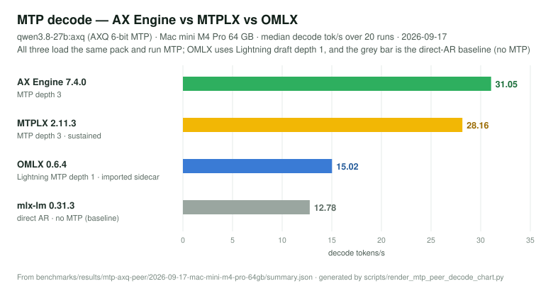
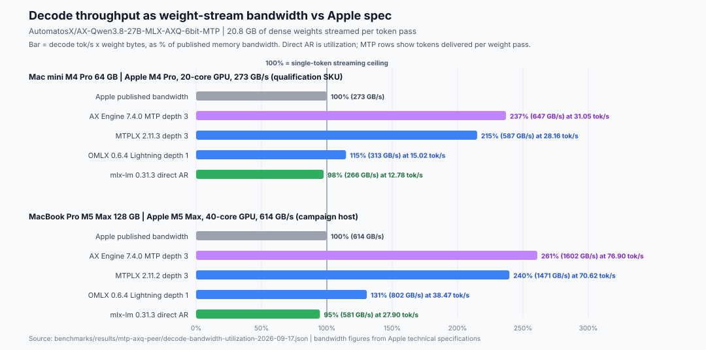
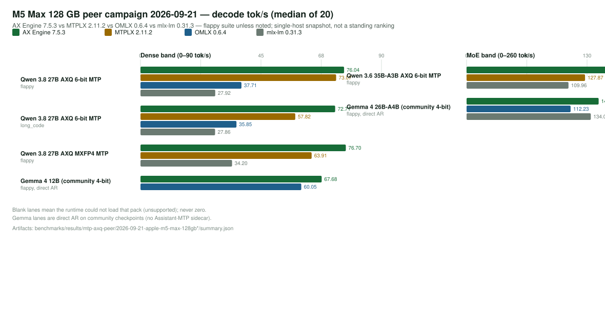
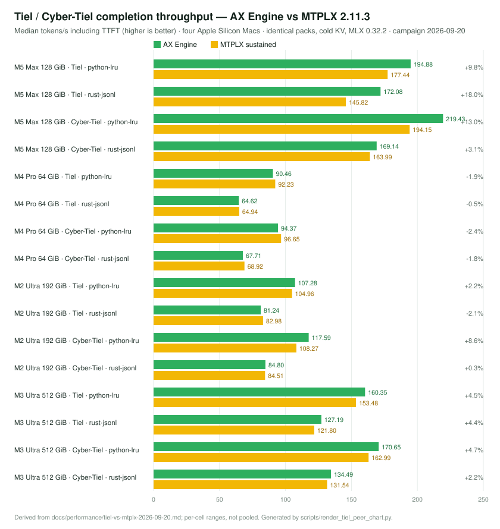

# AX Engine

AX Engine is a **Mac-first** Apple Silicon inference runtime **optimized first
for Qwen 3.8 27B AXQ**. Dense 27B decode is already at the DRAM ceiling in
direct AR (mlx-lm **12.78 tok/s** on the recommended Mac mini M4 Pro 64 GB,
**27.90** on M5 Max 128 GB). Product-path MTP is **31.05 tok/s** on that mini
(**2.43×**) and **76.90 tok/s** decode / **795.3 tok/s** prefill on M5 Max
(**2.76×**). That is the Engine speed story: speculation past the memory wall
on the default pack. It is benchmarked head-to-head in MTP mode against the two
other MLX runtimes that load the same AXQ 6-bit MTP pack and run MTP —
**MTPLX** (draft depth 3) and **OMLX** (Lightning depth 1). We publish those
comparisons across Apple Silicon SKUs, wins and losses both, with checked-in
artifacts. Install with Homebrew, download the pinned 27B pack, and serve
OpenAI-compatible endpoints locally.

Primary optimization target. Checkpoint Tier 1. MTP Tier 2 pending. AX certification record: Candidate (gates open).

The default pack is `qwen3.8-27b:axq`
([`AutomatosX/AX-Qwen3.8-27B-MLX-AXQ-6bit-MTP`](https://huggingface.co/AutomatosX/AX-Qwen3.8-27B-MLX-AXQ-6bit-MTP)
@ `3e290738e96972307c6aeb9934ab170ca0eae1c1`). Additional Qwen, Gemma, GLM, and
other certified families stay supported; they are not the first-run or
qualification center. Super-class Qwen 3.8 (2.4T) is experimental only.

**AX Code's managed local default is not this 27B Qwen alias.** The coding harness
selects [Tiel Coder 35B A3B MXFP4 MTP](#tiel-performance), with Cyber-Tiel as the
alternate pack. Do not mix the Qwen 27B qualification table with the Tiel campaign.

NVIDIA/CUDA fleet serving lives in
[AX Serving](https://github.com/defai-digital/ax-serving). AX Engine remains the
local Apple Silicon runtime and no longer ships the former vLLM or TensorRT
provider bridges, runtime package, container, or CUDA qualification scripts.

Browse AutomatosX serve-ready chat / coding / embedding snapshots in the
[AutomatosX model collection on Hugging Face](https://huggingface.co/AutomatosX/models).
Additional native families (GLM 4.7 Flash, Nemotron Omni, Unlimited-OCR, Whisper,
MiniCPM-V, and others) are documented under
[Supported Models](docs/SUPPORTED-MODELS.md).

**Requires macOS 26 (Tahoe)+ on Apple Silicon (M2 or newer).** Product SKUs:

- **Mac mini M4 Pro 64 GB** — best experience and qualification SKU for Qwen 3.8 27B AXQ (`qwen3.8-27b:axq`); **31.05 tok/s** product-path MTP decode
- **MacBook Pro M5 Max 128 GB** — 27B campaign host (**76.90 tok/s** decode / **795.3 tok/s** prefill) and qualification target for Qwen 3.8 Flash Next MXFP4 MTP
  (125B-A6B). Second SKU. MXFP4 MTP target; native support and checkpoint qualification pending. MTP Tier 2 pending. AX certification record: Candidate (gates open). The existing `qwen3.8-flash-next:axq` alias selects affine 4-bit, not MXFP4.

Compact single models (Qwen 3.5 9B 4-bit preferred) still fit **16 GB**. Prefer
4-bit for headroom on that class.

Wired-memory controls are available across supported M2-or-newer Macs; they
are not M5-only. The automatic **no-wire optimization** currently targets only
the two audited Tiel MXFP4 MTP exports on **M5 Max with at least 128 GiB**.
Other supported hosts retain existing wiring. Model fit and measured speed
still depend on memory capacity and workload; see the
[Tiel residency policy](docs/mtp/tiel-prefill-diagnostics.md#residency-policy-for-the-audited-m5-max-exports).

## Why AX Engine

- **Dense 27B past the DRAM ceiling** — MTPLX and OMLX are the public peers
  that load the same `qwen3.8-27b:axq` AXQ 6-bit MTP pack and run MTP
  (MTPLX at draft depth 3, OMLX at Lightning depth 1). Direct AR already uses
  95–98% of published bandwidth. Product-path MTP is **31.05 vs 28.16 vs 15.02
  tok/s** on the Mac mini M4 Pro 64 GB SKU (2.43× mlx-lm 12.78) and
  **76.90 tok/s** decode / **795.3 tok/s** prefill on M5 Max 128 GB (2.76×
  mlx-lm 27.90). The Tiel MXFP4 four-SKU peer run is a separate MoE lane
  against MTPLX. We publish version-pinned wins **and** losses with checked-in
  artifacts ([Performance](#qwen-performance)); it is a measured snapshot, not a
  permanent ranking, and MTP Tier 2 is still pending. A dated 2026-09-21 7.5.3
  follow-up on the same M5 Max host records dense-27B parity with MTPLX on the
  short suite (76.04 vs 73.07 tok/s), a 1.87× lead on Qwen 3.6 35B-A3B
  (239.5 vs 127.9), and the first Gemma 4 native-path peer numbers —
  [Qwen / Gemma M5 Max peer campaign](docs/mtp/qwen-gemma-peer-m5-2026-09-21.md)
- **Optimized first for Qwen 3.8 27B AXQ** — one download of
  `qwen3.8-27b:axq` is the default serve path. Product-path MTP on this pack is
  the number in [Performance](#qwen-performance). Peers that cannot load this AXQ
  snapshot are recorded as unable to run the pack rather than substituted with
  another checkpoint
- **Multi-model on one process** — keep a scoped set of Qwen 3.5/3.6,
  Qwen3-Coder-Next, Gemma 4, and embedding models resident (`load_mode=add`),
  route by request `model` (chat + embeddings together), with fair Metal turn
  arbitration, memory preflight, and optional idle eviction. Exact-prompt
  **prefix reuse** is the S1 differentiator: official dual-model campaign
  (Qwen stream + Gemma 13.8k prefill) clears **all locked gates** at
  **5.03×** median throughput vs a multi-process peer MLX server — see
  [Performance](#performance) and
  [Server: Multi-model](docs/SERVER.md#multi-model-serving)
- **You own the stack you serve** — AX runs the MLX graph, KV/runtime, and
  OpenAI-compatible server for supported Gemma / Qwen / GLM (and other direct
  families); `mlx-lm` and `llama.cpp` stay optional compatibility adapters
- **Engine-owned scheduling and KV** — continuous batched decode
  (certification-gated), chunked prefill, preempt-and-recompute, and a paged
  KV ledger with cross-request prefix sharing run inside the engine, with a
  published `ax_runtime_*` saturation contract for fleet routers — see
  [Scheduling and KV runtime](#scheduling-and-kv-runtime)
- **Native media and speech** — image/video chat, mixed image+audio reasoning,
  OCR, and Whisper transcription/translation run through repo-owned MLX graphs
  with capability-gated OpenAI endpoints (checkpoint-authoritative; see media
  table below)
- **Clear fleet boundary** — AX Engine owns local Apple Silicon inference;
  [AX Serving](docs/AX-SERVING.md) owns fleet orchestration and NVIDIA/CUDA
  workers
- **Claims you can audit** — public rows ship with checked-in artifacts (route,
  model snapshot, sampler, accept rate, provenance)

## Quick Start

### Homebrew (primary)

```bash
brew install defai-digital/tap/ax-engine
ax-engine doctor
```

Homebrew is the primary install path for the CLI, server, and bench tools.
The self-contained release formula installs the release's pinned
`libmlx.dylib`, `libjaccl.dylib`, and precompiled `mlx.metallib`; it does not
build MLX from source. Native inference from a ready local model directory
needs no Python, Xcode, or Metal Toolchain. Model aliases and preparation helpers
use Python 3.12+; online downloads also require `huggingface-hub`. Follow the
[Homebrew helper setup](docs/GETTING-STARTED.md#homebrew-model-helpers) before
downloading or serving an alias.

### Python SDK (pip)

Use the wheel for Python applications that `import ax_engine`, optional Python
integrations, or systems where Homebrew is unavailable. Install it in a virtual
environment:

```bash
python3 -m venv .venv
source .venv/bin/activate
python3 -m pip install --upgrade pip
python3 -m pip install --upgrade "ax-engine[download]>=7.5.5,<8"
ax-engine doctor
```

The wheel also exposes `ax-engine` and `ax-engine-server` and bundles the bench
binary used by diagnostics. If both Homebrew and pip are installed, an active
virtual environment normally wins on `PATH`; use `which -a ax-engine` to see
every copy and prefer one installation channel in each shell. See
[Getting Started](docs/GETTING-STARTED.md) for the full channel comparison and
troubleshooting.

### Run AX Engine

**Option A — interactive TUI** (pick a model, download, serve, chat):

```bash
ax-engine tui
```

<p align="center">
  
</p>

**Option B — serve Qwen 3.8 27B AXQ 6-bit MTP**, then request from another
terminal. `qwen3.8-27b:axq` is the pinned AutomatosX 6-bit MTP pack (same
checkpoint as `ax-qwen3.8-27b`). The command reuses the cached snapshot when
present and downloads it otherwise. Listen defaults to `127.0.0.1:31418`:

```bash
ax-engine serve qwen3.8-27b:axq

curl http://127.0.0.1:31418/v1/chat/completions \
  -H 'content-type: application/json' \
  -d '{"model":"qwen3.8-27b","messages":[{"role":"user","content":"Say hello in one sentence."}],"max_tokens":64}'
```

**Option C — coding model** (resolve + serve):

```bash
ax-engine serve ax-qwen3-coder-next --port 31418
```

Python wheel, source builds, and troubleshooting:
[Getting Started](docs/GETTING-STARTED.md).

## Models

### Managed AutomatosX catalog (download / TUI)

`ax-engine download --list` and the TUI expose the curated public
[AutomatosX model collection](https://huggingface.co/AutomatosX/models?sort=alphabetical)
only — not every community MLX weight. Qwen 3.8 27B AXQ (6-bit MTP default),
Qwen 3.6, Qwen 3.5, and Gemma 4 variants published there (plain 4-bit/6-bit,
QAT, OptiQ, AXQ where available) are first-class serve targets. Other native families (for example **GLM 4.7 Flash**, Nemotron
Omni, Unlimited-OCR, Whisper, MiniCPM-V) use the repo-owned runtime via serve
aliases, presets, or manual model directories; they are not all AutomatosX-managed
packages. Full matrix:
[Supported Models](docs/SUPPORTED-MODELS.md).

**Qwen 3.8 Super-class (2.4T) is experimental only, not a production target.**
Those packs can technically load through the SSD expert-stream path
(`--stream-experts`, default `auto`), but local inference is too slow even at
2-bit to recommend or certify. **Start local serving on Qwen 3.8 27B AXQ
6-bit MTP** (`qwen3.8-27b:axq`).

**Recommended starting packages** (serve-ready, match published benches):

| Goal | Alias / family | Why |
| --- | --- | --- |
| Default dense chat + MTP | `qwen3.8-27b:axq` (pinned AXQ 6-bit MTP) | Production-size Qwen 3.8 27B; AutomatosX AXQ 6-bit with MTP sidecar |
| Fastest MoE chat + MTP | `ax-qwen3.6-35b-a3b` (4-bit or 6-bit MTP) | Strongest serving and MTP peer decode rows |
| Dense chat + MTP (3.6) | `ax-qwen3.6-27b` (6-bit MTP preferred) | High same-package MTP speedup; solid serving |
| AXQ evaluation candidate | `qwen3.6-27b:axq` (pinned 6-bit) | Qwen 3.6 27B AXQ candidate; explicit until its checkpoint certification gates pass |
| Vision MoE Instruct AXQ | `ax-qwen3-vl-30b` / `ax-qwen3-vl-30b-4bit` | Qwen3-VL 30B-A3B Instruct AXQ packs; candidate, no MTP |
| Holo3 GUI-agent AXQ | `holo3-35b` / `holo3-35b:axq` | Qwen3.5-class 35B-A3B MoE; Tier 1 certified text path; no MTP |
| Ornith coding AXQ | `ornith-35b` / `ornith-35b:axq` | Qwen3.5-class 35B-A3B MoE coding agent; Tier 1 AXQ; no MTP |
| Ornith 1.5 MTP | `ornith-1.5-35b:axq` | Qwen3.5-class 35B-A3B MoE with HF per-expert MTP sidecar; development pack |
| Tiel coding MTP | `tiel-coder-35b:axq` / `cyber-tiel-coder-35b:axq` | Qwen3.5-class 35B-A3B MoE MXFP4 packs; native HF per-expert MTP mode; development, unqualified |
| GPT-OSS AXQ | `gpt-oss-20b:axq` / `gpt-oss-120b:axq` | AutomatosX AXQ; bare aliases stay mlx-community MXFP4-Q4 |
| Nemotron 3 Nano AXQ | `nemotron-3-nano` / `nemotron-3-nano:axq` | `nemotron_h` 30B-A3B; development AXQ |
| Muse-Glimmer image-text AXQ | `muse-glimmer-30b` / `muse-glimmer-30b:axq` | Meta dense 30B image-text agent; ATEM chat; development AXQ; no MTP |
| Multimodal chat + MTP | `ax-gemma4-12b` / 26B / 31B Assistant-MTP | Image/audio/video + assistant draft package |
| Coding agent | `ax-qwen3-coder-next` | Coding-focused MoE; multi-model friendly |
| Embeddings | `ax-embeddinggemma-300m` or Qwen3-Embedding aliases | Batched ingest scale in [full results](docs/PERFORMANCE-RESULTS.md#session-mode-embeddings) |

Repositories ending in `-MTP` or `-Assistant-MTP` already contain the prepared
sidecar or assistant artifacts and `model-manifest.json`. Download them with
the standard flow; do **not** run `download-mtp` afterward.

| Family | Role | Supported AutomatosX snapshots |
| --- | --- | --- |
| Qwen 3.5 9B | Chat / agent | [`AX-Qwen3.5-9B-MLX-4bit-MTP`](https://huggingface.co/AutomatosX/AX-Qwen3.5-9B-MLX-4bit-MTP)<br>[`AX-Qwen3.5-9B-MLX-6bit-MTP`](https://huggingface.co/AutomatosX/AX-Qwen3.5-9B-MLX-6bit-MTP)<br>[`AX-Qwen3.5-9B-MLX-OptiQ-4bit-MTP`](https://huggingface.co/AutomatosX/AX-Qwen3.5-9B-MLX-OptiQ-4bit-MTP) |
| Qwen 3.6 27B | Chat / agent / multimodal | [`AX-Qwen3.6-27B-MLX-4bit-MTP`](https://huggingface.co/AutomatosX/AX-Qwen3.6-27B-MLX-4bit-MTP)<br>[`AX-Qwen3.6-27B-MLX-6bit-MTP`](https://huggingface.co/AutomatosX/AX-Qwen3.6-27B-MLX-6bit-MTP)<br>[`AX-Qwen3.6-27B-MLX-OptiQ-4bit-MTP`](https://huggingface.co/AutomatosX/AX-Qwen3.6-27B-MLX-OptiQ-4bit-MTP)<br>AXQ candidates: [`AXQ-6bit`](https://huggingface.co/AutomatosX/AX-Qwen3.6-27B-MLX-AXQ-6bit-MTP) / [`AXQ-4bit`](https://huggingface.co/AutomatosX/AX-Qwen3.6-27B-MLX-AXQ-4bit-MTP) |
| Qwen 3.8 27B | Chat / agent / multimodal | Default serve: [`AXQ-6bit-MTP`](https://huggingface.co/AutomatosX/AX-Qwen3.8-27B-MLX-AXQ-6bit-MTP) via `qwen3.8-27b:axq`. Also [`AXQ-4bit-MTP`](https://huggingface.co/AutomatosX/AX-Qwen3.8-27B-MLX-AXQ-4bit-MTP), 8-bit, and MXFP4 |
| Qwen 3.6 35B-A3B | Chat / agent / multimodal | [`AX-Qwen3.6-35B-A3B-MLX-4bit-MTP`](https://huggingface.co/AutomatosX/AX-Qwen3.6-35B-A3B-MLX-4bit-MTP)<br>[`AX-Qwen3.6-35B-A3B-MLX-6bit-MTP`](https://huggingface.co/AutomatosX/AX-Qwen3.6-35B-A3B-MLX-6bit-MTP)<br>[`AX-Qwen3.6-35B-A3B-MLX-OptiQ-4bit-MTP`](https://huggingface.co/AutomatosX/AX-Qwen3.6-35B-A3B-MLX-OptiQ-4bit-MTP) |
| Qwen3-VL 30B-A3B Instruct | Vision chat (image/video) | AXQ candidates: [`AXQ-6bit`](https://huggingface.co/AutomatosX/AX-Qwen3-VL-30B-A3B-Instruct-MLX-AXQ-6bit) / [`AXQ-4bit`](https://huggingface.co/AutomatosX/AX-Qwen3-VL-30B-A3B-Instruct-MLX-AXQ-4bit) (no MTP) |
| Holo3 35B-A3B | GUI agent (text path) | Certified AXQ: [`AXQ-6bit`](https://huggingface.co/AutomatosX/AX-Holo3-35B-A3B-MLX-AXQ-6bit) / [`AXQ-4bit`](https://huggingface.co/AutomatosX/AX-Holo3-35B-A3B-MLX-AXQ-4bit) (no MTP) |
| Ornith 1.0 35B | Coding agent | Certified AXQ: [`AXQ-6bit`](https://huggingface.co/AutomatosX/AX-Ornith-1.0-35B-MLX-AXQ-6bit) / [`AXQ-4bit`](https://huggingface.co/AutomatosX/AX-Ornith-1.0-35B-MLX-AXQ-4bit) (no MTP) |
| Tiel 35B-A3B | Coding agent | Development MXFP4 MTP: [`Tiel Coder`](https://huggingface.co/AutomatosX/AX-Tiel-Coder-35B-A3B-MLX-AXQ-MXFP4-MTP) / [`Cyber Tiel Coder`](https://huggingface.co/AutomatosX/AX-Cyber-Tiel-Coder-35B-A3B-MLX-AXQ-MXFP4-MTP); native MTP mode, no checkpoint or speed certification |
| GPT-OSS 20B / 120B | Open reasoner | Bare aliases: mlx-community MXFP4-Q4. AXQ: [`20B-6bit`](https://huggingface.co/AutomatosX/AX-gpt-oss-20b-MLX-AXQ-6bit) / [`120B-6bit`](https://huggingface.co/AutomatosX/AX-gpt-oss-120b-MLX-AXQ-6bit) |
| Nemotron 3 Nano 30B-A3B | Hybrid chat | AXQ candidates: [`AXQ-6bit`](https://huggingface.co/AutomatosX/AX-Nemotron-3-Nano-30B-A3B-MLX-AXQ-6bit) / [`AXQ-4bit`](https://huggingface.co/AutomatosX/AX-Nemotron-3-Nano-30B-A3B-MLX-AXQ-4bit) |
| Muse-Glimmer 30B | Image-text agent | AXQ candidates: [`AXQ-6bit`](https://huggingface.co/AutomatosX/AX-Muse-Glimmer-30B-MLX-AXQ-6bit) / [`AXQ-4bit`](https://huggingface.co/AutomatosX/AX-Muse-Glimmer-30B-MLX-AXQ-4bit) (no MTP) |
| Gemma 4 12B | Chat / multimodal | [`AX-Gemma-4-12B-IT-MLX-6bit-Assistant-MTP`](https://huggingface.co/AutomatosX/AX-Gemma-4-12B-IT-MLX-6bit-Assistant-MTP)<br>[`AX-Gemma-4-12B-IT-MLX-QAT-4bit-Assistant-MTP`](https://huggingface.co/AutomatosX/AX-Gemma-4-12B-IT-MLX-QAT-4bit-Assistant-MTP)<br>[`AX-Gemma-4-12B-IT-MLX-QAT-OptiQ-4bit-Assistant-MTP`](https://huggingface.co/AutomatosX/AX-Gemma-4-12B-IT-MLX-QAT-OptiQ-4bit-Assistant-MTP) |
| Gemma 4 26B-A4B | Chat / agent / multimodal | [`AX-Gemma-4-26B-A4B-IT-MLX-6bit-Assistant-MTP`](https://huggingface.co/AutomatosX/AX-Gemma-4-26B-A4B-IT-MLX-6bit-Assistant-MTP)<br>[`AX-Gemma-4-26B-A4B-IT-MLX-OptiQ-4bit-Assistant-MTP`](https://huggingface.co/AutomatosX/AX-Gemma-4-26B-A4B-IT-MLX-OptiQ-4bit-Assistant-MTP)<br>[`AX-Gemma-4-26B-A4B-IT-MLX-QAT-4bit-Assistant-MTP`](https://huggingface.co/AutomatosX/AX-Gemma-4-26B-A4B-IT-MLX-QAT-4bit-Assistant-MTP) |
| Gemma 4 31B | Chat / agent / multimodal | [`AX-Gemma-4-31B-IT-MLX-6bit-Assistant-MTP`](https://huggingface.co/AutomatosX/AX-Gemma-4-31B-IT-MLX-6bit-Assistant-MTP)<br>[`AX-Gemma-4-31B-IT-MLX-OptiQ-4bit-Assistant-MTP`](https://huggingface.co/AutomatosX/AX-Gemma-4-31B-IT-MLX-OptiQ-4bit-Assistant-MTP)<br>[`AX-Gemma-4-31B-IT-MLX-QAT-4bit-Assistant-MTP`](https://huggingface.co/AutomatosX/AX-Gemma-4-31B-IT-MLX-QAT-4bit-Assistant-MTP) |
| Qwen3-Coder-Next | Coding agent | [`AX-Qwen3-Coder-Next-MLX-4bit`](https://huggingface.co/AutomatosX/AX-Qwen3-Coder-Next-MLX-4bit)<br>[`AX-Qwen3-Coder-Next-MLX-6bit`](https://huggingface.co/AutomatosX/AX-Qwen3-Coder-Next-MLX-6bit) |
| DiffusionGemma 26B-A4B | Diffusion language model | [`AX-DiffusionGemma-26B-A4B-IT-MLX-4bit`](https://huggingface.co/AutomatosX/AX-DiffusionGemma-26B-A4B-IT-MLX-4bit) |
| EmbeddingGemma 300M | Embeddings | [`AX-EmbeddingGemma-300M-MLX-8bit`](https://huggingface.co/AutomatosX/AX-EmbeddingGemma-300M-MLX-8bit) |
| Qwen3-Embedding 0.6B | Embeddings | [`AX-Qwen3-Embedding-0.6B-MLX-8bit`](https://huggingface.co/AutomatosX/AX-Qwen3-Embedding-0.6B-MLX-8bit) |
| Qwen3-Embedding 4B / 8B | Embeddings | [`AX-Qwen3-Embedding-4B-MLX-4bit-DWQ`](https://huggingface.co/AutomatosX/AX-Qwen3-Embedding-4B-MLX-4bit-DWQ)<br>[`AX-Qwen3-Embedding-8B-MLX-4bit-DWQ`](https://huggingface.co/AutomatosX/AX-Qwen3-Embedding-8B-MLX-4bit-DWQ) |

Native multimodal and speech support is checkpoint-authoritative: AX advertises
only modalities whose required tower tensors are present in
`model-manifest.json`.

| Model family | Inputs | Native API surface | Current scope |
| --- | --- | --- | --- |
| Qwen3-VL; visual Qwen3.5; Qwen 3.6 | Image, video | Chat/generate | Conv3D visual patches, full ViT/merger, MRoPE, multi-image/video ordering; Qwen 3.6 27B image/video smoke-tested on M3 Max |
| Standard Gemma 4 E4B/26B/31B | Image, video | Chat/generate | Full bidirectional ViT, 2-D RoPE, spatial pooling, checkpoint standardization, and vision projection; catalogued sizes are E4B/26B/31B. E2B still loads from an explicit directory. Conformer audio is not yet native |
| Gemma 4 unified 12B | Image, audio, video | Chat/generate | Encoder-free image/audio connector and sampled per-frame video path; requires the unified connector roles |
| MiniCPM-V 4.6 | One or more images | Chat/generate | Dynamic SigLIP grid, mid-tower merger, OCR/document prompts |
| Nemotron 3 Nano Omni | Image, audio, or both | Chat/generate | RADIO vision plus Parakeet audio with ordered mixed-media spans |
| Unlimited-OCR | Image | Native processed-input runtime; delegated OpenAI OCR profile | Full prefill KV is protected; only generated-token KV uses the decode ring |
| Whisper large-v3-turbo | Audio | `/v1/audio/transcriptions`, `/v1/audio/translations`, Rust SDK | WAV/MP3 to 16 kHz; multilingual transcribe/translate; text-generation routes fail closed |

GLM-OCR is not supported.

Download helpers inspect the source tensor index and automatically rebuild
older packaged manifests that omitted a declared Qwen or Gemma vision tower.
For an existing manual model directory, run
`ax-engine-bench generate-manifest --force /path/to/model`.

The default Hugging Face cache layout is
`models--AutomatosX--<repository>/snapshots/<revision>`. Use the shorter
`ax-*` aliases shown by `ax-engine download --list`; for example:

```bash
ax-engine serve qwen3.8-27b:axq
ax-engine serve qwen3.8-27b:axq --offline  # require the pinned 6-bit MTP cache
```

Aliases, hardware sizing, and legacy MTP packaging targets:
[Supported Models](docs/SUPPORTED-MODELS.md) ·
[Qwen 3.6 27B AXQ certification](docs/model-certifications/qwen3.6-27b-axq.md) ·
[Hardware FAQ](docs/FAQ.md#what-hardware-does-ax-engine-support) ·
[CLI](docs/CLI.md).

### AXQ endurance evidence

AX Engine 6.13.5 completed an **8-hour endurance test with 8.87 hours of
continuous measured runtime** for the pinned Qwen 3.6 27B AXQ 6-bit model on a
64 GB M4 Pro Mac mini: **437/437 requests
succeeded**, the owned server did not restart, and no retained-RSS growth,
swap, lifecycle-drain failure, or performance guardrail breach was observed.
The operator stopped this run to add deeper vLLM-style leak attribution before
restarting the full 72-hour qualification, so it is short-duration evidence,
not a 72-hour pass. Read the
[8-hour endurance report](docs/model-certifications/qwen3.6-27b-axq-6bit-8h-endurance-2026-08-08.md)
or use the reusable [AXQ endurance utility and detached launch procedure](docs/AXQ-ENDURANCE-SOAK.md#reusable-repository-utility)
to verify another local AXQ package.

### Multi-model serving

One process can keep several **allowlisted** models loaded and route each
request by `model` (OpenAI, gRPC, Ollama, Anthropic). Add mode is limited to
Qwen 3.5 9B, Qwen 3.6 27B/35B, Qwen3-Coder-Next, Gemma 4 12B/26B/31B, and the
EmbeddingGemma 300M / Qwen3-Embedding 0.6B–8B embedding models (chat +
embeddings from one process); AutomatosX `AX-` package names resolve to the
same targets. Each model owns its own session and scheduler while a process
arbiter fair-rotates Metal turns (no fused cross-model batch).

```bash
# After a first model is already serving on :31418
curl -s http://127.0.0.1:31418/v1/model/load -H 'content-type: application/json' -d '{
  "model_id": "gemma-4-12b-it",
  "model_path": "/path/to/gemma-4-12b-artifacts",
  "load_mode": "add",
  "make_default": false
}'

curl -s http://127.0.0.1:31418/v1/chat/completions -H 'content-type: application/json' -d '{
  "model": "gemma-4-12b-it",
  "messages": [{"role": "user", "content": "Hi"}],
  "max_tokens": 32
}'
```

Full contract (load/unload, memory preflight, idle eviction, metrics labels):
[Server: Multi-model serving](docs/SERVER.md#multi-model-serving) ·
[Supported Models](docs/SUPPORTED-MODELS.md#multi-model-serving).

## Scheduling and KV runtime

Token-level scheduling is owned by the engine, not a gateway: each step the
scheduler builds a decode-first, token-budgeted batch with chunked prefill and
mixed prefill+decode routes, backed by a paged logical KV ledger. Full design:
[Scheduler](docs/SCHEDULER.md) · [KV Cache](docs/KV-CACHE.md) ·
[Serving Invariants](docs/SERVING-INVARIANTS.md).

- **Continuous batched decode** — structurally eligible decode requests share
  one batched forward (default on; `AX_MLX_BATCHED_DECODE=0` is the kill
  switch) behind a fail-closed bit-exact certification gate; host-sampled
  batching is a separate opt-in
- **Paged KV ledger with prefix sharing** — per-request block tables,
  ref-counted cross-request prefix reuse, tiered eviction, and an optional
  disk-durable prefix cache that survives restarts
- **Pressure handling** — KV memory-pressure throttling, preempt-and-recompute
  (newest in-flight prefill only, never decode), and server admission control
  (global and per-model concurrency caps → `429`)
- **Fleet telemetry contract** — `/metrics` publishes versioned `ax_runtime_*`
  saturation series (KV utilization, queue depth, batch headroom, TTFT p95,
  decode tok/s, error rate) that [AX Serving](docs/AX-SERVING.md) and other
  routers consume for node selection; token scheduling itself stays on-box

**Current dense batched-decode ceiling.** On the strict M5 Max projection
probe, the default Shared policy reaches **328.9 aggregate tok/s at B=8**
(**4.01×** its B=1 throughput), versus **102.6 tok/s / 1.25×** for the
RowExact fallback. The paired Shared/RowExact ratio is **3.20×** with five of
five wins and identical full-cohort greedy hashes. This is a dense
Llama-3.1-8B, 32-token-prefill microbenchmark—not an end-to-end serving,
long-prompt, or MoE claim. Production continuous-batching claims still require
matching serving evidence—see
[Batched decode ceiling](docs/performance/batched-decode-ceiling.md) and
[Long Context claim boundaries](docs/LONG-CONTEXT.md#claim-boundaries).

## Performance

Two lanes. **Do not mix them.** Dense Qwen 3.8 27B AXQ is AX Engine's first-run
pack: 20.84 GB of weights per token, already at the DRAM ceiling in direct AR.
Tiel / Cyber-Tiel are AX Code's managed MoE coding packs. Their tok/s are not
interchangeable with the 27B table.

| Lane | Pack | Host | AX Engine | Direct AR (mlx-lm) | MTPLX |
| --- | --- | --- | ---: | ---: | ---: |
| Engine default (dense) | `qwen3.8-27b:axq` | Mac mini M4 Pro 64 GB | **31.05** decode / **120.3** prefill | 12.78 decode (**2.43×**) | 28.16 / 114.0 |
| Engine default (dense) | `qwen3.8-27b:axq` | M5 Max 128 GB | **76.90** decode / **795.3** prefill | 27.90 decode (**2.76×**) | 70.62 / 686.6 |
| AX Code default (MoE) | Tiel 35B MXFP4 MTP | M5 Max 128 GB | **194.88** completion (incl. TTFT) | — | 177.44 |

Decode and prefill for Qwen 27B are 20-run medians. Tiel completion includes TTFT
(six-sample median). Details below; do not quote 76.90 next to 194.88 as one number.

<a id="qwen-performance"></a>

### Qualification SKU: Mac mini M4 Pro 64 GB (2026-09-17)

Dense **Qwen 3.8 27B AXQ 6-bit MTP** (`qwen3.8-27b:axq`). Direct AR already
streams **97.5%** of the mini's 273 GB/s (mlx-lm **12.78 tok/s**). Product-path
MTP is **31.05 tok/s** here (**2.43×** that ceiling) and **76.90 tok/s** decode /
**795.3 tok/s** prefill on M5 Max 128 GB (**2.76×** mlx-lm 27.90). That is the
dense-27B speed story: speculation past the memory wall, not a Tiel-class
token rate.

Same-pack measurements on the selected SKU (Mac16,11, macOS 26.6.2) with the
installed bundled wheel built from clean `ad999f3f`, which includes the
target-head and low-precision SwiGLU corrections. Same `flappy` contract as
below (four cases, 256 gen, greedy, thinking disabled, 2 warmups, 5 measured
reps, 3 s cooldown); decode and prefill are **20-run medians**. Evidence:
[`benchmarks/results/mtp-axq-peer/2026-09-17-mac-mini-m4-pro-64gb/`](benchmarks/results/mtp-axq-peer/2026-09-17-mac-mini-m4-pro-64gb/).

| Runtime | Latest checked 2026-09-17 | Decode | Prefill |
| --- | --- | ---: | ---: |
| **AX Engine 7.4.0** (product-path MTP, depth 3, build `ad999f3f`) | installed wheel | **31.05 tok/s** | **120.3 tok/s** |
| [MTPLX](https://github.com/youssofal/MTPLX) **2.11.3** (MTP depth 3, sustained) | PyPI Latest | 28.16 tok/s | 114.0 tok/s |
| [OMLX](https://github.com/jundot/omlx) **0.6.4** (Lightning MTP depth 1, imported sidecar) | GitHub Latest release | 15.02 tok/s | — |
| [mlx-lm](https://github.com/ml-explore/mlx-lm) **0.31.3** (direct AR, no MTP) | PyPI Latest | 12.78 tok/s | — |

<p align="center">
  
</p>

Three runtimes load this pack and run MTP — AX Engine and MTPLX at draft depth
3, OMLX at Lightning depth 1 — and AX Engine leads both on decode and prefill;
`mlx-lm` is the direct-AR (no MTP) baseline. The measured build is the 7.4.0
line (`ad999f3f`); the current 7.5.x releases add SSE and SDK framing fixes
that do not change throughput. The figure is generated from the campaign
`summary.json` by `scripts/render_mtp_peer_decode_chart.py`.

Two host daemons held about 1.2 CPU cores throughout; every lane ran under
that condition and the AX lane was repeated with agreement within 0.4%. These
are throughput numbers on the qualification SKU, not a quality or
certification claim; the record stays **Candidate**.

#### Why the M4 Pro and M5 Max numbers differ: memory bandwidth

Decode on this 6-bit 27B pack streams 20.84 GB of dense weights per token.
Direct autoregressive decode (mlx-lm) already uses **97.5%** of the Mac mini
M4 Pro's published 273 GB/s and **94.7%** of the M5 Max's 614 GB/s, so the
2.2x decode gap is the 2.25x bandwidth gap. MTP moves past that ceiling by
emitting about 3.9 tokens per weight pass. Prefill is compute-bound and the
M5 Max has twice the GPU cores plus per-core neural accelerators, which is why
its prefill lead is 6x for both AX and MTPLX. Full analysis:
[docs/performance/decode-bandwidth-utilization.md](docs/performance/decode-bandwidth-utilization.md).

| Host | Published bandwidth | mlx-lm direct AR | Weight stream | Utilization | AX Engine MTP | Equivalent stream |
| --- | ---: | ---: | ---: | ---: | ---: | ---: |
| Mac mini M4 Pro 64 GB | 273 GB/s | 12.78 tok/s | 266 GB/s | 97.5% | 31.05 tok/s | 647 GB/s (237%) |
| MacBook Pro M5 Max 128 GB | 614 GB/s | 27.90 tok/s | 581 GB/s | 94.7% | 76.90 tok/s | 1602 GB/s (261%) |

The M4 Pro MTP column is the corrected 2026-09-17 build; the M5 Max value
(76.90) is the pre-correction 2026-09-15 build below, where decode moved within
0.3% after the corrections — the bandwidth ratios hold either way.



### Campaign host: Apple M5 Max 128 GB (2026-09-21 refresh, AX Engine 7.5.3)

The pending refresh of the 2026-09-15 M5 Max peer table has landed: AX Engine
**7.5.3** (`c5d22c4a`, built on the campaign host with Homebrew cargo 1.98.0 —
campaign evidence, not SKU certification) re-ran the identical contract
(`flappy`, four cases, 256 gen, greedy, 2 warmups, 5 measured reps, 3 s
cooldown, **median of 20 runs**, same snapshot directory for every runtime,
no GGUF or community-4-bit substitute) across four Qwen packs, added a
`long_code` suite, and measured the Gemma 4 family for the first time.
Superseded history: the 2026-09-15 7.4.0 pre-correction rows **76.90 /
795.3** (decode moved within 0.3% after the 2026-09-17 SwiGLU corrections)
stay in [2026-09-15 campaign artifacts](benchmarks/results/mtp-axq-peer/2026-09-15-apple-m5-max-128gb/).

**Qwen (product-path MTP, `mtp_head_only_verify_loop`):**

| Pack (suite) | AX Engine 7.5.3 | MTPLX 2.11.2 | OMLX 0.6.4 | mlx-lm 0.31.3 |
| --- | ---: | ---: | ---: | ---: |
| Qwen 3.8 27B AXQ 6-bit MTP (flappy) | **76.04 / 768.7** | 73.07 / 650.6 | 37.71 | 27.92 |
| Qwen 3.8 27B AXQ 6-bit MTP (long_code) | **72.71 / 856.9** | 57.82 / 833.1 | 35.85 | 27.86 |
| Qwen 3.6 35B-A3B AXQ 6-bit MTP (flappy) | **239.52 / 2112.1** | 127.87 / 1590.7 | — | 109.97 |
| Qwen 3.8 27B AXQ MXFP4 MTP (flappy) | **76.70 / 792.4** | 63.91 / 697.3 | — | 34.20 |

Decode / prefill tok/s (prefill: AX runner-internal; MTPLX derived from
`prompt_eval_time_s`). `mlx-lm` rows are the direct-AR (no MTP) baseline.
`—` means the runtime could not load that pack (OMLX runs the imported 6-bit
sidecar only where one exists); an unsupported peer is never substituted
with another checkpoint.

**Gemma 4 (direct AR — community checkpoints, no Assistant-MTP sidecar; the
catalog-pinned AXQ Gemma 4 chat packs are not published yet):**

| Checkpoint (flappy) | AX Engine 7.5.3 | MTPLX 2.11.2 | OMLX 0.6.4 | mlx-lm 0.31.3 |
| --- | ---: | ---: | ---: | ---: |
| gemma-4-12B-it-4bit (`gemma4_unified`) | **67.68 / 1626.8** | — | 60.05 | — |
| gemma-4-26b-a4b-it-4bit (`gemma4`) | **142.48 / 2644.9** | — | 112.23 | 134.06 |

<p align="center">
  
</p>

Reading this snapshot honestly: against the 2026-09-15 baseline AX moved
76.90 → 76.04 while MTPLX moved 70.62 → 73.07 at unchanged versions, so the
dense-27B short-suite margin narrowed from 1.089× to 1.041× — inside
single-host median spread, read it as parity there. The strongest signals in
this campaign are on `long_code` (1.26× over MTPLX) and the MoE pack
(1.87× over MTPLX at 239.5 vs 127.9 tok/s, where AX is highest in this
snapshot); the MoE margin reflects MTP-path fit on that architecture and
suite, not a standing cross-engine ranking. Gemma rows are native-graph
load/decode evidence only — direct AR, not MTP, and not the 6-bit
recommended publication lane. This is a version-pinned single-host snapshot
(2026-09-21T07:07:55Z .. 09:48:41Z UTC, sequential lanes), not a permanent
ranking, and MTP Tier 2 remains pending. Full contract, per-case medians,
limitations, and the Flash Next `qwen4_exp` experimental status (loads and
serves on the ADR-030 target spec; no peer version tested here loads it):
[Qwen / Gemma M5 Max peer campaign](docs/mtp/qwen-gemma-peer-m5-2026-09-21.md).
Artifacts:
[27B 6-bit](benchmarks/results/mtp-axq-peer/2026-09-21-apple-m5-max-128gb/) ·
[Qwen family](benchmarks/results/mtp-axq-peer/2026-09-21-apple-m5-max-128gb-qwen-family/) ·
[Gemma family](benchmarks/results/mtp-axq-peer/2026-09-21-apple-m5-max-128gb-gemma/).
Chart regenerated deterministically by `scripts/render_m5_peer_2026_09_21.py`.

<a id="tiel-performance"></a>

### Tiel / Cyber-Tiel peer refresh (2026-09-20)

These two MXFP4 MTP packs are what **AX Code** manages as local defaults (Tiel) and
alternate (Cyber-Tiel). They are not AX Engine's first-run Qwen 27B alias. The
[four-machine performance report](docs/performance/tiel-vs-mtplx-2026-09-20.md)
reports both packs separately on M5 Max 128 GiB, M4 Pro 64 GiB, M2 Ultra
192 GiB and M3 Ultra 512 GiB. It uses identical model files and prompt tokens, fixed output counts,
cold KV, two reversed-order blocks, and completion throughput including TTFT.
These are explicit throughput-MTP, full-resident native API measurements, not
default `ax-engine serve` and not AX Code session speed.

Coding completion throughput includes TTFT. Each cell has six measured samples;
the ranges below compare the four Python/Rust cells per host with MTPLX
**2.11.3 sustained**, not pooled speedups. Both engines use MLX **0.32.2**.

| Tested machine | AX vs MTPLX 2.11.3 completion | Observed tradeoff |
| --- | ---: | --- |
| MacBook Pro M5 Max, 128 GiB | **+3.1% to +18.0%** | AX leads in completion, decode and TTFT. |
| Mac mini M4 Pro, 64 GiB | -2.4% to -0.5% | MTPLX finishes slightly faster and starts sooner; AX decode is slightly faster. |
| Mac Studio M2 Ultra, 192 GiB | -2.1% to +8.6% | Mixed completion results; AX decode is faster, MTPLX starts sooner. |
| Mac Studio M3 Ultra, 512 GiB | **+2.2% to +4.7%** | AX finishes faster; MTPLX starts sooner. |

This is a version-pinned snapshot against a strong, fast-moving open-source
peer, not a permanent ranking: AX leads completion on M5 Max and M3 Ultra, is
essentially level on M4 Pro, and is mixed on M2 Ultra. Earlier
pre-residency-fix runs favored MTPLX on some hosts.

<p align="center">
  
</p>

**Coding completion throughput — Tiel pack (tokens/s, median incl. TTFT):**

| Machine | Workload | AX Engine | MTPLX sustained | AX vs MTPLX |
| --- | --- | ---: | ---: | ---: |
| M5 Max 128 GiB | python-lru | **194.88** | 177.44 | **+9.8%** |
| M5 Max 128 GiB | rust-jsonl | **172.08** | 145.82 | **+18.0%** |
| M4 Pro 64 GiB | python-lru | 90.46 | 92.23 | -1.9% |
| M4 Pro 64 GiB | rust-jsonl | 64.62 | 64.94 | -0.5% |
| M2 Ultra 192 GiB | python-lru | **107.28** | 104.96 | **+2.2%** |
| M2 Ultra 192 GiB | rust-jsonl | 81.24 | 82.98 | -2.1% |
| M3 Ultra 512 GiB | python-lru | **160.35** | 153.48 | **+4.5%** |
| M3 Ultra 512 GiB | rust-jsonl | **127.19** | 121.80 | **+4.4%** |

**Coding completion throughput — Cyber-Tiel pack (tokens/s, median incl. TTFT):**

| Machine | Workload | AX Engine | MTPLX sustained | AX vs MTPLX |
| --- | --- | ---: | ---: | ---: |
| M5 Max 128 GiB | python-lru | **219.43** | 194.15 | **+13.0%** |
| M5 Max 128 GiB | rust-jsonl | **169.14** | 163.99 | **+3.1%** |

**Decode (excludes first callback; not the primary metric):**

| Machine | Pack | Workload | AX decode | MTPLX decode |
| --- | --- | --- | ---: | ---: |
| M5 Max 128 GiB | Tiel (AX Code default) | python-lru | 217.85 | 198.40 |
| M5 Max 128 GiB | Cyber-Tiel (alternate) | python-lru | **249.01** | 219.84 |

**194.88** is the public completion number for AX Code's managed default Tiel pack.
**249.01** is the fastest decode cell in the campaign; it is Cyber-Tiel, not the
default, and is not an AX Code session measurement. Do not quote decode as
completion. The chart above plots both packs. AX decode is faster in every coding
cell, but the M4 Pro and M2 Ultra first-token wait offsets it on completion. The
figure is generated from the report tables by `scripts/render_tiel_peer_chart.py`.
Remaining Cyber-Tiel hosts and TTFT tables stay in the report.

The report includes both MTPLX profiles, separate decode/TTFT tables, memory,
unwired controls and limitations. There is no comparable isolated prefill
tokens/s claim. Both engines keep the model loaded throughout measured requests.

That campaign explicitly used `mlx_stream_experts="off"` on the 64 GiB mini;
the tested Auto build retained a 48 GiB reserve and paged experts. Wired/unwired controls and
Auto diagnostics are reported separately. These results do not promote MTP,
change defaults or certify either pack. The subsequent
[bounded M4 default-session residency change](docs/mtp/tiel-prefill-diagnostics.md#bounded-default-session-residency)
has separate AX-only server acceptance evidence; MTPLX was not rerun for that
later build, and these peer timings are not default-server measurements.

Archived Qwen 3.6 serving, multi-model S1, embeddings, and the 2026-08-31
depth-1 AX / MTPLX 2.9.0 / OMLX 0.6.4 table stay in
[Performance Results](docs/PERFORMANCE-RESULTS.md) and
[Benchmarks](docs/BENCHMARKS.md).

## SDKs

Most clients use the OpenAI-compatible HTTP server. Python also has an
in-process session API.

| SDK | Docs |
| --- | --- |
| Rust | [docs/sdk/rust.md](docs/sdk/rust.md) |
| Python | [docs/sdk/python.md](docs/sdk/python.md) |
| JavaScript / TypeScript | [docs/sdk/javascript.md](docs/sdk/javascript.md) |
| Go | [docs/sdk/go.md](docs/sdk/go.md) |
| Ruby | [docs/sdk/ruby.md](docs/sdk/ruby.md) |
| Swift | [docs/sdk/swift.md](docs/sdk/swift.md) |
| Mojo *(experimental)* | [docs/sdk/mojo.md](docs/sdk/mojo.md) |

## Server

`ax-engine serve` is the normal entrypoint (see Quick Start). Default listen is
**`127.0.0.1:31418`** (not AX Serving’s `18080`). Port map, LAN bind, and
Serving vs Engine:

**[Network ports and settings](docs/PORTS.md)**

```bash
curl http://127.0.0.1:31418/v1/runtime
```

Auth, streaming, embeddings, Ollama-shaped routes:
[Server](docs/SERVER.md) · [API Compatibility](docs/API-COMPATIBILITY.md) ·
[OpenClaw](docs/OPENCLAW.md). Fleet / NVIDIA serving:
[AX Serving](docs/AX-SERVING.md).

## Documentation

| Need | Read |
| --- | --- |
| Docs hub | [docs/README.md](docs/README.md) |
| Install and first request | [Getting Started](docs/GETTING-STARTED.md) |
| **Ports, bind host, Engine vs Serving** | **[Ports](docs/PORTS.md)** |
| Models and MTP packages | [Supported Models](docs/SUPPORTED-MODELS.md) · [MTP Docs](docs/mtp/README.md) |
| Hardware / FAQ | [FAQ](docs/FAQ.md) |
| Full performance tables | [Performance Results](docs/PERFORMANCE-RESULTS.md) |
| Serving peer (newest) | [Serving peer detail](docs/performance/ax-vs-peer-mlx-serving-qwen36-2026-08-06.md) |
| Reproduce benchmarks | [Benchmarks](docs/BENCHMARKS.md) |
| Server / API / SDKs | [Server](docs/SERVER.md) · [API](docs/API-COMPATIBILITY.md) · [OpenClaw](docs/OPENCLAW.md) · [SDKs](docs/sdk/README.md) |
| Fleet / NVIDIA (AX Serving) | [AX Serving](docs/AX-SERVING.md) |
| Architecture | [Architecture](docs/ARCHITECTURE.md) |
| Scheduler / KV internals | [Scheduler](docs/SCHEDULER.md) · [KV Cache](docs/KV-CACHE.md) · [Serving Invariants](docs/SERVING-INVARIANTS.md) |

## Development

```bash
cargo build --workspace
cargo test --quiet
cargo clippy --all-targets --all-features -- -D warnings
cargo fmt --check
maturin develop
python -m unittest discover -s python/tests -v
```

Crate layout and conventions: [AGENTS.md](AGENTS.md) ·
[Architecture](docs/ARCHITECTURE.md).

## Limitations

- Qwen3.5 long-prompt prefill can trail upstream MLX references on longer prompts
- Raw HuggingFace / mlx-community snapshots load directly: `model-manifest.json` is auto-generated from `config.json` + safetensors headers on first load and weight sanitization is auto-detected, so `mlx_lm.convert` is not required
- N-gram acceleration is workload-dependent, not a raw kernel speedup
- NVIDIA/CUDA serving requires the separate AX Serving product

Details: [FAQ limitations](docs/FAQ.md#what-are-the-current-limitations).

## Contributing

Issues, wishlist items, reproducible benchmarks, and docs feedback are welcome.
Unsolicited code PRs for runtime, kernel, scheduler, or performance paths are
generally not accepted — open an issue first. See [CONTRIBUTING.md](CONTRIBUTING.md).

## Community

- Website: [automatosx.com](https://automatosx.com)
- Discord: [Join us](https://discord.gg/MECsKdA6zF)
- Email: [enquiry@defai.digital](mailto:enquiry@defai.digital)

## Acknowledgments

AX Engine is grateful to the open-source foundations, benchmarking peers, and
community contributors listed in [Acknowledgments](docs/ACKNOWLEDGMENTS.md).

## License

Apache License, Version 2.0. See [LICENSE](LICENSE).

Copyright (c) 2026 [DEFAI Private Limited](https://defai.digital)
