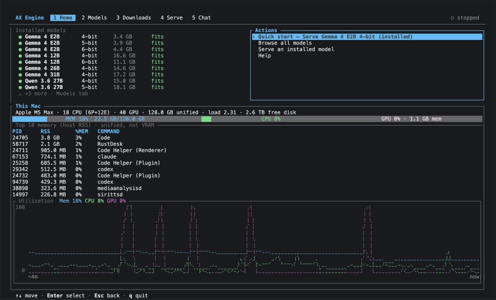
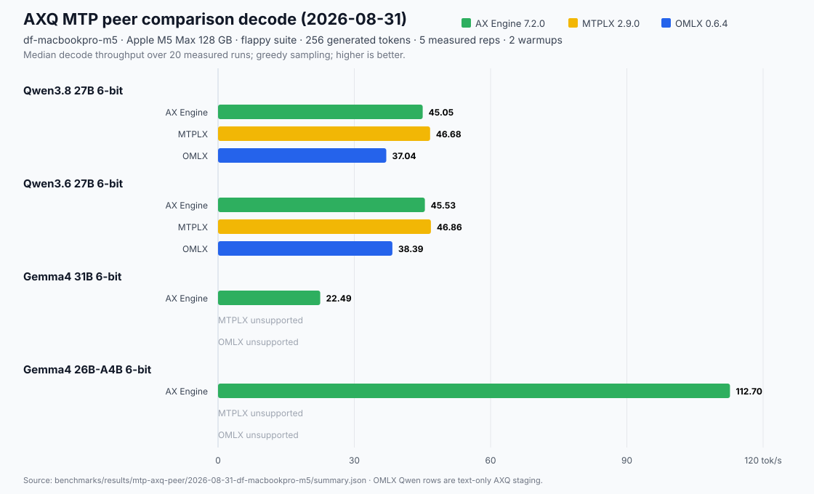
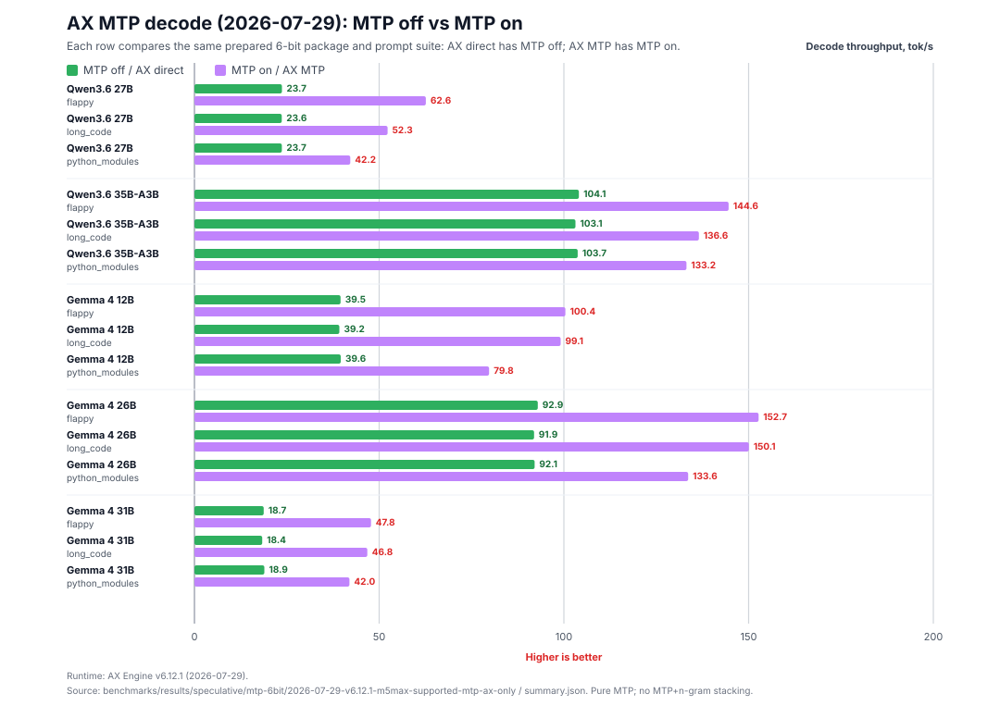

# AX Engine

AX Engine is a **Mac-first** LLM inference runtime for Apple Silicon. Install
with Homebrew, download a curated model, and serve OpenAI-compatible endpoints
locally — with a repo-owned MLX path for Gemma, Qwen, and GLM, first-class MTP,
multi-model serving with exact-prompt prefix reuse, and peer-backed benchmarks
against `mlx-lm`, llama.cpp, MTPLX, and lightning-mlx.

NVIDIA/CUDA fleet serving lives in
[AX Serving](https://github.com/defai-digital/ax-serving). AX Engine remains the
local Apple Silicon runtime and no longer ships the former vLLM or TensorRT
provider bridges, runtime package, container, or CUDA qualification scripts.

Browse AutomatosX serve-ready chat / coding / embedding snapshots in the
[AutomatosX model collection on Hugging Face](https://huggingface.co/AutomatosX/models).
Additional native families (GLM 4.7 Flash, Nemotron Omni, Unlimited-OCR, Whisper,
MiniCPM-V, and others) are documented under
[Supported Models](docs/SUPPORTED-MODELS.md).

**Requires macOS 26 (Tahoe)+ on Apple Silicon (M2 or newer).** For compact
single models (Qwen 3.5 9B 4-bit preferred; 6-bit also fits), **16 GB** unified
memory is enough — including base **Mac mini M4 16 GB**. Prefer 4-bit for
headroom. For multi-model serving, longer contexts, and larger packs
(27B/35B class), plan on **32 GB+** (64 GB recommended).

## Why AX Engine

- **Faster speculative decode** — AutomatosX chat snapshots bundle their MTP
  sidecar or assistant weights, so one standard download is serve-ready; AX
  speeds up **14 of 15** exact same-package 6-bit MTP rows (**1.68×**
  geometric mean; **0.88×–2.56×** range). In the newest Qwen3.6 peer campaign,
  AX beats lightning-mlx on both 35B-A3B rows but trails MTPLX on all three
  comparable rows
- **Faster single-model serving** — on the path users actually measure
  (streaming OpenAI chat), AX Engine **6.13.1** leads a peer MLX serving
  engine **0.4.3** in **8/8** Qwen 3.6 decode cells, with **+12.9%**
  matrix-wide geometric-mean throughput and ~**21–24%** MoE wins
  (2026-08-06, M5 Max) — see [Performance](#performance)
- **Strong direct decode on Apple Silicon** — the fresh v6.13.3 snapshot wins
  **30/30** comparable decode cells against a separate-run `mlx_lm` 0.31.3
  reference (**+4.6%** geometric mean); fresh llama.cpp Metal rows keep the
  three-runtime charts current
- **Multi-model on one process** — keep a scoped set of Qwen 3.5/3.6,
  Qwen3-Coder-Next, Gemma 4, and embedding models resident (`load_mode=add`),
  route by request `model` (chat + embeddings together), with fair Metal turn
  arbitration, memory preflight, and optional idle eviction. Exact-prompt
  **prefix reuse** is the S1 differentiator: official dual-model campaign
  (Qwen stream + Gemma 13.8k prefill) clears **all locked gates** at
  **5.03×** median throughput vs a multi-process peer MLX server — see
  [Performance](#performance) and
  [Server: Multi-model](docs/SERVER.md#multi-model-serving)
- **You own the stack you serve** — AX runs the MLX graph, KV/runtime, and
  OpenAI-compatible server for supported Gemma / Qwen / GLM (and other direct
  families); `mlx-lm` and `llama.cpp` stay optional compatibility adapters
- **Engine-owned scheduling and KV** — continuous batched decode
  (certification-gated), chunked prefill, preempt-and-recompute, and a paged
  KV ledger with cross-request prefix sharing run inside the engine, with a
  published `ax_runtime_*` saturation contract for fleet routers — see
  [Scheduling and KV runtime](#scheduling-and-kv-runtime)
- **Native media and speech** — image/video chat, mixed image+audio reasoning,
  OCR, and Whisper transcription/translation run through repo-owned MLX graphs
  with capability-gated OpenAI endpoints (checkpoint-authoritative; see media
  table below)
- **Clear fleet boundary** — AX Engine owns local Apple Silicon inference;
  [AX Serving](docs/AX-SERVING.md) owns fleet orchestration and NVIDIA/CUDA
  workers
- **Claims you can audit** — public rows ship with checked-in artifacts (route,
  model snapshot, sampler, accept rate, provenance)

## Quick Start

### Homebrew (primary)

```bash
brew install defai-digital/tap/ax-engine
ax-engine doctor
```

Homebrew is the primary install path for the CLI, server, and bench tools.
The self-contained release formula installs the release's pinned
`libmlx.dylib`, `libjaccl.dylib`, and precompiled `mlx.metallib`; it does not
build MLX from source. End users therefore do not need Python, Xcode, or the
Metal Toolchain.

### Python SDK (pip)

Use the wheel for Python applications that `import ax_engine`, optional Python
integrations, or systems where Homebrew is unavailable. Install it in a virtual
environment:

```bash
python3 -m venv .venv
source .venv/bin/activate
python3 -m pip install --upgrade pip
python3 -m pip install --upgrade "ax-engine[download]>=6.15.0,<7"
ax-engine doctor
```

The wheel also exposes `ax-engine` and `ax-engine-server` and bundles the bench
binary used by diagnostics. If both Homebrew and pip are installed, an active
virtual environment normally wins on `PATH`; use `which -a ax-engine` to see
every copy and prefer one installation channel in each shell. See
[Getting Started](docs/GETTING-STARTED.md) for the full channel comparison and
troubleshooting.

### Run AX Engine

**Option A — interactive TUI** (pick a model, download, serve, chat):

```bash
ax-engine tui
```

<p align="center">
  
</p>

**Option B — serve an MTP-ready snapshot**, then request from another terminal.
The command reuses the exact cached snapshot when present and downloads it
otherwise:

```bash
ax-engine serve ax-gemma4-12b --port 31418

curl http://127.0.0.1:31418/v1/chat/completions \
  -H 'content-type: application/json' \
  -d '{"model":"gemma-4-12b-it","messages":[{"role":"user","content":"Say hello in one sentence."}],"max_tokens":64}'
```

**Option C — coding model** (resolve + serve):

```bash
ax-engine serve ax-qwen3-coder-next --port 31418
```

Python wheel, source builds, and troubleshooting:
[Getting Started](docs/GETTING-STARTED.md).

## Models

### Managed AutomatosX catalog (download / TUI)

`ax-engine download --list` and the TUI expose the curated public
[AutomatosX model collection](https://huggingface.co/AutomatosX/models?sort=alphabetical)
only — not every community MLX weight. Qwen 3.5, Qwen 3.6, and Gemma 4 variants
published there (plain 4-bit/6-bit, QAT, OptiQ where available) are first-class
serve targets. Other native families (for example **GLM 4.7 Flash**, Nemotron
Omni, Unlimited-OCR, Whisper, MiniCPM-V) use the repo-owned runtime via serve
aliases, presets, or manual model directories; they are not all AutomatosX-managed
packages. Full matrix:
[Supported Models](docs/SUPPORTED-MODELS.md).

**Recommended starting packages** (serve-ready, match published benches):

| Goal | Alias / family | Why |
| --- | --- | --- |
| Fastest MoE chat + MTP | `ax-qwen3.6-35b-a3b` (4-bit or 6-bit MTP) | Strongest serving and MTP peer decode rows |
| Dense chat + MTP | `ax-qwen3.6-27b` (6-bit MTP preferred) | High same-package MTP speedup; solid serving |
| AXQ evaluation candidate | `qwen3.6-27b:axq` (pinned 6-bit) | Flagship AXQ candidate; explicit until its checkpoint certification gates pass |
| Vision MoE Instruct AXQ | `ax-qwen3-vl-30b` / `ax-qwen3-vl-30b-4bit` | Qwen3-VL 30B-A3B Instruct AXQ packs; candidate, no MTP |
| Multimodal chat + MTP | `ax-gemma4-12b` / 26B / 31B Assistant-MTP | Image/audio/video + assistant draft package |
| Coding agent | `ax-qwen3-coder-next` | Coding-focused MoE; multi-model friendly |
| Embeddings | `ax-embeddinggemma-300m` or Qwen3-Embedding aliases | Batched ingest scale in [full results](docs/PERFORMANCE-RESULTS.md#session-mode-embeddings) |

Repositories ending in `-MTP` or `-Assistant-MTP` already contain the prepared
sidecar or assistant artifacts and `model-manifest.json`. Download them with
the standard flow; do **not** run `download-mtp` afterward.

| Family | Role | Supported AutomatosX snapshots |
| --- | --- | --- |
| Qwen 3.5 9B | Chat / agent | [`AX-Qwen3.5-9B-MLX-4bit-MTP`](https://huggingface.co/AutomatosX/AX-Qwen3.5-9B-MLX-4bit-MTP)<br>[`AX-Qwen3.5-9B-MLX-6bit-MTP`](https://huggingface.co/AutomatosX/AX-Qwen3.5-9B-MLX-6bit-MTP)<br>[`AX-Qwen3.5-9B-MLX-OptiQ-4bit-MTP`](https://huggingface.co/AutomatosX/AX-Qwen3.5-9B-MLX-OptiQ-4bit-MTP) |
| Qwen 3.6 27B | Chat / agent / multimodal | [`AX-Qwen3.6-27B-MLX-4bit-MTP`](https://huggingface.co/AutomatosX/AX-Qwen3.6-27B-MLX-4bit-MTP)<br>[`AX-Qwen3.6-27B-MLX-6bit-MTP`](https://huggingface.co/AutomatosX/AX-Qwen3.6-27B-MLX-6bit-MTP)<br>[`AX-Qwen3.6-27B-MLX-OptiQ-4bit-MTP`](https://huggingface.co/AutomatosX/AX-Qwen3.6-27B-MLX-OptiQ-4bit-MTP)<br>AXQ candidates: [`AXQ-6bit`](https://huggingface.co/AutomatosX/AX-Qwen3.6-27B-MLX-AXQ-6bit-MTP) / [`AXQ-4bit`](https://huggingface.co/AutomatosX/AX-Qwen3.6-27B-MLX-AXQ-4bit-MTP) |
| Qwen 3.6 35B-A3B | Chat / agent / multimodal | [`AX-Qwen3.6-35B-A3B-MLX-4bit-MTP`](https://huggingface.co/AutomatosX/AX-Qwen3.6-35B-A3B-MLX-4bit-MTP)<br>[`AX-Qwen3.6-35B-A3B-MLX-6bit-MTP`](https://huggingface.co/AutomatosX/AX-Qwen3.6-35B-A3B-MLX-6bit-MTP)<br>[`AX-Qwen3.6-35B-A3B-MLX-OptiQ-4bit-MTP`](https://huggingface.co/AutomatosX/AX-Qwen3.6-35B-A3B-MLX-OptiQ-4bit-MTP) |
| Qwen3-VL 30B-A3B Instruct | Vision chat (image/video) | AXQ candidates: [`AXQ-6bit`](https://huggingface.co/AutomatosX/AX-Qwen3-VL-30B-A3B-Instruct-MLX-AXQ-6bit) / [`AXQ-4bit`](https://huggingface.co/AutomatosX/AX-Qwen3-VL-30B-A3B-Instruct-MLX-AXQ-4bit) (no MTP) |
| Gemma 4 12B | Chat / multimodal | [`AX-Gemma-4-12B-IT-MLX-6bit-Assistant-MTP`](https://huggingface.co/AutomatosX/AX-Gemma-4-12B-IT-MLX-6bit-Assistant-MTP)<br>[`AX-Gemma-4-12B-IT-MLX-QAT-4bit-Assistant-MTP`](https://huggingface.co/AutomatosX/AX-Gemma-4-12B-IT-MLX-QAT-4bit-Assistant-MTP)<br>[`AX-Gemma-4-12B-IT-MLX-QAT-OptiQ-4bit-Assistant-MTP`](https://huggingface.co/AutomatosX/AX-Gemma-4-12B-IT-MLX-QAT-OptiQ-4bit-Assistant-MTP) |
| Gemma 4 26B-A4B | Chat / agent / multimodal | [`AX-Gemma-4-26B-A4B-IT-MLX-6bit-Assistant-MTP`](https://huggingface.co/AutomatosX/AX-Gemma-4-26B-A4B-IT-MLX-6bit-Assistant-MTP)<br>[`AX-Gemma-4-26B-A4B-IT-MLX-OptiQ-4bit-Assistant-MTP`](https://huggingface.co/AutomatosX/AX-Gemma-4-26B-A4B-IT-MLX-OptiQ-4bit-Assistant-MTP)<br>[`AX-Gemma-4-26B-A4B-IT-MLX-QAT-4bit-Assistant-MTP`](https://huggingface.co/AutomatosX/AX-Gemma-4-26B-A4B-IT-MLX-QAT-4bit-Assistant-MTP) |
| Gemma 4 31B | Chat / agent / multimodal | [`AX-Gemma-4-31B-IT-MLX-6bit-Assistant-MTP`](https://huggingface.co/AutomatosX/AX-Gemma-4-31B-IT-MLX-6bit-Assistant-MTP)<br>[`AX-Gemma-4-31B-IT-MLX-OptiQ-4bit-Assistant-MTP`](https://huggingface.co/AutomatosX/AX-Gemma-4-31B-IT-MLX-OptiQ-4bit-Assistant-MTP)<br>[`AX-Gemma-4-31B-IT-MLX-QAT-4bit-Assistant-MTP`](https://huggingface.co/AutomatosX/AX-Gemma-4-31B-IT-MLX-QAT-4bit-Assistant-MTP) |
| Qwen3-Coder-Next | Coding agent | [`AX-Qwen3-Coder-Next-MLX-4bit`](https://huggingface.co/AutomatosX/AX-Qwen3-Coder-Next-MLX-4bit)<br>[`AX-Qwen3-Coder-Next-MLX-6bit`](https://huggingface.co/AutomatosX/AX-Qwen3-Coder-Next-MLX-6bit) |
| DiffusionGemma 26B-A4B | Diffusion language model | [`AX-DiffusionGemma-26B-A4B-IT-MLX-4bit`](https://huggingface.co/AutomatosX/AX-DiffusionGemma-26B-A4B-IT-MLX-4bit) |
| EmbeddingGemma 300M | Embeddings | [`AX-EmbeddingGemma-300M-MLX-8bit`](https://huggingface.co/AutomatosX/AX-EmbeddingGemma-300M-MLX-8bit) |
| Qwen3-Embedding 0.6B | Embeddings | [`AX-Qwen3-Embedding-0.6B-MLX-8bit`](https://huggingface.co/AutomatosX/AX-Qwen3-Embedding-0.6B-MLX-8bit) |
| Qwen3-Embedding 4B / 8B | Embeddings | [`AX-Qwen3-Embedding-4B-MLX-4bit-DWQ`](https://huggingface.co/AutomatosX/AX-Qwen3-Embedding-4B-MLX-4bit-DWQ)<br>[`AX-Qwen3-Embedding-8B-MLX-4bit-DWQ`](https://huggingface.co/AutomatosX/AX-Qwen3-Embedding-8B-MLX-4bit-DWQ) |

Native multimodal and speech support is checkpoint-authoritative: AX advertises
only modalities whose required tower tensors are present in
`model-manifest.json`.

| Model family | Inputs | Native API surface | Current scope |
| --- | --- | --- | --- |
| Qwen3-VL; visual Qwen3.5; Qwen 3.6 | Image, video | Chat/generate | Conv3D visual patches, full ViT/merger, MRoPE, multi-image/video ordering; Qwen 3.6 27B image/video smoke-tested on M3 Max |
| Standard Gemma 4 E2B/E4B/26B/31B | Image, video | Chat/generate | Full bidirectional ViT, 2-D RoPE, spatial pooling, checkpoint standardization, and vision projection; E2B image/video smoke-tested on M3 Max; Conformer audio is not yet native |
| Gemma 4 unified 12B | Image, audio, video | Chat/generate | Encoder-free image/audio connector and sampled per-frame video path; requires the unified connector roles |
| MiniCPM-V 4.6 | One or more images | Chat/generate | Dynamic SigLIP grid, mid-tower merger, OCR/document prompts |
| Nemotron 3 Nano Omni | Image, audio, or both | Chat/generate | RADIO vision plus Parakeet audio with ordered mixed-media spans |
| Unlimited-OCR | Image | Native processed-input runtime; delegated OpenAI OCR profile | Full prefill KV is protected; only generated-token KV uses the decode ring |
| Whisper large-v3-turbo | Audio | `/v1/audio/transcriptions`, `/v1/audio/translations`, Rust SDK | WAV/MP3 to 16 kHz; multilingual transcribe/translate; text-generation routes fail closed |

GLM-OCR is not supported.

Download helpers inspect the source tensor index and automatically rebuild
older packaged manifests that omitted a declared Qwen or Gemma vision tower.
For an existing manual model directory, run
`ax-engine-bench generate-manifest --force /path/to/model`.

The default Hugging Face cache layout is
`models--AutomatosX--<repository>/snapshots/<revision>`. Use the shorter
`ax-*` aliases shown by `ax-engine download --list`; for example:

```bash
ax-engine serve ax-qwen3.6-27b --port 31418
ax-engine serve qwen3.6-27b:axq --offline --port 31418  # require pinned AXQ cache
```

Aliases, hardware sizing, and legacy MTP packaging targets:
[Supported Models](docs/SUPPORTED-MODELS.md) ·
[Qwen 3.6 27B AXQ certification](docs/model-certifications/qwen3.6-27b-axq.md) ·
[Hardware FAQ](docs/FAQ.md#what-hardware-does-ax-engine-support) ·
[CLI](docs/CLI.md).

### AXQ endurance evidence

AX Engine 6.13.5 completed an **8-hour endurance test with 8.87 hours of
continuous measured runtime** for the pinned Qwen 3.6 27B AXQ 6-bit model on a
64 GB M4 Pro Mac mini: **437/437 requests
succeeded**, the owned server did not restart, and no retained-RSS growth,
swap, lifecycle-drain failure, or performance guardrail breach was observed.
The operator stopped this run to add deeper vLLM-style leak attribution before
restarting the full 72-hour qualification, so it is short-duration evidence,
not a 72-hour pass. Read the
[8-hour endurance report](docs/model-certifications/qwen3.6-27b-axq-6bit-8h-endurance-2026-08-08.md)
or use the reusable [AXQ endurance utility and detached launch procedure](docs/AXQ-ENDURANCE-SOAK.md#reusable-repository-utility)
to verify another local AXQ package.

### Multi-model serving

One process can keep several **allowlisted** models loaded and route each
request by `model` (OpenAI, gRPC, Ollama, Anthropic). Add mode is limited to
Qwen 3.5 9B, Qwen 3.6 27B/35B, Qwen3-Coder-Next, Gemma 4 12B/26B/31B, and the
EmbeddingGemma 300M / Qwen3-Embedding 0.6B–8B embedding models (chat +
embeddings from one process); AutomatosX `AX-` package names resolve to the
same targets. Each model owns its own session and scheduler while a process
arbiter fair-rotates Metal turns (no fused cross-model batch).

```bash
# After a first model is already serving on :31418
curl -s http://127.0.0.1:31418/v1/model/load -H 'content-type: application/json' -d '{
  "model_id": "gemma-4-12b-it",
  "model_path": "/path/to/gemma-4-12b-artifacts",
  "load_mode": "add",
  "make_default": false
}'

curl -s http://127.0.0.1:31418/v1/chat/completions -H 'content-type: application/json' -d '{
  "model": "gemma-4-12b-it",
  "messages": [{"role": "user", "content": "Hi"}],
  "max_tokens": 32
}'
```

Full contract (load/unload, memory preflight, idle eviction, metrics labels):
[Server: Multi-model serving](docs/SERVER.md#multi-model-serving) ·
[Supported Models](docs/SUPPORTED-MODELS.md#multi-model-serving).

## Scheduling and KV runtime

Token-level scheduling is owned by the engine, not a gateway: each step the
scheduler builds a decode-first, token-budgeted batch with chunked prefill and
mixed prefill+decode routes, backed by a paged logical KV ledger. Full design:
[Scheduler](docs/SCHEDULER.md) · [KV Cache](docs/KV-CACHE.md) ·
[Serving Invariants](docs/SERVING-INVARIANTS.md).

- **Continuous batched decode** — structurally eligible decode requests share
  one batched forward (default on; `AX_MLX_BATCHED_DECODE=0` is the kill
  switch) behind a fail-closed bit-exact certification gate; host-sampled
  batching is a separate opt-in
- **Paged KV ledger with prefix sharing** — per-request block tables,
  ref-counted cross-request prefix reuse, tiered eviction, and an optional
  disk-durable prefix cache that survives restarts
- **Pressure handling** — KV memory-pressure throttling, preempt-and-recompute
  (newest in-flight prefill only, never decode), and server admission control
  (global and per-model concurrency caps → `429`)
- **Fleet telemetry contract** — `/metrics` publishes versioned `ax_runtime_*`
  saturation series (KV utilization, queue depth, batch headroom, TTFT p95,
  decode tok/s, error rate) that [AX Serving](docs/AX-SERVING.md) and other
  routers consume for node selection; token scheduling itself stays on-box

**Current dense batched-decode ceiling.** On the strict M5 Max projection
probe, the default Shared policy reaches **328.9 aggregate tok/s at B=8**
(**4.01×** its B=1 throughput), versus **102.6 tok/s / 1.25×** for the
RowExact fallback. The paired Shared/RowExact ratio is **3.20×** with five of
five wins and identical full-cohort greedy hashes. This is a dense
Llama-3.1-8B, 32-token-prefill microbenchmark—not an end-to-end serving,
long-prompt, or MoE claim. Production continuous-batching claims still require
matching serving evidence—see
[Batched decode ceiling](docs/performance/batched-decode-ceiling.md) and
[Long Context claim boundaries](docs/LONG-CONTEXT.md#claim-boundaries).

## Performance

Why people try AX Engine: **faster serving and speculative decode** on Apple
Silicon, plus **multi-model** that peers usually need multiple processes for.
Results are **session-separated** — do not mix multi-model (S1), single-client
serving, MTP, direct, or embedding rows, and do not mix **M3 Max** vs
**M5 Max** absolute tok/s.

| Session | Peers | Headline | Host / when |
| --- | --- | --- | --- |
| **Single-client serving** | AX Engine · peer MLX serving engine **0.4.3** | **8/8** decode wins · MoE **~21–24%** faster · GM decode **+12.9%** | M5 Max · 2026-08-06 · AX **6.13.1** |
| **Multi-model (S1)** | AX one process · multi-process peer MLX server | **All locked gates** · thr **5.03×** | M5 Max · 2026-08-06 |
| **MTP generation** | AX · [MTPLX](https://github.com/youssofal/MTPLX) · [lightning-mlx](https://github.com/samuelfaj/lightning-mlx) | Exact 6-bit MTP: **14/15 wins**, **1.68× GM**; peer: AX trails MTPLX, beats lightning-mlx **2/3** | M5 Max · 2026-08-06/07 |
| **Direct generation** | AX · [mlx-lm](https://github.com/ml-explore/mlx-lm) · [llama.cpp](https://github.com/ggml-org/llama.cpp) Metal | AX **30/30** decode wins vs separate-run mlx-lm · **+4.6% GM** | M5 Max · 2026-08-07 · separate runs |
| Embeddings | AX · mlx-lm / mlx-embeddings | Qwen **18/18** wins, **+1.56% GM**; EmbeddingGemma **6/6**, **+7.99% GM** | M5 Max · 2026-08-07 · same-session paired |

Full tables, charts, and methodology:
[Performance Results](docs/PERFORMANCE-RESULTS.md) ·
[Benchmarks](docs/BENCHMARKS.md) ·
[Claim boundaries](docs/performance/README.md).

> [!IMPORTANT]
> Prefill/TTFT peer rows require the **same resolved `libmlx`** on both sides.
> Some Homebrew or low-deployment-target MLX builds omit M5 GEMM paths and look
> ~3–4× slower. Details:
> [Performance Results](docs/PERFORMANCE-RESULTS.md).

### Single-client serving: AX vs peer MLX server (newest)

Streaming OpenAI `/v1/chat/completions` — the comparison users run when they
open a server and time chat. **AX Engine 6.13.1** vs peer MLX serving engine
**0.4.3**, Apple **M5 Max** 128 GB, Qwen 3.6 27B / 35B-A3B at 4-bit and 6-bit,
~512 and ~2k prompt targets, 256 gen tokens, temperature 0.

| Model | p512 decode (AX / peer) | p2048 decode (AX / peer) |
| --- | ---: | ---: |
| Qwen3.6 27B 4-bit | **34.40 / 32.32 (+6.4%)** | **33.88 / 32.01 (+5.9%)** |
| Qwen3.6 27B 6-bit | **24.59 / 23.94 (+2.7%)** | **23.97 / 23.35 (+2.7%)** |
| Qwen3.6 35B-A3B 4-bit | **159.10 / 129.06 (+23.3%)** | **156.89 / 126.60 (+23.9%)** |
| Qwen3.6 35B-A3B 6-bit | **128.79 / 106.67 (+20.7%)** | **126.90 / 105.04 (+20.8%)** |

AX wins **8 of 8** decode cells; geometric-mean decode advantage is **12.9%**
(dense 27B **4.4%**, 35B-A3B MoE **22.2%**). Effective prefill and TTFT split
4/8 and are roughly neutral in the matrix-wide geometric mean, so they are not
headline wins. Full prefill/TTFT tables, methodology, provenance, and caveats:

**[Serving peer detail](docs/performance/ax-vs-peer-mlx-serving-qwen36-2026-08-06.md)** ·
[Performance Results: serving](docs/PERFORMANCE-RESULTS.md#session-mode-single-client-serving-ax-vs-peer-mlx)

### Multi-model serving (S1)

One AX process co-serves Qwen interactive stream + Gemma 13.8k prefill with
exact-prompt **prefix reuse** against a multi-process peer MLX server
(2026-08-06, M5 Max). **All locked gates pass** every rep; median
throughput ratio **5.03×** (TTFT and stream-gap p95 also win). Detail:
[S1 results](docs/PERFORMANCE-RESULTS.md#session-mode-multi-model-serving-s1-single-process-vs-multi-process-peer).

### MTP: AX Engine vs MTPLX vs lightning-mlx

Qwen3.6 peer decode (closest fair metric across engines). 27B 4-bit uses the
**same** AX sidecar on all three; 35B-A3B rows are production-configuration
packages. All rows come from one clean, serialized physical-host campaign.
Fairness notes: [Qwen3.6 MTP peer comparison](docs/mtp/qwen36-peer-comparison.md).



| Target | AX Engine | MTPLX | lightning-mlx | Readout |
| --- | ---: | ---: | ---: | --- |
| Qwen3.6 27B 4-bit | 56.1 tok/s | **59.9** tok/s | 57.3 tok/s | Same sidecar; AX trails MTPLX 6.3% and lightning-mlx 2.0% |
| Qwen3.6 27B 6-bit | 44.8 tok/s | — | — | No official peer 27B 6-bit MTP artifact |
| Qwen3.6 35B-A3B 4-bit | 140.9 tok/s | **145.1** tok/s | 124.2 tok/s | AX trails MTPLX 2.9%; leads lightning-mlx 13.4% |
| Qwen3.6 35B-A3B 6-bit | 120.5 tok/s | **125.2** tok/s | 102.0 tok/s | AX trails MTPLX 3.7%; leads lightning-mlx 18.2% |

**Same-package AX acceleration** (exact sampled MTP, v6.13.1, M5 Max — not a
peer leaderboard): **14 of 15** target/suite rows speed up decode, with a
**1.68×** geometric mean and **0.88×–2.56×** range over AX direct on the same
6-bit package. Every row has 100% MTP step coverage. The one regression is
Qwen3.6 35B-A3B `python_modules_long` at **0.88×**; Qwen3.6 35B-A3B reaches
**1.01×–1.09×** on the other two suites, while Gemma 4 12B reaches
**2.02×–2.54×**.



Per-suite tables: [Performance Results: MTP](docs/PERFORMANCE-RESULTS.md#session-mode-mtp-generation).

### Direct generation, embeddings, and archives

The fresh v6.13.3 direct snapshot improves over the dated, tracked-dirty
v6.12.0 benchmark snapshot by **2.7% decode** and **25.3% prefill** on the
36-cell geometric mean while lowering TTFT by **20.2%**. Against a fresh but
separate-run `mlx_lm` 0.31.3 snapshot, AX wins all 30 comparable decode cells
(**+4.6%** geometric mean), while prefill is **10.6% lower** and TTFT is
**11.9% higher**. This is cross-run evidence, not a same-session peer
benchmark or a clean release-to-release comparison.

The fresh same-session embedding matrix is positive but not one uniform-sized
win: Qwen3-Embedding wins all 18 sustained-ingest shapes with a **+1.56%**
geometric mean (near parity to modestly faster), while EmbeddingGemma wins all
six shapes with **+7.99%** geometric mean throughput.

Non-speculative decode/prefill/TTFT (Gemma 4 and Qwen 3.6 box plots from fresh
separate-run AX, `mlx_lm`, and llama.cpp **b10050** Metal snapshots), embedding ingest scale,
DiffusionGemma, and historical composites live under **docs** so this README
stays on the numbers that decide “is AX faster for me?”:

| Topic | Where |
| --- | --- |
| Direct: Gemma 4 / Qwen 3.6 charts | [Performance Results: Direct](docs/PERFORMANCE-RESULTS.md#session-mode-direct-generation) |
| Embeddings (Qwen3 + EmbeddingGemma) | [Performance Results: Embeddings](docs/PERFORMANCE-RESULTS.md#session-mode-embeddings) |
| Gemma 4 12B case study | [v6.8.2 case study](docs/PERFORMANCE-RESULTS.md#gemma-4-12b-retained-v682-case-study) |
| How to interpret a row | [Performance](docs/PERFORMANCE.md) |
| Reproduce a session | [Benchmarks](docs/BENCHMARKS.md) |

**How to read headline metrics**

- **Decode** (tok/s, higher is better) is the main interactive metric.
- **Serving** and **MTP** sessions answer different questions; pick the table
  that matches how you run the engine.
- **Prefill** / **TTFT** are cold-prompt cost; AX does **not** claim a
  matrix-wide prefill lead on every retained historical direct overlay.
- `llama.cpp` rows are shape-compatible GGUF Metal references, not prompt-hash
  parity with MLX artifacts.

## SDKs

Most clients use the OpenAI-compatible HTTP server. Python also has an
in-process session API.

| SDK | Docs |
| --- | --- |
| Rust | [docs/sdk/rust.md](docs/sdk/rust.md) |
| Python | [docs/sdk/python.md](docs/sdk/python.md) |
| JavaScript / TypeScript | [docs/sdk/javascript.md](docs/sdk/javascript.md) |
| Go | [docs/sdk/go.md](docs/sdk/go.md) |
| Ruby | [docs/sdk/ruby.md](docs/sdk/ruby.md) |
| Swift | [docs/sdk/swift.md](docs/sdk/swift.md) |
| Mojo *(experimental)* | [docs/sdk/mojo.md](docs/sdk/mojo.md) |

## Server

`ax-engine serve` is the normal entrypoint (see Quick Start). Default listen is
**`127.0.0.1:31418`** (not AX Serving’s `18080`). Port map, LAN bind, and
Serving vs Engine:

**[Network ports and settings](docs/PORTS.md)**

```bash
curl http://127.0.0.1:31418/v1/runtime
```

Auth, streaming, embeddings, Ollama-shaped routes:
[Server](docs/SERVER.md) · [API Compatibility](docs/API-COMPATIBILITY.md) ·
[OpenClaw](docs/OPENCLAW.md). Fleet / NVIDIA serving:
[AX Serving](docs/AX-SERVING.md).

## Documentation

| Need | Read |
| --- | --- |
| Docs hub | [docs/README.md](docs/README.md) |
| Install and first request | [Getting Started](docs/GETTING-STARTED.md) |
| **Ports, bind host, Engine vs Serving** | **[Ports](docs/PORTS.md)** |
| Models and MTP packages | [Supported Models](docs/SUPPORTED-MODELS.md) · [MTP Docs](docs/mtp/README.md) |
| Hardware / FAQ | [FAQ](docs/FAQ.md) |
| Full performance tables | [Performance Results](docs/PERFORMANCE-RESULTS.md) |
| Serving peer (newest) | [Serving peer detail](docs/performance/ax-vs-peer-mlx-serving-qwen36-2026-08-06.md) |
| Reproduce benchmarks | [Benchmarks](docs/BENCHMARKS.md) |
| Server / API / SDKs | [Server](docs/SERVER.md) · [API](docs/API-COMPATIBILITY.md) · [OpenClaw](docs/OPENCLAW.md) · [SDKs](docs/sdk/README.md) |
| Fleet / NVIDIA (AX Serving) | [AX Serving](docs/AX-SERVING.md) |
| Architecture | [Architecture](docs/ARCHITECTURE.md) |
| Scheduler / KV internals | [Scheduler](docs/SCHEDULER.md) · [KV Cache](docs/KV-CACHE.md) · [Serving Invariants](docs/SERVING-INVARIANTS.md) |

## Development

```bash
cargo build --workspace
cargo test --quiet
cargo clippy --all-targets --all-features -- -D warnings
cargo fmt --check
maturin develop
python -m unittest discover -s python/tests -v
```

Crate layout and conventions: [AGENTS.md](AGENTS.md) ·
[Architecture](docs/ARCHITECTURE.md).

## Limitations

- Qwen3.5 long-prompt prefill can trail upstream MLX references on longer prompts
- Raw HuggingFace / mlx-community snapshots load directly: `model-manifest.json` is auto-generated from `config.json` + safetensors headers on first load and weight sanitization is auto-detected, so `mlx_lm.convert` is not required
- N-gram acceleration is workload-dependent, not a raw kernel speedup
- NVIDIA/CUDA serving requires the separate AX Serving product

Details: [FAQ limitations](docs/FAQ.md#what-are-the-current-limitations).

## Contributing

Issues, wishlist items, reproducible benchmarks, and docs feedback are welcome.
Unsolicited code PRs for runtime, kernel, scheduler, or performance paths are
generally not accepted — open an issue first. See [CONTRIBUTING.md](CONTRIBUTING.md).

## Community

- Website: [automatosx.com](https://automatosx.com)
- Discord: [Join us](https://discord.gg/MECsKdA6zF)
- Email: [enquiry@defai.digital](mailto:enquiry@defai.digital)

## Acknowledgments

AX Engine is grateful to the open-source foundations, benchmarking peers, and
community contributors listed in [Acknowledgments](docs/ACKNOWLEDGMENTS.md).

## License

Apache License, Version 2.0. See [LICENSE](LICENSE).

Copyright (c) 2026 [DEFAI Private Limited](https://defai.digital)
