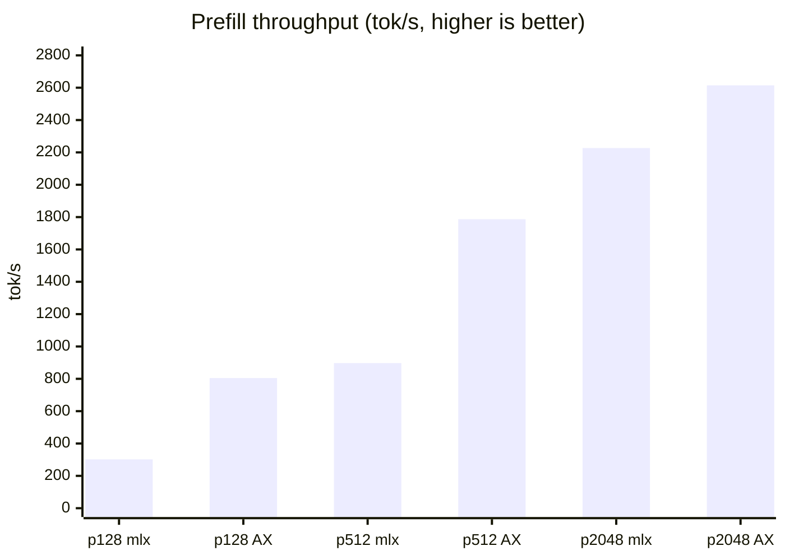
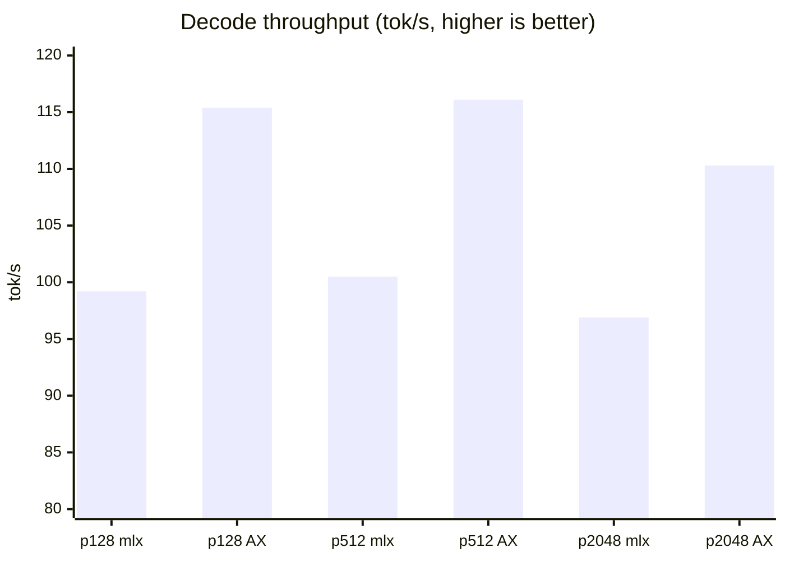
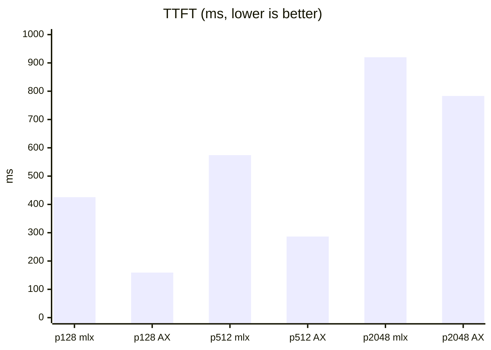
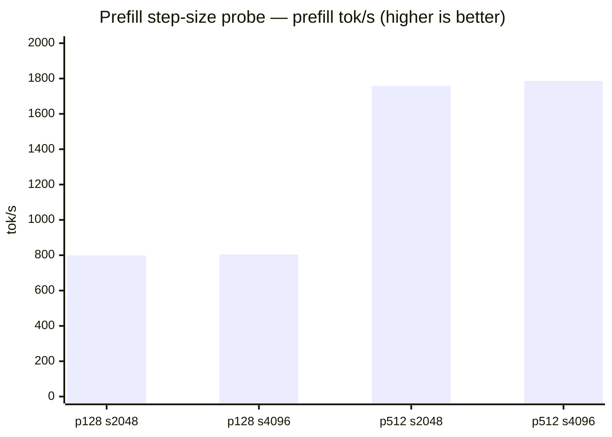
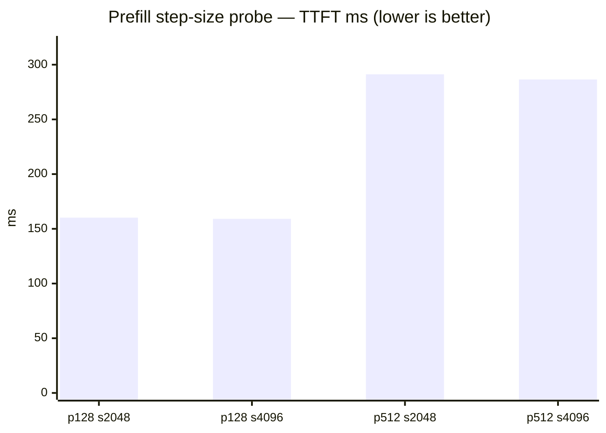

# Qwen3-Coder-Next 4-bit — Direct-Mode Benchmark

Performance benchmark for `mlx-community/Qwen3-Coder-Next-4bit` measured in
**direct mode** (`--ax-direct`, n-gram acceleration disabled) against the
upstream `mlx_lm.benchmark` reference, across **p128, p512, and p2048** prompt
sizes. Includes a prefill-step-size probe (2048 → 4096) validated on 2026-06-13.

## Setup

| Field | Value |
| --- | --- |
| Host | Apple M5 Max, 128 GB, macOS 26.5.1 |
| Model | `mlx-community/Qwen3-Coder-Next-4bit` (qwen3_next, 48 layers) |
| Quantization | 4-bit affine (8-bit MoE gates) |
| Mode | **Direct** (`ax_decode_policy: direct_no_ngram_acceleration`) |
| Shapes | prompt 128 / 512 / 2048, generation 128, greedy, batch 1 |
| Contract | Cold prefill (prefix cache disabled), runner-level TTFT |
| Build | `d816e334` release (rebuilt 2026-06-13 20:25) |
| Repetitions | 2 (step 4096), 3 (step 2048 baseline from 2026-06-12) |

Reproduce:

```bash
python3 scripts/bench_mlx_inference_stack.py \
  --model-repo-id mlx-community/Qwen3-Coder-Next-4bit \
  --prompt-tokens 128,512,2048 --generation-tokens 128 \
  --repetitions 2 --prefill-step-size 4096 \
  --no-build-ax-engine --ax-direct
```

## Results — Direct mode vs mlx_lm reference

| prompt | mlx_lm prefill | AX prefill | Δ | mlx_lm decode | AX decode | Δ | mlx_lm TTFT | AX TTFT | Δ |
| ---: | ---: | ---: | ---: | ---: | ---: | ---: | ---: | ---: | ---: |
| 128 | 301.8 | **804.7** | +166% | 99.2 | **115.4** | +16.3% | 425.5 | **159.1** | −62.6% |
| 512 | 897.2 | **1786.9** | +99.2% | 100.5 | **116.1** | +15.5% | 574.1 | **286.5** | −50.1% |
| 2048 | 2226.9 | **2614.7** | +17.4% | 96.9 | **110.3** | +13.8% | 920.1 | **783.3** | −14.9% |







## Results — Prefill-step-size probe (2048 → 4096)

Recommendation #2 from the 2026-06-12 baseline review: increase the prefill
step size to reduce per-step fixed overhead (eval barriers, generation-state
prep). The 2048 baseline only covered p128/p512; p2048 is new step-4096 data.

| prompt | metric | step 2048 | step 4096 | Δ |
| ---: | --- | ---: | ---: | ---: |
| 128 | prefill tok/s | 798.9 | 804.7 | +0.7% |
| 128 | decode tok/s | 115.2 | 115.4 | +0.1% |
| 128 | TTFT ms | 160.2 | 159.1 | −0.7% |
| 512 | prefill tok/s | 1758.0 | **1786.9** | **+1.6%** |
| 512 | decode tok/s | 113.6 | 116.1 | +2.1% |
| 512 | TTFT ms | 291.2 | **286.5** | **−1.6%** |
| 2048 | prefill tok/s | (no baseline) | 2614.7 | — |
| 2048 | decode tok/s | (no baseline) | 110.3 | — |
| 2048 | TTFT ms | (no baseline) | 783.3 | — |





## Conclusions

1. **Direct mode wins across all prompt sizes.** AX direct beats `mlx_lm` on
   every metric at every prompt size. The prefill advantage is largest at
   short contexts (+166% at p128, narrowing to +17% at p2048 as the reference
   becomes more bandwidth-saturated), while decode stays a consistent
   **+14–16%** and TTFT improves **−15% to −63%**.
2. **Step 4096 is a clear win at p512** (+1.6% prefill, −1.6% TTFT) and neutral
   at p128 (step count already minimal). At p2048 step 4096 keeps prefill at
   2 steps, holding TTFT to 783ms. **Recommend 4096 for Qwen3-Coder-Next.**
3. **Direct mode is the right contract for random-token benchmarks.** N-gram
   acceleration is a net regression here (see below).

## Related finding — n-gram acceleration

N-gram acceleration is a **net regression** on Qwen3-Coder-Next for
random-token prompts (decode −1.1% at p128, −0.4% at p512, from the 2026-06-12
baseline). The `ngram_acceleration_linear_attention_branch_recompute` path pays
recompute cost without accept hits on random tokens. Random-token benchmarks
correctly use `--ax-direct` (the cold-baseline contract).

## Variance and caveats

- Per-trial spread (step 4096, 2 reps), all tight (< 2%):
  - p128: prefill 0.159/0.159s, decode 1.111/1.108s
  - p512: prefill 0.288/0.285s, decode 1.102/1.104s
  - p2048: prefill 0.786/0.781s, decode 1.152/1.169s
- Step-2048 baseline used 3 reps vs this probe's 2 reps; both low-variance, so
  the direction is robust.
- Build commits differ (`90e16a12` baseline vs `d816e334` probe); neither
  touches the MLX prefill hot path materially. The step-count drop is a direct
  mechanical consequence of the larger step size, not a build artifact.
- p2048 has no step-2048 baseline (the 06-12 run didn't cover it); step-4096
  numbers are absolute-only for that size.
- Single host (M5 Max).
