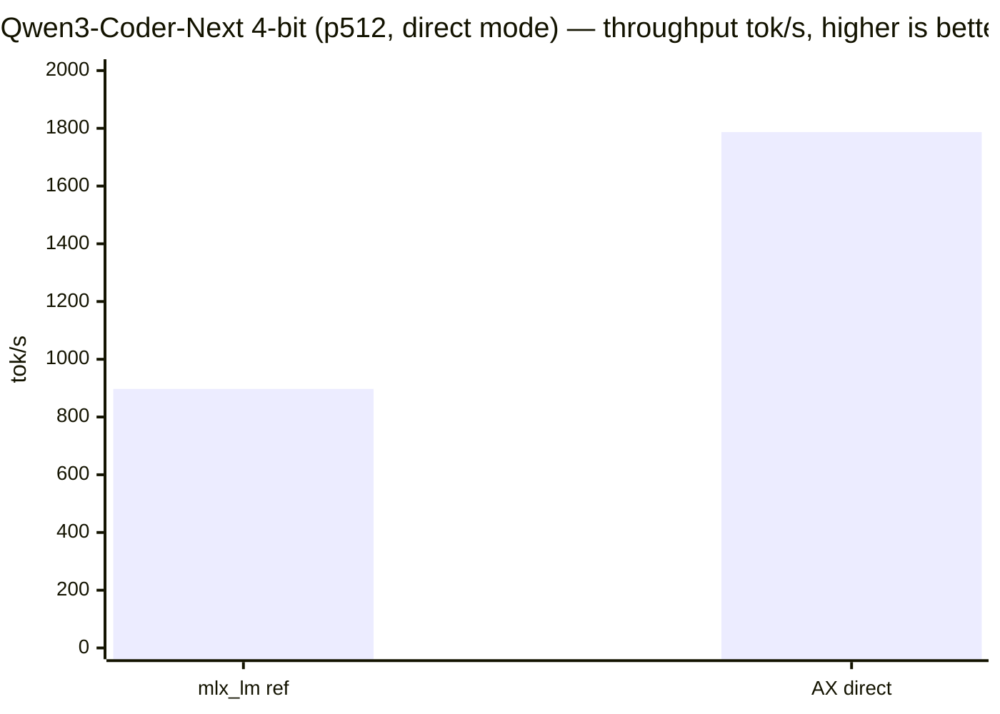
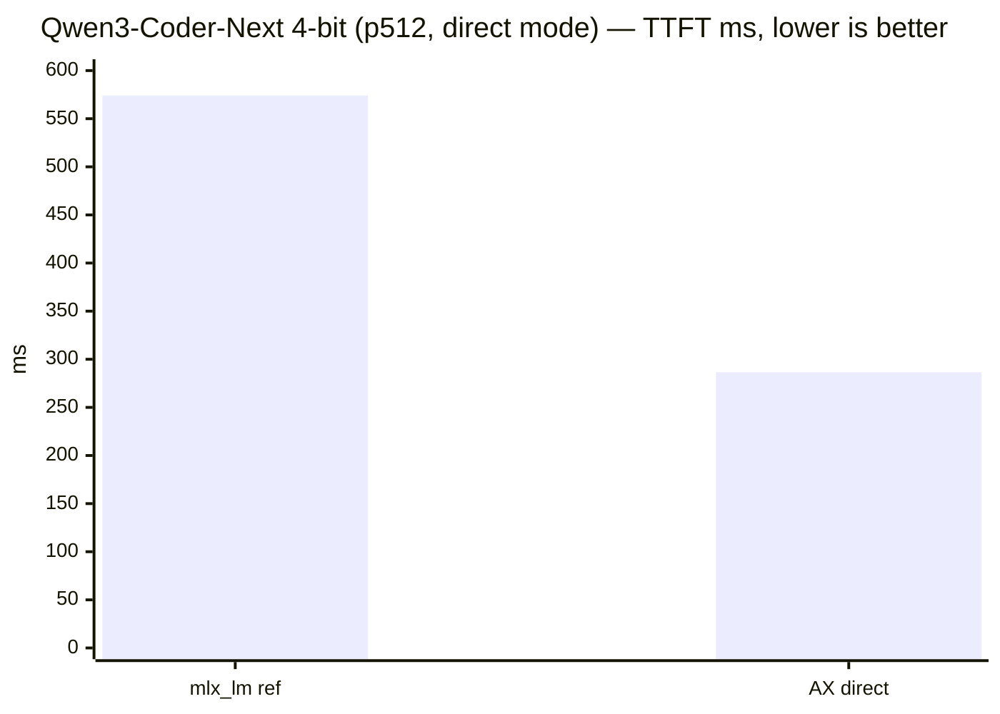
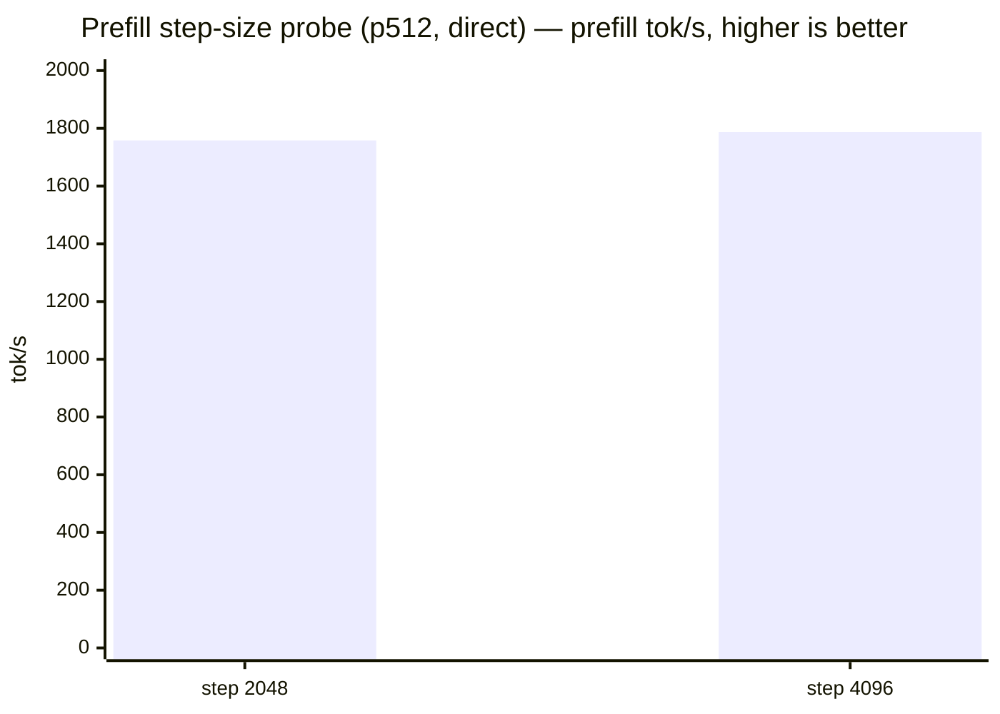
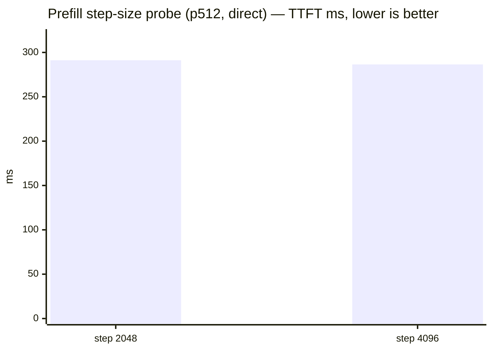

# Qwen3-Coder-Next 4-bit — Direct-Mode Benchmark

Performance benchmark for `mlx-community/Qwen3-Coder-Next-4bit` measured in
**direct mode** (`--ax-direct`, n-gram acceleration disabled) against the
upstream `mlx_lm.benchmark` reference, plus a prefill-step-size probe
(2048 → 4096) validated on 2026-06-13.

## Setup

| Field | Value |
| --- | --- |
| Host | Apple M5 Max, 128 GB, macOS 26.5.1 |
| Model | `mlx-community/Qwen3-Coder-Next-4bit` (qwen3_next, 48 layers) |
| Quantization | 4-bit affine (8-bit MoE gates) |
| Mode | **Direct** (`ax_decode_policy: direct_no_ngram_acceleration`) |
| Shape | prompt 512, generation 128, greedy, batch 1 |
| Contract | Cold prefill (prefix cache disabled), runner-level TTFT |
| Build | `d816e334` release (rebuilt 2026-06-13 20:25) |
| Repetitions | 2 (step 4096), 3 (step 2048 baseline from 2026-06-12) |

Reproduce:

```bash
python3 scripts/bench_mlx_inference_stack.py \
  --model-repo-id mlx-community/Qwen3-Coder-Next-4bit \
  --prompt-tokens 512 --generation-tokens 128 \
  --repetitions 2 --prefill-step-size 4096 \
  --no-build-ax-engine --ax-direct
```

## Results — Direct mode vs mlx_lm reference (p512)

| metric | mlx_lm (reference) | AX direct | AX vs reference |
| --- | ---: | ---: | ---: |
| prefill tok/s | 897.2 | **1786.9** | **+99.4%** |
| decode tok/s | 100.5 | **116.1** | **+15.5%** |
| TTFT ms | 574.1 | **286.5** | **−50.1%** |





## Results — Prefill-step-size probe (2048 → 4096)

Recommendation #2 from the 2026-06-12 baseline review: increase the prefill
step size to reduce per-step fixed overhead (eval barriers, generation-state
prep).

| metric | step 2048 (06-12) | step 4096 (06-13) | Δ |
| --- | ---: | ---: | ---: |
| prefill tok/s | 1758.0 | **1786.9** | **+1.6%** |
| decode tok/s | 113.6 | **116.1** | +2.1% |
| TTFT ms | 291.2 | **286.5** | **−1.6%** |
| prefill wall µs | 842,516 | **551,828** | **−34.5%** |
| prefill steps | 3 | **2** | −1 barrier |





## Conclusions

1. **Direct mode is a clear win over mlx_lm reference.** AX direct delivers
   ~2× prefill throughput (+99.4%), +15.5% decode, and halves TTFT (−50.1%)
   versus upstream `mlx_lm.benchmark` at p512.
2. **Step 4096 is a clear win at p512.** Cutting the prefill step count 3 → 2
   removes one eval barrier and its generation-state prep, dropping prefill
   wall time −34.5% and improving prefill +1.6% / TTFT −1.6%. **Recommend
   keeping 4096 for Qwen3-Coder-Next at p512+.**

## Variance and caveats

- Per-trial spread (step 4096, 2 reps): prefill 0.2878s / 0.2853s,
  decode 1.1016s / 1.1039s — tight (< 1%).
- Comparator uses 3 reps vs this probe's 2 reps; both low-variance, so the
  direction is robust.
- Different build commits (`90e16a12` vs `d816e334`); neither touches the MLX
  prefill hot path materially. The step-count drop (3 → 2) is a direct
  mechanical consequence of the larger step size, not a build artifact.
- Single host (M5 Max).

## Related finding — n-gram acceleration

N-gram acceleration is a **net regression** on Qwen3-Coder-Next for
random-token prompts (decode −1.1% at p128, −0.4% at p512). The
`ngram_acceleration_linear_attention_branch_recompute` path pays recompute
cost without accept hits on random tokens. Random-token benchmarks correctly
use `--ax-direct` (the cold-baseline contract).
