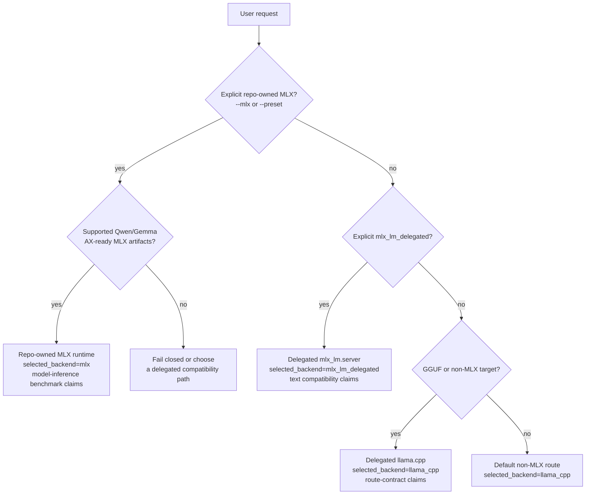

# Getting Started

AX Engine is a Mac-first inference runtime with a local server, SDK bindings,
and benchmark tooling. It is not only an MLX experiment: the repo-owned MLX
runtime is one path, and delegated compatibility paths let users keep the same
AX surface for broader model coverage.

## What You Get

- `ax-engine-server`: local HTTP server over the SDK runtime
- `ax-engine-bench`: workload-contract, readiness, direct-generate, and
  benchmark-support CLI
- `ax-engine-sdk`: backend resolution and session contract
- Python bindings and a JavaScript preview client
- repo-owned MLX inference for supported Qwen/Gemma model artifacts
- explicit delegated compatibility for `mlx_lm.server` and `llama.cpp`

## Choose A Runtime Path

| Path | Select it when | Notes |
|---|---|---|
| Repo-owned MLX runtime | You have a supported Qwen/Gemma MLX model artifact and want repo-owned runtime behavior or performance evidence | Use `--mlx` plus `--mlx-model-artifacts-dir`; benchmark claims must use the MLX inference-stack harness |
| `mlx_lm_delegated` | Upstream `mlx-lm` supports the MLX text model but AX does not yet have a repo-owned graph | Requires a running `mlx_lm.server`; supports blocking text generation and OpenAI-compatible text completion/chat shapes; streaming endpoints fail closed |
| `llama_cpp` | You have GGUF/non-MLX local inference needs | Use a llama.cpp server or CLI target; these are delegated route-contract claims |



The diagram is a routing guide, not a benchmark shortcut. Repo-owned MLX
performance claims still require the MLX inference-stack harness; delegated
paths validate compatibility and route behavior.

## Installation

### Homebrew

For tagged macOS arm64 releases:

```text
brew install defai-digital/ax-engine/ax-engine
```

This installs `ax-engine-server` and `ax-engine-bench`.
The Homebrew formula also installs the `mlx-c` runtime dependency used by the
released binaries.

```text
ax-engine-server --help
ax-engine-bench doctor
```

If `ax-engine-bench doctor` exits before printing a report with
`Library not loaded: /opt/homebrew/opt/mlx-c/lib/libmlxc.dylib`, repair the
runtime dependency with:

```text
brew install mlx-c
brew reinstall defai-digital/ax-engine/ax-engine
```

The GitHub release archive is the Homebrew formula payload, not a standalone
installer with bundled dynamic libraries. Prefer Homebrew for released binaries
so `mlx-c` is installed, upgraded, and linked by the package manager.

### Source

Use source builds for development, Python bindings, local examples, or changes
that have not been tagged yet:

```text
brew install mlx-c
cargo build --workspace --release
```

Python bindings are built into the active environment with:

```text
maturin develop
python -m unittest discover -s python/tests -v
```

## Repository Areas

- `crates/ax-engine-core`: core runtime contracts and bring-up execution loop
- `crates/ax-engine-bench`: workload-contract CLI and bring-up runtime harness
- `crates/ax-engine-sdk`: SDK facade with backend resolution and session management
- `crates/ax-engine-server`: local HTTP server adapter over the SDK
- `javascript/`: repo-local JavaScript preview client package
- `crates/ax-engine-py`: Python extension crate (PyO3)
- `benchmarks/`: canonical benchmark manifests
- `python/`: Python package wrapper, type stubs, tests, examples
- `scripts/`: E2E smoke check scripts
- `docs/`: public-facing documentation

For the current crate layering and dependency-boundary guidance, see
`docs/ARCHITECTURE.md`.

## Requirements

- macOS on Apple Silicon M4 or newer for repo-owned MLX runtime claims
- Rust 1.85+ for source builds
- `mlx-c` for source-built MLX runtime binaries
- a running `mlx_lm.server` for `mlx_lm_delegated`
- a llama.cpp server or CLI target for `llama_cpp`

Runtime surfaces fail closed when a backend is unavailable instead of silently
pretending support exists.

## First Commands

If you installed with Homebrew, use `ax-engine-bench` directly. If you are
working from source, replace `ax-engine-bench` with
`cargo run -p ax-engine-bench --`.

To inspect the workload-contract CLI:

```text
ax-engine-bench help
```

To inspect whether the local machine is inside the supported M4-or-newer AX
runtime contract:

```text
ax-engine-bench doctor
```

To run one thin direct inference request through the SDK-owned session surface:

```text
ax-engine-bench generate --tokens 1,2,3 --max-output-tokens 4
```

To run a llama.cpp-backed text request through a delegated server:

```text
ax-engine-bench generate \
  --prompt "Hello from AX" \
  --support-tier llama_cpp \
  --llama-server-url http://127.0.0.1:8081
```

To run an MLX text model through upstream `mlx-lm` while keeping AX Engine
server/SDK/CLI surfaces:

```text
mlx_lm.server --model /absolute/path/to/mlx-model --host 127.0.0.1 --port 8090

ax-engine-bench generate \
  --prompt "Hello from mlx-lm" \
  --support-tier mlx_lm_delegated \
  --mlx-lm-server-url http://127.0.0.1:8090
```

That route is explicit compatibility only. It is text-only, supports AX
blocking and fake-SSE text surfaces, and is not a repo-owned MLX performance
claim.

To run a checked-in scenario manifest through the current workload-contract
path:

```text
ax-engine-bench scenario --manifest benchmarks/manifests/scenario/chat_qwen_short.json --output-root benchmarks/results
```

The checked-in delegated llama.cpp manifests are route-contract examples, not
repo-owned model-inference benchmarks. They validate the stepwise
`llama.cpp /completion` delegation path and backend-reported prompt-cache
evidence.

To compare the repo-owned MLX runtime against the upstream MLX-family inference
standard:

```text
python3 scripts/bench_mlx_inference_stack.py \
  --model-dir /path/to/local/mlx-model \
  --prompt-tokens 512,2048 \
  --generation-tokens 128 \
  --repetitions 5 \
  --cooldown 5
```

That harness requires `mlx_lm.benchmark` as the primary reference and fails
closed if the matching baseline cannot be produced. Add `--ax-compare-policies`
when you need both direct and n-gram acceleration repo-owned MLX rows. The
default AX row is the direct same-policy comparison, while n-gram acceleration
rows are effective-throughput evidence. Each AX
or optional `mlx-swift-lm` row is compared against the matching
`mlx_lm.benchmark` random-token prompt/decode shape. Use
`--mlx-swift-lm-command` only for an explicit `BenchmarkHelpers` /
`MLXLMCommon` generation adapter that reads the harness-emitted prompt token
JSON. Do not use the retired SwiftLM application-server benchmark as a current
AX Engine baseline.

To run a bounded autotune pass over explicit manifest knobs:

```text
ax-engine-bench autotune \
  --manifest benchmarks/manifests/scenario/chat_qwen_short.json \
  --output-root benchmarks/results \
  --iterations 8
```

Autotune output is candidate evidence. It still needs the normal
scenario/replay/compare gates before it influences architecture or release
decisions.

To validate checked-in MLX dense Qwen and Gemma scenario manifests
through one repo-owned smoke command:

```text
bash scripts/check-bench-mlx.sh
```

That smoke path now emits the repo-owned Metal build report into the default
`build/metal` directory, or the explicit `AX_ENGINE_METAL_BUILD_DIR` override
if set, and when that report reaches `status=compiled` it also requires
benchmark-visible `metal_dispatch_completed` evidence instead of silently
accepting a CPU-only fallback.

To validate the checked-in readiness-report contract itself:

```text
bash scripts/check-bench-doctor.sh
```

To emit the checked-in Phase 1 Metal kernel build report and compile the
compiled Metal preview artifacts (`.air`, `.metalar`, and `.metallib`) when the
local toolchain is actually ready:

```text
cargo run -p ax-engine-bench -- metal-build
bash scripts/build-metal-kernels.sh
```

The repo-owned `ax-engine-bench metal-build` subcommand is now the canonical build
entrypoint. `scripts/build-metal-kernels.sh` remains as a thin wrapper over
that Rust-owned path for smoke checks and automation.
When the same output directory already holds validated compiled assets for the
current checked-in contract, that build command now reuses them instead of
rerunning the full toolchain pipeline.
That checked-in build graph uses `xcrun metal` and `xcrun metallib` as the
required compiler tools. When `metal-ar` is available, AX keeps the archive
stage in the generated artifact report; when only Command Line Tools are
installed, the builder compiles the `.metallib` directly from the `.air` file.
The current MLX Metal bring-up contract stays intentionally narrow by
validating only `block_size_tokens=16`.

To validate the checked-in Metal kernel inventory, manifest, and gated build
contract in one repo-owned smoke check:

```text
bash scripts/check-metal-kernel-contract.sh
```

When a compiled Phase 1 `metallib` is later loaded through the core-owned
macOS bring-up path, AX also treats a sibling
`ax_phase1_dense_path.binary_archive.metallib` as a best-effort pipeline cache:
valid archives are reused, stale ones are recreated, and required compute
pipeline descriptors are serialized back out without turning cache misses into
hard runtime failures.

That bring-up path also now keeps one process-local Metal dispatch arena for
KV cache buffers, so repeated dispatches can reuse previously materialized
slot-backed cache storage while refreshing only the per-step metadata/input
buffers that describe the current workload.

To validate the checked-in MLX replay manifests for live-share, retained
reuse, mixed-path, full-prefix decode, and memory-blocked recovery behavior:

```text
bash scripts/check-bench-replay.sh
```

To run the repo-owned llama.cpp delegated-contract smoke path for the
checked-in scenario and replay example manifests:

```text
bash scripts/check-bench-preview.sh
```

To start the preview local server:

```text
cargo run -p ax-engine-server -- --model-id qwen3_dense --mlx --mlx-model-artifacts-dir /absolute/path/to/mlx-model-artifacts --port 8080
```

To install the checked-in JavaScript preview client from this repository:

```text
npm install ./javascript/ax-engine
```

That package is intentionally thin: it targets the preview server's
`/v1/runtime`, `/v1/generate`, `/v1/generate/stream`, `/v1/completions`,
`/v1/chat/completions`, and `/v1/embeddings` endpoints rather than bypassing
the SDK/server contract. See `docs/API-COMPATIBILITY.md` before assuming full
OpenAI API parity.

To run a repo-owned end-to-end server smoke check instead of driving that path
manually:

```text
bash scripts/check-server-preview.sh
```

To query runtime metadata from that server:

```text
curl http://127.0.0.1:8080/v1/runtime
```

That runtime payload now includes backend-resolution metadata plus host and
Metal-toolchain diagnostics.

To submit and inspect a request through the shared preview server session:

```text
curl http://127.0.0.1:8080/v1/requests -H 'content-type: application/json' -d '{"model":"qwen3_dense","input_tokens":[1,2,3],"max_output_tokens":2}'
curl -X POST http://127.0.0.1:8080/v1/step
curl http://127.0.0.1:8080/v1/requests/1
```

To stream preview lifecycle events from the local server:

```text
curl -N http://127.0.0.1:8080/v1/generate/stream -H 'content-type: application/json' -d '{"model":"qwen3_dense","input_tokens":[1,2,3],"max_output_tokens":2}'
```

To compile the current workspace:

```text
cargo check
```

To build and install the preview Python package into the active environment:

```text
maturin develop
```

If you want one repo-owned command that bootstraps a temporary virtualenv,
installs `maturin`, builds the extension, runs the checked-in Python examples,
and then runs both the installed-package preview tests and the wrapper tests,
use:

```text
bash scripts/check-python-preview.sh
```

To run the checked-in Python preview examples after installation:

```text
python examples/python/basic.py
python examples/python/stepwise.py
python examples/python/streaming.py
```

See `docs/PYTHON.md` for the current Python preview scope.

## Stability Note

Public command surfaces and runtime behavior are still evolving.
Expect interface changes while the v4 engine loop, KV manager, sampler
boundary, and benchmark system continue to mature.
