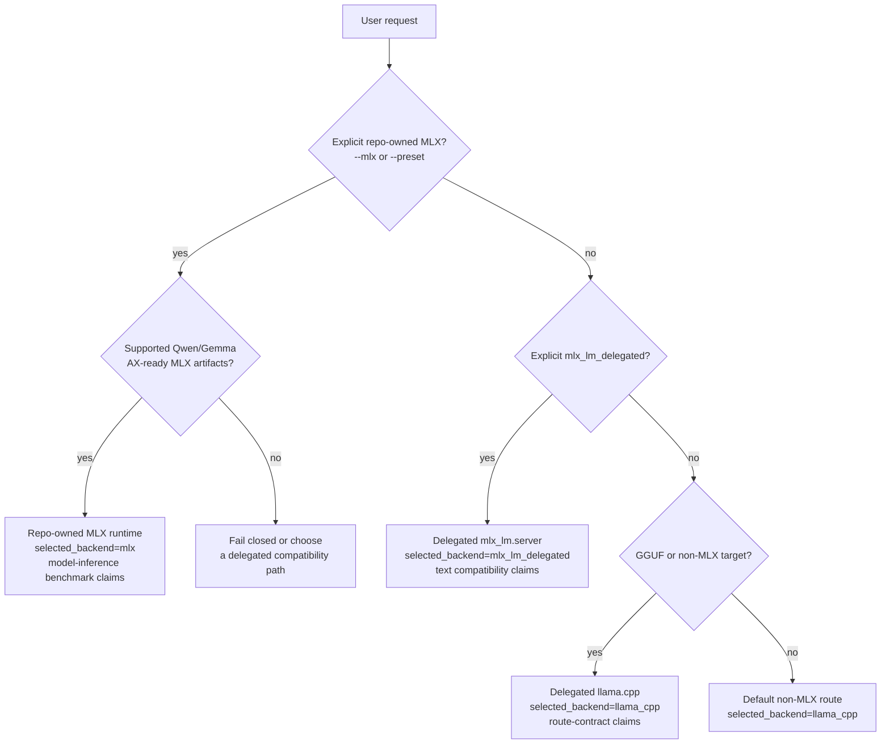

# Getting Started

AX Engine is a Mac-first inference runtime with a local server, SDK bindings,
and benchmark tooling. It is not only an MLX experiment: the repo-owned MLX
runtime is one path, and delegated compatibility paths let users keep the same
AX surface for broader model coverage.

**Related:** [Supported Models](SUPPORTED-MODELS.md) · [CLI](CLI.md) ·
[Server](SERVER.md) · [FAQ](FAQ.md) · [Docs hub](README.md)

## What You Get

- `ax-engine-server`: local HTTP server over the SDK runtime
- `ax-engine-bench`: workload-contract, readiness, direct-generate, and
  benchmark-support CLI
- `ax-engine-sdk`: backend resolution and session contract
- Python bindings, and JavaScript, Go, Ruby, Swift, and Mojo clients
- repo-owned MLX inference for supported Qwen, Gemma, GLM, and embedding model artifacts
- explicit delegated compatibility for `mlx_lm.server` and `llama.cpp`

## Choose A Runtime Path

| Path | Select it when | Notes |
|---|---|---|
| Repo-owned MLX runtime | You have a supported Qwen/Gemma MLX model artifact and want repo-owned runtime behavior or performance evidence | Use `--mlx` plus `--mlx-model-artifacts-dir`; benchmark claims must use the MLX inference-stack harness |
| `mlx_lm_delegated` | Upstream `mlx-lm` supports the MLX text model but AX does not yet have a repo-owned graph | Requires a running `mlx_lm.server`; supports blocking and SSE text generation plus OpenAI-compatible text completion/chat shapes; route-contract evidence only |
| `llama_cpp` | You have GGUF/non-MLX local inference needs | Use a llama.cpp server or CLI target; these are delegated route-contract claims |



The diagram is a routing guide, not a benchmark shortcut. Repo-owned MLX
performance claims still require the MLX inference-stack harness; delegated
paths validate compatibility and route behavior.

## Installation

### Match this guide

These instructions track the latest tagged `6.x` release. **Homebrew is the
primary deployment path** for the `ax-engine` CLI, server, and bench tools on
macOS Apple Silicon; the wheel is the supported secondary path for Python
library use.

| Goal | Recommended channel |
| --- | --- |
| Run the TUI, CLI, server, or benchmark tools | Homebrew |
| Use `import ax_engine`, LangChain helpers, or Python extras | pip in a virtual environment |
| Develop AX Engine or test unreleased changes | Source build |

The repository can move ahead of its released packages. Refresh the selected
channel and compare it with the
[latest GitHub release](https://github.com/defai-digital/ax-engine/releases/latest)
before following the examples:

```bash
brew update
brew info defai-digital/ax-engine/ax-engine
python3 -m pip index versions ax-engine   # optional: Python SDK channel
```

If one channel has not caught up with the latest release, use the other channel
or build that tagged release from source. Do not silently continue with an
older package: it may not provide the command surface documented here.

### Homebrew (primary)

Install the signed macOS arm64 CLI, server, and bench binaries:

```bash
brew tap defai-digital/ax-engine
brew trust --formula \
  defai-digital/ax-engine/ax-engine \
  defai-digital/ax-engine/mlx \
  defai-digital/ax-engine/mlx-c
brew install defai-digital/ax-engine/ax-engine
ax-engine doctor
```

That installs `ax-engine`, `ax-engine-server`, `ax-engine-bench`, and the model
helper scripts onto your `PATH`.

> [!NOTE]
> The formula depends on this tap's own `mlx` / `mlx-c` formulas (not
> homebrew-core bottles) so MLX NAX acceleration is not silently disabled on
> macOS 26.x. Those deps **build from source** and need **Xcode** with its
> **Metal Toolchain** component (no Apple Developer account). Since Xcode 26
> the Metal Toolchain is a separate download; if it is missing, the `mlx`
> formula aborts before building and prints the fix:
>
> ```bash
> xcodebuild -downloadComponent metalToolchain
> ```
>
> Run that once after installing or upgrading Xcode, then re-run
> `brew install`. First install can take a while.

#### Homebrew troubleshooting

If install fails with `xcrun metal --version` or `metallib` missing, make sure
Homebrew is using full Xcode and the Metal Toolchain is installed:

```bash
sudo xcode-select -s /Applications/Xcode.app/Contents/Developer
sudo xcodebuild -runFirstLaunch
sudo xcodebuild -license accept
xcodebuild -downloadComponent metalToolchain
xcrun --kill-cache
xcrun metal --version
xcrun -find metallib
```

If install fails with `mlx is already installed from homebrew/core`, remove the
core MLX packages and retry the AX Engine install:

```bash
brew uninstall mlx-c mlx
brew install defai-digital/ax-engine/ax-engine
```

The `steipete/tap` trust warning sometimes shown by Homebrew is unrelated to
AX Engine.

**Linkage model:** GitHub release binaries are built against pip/venv MLX (for
source and wheel performance parity) and ship with `@rpath/libmlx.dylib`. The
formula rewrites those load commands at install time to
`$(brew --prefix)/opt/mlx/lib/libmlx.dylib` from this tap, then ad-hoc re-signs
`ax-engine-server` and `ax-engine-bench`. The release tarball is not a
standalone installer with bundled dylibs.

```bash
ax-engine doctor
ax-engine-server --help
ax-engine-bench doctor
```

If `ax-engine-bench` / `ax-engine doctor` fails with
`Library not loaded: @rpath/libmlx.dylib` (or empty doctor JSON), the formula
is too old to rewrite linkage. Update the tap and reinstall:

```bash
brew update
brew reinstall defai-digital/ax-engine/ax-engine
brew test defai-digital/ax-engine/ax-engine
```

#### Gatekeeper warning on older releases

AX Engine release binaries for `6.7.1` and newer are expected to be Developer ID
signed and notarized. The canonical `scripts/publish-github-release.sh` now
requires Developer ID signing and notarization before it can publish. Older
release archives were ad-hoc signed and may still show a Gatekeeper dialog that
says _"cannot be opened because Apple cannot verify it"_. That does **not** mean
the binaries are malicious.

For older ad-hoc signed archives, use one of these one-time workarounds.

**Option A — System Settings (per binary):**

1. Try to run the binary once (e.g. `ax-engine-server --help`). The dialog appears.
2. Open **System Settings → Privacy & Security**.
3. Scroll down to the Security section. You will see an _"ax-engine-server was
   blocked"_ entry with an **Allow Anyway** button.
4. Click **Allow Anyway**, then run the command again and click **Open** in the
   confirmation dialog.
5. Repeat for `ax-engine-bench` if needed.

**Option B — Terminal (clears the quarantine flag):**

```text
sudo xattr -dr com.apple.quarantine "$(which ax-engine-server)"
sudo xattr -dr com.apple.quarantine "$(which ax-engine-bench)"
```

Run this once after `brew install`. No Apple Developer account is required.

### Python wheel (SDK / secondary)

Use the wheel when you need the **Python package** (`import ax_engine`),
LangChain helpers, or the optional OpenAI/multimodal extras — or when you cannot
use Homebrew. A virtual environment keeps its Python dependencies isolated from
the system interpreter:

```bash
python3 -m venv .venv
source .venv/bin/activate
python3 -m pip install --upgrade pip
python3 -m pip install --upgrade "ax-engine[download]>=6.11.0,<7"
ax-engine doctor
```

The current macOS arm64 wheel exposes `ax-engine` and `ax-engine-server` and
bundles `ax-engine-bench` behind the Python entrypoints, so a wheel-only install
can still serve and diagnose. If pip cannot find `>=6.11.0` for your platform,
confirm that your configured package index is current, then use Homebrew or the
source build below instead of silently accepting an older release. The wheel
bundles AX and MLX Metal runtime assets used by normal serving; Xcode and
Apple's Metal Toolchain are only required when you build from source, run
developer diagnostics, or rebuild AX Metal kernels.

The wheel and Homebrew formula both install commands named `ax-engine` and
`ax-engine-server`. If you install both, an active virtual environment normally
shadows `/opt/homebrew/bin`; check `which -a ax-engine` and use one installation
channel in each shell to avoid running mismatched versions.

### Source

Use source builds for development, local examples, or changes that have not
been tagged yet. Source is the advanced fallback when neither Homebrew nor pip
has the current tagged release. Install Xcode first, open it once to finish
Apple's setup prompts, then install the Metal Toolchain component:

```text
brew install protobuf
xcodebuild -downloadComponent metalToolchain
python3 -m venv .venv
source .venv/bin/activate
python -m pip install --upgrade pip maturin
python -m pip install "mlx==$(cat mlx.version)"
# Server needs release-server (panic=unwind) so worker panic containment works.
# See docs/SERVER.md and Cargo.toml [profile.release-server].
cargo build --profile release-server -p ax-engine-server
cargo build --release -p ax-engine-bench
# Python extension: use release-pyext (unwind), not --release (abort).
maturin develop --profile release-pyext
export PATH="$PWD/target/release-server:$PWD/target/release:$PATH"
ax-engine doctor
bash scripts/check-mlx-version.sh
```

The repo pins the admitted MLX version in `mlx.version` at the repo root, and
`crates/mlx-sys/build.rs` enforces it at link time: builds fail loudly if the
resolved MLX is a different version (`AX_MLX_VERSION_OVERRIDE=1` to
experiment) or the Homebrew formula (`AX_MLX_ALLOW_HOMEBREW=1` for bring-up
only). The build also consults the repo-local `.venv` even when it is not
activated, so a bare `cargo build` on a dev machine cannot silently drift to
another MLX install. `scripts/check-mlx-version.sh` verifies the same
contract without compiling: pinned version, wheel-bundled `libmlx.dylib`, and
an `LC_BUILD_VERSION` target of 26.2+ (the NAX kernel floor). Bumping the pin
is deliberate: update `mlx.version`, rerun the qmm microbench parity gate and
the bit-exactness suites, and only then trust results.

> [!IMPORTANT]
> Install `mlx` with `pip`, not `brew install mlx`. Homebrew's `mlx` formula
> derives its build's deployment target from `MacOS.version.major.minor`,
> which structurally truncates to `26.0` on every macOS 26.x host (Homebrew
> stopped tracking minor OS versions after Big Sur). MLX's NAX (Neural
> Accelerator) GEMM/attention kernels require a build target of macOS 26.2+;
> below that they silently compile out — no build error, ~3-4x slower
> prefill, only visible via `otool -l libmlx.dylib`'s `LC_BUILD_VERSION`.
> `crates/mlx-sys/build.rs` already prefers a pip-installed `mlx` over
> Homebrew's when both are present, so installing it into the active venv
> before `cargo build` is what makes that resolution pick the correct one.
> See `scripts/build-pypi-wheel.sh`'s header comment for the full
> investigation.

Run the Python test slice from the same environment with:

```text
python -m unittest discover -s python/tests -v
```

## Repository Areas

- `crates/ax-engine-core`: core runtime contracts and bring-up execution loop
- `crates/ax-engine-mlx`: MLX model graphs, KV cache, n-gram acceleration, MTP, and runner dispatch
- `crates/mlx-sys`: bindgen FFI over `ax_shim.h` to MLX C++; safe `MlxArray` RAII wrappers
- `crates/ax-engine-bench`: workload-contract CLI and bring-up runtime harness
- `crates/ax-engine-microbench`: isolated microbenchmarks and kernel dispatch probes
- `crates/ax-engine-sdk`: SDK facade with backend resolution and session management
- `crates/ax-engine-server`: local HTTP server adapter over the SDK
- `sdk/javascript/`: repo-local JavaScript client package
- `sdk/swift/`: native Swift async/await client package
- `crates/ax-engine-py`: Python extension crate (PyO3)
- `benchmarks/`: canonical benchmark manifests
- `python/`: Python package wrapper, type stubs, tests, examples
- `scripts/`: E2E smoke check scripts
- `docs/`: public-facing documentation

For the current crate layering and dependency-boundary guidance, see
[Architecture](ARCHITECTURE.md).

## Requirements

- macOS 26 (Tahoe) or later
- Apple Silicon M2 Max or newer with 32 GB RAM minimum
- Rust 1.88+ for source builds
- `mlx` for source-built MLX runtime binaries
- a running `mlx_lm.server` for `mlx_lm_delegated`
- a llama.cpp server or CLI target for `llama_cpp`

Validated machines include Mac Studio (M2 Max / M2 Ultra and later), MacBook
Pro with M2 Max or newer, Mac Mini M4 Pro, and Mac Studio / Mac Pro with M4
Ultra or M5 Ultra. Macs with less than 32 GB RAM are outside the tested
performance envelope.

Runtime surfaces fail closed when a backend is unavailable instead of silently
pretending support exists.

## Getting a Model

AX Engine requires pre-sanitized MLX weights. Prefer the curated
[AutomatosX catalog](https://huggingface.co/AutomatosX) — those snapshots ship
`model-manifest.json` plus their MTP/assistant extras, so one download is
serve-ready. [mlx-community](https://huggingface.co/mlx-community) checkpoints
work via raw `org/repo` ids; raw Hugging Face checkpoints need
`mlx_lm.convert` first. Full alias lists live in
[Supported Models](SUPPORTED-MODELS.md).

### Path A — CLI / TUI (recommended)

```text
ax-engine tui                          # interactive: pick, download, serve, chat
ax-engine download --list              # list managed aliases
ax-engine download ax-qwen3.6-35b      # MTP-ready AutomatosX snapshot
ax-engine serve ax-qwen3.6-35b --download --port 31418
ax-engine download ax-embeddinggemma-300m   # embedding sibling for /v1/embeddings
```

To keep a second allowlisted model resident while that server runs, use
`POST /v1/model/load` with `load_mode=add` (Qwen 3.5 9B, Qwen 3.6 27B/35B,
Qwen3-Coder-Next, Gemma 4 12B/26B/31B, and the EmbeddingGemma 300M /
Qwen3-Embedding 0.6B/4B/8B embedding models — chat + embeddings from one
process). Details: [Multi-model serving](SERVER.md#multi-model-serving).

### Path B — Python API

`download_model()` downloads LLM weights through `mlx-lm`, resolves the cache
snapshot, and auto-generates the manifest:

```python
from ax_engine import download_model
path = download_model("mlx-community/Qwen3-4B-4bit")
# Session is ready once this returns
```

Install with
`python3 -m pip install --upgrade "ax-engine[download]>=6.11.0,<7"`.

Or via the script:

```text
python scripts/download_model.py mlx-community/Qwen3-4B-4bit
python scripts/download_model.py mlx-community/Qwen3-4B-4bit --json
```

Models land in the Hugging Face Hub cache layout shared with `mlx-lm`, so
`ax-engine-server --resolve-model-artifacts hf-cache ...` can resolve a model
downloaded outside AX Engine. Embedding models are not downloaded by AX Engine —
download them manually and pass the local directory.

### Path C — raw Hugging Face checkpoint

Raw checkpoints need sanitization before AX Engine can load them. Use
`mlx_lm.convert`:

```text
pip install mlx-lm
mlx_lm.convert --hf-path <org/model> --mlx-path /path/to/dest -q --q-bits 4
ax-engine-bench generate-manifest /path/to/dest
ax-engine-server --mlx --mlx-model-artifacts-dir /path/to/dest --port 31418
```

### Manifest generation

Direct MLX models need a `model-manifest.json`. `ax-engine download`,
`download_model()`, and `scripts/download_model.py` generate it when
`ax-engine-bench` or `cargo` is available. To run it manually:

```text
ax-engine-bench generate-manifest /path/to/model     # installed
cargo run -p ax-engine-core --bin generate-manifest -- /path/to/model  # from source
```

## First Commands

Homebrew installs put `ax-engine-bench` on your `PATH`. If you are working from
source, replace `ax-engine-bench` with
`cargo run -p ax-engine-bench --bin ax-engine-bench --`.

To inspect the workload-contract CLI:

```text
ax-engine-bench help
```

To inspect whether the local machine is inside the supported M2 Max-or-newer AX
runtime contract:

```text
ax-engine-bench doctor
```

To run one thin direct inference request through the SDK-owned session surface:

```text
ax-engine-bench generate --tokens 1,2,3 --max-output-tokens 4
```

To run a llama.cpp-backed text request through a delegated server:

```text
ax-engine-bench generate \
  --prompt "Hello from AX" \
  --support-tier llama_cpp \
  --llama-server-url http://127.0.0.1:8081
```

To run an MLX text model through upstream `mlx-lm` while keeping AX Engine
server/SDK/CLI surfaces:

```text
mlx_lm.server --model /absolute/path/to/mlx-model --host 127.0.0.1 --port 8090

ax-engine-bench generate \
  --prompt "Hello from mlx-lm" \
  --support-tier mlx_lm_delegated \
  --mlx-lm-server-url http://127.0.0.1:8090
```

That route is explicit compatibility only. It is text-only, supports AX
blocking and SSE text surfaces, and is not a repo-owned MLX performance claim.
Streamed chunks are delegated text deltas, not AX-owned token/KV evidence.

To run a checked-in scenario manifest through the current workload-contract
path:

```text
ax-engine-bench scenario --manifest benchmarks/manifests/scenario/chat_qwen_short.json --output-root benchmarks/results
```

The checked-in delegated llama.cpp manifests are route-contract examples, not
repo-owned model-inference benchmarks. They validate the stepwise
`llama.cpp /completion` delegation path and backend-reported prompt-cache
evidence.

To compare the repo-owned MLX runtime against the upstream MLX-family inference
standard:

```text
python3 scripts/bench_mlx_inference_stack.py \
  --model-dir /path/to/local/mlx-model \
  --prompt-tokens 512,2048 \
  --generation-tokens 128 \
  --repetitions 5 \
  --cooldown 15
```

That harness requires `mlx_lm.benchmark` as the primary reference and fails
closed if the matching baseline cannot be produced. Add `--ax-compare-policies`
when you need both direct and n-gram acceleration repo-owned MLX rows. The
AX server/user default is n-gram acceleration, while the direct AX row is
kept as the same-policy comparison baseline. N-gram rows are
effective-throughput evidence. Each AX
or optional `mlx-swift-lm` row is compared against the matching
`mlx_lm.benchmark` random-token prompt/decode shape. Use
`--mlx-swift-lm-command` only for an explicit `BenchmarkHelpers` /
`MLXLMCommon` generation adapter that reads the harness-emitted prompt token
JSON. Do not use the retired SwiftLM application-server benchmark as a current
AX Engine baseline.

To run a bounded autotune pass over explicit manifest knobs:

```text
ax-engine-bench autotune \
  --manifest benchmarks/manifests/scenario/chat_qwen_short.json \
  --output-root benchmarks/results \
  --iterations 8
```

Autotune output is candidate evidence. It still needs the normal
scenario/replay/compare gates before it influences architecture or release
decisions.

To validate checked-in MLX dense Qwen and Gemma scenario manifests
through one repo-owned smoke command:

```text
bash scripts/check-bench-mlx.sh
```

That smoke path now emits the repo-owned Metal build report into the default
`build/metal` directory, or the explicit `AX_ENGINE_METAL_BUILD_DIR` override
if set, and when that report reaches `status=compiled` it also requires
benchmark-visible `metal_dispatch_completed` evidence instead of silently
accepting a CPU-only fallback.

To validate the checked-in readiness-report contract itself:

```text
bash scripts/check-bench-doctor.sh
```

To emit the checked-in Phase 1 Metal kernel build report and compile the
compiled Metal preview artifacts (`.air`, `.metalar`, and `.metallib`) when the
local toolchain is actually ready:

```text
cargo run -p ax-engine-bench --bin ax-engine-bench -- metal-build
bash scripts/build-metal-kernels.sh
```

The repo-owned `ax-engine-bench metal-build` subcommand is now the canonical build
entrypoint. `scripts/build-metal-kernels.sh` remains as a thin wrapper over
that Rust-owned path for smoke checks and automation.
When the same output directory already holds validated compiled assets for the
current checked-in contract, that build command now reuses them instead of
rerunning the full toolchain pipeline.
That checked-in build graph uses `xcrun metal` and `xcrun metallib` as the
required compiler tools. When `metal-ar` is available, AX keeps the archive
stage in the generated artifact report; when only Command Line Tools are
installed, the builder compiles the `.metallib` directly from the `.air` file.
The current MLX Metal bring-up contract stays intentionally narrow by
validating only `block_size_tokens=16`.

To validate the checked-in Metal kernel inventory, manifest, and gated build
contract in one repo-owned smoke check:

```text
bash scripts/check-metal-kernel-contract.sh
```

When a compiled Phase 1 `metallib` is later loaded through the core-owned
macOS bring-up path, AX also treats a sibling
`ax_phase1_dense_path.binary_archive.metallib` as a best-effort pipeline cache:
valid archives are reused, stale ones are recreated, and required compute
pipeline descriptors are serialized back out without turning cache misses into
hard runtime failures.

That bring-up path also now keeps one process-local Metal dispatch arena for
KV cache buffers, so repeated dispatches can reuse previously materialized
slot-backed cache storage while refreshing only the per-step metadata/input
buffers that describe the current workload.

To validate the checked-in MLX replay manifests for live-share, retained
reuse, mixed-path, full-prefix decode, and memory-blocked recovery behavior:

```text
bash scripts/check-bench-replay.sh
```

To run the repo-owned llama.cpp delegated-contract smoke path for the
checked-in scenario and replay example manifests:

```text
bash scripts/check-bench-preview.sh
```

To start the preview local server:

```text
cargo run -p ax-engine-server -- --model-id qwen3_dense --mlx --mlx-model-artifacts-dir /absolute/path/to/mlx-model-artifacts --port 31418
```

To install the checked-in JavaScript client from this repository:

```text
npm install ./sdk/javascript
```

That package is intentionally thin: it targets the preview server's
`/v1/runtime`, `/v1/generate`, `/v1/generate/stream`, `/v1/completions`,
`/v1/chat/completions`, and `/v1/embeddings` endpoints rather than bypassing
the SDK/server contract. See [API Compatibility](API-COMPATIBILITY.md) before assuming full
OpenAI API parity.

To run a repo-owned end-to-end server smoke check instead of driving that path
manually:

```text
bash scripts/check-server-preview.sh
```

To query runtime metadata from that server:

```text
curl http://127.0.0.1:31418/v1/runtime
```

That runtime payload now includes backend-resolution metadata plus host and
Metal-toolchain diagnostics.

To submit and inspect a request through the shared preview server session:

```text
curl http://127.0.0.1:31418/v1/requests -H 'content-type: application/json' -d '{"model":"qwen3_dense","input_tokens":[1,2,3],"max_output_tokens":2}'
curl -X POST http://127.0.0.1:31418/v1/step
curl http://127.0.0.1:31418/v1/requests/1
```

To stream preview lifecycle events from the local server:

```text
curl -N http://127.0.0.1:31418/v1/generate/stream -H 'content-type: application/json' -d '{"model":"qwen3_dense","input_tokens":[1,2,3],"max_output_tokens":2}'
```

To compile the current workspace:

```text
cargo check
```

To build and install the preview Python package into the active environment:

```text
maturin develop
```

If you want one repo-owned command that bootstraps a temporary virtualenv,
installs `maturin`, builds the extension, runs the checked-in Python examples,
and then runs both the installed-package preview tests and the wrapper tests,
use:

```text
bash scripts/check-python-preview.sh
```

To run the checked-in Python preview examples after installation:

```text
python examples/python/basic.py
python examples/python/stepwise.py
python examples/python/streaming.py
```

See `docs/sdk/python.md` for the current Python preview scope.

## Stability Note

Public command surfaces and runtime behavior are still evolving.
Expect interface changes while the v6 engine loop, KV manager, sampler
boundary, and benchmark system continue to mature.
