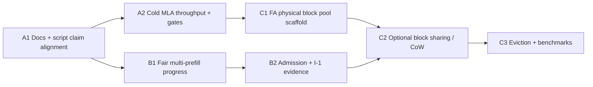
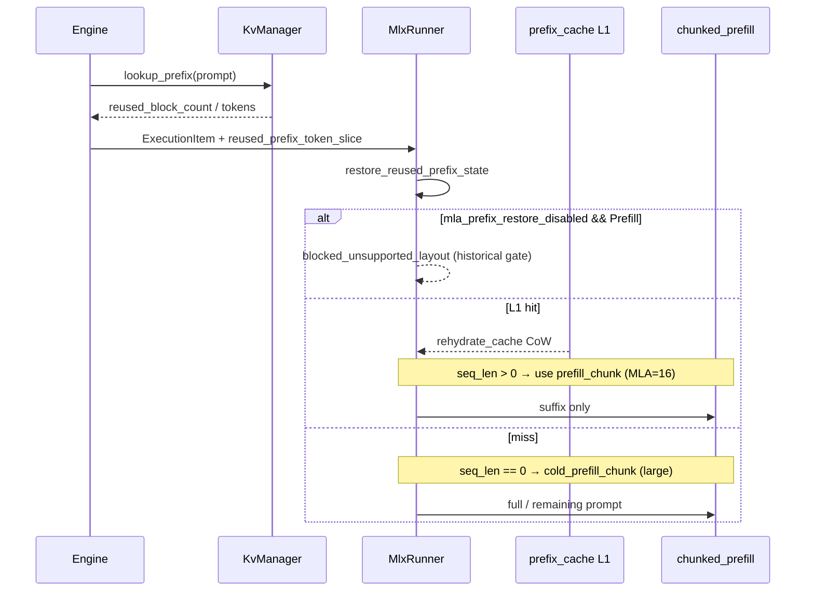
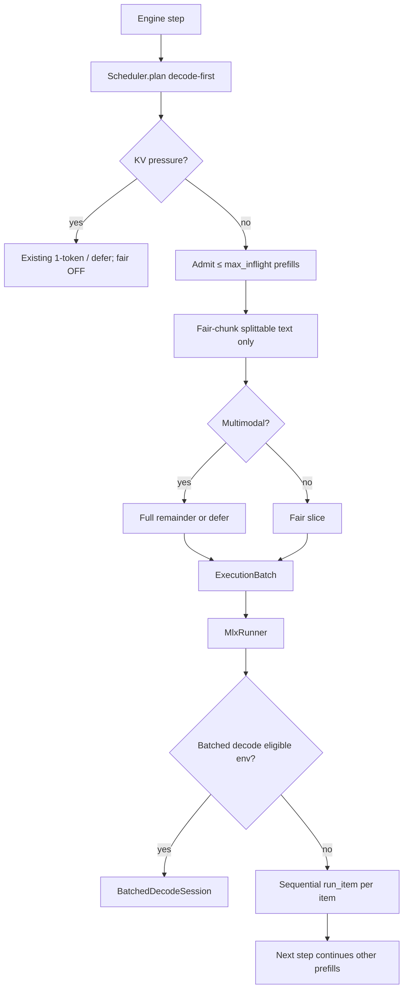
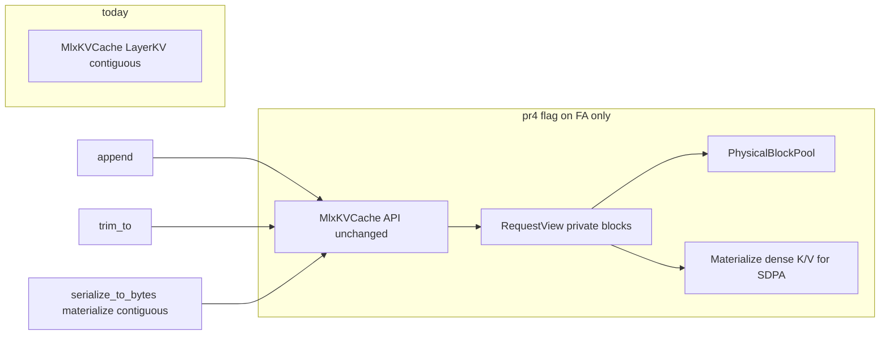
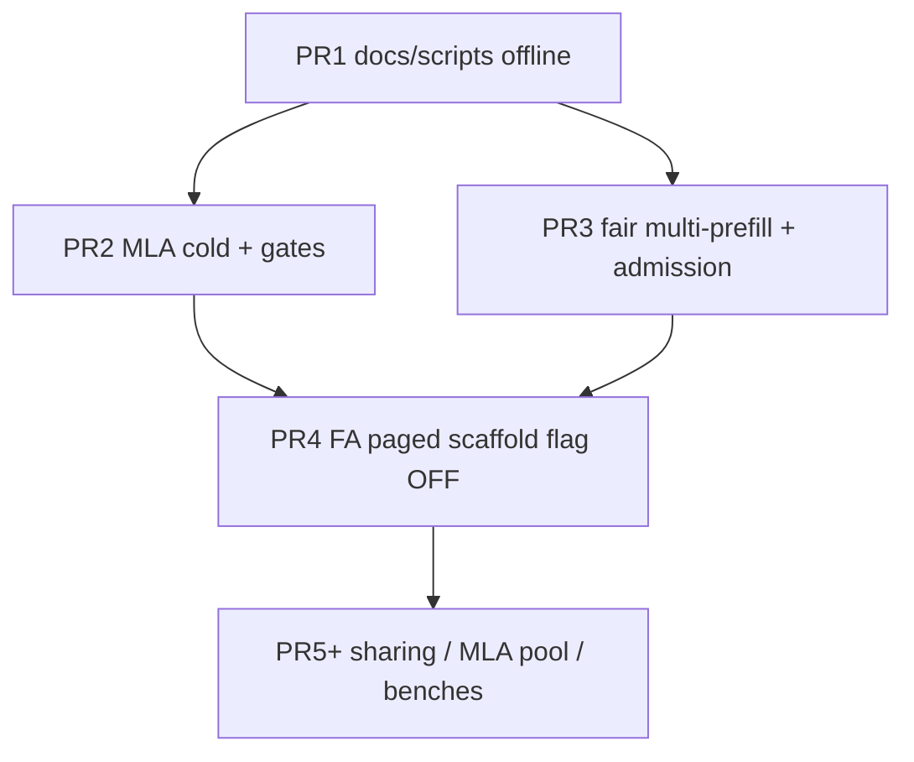

# Strengthen AX Engine KV Cache Weak Surfaces

| Field | Value |
|---|---|
| **Title** | Strengthen AX Engine KV cache weak surfaces (MLA uniformity, concurrent prefill, paged physical layout) |
| **Author** | _TBD_ |
| **Date** | 2026-07-14 |
| **Status** | Approved; Track A R2 + hit-rate harness green; PR3 fair multi-prefill exposed on session/server (default OFF); PR4 FA private pool wired (flag OFF); ADR-006/009 runner-local sharing/COW/native L1 plus fixed 32-row slabs and run-gather into MLX SDPA implemented; one Llama 8K S4 experiment is token-exact and Metal-footprint positive; native block-table decode remains diagnostic; S6 content-addressed durable payload pages are implemented behind a separate default-off flag; default-on soak/p95 matrix, MLA pairs, and logical/physical admission coordination remain open |
| **Related docs** | `docs/KV-CACHE.md`, `docs/SCHEDULER.md`, `docs/LONG-CONTEXT.md`, `docs/SERVING-INVARIANTS.md`, `docs/ROADMAP.md` |
| **Primary crates** | `ax-engine-core`, `ax-engine-mlx`, `ax-engine-sdk`, `ax-engine-bench` |

---

## Overview

AX Engine already has a two-layer KV system: a pure logical block ledger in
`ax-engine-core::KvManager` and per-request GPU buffers in
`ax-engine-mlx::MlxKVCache`. Prefix reuse works well for validated Qwen and
Gemma layouts, and the runtime enforces fail-closed restore (I-2) and
decode-first long-prefill protection (I-1). Three product-visible weak
surfaces remain:

1. **GLM / MLA multi-turn uniformity** — code now restores MLA prefixes by
   default, but public docs, gate-script comments, and claim tables still
   describe the historical block; cold-prefill throughput under the
   chunk-alignment fix needs refreshed evidence and residual recovery work.
2. **High-concurrency long prefill** — the scheduler can select multiple
   prefill items under residual budget, but selection is greedy FIFO (oldest
   prefill monopolizes large slices). The runner still executes non-batched
   items serially via `run_item`. P2 artifacts classify 4-request concurrent
   prefill as `serialized`. Fair interleaving can improve **progress fairness**
   without creating GPU concurrency.
3. **Paged / block-aligned physical layout** — logical blocks exist, but
   physical storage is still contiguous per-request chunked arrays (or MLA
   latent/k_pe pairs), not a global block pool with physical block IDs.

This design proposes a **three-track, evidence-gated plan** that starts with
claim/doc alignment and correctness gates, then recovers MLA cold throughput,
then adds decode-protected multi-prefill **fair progress** (without claiming
continuous batching or `partial_overlap` from fair caps alone), and only then
scaffolds a physical block pool behind a feature flag.

---

## Background & Motivation

### Current architecture (verified)

```text
ax-engine-core (scheduling / logical)
┌──────────────────────────────────────────────────────────┐
│  KvManager  (crates/ax-engine-core/src/kv.rs)             │
│  ├── BlockTable per request (logical block IDs)          │
│  ├── block_ref_counts (cross-request prefix sharing)     │
│  └── cached_blocks (evictable prefix cache)              │
│        FNV-1a-chained hash keys, parent-linked tree      │
└──────────────────────────────────────────────────────────┘
             ↓  prefix hit signals + reused_block_count
ax-engine-mlx (GPU / physical)
┌──────────────────────────────────────────────────────────┐
│  MlxRunner                                               │
│  ├── prefix_cache: LruCache → CacheSnapshot (CoW clone)  │
│  │     + optional disk L2 (.axkv, opt-in)                │
│  └── per-request MlxKVCache (kv_cache.rs)                │
│      ├── LayerKV              (FA / Gemma sliding)       │
│      ├── GlmMlaLayerCache     (kv_latent + k_pe)         │
│      ├── LinearLayerState     (conv + recurrent)         │
│      └── TurboQuantShadow…    [experimental]             │
└──────────────────────────────────────────────────────────┘
```

Key symbols and contracts:

| Surface | Symbol / location | Behavior today |
|---|---|---|
| Logical prefix lookup | `KvManager::lookup_prefix` | Live sharing then retained `cached_blocks`; payload-validated |
| Physical restore | `MlxRunner::restore_reused_prefix_state` | L1 snapshot → L2 disk → warmup recompute; fail-closed |
| Physical growth | `KV_CHUNK_TOKENS = 256` | Chunked `zeros` + `slice_update` growth |
| Trim / rollback | `MlxKVCache::trim_to` | O(1) for FA; does **not** roll back linear recurrent or rotating window |
| Disk L2 | `disk_prefix_cache.rs` + `AX_MLX_PREFIX_CACHE_DIR` | Opt-in; I-2 versioned keys |
| Batched decode | `BatchedKvCache` / `BatchedDecodeSession` | FA multi-row; **optional under `AX_MLX_BATCHED_DECODE`**; **not** production default; **prefill fusion not implemented** (`batched_kv_cache.rs` module comment claiming “not wired” is stale — session path is wired for decode only) |
| Scheduler | `Scheduler::plan` | Pure function over `SchedulerInput`; decode-first; chunked prefill; greedy residual-budget multi-item batches |
| Runner step | `MlxRunner` item loop | Eligible batched **decode** group first (if enabled); remaining items → sequential `run_item` (all prefill) |

### Pain point A — GLM / MLA claim and throughput gap

Historical MLA warm-extend drift was diagnosed as shape-dependent SDPA kernel
selection: a large cold prefill chunk and smaller warm-extend chunks could
diverge at the same absolute positions. The production fix is in tree:

- `MLA_DEFAULT_PREFILL_CHUNK = 16` via `fastpath::resolve_prefill_chunk`
- Dual path in `MlxRunner`:
  - `cold_prefill_chunk` — caller-supplied larger chunk when `state.cache.seq_len == 0`
  - `prefill_chunk` — MLA-aligned small chunk when extending a restored snapshot
- Restore is **enabled by default**; only
  `AX_DISABLE_MLA_PREFIX_RESTORE=1` re-engages the historical
  `mla_extend_unsafe` gate inside `restore_reused_prefix_state`
- Historical allow flag `AX_ALLOW_MLA_PREFIX_RESTORE` is obsolete for the
  default path; evidence scripts may still **record** it for provenance — do
  not document it as required to enable restore

Evidence (checked-in multiturn schema `ax.kv_multiturn_chat_evidence.v1`):

| Artifact | Hits | Reused tokens | TTFT turn1 | TTFT last | Verdict |
|---|---:|---:|---:|---:|---|
| `benchmarks/results/profiling/kv-long-context/glm47-flash-4bit-multiturn-fix-final-2026-05-14.json` | 0 | 0 | 0.791 s | 1.716 s | No physical reuse; TTFT grows |
| `benchmarks/results/profiling/kv-long-context/glm47-flash-4bit-multiturn-mla-fixed-2026-05-14.json` | 10 | 18,496 | 5.109 s | 0.433 s | Physical reuse works; cold path slow in this capture; **not** latency-parity with Qwen/Gemma last-turn rows |

Default-path warm_extend equivalence evidence also exists:

- `benchmarks/results/profiling/prefix-reuse-equivalence/glm47-warm-extend-default-mla-chunk16-2026-05-14.json` —
  PASS 5/5 token-exact overall under default env, but only **1/5 prompts**
  show `ax_mlx_prefix_cache_hits > 0`. Do **not** over-read this as “5/5 with
  a real hit per prompt”; aggregate hit count > 0 is the current checker bar.

Docs / comments still lag code:

- `docs/LONG-CONTEXT.md` still lists GLM multi-turn as “follow-up” with 0 hits
- `docs/KV-CACHE.md` snapshot matrix still says MLA warm_extend is
  **blocked → full recompute**, and the operator cheat sheet still treats
  `blocked_unsupported_layout` on MLA warm_extend as expected
- `scripts/check-prefix-reuse-equivalence.sh` (~lines 76–80) still claims MLA
  Prefill “is intentionally gated to fall through to full recompute”
- `docs/ROADMAP.md` already lists MLA warm-extend correctness and dual-path
  cold recovery as **landed** baseline — claim-alignment PRs must not
  reintroduce “remaining correctness work” wording that conflicts with that

### Pain point B — Concurrent long prefill selection is unfair; wall-clock stays serial

- Scheduler can select multiple prefill requests when
  `global_token_budget` (`EngineSessionConfig.max_batch_tokens`, default 2048)
  has room after decode. Selection is **greedy FIFO on residual budget**: the
  oldest prefill takes `min(remaining_budget, remaining_prompt)`, so one long
  prefill can monopolize steps until finished (or preempted).
- Runner: experimental batched **decode** when `AX_MLX_BATCHED_DECODE` and
  eligibility hold; **all prefill** goes through sequential `run_item`.
  Fair caps change *scheduling fairness*, not Metal concurrency: with pure
  sequential eval of the same token work, cohort wall `W ≈ N·S` and overlap
  stays near 0.
- P2 Qwen3-4B 8k concurrent-prefill artifact (2026-05-07):
  - N=2 → `partial_overlap` (~0.23 efficiency)
  - N=4 → `serialized` (TTFT ~3.77× single, wall ~3.68× single; mean overlap ~0.07)
- Overlap classification thresholds
  (`scripts/run_mlx_p2_latency_artifacts.py::overlap_classification`):
  - `≥ 0.66` → `overlapped`
  - `≥ 0.15` → `partial_overlap`
  - else → `serialized`
  where `overlap = (N·S − W) / ((N−1)·S)`
- I-1 (`long_prefill_vs_decode`) forbids long prefill from starving in-flight
  decode. Any multi-prefill work must re-run that fixture with the new policy
  default ON.
- Multimodal prefills are already **atomic** in
  `Scheduler::build_execution_item`: if
  `has_multimodal_inputs && remaining_budget < remaining_prompt`, the item is
  deferred entirely (must not be split by fair caps).

### Pain point C — Physical layout is not paged

- `KvManager` already uses `block_size_tokens` (session default 16) and
  logical `BlockId`s with refcounts.
- Physical KV is still **one contiguous Metal-backed array per layer per
  request**, grown in 256-token chunks.
- Prefix sharing physically works by **full `MlxKVCache` CoW clone**
  (`MlxArray::clone` refcount), not by mapping multiple requests onto shared
  physical block slabs.
- `docs/ROADMAP.md` lists “Paged or block-aligned KV storage” as the next KV
  track. Full vLLM-style paged attention is explicitly **not** a single-PR goal.
- SDPA (and MLA attention) still expect dense sequence tensors; a block pool
  without kernel changes must **materialize** contiguous views (gather/concat)
  on each forward — a cost that can erase “fewer copies” wins until sharing
  or native block kernels land.

### Why now

- MLA restore correctness is landed; leaving docs and gate-script comments
  wrong undercuts product trust and confuses operators reading telemetry
  cheat sheets.
- Multi-session agent loads need **fair prefill progress** under decode-first
  scheduling without over-claiming continuous batching or GPU overlap.
- Physical block pooling is the path toward true cross-request prefix buffer
  sharing without full-cache snapshot clone — scaffolded incrementally behind
  flags, FA-first, with no public memory-savings claim until sharing lands.

---

## Goals & Non-Goals

### Goals

1. **Claim accuracy (Track A, immediate)**  
   Public and internal docs, gate-script comments, matrices, and telemetry
   cheat sheets match the default-on MLA restore path and dual-chunk cold/warm
   policy.

2. **MLA multi-turn functional correctness on the default path**  
   Physical hits and reused tokens on multiturn evidence; warm_repeat +
   warm_extend equivalence gates green under default env; no unexpected
   `blocked_unsupported_layout` on the default restore path.  
   **Not** implied: last-turn TTFT or cold-prefill latency parity with
   Qwen/Gemma rows (that is PR2+ evidence work).

3. **Recover cold MLA prefill throughput** without reintroducing warm_extend
   drift. Prefer dual-path / constrained adaptive chunk strategies already
   started in `MlxRunner` (`cold_prefill_chunk` vs `prefill_chunk`).

4. **Fair multi-prefill progress under decode-first scheduling (honest
   classification)**  
   Multiple splittable text prefills make measurable progress per step under
   residual budget; decode protection (I-1) stays green; overlap class may
   remain `serialized` under sequential MLX eval — do not claim
   `partial_overlap` from fair caps alone.

5. **Physical block pool scaffolding (Track C)**  
   Behind a flag: FA private block pool aligned to `KvManager` block size;
   `MlxKVCache` facade; no public paged-attention or memory-savings claim
   until sharing evidence passes.

### Non-Goals

- Full vLLM continuous batching or “universal paged attention” product claims.
- Claiming `partial_overlap` / `overlapped` or wall-clock better-than-serial
  from fair interleaving **alone** (requires fused prefill or other real
  concurrency mechanisms).
- Rewriting linear-attention recurrent state or rotating sliding window into
  paged form in v1 (hybrid / non-paged paths remain).
- MLA paired-block pool or non-concat attention kernels in the first scaffold PR.
- Default-on batched prefill graph fusion without certified numerics.
- Unsafe outside `ax-engine-mlx`.
- Broad drive-by refactors outside the PR plan surfaces.
- Changing I-2 fail-closed restore into best-effort partial trust.

---

## Proposed Design

### Track overview



### Track A — GLM / MLA uniformity

#### A.1 Current production contract (as-implemented)



Critical code:

- Kill switch: `fastpath::mla_prefix_restore_disabled` /
  `AX_DISABLE_MLA_PREFIX_RESTORE`
- Chunk resolve: `resolve_prefill_chunk(has_mla, requested, mla_override)`
- Dual path selection in `run_item`:

```rust
// crates/ax-engine-mlx/src/runner/mod.rs (~6022)
let prefill_chunk_for_request = if state.cache.seq_len == 0 {
    self.cold_prefill_chunk
} else {
    self.prefill_chunk
};
```

#### A.2 Doc and claim alignment (PR1)

Update these to match code + checked-in fixed multiturn artifact. PR1 is
**fully offline** (no model weights required).

| File | Change |
|---|---|
| `docs/KV-CACHE.md` | Snapshot matrix: MLA warm_extend = **snapshot path by default**; note kill switch only; update cheat sheet so `blocked_unsupported_layout` on MLA warm_extend is **not** “expected default” |
| `docs/LONG-CONTEXT.md` | Dual-row GLM multiturn: bugfix (`…multiturn-fix-final-…`) vs fixed (`…multiturn-mla-fixed-…`); state functional reuse win; **do not** claim cold TTFT parity with Qwen/Gemma |
| `docs/ROADMAP.md` | Light touch only: ensure remaining-work wording covers **claim refresh + cold evidence**, not re-opening warm-extend correctness (already listed as landed) |
| `scripts/check-prefix-reuse-equivalence.sh` | Fix comment block (~76–80) that still teaches pre-fix MLA Prefill full-recompute gate |
| Claim markers / README long-context boundary | Only if wired to multiturn schema; do **not** invent continuous-batching claims; do not reintroduce `AX_ALLOW_MLA_PREFIX_RESTORE` as required |
| Operator-facing tables in PERFORMANCE / FAQ if they mirror the stale GLM row | Align or point to LONG-CONTEXT dual-row |

**Artifact filenames (correct):**

- Bugfix: `glm47-flash-4bit-multiturn-fix-final-2026-05-14.json` (not `…bugfix-final…`)
- Fixed: `glm47-flash-4bit-multiturn-mla-fixed-2026-05-14.json`
- Optional offline warm_extend checker input:
  `glm47-warm-extend-default-mla-chunk16-2026-05-14.json`

Acceptance (all offline):

1. Unit tests green:
   `python3 -m unittest scripts/test_check_mla_prefix_restore_evidence.py scripts/test_profile_kv_multiturn_chat_evidence.py`
2. Explicit path list above updated; no remaining “MLA warm_extend blocked by
   default” operator guidance in those files
3. Optional offline:
   `python3 scripts/check_mla_prefix_restore_evidence.py` against
   `benchmarks/results/profiling/prefix-reuse-equivalence/glm47-warm-extend-default-mla-chunk16-2026-05-14.json`
4. **No** live GLM inference required for PR1 merge

#### A.3 Cold throughput recovery without warm drift (PR2)

**Problem.** Aligning all MLA prefill to chunk=16 fixes warm_extend but can
inflate cold prefill dispatch count (~5–6× vs large chunks). Code already
splits cold vs warm; residual work is evidence + entry-point coverage + any
constrained recovery if dual-path still regresses cold TTFT.

##### A.3.1 Prefill entry-point chunk matrix (must stay dual-path correct)

| Entry point | When | Chunk field |
|---|---|---|
| Normal prefill in `run_item` | `state.cache.seq_len == 0` | `cold_prefill_chunk` |
| Normal prefill in `run_item` | `state.cache.seq_len > 0` (restored or partial) | `prefill_chunk` (MLA → 16) |
| Linear boundary capture head | mid-prefill split for store | same rule as current `seq_len` |
| Full recompute after failed deserialize / missing prefill output token | after `cache.reset()` | `cold_prefill_chunk` |
| MTP prefill variants | same `seq_len` rule | as above |
| `warm_reused_prefix_without_cache` | fills empty cache then may extend | cold for empty; warm after non-zero |
| JIT constructor warmup | process warm | `prefill_chunk` (shape of warm path) |

PR2 must add unit/integration coverage that these paths cannot silently use the
wrong field (especially MTP and recompute-after-reset).

##### A.3.2 Why dual-path can still be correct for stored MLA state

For GLM MLA, stored state is `kv_latent` + `k_pe` tensors along the token axis,
not an attention kernel intermediate. **If** the forward is mathematically a
function of token content and absolute positions (and MLX kernels agree at
store boundaries), the **values** at a full-prefix boundary can match across
produce-chunk sizes even when intermediate SDPA shapes during production
differed.

The historical drift was observed when **post-restore warm-extend** continued
with a different SDPA shape sequence than a cold path over the **same absolute
positions**. That is why **suffix** extension after restore must use
`prefill_chunk=16` (aligned to block size), while cold production of the
snapshot may use a larger chunk **only if** product gates still pass:

1. Multiturn physical hits + reused tokens on current defaults
2. warm_extend token-exact cold-vs-warm with **per-prompt** physical hit bar
3. No unexpected `blocked_unsupported_layout`

If any gate fails under large cold production, fall back to forcing store-boundary
production under a known shape trail (chunk-16 cold for any request that will
store a prefix snapshot), accepting cold throughput cost for store producers
only.

##### A.3.3 Rules R0–R2 (implementation contract)

- **R0 (shipped default):** cold large (`cold_prefill_chunk`); warm-extend small
  (`prefill_chunk = MLA_DEFAULT_PREFILL_CHUNK` / block_size 16 unless
  `AX_MLX_MLA_PREFILL_CHUNK` set).
- **R1 (candidate only if R0 evidence fails cold TTFT targets):** cold chunk
  may vary, but **any store** happens only at block-aligned full-prefix
  boundaries, and the **consumer** path after restore is always
  `prefill_chunk=16`. Product gate remains token-exact warm_extend, not
  latent bit-exact.
- **R2 (fallback):** if dual-path cold large fails warm_extend with required
  per-prompt hits, force cold producer for store-eligible prompts to the same
  shape trail as warm (`prefill_chunk`), or disable large cold for MLA until a
  certified trail exists. Prefer this over shipping silent drift.

##### A.3.4 Fail-closed gates (PR2)

1. **Refreshed multiturn** on **current** dual-path defaults (not only the
   2026-05-14 mla-fixed capture): schema
   `ax.kv_multiturn_chat_evidence.v1`; require
   `ax_mlx_prefix_cache_hits_total ≥ turns` (or documented expected hits),
   `reused_tokens_total > 0`, zero unexpected `blocked_unsupported_layout`,
   default env (`AX_DISABLE_MLA_PREFIX_RESTORE` unset/false;
   `AX_MLX_MLA_PREFILL_CHUNK` unset for default-path claim).
2. **warm_extend default-path** via
   `scripts/check-prefix-reuse-equivalence.sh` and
   `scripts/check_mla_prefix_restore_evidence.py --require-default-path`:
   - overall PASS 5/5 token-exact
   - **per-prompt physical hit rate target:** at least
     `ceil(0.6 * prompts_total)` prompts with
     `ax_mlx_prefix_cache_hits ≥ 1` and `reused_tokens > 0` (stricter than
     aggregate > 0; raise to 5/5 when store reliability allows)
3. **warm_repeat** same harness (decode-mode full-prefix restore)
4. Unit tests for entry-point chunk matrix above
5. Telemetry: `ax_mlx_prefill_chunk_selected` +
   `ax_mlx_prefill_chunk_mode` (`cold=0` / `warm_extend=1` if string keys
   unsupported in crossover_decisions)

##### A.3.5 Implementation order

1. Entry-point audit + unit tests (wrong-chunk bugs first)
2. Telemetry for chunk mode
3. Refresh GLM multiturn + warm_extend artifacts on default path; tighten
   checker for per-prompt hits
4. Only if cold TTFT still regresses vs pre-fix baseline under R0: explore R1
   with gates; else keep R0 and document cold recovery as “already dual-path;
   evidence refreshed”
5. Store-side: MLA remains **full prefix, block-aligned only**; no intermediate
   block stores without a latent trim story

Risk: cold large reopens warm_extend drift. Mitigation: kill switch
`AX_DISABLE_MLA_PREFIX_RESTORE`; per-prompt hit + token-exact gates; R2
fallback to shape-aligned store production.

### Track B — Fair multi-prefill progress (not GPU overlap)

#### B.1 Levels and honest success criteria

AX is single-process, unified-memory, MLX-eval driven. Fair token caps
**reorder and share step budget**; they do **not** fuse Metal work.

| Level | Definition | Wall-clock / overlap expectation | Product language |
|---|---|---|---|
| L0 | Greedy residual budget: oldest prefill monopolizes large slices | Often `serialized` at N=4 | Current boundary |
| L1 | Fair per-request token slices for **splittable text** prefills; decode first; sequential `run_item` | Cohort wall typically still ~serial; classification **may remain `serialized`** | “fair multi-prefill progress” / “chunk-interleaved scheduling” — **not** continuous batching, **not** a `partial_overlap` claim |
| L1.5 | L1 + mechanisms that can reduce `W` (dispatch waste, host/GPU pipeline overlap, pressure avoidance) | May approach `partial_overlap` if measured | Only with artifact proof |
| L2 | Fused multi-request prefill graph (batched prefill), numerics certified | Can target `overlapped` on allowlisted FA | Schema + checker + allowlist |
| L3 | Full continuous batching + paged KV | Out of scope | Forbidden claim |

Overlap formula (do not game thresholds):

```text
overlap = (N * S - W) / ((N - 1) * S)
```

With pure sequential eval of equal work, `W ≈ N * S` ⇒ overlap ≈ 0.

**L1 success criteria (architecture-honest):**

1. Under multi-prefill contention (N≥2 splittable text prefills, residual budget
   after decode > 0, no hard KV pressure),
   `ax_scheduler_prefill_requests_selected ≥ 2` on a non-trivial fraction of
   steps (unit-tested + bench telemetry).
2. **Progress fairness:** after K steps of pure multi-prefill load, max−min
   `processed_prompt_tokens` across the N requests is bounded (e.g. ≤ one
   fair-chunk quantum, or ≤ `global_token_budget` worth of skew) vs greedy
   monopoly (oldest far ahead). Capture as a scheduler unit test and/or
   workload report field.
3. **I-1 green** with fair interleaving **default ON** under
   `long_prefill_vs_decode` (see §B.4); attach/compare workload report.
4. **Honest classification:** P2 concurrent-prefill artifacts may still report
   `serialized` at N=4; **must not** claim `partial_overlap` or “better than
   serial wall-clock” unless measured. Never loosen overlap thresholds in the
   same PR as the scheduler change.
5. Zero failures; memory-pressure and preempt counters recorded (see §B.2).

**Fairness / TTFT note:** fair interleaving typically **worsens early-request
TTFT** (the oldest no longer monopolizes the GPU) while **equalizing tails**
and reducing starvation of later arrivals. L1 success is progress fairness +
I-1, **not** “TTFT p50 ≤ N× single within 10%” as a primary bar (FIFO already
can pass that for late requests without fairness).

#### B.2 Scheduler changes and full config plumbing

**Today:** `SchedulerInput` is only:

```rust
// crates/ax-engine-core/src/scheduler.rs
pub struct SchedulerInput {
    pub step_id: StepId,
    pub request_snapshots: Vec<RequestSnapshot>,
    pub memory_pressure: Option<String>,
    pub global_token_budget: u32,
}
```

`Scheduler::plan` is pure over that struct. A session-level fair-chunk knob
**cannot** reach `plan()` without extending `SchedulerInput` (or reading env
inside `plan()`, which breaks deterministic testability culture in
`docs/SCHEDULER.md` and is **rejected**).

**Plumbing (required for PR3):**

Session policy knobs live on config; **KV snapshot fields** are observed by the
engine at each `plan()` call from `KvManager` (same call sites already pass
`memory_pressure`). Free-block headroom and block size are **not** optional
later fields — they are required inputs so pure `plan()` can implement
admission without reading `KvManager` or env.

```text
EngineSessionConfig  (policy; set once)
  multi_prefill_fair: bool                 // default: TBD Open Q1; kill switch off path
  max_prefill_tokens_per_request_per_step: Option<u32>
  max_inflight_prefill_requests: Option<u32>  // admission cap; None = derived

Engine (per plan() call site — all re-plan phases)
  reads KvManager::available_block_count()
  reads KvManager::config().block_size_tokens / total_blocks
  reads KvManager::memory_pressure()   // existing

        │
        ▼
SchedulerInput {  // EXTENDED — pure plan() inputs only
  // existing
  step_id, request_snapshots, memory_pressure, global_token_budget,

  // session policy (from EngineSessionConfig)
  multi_prefill_fair: bool,
  max_prefill_tokens_per_request_per_step: Option<u32>,
  max_inflight_prefill_requests: Option<u32>,

  // KV ledger snapshot (from KvManager at this plan call; required for headroom)
  block_size_tokens: u32,              // KvManagerConfig.block_size_tokens
  available_kv_blocks: u32,            // KvManager::available_block_count()
  total_kv_blocks: u32,                // KvManagerConfig.total_blocks (telemetry + caps)
}
        │
        ▼
Scheduler::plan(&SchedulerInput)  // still pure; no env, no KvManager borrows
```

Also update: `docs/SCHEDULER.md` algorithm list, scheduler unit tests, any
bench/session constructors that build `SchedulerInput` manually. Engine must
refresh `available_kv_blocks` / pressure on **every** `plan()` invocation
(initial, prefix-reuse re-plan, KV-fallback re-plan).

**Fair-chunk algorithm (when `multi_prefill_fair` and residual budget allow):**

1. Decode-first as today (`execution_mode_priority`).
2. Count **splittable text** prefill candidates (exclude multimodal from the
   fair-N denominator for caps; see below).
3. **Admission / occupancy (all pure over `SchedulerInput`):**
   - Under existing memory pressure strings
     (`kv_low_free_blocks:*`, `kv_exhausted_reclaimable_cache`,
     `kv_exhausted`): **disable fair multi-prefill** and keep current throttle
     (`MEMORY_PRESSURE_MAX_PREFILL_TOKENS_PER_STEP = 1` or defer). Fair mode
     must not fight soft/hard pressure for concurrency optics.
   - Otherwise compute a candidate fair quantum:
     `fair_chunk = max_prefill_tokens_per_request_per_step.unwrap_or(
        max(block_size_tokens, residual_budget / max(1, candidate_prefill_count)))`.
   - Estimate blocks per admitted prefill for one quantum (ceiling division):
     `blocks_per = ceil(fair_chunk / block_size_tokens)` (at least 1 if
     `fair_chunk > 0`). This is a **conservative planning estimate**; concrete
     `KvManager::allocate` remains authoritative after plan.
   - Cap admitted prefill count:
     ```text
     headroom_cap = available_kv_blocks / max(1, blocks_per)
     admitted = min(
       candidate_prefill_count,
       max_inflight_prefill_requests.unwrap_or(candidate_prefill_count),
       headroom_cap,
     )
     ```
     If `admitted < 1` but residual budget remains, fall back to greedy single
     prefill (legacy monopoly) so work still progresses; if
     `available_kv_blocks == 0` and pressure would not already defer, still
     defer to existing allocate / blocked-on-memory paths.
4. For each selected **splittable text** prefill (oldest-first among admitted):
   `scheduled = min(remaining_prompt, residual_budget, fair_chunk)`.
5. **Multimodal atomic exemption:** if `has_multimodal_inputs`, never apply
   fair cap that would set `scheduled < remaining_prompt`. Either schedule the
   full remainder when `remaining_budget >= remaining_prompt`, or **defer**
   entirely (existing `defers_multimodal_prefill_instead_of_splitting`
   behavior). Unit-test under multi-prefill contention. Multimodal full-prompt
   block estimate may use `ceil(remaining_prompt / block_size_tokens)` against
   `available_kv_blocks` when deciding whether residual can host it this step.
6. Decode still consumes budget first at full requested decode tokens.

**Invariant:** free-block headroom admission runs **inside** pure `plan()` using
`available_kv_blocks` / `block_size_tokens` on `SchedulerInput`. It is **not**
an engine post-plan shrink (that would duplicate policy and race re-plans).
Engine post-plan work remains the existing allocate / preempt /
`BlockedOnMemory` path when the estimate was optimistic.

**Concurrent live KV impact (critical):**

Today greedy monopoly grows ~1 prefill’s KV to full length while others wait.
Fair multi-prefill intentionally grows **N caches in lockstep**, so peak live
KV during the prefill window shifts toward **~N partial/full prompts** (+ any
decodes). That **raises** simultaneous multi-request footprint on UMA even
though **per-request tokens per step** fall.

Therefore PR3 **must**:

- Document this trade-off in SCHEDULER.md and operator docs
- Ship admission caps (`max_inflight_prefill_requests` + free-block headroom via
  `available_kv_blocks` on `SchedulerInput`)
- Record `ax_scheduler_memory_pressure_observed`, preempt counts, and
  `kv_usage_blocks` peaks in acceptance artifacts
- Disable fair multi-select under soft/hard KV pressure as above

**Telemetry:**

- `ax_scheduler_prefill_requests_selected`
- `ax_scheduler_prefill_fair_chunk_tokens`
- `ax_scheduler_prefill_headroom_cap` (admitted limit from `available_kv_blocks`)
- `ax_scheduler_prefill_deferred_for_fairness` (admitted-cap, headroom, or residual)
- `ax_scheduler_prefill_deferred_multimodal_atomic`
- `ax_scheduler_multi_prefill_fair_enabled` (0/1)
- Existing pressure / preempt metrics retained

#### B.3 Runner changes

Today (`runner/mod.rs` ~4833): after optional batched **decode** group, remaining
items use sequential `for item in items { run_item(...) }`. Under L1 that is
**expected** — interleaving is **across engine steps**, not inside one MLX
graph. Do not market sequential multi-item steps as GPU overlap.

Required runner work for PR3:

1. Audit multi-item prefill batches for “first item only” bugs in
   `dispatch_runner`, prefix-restore aggregation, and store paths.
2. Counters:
   - `ax_mlx_prefill_items_executed`
   - `ax_mlx_prefill_tokens_executed`
   - optional wall-us sum (expect ≈ sum of per-item; documents serial eval)
3. **Do not** enable batched prefill fusion in PR3.
4. Keep experimental `BatchedDecodeSession` independent (env-gated decode only).

Optional later (L2, fail-closed, separate PR):

- Batched **prefill** only for FA layouts with token-exact oracle vs sequential
  `run_item`
- Env e.g. `AX_MLX_BATCHED_PREFILL=1` + model allowlist
- Numeric miss → sequential fallback + `ax_mlx_batched_prefill_blocked_*`



#### B.4 Evidence and honesty

- Refresh P2 concurrent-prefill artifacts after PR3 for **telemetry and
  fairness**, not as a forced reclassification win.
- Checker `check_mlx_concurrent_prefill_artifact.py`: `serialized` remains a
  valid **boundary** result; never rewrite 0.15/0.66 thresholds to game claims.
- **I-1:** re-run
  `cargo run -p ax-engine-bench --bin ax-engine-bench -- serving-stress --workload long_prefill_vs_decode`
  with fair multi-prefill **enabled as the candidate default**, under a load
  shape that includes background multi-prefill (not only single monopolizer).
  Compare `foreground_ttft` / `foreground_itl` to prior report; fail PR if
  beyond documented fixture bound. Kill-switch default recommendation (Open
  Question #1) is informed by that result.
- Acceptance also requires non-zero observation path for pressure/preempt under
  a tight `total_blocks` stress unit or bench (proves admission model engages).

### Track C — Paged / block-aligned physical layout

#### C.1 Principles

1. **Do not** attempt full paged attention in one PR.
2. Align physical block size to `KvManagerConfig.block_size_tokens` (typically 16).
   `KV_CHUNK_TOKENS=256` may remain an allocation batching hint (N logical
   blocks) but is not the addressing unit for the pool.
3. Keep `MlxKVCache` as the public runner-facing facade.
4. **PR4 scope is FA-only private blocks.** MLA paired blocks, rotating window,
   linear, TurboQuant, and cross-request sharing are **out of PR4**.
5. **No public memory-savings claim** until sharing (PR5+) lands and is measured.
   Private paging may **increase** temporary copies via attention materialization.

#### C.2 Target data model (PR4 scaffold)

```text
PhysicalBlockPool (flag AX_MLX_FA_KV_BLOCK_POOL, default OFF)
├── config: block_size_tokens, max_blocks, dtype policy
├── free_list: Vec<PhysicalBlockId>
├── refcount: HashMap<PhysicalBlockId, u32>  // private alloc: always 1 in PR4
└── layers: Vec<LayerSlab>   // FA K/V only in PR4
      └── slab: Metal-backed max_blocks × block_size × n_kv_heads × head_dim

RequestView (behind MlxKVCache facade when flag on, FA layers only)
├── logical_to_physical: Vec<PhysicalBlockId>
├── seq_len, partial_tokens
└── append: alloc free blocks or InsufficientCapacity; write token slice
```

**Pool sizing / exhaustion (as-shipped):**

- Each request's `MlxKVCache` owns its **own** `FaBlockPool` instance
  (allocated in `MlxKVCache::new_with_fa_block_pool` / on `.clone()`), not
  one session-wide singleton — the ASCII sketch above depicts the logical
  shape, not literal sharing. `max_blocks` is a **per-cache ceiling**:
  `MlxRunner::align_fa_block_pool_to_kv` sets it to `KvManager.total_blocks`
  at session bring-up (or the operator override
  `AX_MLX_FA_KV_BLOCK_POOL_MAX_BLOCKS` when set), so one request's paged
  footprint cannot exceed the session's logical block budget. There is
  **no** init-time fail-closed check for engine/pool divergence, and no
  cross-request shared physical budget in PR4 — a real session-wide pool
  is PR5+ scope (see the risk noted in Alternatives / Track C.2 history).
- On pool exhaustion: **fail-closed at the request level**, always, in both
  production configurations (auto-aligned to `KvManager.total_blocks`, or
  the explicit `AX_MLX_FA_KV_BLOCK_POOL_MAX_BLOCKS` override) —
  `default_fa_block_pool_config` and `MlxRunner::align_fa_block_pool_to_kv`
  both set `FaBlockPoolConfig::hard_cap = true` unconditionally, because
  `max_blocks` is a real memory budget either way (an operator-configured
  session capacity, not an arbitrary scaffold default) and exceeding it is
  a genuine capacity problem, not something to paper over with unbounded
  contiguous growth. `append_paged_fa` still demotes the layer to
  contiguous storage first (data stays correct — proven token-exact by
  `fa_paged_pool_exhaustion_demotion_matches_contiguous_oracle` — so the
  in-flight forward pass completes safely instead of unwinding
  mid-computation), but `MlxKVCache::hard_cap_exhausted()` sticks and
  `MlxRunner::run_item` turns the result into a per-request error
  (`errored_item_run` → `RequestExecutionUpdate.error` →
  `RequestRecord::fail` → normal terminal cleanup, releasing both the
  logical `KvManager` blocks and the runner-side cache) instead of
  returning the computed token. This fails only the offending request — not
  a process abort (this workspace builds with `panic = "abort"`, so a naive
  panic-based fail-closed would take down every in-flight session, not just
  the one that hit the cap), and not the engine-level
  `InsufficientCapacity`/`BlockedOnMemory` admission path (that operates
  before scheduling, not mid-forward). Every case still increments
  `ax_mlx_kv_paged_pool_exhaustion_fallbacks`. `FaBlockPoolConfig::hard_cap
  = false` (fail-soft) remains a real, tested code path — reachable only
  via a directly-constructed `FaBlockPoolConfig`, not through either
  production config constructor.

**Attention materialization (accepted PR4 cost):**

SDPA expects dense `[1, n_kv_heads, T, head_dim]`. PR4 **materializes** a
contiguous view (concat/gather into a temporary or cached dense buffer) on each
forward that needs full K/V. Measure this cost in microbench; it may regress
decode/prefill vs contiguous. That is acceptable for a flag-OFF scaffold whose
purpose is layout + oracle correctness, **not** a perf win.

#### C.3 Compatibility facade



- Default OFF; all existing tests run contiguous path.
- Serialize: **materialize contiguous** tensors (no I-2 format bump in PR4).
- Non-FA layers on a hybrid model: remain contiguous storage even if flag on
  (facade dispatches per layer kind).

#### C.4 Interaction with architecture variants

| Layout | PR4 | Later |
|---|---|---|
| Standard FA `LayerKV` | Private paged blocks + materialize for SDPA | Runner-local sharing / CoW landed under ADR-006; native block-table attention open |
| GLM MLA `kv_latent` + `k_pe` | Contiguous (unchanged) | PR5+ paired blocks |
| Gemma rotating window | Contiguous / hybrid | Later |
| Linear attention | Contiguous | Non-paged |
| TurboQuant shadow | Unchanged | Later |

Facade call sites to respect (do not “finish paging” by half-migrating): MTP,
n-gram clone/trim, rotating window, TurboQuant shadow, disk serialize — under
PR4 flag they either stay on contiguous layer storage or go through
materialize-on-use without behavior change when flag is off.

#### C.5 CoW / sharing phases (post-PR4)

1. **PR4:** private FA blocks, contiguous-equivalent numerics, flag OFF default,
   materialize for attention, materialize for serialize.
2. **ADR-006 / first PR5 slice:** for pure standard FA, one runner-wide
   allocator; native L1 prefix hits retain producer block IDs; CoW on first
   divergent append; free at refcount 0; serialized L1/L2 remains fallback.
3. **ADR-009 / second PR5 slice:** fixed per-layer 32-row slabs, donation-safe
   writes, maximal same-slab-run gather into MLX SDPA, non-consuming longest
   native-prefix clone/trim, and diagnostic-only one-slab kernel.
4. **Remaining PR5+:** MLA pairs, direct logical/physical admission and
   eviction coordination, transient-prefill budgeting, and broader promotion evidence.

#### C.6 Correctness oracle

- For any seed/append/trim sequence on FA fixtures, flag-on pool-backed cache
  must match contiguous `MlxKVCache` **token-exactly** on greedy decode.
- Property tests: random append lengths, trim_to, clone-then-diverge
  (clone remains full-view CoW or materialize+copy in PR4).
- Exhaustion tests: alloc fails **soft** — demotes to contiguous storage
  with no partial writes and no double-free, rather than erroring the
  request. `fa_paged_pool_exhaustion_demotes_to_contiguous` and
  `fa_paged_pool_shared_across_layers_demotes_independently` cover
  shape/counters and sibling-layer isolation;
  `fa_paged_pool_exhaustion_demotion_matches_contiguous_oracle` closes the
  token-exact gap by value-comparing the demoted layer itself — at the
  demotion boundary, across further post-demotion appends, and across a
  trim — against a from-scratch contiguous run of the identical sequence.

---

## API / Interface Changes

### Track A

| API | Change |
|---|---|
| Env `AX_DISABLE_MLA_PREFIX_RESTORE` | Unchanged (kill switch) |
| Env `AX_MLX_MLA_PREFILL_CHUNK` | Unchanged; default-path gates reject when set |
| Env `AX_ALLOW_MLA_PREFIX_RESTORE` | Legacy provenance only; not required |
| Route decisions | Add `ax_mlx_prefill_chunk_selected`, `ax_mlx_prefill_chunk_mode` |
| Docs / scripts / checkers | PR1 claim alignment; PR2 tighter per-prompt hit bar |

### Track B

| API | Change |
|---|---|
| `EngineSessionConfig` | Add policy: `multi_prefill_fair: bool`, `max_prefill_tokens_per_request_per_step: Option<u32>`, `max_inflight_prefill_requests: Option<u32>` (also cascade to `PreviewSessionConfigRequest` / `ResolvedSessionConfigRequest` as usual) |
| `SchedulerInput` | **Extend** with policy fields **and** KV snapshot fields: `block_size_tokens: u32`, `available_kv_blocks: u32`, `total_kv_blocks: u32`. Pure `plan()` only reads the struct |
| `Engine::step` / session | Plumb config policy + `KvManager` snapshot (`available_block_count`, block/total size, `memory_pressure`) → `SchedulerInput` on **every** plan call (all re-plan phases) |
| `SchedulePlan` / `ExecutionBatch` | No schema break; more/smaller text prefill items when fair ON |
| Multimodal | Unchanged atomic contract; explicit tests under contention |
| Product language | “fair multi-prefill progress”; **not** continuous batching; **not** implied `partial_overlap` |

### Track C

| API | Change |
|---|---|
| Env `AX_MLX_FA_KV_BLOCK_POOL` | Opt-in FA private pool; default OFF |
| `MlxKVCache` | Signature-stable; internal FA storage enum `Contiguous | Paged` |
| `serialize_to_bytes` | PR4: contiguous materialization |
| Pool vs `KvManager.total_blocks` | Per-cache pool sized to `KvManager.total_blocks` as a ceiling (`MlxRunner::align_fa_block_pool_to_kv`), or the explicit `AX_MLX_FA_KV_BLOCK_POOL_MAX_BLOCKS` override; either way exhaustion → fail-closed at the request level (demotes internally for graph safety, then fails just that request via `errored_item_run`) |

---

## Data Model Changes

### Logical (`KvManager`)

No required schema change to `KvManager` internals for PR1–PR3. PR3 **does**
require engine to pass a per-plan snapshot onto `SchedulerInput`:

| Field on `SchedulerInput` | Source |
|---|---|
| `memory_pressure` | `KvManager::memory_pressure()` (existing) |
| `block_size_tokens` | `KvManager::config().block_size_tokens` |
| `available_kv_blocks` | `KvManager::available_block_count()` |
| `total_kv_blocks` | `KvManager::config().total_blocks` |

These are **required** for pure free-block headroom admission inside `plan()`
(not optional / not deferred to a later PR). Concrete allocation after plan
remains `KvManager::allocate` / preempt / `BlockedOnMemory`.

### Physical (`MlxKVCache`)

**Today:** contiguous `LayerKV` / MLA / linear per request.

**PR4 (base flag on, FA layers):** private block lists + materialize-for-SDPA;
non-FA layers unchanged. **ADR-006 sharing flag:** one allocator per runner,
refcount/COW native standard-FA L1; materialize-for-SDPA remains.

### Snapshot / disk (I-2)

PR4: no format version bump (serialize materializes contiguous). Sharing phase
may bump format only with full I-2 fixture coverage.

---

## Alternatives Considered

### Alternative 1 — Keep single small MLA chunk everywhere

- **Pros:** Simplest warm_extend equivalence.
- **Cons:** Known cold prefill regression.
- **Decision:** Reject as sole strategy; dual-path preferred with gates.

### Alternative 2 — Full continuous batching + paged attention (vLLM port)

- **Pros:** Max long-term serving ceiling.
- **Cons:** Massive rewrite; hybrid layouts; I-1/I-2 risk; culture mismatch.
- **Decision:** Non-goal; Track C only scaffolds.

### Alternative 3 — Only document MLA as fixed; skip concurrency and paging

- **Pros:** Smallest PR.
- **Cons:** Leaves unfair multi-prefill and roadmap KV track unaddressed.
- **Decision:** Accept as PR1-only subset; design still covers B/C.

### Alternative 4 — Fuse multi-request prefill graphs first (skip fair chunking)

- **Pros:** Real path to lower `W` / higher overlap.
- **Cons:** Numerics heavy; FA-only; does not fix FIFO starvation.
- **Decision:** L2 after L1 fairness + I-1 evidence; not a substitute for honest L1 metrics.

### Alternative 5 — Physical pool without facade

- **Pros:** Clean greenfield API.
- **Cons:** Touches every call site.
- **Decision:** Reject; facade mandatory.

### Alternative 6 — Env read inside `Scheduler::plan` for fair flag

- **Pros:** No `SchedulerInput` change.
- **Cons:** Breaks pure/deterministic scheduler tests and SCHEDULER.md contract.
- **Decision:** Reject; extend `SchedulerInput` and plumb from session config +
  `KvManager` snapshot.

### Alternative 7 — Engine post-plan shrink for free-block headroom (keep plan blind to free counts)

- **Pros:** Smaller `SchedulerInput`; headroom only in engine after `plan()`.
- **Cons:** Duplicates admission policy outside pure `plan()`; re-plan phases
  (prefix reuse / KV fallback) can re-inflate selection; harder to unit-test
  fairness+headroom together; contradicts “scheduler owns selection” culture.
- **Decision:** Reject for PR3. Prefer **option A**: put
  `block_size_tokens` / `available_kv_blocks` / `total_kv_blocks` on
  `SchedulerInput` so headroom is pure and tested with the fair algorithm.
  Engine allocate/preempt remains the fail-closed backstop when the estimate
  is optimistic.

---

## Security & Privacy Considerations

| Threat | Severity | Mitigation |
|---|---|---|
| Cross-request KV leakage via shared physical blocks | **High** | PR4 private only; later CoW on write; payload validation on logical prefix hit; physical missing → warmup |
| Disk prefix cache key collision / stale restore | **High** | Existing I-2 keys, version, checksum, fail-closed |
| Env kill-switch / legacy allow-flag confusion | **Med** | Document default-on restore; do not require `AX_ALLOW_MLA_PREFIX_RESTORE`; evidence records flags for provenance |
| Telemetry overclaim (overlap class gamed) | **Med** | No threshold edits with runtime PRs; L1 success is fairness + I-1, not forced reclassification |
| Memory exhaustion from fair multi-prefill | **High** | Fair mode **raises** concurrent live KV (~N growing caches). Mitigate with `max_inflight_prefill_requests` + pure headroom on `available_kv_blocks` / `block_size_tokens`, disable fair under KV pressure, retain preempt-and-recompute; require pressure/preempt counters in PR3 acceptance |

No new network surface. Disk cache remains local-FS, opt-in.

---

## Observability

### Existing counters (retain)

- `ax_mlx_prefix_cache_hits|misses|blocked_*|warmup_tokens|reused_tokens|stores|evictions`
- `ax_mlx_prefix_cache_disk_*`
- `ax_scheduler_scheduled_prefill_tokens|decode_tokens|skipped_*|mixed_prefill_decode_batches`
- `ax_mlx_batched_decode_*` (env-gated decode path)

### New / clarified

| Key | Track | Meaning |
|---|---|---|
| `ax_mlx_prefill_chunk_selected` | A | Effective chunk size |
| `ax_mlx_prefill_chunk_mode` | A | cold vs warm_extend |
| `ax_scheduler_prefill_requests_selected` | B | Prefill items in batch |
| `ax_scheduler_prefill_fair_chunk_tokens` | B | Cap under contention |
| `ax_scheduler_multi_prefill_fair_enabled` | B | Policy bit |
| `ax_scheduler_prefill_deferred_multimodal_atomic` | B | Multimodal deferrals |
| `ax_mlx_prefill_items_executed` | B | Runner prefill items |
| `ax_mlx_paged_kv_enabled` | C | 0/1 |
| `ax_mlx_kv_paged_pool_blocks_used` | C | Runner-pool layer-block slots in use |
| `ax_mlx_kv_paged_pool_shared_blocks` | C | Allocated slots with refcount > 1 |
| `ax_mlx_kv_paged_pool_slabs` | C | Fixed per-layer K/V slabs currently reserved |
| `ax_mlx_kv_paged_pool_slab_kib` | C | Real K+V bytes reserved by fixed slabs, rounded to KiB |
| `ax_mlx_kv_paged_pool_slab_grow_events` | C | Pool-wide post-initialization slab-growth episodes |
| `ax_mlx_kv_paged_materialize_us` | C | Dense view build cost (PR4 measure; ROUTE_DECISION_AX_MLX_KV_* prefix) |
| `ax_mlx_kv_paged_cow_copies` | C | Block-level CoW (ADR-006) |

Logging: `AX_KV_DIAG` for logical ledger; `tracing` under
`ax_engine_mlx::kv_pool` for pool alloc/exhaust.

Alerting: sustained `blocked_unsupported_layout` on GLM multi-turn under default
flags → regression; I-1 fixture fail → block release; pool exhaust storms →
capacity misconfig.

---

## Rollout Plan



| Stage | Flag / default | Rollback |
|---|---|---|
| PR1 | No runtime flag | Revert docs/scripts |
| PR2 | Dual-path default; existing kill switches | `AX_DISABLE_MLA_PREFIX_RESTORE=1`; R2 shape-aligned store; code revert |
| PR3 | `multi_prefill_fair` default from Open Q1 / I-1 result; kill switch forces greedy monopoly | Set fair false |
| PR4 | `AX_MLX_PAGED_KV` default OFF | Leave off |
| PR5 slice / ADR-006 | `AX_MLX_FA_KV_BLOCK_SHARING` default OFF | Disable sharing; serialized L1 remains fallback |

Staged evidence:

1. Offline unit/docs (PR1)
2. Model-gated equivalence + multiturn (PR2)
3. Scheduler unit + I-1 + P2 honesty (PR3)
4. FA oracle without weights (PR4)
5. Sharing benches before any memory claim (PR5+)

---

## Risks

| Risk | Severity | Mitigation |
|---|---|---|
| Cold large chunk reintroduces MLA warm_extend drift | **Critical** | Per-prompt hit bar + token-exact gates; R2 fallback; kill switch |
| Over-claiming L1 as `partial_overlap` / better wall-clock | **High** | Honest L1 metrics; forbid threshold gaming; PR3 acceptance allows `serialized` |
| Fair multi-prefill raises concurrent live KV → pressure/preempt storms | **High** | Admission caps; fair OFF under pressure; pressure/preempt in acceptance |
| Multi-item steps lengthen step wall → I-1 ITL regression | **High** | Re-run I-1 with fair ON; residual budget decode-first; kill switch |
| Multimodal starvation under fair caps | **Med** | Atomic exemption + unit tests |
| `SchedulerInput` incomplete plumbing misses re-plan phases or stale free counts | **Med** | Plumb all three plan() call sites in `engine.rs`; refresh `available_kv_blocks` each call |
| Paged materialize regresses FA perf | **Med** | Flag default OFF; measure `materialize_us`; no perf claim in PR4 |
| Facade half-migration (MTP/n-gram/etc.) | **Med** | FA-only layers; flag off = contiguous; oracle tests |

---

## Open Questions

1. Should `multi_prefill_fair` default ON after PR3, or opt-in until I-1 +
   pressure stress pass on target hosts? (Recommend: default OFF or ON only
   after I-1 report attached; kill switch always available.)
2. Is token-exact decode sufficient for MLA dual-path store gates, or do we need
   latent fp probes? (Recommend: token-exact product gate; optional latent
   diagnostic offline.)
3. Physical block size: always equal `KvManager.block_size_tokens` (16), or allow
   multiples of 16 for Metal alignment while hashing at 16? (PR4: equal to
   logical block size; revisit only with microbench.)
4. Speculative draft/verify pin of shared physical blocks (roadmap cache reuse)?
5. Should multiturn GLM claim enter README boundary markers or stay
   LONG-CONTEXT-only until cold TTFT matches pre-fix baseline?
6. Per-prompt warm_extend hit bar: is `ceil(0.6 * N)` the right interim bar
   before requiring 5/5?

---

## References

- `docs/KV-CACHE.md` — two-layer architecture, telemetry cheat sheet, snapshot matrix
- `docs/SCHEDULER.md` — pure `plan()`, decode-first, preempt-and-recompute
- `docs/LONG-CONTEXT.md` — claim boundaries; multiturn table (stale on GLM)
- `docs/SERVING-INVARIANTS.md` — I-1; I-2
- `docs/ROADMAP.md` — paged KV track; MLA warm-extend listed as landed baseline
- `crates/ax-engine-core/src/kv.rs` — `KvManager`, `lookup_prefix`
- `crates/ax-engine-core/src/scheduler.rs` — `SchedulerInput`, `plan`, multimodal defer
- `crates/ax-engine-mlx/src/kv_cache.rs` — `MlxKVCache`, `KV_CHUNK_TOKENS`
- `crates/ax-engine-mlx/src/fastpath.rs` — MLA chunk + kill switch
- `crates/ax-engine-mlx/src/runner/mod.rs` — restore, dual chunks, sequential prefill `run_item`, optional batched decode
- `crates/ax-engine-mlx/src/batched_kv_cache.rs` / `batched_decode_session.rs`
- `scripts/check-prefix-reuse-equivalence.sh` — gate + stale MLA comment (PR1)
- `scripts/verify_prefix_reuse_equivalence.py`
- `scripts/check_mla_prefix_restore_evidence.py`
- `scripts/profile_kv_multiturn_chat_evidence.py`
- `scripts/run_mlx_p2_latency_artifacts.py` — overlap classification
- Artifacts:
  - `benchmarks/results/profiling/kv-long-context/glm47-flash-4bit-multiturn-fix-final-2026-05-14.json`
  - `benchmarks/results/profiling/kv-long-context/glm47-flash-4bit-multiturn-mla-fixed-2026-05-14.json`
  - `benchmarks/results/profiling/prefix-reuse-equivalence/glm47-warm-extend-default-mla-chunk16-2026-05-14.json`
  - `benchmarks/results/inference/mlx-inference/2026-05-07-real-p2/qwen3-4b-4bit-p2-latency/`

---

## Key Decisions

1. **Fail-closed correctness over speculative speedups** — MLA restore stays
   default-on with kill switch; any cold-chunk change must pass warm_extend
   gates with a **per-prompt** physical hit bar, not only aggregate hits > 0.
2. **Dual-path MLA chunking is the supported recovery strategy** — large cold /
   small warm-extend; store-eligible producers may be forced onto a known shape
   trail (R2) if dual-path fails gates.
3. **Docs, gate-script comments, and public claims must lag or match evidence** —
   PR1 is offline claim alignment including
   `check-prefix-reuse-equivalence.sh`; no continuous-batching or universal
   paged-attention claims; no latency-parity claim from mla-fixed multiturn alone.
4. **L1 is fair progress under sequential eval, not GPU overlap** — success =
   multi-select + progress fairness + I-1 + honest classification; do not
   require or advertise N=4 `partial_overlap` from fair caps alone.
5. **Fair multi-prefill raises concurrent live KV** — admit with
   `max_inflight_prefill_requests` and free-block headroom
   (`available_kv_blocks` on `SchedulerInput`); disable fair under KV pressure;
   never claim peak-memory reduction from fair caps.
6. **Scheduler stays pure** — policy knobs (`multi_prefill_fair`, caps) and KV
   snapshot fields (`block_size_tokens`, `available_kv_blocks`,
   `total_kv_blocks`) live on extended `SchedulerInput`, plumbed from
   `EngineSessionConfig` + `KvManager` through all `plan()` call sites; no env
   reads and no `KvManager` borrow inside `plan()`.
7. **Multimodal prefills stay atomic** — fair caps apply only to splittable text.
8. **Physical paging is FA-private-blocks first** — materialize for SDPA;
   serialize materialize; no memory-savings claim; MLA/sharing later.
9. **Incremental, evidence-gated PRs** — each ships tests/docs/telemetry; PR1
   hours/days offline.

---

## PR Plan

### PR1 — MLA claim alignment (docs + scripts + offline checkers)

| Field | Content |
|---|---|
| **Title** | Align MLA prefix-restore docs and gate comments with default-on path |
| **Files / components** | `docs/KV-CACHE.md`, `docs/LONG-CONTEXT.md`, `docs/ROADMAP.md` (light touch), `scripts/check-prefix-reuse-equivalence.sh` (stale MLA comment), any PERFORMANCE/FAQ rows that mirror GLM 0-hit claim; unit tests `scripts/test_check_mla_prefix_restore_evidence.py`, `scripts/test_profile_kv_multiturn_chat_evidence.py` |
| **Dependencies** | None |
| **Description** | Rewrite snapshot support matrix and operator cheat sheet: MLA warm_extend is **default snapshot path**; kill switch only. LONG-CONTEXT dual-row with correct filenames (`…multiturn-fix-final-…` vs `…multiturn-mla-fixed-…`); functional reuse, not latency parity. Fix equivalence shell comment that still teaches full-recompute gate. Do not require `AX_ALLOW_MLA_PREFIX_RESTORE`. No continuous-batching claims. |
| **Acceptance tests / evidence** | **Offline only:** (1) unit tests green; (2) path list above updated; (3) optional `python3 scripts/check_mla_prefix_restore_evidence.py` on `benchmarks/results/profiling/prefix-reuse-equivalence/glm47-warm-extend-default-mla-chunk16-2026-05-14.json`. No live model required. |
| **Risk** | **Low** |

### PR2 — MLA cold prefill throughput + store-producer gates

| Field | Content |
|---|---|
| **Title** | Recover/verify GLM MLA cold prefill dual-path with per-prompt hit gates |
| **Files / components** | `crates/ax-engine-mlx/src/runner/mod.rs` (entry-point matrix, telemetry), `fastpath.rs`, store/restore paths, checker scripts (per-prompt hit bar), refreshed multiturn + warm_extend artifacts |
| **Dependencies** | PR1 recommended |
| **Description** | Audit all prefill entry points against cold vs warm chunk matrix (incl. MTP, recompute-after-reset). Emit chunk-mode telemetry. Refresh multiturn on **current** defaults. Tighten warm_extend evidence: overall 5/5 plus per-prompt physical hit rate ≥ ceil(0.6·N). Document R0/R1/R2; if dual-path fails, R2 force shape-aligned store production. |
| **Acceptance tests / evidence** | `bash scripts/check-prefix-reuse-equivalence.sh`; `check_mla_prefix_restore_evidence.py --require-default-path` with per-prompt bar; multiturn hits/reused tokens; cargo tests for chunk selection entry points |
| **Risk** | **High** |

### PR3 — Fair multi-prefill progress + admission (scheduler plumbing)

| Field | Content |
|---|---|
| **Title** | Fair multi-prefill chunking with SchedulerInput plumbing and KV admission |
| **Files / components** | `scheduler.rs` (`SchedulerInput` policy + KV snapshot fields + algorithm), `engine.rs` (all plan call sites: snapshot `available_block_count` / block_size / total_blocks), `session/config.rs` + `PreviewSessionConfigRequest` / `ResolvedSessionConfigRequest` + session step plumbing, optional `ax-engine-bench` workload touch if I-1 needs multi-prefill background, `docs/SCHEDULER.md`, runner multi-item audit/telemetry, unit tests including multimodal contention, fairness skew, and headroom_cap under low `available_kv_blocks` |
| **Dependencies** | PR1 for honest language; independent of PR2 runtime-wise |
| **Description** | Extend `SchedulerInput` with session policy **and** `block_size_tokens` / `available_kv_blocks` / `total_kv_blocks` from `KvManager` at every plan site. Fair caps for splittable text only; multimodal atomic. Admission: `max_inflight_prefill_requests` + pure headroom formula `available_kv_blocks / ceil(fair_chunk / block_size_tokens)`; fair OFF under KV pressure. Document concurrent live KV increase. L1 success = multi-select + progress fairness + I-1 + honest P2 class (may stay `serialized`). No batched prefill fusion; no engine post-plan headroom shrink. |
| **Acceptance tests / evidence** | Scheduler unit tests (fair multi-select, multimodal defer under contention, pressure disables fair, headroom_cap reduces admitted count when `available_kv_blocks` is tight, fair_chunk floor uses `block_size_tokens`); `cargo test -p ax-engine-core`; I-1 `long_prefill_vs_decode` with fair ON + report attach; pressure/preempt counters under tight blocks; P2 artifact refresh without forced reclassification claim |
| **Risk** | **Med–High** (KV footprint, I-1 step-wall); rollback via `multi_prefill_fair=false` |

### PR4 — FA-only physical block pool scaffolding (flag OFF)

| Field | Content |
|---|---|
| **Title** | Scaffold FA private KV block pool behind flag with dense materialize |
| **Files / components** | New `kv_block_pool.rs` (or similar); `kv_cache.rs` FA storage enum; env flag; oracle + exhaustion tests; `docs/KV-CACHE.md` subsection |
| **Dependencies** | PR2 preferred (MLA contiguous path stable); not hard-blocked by PR3 |
| **Description** | FA-only private blocks; materialize contiguous K/V for SDPA (measure cost); serialize materializes contiguous (no I-2 bump). `max_blocks` coupled to `KvManager.total_blocks` as a per-cache ceiling (or the explicit `AX_MLX_FA_KV_BLOCK_POOL_MAX_BLOCKS` override); exhaustion is **fail-closed at the request level** in both cases (demotes internally first for graph safety, then fails just that request). Non-FA layers unchanged. No memory-savings claim. MLA pairs out of scope. |
| **Acceptance tests / evidence** | Token-exact FA oracle vs contiguous, including the exhaustion/demotion path itself (not just shape/counters or a sibling layer); existing suite green with flag off; optional microbench for materialize cost |
| **Risk** | **Med** (isolated by default-off; materialize cost measured not claimed as win) |

### PR5+ — Standard-FA sharing + fixed-slab gather landed; MLA / coordination remain

| Field | Content |
|---|---|
| **Title** | Physical block sharing / MLA pairs / eviction / serving benches |
| **Files / components** | Pool refcount CoW; optional MLA paired blocks; engine→runner block map; I-2 if format changes; multiturn + memory footprint artifacts |
| **Dependencies** | PR4 |
| **Description** | ADR-006 lands runner-local standard-FA native L1 sharing, CoW, refcount-zero release, and native-LRU pressure reclamation behind a second default-off flag. ADR-009 replaces per-block/growable storage with fixed slabs and run-gather into MLX SDPA; the native kernel is diagnostic. One real Llama 8K experiment measured a 49.9% lower process-lifetime physical-footprint peak, but default-on claims still require the soak/p95 matrix. Remaining architecture work: MLA pairs and direct logical/physical admission/eviction coordination. |
| **Acceptance tests / evidence** | Equivalence + multiturn; shared-prefix memory artifact; fail-closed missing physical → warmup; I-2 if needed |
| **Risk** | **High** |

### Sequencing

```text
Week 0–1:  PR1 offline claim alignment
Week 1–3:  PR2 (MLA)  ||  PR3 (fair multi-prefill)   # parallelizable
Week 3–6:  PR4 FA pool scaffold
Week 6+:   PR5+ sharing / MLA / benches
```

---

*End of design document (revised).*
