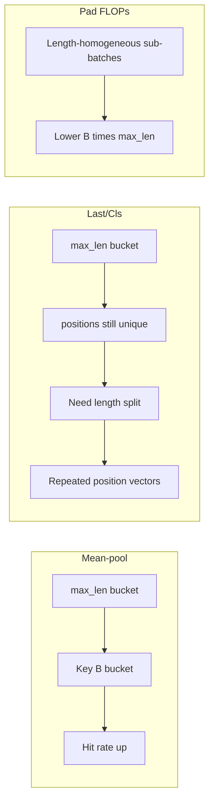
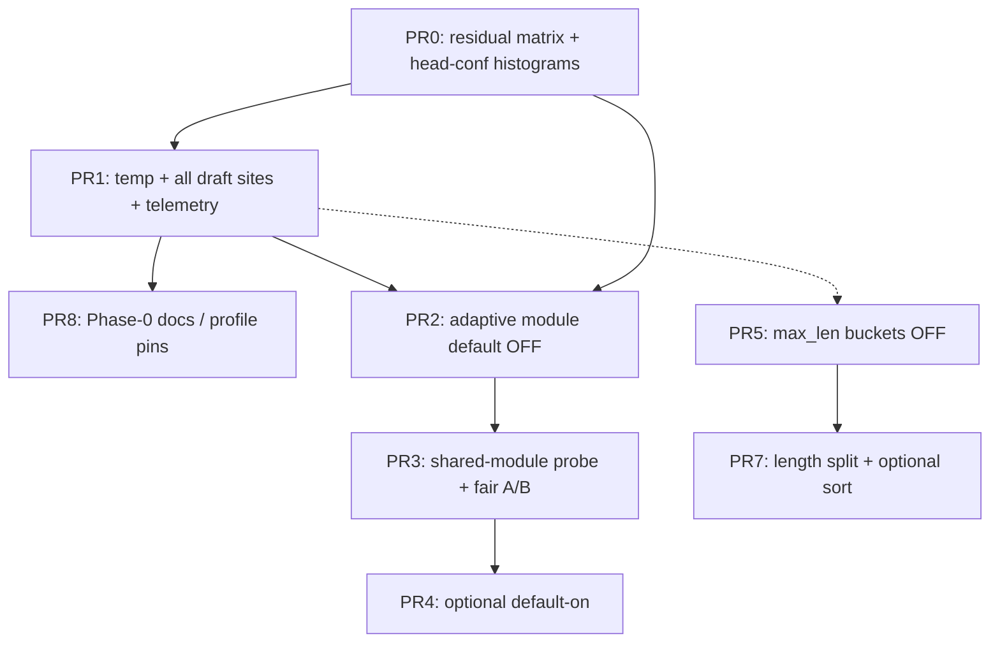

# AX Engine performance sprint: MTP adaptive draft gate + embedding batch efficiency

| Field | Value |
|---|---|
| **Title** | MTP adaptive draft confidence gate + embedding length-aware batching |
| **Author** | _TBD_ |
| **Date** | 2026-07-16 |
| **Status** | Approved (rev 3) — Phase 0 + adaptive OFF + embed buckets OFF landed |
| **Related docs** | `docs/mtp/draft-gate-throughput.md`, `docs/mtp/tree-draft-phase-a.md`, `docs/EMBEDDINGS.md`, `docs/ROADMAP.md` (Speculative decoding software tuning), `docs/designs/kv-weak-surfaces-2026-07-14.md` |
| **Primary crates** | `ax-engine-mlx`, `ax-engine-server`, `ax-engine-sdk` (telemetry surface only) |

---

## Overview

Two software-only levers remain highest-ROI on the post-review performance surface:

1. **MTP draft confidence gate** — production defaults to a static `0.90` (`DEFAULT_MTP_DRAFT_MIN_CONFIDENCE` in `crates/ax-engine-mlx/src/mtp.rs`). Gate × suite sweeps show the optimum is workload-dependent (`flappy ~0.90`, `python_modules_long ~0.85`, `long_code ~0.80`). Speculation profiles already encode those presets, but default **`auto` + low temperature** rarely leaves `0.90`. Adaptive depth and MTP-only acceptance EWMA already exist in the runner; the gate is still offline-static. **Residual ROI is vs the shipped `0.90` default** (not vs the historical 0.98); flappy residual ≈ 0, hard suites still leave headroom if the gate can loosen online under `auto` (see residual table below).

2. **Embedding batch pad + compile-key shape** — `build_embedding_batch_hidden` right-pads every sequence to the batch `max_len`, and compiled closures are keyed on exact `(B, max_len, …)` (and for Last/Cls, `target_positions`). Mixed-length and microbatched traffic waste compute on pad tokens and fragment the compile cache. Batched equal-length ingest is already ≈ mlx-lm; short `B=1` and heterogeneous lengths are the residual gap.

This design proposes a **phased, evidence-gated sprint**:

- **Phase 0 (ship first):** temperature wiring + full draft-site gated resolution + profile docs — zero online controller risk.
- **Phase 1 (experimental):** online adaptive Qwen MTP gate **only under `profile=auto`**, feed-forward prior with optional residual (not free hill-climb), flagged default OFF.
- **Embed track (parallel):** max_len compile buckets (reuse), length-affinity splits (pad FLOPs), optional sort as a split helper — each with correct success metrics.

Explicit non-goals keep tree draft, Gemma depth≥3, hybrid KV CoW elimination, and publication-matrix methodology out of scope.

---

## Background & Motivation

### MTP — current architecture (verified)

```text
Request decode step (runner/mod.rs)
┌──────────────────────────────────────────────────────────────┐
│  mtp_adaptive_max_depth  ← mtp_next_adaptive_depth(...)      │
│  mtp_only_accept_rate_ewma  (α=0.05, cascade-correct)        │
│  auto_optimistic latch (EWMA ≥0.99 / <0.85 hysteresis)       │
│  mtp_bypassed (low EWMA disable)                             │
│                                                              │
│  draft sites (all resolve gate with temp=None today):        │
│    pure MTP / skip-state → mtp_draft_tokens                  │
│    hybrid n-gram tail → mtp_draft_tokens_after_forced_prefix │
│    pure GLM → glm_mtp_draft_tokens                           │
│    hybrid GLM tail → glm_mtp_draft_tokens_after_forced_prefix│
│    optimistic override → mtp_draft_tokens_gated(explicit)    │
│                                                              │
│  verify → accept / recompute (linear-attn hybrid clone path) │
│  update depth + EWMA + auto-optimistic + telemetry           │
└──────────────────────────────────────────────────────────────┘
```

| Surface | Location | Behavior today |
|---|---|---|
| Default gate | `mtp::DEFAULT_MTP_DRAFT_MIN_CONFIDENCE = 0.90` | Throughput-tuned (was 0.98); override `AX_MLX_MTP_DRAFT_MIN_CONFIDENCE` |
| Profile gates | `speculation_profile.rs` | `coding→0.85`, `agentic→0.80`, `chatbot→0.99`; `auto` defers at low T |
| Gate resolution | `resolve_mtp_draft_min_confidence` / `resolve_gate` | explicit env > profile preset > default (ADR-022) |
| Gated API | `mtp_draft_tokens_gated` | Per-call gate; **only** optimistic override path uses it today |
| Forced-prefix | `mtp_draft_tokens_after_forced_prefix` / `glm_*` | No `min_confidence` argument; hard-codes `resolve_*(profile, None)` |
| Adaptive depth | `mtp_next_adaptive_depth` | Per-request; Qwen hybrid starts at 2 |
| MTP-only EWMA | `MtpTelemetry::record_step` | α=0.05; drives auto-optimistic + n-gram saturation |
| Auto-optimistic | `RequestState.auto_optimistic_active` | Latch ≥0.99 / deactivate <0.85 on MTP-only EWMA |
| Probe controller | `tree_draft_probe` `AX_ADAPTIVE_GATE=1` | Hill-climb; **mis-tuned hard suites −4%** |

### Evidence: vs historical 0.98 (context only)

From `docs/mtp/draft-gate-throughput.md` (Qwen3.6 27B-MTP, greedy probe, depth 2):

| Suite | Gate 0.98 tok/fwd | Optimal gate | tok/fwd @ opt | Δ vs 0.98 |
|---|---:|:---:|---:|---:|
| flappy | 1.647 | **0.90** | 1.779 | +8.0% |
| python_modules_long | 1.571 | **0.85** | 1.785 | +13.6% |
| long_code | 1.369 | **0.80** | 1.610 | +17.6% |

Publication matrix: exact sampled 6-bit mean ~**2.0×** vs same-package direct; flappy up to ~2.7×; hard suites only ~1.88×. The 0.98→0.90 default flip already shipped; **do not cite vs-0.98 gains as residual sprint ROI**.

### Residual ROI vs shipped default 0.90

Same evidence doc (depth 2, best tok/fwd per gate). Values at non-optimal gates are reconstructed from the documented optima and the stated trend (harder → looser better; looser than 0.80 not better). **PR0 (measurement) re-probes the full fixed matrix so rows below are replaced with exact numbers before PR2 complexity is justified.**

| Suite | tok/fwd @ 0.90 (shipped) | Suite-optimal gate | tok/fwd @ opt | **Residual vs 0.90** | Adaptive recovery target |
|---|---:|:---:|---:|---:|---|
| flappy | **1.779** (optimum) | 0.90 | 1.779 | **~0%** | Must not regress >2% |
| python_modules_long | lower than 1.785 | 0.85 | 1.785 | **material** (doc: 0.85 is +13.6% vs 0.98; vs 0.90 residual is the gap between 0.90 and 0.85 rows — re-measure) | Recover most of fixed-0.85 gap without harming flappy |
| long_code | lower than 1.610 | 0.80 | 1.610 | **largest residual** (doc: 0.80 is +17.6% vs 0.98; vs 0.90 re-measure) | Recover most of fixed-0.80 gap |

**Implication:** Phase 0 (PR1 + profile docs) already unblocks operators who set `coding`/`agentic`. Phase 1 adaptive is justified only if PR0 shows residual vs 0.90 on hard suites large enough to pay for controller complexity **and** the controller recovers it under `auto` without regressing flappy.

#### Why the prior adaptive prototype failed

The probe controller hill-climbs every 24 steps with ±0.02 steps on a deterministic throughput proxy, bounded `[0.80, 0.95]`. On repetitive content it matches the fixed optimum; on hard suites short windows have enough per-region variance that search **wanders tight** exactly where loose is optimal (−4% vs best fixed). The doc already states the revisit criteria:

> Revisit only with a much-longer-window or feed-forward (head-confidence) signal, and only after sampled-mode validation.

This sprint adopts **snap-to-prior feed-forward** (optional tiny residual), not free hill-climb.

#### Profile / auto gap

`SpeculationProfile::Auto` at low temperature returns `None` for `qwen_gate`, so resolution falls through to `0.90`. Coding/agentic presets exist but require explicit `AX_MLX_SPECULATION_PROFILE` / CLI. Most production traffic is `auto` + low T → **static 0.90 forever**. Additionally, `mtp_draft_tokens` / forced-prefix / GLM wrappers call `resolve_*(profile, None)` — temperature unavailable — so even high-T `auto→chatbot` cannot engage on those paths.

### Embedding — current architecture (verified)

```text
HTTP / concurrent single sequences
  → EmbeddingMicroBatcher (window 2ms, max B=32)
      groups only by (pooling, normalize)
      → session.embed_batch_flat(batch_inputs, …)

Explicit batch API
  → MlxRunner::embed_batch / embed_batch_flat
      → build_embedding_batch_hidden: right-pad to max_len (token id 0)
      → compiled closure keyed on:
           mean:   (thread, B, max_len)
           batch:  (thread, B, max_len, target_positions?, dense_head)
           gemma:  (thread, kind, B, max_len, actual_lens)
```

| Surface | Location | Behavior today |
|---|---|---|
| Pad | `model::build_embedding_batch_hidden` | Right-pad with `0` token IDs to batch `max_len` |
| Batch compile keys | `EmbedBatchCompileKey`, `EmbedGemmaBatchCompileKey`, `EmbedMeanPoolCompileKey` | Exact `max_len`; Last/Cls also exact `target_positions`; Gemma exact `actual_lens` |
| Microbatch grouping | `collect_embedding_batch_groups` | `(pooling_code, normalize)` only — **no length affinity** |
| Docs mitigation | `docs/EMBEDDINGS.md` | "bucket batches by length client-side; round `target_positions`" — **not implemented in-engine** |
| Kill switch | `AX_EMBED_NO_COMPILE` | Imperative forward; useful for A/B |

Pain points:

1. **Pad waste.** A batch of lengths `[8, 12, 200]` pays for `B×200` tokens. **Only length-homogeneous sub-batches reduce pad ratio** — sorting alone does not.
2. **Compile cache fragmentation.**
   - **Mean-pool:** exact `max_len` thrash → **max_len buckets help fully**.
   - **Last/Cls:** `target_positions` (typically `len-1` per row) fragment even after max_len bucketing → **length-affinity splits (or repeated position vectors) required for reuse**.
   - **EmbeddingGemma:** `actual_lens` vector is sticky (K9); splits reduce unique tuples.
3. **Short B=1 lag.** Systems wins secondary; warm compile reuse helps more than cold B=1.

---

## Goals & Non-Goals

### Goals

| ID | Goal | Success signal |
|---|---|---|
| G0 | **Phase 0:** temperature + full draft-site gate resolution + profile operator docs | High-T `auto` → chatbot gate; hybrid/GLM gated; coding/agentic hard pins work |
| G1 | **Phase 1:** online adaptive Qwen fused-MTP gate under **low-T `auto` only** (high-T keeps chatbot 0.99) | **Must-not-regress** vs 0.90; short gens adapt; aspirational near suite-opt on hard suites (A.7) |
| G2 | Wire request temperature into gate resolution on **all** Qwen/GLM draft sites | Telemetry shows source; unit test `auto`+`T≥0.5` → 0.99 |
| G3 | Length-aware embed batching: max_len buckets (compile reuse) + length splits (pad FLOPs) | Mean-pool hit rate ↑; pad ratio ↓ only when splits enabled |
| G4 | Optional sort-by-length before pad (order-restoring) | **Bit-exact** order restore; no pad-ratio claim alone; enables cleaner splits |
| G5 | Feature flags / env opt-in; kill switches; small independently mergeable PRs | Default-safe; clippy/fmt/tests clean; OnceLock parse conventions |

### Non-goals

- Tree speculative decoding (architecturally dead on hybrid linear-attention; see `docs/mtp/tree-draft-phase-a.md`).
- Gemma assistant depth ≥ 3; compiled GLM MTP head.
- Default MTP + n-gram stacking policy changes.
- Full MTEB download / new embedding model families.
- Hybrid KV CoW clone elimination (larger KV track; future PR only noted).
- Changing publication matrix methodology or claim gates.
- OpenAI text+EOS product work (defer unless it fits a zero-bloat follow-up).
- Overriding explicit non-`auto` speculation profiles with the adaptive controller.

---

## Key Decisions

| # | Decision | Rationale |
|---|---|---|
| K1 | **Do not ship the probe hill-climb controller.** | Validated −4% on hard suites. Free ±0.02 search walks tight on hard content. |
| K2 | **v1 adaptive = snap-to-prior from pre-gate head conf; residual feedback optional and prior-clamped.** | Exact `next_gate` formula in A.1. Pure prior-only is the default v1 ship if residual thrash cannot be proven safe. Prior **dominates**; residual cannot walk more than `RESIDUAL_MAX` from prior. |
| K3 | **Gate adapts per-request, not process-global (state); enable flag is process-global.** | Mirrors depth/bypass on `RequestState`. Process-wide env is OK for v1; multi-tenant pins need explicit env or future request field. |
| K4 | **Precedence: optimistic override > explicit gate env > explicit non-`auto` profile > high-T `auto` diversity pin (chatbot 0.99) > adaptive (low-T `auto` only) > default.** | ADR-022 profiles remain **hard pins**. Adaptive fills only the **low-T `auto`** gap. High-T `auto` must still resolve to chatbot 0.99 even when adaptive is enabled — adaptive clamp `[0.80,0.95]` must not suppress diversity. |
| K5 | **Bound adaptive gate to `[0.80, 0.95]` (Qwen fused MTP; GLM shares resolution only if same semantic gate).** | Probe bounds; 0.80 hard-suite floor; ≥0.95 throughput-hostile. Does not apply to the high-T chatbot pin (0.99), which sits outside adaptive. |
| K6 | **Depth controller owns depth; adaptive **observe** freezes when `mtp_bypassed`, depth floor 0, or `auto_optimistic_active` — but resolve still returns `st.gate` (last gate), not default 0.90.** | Avoid accept-rate feedback fighting optimistic latch / bypass; avoid gate jump when freeze engages. |
| K7 | **Adaptive default OFF until sampled evidence; kill switch always available.** | Evidence-gated flip only after PR0 residual + PR3 A/B. |
| K8 | **Embed max_len buckets target compile reuse (mean-pool primary win); pad FLOPs are length-split (PR7), not sort (PR6).** | Sort does not change `B×max_len`. |
| K9 | **Gemma: bucket max_len; keep `actual_lens` in key.** | Mask baked at compile time; full redesign is follow-up. |
| K10 | **PR5 buckets default OFF; pad FLOPs not the success metric for buckets.** | Bucket snap can *increase* pad; trade is compile reuse. Flip only after measure. |
| K11 | **No publication-matrix methodology changes.** | Separate docs PR if claims update. |
| K12 | **Head-conf bin edges are provisional until PR0 calibration histograms.** | Suite optima are offline gate sweeps, not head-conf measurements. Env-tunable bins. |
| K13 | **Pre-gate mean confidence returned from gated draft API before truncate.** | Post-gate means censor low conf → bias prior tight (failure mode). |
| K14 | **Shared `mtp_adaptive_gate` module used by runner and `tree_draft_probe`.** | Prevent probe/production drift. |
| K15 | **Phase 0 (PR1+PR8+profile docs) is a valid interim ship without Phase 1.** | Unblocks operators + high-T auto; zero controller risk. |
| K16 | **Adaptive eligibility = low-T `auto` only** (`!is_diversity_temperature`). | Preserves ADR-022 chatbot 0.99 under high-T sampled traffic (publication often uses T=0.6). |
| K17 | **v1 snap-to-prior applies every step after first head-conf sample** (EWMA smooths). `WINDOW` is residual-only. | Short completions (&lt;64 steps) must still adapt; pure no-op at WINDOW=64 would waste the feature. |
| K18 | **`ResolutionSource::Optimistic = 4`** distinct from Explicit env pin. | Ops can tell gate=0 optimistic override from `AX_MLX_MTP_DRAFT_MIN_CONFIDENCE`. |

---

## Proposed Design

### Track A — Adaptive MTP draft confidence gate

#### A.0 Phase-0 ship (no controller)

Before any online control:

1. Resolve gate once per step with `Some(sampling.temperature)`.
2. Thread that gate into **every** draft site (matrix in A.2).
3. Emit gate + `ResolutionSource` telemetry.
4. Document `coding`/`agentic`/`chatbot` as operator pins for known workloads.

This alone delivers G0/G2 and is the recommended interim production posture.

#### A.0b Adaptive state lifecycle

`RequestState.mtp_adaptive_gate: Option<MtpAdaptiveGateState>`:

| Event | Action |
|---|---|
| Generation start (`initialize_generation_state` / first MTP step) | If `adaptive_enabled && profile == Auto && !is_diversity_temperature(T)` → `Some(new_cold(DEFAULT_MTP_DRAFT_MIN_CONFIDENCE))` i.e. **initial_gate = 0.90**. Else `None`. |
| Request end / state teardown | Drop; **never share across requests**. |
| Adaptive flag off, non-`auto` profile, or high-T diversity | Keep `None` (or ignore if present); resolve never reads adaptive. |
| Mid-request T change | Sampling params are fixed per request in practice; if they ever change into diversity regime, stop calling `observe_step` and resolve via chatbot pin (do not require reallocating state). |
| Mid-request optimistic latch | Set `state.frozen = true`; **keep** `state.gate` (last value); resolve still returns it until latch clears. |

`None` means “adaptive not active for this request.” `Some` always owns the last applied gate for resolve.

#### A.1 Controller specification (Phase 1 — implementable pure functions)

New module: `crates/ax-engine-mlx/src/mtp_adaptive_gate.rs` (exported for probe reuse).

##### Constants (named, env-overridable, OnceLock-cached)

```rust
pub const GATE_MIN: f32 = 0.80;
pub const GATE_MAX: f32 = 0.95;
pub const HEAD_CONF_ALPHA: f32 = 0.05;      // same order as MtpTelemetry ALPHA
pub const RECOMPUTE_ALPHA: f32 = 0.05;
pub const DRAFT_LEN_ALPHA: f32 = 0.05;
/// Residual only: min EWMA samples + cadence between residual recomputes.
/// Does NOT gate snap-to-prior (v1 snaps every step after first sample).
pub const DEFAULT_RESIDUAL_WINDOW: u32 = 64;
pub const RESIDUAL_MAX: f32 = 0.02;         // |gate - prior| cap — NOT free hill-climb
pub const RESIDUAL_K_ACCEPT: f32 = 0.02;
pub const RESIDUAL_K_RECOMP: f32 = 0.02;
/// v1 default: residual off → pure snap-to-prior every step (after min samples).
pub const DEFAULT_RESIDUAL_ENABLED: bool = false;
/// Snap-to-prior needs at least this many head-conf observations (usually 1).
pub const SNAP_MIN_SAMPLES: u32 = 1;

// Provisional prior bins — REPLACE after PR0 histograms (K12).
// Env: AX_MLX_MTP_ADAPTIVE_GATE_PRIOR_BINS="0.95:0.90,0.90:0.88,0.85:0.85,0:0.80"
```

##### State

```rust
#[derive(Clone, Debug)]
pub struct MtpAdaptiveGateState {
    /// Gate applied on the next draft (snap or residual-updated).
    pub gate: f32,
    /// Steps since last residual recompute (residual mode only).
    pub steps_since_residual: u32,
    pub head_conf_ewma: f32,
    pub head_conf_samples: u32,
    pub recompute_ewma: f32,
    pub recompute_samples: u32,
    pub gated_draft_len_ewma: f32,
    pub draft_len_samples: u32,
    /// When true: skip observe updates; resolve still returns `gate` (last value).
    pub frozen: bool,
}

impl MtpAdaptiveGateState {
    /// Cold start: shipped default 0.90 (adaptive eligibility already checked).
    pub fn new_cold(initial_gate: f32) -> Self {
        Self {
            gate: initial_gate.clamp(GATE_MIN, GATE_MAX),
            steps_since_residual: 0,
            head_conf_ewma: 0.0,
            head_conf_samples: 0,
            recompute_ewma: 0.0,
            recompute_samples: 0,
            gated_draft_len_ewma: 0.0,
            draft_len_samples: 0,
            frozen: false,
        }
    }
}

#[derive(Clone, Copy, Debug)]
pub struct AdaptiveStepSignals {
    /// Mean pre-gate head confidence: mean(exp(log_prob_d)) over all depths
    /// *before* truncate. Empty pre-gate draft → 0.0 (drives loose prior).
    pub pre_gate_mean_conf: f32,
    pub gated_draft_len: usize,
    pub recomputed: bool,
    pub mtp_only_accept_rate_ewma: f32,
    pub mtp_only_accept_rate_ewma_samples: u32,
    pub max_depth: usize,
    pub mtp_bypassed: bool,
    pub adaptive_depth: usize,
    pub auto_optimistic_active: bool,
}
```

##### Prior map (provisional)

```rust
/// PROVISIONAL — bin edges from suite *story*, not measured head-conf histograms.
/// PR0 replaces edges via quantiles; tests use injectable bin table.
pub fn prior_from_head_conf(mean_conf: f32, bins: &[(f32, f32)]) -> f32 {
    for &(threshold, prior) in bins {
        if mean_conf >= threshold {
            return prior.clamp(GATE_MIN, GATE_MAX);
        }
    }
    GATE_MIN
}

pub fn default_provisional_bins() -> &'static [(f32, f32)] {
    &[
        (0.95, 0.90), // flappy-like story
        (0.90, 0.88),
        (0.85, 0.85), // python_modules_long story
        (0.00, 0.80), // long_code story
    ]
}
```

##### EWMA helper

```rust
/// Shared init rule: first sample is pure `obs`; later samples use α-blend.
/// Matches MtpTelemetry style (α=0.05).
fn ewma(prev: f32, samples: u32, obs: f32, alpha: f32) -> (f32, u32) {
    if samples == 0 {
        (obs, 1)
    } else {
        ((1.0 - alpha) * prev + alpha * obs, samples.saturating_add(1))
    }
}
```

##### `observe_step` — exact update rule

```rust
pub struct NextGateConfig {
    /// Residual recompute cadence + min mtp_only samples before residual engages.
    pub residual_window: u32,
    pub residual_enabled: bool,
    pub residual_max: f32,
    pub k_accept: f32,
    pub k_recomp: f32,
    pub snap_min_samples: u32,
    pub bins: Vec<(f32, f32)>,
}

/// Pure function: update state after one decode step; returns gate for *next* draft.
///
/// v1 default (residual_enabled=false):
///   after each step with head_conf_samples >= snap_min_samples:
///     gate = prior_from_head_conf(head_conf_ewma)
///   Head-conf EWMA (α=0.05) provides smoothing — no multi-step WINDOW delay.
///   Short requests (e.g. 8–20 MTP steps) still adapt.
///
/// residual_enabled=true (experimental, opt-in):
///   snap prior as above every step; every residual_window steps (and only when
///   mtp_only_accept_rate_ewma_samples >= residual_window), apply prior-clamped residual:
///     gate = clamp(prior + residual, prior ± residual_max) then [GATE_MIN, GATE_MAX]
pub fn observe_step(
    state: &mut MtpAdaptiveGateState,
    sig: AdaptiveStepSignals,
    cfg: &NextGateConfig,
) -> f32 {
    // Freeze observe only — do NOT reset gate. Resolve continues to return st.gate.
    if sig.mtp_bypassed || sig.adaptive_depth == 0 || sig.auto_optimistic_active {
        state.frozen = true;
        return state.gate;
    }
    state.frozen = false;

    let (hc, n_hc) = ewma(
        state.head_conf_ewma,
        state.head_conf_samples,
        sig.pre_gate_mean_conf.clamp(0.0, 1.0),
        HEAD_CONF_ALPHA,
    );
    state.head_conf_ewma = hc;
    state.head_conf_samples = n_hc;

    let (rc, n_rc) = ewma(
        state.recompute_ewma,
        state.recompute_samples,
        if sig.recomputed { 1.0 } else { 0.0 },
        RECOMPUTE_ALPHA,
    );
    state.recompute_ewma = rc;
    state.recompute_samples = n_rc;

    let (dl, n_dl) = ewma(
        state.gated_draft_len_ewma,
        state.draft_len_samples,
        sig.gated_draft_len as f32,
        DRAFT_LEN_ALPHA,
    );
    state.gated_draft_len_ewma = dl;
    state.draft_len_samples = n_dl;

    // Need at least snap_min_samples before leaving cold initial_gate.
    if state.head_conf_samples < cfg.snap_min_samples.max(1) {
        return state.gate;
    }

    let prior = prior_from_head_conf(state.head_conf_ewma, &cfg.bins);

    // v1: snap every step (EWMA already smooths).
    if !cfg.residual_enabled {
        state.gate = prior;
        return state.gate;
    }

    // Residual path: start from prior each residual window; do not free-walk.
    state.steps_since_residual = state.steps_since_residual.saturating_add(1);
    let rw = cfg.residual_window.max(1);
    if state.steps_since_residual < rw
        || sig.mtp_only_accept_rate_ewma_samples < rw
    {
        // Between residual updates, still track prior (same as snap).
        state.gate = prior;
        return state.gate;
    }
    state.steps_since_residual = 0;

    let accept = sig.mtp_only_accept_rate_ewma.clamp(0.0, 1.0);
    let len_ratio = if sig.max_depth == 0 {
        0.0
    } else {
        (state.gated_draft_len_ewma / sig.max_depth as f32).clamp(0.0, 1.0)
    };
    // Depth-2: "low gated draft length" ⇒ len_ratio < 0.5 (not a large absolute depth).
    let accept_term = if accept >= 0.97 && len_ratio < 0.5 {
        -1.0 // loosen
    } else if accept < 0.90 && state.recompute_ewma > 0.15 {
        1.0 // tighten
    } else {
        0.0
    };
    let recomp_term = if state.recompute_ewma > 0.20 {
        1.0
    } else if state.recompute_ewma < 0.05 && len_ratio < 0.4 && accept >= 0.95 {
        -1.0
    } else {
        0.0
    };

    let residual = (cfg.k_accept * accept_term + cfg.k_recomp * recomp_term)
        .clamp(-cfg.residual_max, cfg.residual_max);
    state.gate = (prior + residual)
        .clamp(prior - cfg.residual_max, prior + cfg.residual_max)
        .clamp(GATE_MIN, GATE_MAX);
    state.gate
}
```

**Unit-test vectors (required in PR2):**

| Synthetic series | Expected |
|---|---|
| conf 0.97 for **2** steps (short req) | after step 1: gate→0.90 (not stuck at cold for 64 steps) |
| conf always 0.70 for 8 steps | gate→0.80 by step 1–2 |
| conf 0.70, residual on, accept 0.99, len_ratio 0.2 after WINDOW | residual loosens but gate ≥ prior−0.02 |
| empty pre-gate draft (`pre_gate_mean_conf=0`) | drives toward 0.80 prior |
| `auto_optimistic_active=true` after gate=0.80 | observe freezes; **resolve still returns 0.80** (not 0.90) |
| conf oscillates 0.7/0.97 | prior follows EWMA; residual cannot free-walk |
| `auto` + T=0.6 + adaptive ON | resolve → **0.99 Profile** (adaptive not eligible) |

**v1 ship policy:** `DEFAULT_RESIDUAL_ENABLED = false` (pure per-step snap). Residual flag only after PR3 shows residual helps.

#### A.1b Pre-gate confidence API contract (K13)

```rust
/// Extends gated draft return without extra GPU sync.
/// `pre_gate_mean_conf` = mean(exp(log_probs[d])) over *all* depths before truncate.
/// Gated vectors / `added` still post-gate for KV / accounting.
pub struct MtpDraftGatedResult {
    pub tokens: Vec<u32>,
    pub log_probs: Vec<f32>,           // post-gate
    pub distributions: Vec<TokenDistribution>,
    pub added: usize,                  // post-gate len
    pub accept3: [f32; 3],
    pub pre_gate_mean_conf: f32,       // NEW — computed before apply_draft_confidence_gate
    pub pre_gate_depths: usize,        // depths evaluated before gate
}
```

`apply_draft_confidence_gate` stays the sole truncate site. Unit test: tight gate yields empty `tokens` but low `pre_gate_mean_conf` when head was uncertain.

#### A.2 Draft call-site matrix (complete)

| # | Site | File (approx) | Today | Required change |
|---|---|---|---|---|
| 1 | Pure MTP draft | `runner/mod.rs` ~L8816 `mtp_draft_tokens` | `resolve(profile, None)` inside | Call `mtp_draft_tokens_gated(..., gate)` with resolved gate |
| 2 | Skip-state MTP | ~L7760 | same | same |
| 3 | Optimistic override | ~L7748 / ~L8803 | already gated | Keep; **highest precedence** when override env set |
| 4 | Hybrid n-gram + MTP tail | ~L8731 `mtp_draft_tokens_after_forced_prefix` | no gate arg | Add `mtp_draft_tokens_after_forced_prefix_gated` **or** `min_confidence: f32` param; thread resolved gate |
| 5 | Pure GLM MTP | ~L8838 `glm_mtp_draft_tokens` | `resolve(profile, None)` | Add/use `glm_mtp_draft_tokens_gated` with same resolution helper |
| 6 | Hybrid GLM tail | ~L8742 `glm_mtp_draft_tokens_after_forced_prefix` | no gate arg | Same as (4) for GLM |
| 7 | Gemma assistant | `gemma4_assistant_draft_token` | profile+temp already | **Out of adaptive scope**; no change required for adaptive |

**PR1 scope:** sites 1–6 for temperature + explicit gate threading (GLM included so stacking does not leave a blind path). Adaptive observe only on model MTP sources (1–6 when source is MTP/HybridMtp/Glm), not n-gram-only steps.

**GLM priors:** same resolution helper and clamps; **same provisional bins** until GLM-specific evidence (Open Question #2 closed as: share resolution; do not invent GLM-only prior without measure).

#### A.2b Resolution helper (precedence K4 + K16 + K18)

```rust
/// Route codes (extend ResolutionSource):
/// Default=0, Profile=1, Explicit=2, Adaptive=3, Optimistic=4.
pub fn resolve_effective_mtp_draft_gate(
    profile: SpeculationProfile,
    temperature: Option<f32>,
    adaptive_enabled: bool,
    adaptive: Option<&MtpAdaptiveGateState>,
    optimistic_override: Option<f32>,
) -> (f32, ResolutionSource) {
    if let Some(g) = optimistic_override {
        return (g, ResolutionSource::Optimistic); // code 4 — not Explicit
    }
    if let Some(g) = mtp_draft_min_confidence_explicit() {
        return (g, ResolutionSource::Explicit);
    }
    // Non-auto explicit profiles are HARD PINS (ADR-022).
    if !matches!(profile, SpeculationProfile::Auto) {
        if let Some(g) = profile.qwen_gate(temperature) {
            return (g, ResolutionSource::Profile);
        }
    }
    // High-T auto diversity pin BEFORE adaptive (K16).
    // Auto at T >= 0.5 → chatbot 0.99; must not be suppressed by adaptive [0.80,0.95].
    if matches!(profile, SpeculationProfile::Auto)
        && SpeculationProfile::is_diversity_temperature(temperature)
    {
        if let Some(g) = profile.qwen_gate(temperature) {
            return (g, ResolutionSource::Profile); // 0.99
        }
    }
    // Low-T auto + adaptive: always use st.gate when state exists, including frozen.
    // Freeze only stops observe_step; it must NOT fall through to default 0.90 (K6).
    if adaptive_enabled {
        if let Some(st) = adaptive {
            return (st.gate, ResolutionSource::Adaptive);
        }
    }
    // Low-T auto without adaptive: default (qwen_gate returns None).
    if let Some(g) = profile.qwen_gate(temperature) {
        return (g, ResolutionSource::Profile);
    }
    (DEFAULT_MTP_DRAFT_MIN_CONFIDENCE, ResolutionSource::Default)
}

/// Eligibility helper used at generation start (A.0b) and before observe_step.
pub fn adaptive_eligible(
    adaptive_enabled: bool,
    profile: SpeculationProfile,
    temperature: Option<f32>,
) -> bool {
    adaptive_enabled
        && matches!(profile, SpeculationProfile::Auto)
        && !SpeculationProfile::is_diversity_temperature(temperature)
}
```

Note: `is_diversity_temperature` is today a private method on `SpeculationProfile`; PR2 either `pub(crate)` it or duplicate the `T >= AUTO_DIVERSITY_TEMPERATURE (0.5)` check next to the existing constant.

#### A.2c Interaction matrix (auto-optimistic, bypass, depth, high-T)

| Condition | Gate source | Adaptive observe |
|---|---|---|
| Optimistic override set | **Optimistic (4)**, often 0.0 | Skip observe |
| `AX_MLX_MTP_DRAFT_MIN_CONFIDENCE` set | Explicit (2) | Skip observe (telemetry may still record head conf) |
| Profile `coding`/`agentic`/`chatbot` | Profile hard pin | **Not allocated** (`None`) |
| `auto` + high-T (T≥0.5) | Profile **0.99** chatbot | **Not eligible** — no state / no observe |
| `auto_optimistic_active` (low-T auto, state Some) | **Adaptive: last `st.gate`** (frozen) | **Freeze observe** — do not re-resolve to 0.90 |
| `mtp_bypassed` or `adaptive_depth==0` | Last `st.gate` if Some (unused for draft) | Freeze observe |
| `auto` low-T, adaptive ON, not frozen | Adaptive `st.gate` | `observe_step` after verify (per-step snap) |
| `auto` low-T, adaptive OFF | Default 0.90 | N/A |

**Accept-rate tension:** residual tighten-on-low-accept is **optional and prior-clamped**. Feed-forward prior on hard content stays near 0.80; residual cannot walk to 0.95.

#### A.3 Feature flags / env (parse conventions)

Match existing mlx patterns: **OnceLock-cached** at first read; process restart required to change (document for operators).

| Env | Parse | Default | Meaning |
|---|---|---|---|
| `AX_MLX_MTP_ADAPTIVE_GATE` | truthy `1`/`true`/`on` enable; unset/`0`/`false`/`off` disable | **disabled** | Enable adaptive under **low-T auto** only |
| `AX_MLX_MTP_ADAPTIVE_GATE_RESIDUAL` | same truthy | **disabled** | Enable residual around prior |
| `AX_MLX_MTP_ADAPTIVE_GATE_MIN` | f32 clamp `[0.5, 0.99]` | `0.80` | Lower clamp |
| `AX_MLX_MTP_ADAPTIVE_GATE_MAX` | f32 | `0.95` | Upper clamp |
| `AX_MLX_MTP_ADAPTIVE_GATE_WINDOW` | u32 clamp `[8, 512]` | `64` | **Residual only** — cadence / min samples (not snap delay) |
| `AX_MLX_MTP_ADAPTIVE_GATE_PRIOR_BINS` | `thr:prior,...` | provisional defaults | Tunable prior map |
| `AX_MLX_MTP_DRAFT_MIN_CONFIDENCE` | f32 `[0,1)` | unset | Explicit pin; disables adaptive application |
| `AX_MLX_SPECULATION_PROFILE` | parse enum | `auto` | ADR-022 |

Truthy helper: `trim`, ascii lower, accept `1|true|on|yes`.

#### A.4 Telemetry

Extend `ResolutionSource`: **Default=0, Profile=1, Explicit=2, Adaptive=3, Optimistic=4**. Additive; consumers that assume 0..=2 treat unknown as opaque.

| Key | Value |
|---|---|
| `ax_mtp_draft_gate_x1000` | Active gate × 1000 |
| `ax_mtp_draft_gate_source` | 0 Default / 1 Profile / 2 Explicit / 3 Adaptive / **4 Optimistic** |
| `ax_mtp_adaptive_gate_enabled` | 0/1 (process flag) |
| `ax_mtp_adaptive_gate_eligible` | 0/1 (this request: low-T auto + flag) |
| `ax_mtp_adaptive_gate_residual` | 0/1 |
| `ax_mtp_head_conf_ewma_x1000` | Feed-forward EWMA |
| `ax_mtp_recompute_ewma_x1000` | Feedback signal |
| `ax_mtp_adaptive_gate_frozen` | 0/1 |
| existing | `ax_mtp_mtp_only_accept_rate_ewma_*`, `ax_mlx_speculation_profile`, `ax_mtp_auto_optimistic_steps` |

Single-write in `to_route_decisions` / upsert path — no double emit.

#### A.5 Correctness

- Gate only truncates proposed draft depth; rejection sampling / greedy verify unchanged.
- Committed distribution invariant holds.
- Accept **rate** will move under looser gates; SLO on "accept ≥99%" → explicit pin `0.98` or `chatbot`.
- Auto-optimistic latch: freeze adaptive so we do not loosen→drop accept→deactivate optimistic oscillation.

#### A.6 Sequence (per decode step)

```mermaid
sequenceDiagram
    participant R as MlxRunner::run_mtp_decode
    participant G as resolve_effective_mtp_draft_gate
    participant H as mtp_draft_tokens_gated
    participant V as verify/accept
    participant A as observe_step

    R->>G: profile, temperature, adaptive?, optimistic?
    Note over G: optimistic > env > non-auto > high-T auto 0.99 > adaptive low-T > default
    G-->>R: gate, ResolutionSource
    R->>H: hidden, token, max_depth, gate
    H-->>R: gated tokens + pre_gate_mean_conf
    R->>V: verify draft
    V-->>R: accept_count, recomputed?
    alt adaptive_eligible and state Some and not frozen
        R->>A: observe_step (per-step snap)
        A-->>R: next gate
    else frozen but state Some
        Note over R: keep st.gate; no observe
    end
    R->>R: mtp_next_adaptive_depth(...) unchanged
```

#### A.7 Evidence plan (MTP) — split bars

| Phase | Tool | Criterion |
|---|---|---|
| **PR0** | Fixed-gate matrix + head-conf dumps on 3 suites | Exact tok/fwd at `{0.80,0.85,0.90}`; pre-gate conf histograms; **go/no-go for PR2** |
| Unit | `cargo test -p ax-engine-mlx` `mtp_adaptive_gate` | snap after 1 sample; freeze holds last gate; `auto+T=0.6`→0.99 Profile; EWMA init counters; pre-gate API |
| Probe | `tree_draft_probe` via **shared** module | **Must-not-regress** vs 0.90; short-gen (e.g. 16–32 committed) shows gate movement when conf low |
| Sampled fair | fair-MTP harness, interleaved | Hard suite ≥ static 0.90 **at low T** for adaptive A/B; high-T rows must still show chatbot pin (source Profile, gate 0.99) when adaptive ON |
| Serving smoke | concurrent gen | Telemetry; kill switch; restart note |

**Short-request risk:** if implementation incorrectly reintroduces WINDOW delay on snap, adaptive is a no-op on agentic/short chat — unit test + short probe required.

PR4 default-on only if **must-not-regress** green **and** hard-suite residual recovery is clearly nonzero vs 0.90 (not vs 0.98).

---

### Track B — Embedding length-aware batching / compile keys

#### B.1 Length bucket policy (compile reuse)

```rust
pub fn embed_length_bucket(max_len: usize, buckets: &[usize]) -> usize {
    buckets.iter().copied().find(|&b| b >= max_len).unwrap_or(max_len)
}
```

Default bucket edges (env override):
`16,32,48,64,96,128,192,256,384,512,768,1024,2048`.

- **Default OFF** — exact max_len as today.
- Parse (B.5): unset/`off`/`0`/`false` → disabled; `on`/`default`/`1`/`true` → **built-in edges**; otherwise comma-separated ascending unique edges.
- When enabled: pad width **and** compile key `max_len` use the snapped bucket.
- **Success metric:** compile hit rate / cache_len stability — **not** pad ratio (buckets may increase pad).

##### Correctness under extra pad (Qwen + Gemma)

| Family | Argument |
|---|---|
| **Qwen-style / causal encode** | Right-pad token id `0` only **after** real tokens. Causal attention at real positions does not attend to future pad; Last/Cls extract fixed positions; Mean uses `actual_lens` mask. Bucket pad extends only trailing pad → real-token hidden states remain bit-exact vs exact-`max_len` pad **when pad id and mask semantics match**. Require heterogeneous equality tests + `verify_embedding_models.py`. |
| **EmbeddingGemma bidirectional** | Pad participates via **bidirectional mask** (`-inf` on pad). Extra pad positions stay masked if `actual_lens` unchanged and mask built from true lengths — bit-exact on real positions. Must not treat pad id 0 as content. |

#### B.1b Last/Cls `target_positions` fragmentation

`EmbedBatchCompileKey = (ThreadId, B, max_len, Option<Vec<usize>> /* positions */, has_dense_head)`.

For Last pooling, positions are typically `[len_i - 1; …]`. **Max_len bucketing alone does not collapse these vectors.** Scope:

| Pooling | PR5 (buckets) | PR7 (length split) | Follow-up |
|---|---|---|---|
| Mean | Primary compile-reuse win | Pad FLOPs win | — |
| Last/Cls | Limited unless batches share position vectors | **Required** for reuse (homogeneous lens → repeated positions) | Runtime position index input to drop positions from key |
| EmbeddingGemma | max_len bucket helps shape; `actual_lens` remains | Reduces unique `actual_lens` tuples | Mask-as-input compile |

#### B.2 Sort-by-length (order-restoring) — **not a pad win**

Sort **does not** change `max_len` or `B×max_len` pad FLOPs for a single batch.

Success for sort PR:

1. Inverse-permute bit-exact vs unsorted.
2. No regression on equal-length batches.
3. Optional: cleaner input to length split when both enabled.

Pad-ratio success lives exclusively on **length-affinity split** (B.3).

#### B.3 Microbatch / batch length split (pad FLOPs)

```text
for each (pooling, normalize) group:
  partition indices into sublists by length bucket (or max/min ≤ R)
  run embed_batch_flat per sublist
  scatter results to original indices
```

This is the only mechanism that reduces pad ratio for mixed short+long traffic.

#### B.4 Compile-key impact



#### B.5 Env flags (embed)

| Env | Parse | Default | Meaning |
|---|---|---|---|
| `AX_EMBED_LEN_BUCKETS` | See below | **off** (unset) | Compile max_len snap |
| `AX_EMBED_SORT_BY_LENGTH` | truthy enable | **off** | Order-restoring sort |
| `AX_EMBED_MICROBATCH_LEN_SPLIT` | truthy enable | **off** | Pad-reducing splits |
| `AX_EMBED_NO_COMPILE` | presence | off | Existing kill switch |

**`AX_EMBED_LEN_BUCKETS` parse contract:**

| Raw value | Result |
|---|---|
| unset / empty | **Disabled** (exact max_len) |
| `off` / `0` / `false` / `no` | **Disabled** |
| `on` / `default` / `1` / `true` / `yes` | **Enabled** with built-in `[16,32,48,64,96,128,192,256,384,512,768,1024,2048]` |
| `16,32,64,...` | **Enabled** with custom ascending unique positive integers (reject unsorted/dupes at parse → fall back disabled + warn) |

OnceLock-cache parses; restart to change.

#### B.6 Evidence plan (embed)

| Phase | Tool | Pass criterion |
|---|---|---|
| Unit | bucket / sort-restore / split scatter | Deterministic |
| Verify | `verify_embedding_models.py` under bucketed max_len | Green Qwen + Gemma |
| Heterogeneous equality | same inputs, buckets on/off | Real-token embeddings match |
| Mean-pool cache | `embed_compile_cache_stats` mixed lens | hits↑ with buckets ON |
| Last/Cls cache | with/without length split | Document limited PR5 gain; PR7 required |
| Pad ratio | `pad_tokens/real_tokens` | Improves **only** with split ON |
| Ingest scale | equal-length baseline | No regression with flags OFF |

---

## API / Interface Changes

### Public HTTP / SDK

- **No breaking wire changes.** Process-level env flags.
- Optional later: request-level `mtp_draft_min_confidence` for multi-tenant pins without process restart.
- Enabling adaptive / buckets is **process-wide**; all tenants on one server share the flag. Per-tenant pin today: `AX_MLX_MTP_DRAFT_MIN_CONFIDENCE` (process) or explicit speculation profile.

### Internal Rust surfaces

| Symbol | Change |
|---|---|
| `mtp_adaptive_gate` module | NEW: state, `observe_step`, prior map, lifecycle, config parse |
| `ResolutionSource` | Add `Adaptive = 3`, `Optimistic = 4` |
| `mtp_draft_tokens_gated` | Return `pre_gate_mean_conf` |
| `mtp_draft_tokens_after_forced_prefix` | Add `_gated` / `min_confidence` param |
| `glm_mtp_draft_tokens` / `_after_forced_prefix` | Same gate threading |
| `MlxRunner` draft loop | Resolve once; all sites use gated APIs; allocate adaptive at gen start per A.0b |
| `RequestState` | `mtp_adaptive_gate: Option<MtpAdaptiveGateState>` lifecycle A.0b |
| Embed batch builders | Optional bucketed pad width |
| Microbatch | Optional length split |

### Before / after (draft path)

**Before:**

```rust
mtp_draft_tokens(...) // resolve(profile, None) → often 0.90
mtp_draft_tokens_after_forced_prefix(...) // same blind resolve
```

**After:**

```rust
let (gate, src) = resolve_effective_mtp_draft_gate(
    profile, Some(sampling.temperature), adaptive_on, adaptive_state, optimistic,
);
let out = mtp_draft_tokens_gated(..., gate);
// out.pre_gate_mean_conf → observe_step when adaptive eligible
```

---

## Data Model Changes

- No durable / on-disk format changes.
- Request-local adaptive state; additive telemetry route codes.
- Compile caches: key cardinality changes only when buckets ON.

Rollback: unset env (restart process if OnceLock cached) or pin explicit gate.

---

## Alternatives Considered

### MTP gate

| Alternative | Pros | Cons | Verdict |
|---|---|---|---|
| **A. Phase 0 only** — temp wiring + document coding/agentic | Zero hot-path risk; unblocks ops + high-T auto | `auto` low-T still static 0.90 | **Phase-0 ship (PR1+PR8)** — valid interim; adaptive not required to land value |
| **B. Pure hill-climb (probe)** | Prototyped | −4% hard suites | Rejected (K1) |
| **C. Snap-to-prior ± optional residual** | Anchors hard content; implementable; shared module | Needs PR0 calibration | **Phase-1 experimental** |
| **D. Prompt classifier** | Early prior | New infra | Defer |
| **E. Blind default 0.80** | Helps hard | Hurts flappy risk | Rejected |
| **F. Adaptive overrides all profiles** | One knob | Breaks ADR-022 operator pins | Rejected (K4) |

### Embed batching

| Alternative | Pros | Cons | Verdict |
|---|---|---|---|
| **A. Client-only bucketing** | Zero engine risk | Microbatch stays weak | Insufficient alone |
| **B. Buckets + length split + optional sort** | Correct metrics per lever | Sort alone low ROI | **Adopt** (sort demoted/helper) |
| **C. Ragged kernels** | Max efficiency | Large scope | Out |
| **D. Mask/positions as runtime compile inputs** | Collapses Gemma/Last keys | Redesign | Follow-up |

---

## Security & Privacy Considerations

| Topic | Assessment |
|---|---|
| Threat model | No new network surface; env flags only |
| Auth | Unchanged |
| Data handling | Embed sort/split in-process; no new token content logs |
| Multi-tenant | Per-request adaptive **state** avoids cross-request gate leakage. Adaptive **enable**, profile, and explicit gate env are **process-wide** — all tenants share them. Per-tenant pins need explicit process env or a future request-level field. |
| Operability | OnceLock env cache ⇒ kill switch / flag change requires **process restart** (same as other MTP knobs) — document in SERVER/MTP docs. |

---

## Observability

- MTP keys in A.4; freeze + residual flags included.
- Embed: `embed_compile_cache_stats`; optional `ax_embed_pad_tokens_total` / `real_tokens_total` / `len_bucket_snap_count` / `microbatch_len_splits`.
- `tracing::debug` on snap/residual (gate old→new, prior, frozen).
- Optional warn if gate pegged at MIN/MAX for an entire long request.

---

## Rollout Plan



| Stage | Action | Rollback |
|---|---|---|
| Phase 0 | Land PR1+PR8; operators use profiles | Revert / pin gate |
| Phase 1 experimental | PR2 flag OFF in prod; enable on staging | Restart with flag off / explicit pin |
| Evidence | PR0 numbers + PR3 bars | — |
| Default flip | PR4 only if must-not-regress + residual recovery | Explicit pin |
| Embed | PR5 OFF → measure → optional ON; PR7 for pad | Flags off |

**Adaptive default-on criteria (revised):**

1. **Must-not-regress:** flappy vs 0.90 ≤2% drop; hard suites vs 0.90 ≥ 0% (tok/fwd probe + interleaved tok/s where thermal matters).
2. **Aspirational:** within 1% of suite-optimal fixed (not a merge blocker for keeping flag-off merge).
3. Residual recovery vs 0.90 clearly nonzero on at least one hard suite (else keep Phase 0 only).
4. Kill switch verified; clippy/fmt/tests green.

**Embed default-on:**

1. PR5 stays OFF until hit-rate evidence; equal-length path unchanged when OFF.
2. PR7 ON only if pad ratio ↓ and p95 not regressed on equal-length.
3. `verify_embedding_models.py` + heterogeneous equality under buckets.

---

## Risks

| Risk | Severity | Mitigation |
|---|---|---|
| Adaptive mis-tunes hard suites again | High | Snap-to-prior; residual off by default; prior clamp; PR0 calibration |
| High-T adaptive suppresses 0.99 pin | High | K16: diversity temp before adaptive; unit test T=0.6 |
| Freeze falls through to 0.90 | High | Resolve always returns `st.gate` when Some; freeze = observe only |
| Short req never adapts (WINDOW delay) | High | Per-step snap after 1 sample; WINDOW residual-only |
| Accept feedback fights hard prior | High | Residual prior-clamped; freeze under auto-optimistic |
| Accept-rate optics / optimistic oscillation | Medium | Freeze when `auto_optimistic_active`; hold last gate |
| Adaptive fights depth | Medium | Depth owns depth; freeze at depth 0 / bypass |
| Hybrid/GLM path left on blind wrapper | High if missed | Complete call-site matrix; PR1 covers sites 1–6 |
| Uncalibrated prior bins | Medium | Provisional + env bins; PR0 histograms required before trusting Phase 1 |
| Residual ROI too small vs 0.90 | Medium | PR0 go/no-go; Phase 0 still ships |
| Embed bucket increases pad | Medium | Default OFF; success = compile reuse |
| Sort overclaimed as pad win | — | Corrected G4/B.2 |
| Last/Cls cache still fragments | Medium | Scope PR5 to mean; PR7 for Last/Cls |
| Sort order bugs | High if buggy | Bit-exact tests |
| Process-wide flag multi-tenant coupling | Low–Med | Document; future request pin |
| Env OnceLock needs restart | Low | Document operability |
| Hybrid clone cost dominates | Medium | Known; still software-valid for gate residual |

---

## Open Questions

1. **Default flip timing** — flag-only for one release of canary data? (Recommended: yes.)
2. **GLM-specific prior** — share Qwen bins until measured (design default); revisit if GLM head conf distribution differs.
3. **Prompt-based cold-start prior** — defer; cold start uses **0.90** until first head-conf sample, then per-step snap (no WINDOW delay).
4. **Embed bucket edges** — finalize from production histogram vs fair corpus in PR5 measurement; `on` uses built-in list.
5. **One-shot auto map without continuous adaptive** — optional PR4 alternative if continuous control fails residual bar.
6. **OpenAI text+EOS** — systems-only this sprint unless trivial follow-up.
7. **PR0 ownership** — probe-only vs full fair-MTP residual matrix before PR2?

---

## References

- `crates/ax-engine-mlx/src/mtp.rs` — defaults, gate apply, `mtp_draft_tokens` / `_gated`, resolve helpers
- `crates/ax-engine-mlx/src/speculation_profile.rs` — ADR-022, `ResolutionSource` 0..=2 today
- `crates/ax-engine-mlx/src/runner/mod.rs` — all draft sites, EWMA, auto-optimistic, embed keys
- `crates/ax-engine-mlx/src/model/mod.rs` — `build_embedding_batch_hidden`, batch forwards
- `crates/ax-engine-mlx/src/bin/tree_draft_probe.rs` — hill-climb prototype
- `crates/ax-engine-server/src/embeddings/microbatch.rs` — microbatch groups
- `docs/mtp/draft-gate-throughput.md` — gate sweep + adaptive not adopted
- `docs/EMBEDDINGS.md` — compile-cache telemetry guidance
- `docs/ROADMAP.md` — speculative decoding software tuning

---

## PR Plan

Ordered, independently reviewable/mergeable. Embed track parallel to MTP after PR1.

### PR0 — Residual ROI matrix + head-conf calibration (measurement)

| Field | Content |
|---|---|
| **Title** | Measure fixed-gate residual vs 0.90 and pre-gate head-conf histograms on fair MTP suites |
| **Files / components** | `tree_draft_probe` or small harness; artifacts under PR / `benchmarks/` (not publication matrix); notes in design or `docs/mtp/` |
| **Dependencies** | None |
| **Description** | At depth 2, fixed gates `{0.80,0.85,0.90}` on flappy / python_modules_long / long_code: tok/fwd + interleaved tok/s; dump pre-gate mean/min head conf per step. **Go/no-go for PR2 complexity.** Propose prior bin edges from quantiles (feeds `AX_MLX_MTP_ADAPTIVE_GATE_PRIOR_BINS`). No production behavior change. |

### PR1 — Gate resolution on all draft sites + temperature + telemetry (Phase 0 code)

| Field | Content |
|---|---|
| **Title** | Wire temperature and explicit gate into all Qwen/GLM MTP draft sites; emit gate telemetry |
| **Files / components** | `mtp.rs` (gated forced-prefix + GLM gated variants, `pre_gate_mean_conf` return shape can land here or PR2), `runner/mod.rs` sites 1–6, unit tests including **`auto` + T≥0.5 → chatbot Qwen gate 0.99** when env unset |
| **Dependencies** | None (PR0 can parallel) |
| **Description** | **Deliberate, correctness-preserving behavior change:** high-T `auto` traffic moves from 0.90 → 0.99 on previously blind paths (expect lower accept optics / diversity-preserving). Thread resolved gate through pure MTP, skip-state, hybrid forced-prefix, pure GLM, hybrid GLM. Optimistic override remains highest. Emit `ax_mtp_draft_gate_x1000` + `ax_mtp_draft_gate_source` (0..=2 until Adaptive lands). No adaptive controller. |

### PR2 — Adaptive controller module (default OFF, `auto` only)

| Field | Content |
|---|---|
| **Title** | Add snap-to-prior MTP adaptive gate (`mtp_adaptive_gate`) behind `AX_MLX_MTP_ADAPTIVE_GATE` |
| **Files / components** | **New** `crates/ax-engine-mlx/src/mtp_adaptive_gate.rs`; `lib.rs` export; `RequestState`; runner observe after verify; `ResolutionSource::Adaptive=3`; unit-test vectors from A.1; pre-gate API if not in PR1 |
| **Dependencies** | PR1; **PR0 recommended** for bin edges (provisional bins allowed behind flag) |
| **Description** | Implement exact `observe_step` / `prior_from_head_conf` / lifecycle A.0b. Residual default OFF. Adaptive only **low-T auto** (K16). Per-step snap after first sample (K17). Freeze observe holds last gate (K6). `Optimistic=4`. Unit tests: short-req snap, freeze≠0.90 fallthrough, `auto+T=0.6`→0.99 Profile. Document restart for env cache. |

### PR3 — Evidence harness using shared module

| Field | Content |
|---|---|
| **Title** | A/B adaptive vs fixed gates via shared `mtp_adaptive_gate` in probe + fair-MTP |
| **Files / components** | `tree_draft_probe.rs` (relegate hill-climb; call shared module); scripts; PR artifacts |
| **Dependencies** | PR2 (hard: **must not reimplement controller in probe**) |
| **Description** | Interleaved fixed `{0.80,0.85,0.90}` vs adaptive. Bars: **must-not-regress** vs 0.90; aspirational within 1% of suite-opt. Report residual recovery vs 0.90, not 0.98. |

### PR4 — Optional default-on or one-shot auto prior

| Field | Content |
|---|---|
| **Title** | Evidence-gated adaptive default or one-shot auto prior map |
| **Files / components** | env default; optional `speculation_profile` one-shot; docs |
| **Dependencies** | PR3 must-not-regress green + nonzero hard-suite residual recovery |
| **Description** | Prefer continuous adaptive ON with kill switch **or** smaller one-shot map if residual continuous control fails. Never override non-auto profiles. |

### PR5 — Embedding max_len compile buckets (default OFF)

| Field | Content |
|---|---|
| **Title** | Snap embedding batch max_len to discrete compile-key buckets (default OFF) |
| **Files / components** | `model/mod.rs`, `runner/mod.rs` keys, unit tests, `docs/EMBEDDINGS.md` |
| **Dependencies** | None |
| **Description** | `embed_length_bucket`; `AX_EMBED_LEN_BUCKETS` parse: unset/off/0 disabled; **on/default/1/true → built-in edges**; else custom CSV. Success = mean-pool compile reuse. Last/Cls limited without PR7. Causal/Gemma pad correctness. Default **OFF**. |

### PR6 — Sort-by-length helper (optional; may merge into PR7)

| Field | Content |
|---|---|
| **Title** | Optional sort-by-length before pad with order restore |
| **Files / components** | `runner/mod.rs` embed paths; bit-exact tests |
| **Dependencies** | None; **low ROI alone** — prefer squash into PR7 if schedule tight |
| **Description** | No pad-ratio claim. Success = bit-exact restore + no equal-length regression. Enables cleaner splits when combined with PR7. |

### PR7 — Length-affinity split (pad FLOPs) ± sort

| Field | Content |
|---|---|
| **Title** | Split embedding batches/microbatches by length affinity to cut pad waste |
| **Files / components** | `microbatch.rs`, optional runner batch entry; server tests; docs |
| **Dependencies** | PR5 recommended for bucket affinity definition |
| **Description** | Sub-batch by bucket or max/min ratio; scatter outputs. **Primary pad-ratio win.** May include sort-by-length from PR6. Default OFF until p95 evidence. Last/Cls compile reuse improves here. |

### PR8 — Docs + operator notes (Phase 0 can land after PR1)

| Field | Content |
|---|---|
| **Title** | Document Phase-0 gate resolution, profile pins, adaptive experimental flags, embed knobs |
| **Files / components** | `docs/mtp/draft-gate-throughput.md`, `docs/EMBEDDINGS.md`, optional ROADMAP pointer; restart/OnceLock note |
| **Dependencies** | Soft after PR1 flag names; can draft earlier |
| **Description** | Phase 0 as recommended interim ship. Accept-rate vs throughput SLOs. Adaptive only under `auto`. Multi-tenant process-wide flag note. |

---

### Parallelism summary

```text
MTP:   PR0 ∥ PR1 → PR8 (Phase 0 ship)
             PR1 → PR2 → PR3 → PR4?
Embed: PR5 → PR7 (PR6 optional/squash)
Docs:  PR8 after PR1 (Phase 0); update after PR2 for adaptive flags
```

Each PR independently revertible via env kill switches (restart if OnceLock) or git revert.

---

## Future work (explicitly out of this sprint)

- Hybrid linear-attention KV CoW / clone elimination on partial accept.
- EmbeddingGemma mask-as-input compile (collapse `actual_lens`).
- Last/Cls runtime position index (collapse `target_positions` from key).
- Ragged embedding kernels.
- Prompt-classifier gate prior.
- Request-level gate pin for multi-tenant without process env.
- Tree draft (rejected).
- Publication claim updates (separate evidence-gated docs PR).
