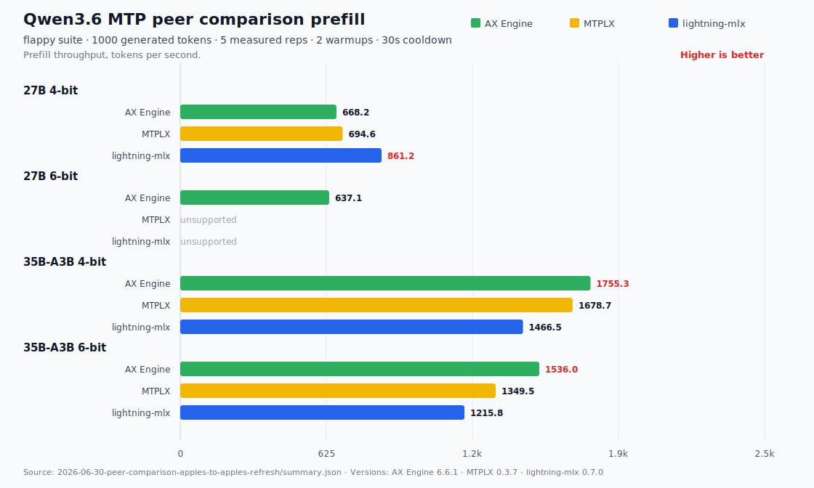
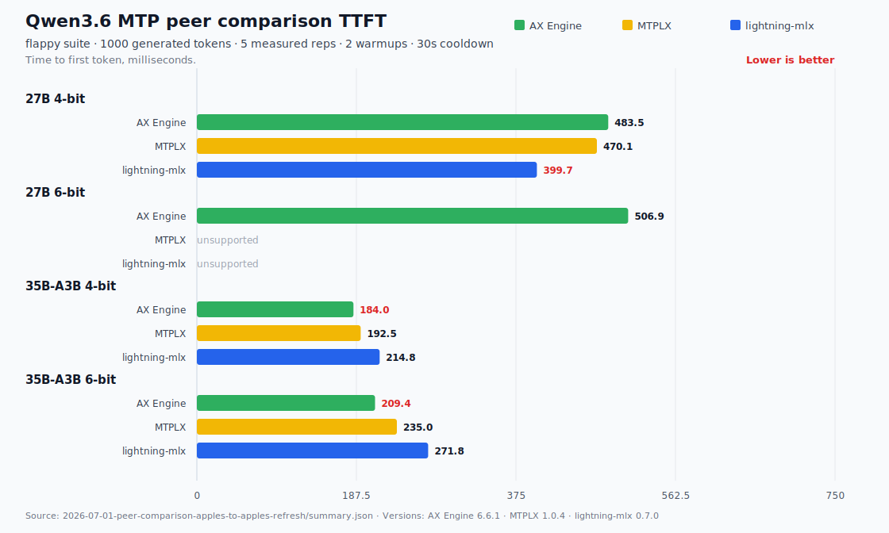
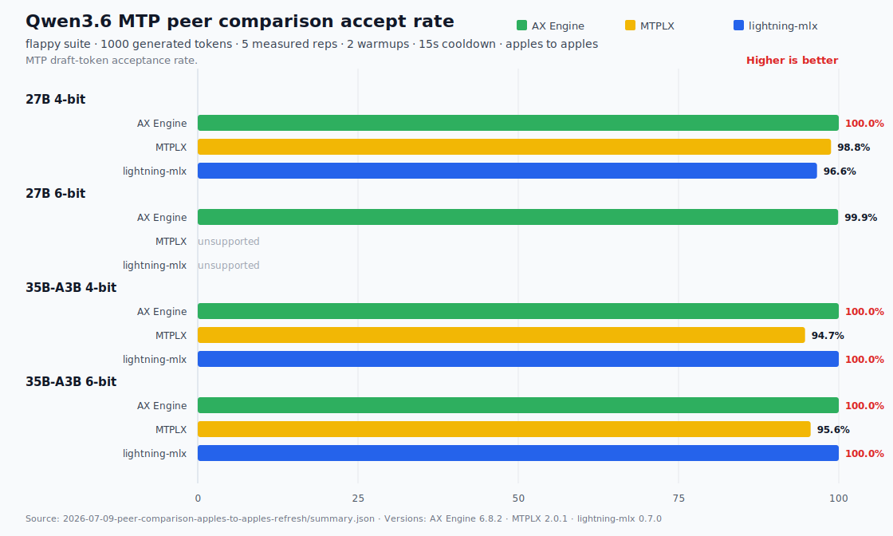

# Qwen3.6 MTP Peer Benchmark

This page holds the full Qwen3.6 MTP peer benchmark results for AX Engine,
MTPLX, and lightning-mlx. The README keeps only the decode-throughput view
because decode is the closest comparable metric across the three engines. The
full result set belongs here because prefill, TTFT, accept rate, model artifact
identity, seed policy, and output-quality gates all need more context than the
README should carry.

This is a stitched peer comparison, not one interleaved physical-session
benchmark. AX Engine rows were refreshed on current code on 2026-07-08; MTPLX
rows were refreshed with MTPLX 2.0.1 on 2026-07-09; lightning-mlx rows are
retained from the prior peer artifacts. The 27B 4-bit rows load the same
`ax-local/Qwen3.6-27B-MTP` sidecar across AX Engine, MTPLX, and lightning-mlx.
The 35B-A3B peer rows remain production-configuration rows using the peer
engines' Youssofal MTPLX-optimized packages. Treat the rows as audit evidence
and trend guidance, not as a single definitive peer-engine ranking.

## Limitations

- **Model artifact identity is target-specific.** The 27B 4-bit MTPLX and
  lightning-mlx rows use the same `ax-local/Qwen3.6-27B-MTP` sidecar as the
  refreshed AX Engine row. The 35B-A3B peer rows still use Youssofal
  MTPLX-optimized packages, so those remain production-configuration rows
  rather than identical-weight engine-only comparisons.
- **AX optimistic verify is not a promoted peer default.** The earlier AX 27B
  4-bit optimistic row entered a periodic whitespace token cycle and inflated
  accept/decode. The current AX rows rerun the same benchmark with strict MTP
  verification (`AX_MLX_MTP_OPTIMISTIC=0`) and pass the output-degeneracy gate.
- **Prefill and TTFT scopes differ.** AX reports runner-internal timing, MTPLX
  derives from server-side `prompt_eval_time_s`, and lightning-mlx reports
  client-observed HTTP stream TTFT. These columns are shown for provenance but
  should not be read as a clean cross-engine prefill/TTFT leaderboard.
- **Seeds differ outside the refreshed rows.** The refreshed AX rows use AX's
  default seed 0; the refreshed MTPLX rows and retained lightning-mlx rows keep
  their source-run seed policy.
- **Composite artifact.** Rows are stitched from multiple runs from
  2026-06-29 through 2026-07-09, not one physical same-session measurement.
- **Dirty builds.** Some stitched raw artifacts were produced from local dirty
  checkouts. Reproducible publication should rerun every engine from clean
  tagged commits.

## Benchmark Contract

| Field | Value |
| --- | --- |
| Prompt suite | `flappy`, first 4 cases |
| Generated tokens | 1000 |
| Warmups / measured reps | 2 warmups, 5 measured |
| Cooldown | 15 s between repetitions, 10 s between prompt cases |
| Sampling | `temperature=0.6`, `top_p=0.95`, `top_k=20` |
| Mode | Pure MTP |
| Prefix cache | Cross-request prefix cache disabled for cold-prefill parity |
| AX optimistic verify | Disabled for refreshed AX peer rows (`AX_MLX_MTP_OPTIMISTIC=0`) |

## Decode Summary

Decode tok/s is the closest comparable metric in this peer set. The refreshed
AX rows are strict and pass the output-degeneracy gate.

| Target | AX Engine | MTPLX | lightning-mlx | Readout |
| --- | ---: | ---: | ---: | --- |
| Qwen3.6 27B 4-bit | 63.0 tok/s | 58.5 tok/s | 55.7 tok/s | Same AX sidecar across all three engines; AX leads this row |
| Qwen3.6 27B 6-bit | 41.8 tok/s | - | - | No official comparable peer 27B 6-bit MTP artifact |
| Qwen3.6 35B-A3B 4-bit | 172.4 tok/s | 137.9 tok/s | 116.2 tok/s | AX leads this production-config row |
| Qwen3.6 35B-A3B 6-bit | 141.2 tok/s | 119.0 tok/s | 96.3 tok/s | AX leads this production-config row |


## Effective Output-Bandwidth Diagnostic

The chart is limited to the 27B rows because they use the same dense sidecar
across engines, so active bytes match and output work can be shown as the bar
metric. The 35B-A3B rows are production-configuration MoE package rows with
different active-byte estimates, so they are kept in the table only and decode
tok/s remains the fair speed metric.

```text
effective output bandwidth = decode tok/s * active target-weight bytes
```

The 577 GB/s reference is a physical-memory reference from the M5 Max MLX
reduction probe. Qwen MTP output-work percentages can exceed it because one
target verifier cycle can commit multiple accepted draft tokens. Treat output
work as audit context, not as an Instruments GPU-utilization chart.


Read output-work percentages above 100% as MTP output leverage, not impossible
memory bandwidth. For the 27B 4-bit rows, each target verifier pass reads about
16.9 GB of weights, but a successful MTP pass can commit several accepted draft
tokens. AX, for example, runs about 16.5 verifier passes/s and emits about
3.8 output tokens/pass, so the physical target-cycle estimate is about
279 GB/s while the output-scaled diagnostic is about 1065 GB/s. The latter is
useful for explaining committed-token work per second, but it is not a claim
that the GPU exceeded the 577 GB/s physical-memory reference.

For 35B-A3B, decode tok/s is the winner metric. Active bytes and output work
are table-only audit fields because a larger active-byte estimate can raise
GB/s even when decode speed is lower.

| Target | Engine | Active target bytes / output token | Decode | Effective output bandwidth | % of 577 GB/s reference | Byte estimate |
| --- | --- | ---: | ---: | ---: | ---: | --- |
| Qwen3.6 27B 4-bit | AX Engine | 16.90 GB | 63.0 tok/s | 1065 GB/s | 185% | Dense total, same sidecar |
| Qwen3.6 27B 4-bit | MTPLX | 16.90 GB | 58.5 tok/s | 988 GB/s | 171% | Dense total, same sidecar |
| Qwen3.6 27B 4-bit | lightning-mlx | 16.90 GB | 55.7 tok/s | 942 GB/s | 163% | Same-sidecar proxy |
| Qwen3.6 35B-A3B 4-bit | AX Engine | 1.74 GB | 172.4 tok/s | 300 GB/s | 52% | AX MoE active estimate |
| Qwen3.6 35B-A3B 4-bit | MTPLX | 2.94 GB | 137.9 tok/s | 406 GB/s | 70% | Peer package MoE active estimate |
| Qwen3.6 35B-A3B 4-bit | lightning-mlx | 2.94 GB | 116.2 tok/s | 342 GB/s | 59% | Retained peer-package proxy |

Readout: for 27B, all three engines use the same dense sidecar, so output work
tracks decode throughput directly. For 35B-A3B, the rows are
production-configuration package rows rather than identical-weight rows; AX has
the fastest decode tok/s, while MTPLX shows higher output work because its
optimized peer package has a larger active-byte estimate. Output work is a
diagnostic when active bytes differ, not the 35B-A3B speed ranking. The JSON
artifact also keeps AX verifier-cycle bandwidth and MTPLX target-cycle estimates
for audit, but those are not promoted as the cross-engine chart because
lightning-mlx lacks retained raw cycle telemetry here.

## Full Result Table

| Target | Engine | Decode | Prefill | TTFT | Accept | Status |
| --- | --- | ---: | ---: | ---: | ---: | --- |
| Qwen3.6 27B 4-bit | AX Engine | 63.0 tok/s | 812.2 tok/s | 396 ms | 100.0% | ok; strict verify; 2026-07-08 refresh |
| Qwen3.6 27B 4-bit | MTPLX | 58.5 tok/s | 676.1 tok/s | 485 ms | 98.8% | ok; same AX sidecar; MTPLX 2.0.1 |
| Qwen3.6 27B 4-bit | lightning-mlx | 55.7 tok/s | 414.9 tok/s | 801 ms | 96.6% | ok; same AX sidecar |
| Qwen3.6 27B 6-bit | AX Engine | 41.8 tok/s | 757.3 tok/s | 426 ms | 99.9% | ok; strict verify; 2026-07-08 refresh |
| Qwen3.6 27B 6-bit | MTPLX | - | - | - | - | No official 27B 6-bit MTP artifact |
| Qwen3.6 27B 6-bit | lightning-mlx | - | - | - | - | No official 27B 6-bit MTP artifact |
| Qwen3.6 35B-A3B 4-bit | AX Engine | 172.4 tok/s | 2,096.7 tok/s | 153 ms | 100.0% | ok; strict verify; 2026-07-08 refresh |
| Qwen3.6 35B-A3B 4-bit | MTPLX | 137.9 tok/s | 1,639.7 tok/s | 191 ms | 94.7% | ok; MTPLX 2.0.1 |
| Qwen3.6 35B-A3B 4-bit | lightning-mlx | 116.2 tok/s | 1,466.5 tok/s | 215 ms | 100.0% | ok |
| Qwen3.6 35B-A3B 6-bit | AX Engine | 141.2 tok/s | 1,828.8 tok/s | 177 ms | 100.0% | ok; strict verify; 2026-07-08 refresh |
| Qwen3.6 35B-A3B 6-bit | MTPLX | 119.0 tok/s | 1,480.6 tok/s | 221 ms | 95.6% | ok; MTPLX 2.0.1 |
| Qwen3.6 35B-A3B 6-bit | lightning-mlx | 96.3 tok/s | 1,215.8 tok/s | 272 ms | 100.0% | ok |

## Full Charts

These charts are intentionally kept off the README because prefill, TTFT, and
accept rate need the limitations above to be interpreted correctly.







## Artifacts

- Combined summary:
  [`summary.md`](../../benchmarks/results/mtp-qwen36-matrix/2026-07-09-peer-comparison-apples-to-apples-refresh/summary.md),
  [`summary.json`](../../benchmarks/results/mtp-qwen36-matrix/2026-07-09-peer-comparison-apples-to-apples-refresh/summary.json)
- Decode and output-work diagnostic:
  [`bandwidth_diagnostic.json`](../../benchmarks/results/mtp-qwen36-matrix/2026-07-09-peer-comparison-apples-to-apples-refresh/bandwidth_diagnostic.json)
- AX 2026-07-08 current-code rerun:
  [`summary.md`](../../benchmarks/results/mtp-qwen36-matrix/2026-07-08-qwen36-mtp-ax-current-code-refresh/summary.md)
- MTPLX 2.0.1 rerun:
  [`summary.md`](../../benchmarks/results/mtp-qwen36-matrix/2026-07-09-mtplx-v2-refresh/summary.md)
- Retained lightning-mlx peer rows are carried inside the stitched summary
  above; lightning-mlx was not rerun in the 2026-07-09 MTPLX refresh.

## What Would Make This Fully Fair

To promote the whole matrix as a strict peer-engine benchmark, rerun every
target and engine with:

- the same target weights and the same draft-head weights for every target;
- the same per-repetition seed sequence;
- output-degeneracy gate passing on every promoted row;
- one clean tagged build per engine;
- one physical session with interleaved runs;
- either a common client-observed TTFT/prefill contract or separate internal
  and client-observed columns.
