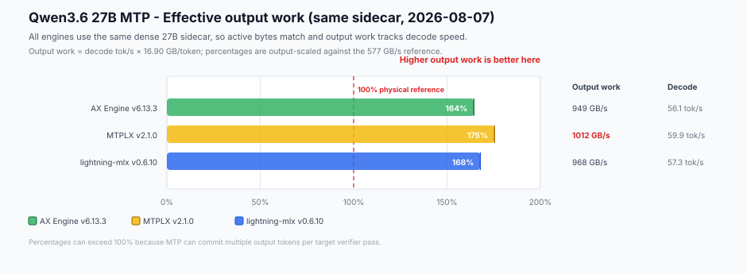
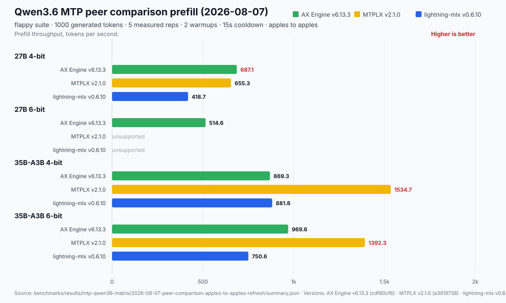
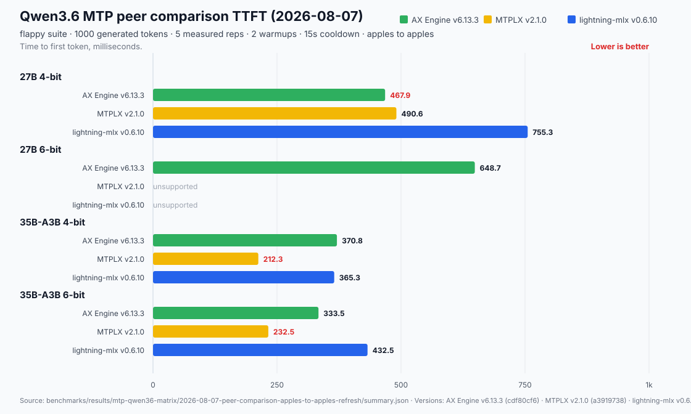
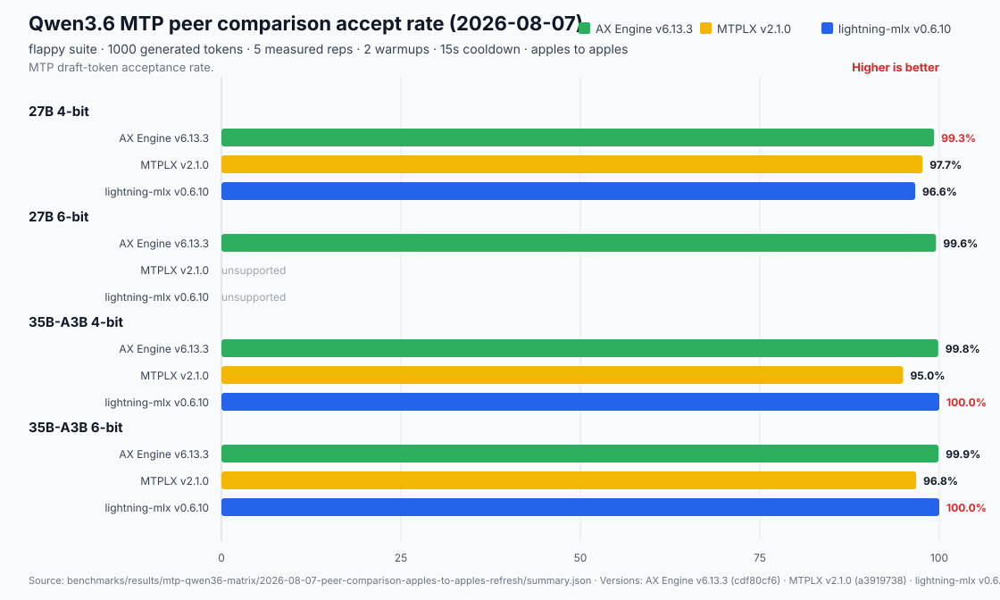

# Qwen3.6 MTP Peer Benchmark

This page holds the full Qwen3.6 MTP peer benchmark results for AX Engine,
MTPLX, and lightning-mlx. This page keeps only the decode-throughput view
because decode is the closest comparable metric across the three engines. The
full result set belongs here because prefill, TTFT, accept rate, model artifact
identity, seed policy, and output-quality gates all need more context than the
README should carry.

All supported rows were rerun serially on one Apple M5 Max 128 GB host on
2026-08-07. Every lane records clean tracked source provenance, passing
start/end load and CPU gates, AC power, no thermal warning, the same seed-0
prompt/sampling contract, 2 warmups, 5 measurements, and the required
cooldowns. Measured identities are AX Engine 6.13.3 (`cdf80cf6`), MTPLX 2.1.0
(`a3919738`), and lightning-mlx 0.6.10 (`ec19b3d8`).

The 27B 4-bit rows load the same verified
`ax-local/Qwen3.6-27B-MTP` BF16 sidecar across all three engines. The 35B-A3B
peer rows remain production-configuration rows: AX uses its BF16 sidecar,
while MTPLX and lightning-mlx use the matching Youssofal optimized package.
Treat the result as a clean dated campaign, not a universal engine ranking.

## Limitations

- **Model artifact identity is target-specific.** The 27B 4-bit MTPLX and
  lightning-mlx rows use the same verified `ax-local/Qwen3.6-27B-MTP`
  sidecar as AX Engine. The 35B-A3B peer rows use Youssofal
  MTPLX-optimized packages, so those remain production-configuration rows
  rather than identical-weight engine-only comparisons.
- **AX uses the exact verifier.** The current rows use strict distribution-exact
  MTP verification (`AX_MLX_MTP_OPTIMISTIC=0`) and the validated Qwen
  linear-attention exact profile. Every supported row passes the
  output-degeneracy gate.
- **Prefill and TTFT scopes differ.** AX reports runner-internal timing, MTPLX
  derives from server-side `prompt_eval_time_s`, and lightning-mlx reports
  client-observed HTTP stream TTFT. These columns are shown for provenance but
  should not be read as a clean cross-engine prefill/TTFT leaderboard.
- **Serial, not randomized interleaving.** All rows come from one physical
  campaign and pass lane-boundary condition gates, but engines are serialized
  rather than randomized at every repetition.
- **Version-specific result.** The superseded 2026-07-09 matrix used older
  versions, stitched sessions, and dirty builds. Comparing its ranking with
  this campaign shows dated-artifact movement, not an isolated code regression.

## Benchmark Contract

| Field | Value |
| --- | --- |
| Prompt suite | `flappy`, first 4 cases |
| Generated tokens | 1000 |
| Warmups / measured reps | 2 warmups, 5 measured |
| Cooldown | 15 s between repetitions, 10 s between prompt cases |
| Sampling | `temperature=0.6`, `top_p=0.95`, `top_k=20` |
| Seed | 0 for all engines |
| Mode | Pure MTP |
| Prefix cache | Cross-request prefix cache disabled for cold-prefill parity |
| AX optimistic verify | Disabled (`AX_MLX_MTP_OPTIMISTIC=0`) |
| Host gates | Load average ≤2.0 and top process CPU ≤50% before and after each lane |

## Decode Summary

Decode tok/s is the closest comparable metric in this peer set. The refreshed
AX rows are strict and all supported lanes pass the output-degeneracy gate.

| Target | AX Engine | MTPLX | lightning-mlx | Readout |
| --- | ---: | ---: | ---: | --- |
| Qwen3.6 27B 4-bit | 56.1 tok/s | **59.9 tok/s** | 57.3 tok/s | Same BF16 sidecar; AX trails MTPLX 6.3% and lightning-mlx 2.0% |
| Qwen3.6 27B 6-bit | 44.8 tok/s | - | - | No official comparable peer 27B 6-bit MTP artifact |
| Qwen3.6 35B-A3B 4-bit | 140.9 tok/s | **145.1 tok/s** | 124.2 tok/s | AX trails MTPLX 2.9%; leads lightning-mlx 13.4% |
| Qwen3.6 35B-A3B 6-bit | 120.5 tok/s | **125.2 tok/s** | 102.0 tok/s | AX trails MTPLX 3.7%; leads lightning-mlx 18.2% |


Across the three comparable rows, AX is 4.3% lower than MTPLX and 9.5%
higher than lightning-mlx by geometric mean. AX therefore loses all three
current MTPLX comparisons, while beating lightning-mlx on both 35B-A3B rows.

## Effective Output-Bandwidth Diagnostic

The chart is limited to the 27B rows because they use the same dense sidecar
across engines, so active bytes match and output work can be shown as the bar
metric. The active-byte value is identical for every 27B row, so it is omitted
from the chart. The 35B-A3B rows are production-configuration MoE package rows
with different active-byte estimates, so they are kept in the table only and
decode tok/s remains the fair speed metric.

```text
effective output bandwidth = decode tok/s * active target-weight bytes
```

The 577 GB/s reference is a physical-memory reference from the M5 Max MLX
reduction probe. Qwen MTP output-work percentages can exceed it because one
target verifier cycle can commit multiple accepted draft tokens. Treat output
work as audit context, not as an Instruments GPU-utilization chart.



Read output-work percentages above 100% as MTP output leverage, not impossible
memory bandwidth. For the 27B 4-bit rows, each target verifier pass reads about
16.9 GB of weights, but a successful MTP pass can commit several accepted
draft tokens. AX runs about 14.8 verifier passes/s and emits about 3.8 output
tokens/pass, so its physical verifier-cycle estimate is about 251 GB/s while
the output-scaled diagnostic is about 949 GB/s. MTPLX's output-scaled value is
about 1,012 GB/s. These are useful for explaining committed-token work per
second, but they are not claims that the GPU exceeded the 577 GB/s
physical-memory reference.

For 35B-A3B, decode tok/s is the winner metric. Active bytes and output work
are table-only audit fields because a larger active-byte estimate can raise
GB/s even when decode speed is lower.

| Target | Engine | Active target bytes / output token | Decode | Effective output bandwidth | % of 577 GB/s reference | Byte estimate |
| --- | --- | ---: | ---: | ---: | ---: | --- |
| Qwen3.6 27B 4-bit | AX Engine | 16.90 GB | 56.1 tok/s | 949 GB/s | 164% | Dense total, same sidecar |
| Qwen3.6 27B 4-bit | MTPLX | 16.90 GB | 59.9 tok/s | 1,012 GB/s | 175% | Dense total, same sidecar |
| Qwen3.6 27B 4-bit | lightning-mlx | 16.90 GB | 57.3 tok/s | 968 GB/s | 168% | Same-sidecar proxy |
| Qwen3.6 35B-A3B 4-bit | AX Engine | 1.74 GB | 140.9 tok/s | 245 GB/s | 42% | AX MoE active estimate |
| Qwen3.6 35B-A3B 4-bit | MTPLX | 2.94 GB | 145.1 tok/s | 427 GB/s | 74% | Peer package MoE active estimate |
| Qwen3.6 35B-A3B 4-bit | lightning-mlx | 2.94 GB | 124.2 tok/s | 366 GB/s | 63% | Peer-package proxy |

Readout: for 27B, all three engines use the same dense sidecar, so output work
tracks decode throughput directly. For 35B-A3B, the rows are
production-configuration package rows rather than identical-weight rows; MTPLX
has the fastest decode tok/s and also uses a larger active-byte estimate.
Output work is a diagnostic when active bytes differ, not an engine-efficiency
ranking. The JSON
artifact also keeps AX verifier-cycle bandwidth and MTPLX target-cycle estimates
for audit, but those are not promoted as the cross-engine chart because
lightning-mlx lacks comparable raw cycle telemetry here.

## Full Result Table

| Target | Engine | Decode | Prefill | TTFT | Accept | Status |
| --- | --- | ---: | ---: | ---: | ---: | --- |
| Qwen3.6 27B 4-bit | AX Engine | 56.1 tok/s | 687.1 tok/s | 468 ms | 99.3% | ok; strict exact verify; clean source |
| Qwen3.6 27B 4-bit | MTPLX | 59.9 tok/s | 655.3 tok/s | 491 ms | 97.7% | ok; same verified BF16 sidecar; clean MTPLX 2.1.0 |
| Qwen3.6 27B 4-bit | lightning-mlx | 57.3 tok/s | 418.7 tok/s | 755 ms | 96.6% | ok; same verified BF16 sidecar; clean 0.6.10 |
| Qwen3.6 27B 6-bit | AX Engine | 44.8 tok/s | 514.6 tok/s | 649 ms | 99.6% | ok; strict exact verify; clean source |
| Qwen3.6 27B 6-bit | MTPLX | - | - | - | - | No official 27B 6-bit MTP artifact |
| Qwen3.6 27B 6-bit | lightning-mlx | - | - | - | - | No official 27B 6-bit MTP artifact |
| Qwen3.6 35B-A3B 4-bit | AX Engine | 140.9 tok/s | 869.3 tok/s | 371 ms | 99.8% | ok; strict exact verify; clean source |
| Qwen3.6 35B-A3B 4-bit | MTPLX | 145.1 tok/s | 1,534.7 tok/s | 212 ms | 95.0% | ok; optimized Speed package; clean MTPLX 2.1.0 |
| Qwen3.6 35B-A3B 4-bit | lightning-mlx | 124.2 tok/s | 881.8 tok/s | 365 ms | 100.0% | ok; optimized Speed package; clean 0.6.10 |
| Qwen3.6 35B-A3B 6-bit | AX Engine | 120.5 tok/s | 969.6 tok/s | 334 ms | 99.9% | ok; strict exact verify; clean source |
| Qwen3.6 35B-A3B 6-bit | MTPLX | 125.2 tok/s | 1,392.3 tok/s | 233 ms | 96.8% | ok; optimized Balance package; clean MTPLX 2.1.0 |
| Qwen3.6 35B-A3B 6-bit | lightning-mlx | 102.0 tok/s | 750.6 tok/s | 432 ms | 100.0% | ok; optimized Balance package; clean 0.6.10 |

## Full Charts

These charts are intentionally kept off the root README because prefill, TTFT, and
accept rate need the limitations above to be interpreted correctly.







## Artifacts

- Clean serialized campaign:
  [`summary.md`](../../benchmarks/results/mtp-qwen36-matrix/2026-08-07-peer-comparison-apples-to-apples-refresh/summary.md),
  [`summary.json`](../../benchmarks/results/mtp-qwen36-matrix/2026-08-07-peer-comparison-apples-to-apples-refresh/summary.json)
- Decode and output-work diagnostic:
  [`bandwidth_diagnostic.json`](../../benchmarks/results/mtp-qwen36-matrix/2026-08-07-peer-comparison-apples-to-apples-refresh/bandwidth_diagnostic.json)

The campaign directory also contains each raw AX, MTPLX, and lightning-mlx
lane artifact, prompt-suite outputs, build/source provenance, host-condition
snapshots, and output-degeneracy evidence. No supported row is retained from an
older session.

## What Would Make This Fully Fair

To promote the whole matrix as a strict peer-engine benchmark, rerun every
target and engine with:

- the same target weights and the same draft-head weights for every target;
- a randomized or balanced per-repetition engine order;
- output-degeneracy gate passing on every promoted row;
- one clean tagged build per engine;
- identical 35B-A3B sidecar precision and packaging across engines;
- either a common client-observed TTFT/prefill contract or separate internal
  and client-observed columns.
